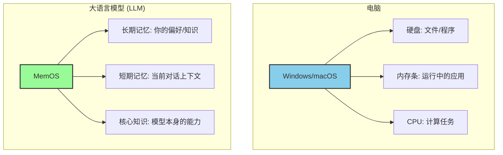
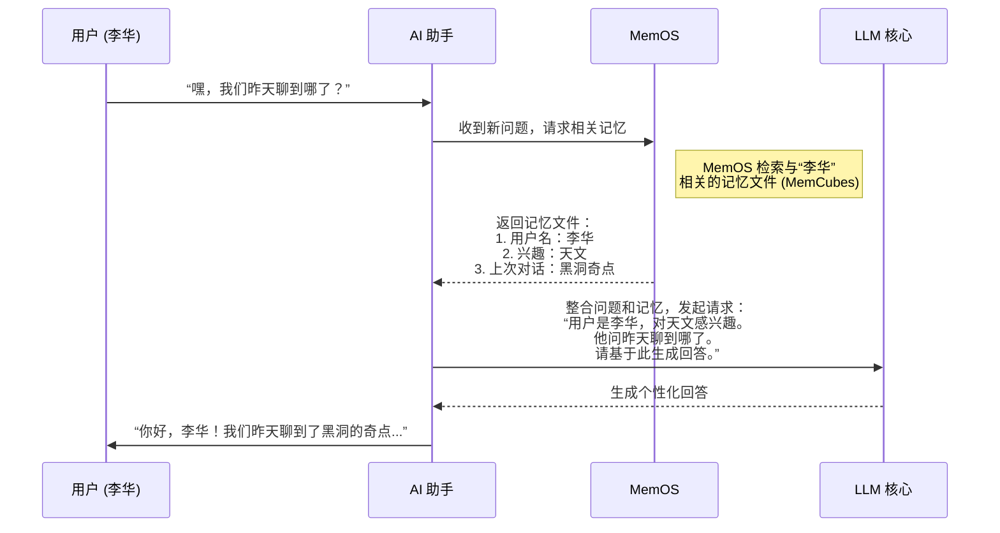

# Chapter 1: MemOS (大模型内存操作系统)


欢迎来到 MemOS 的世界！如果你曾感觉和 AI 聊天像是在和一条金鱼说话——它总是很快忘记你们聊过什么，那么你来对地方了。本章将带你初识 MemOS，一个旨在赋予大语言模型（LLM）持久记忆能力的“大脑操作系统”。

## 为什么大模型需要一个“操作系统”？

让我们从一个简单的场景开始。想象一下，你正在使用一个非常先进的 AI 助手。

**第一天，你对它说：**
> “你好！我叫李华。我是一个天文爱好者，最近在学习关于黑洞的知识。哦对了，我还有一只叫‘彗星’的猫。”

AI 助手给出了非常棒的回答，详细解释了黑洞的视界和奇点。你心满意足地结束了对话。

**第二天，你再次打开对话框，问道：**
> “嘿，我们昨天聊到哪了？能给我多讲讲吗？顺便问一下，你知道怎么照顾小猫吗？”

这时候，尴尬的事情发生了。标准的 AI 助手会一脸茫然地回答：
> “你好！我们昨天没有聊过天。关于什么话题，您想让我多讲讲呢？关于照顾小猫，你需要准备猫粮、猫砂盆……”

它完全忘了你是谁，忘了你们聊过的黑洞，也忘了你提到过的宠物“彗星”。每一次对话都是一次“初见”。这种“失忆症”极大地限制了 AI 成为一个真正智能、能够与我们共同成长的伙伴。

**而 MemOS 的目标，就是解决这个问题。**

如果这个 AI 助手搭载了 MemOS，它的回答会是这样的：
> “你好，李华！我们昨天聊到了黑洞的奇点。很乐意为你深入讲解。至于你的猫咪‘彗星’，照顾它需要注意饮食、定期驱虫和接种疫苗，还要给它足够的陪伴哦！”

看到区别了吗？它记住了你的名字、兴趣，甚至你宠物的名字。这不再是一个冷冰冰的问答工具，而是一个拥有记忆、能够理解上下文的智能体。

## MemOS 是什么？一个为 AI 大脑打造的操作系统

**MemOS** 的全称是 **大模型内存操作系统 (Memory Operating System)**。

你可以把它想象成电脑的 Windows 或 macOS。我们都知道，电脑操作系统管理着硬盘（长期存储）、内存条（临时运行空间）、CPU（计算）以及各种软件，让它们协同工作。

同样地，**MemOS 就是专门为大语言模型（LLM）管理和调度各种“记忆”的操作系统。**



它的核心思想非常简单：**将“内存”或“记忆”视为一种可以被独立管理、调度和操作的核心资源。**

这些“记忆”可以是你告诉 AI 的个人信息、一次重要的对话记录，也可以是一个知识文档，甚至是 AI 在解决某个问题时的“思考过程”。MemOS 会把这些零散的信息统一管理起来，让 LLM 在需要时能够随时取用。

## MemOS 的核心思想：像管理文件一样管理记忆

在没有 MemOS 的世界里，AI 的记忆是混乱的。对话历史、植入的知识、模型本身的参数……它们都混杂在一起，难以区分和管理。

MemOS 做的第一件事，就是将这些不同形式的记忆进行分类和封装。它定义了最核心的三种内存类型，我们将在 [三大核心内存类型](02_三大核心内存类型_.md) 章节中详细介绍它们：

1.  **参数化内存 (Parametric Memory)**：模型通过训练学习到的“本能”知识，比如语言能力和常识。这像是人类的内隐记忆。
2.  **激活内存 (Activation Memory)**：模型在处理当前任务时的“工作记忆”，比如对话的上下文。这像是我们脑海里正在思考的事情，非常短暂。
3.  **明文内存 (Plaintext Memory)**：从外部世界获取的、可读的知识，比如你上传的 PDF 文档或你的个人偏好记录。这像是我们做的笔记，可以随时查阅和修改。

MemOS 会将这些记忆打包成一个个标准化的单元，称为 [MemCube (内存立方)](03_memcube__内存立方__.md)。你可以把 `MemCube` 想象成一个带有详细标签的“记忆文件”。

让我们看看之前李华的例子，MemOS 是如何工作的：

**第 1 步：捕捉信息并创建“记忆文件”**

当李华说出自己的信息时，MemOS 会像一个敏锐的秘书，立刻捕捉到关键点，并创建几个 `MemCube`。

```
// 伪代码：MemOS 创建记忆的过程

// 用户输入: "我叫李华。我是一个天文爱好者...我还有一只叫‘彗星’的猫。"

MemOS.创建记忆({
  元数据: { 来源: "对话#1", 时间: "2024-10-26", 类型: "用户身份" },
  内容: "用户名: 李华"
});

MemOS.创建记忆({
  元数据: { 来源: "对话#1", 时间: "2024-10-26", 类型: "用户偏好" },
  内容: "兴趣: 天文"
});

MemOS.创建记忆({
  元数据: { 来源: "对话#1", 时间: "2024-10-26", 类型: "相关实体" },
  内容: "宠物名: 彗星 (猫)"
});
```
这段伪代码展示了 MemOS 如何将一段自然语言拆解成结构化的、带标签的记忆单元。每个单元都有“元数据”（描述这份记忆的信息）和“内容”。

**第 2 步：在需要时检索并使用记忆**

第二天，当李华再次提问时，MemOS 的内部流程是这样的：



这个流程清晰地展示了 MemOS 的价值：

1.  **解耦 (Decoupling)**：AI 助手本身不需要操心如何存储记忆，它只需要向 MemOS 请求即可。
2.  **上下文增强 (Context Augmentation)**：MemOS 将相关的历史记忆“注入”到当前的对话中，让 LLM 获得远超当前对话窗口的上下文信息。
3.  **个性化 (Personalization)**：基于这些记忆，LLM 的回答不再是千篇一律的，而是为你量身定制的。

## MemOS 的蓝图：不止于记忆

MemOS 的设计远不止于简单的存储和读取。它拥有一套完整的架构，就像一个真正的操作系统，包含了调度、治理和存储等多个层面。我们会在 [MemOS 三层架构](04_memos_三层架构_.md) 章节中深入探讨。

简单来说，MemOS 包含：

*   **接口层 (Interface Layer)**：负责理解用户的请求，将其翻译成对“记忆”的增、删、改、查操作。
*   **操作层 (Operation Layer)**：核心调度中心，决定在何时、何种场景下加载哪些记忆。这里的 [MemScheduler (内存调度器)](05_memscheduler__内存调度器__.md) 就像是交通警察，指挥着记忆的流动。
*   **基础设施层 (Infrastructure Layer)**：负责记忆的底层存储、安全和权限管理。这里的 [MemGovernance (内存治理)](06_memgovernance__内存治理__.md) 确保了记忆的安全和合规使用。

通过这套体系，MemOS 的目标是让大语言模型从一个只能“应答”的工具，转变为一个能够**记忆、学习并持续成长的智能体**。

## 总结

在本章中，我们一起了解了 MemOS 的基本概念和它要解决的核心问题——大语言模型的“失忆症”。

*   **核心问题**：传统的 LLM 缺乏长期记忆能力，无法在多次交互中保持连续性和个性化。
*   **MemOS 的解决方案**：像电脑操作系统管理文件一样，将“记忆”作为一种核心资源进行统一管理、调度和治理。
*   **核心思想**：通过将不同类型的记忆（参数化、激活、明文）封装成标准单元（`MemCube`），实现记忆的生命周期管理，从而赋予 AI 持续学习和进化的能力。

现在，你已经对 MemOS 有了一个初步的印象。它就像是为 AI 大脑量身定做的“记忆宫殿”和“管家”。

在下一章中，我们将深入探索构成这座宫殿的三种基本砖块。

准备好了吗？让我们一起进入 [第二章：三大核心内存类型](02_三大核心内存类型_.md)。

---

Generated by [AI Codebase Knowledge Builder](https://github.com/The-Pocket/Tutorial-Codebase-Knowledge)