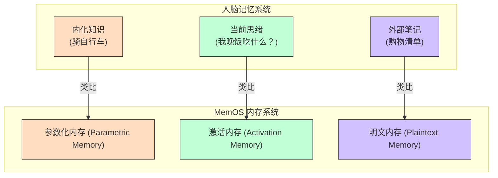
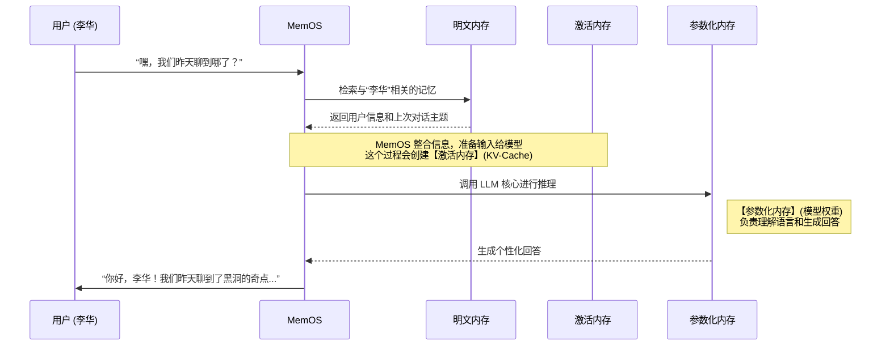

# Chapter 2: 三大核心内存类型


在 [第一章：MemOS (大模型内存操作系统)](01_memos__大模型内存操作系统__.md) 中，我们了解了 MemOS 的使命：为大模型安装一个“记忆大脑”，解决其“过目就忘”的毛病。我们把“记忆”看作一种可以被管理的资源，就像电脑管理文件一样。

但是，“记忆”本身是一个很宽泛的概念。我们人类的记忆就分好几种：有些是学过就忘不了的技能（比如骑车），有些是脑子里一闪而过的念头，还有些是记在笔记本上备忘的事情。

为了能精细地管理大模型的记忆，MemOS 做的第一件事就是 **对记忆进行分类**。它将模型所有可能用到的记忆，划分为了三种最核心的类型。理解这三种内存，是掌握 MemOS 的关键第一步。

让我们用一个生动的比喻来开启本章：

想象一下你的大脑是如何工作的：
*   **内化的知识**：你学会的语言、常识、走路、骑车等技能。这些知识已经成为你的一部分，使用时几乎不需要思考。这就是 **参数化内存**。
*   **脑中的思绪**：你现在正在思考“这三种内存是什么？”，这个念头就是你的临时工作记忆。它很短暂，只为当前任务服务。这就是 **激活内存**。
*   **随身的笔记**：你记在手机备忘录或实体笔记本上的信息，比如朋友的电话、会议要点、购物清单。它们独立于你的大脑，可以随时查阅、修改和分享。这就是 **明文内存**。

MemOS 就是围绕这三种内存类型，构建起一个完整的管理体系。



现在，让我们逐一深入了解这三种内存。

## 1. 参数化内存 (Parametric Memory)：模型的“内功”

**参数化内存**，顾名思义，是**固化在模型参数（权重）里**的知识。这部分记忆是模型在“预训练”阶段，通过学习海量数据（如书籍、网页、代码）而获得的。

*   **特点**：静态、隐式、通用。
*   **好比**：人类的常识、语言能力、逻辑推理能力。你不需要去“回忆”怎么说中文，它已经成为了你的本能。
*   **在 LLM 中的体现**：
    *   语言理解和生成能力。
    *   世界知识，比如“地球是圆的”、“中国的首都是北京”。
    *   通过微调（Fine-tuning）或 LoRA 等技术注入的特定领域知识（如医疗、法律知识）。

这部分内存是模型能力的基石，决定了模型“懂什么”和“会什么”。但它的缺点也很明显：**更新困难**。就像改变一个人的思维定式很难一样，要更新模型的参数化内存，通常需要重新训练或进行复杂的操作，成本非常高。

在第一章李华的例子中，当 AI 助手解释“黑洞的视界和奇点”时，它动用的就是自己的参数化内存。这些天文学知识是它在训练时就已经学到的。

```python
# 伪代码：参数化内存的作用

# 用户提问
user_query = "什么是黑洞？"

# LLM 直接利用其内部权重（参数化内存）来回答
# 它不需要去外部查找资料，因为这些知识已经“内化”了
response = LLM.generate(
    prompt=user_query
) 
# -> 输出关于黑洞的详细解释...
```
这段伪代码展示了参数化内存的直接性。模型接收到一个问题，直接利用其内部已经存在的知识储备生成答案。

## 2. 激活内存 (Activation Memory)：模型的“工作记忆”

**激活内存** 是模型在**处理单个任务（即推理时）**产生的**临时性、动态**的记忆。它就像我们为了完成一件事而在脑海里保留的短期信息。

*   **特点**：短暂、动态、与任务相关。
*   **好比**：你计算 `135 + 246` 时，脑子里记下的进位；或者你读一句话时，会记住前半句，才能理解后半句。一旦任务完成，这些“思绪”就会消失。
*   **在 LLM 中的体现**：
    *   **KV-Cache**：这是最典型的激活内存。它缓存了注意力机制的中间计算结果，使得模型在生成长序列时，不必重复计算已经处理过的内容，从而大大加快了速度。
    *   **隐藏状态 (Hidden States)**：神经网络中每一层的输出，包含了对当前输入上下文的丰富编码。

激活内存对于保持对话的连贯性至关重要，但它通常受限于模型的“上下文窗口”（Context Window）。一旦对话超出了这个窗口长度，或者一次会话结束，这部分记忆就会被丢弃。这就是为什么标准 LLM 会“失忆”的直接原因。

回到李华的例子，当 AI 回答“能给我多讲讲吗？”时，它需要知道“我们刚才在聊黑洞”，这个“刚才聊的话题”就存储在激活内存中。

```python
# 伪代码：激活内存的作用

# 假设上下文窗口中已经有了上一轮对话
context = "用户：你好，我叫李华，对黑洞感兴趣。\nAI: 你好李华！黑洞是..."

# 用户继续提问
user_query = "能给我多讲讲吗？"

# LLM 在处理这个新问题时，会创建激活内存（如 KV-Cache）
# 这个激活内存包含了对 context 的理解
# 这样它才知道 "多讲讲" 指的是 "多讲讲黑洞"
response = LLM.generate(
    prompt=context + "\n用户：" + user_query
)
# -> 输出关于黑洞的更多细节...
```
在这里，`context` 的内容被加载到模型的“工作区”，形成了激活内存，指导着后续内容的生成。

## 3. 明文内存 (Plaintext Memory)：模型的“外部笔记本”

**明文内存** 是指那些**从外部获取、以可读格式存储**的显式知识。它独立于模型本身，可以被轻松地创建、读取、更新和删除（CRUD）。

*   **特点**：显式、可编辑、持久。
*   **好比**：你的个人笔记、通讯录、或者一本可以随时翻阅的参考书。
*   **在 LLM 中的体现**：
    *   **检索增强生成 (RAG)** 中被检索的文档（如 PDF, TXT）。
    *   存储在向量数据库或传统数据库中的用户个人资料、对话历史、知识图谱等。
    *   Prompt 模板。

明文内存完美地弥补了另外两种内存的不足。它解决了参数化内存更新困难和激活内存短暂易逝的问题。通过引入明文内存，我们可以赋予模型持久的、可控的记忆能力。

在李华的例子中，MemOS 将“用户叫李华”、“兴趣是天文”、“宠物猫叫彗星”这些关键信息，都存储为了**明文内存**。

```python
# 伪代码：明文内存的作用

# 第二天，李华发起了新的对话
user_query = "嘿，我们昨天聊到哪了？"

# 1. MemOS 识别出用户是“李华”，并从其“笔记本”（明文内存）中检索信息
user_profile = MemOS.retrieve_plaintext("user_id: 李华")
# user_profile -> { "name": "李华", "interests": ["天文"], "last_topic": "黑洞奇点" }

# 2. 将检索到的信息整合进 prompt
final_prompt = f"""
已知用户信息：{user_profile}。
用户现在问：{user_query}
请根据以上信息回答。
"""

# 3. LLM 基于增强后的 prompt 生成个性化回答
response = LLM.generate(final_prompt)
# -> "你好，李华！我们昨天聊到了黑洞的奇点..."
```
看到了吗？明文内存就像是给模型递过去一张“小抄”，让它在回答问题前能先“备备课”，从而实现跨会话的记忆。

## 三者如何协同工作

在一次真实的交互中，这三种内存是紧密协作、缺一不可的。MemOS 的核心职责之一，就是高效地调度它们。

让我们用一个序列图来完整地描绘李华第二天提问时，MemOS 内部的运作流程：


这个流程清晰地展示了：
1.  **MemOS** 充当总指挥。
2.  **明文内存** 提供持久化的、个性化的上下文信息。
3.  **激活内存** 管理当前的、临时的对话状态。
4.  **参数化内存** 提供底层的语言和知识能力。

这三者共同构成了一个功能完备、层次分明的记忆体系，让大模型从一个“只懂计算”的处理器，变成了一个“懂得记忆和思考”的智能体。

## 总结

在本章中，我们深入探讨了 MemOS 的三大核心内存类型，它们是整个系统的基石。

*   **参数化内存**：模型的“内功”，是固化在权重中的**长期、隐式知识**，决定了模型的基础能力。
*   **激活内存**：模型的“工作记忆”，是推理时产生的**短期、临时状态**，负责维持当前任务的连贯性。
*   **明文内存**：模型的“外部笔记”，是独立存储的**长期、显式知识**，赋予模型持久化和可编辑的记忆。

理解这三种内存的定义、特点和相互关系，对于后续学习 MemOS 的工作原理至关重要。

但是，现在我们有了三种不同格式、不同生命周期的内存，如何用一个统一的方式来管理和操作它们呢？这就像我们有文本文档、图片、视频等不同类型的文件，需要一个统一的“文件”概念来封装它们。

为此，MemOS 提出了一个标准化的内存封装单元。在下一章，我们将揭开它的神秘面纱。

准备好迎接 [第三章：MemCube (内存立方)](03_memcube__内存立方__.md) 了吗？

---

Generated by [AI Codebase Knowledge Builder](https://github.com/The-Pocket/Tutorial-Codebase-Knowledge)