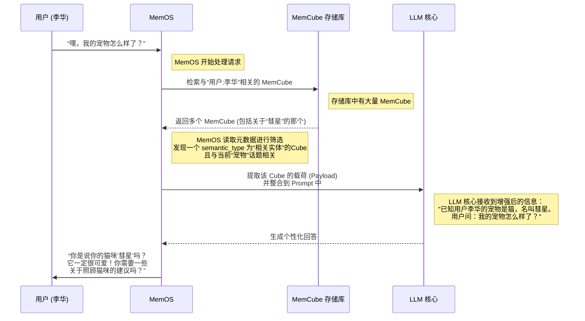

# Chapter 3: MemCube (内存立方)


在上一章 [三大核心内存类型](02_三大核心内存类型_.md) 中，我们认识了 MemOS 管理的三种记忆：如同“内功”的**参数化内存**、如同“临时思绪”的**激活内存**，以及如同“随身笔记”的**明文内存**。

这三种记忆的来源、格式和生命周期都大相径庭。这就带来了一个新的挑战：系统该如何用一套统一的方法来处理这些五花八门的记忆呢？总不能为每种记忆都设计一套独立的管理工具吧？那就太混乱了。

为了解决这个问题，MemOS 引入了一个绝妙的设计：**MemCube (内存立方)**。

## 什么是 MemCube？记忆的“标准化快递包裹”

想象一下，你在管理一个巨大的仓库，里面有各种各样的物品：有书籍（知识），有信件（对话），有工具（模型能力）。如果它们都杂乱无章地堆放着，找东西会是一场噩梦。

一个聪明的仓库管理员会怎么做？他会把每样物品都放进一个**标准尺寸的箱子**里，并在箱子上贴一张**详细的标签**。标签上会写明：
*   里面装的是什么？（内容描述）
*   什么时候入库的？（创建时间）
*   从哪里来的？（来源）
*   谁有权限打开它？（访问权限）
*   这个箱子有多重要？（优先级）


这样一来，管理员无需打开每个箱子，只需扫一眼标签，就能高效地对所有物品进行分类、查找、排序和管理。

**MemCube 就是 MemOS 系统中那个标准化的“箱子”和“标签”**。它将所有不同类型的记忆（无论是对话历史、模型知识还是外部文档）都封装成统一的格式，并附带了详细的元数据（也就是那张标签）。

通过 MemCube，MemOS 实现了对所有异构记忆的统一调度、追踪和管理。它是整个 MemOS 系统中最基础、最核心的数据单元。

## MemCube 的结构：标签 + 内容物

一个 MemCube 主要由两部分构成，就像一个快递包裹一样：**元数据头 (Metadata Header)** 和 **内存载荷 (Memory Payload)**。

```mermaid
graph TD
    subgraph MemCube (内存立方)
        A[元数据头<br/>(Metadata Header)]
        B[内存载荷<br/>(Memory Payload)]
    end

    A -- "描述" --> B

    style A fill:#D2E9FF,stroke:#333
    style B fill:#FFDAB9,stroke:#333
```

让我们来分别看看这两部分。

### 1. 元数据头 (Metadata Header)：详细的“记忆标签”

元数据头就是贴在 MemCube 上的那张标签，它记录了关于这份记忆的所有“描述性信息”，但**不包含记忆本身的内容**。这使得系统可以快速读取和筛选，而无需加载和解析沉重的记忆内容。

这张标签主要包含以下几类信息：
*   **描述性信息**：用来识别这份记忆的基本身份。
    *   `created`: 创建时间（例如："2024-10-27"）
    *   `source`: 来源（例如：来自"对话#3894" 或 "用户上传的PDF文件"）
    *   `type`: 语义类型（例如："用户偏好"、"任务指令"、"领域知识"）
*   **治理性信息**：用于控制记忆的安全和生命周期。
    *   `access`: 访问权限（例如：只有"用户A"和"管理员"可以访问）
    *   `expires`: 过期时间（例如："2025-06-01" 之后自动失效）
    *   `priority`: 优先级（例如：高、中、低）
*   **行为性信息**：记录这份记忆被使用的情况。
    *   `last_used`: 上次使用时间
    *   `usage`: 使用频率（例如：已被调用78次）

有了这些元数据，MemOS 就能轻松实现复杂的管理策略，比如“优先加载最近被频繁使用的高优先级记忆”或“自动清理掉那些一个月未被访问且已过期的低权限记忆”。

### 2. 内存载荷 (Memory Payload)：真正的“记忆内容物”

如果说元数据是包裹的标签，那么内存载荷就是包裹里**真正装着的东西**。它可以是我们上一章学到的任何一种内存类型。

*   **对于明文内存 (Plaintext Memory)**：载荷通常是文本或结构化数据。
    ```json
    // 一个包含用户偏好的明文内存载荷
    "payload": {
      "type": "plaintext",
      "format": "text",
      "content": "用户喜欢简洁、直接的回答风格。"
    }
    ```
*   **对于激活内存 (Activation Memory)**：载荷是模型在运行时产生的内部状态，比如 KV-Cache。
    ```json
    // 一个包含激活状态的载荷（简化示意）
    "payload": {
      "type": "activation",
      "format": "tensor",
      "injection_layer": 12, // 指示注入到模型的第12层
      "value": "[一个表示注意力状态的张量数据]"
    }
    ```
*   **对于参数化内存 (Parametric Memory)**：载荷通常是对模型权重进行微调的“补丁”，比如一个 LoRA 模块。
    ```json
    // 一个包含模型参数补丁的载荷（简化示意）
    "payload": {
      "type": "parametric",
      "format": "lora_patch",
      "module": "mlp.6.down_proj", // 指示作用于模型的哪个模块
      "value": "[一个表示权重增量的低秩矩阵]"
    }
    ```

最关键的一点是，**无论载荷里装的是什么，它们都被 MemCube 这个标准化的“外壳”包裹着**。这使得 MemOS 的调度器可以用同样的方式来搬运和管理它们。

## MemCube 如何工作：李华的例子再升级

让我们回到第一章中李华的例子。当李华告诉 AI “我叫李华，我还有一只叫‘彗星’的猫”时，MemOS 内部到底创建了什么样的 MemCube 呢？

```json
// MemOS 为“李华的猫”创建的 MemCube 伪代码示例

{
  "metadata_header": {
    "cube_id": "mc-1a2b3c-4d5e6f",
    "created": "2024-10-26T10:05:00Z",
    "last_used": "2024-10-26T10:05:00Z",
    "source": "对话#1",
    "semantic_type": "相关实体",
    "access": ["用户:李华"],
    "priority": "中",
    "usage": 1,
    "expires": null
  },
  "memory_payload": {
    "type": "plaintext",
    "format": "json",
    "content": {
      "entity_name": "彗星",
      "entity_type": "猫",
      "owner": "李华"
    }
  }
}
```
这段代码清晰地展示了一个完整的 MemCube。

*   **元数据头** 告诉我们：这份记忆是在 `2024-10-26` 从 `对话#1` 中产生的，它是一个“相关实体”信息，只有“李华”这个用户能访问它，优先级为中等。
*   **内存载荷** 告诉我们：具体内容是，有一个名为“彗星”的实体，它的类型是“猫”，主人是“李华”。

第二天，当李华再次与 AI 对话时，MemOS 的内部流程如下：


这个流程展示了 MemCube 的核心价值：
1.  **高效检索**：MemOS 无需读取所有记忆的详细内容，只需扫描元数据就能快速找到相关的记忆。
2.  **精确调度**：通过元数据中的 `priority`, `usage`, `semantic_type` 等信息，[MemScheduler (内存调度器)](05_memscheduler__内存调度器__.md) 可以做出更智能的决策，决定加载哪些记忆。
3.  **统一操作**：无论是用户的个人信息（明文），还是一个优化模型性能的补丁（参数化），都可以被打包成 MemCube，由系统统一处理。

## 总结

在本章中，我们学习了 MemOS 最基础的构建单元——MemCube。它是实现统一内存管理的关键。

*   **核心问题**：如何用统一的方式管理来源、格式、生命周期各不相同的多种记忆？
*   **MemCube 的解决方案**：像一个**带标签的标准化快递包裹**，将所有记忆封装成统一的单元。
*   **核心结构**：
    *   **元数据头 (Metadata Header)**：记忆的“标签”，用于快速识别、筛选和治理。
    *   **内存载荷 (Memory Payload)**：记忆的“内容物”，可以是明文、激活状态或模型参数。
*   **核心优势**：通过标准化，实现了对所有记忆的**统一调度、精确控制和生命周期追踪**。

现在我们理解了构成 MemOS 记忆世界的基本“原子”——MemCube。但是，这些“原子”是如何在一个宏大的系统中被组织、调度和保护的呢？就像一个城市，光有砖块（MemCube）还不够，还需要有道路规划、交通指挥和市政管理。

在下一章中，我们将从宏观视角，探索 MemOS 的整体城市规划。

准备好了吗？让我们一起进入 [第四章：MemOS 三层架构](04_memos_三层架构__.md)。

---

Generated by [AI Codebase Knowledge Builder](https://github.com/The-Pocket/Tutorial-Codebase-Knowledge)