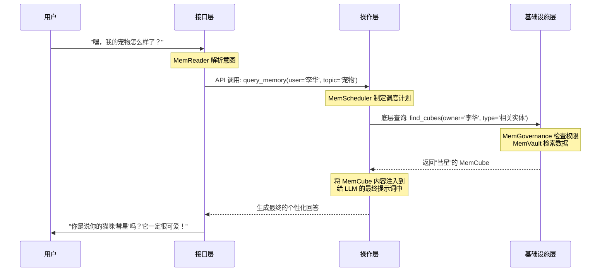

# Chapter 4: MemOS 三层架构


在 [第三章：MemCube (内存立方)](03_memcube__内存立方__.md) 中，我们学习了 MemOS 如何将五花八门的记忆打包成标准化的“快递包裹”——`MemCube`。这解决了统一管理的问题，就像我们有了标准尺寸的砖块。

但是，光有砖块还不足以建成一座功能完备的城市。我们需要城市规划：哪里是接待访客的区域？哪里是处理核心事务的市政厅？哪里是提供水电和安保的基础设施？一个复杂的系统需要清晰的结构来保证其高效、稳定和可扩展。

这就是 MemOS 三层架构要解决的问题。它为整个内存操作系统设计了一套清晰的“城市蓝图”。

## 为什么需要分层架构？一家餐厅的启示

想象一下一家生意火爆的高效餐厅。它的运营之所以井井有条，是因为它有明确的分工和层次：

*   **前台 (接口层)**：服务员负责接待顾客、点单。他们是餐厅与顾客之间的“接口”，将顾客的需求（“我要一份牛排，五分熟”）翻译成厨房能懂的“订单”。
*   **后厨经理 (操作层)**：后厨经理是餐厅的“大脑”。他拿着订单，调度手下的厨师，决定先做什么菜，后做什么菜，从仓库里调配哪些食材，确保每道菜都能准时、高质量地完成。
*   **供应链与仓库 (基础设施层)**：这是餐厅的“基座”。它包括存储食材的冷库、保证食品安全的规章制度、以及负责采购和运输的供应链系统。它为整个餐厅的运营提供稳定可靠的资源和保障。

如果服务员直接跑去仓库拿菜，或者厨师都挤在前台点单，那整个餐厅一定会陷入混乱。

MemOS 的设计理念与此完全相同。它将复杂的内存管理任务拆分成三个独立的层次，每一层各司其职，协同工作。

```mermaid
graph TD
    subgraph 餐厅运营
        A[前台点单] --> B[后厨经理调度];
        B --> C[仓库与供应链];
    end

    subgraph MemOS 架构
        I[接口层 (Interface Layer)] --> O[操作层 (Operation Layer)];
        O --> F[基础设施层 (Infrastructure Layer)];
    end

    A -- 类比 --> I;
    B -- 类比 --> O;
    C -- 类比 --> F;

    style A fill:#A7C7E7,stroke:#333
    style B fill:#FDFD96,stroke:#333
    style C fill:#FFB347,stroke:#333
    style I fill:#A7C7E7,stroke:#333
    style O fill:#FDFD96,stroke:#333
    style F fill:#FFB347,stroke:#333
```

现在，让我们来逐一认识 MemOS 的这三个“部门”。

## 1. 接口层 (Interface Layer)：系统的“前台服务员”

**接口层**是 MemOS 与外部世界（如用户、应用程序）交互的唯一入口。它的核心职责是**理解请求，并将其转换为系统内部可以处理的标准指令**。

*   **核心功能**：解析用户输入、调用标准化的内存 API。
*   **好比**：餐厅的前台服务员。他把顾客的口头点单（自然语言）转换成一张格式统一的订单（结构化 API 调用）。

当用户对 AI 说：“提醒我一下，上次我们聊的那个关于我宠物的笔记在哪？”

接口层内置的 `MemReader` 组件会解析这句话，识别出用户的意图是“查询记忆”，并生成一个标准的 API 请求。

```python
# 伪代码：接口层解析用户输入

user_input = "提醒我一下，上次我们聊的那个关于我宠物的笔记在哪？"

# 接口层的 MemReader 组件进行解析
parsed_request = InterfaceLayer.parse(user_input)

# -> 生成的内部 API 调用
# return {
#   "operation": "query_memory",
#   "filters": {
#     "user_id": "李华",
#     "topic_keywords": ["宠物", "笔记"]
#   }
# }
```
这个过程将模糊的自然语言请求，变成了精确、结构化的机器指令。接口层不关心这个指令如何被执行，它只负责“翻译”和“传达”，确保后方的“厨房”能准确无误地接收到指令。

## 2. 操作层 (Operation Layer)：系统的“后厨经理”

**操作层**是 MemOS 的“大脑”和“指挥中心”。它接收来自接口层的指令，并**负责所有内存的调度、组织和生命周期管理**。

*   **核心功能**：内存调度、生命周期管理、内存组织。
*   **好比**：餐厅的后厨经理。他决定哪个任务更紧急、需要哪些食材（`MemCube`）、如何组合这些食材，以及何时将不再新鲜的食材处理掉。

操作层是整个系统最核心、最智能的部分。它包含几个关键组件：

*   **[MemScheduler (内存调度器)](05_memscheduler__内存调度器__.md)**：这是最重要的组件，如同后厨经理本人。它根据当前任务的上下文，决定应该从海量的 `MemCube` 中加载哪些进入模型的“工作记忆”。
*   `MemOperator`：负责对 `MemCube` 进行组织，比如给它们打上标签、建立关联，方便 `MemScheduler` 进行检索。
*   `MemLifecycle`：管理 `MemCube` 的生命周期，比如决定哪些记忆该被归档，哪些该被销毁。

继续上面的例子，当操作层收到查询“宠物笔记”的指令后：

```python
# 伪代码：操作层处理请求

api_request = { "operation": "query_memory", ... }

# MemScheduler 开始工作
# 它会根据请求，制定一个检索策略
retrieval_plan = MemScheduler.plan(api_request)

# MemOperator 根据策略执行检索
found_cubes = MemOperator.search(plan=retrieval_plan)

# -> 找到了关于“彗星”的那个 MemCube
# return [MemCube(id='mc-1a2b3c...', payload='{"entity_name": "彗星", ...}')]
```
操作层是决策者。它不亲自存储数据，而是负责智慧地“使用”数据。

## 3. 基础设施层 (Infrastructure Layer)：系统的“坚实地基”

**基础设施层**是 MemOS 的“基座”，为上层提供**稳定、安全、可靠的底层支持**。

*   **核心功能**：安全存储、权限管控、跨平台能力。
*   **好比**：餐厅的仓储、安保和供应链系统。它确保食材（`MemCube`）被安全地存储在仓库（`MemVault`）里，只有授权的厨师才能进入，并能保证食材的来源可追溯。

这一层确保了所有 `MemCube` 的物理安全和合规使用。它的关键组件包括：

*   `MemVault` / `MemStore`：提供统一的存储接口，可以对接各种数据库（向量数据库、关系数据库等），是所有 `MemCube` 的“家”。
*   **[MemGovernance (内存治理)](06_memgovernance__内存治理__.md)**：负责权限控制、访问审计和隐私保护。它确保“李华的记忆”不会被“张三”访问到。
*   `MemLoader` / `MemDumper`：负责 `MemCube` 的导入和导出，使记忆可以在不同设备、不同应用之间安全地迁移。

当操作层需要检索 `MemCube` 时，它会向基础设施层发出请求。

```python
# 伪代码：基础设施层响应检索请求

# 来自操作层的底层查询
storage_query = "SELECT * FROM cubes WHERE owner='李华' AND tag='宠物'"

# 1. MemGovernance 检查权限
# 确认当前操作者有权访问“李华”的记忆
MemGovernance.check_access(user="李华", resource_owner="李华") # -> 允许

# 2. MemVault 在物理存储中执行查询
raw_data = MemVault.execute_query(storage_query)

# -> 返回原始数据
# return [...]
```
基础设施层不关心“为什么”要找这份数据，它只负责“安全、可靠”地把数据拿出来或者存进去。

## 整体流程：一次完整的内存调用之旅

现在，让我们把这三层串起来，看看当用户（李华）提出一个请求时，MemOS 内部发生了什么。这个流程也清晰地展示在项目白皮书的图 6 中。

**用户输入**: "嘿，我的宠物怎么样了？"



这个流程清晰地展示了三层架构的优势：
1.  **关注点分离 (Separation of Concerns)**：每一层都只关心自己的任务，接口层不用管调度，操作层不用管存储，基础设施层不用管业务逻辑。这使得系统更容易开发、维护和升级。
2.  **模块化和可扩展性 (Modularity & Scalability)**：我们可以轻易地替换某一层的具体实现。比如，我们可以更换基础设施层的数据库，而完全不影响操作层和接口层。或者，我们可以为操作层的 `MemScheduler` 增加更智能的调度算法。
3.  **安全与稳定 (Security & Stability)**：所有的数据访问都必须经过基础设施层的 `MemGovernance`，形成了一个坚固的“安全大门”，保证了记忆的安全可控。

## 总结

在本章中，我们一起探索了 MemOS 的宏观设计蓝图——三层架构。就像一家高效运营的餐厅，这个架构将复杂的内存管理任务解耦成了三个清晰的层次。

*   **接口层 (Interface Layer)**：系统的“前台”，负责将用户的自然语言请求翻译成标准的 API 指令。
*   **操作层 (Operation Layer)**：系统的“大脑”，负责内存的智能调度、组织和生命周期管理。
*   **基础设施层 (Infrastructure Layer)**：系统的“基座”，负责内存的安全存储、权限控制和跨平台能力。

这套分层架构是 MemOS 能够实现对内存这种核心资源进行统一、高效、安全管理的基础。它确保了系统的模块化、可扩展性和健壮性。

现在，我们已经了解了整个系统的“骨架”。接下来，是时候深入到它的“大脑”——操作层中，去看看整个系统中最智能、最核心的组件是如何工作的了。

准备好了吗？让我们一起进入 [第五章：MemScheduler (内存调度器)](05_memscheduler__内存调度器__.md)，探索 MemOS 的智慧之源。

---

Generated by [AI Codebase Knowledge Builder](https://github.com/The-Pocket/Tutorial-Codebase-Knowledge)