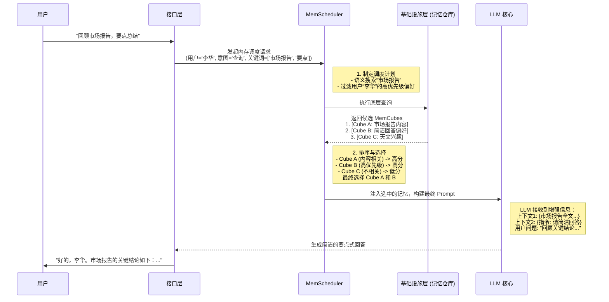

# Chapter 5: MemScheduler (内存调度器)


在上一章 [MemOS 三层架构](04_memos_三层架构__.md) 中，我们了解了 MemOS 如同一座精心规划的城市，拥有接口层（前台）、操作层（市政厅）和基础设施层（地基）三个层次。我们知道，所有智慧的决策都发生在操作层。

现在，是时候走进这座城市的“市政厅”，认识它最核心的部门——**MemScheduler (内存调度器)** 了。如果说 MemOS 是 AI 的大脑，那么 MemScheduler 就是大脑中负责“注意力分配”的关键区域。

## 为什么需要一个“内存交通指挥官”？

想象一下，你正在与一个搭载了 MemOS 的 AI 助手长期协作。几个月下来，你们的互动产生了成百上千份记忆，它们都被打包成了标准化的 [MemCube (内存立方)](03_memcube__内存立方__.md) 存放在系统的“记忆仓库”里。这些记忆包括：
*   你的个人偏好（“我喜欢简洁的回答”）
*   你们一起完成的项目文档（“市场分析报告.pdf”）
*   重要的对话记录（“关于下季度规划的讨论”）
*   一些琐碎的闲聊（“今天天气真好”）

现在，你向 AI 助手提出了一个新请求：
> “嘿，帮我回顾一下上次市场分析报告的关键结论，用要点列出来。”

AI 面临一个难题：在成百上千个 `MemCube` 中，它应该把哪些记忆调取出来，辅助自己生成回答呢？
*   **全部加载？** 这会消耗巨大的计算资源，并且大量无关信息（比如闲聊）会干扰模型的判断，就像开会时所有人七嘴八舌，反而听不清重点。
*   **一个不加载？** AI 就会“失忆”，茫然地问你：“我们讨论过市场分析报告吗？”
*   **随机加载？** 运气好的话可能蒙对，但更可能加载到“今天天气真好”这种毫不相干的记忆。

这正是 **MemScheduler** 发挥作用的地方。它就像一个聪明的“内存交通指挥官”或图书馆管理员。当你提问时，他不会把整座图书馆的书都搬给你，而是会迅速根据你的需求、身份和当前情境，精准地找出最相关的那几本书或那几页内容。

**MemScheduler 的核心任务：在正确的时间，将正确的记忆，提供给模型使用。**

## MemScheduler 是如何工作的？三大调度策略

MemScheduler 不是靠“感觉”来挑选记忆的，它依赖一套清晰的策略，这些策略都源于 [MemCube (内存立方)](03_memcube__内存立方__.md) 详细的元数据。让我们了解三种最基础的调度策略。

```mermaid
graph TD
    A[用户请求<br/>"回顾市场报告，要点总结"] --> B(MemScheduler);

    subgraph 调度策略
        C[上下文感知<br/>(内容相关吗？)]
        D[优先级感知<br/>(记忆重要吗？)]
        E[行为感知<br/>(最近用过吗？)]
    end

    B --> C;
    B --> D;
    B --> E;

    C --> F[找到“市场报告”的MemCube];
    D --> G[找到“简洁回答偏好”的MemCube];
    E --> H[提升最近讨论过的相关Cube的权重];

    style B fill:#FDFD96,stroke:#333,stroke-width:2px
```

### 1. 上下文感知匹配 (Context-Aware Matching)

这是最核心的策略。调度器会分析你当前请求的**语义**，然后去寻找内容上最匹配的 `MemCube`。

*   **工作原理**：它会提取你请求中的关键词（如“市场分析报告”、“关键结论”），然后通过语义搜索技术，在所有 `MemCube` 的“标签”（元数据）和“内容”（载荷）中寻找最相关的记忆。
*   **例子**：当调度器看到“市场分析报告”，它会立刻定位到那个存储着报告内容的 `MemCube`。这就像在图书馆里按书名找书，非常直接。

### 2. 基于优先级的加载 (Priority-Based Loading)

并非所有记忆都同等重要。用户的核心偏好，通常比一次性的任务指令更具有普适性。

*   **工作原理**：调度器会检查 `MemCube` 元数据中的 `priority` 字段。这个字段在记忆创建时就被设定好了（例如，用户偏好为“高”，项目文档为“中”，闲聊为“低”）。
*   **例子**：在你的请求中，虽然没有明确说“要简洁”，但 MemScheduler 在筛选时，会发现一个 `priority` 为“高”的 `MemCube`，其内容是“用户喜欢简洁的回答风格”。它会智能地将这份高优先级记忆也一并加载，以确保生成的回答符合你的习惯。

### 3. 行为感知调度 (Behavior-Aware Scheduling)

记忆的价值也会随着时间变化。刚刚还在讨论的话题，很可能下一句还会用到。

*   **工作原理**：调度器会参考 `MemCube` 元数据中的 `last_used` (上次使用时间) 和 `usage` (使用频率) 字段。这个策略遵循一个简单的原则：最近经常使用的记忆，更有可能在接下来的交互中被再次使用。这也被称为 **LRU (Least Recently Used，最近最少使用)** 策略的变种。
*   **例子**：如果你们在五分钟前刚刚讨论过这个市场报告的某个细节，那么与这个报告相关的 `MemCube` 会因为 `last_used` 时间戳非常新，而被赋予更高的临时权重，更容易被选中。

通过综合运用这些策略，MemScheduler 能够从海量记忆中进行高效、精准的筛选，最终挑选出一个小而精的“记忆组合”，递交给大模型。

## 内部实现：一次完整的调度之旅

让我们通过一个序列图，看看当用户发出请求后，MemScheduler 在 MemOS 系统内部是如何与其它组件协作的。这个流程也直观地展示在项目白皮书的图 6 和图 7 中。

**场景**: 用户说：“嘿，帮我回顾一下上次市场分析报告的关键结论，用要点列出来。”


这个流程清晰地展示了 MemScheduler 作为“大脑中枢”的决策过程。

### 核心逻辑伪代码

虽然真实的实现会更复杂，但我们可以用一段简单的伪代码来理解 MemScheduler 的核心思考过程：

```python
# 这是一个简化的伪代码，用于说明 MemScheduler 的逻辑

def mem_scheduler(user_id, user_prompt):
    """
    根据用户ID和当前提示，调度最相关的记忆。
    """

    # 1. 制定计划：从用户请求中提取关键信息
    keywords = extract_keywords(user_prompt) # -> ["市场报告", "要点"]
    
    # 2. 执行检索：向基础设施层请求候选记忆
    # 同时按语义和元数据进行查找
    candidate_cubes = infrastructure.search(
        user_id=user_id,
        semantic_keywords=keywords,
        # 也查找该用户所有高优先级的记忆
        filters={"priority": "高"} 
    )
    # candidate_cubes -> [CubeA, CubeB, CubeC, ...]

    # 3. 排序和选择：为每个候选Cube打分
    scored_cubes = []
    for cube in candidate_cubes:
        score = 0
        # 策略1：内容相关性得分
        score += calculate_relevance_score(cube, keywords) 
        # 策略2：优先级得分
        score += calculate_priority_score(cube.metadata.priority)
        # 策略3：新近度得分
        score += calculate_recency_score(cube.metadata.last_used)
        
        scored_cubes.append((cube, score))

    # 按分数从高到低排序，并选择前 N 个
    sorted_cubes = sorted(scored_cubes, key=lambda x: x[1], reverse=True)
    selected_cubes = [cube for cube, score in sorted_cubes[:TOP_N]] # TOP_N 是预设的数量，比如3

    # 4. 返回最终选中的记忆组合
    return selected_cubes
```

这段代码直观地展示了 MemScheduler 如何将多个策略结合起来，像一个评分系统一样，为每个可能的记忆打分，并最终选出得分最高的“选手”，从而实现精准的内存调用。

## 总结

在本章中，我们深入了解了 MemOS 的“智慧大脑”——MemScheduler。它是确保 AI 能够进行长期、连贯且个性化对话的核心。

*   **核心问题**：当 AI 拥有海量记忆时，如何高效、准确地选择当前任务最需要的记忆？
*   **MemScheduler 的角色**：一个智能的**内存交通指挥官**，负责在正确的时间，将正确的 [MemCube (内存立方)](03_memcube__内存立方__.md) 注入到模型中。
*   **核心策略**：通过综合运用**上下文感知**、**优先级感知**和**行为感知**等多种策略，对候选记忆进行评分和筛选。
*   **最终目的**：实现小窗口、高效率的精准记忆调用，避免信息过载，同时又克服“失忆”问题。

现在我们明白了，MemOS 不仅能存储记忆，还能智能地“回想”起它们。但是，这种“回想”必须是安全和可控的。我们不希望 AI 泄露用户的隐私，或者让不相关的应用访问到核心记忆。如何为这些强大的记忆能力建立起“护栏”和“规则”呢？

这就是我们下一章将要探讨的主题。准备好了解 MemOS 的“安全卫士”了吗？

让我们一起进入 [第六章：MemGovernance (内存治理)](06_memgovernance__内存治理__.md)。

---

Generated by [AI Codebase Knowledge Builder](https://github.com/The-Pocket/Tutorial-Codebase-Knowledge)