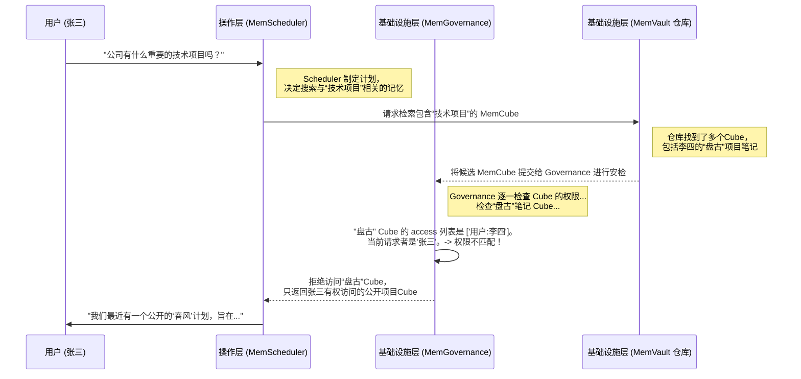

# Chapter 6: MemGovernance (内存治理)


在上一章 [第五章：MemScheduler (内存调度器)](05_memscheduler__内存调度器__.md) 中，我们见识了 MemOS 的智慧大脑 `MemScheduler` 是如何像一位聪明的图书管理员一样，从海量记忆中精准地为我们找出所需信息的。这赋予了 AI 强大的“回想”能力。

但是，能力越大，责任也越大。如果记忆可以被随意读取和修改，那将是一场灾难。想象一个公司的 AI 助手，它既存储着公开的公司章程，也保存着你个人的机密项目笔记。我们如何确保当你的同事向它提问时，它不会把你的机密笔记也一并“分享”出去呢？

赋予记忆力量的同时，必须为其戴上“缰绳”。这就是 **MemGovernance (内存治理)** 的使命。它好比银行的金库管理系统，不仅保管着所有财富（记忆），还设定了严格的规则：谁有权存取、操作记录、保密等级等，确保整个系统的安全和秩序。

## 为什么需要一个“内存安全卫士”？

让我们从一个具体的场景开始。假设有两位员工，张三和李四，在同一家公司工作，并且他们都使用同一个企业 AI 助手。

*   **李四** 正在负责一个代号为“盘古”的秘密项目。他告诉 AI：“帮我记一下，‘盘古’项目的核心技术方案是XYZ，这是一个高度机密的信息。”
*   **张三** 对“盘古”项目一无所知。某天，他问 AI：“公司最近有什么重要的技术项目吗？”

如果没有内存治理，会发生什么？AI 的 `MemScheduler` 可能会认为“技术项目”这个关键词与李四的笔记高度相关，从而将“盘古”项目的机密信息泄露给张三。这显然是不可接受的。

**MemGovernance 的核心任务：为每一个记忆单元建立清晰的边界和规则，确保它在正确的时间、被正确的对象、以正确的方式使用。**

它就像是 MemOS 系统中的“安全卫士”和“合规审计员”，时刻保护着记忆的安全。

## MemGovernance 的三大法宝

`MemGovernance` 通过在 [MemCube (内存立方)](03_memcube__内存立方__.md) 的元数据中嵌入一系列治理规则来实现其功能。它主要有三大法宝：

```mermaid
graph TD
    A[记忆仓库 (MemVault)] --> B{MemGovernance<br/>内存治理};

    subgraph 治理规则
        C[访问权限控制<br/>(谁能用?)]
        D[生命周期策略<br/>(能用多久?)]
        E[审计与追溯<br/>(谁用过?)]
    end

    B --> C;
    B --> D;
    B --> E;

    style B fill:#FFB347,stroke:#333,stroke-width:2px
```

### 1. 访问权限控制 (Access Control)

这是最核心的功能。它定义了**谁**可以对一个 `MemCube` 进行**何种**操作。

*   **工作原理**：在每个 `MemCube` 的元数据中，都有一个 `access` 字段，就像一张通行证名单。这份名单详细记录了哪些用户或用户组（比如“管理员”、“项目A成员”）拥有读取、写入或删除这份记忆的权限。
*   **例子**：李四创建的“盘古计划”笔记，其 `MemCube` 的 `access` 字段会被设置为 `["用户:李四", "组:核心研发部"]`。当张三尝试查询时，`MemGovernance` 会检查张三是否在这份名单上。如果不在，访问就会被拒绝。

### 2. 生命周期策略 (Lifecycle Policies)

不是所有的记忆都需要永久保存。有些记忆具有时效性，过期后就应该被自动处理。

*   **工作原理**：`MemCube` 的元数据中可以包含 `expires` (过期时间) 或其他策略（如“30天未使用则归档”）。`MemGovernance` 会定期巡查，自动清理或归档那些符合策略的记忆。
*   **例子**：一个用于登录的临时验证码记忆，可以设置 `expires: "10分钟后"`。10分钟一到，这个 `MemCube` 就会被自动销毁，避免了安全风险。一份普通的对话记录，可能被设置为“90天后自动匿名化处理”，以保护用户隐私。

### 3. 审计与追溯 (Auditing & Traceability)

为了保证合规和安全，每一次对敏感记忆的操作都必须留下记录。

*   **工作原理**：`MemGovernance` 会为每一次内存的创建、读取、修改、删除操作生成一条详细的日志。日志会记录下操作人、时间、操作类型等信息。此外，`MemCube` 还可以被打上 `tags`，如 `["非敏感"]` 或 `["机密"]`，以便进行分类管理和重点监控。
*   **例子**：如果一份被标记为 `["机密"]` 的 `MemCube` 被访问了，系统会立即记录一条审计日志：`[时间: 2024-10-28 15:30, 操作人: 李四, 行为: 读取, CubeID: mc-pangu-xyz]`。这样，当需要进行安全审查时，所有历史记录都一目了然。

## 内部实现：一次访问请求的“安检”之旅

现在，让我们回到最初的场景，看看当张三试图查询公司项目时，`MemGovernance` 是如何扮演“安全卫士”角色的。这个流程也清晰地体现在 [MemOS 三层架构](04_memos_三层架构__.md) 中，`MemGovernance` 位于坚实的基础设施层。

**场景**: 张三问：“公司最近有什么重要的技术项目吗？”



这个流程清晰地展示了 `MemGovernance` 是如何作为最后一道防线，在数据离开仓库前进行严格的权限检查的。

### 核心逻辑伪代码

`MemGovernance` 的核心逻辑可以用一个非常简单的函数来模拟，它就像一个忠实的门卫。

```python
# 伪代码：一个简化的权限检查函数

# 假设这是李四的机密 MemCube
pangu_secret_cube = {
  "metadata_header": {
    "cube_id": "mc-pangu-xyz",
    "access": ["user:李四", "group:核心研发部"]
    # ... 其他元数据
  },
  "memory_payload": {
    "content": "“盘古”项目的核心技术方案是XYZ..."
  }
}

def check_permission(user, cube):
  """
  检查一个用户是否有权限访问某个 MemCube。
  这是一个非常简化的示例。
  """
  # 获取发起请求的用户信息
  user_id = user["id"] # -> 'user:张三'
  user_groups = user["groups"] # -> ['group:市场部']

  # 获取 Cube 的访问列表
  access_list = cube["metadata_header"]["access"]

  # 检查用户ID是否在列表中
  if user_id in access_list:
    return True # 允许访问

  # 检查用户所属的组是否在列表中
  for group in user_groups:
    if group in access_list:
      return True # 允许访问
  
  # 如果都不匹配，则拒绝访问
  print(f"访问被拒绝！用户 {user_id} 无权访问 Cube {cube['metadata_header']['cube_id']}")
  return False

# 模拟张三的请求
current_user = {"id": "user:张三", "groups": ["group:市场部"]}
can_access = check_permission(current_user, pangu_secret_cube)
# -> 输出: "访问被拒绝！用户 user:张三 无权访问 Cube mc-pangu-xyz"
# -> can_access 会是 False
```
这段代码虽然简单，但它揭示了 `MemGovernance` 的工作精髓：在每一次数据访问前，都进行一次严格的、基于规则的“身份验证”。正是这个看似简单的步骤，构成了整个 MemOS 系统安全和可信赖的基石。

## 总结

在本章中，我们认识了 MemOS 系统中不可或缺的“安全卫士”——`MemGovernance`。它确保了 AI 在拥有强大记忆能力的同时，其行为也是安全、合规和可控的。

*   **核心问题**：如何确保海量的、多用户的记忆不被滥用或泄露？
*   **MemGovernance 的角色**：一个**内存治理框架**，如同银行的金库管理系统，为每个 [MemCube (内存立方)](03_memcube__内存立方__.md) 设定和执行规则。
*   **三大法宝**：
    1.  **访问权限控制**：定义“谁能用”。
    2.  **生命周期策略**：定义“能用多久”。
    3.  **审计与追溯**：记录“谁用过”。
*   **最终目的**：确保记忆的使用既安全可靠，又可审计追溯，为构建可信赖的 AI 系统提供基础保障。

至此，我们已经探索了 MemOS 的核心概念：从最小的记忆单元 `MemCube`，到宏伟的 `三层架构`，再到智慧的 `MemScheduler` 和可靠的 `MemGovernance`。我们了解了记忆是如何被创建、组织、调度和保护的。

然而，还有一个非常有趣的问题没有回答：记忆是静态不变的吗？显然不是。我们人类的记忆会演化：一个临时的想法（激活内存）可能会被记入笔记（明文内存），反复背诵的笔记最终会内化为知识（参数化内存）。MemOS 是否也支持这种记忆的“进化”呢？

在我们的最后一章，我们将探索 MemOS 中最激动人心的特性之一：记忆的流动与演化。

准备好见证记忆的蜕变之旅了吗？让我们一起进入 [第七章：内存转换路径](07_内存转换路径_.md)。

---

Generated by [AI Codebase Knowledge Builder](https://github.com/The-Pocket/Tutorial-Codebase-Knowledge)