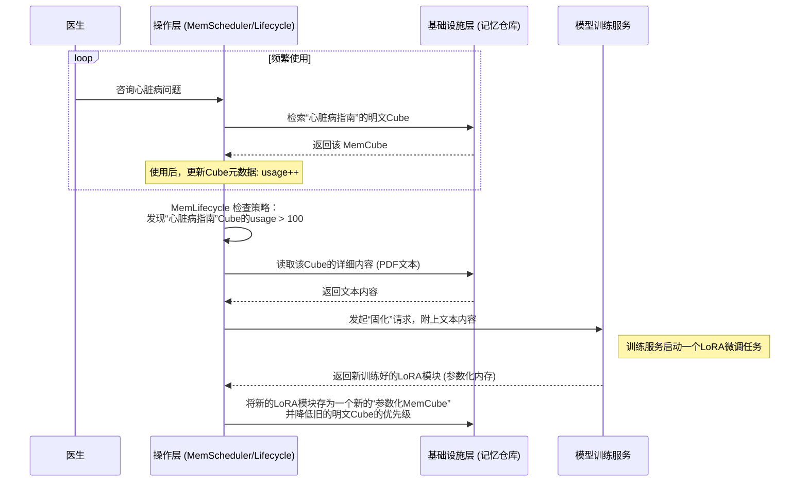

# Chapter 7: 内存转换路径


在上一章 [MemGovernance (内存治理)](06_memgovernance__内存治理__.md) 中，我们为 AI 的记忆系统安装了强大的“安全卫士”和“合规审计员”，确保了记忆的安全、可控和可追溯。我们已经了解了记忆是如何被创建、组织、调度和保护的。

至此，我们似乎已经构建了一个完美的记忆系统。但还有一个非常有趣的问题：记忆是静止不变的吗？

我们人类的记忆并非如此。一本经常翻阅的“笔记本”（明文内存），上面的知识最终会变成我们脱口而出的“常识”（参数化内存）。一个突如其来的灵感（激活内存），如果不及时记下来（存为明文内存），可能很快就烟消云散。这种记忆的流动和演化，正是我们学习和成长的核心机制。

为了让 AI 真正成为一个能够持续学习和进化的智能体，MemOS 引入了其最关键的动态特性之一：**内存转换路径**。它指的是不同类型的记忆之间可以相互转化，形成一个学习和演化的闭环。

## 为什么需要让记忆“动”起来？医生的 AI 助手

想象一个场景：一位医生正在使用一个搭载了 MemOS 的 AI 助手来辅助诊疗。

1.  **初始阶段**：医生上传了一份最新的《心脏病诊疗指南》PDF 文件。这份文件被 AI 助手作为一份 [明文内存](02_三大核心内存类型_.md) 存储起来。每次医生咨询相关问题时，AI 都需要通过 RAG（检索增强生成）技术去阅读这份 PDF，然后生成答案。这虽然有效，但每次都检索和阅读，效率并不高。

2.  **演化阶段**：随着时间推移，AI 助手发现，这份指南几乎每天都会被查阅上百次。`MemOS` 系统内的“监控员”注意到了这个模式。它判断，这份知识已经不是“偶尔参考”的级别，而是成为了这位医生工作中的“核心常识”。

3.  **转换发生**：于是，`MemOS` 启动了一个后台任务。它将这份 PDF 指南的核心内容，通过类似微调（Fine-tuning）的技术，**“固化”** 进了模型的一部分权重中。也就是说，这份**明文内存**被转换成了**参数化内存**。

4.  **结果**：现在，当医生再次提问时，AI 无需再去翻阅那份 PDF。相关的知识已经像“本能”一样内化在模型里了，它可以更快、更直接地给出专业回答。

这个过程，就是一次典型的内存转换。它让 AI 不再是一个被动的信息检索工具，而是一个能够主动优化自身知识结构的学习者。

## 三大核心转换路径

MemOS 定义了三种核心的内存转换路径，它们共同构成了一个动态的、自我优化的记忆生态系统。这个概念也直观地展示在项目白皮书的图 3 中。

```mermaid
graph TD
    subgraph MemOS 内存生态系统
        P[参数化内存<br/>(模型的内功)]
        A[激活内存<br/>(临时的思绪)]
        T[明文内存<br/>(外部的笔记)]
    end

    T -- "固化 (Consolidation)"<br/>高频使用的知识 --> P;
    P -- "卸载 (Offloading)"<br/>过时或罕用的知识 --> T;
    A -- "缓存 (Caching)"<br/>有价值的临时状态 --> T;

    style P fill:#FFDDC1
    style A fill:#C1FFD7
    style T fill:#D1C1FF
```

让我们逐一了解这三条路径。

### 1. 固化：从“笔记”到“常识” (明文 -> 参数化)

这是最重要的一条路径，它代表了 AI 的“学习和内化”过程。

*   **触发条件**：一份明文内存（如一个文档、一份用户偏好记录）被极其频繁地访问。
*   **转换过程**：`MemOS` 的 [MemScheduler (内存调度器)](05_memscheduler__内存调度器__.md) 在调度时，会更新 [MemCube (内存立方)](03_memcube__内存立方__.md) 的元数据，比如 `usage` (使用频率) 字段。当这个值超过某个阈值时，系统的 `MemLifecycle` 组件会触发一个“固化”任务。这个任务通常是利用这份明文数据对模型进行轻量级的微调（比如训练一个 LoRA 模块），从而将知识编码进模型参数。
*   **带来的好处**：大幅提升推理效率，降低检索开销，让高频知识成为模型的“直觉”。

```python
# 伪代码：触发“固化”路径的策略

def check_for_consolidation(cube):
  """
  检查一个 MemCube 是否应该被固化。
  """
  # 阈值可以由管理员配置
  USAGE_THRESHOLD = 100 
  
  if cube.payload.type == "plaintext" and cube.metadata.usage > USAGE_THRESHOLD:
    print(f"检测到高频使用的明文记忆 {cube.id}，准备固化...")
    # 触发一个后台任务，将这份记忆转换为参数化内存
    start_finetuning_job(cube.payload.content)
```
这段代码展示了 `MemOS` 内部的一个简单决策逻辑：当一份“笔记”被翻得太多次时，就下决心把它背下来。

### 2. 卸载：为“大脑”减负 (参数化 -> 明文)

一个人的知识也需要更新换代。同样，模型的参数化内存也可能包含过时或不再需要的信息。

*   **触发条件**：模型中的某部分参数化知识（比如一个特定领域的 LoRA 模块）长期未被使用，或者被明确标记为“已过时”。
*   **转换过程**：`MemOS` 可以将这部分模型参数代表的知识“反向描述”成文本，并存为一个明文 `MemCube`。然后，在模型加载时不再加载这部分参数模块。
*   **带来的好处**：保持模型核心的轻量和高效，同时将不常用的知识作为可查阅的“档案”保存下来，而不是彻底丢弃。这让模型的更新和维护变得更加灵活。

### 3. 缓存：留住一闪而过的“灵感” (激活 -> 明文)

模型在单次对话中产生的激活内存是短暂的，但其中可能包含有价值的模式。

*   **触发条件**：系统发现某种特定的对话风格或响应模式（体现在激活内存中）能够持续获得用户的正面反馈。
*   **转换过程**：`MemOS` 可以捕捉到这种模式，并将其保存为一个明文 `MemCube`，比如一个高效的 Prompt 模板或者一个行为指令。
*   **带来的好处**：将临时的、成功的交互经验沉淀下来，变成可以被复用的持久化记忆，从而持续优化 AI 的表现。

## 内部实现：一次“固化”之旅

让我们通过一个序列图，看看在医生的 AI 助手例子中，从“诊疗指南PDF”到“模型内化知识”的转换是如何在 `MemOS` 内部发生的。



这个流程清晰地展示了 `MemOS` 是如何通过监控记忆的使用情况，自动触发学习和进化过程的。它不再是一个静态的系统，而是一个拥有新陈代谢能力的动态生命体。

## 总结：迈向持续进化的智能

在本章中，我们一起探索了 `MemOS` 中最激动人心的动态特性——**内存转换路径**。

*   **核心理念**：记忆不是静止的，而是可以像水一样在不同形态（[明文](02_三大核心内存类型_.md)、[激活](02_三大核心内存类型_.md)、[参数化](02_三大核心内存类型_.md)）之间流动和转化的。
*   **三大路径**：
    *   **固化 (明文 -> 参数化)**：将高频使用的外部知识内化为模型的本能，提升效率。
    *   **卸载 (参数化 -> 明文)**：将过时的内部知识外化为可编辑的档案，保持模型的灵活性。
    *   **缓存 (激活 -> 明文)**：将有价值的临时状态沉淀为可复用的持久记忆。
*   **最终目的**：建立一个学习和演化的闭环，让 AI 从一个只能“使用”记忆的工具，转变为一个能够“生长”出新记忆的、真正意义上的智能体。

---

### 教程总结

恭喜你！至此，你已经完成了 MemOS 核心概念的全部学习之旅。

让我们一起快速回顾这段旅程：

1.  在 **[第一章：MemOS (大模型内存操作系统)](01_memos__大模型内存操作系统__.md)**，我们认识到 AI 普遍存在“失忆症”的问题，并了解了 MemOS 作为解决方案的宏大愿景。
2.  在 **[第二章：三大核心内存类型](02_三大核心内存类型_.md)**，我们将复杂的“记忆”概念拆解为了参数化、激活和明文三种基本类型。
3.  在 **[第三章：MemCube (内存立方)](03_memcube__内存立方__.md)**，我们学习了如何将所有记忆打包成标准化的“快递包裹”，为统一管理奠定了基础。
4.  在 **[第四章：MemOS 三层架构](04_memos_三层架构__.md)**，我们探索了 MemOS 的整体城市规划，理解了其模块化、可扩展的设计哲学。
5.  在 **[第五章：MemScheduler (内存调度器)](05_memscheduler__内存调度器__.md)**，我们深入系统的“大脑”，见证了 AI 如何智能地“回想”起最相关的记忆。
6.  在 **[第六章：MemGovernance (内存治理)](06_memgovernance__内存治理__.md)**，我们为记忆系统配备了“安全卫士”，确保其强大能力被安全、合规地使用。
7.  最后，在 **本章**，我们见证了记忆的流动与演化，揭示了 AI 实现持续学习和成长的秘密。

通过这七个章节，我们共同构建了一个完整的认知地图。`MemOS` 不仅仅是一个技术框架，它更代表了一种全新的思维范式：**将记忆视为一种可操作、可演化、可治理的核心资源**。

这为我们打开了一扇通往下一代人工智能的大门——在这里，AI 不再是冷冰冰的、一次性的计算工具，而是能够与我们共同成长、拥有持久记忆、不断进化的个性化智能伙伴。

探索的旅程永无止境。希望本教程能为你提供一个坚实的起点，激发你对构建更智能、更具记忆力的 AI 系统的热情。欢迎你与我们一起，共同推动这个激动人心的领域向前发展！

---

Generated by [AI Codebase Knowledge Builder](https://github.com/The-Pocket/Tutorial-Codebase-Knowledge)