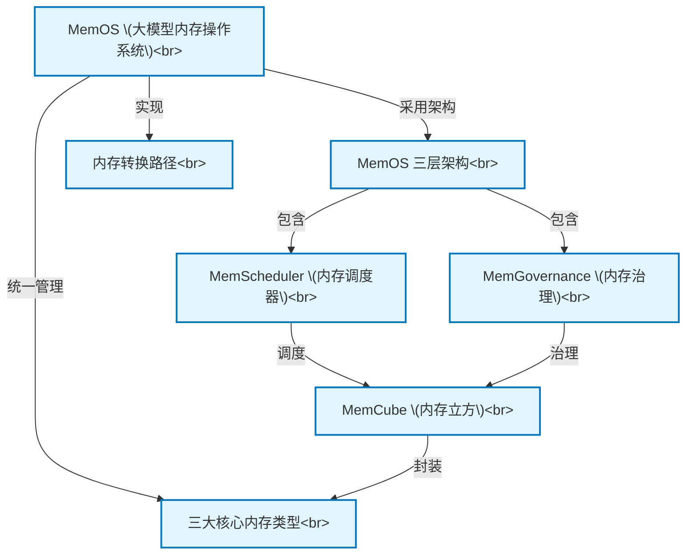

# Tutorial: memOS-07243171-b92b-4475-a591-6a3da5008d0e

`MemOS` 是一个专为大语言模型 (LLM) 设计的**内存操作系统**。它的核心目标是让AI不再仅仅是一个问答工具，而是能像人一样*记忆、学习和成长*的智能体。

为此，`MemOS` 提出将不同来源的“记忆”（如模型知识、对话历史、外部文档等）统一封装成一种名为 **`MemCube` (内存立方)** 的标准数据单元。通过管理和调度这些 `MemCube`，`MemOS` 能够精准地为AI提供所需信息，并确保整个过程安全、可控、可追溯，最终实现AI能力的持续进化。

**Source Repository:** [None](None)

## Chapters

1. [MemOS (大模型内存操作系统)
](01_memos__大模型内存操作系统__.md)
2. [三大核心内存类型
](02_三大核心内存类型_.md)
3. [MemCube (内存立方)
](03_memcube__内存立方__.md)
4. [MemOS 三层架构
](04_memos_三层架构_.md)
5. [MemScheduler (内存调度器)
](05_memscheduler__内存调度器__.md)
6. [MemGovernance (内存治理)
](06_memgovernance__内存治理__.md)
7. [内存转换路径
](07_内存转换路径_.md)

---

Generated by [AI Codebase Knowledge Builder](https://github.com/The-Pocket/Tutorial-Codebase-Knowledge)