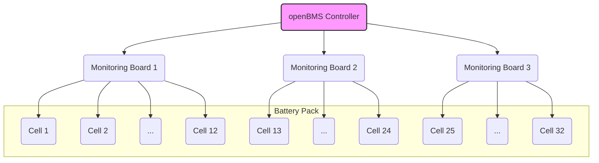

# Chapter 1: BMS Configuration

Welcome to the openBMS project! If you're here, you're likely excited to build and manage your own battery pack. This journey starts with a crucial first step: configuration.

Imagine you just bought a new smartphone. Before you can use it, you have to go through a setup process—connecting to Wi-Fi, setting a passcode, and choosing your language. In the world of Battery Management Systems (BMS), this initial setup is called **Configuration**. It's where you teach the BMS about the specific battery pack it will be protecting.

Think of this chapter as the "Quick Start" guide for your BMS. Getting these settings right is the most important step to ensure your battery operates safely and efficiently.

### What Are We Trying to Do?

Our goal is to tell the BMS controller two fundamental things:
1.  **What is the physical layout of our battery?** (e.g., How many cells does it have?)
2.  **What are the safety rules for operating this battery?** (e.g., When should it stop charging?)

Let's dive into how we do this in the `openBMS` code.

---

### Part 1: Describing Your Battery's Hardware

Before the BMS can monitor anything, it needs a map of the hardware. It needs to know how many individual battery cells it's responsible for and how many monitoring boards are connected to those cells.

In a typical setup, you have a main controller that talks to one or more "daughter boards." Each daughter board is a small circuit responsible for watching a group of cells (up to 12 in this project).



To define this structure, we look at a special section at the top of the `openBMS.pde` file.

#### Code Example: Physical Setup

```c++
// File: openBMS.pde

// BMS Settings
#define TOTALCELLS    32   // Set total cell number to 32
#define TOTALBOARDS   3    // set total board number to 3
```

Let's break this down:

*   `#define TOTALCELLS 32`: This line tells the BMS that our battery pack is made of **32 individual cells** connected in series. If your pack had only 16 cells, you would change this number to `16`.
*   `#define TOTALBOARDS 3`: This tells the BMS that we are using **3 separate monitoring boards** to read the voltages of our 32 cells. Since each board can handle up to 12 cells, we need 3 of them for a 32-cell pack (12 + 12 + 8).

These settings are the blueprint of your battery. The BMS will use them in almost every calculation and safety check it performs.

---

### Part 2: Setting the Safety Rules

Now that the BMS knows the *shape* of our battery, we need to give it the *rules of the game*. These rules are voltage limits that protect the battery from damage. A lithium battery is happiest when its voltage stays within a safe range.

*   **Charging too much (over-voltage)** can permanently damage the cell and create a fire hazard.
*   **Draining too much (under-voltage)** can also permanently damage the cell, rendering it useless.

Think of these settings as the "full" and "empty" lines on a fuel gauge.

#### Code Example: Voltage Safety Rules

```c++
// File: openBMS.pde

#define HIGHVOLTAGECUTOFF 3.7  // Define high voltage cut off
#define LOWVOLTAGEWARNING 2.8  // Define low voltage warning
#define LOWVOLTAGECUTOFF 2.55   // Define low voltage cut off
```

Here’s what each rule means:

*   `#define HIGHVOLTAGECUTOFF 3.7`: This is the absolute maximum voltage a single cell should ever reach. If any cell hits **3.7 volts**, the BMS will immediately take action to stop the charger. This prevents over-charging.
*   `#define LOWVOLTAGEWARNING 2.8`: This is like the "low fuel" light in your car. If any cell drops to **2.8 volts**, the BMS can trigger a warning (like a buzzer or a light) to let you know the battery is getting low.
*   `#define LOWVOLTAGECUTOFF 2.55`: This is the emergency stop. If any cell drops to **2.55 volts**, the BMS will disconnect the battery from the load (e.g., the motor) to prevent irreversible damage from over-discharging.

> **Heads Up!** The voltage values shown here (`3.7V`, `2.55V`, etc.) are specific to a certain type of battery chemistry (LiFePO4 in this case). Always check the datasheet for *your specific cells* and use the recommended voltage limits!

---

### Under the Hood: How Configuration Works

You might be wondering how changing a line of text at the top of a file can have such a big impact. The magic is in the `#define` directive.

`#define` is a command for the compiler, the tool that turns your human-readable code into machine code that the microcontroller can run. Before compiling, it performs a simple "find and replace." It finds every instance of the keyword (like `TOTALCELLS`) and replaces it with the value you provided (`32`).

```mermaid
graph TD
    A[Your Code: <br> <code>for (int i=1; i <= TOTALCELLS; i++)</code>] -->|Compiler sees `#define TOTALCELLS 32`| B(Pre-processing Step)
    B --> C[Final Code for Microcontroller: <br> <code>for (int i=1; i <= 32; i++)</code>]
```

This means the values you set are "baked into" the program. Let's see where these values are used.

#### Example 1: Using `TOTALCELLS`

The BMS needs to calculate the average voltage of the pack. To do that, it adds up all the cell voltages and divides by the total number of cells.

```c++
// File: openBMS.pde

void loop() {
  // ... code to read voltages ...

  // calculate total and average voltage of battery pack
  voltageTotal = vTotal();
  voltageAverage = voltageTotal / TOTALCELLS; // <-- Our setting is used here!
}
```

If you set `TOTALCELLS` to `32`, the code behaves as `voltageTotal / 32`. If you change it to `16`, the code automatically becomes `voltageTotal / 16`. You don't have to change the formula yourself!

#### Example 2: Using `HIGHVOLTAGECUTOFF`

The BMS constantly checks if any cell is being over-charged. It does this with a simple `if` statement.

```c++
// File: openBMS.pde

void loop() {
  // ... code to find the highest cell voltage ...

  // is cell higher than high voltage cutoff?
  if(voltageHighest >= HIGHVOLTAGECUTOFF) // <-- Our rule is used here!
  {
    isCellTooHigh = true; 
    digitalWrite(CHARGERSHUTOFF, HIGH); // Disconnect the charger!
  }
  // ...
}
```

Here, the BMS compares the actual highest cell voltage against the rule you defined. If the rule is broken, it triggers a safety action. This is the core of [Safety Management](03_safety_management_.md), which we'll cover in a later chapter.

### Conclusion

Congratulations! You've just completed the first and most fundamental step in setting up your `openBMS`. You learned that:

1.  **Configuration** is like a "Settings" menu where you describe your battery's hardware and its safety rules.
2.  You must define the `TOTALCELLS` and `TOTALBOARDS` to match your physical pack.
3.  You must set voltage cutoffs (`HIGHVOLTAGECUTOFF`, `LOWVOLTAGECUTOFF`) to protect your battery during charging and discharging.
4.  These settings are used throughout the code to perform calculations and enforce safety.

Now that our BMS knows the basic layout and rules, how does it actually *see* the voltage of each individual cell? We'll explore that in the next chapter.

Next up: [Battery State Monitoring](02_battery_state_monitoring_.md)

---

Generated by [AI Codebase Knowledge Builder](https://github.com/The-Pocket/Tutorial-Codebase-Knowledge)