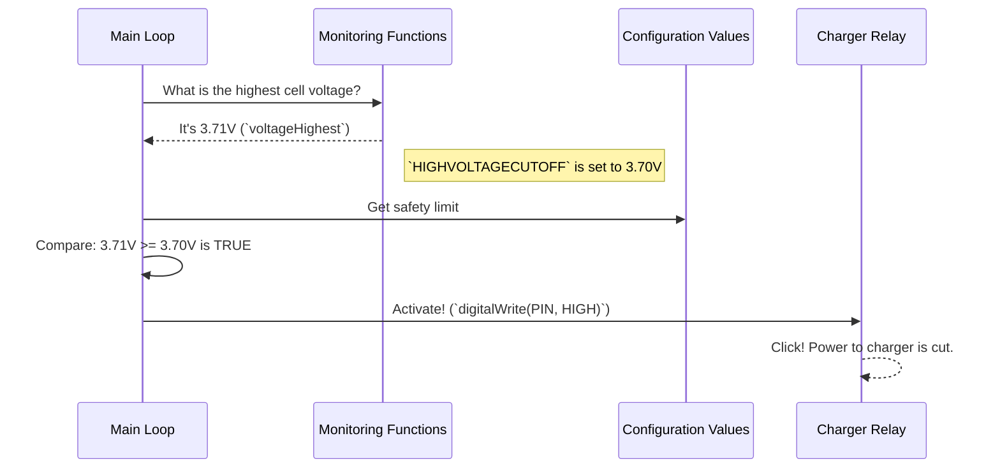

# Chapter 3: Safety Management

In the last chapter, [Battery State Monitoring](02_battery_state_monitoring_.md), we learned how our BMS acts like a doctor, constantly taking the battery's vital signs (like cell voltages). This gives us a clear picture of the battery's health.

But what happens if those vital signs show a problem? A doctor doesn't just write down "high fever" and walk away; they take action to treat it! This is where **Safety Management** comes in. Think of it as the battery pack's personal bodyguard. Its one and only job is to watch for danger and act *immediately* to prevent damage.

### What Are We Trying to Do?

Our goal is to automatically protect the battery from two very common but very dangerous conditions:
1.  **Over-charging:** A cell's voltage gets too high while charging. This can permanently damage the cell and is a serious fire risk.
2.  **Over-discharging:** A cell's voltage gets dangerously low while being used. This can also cause permanent, irreversible damage to the cell, turning it into a paperweight.

The Safety Management system acts like a smart circuit breaker. If it sees a voltage that's outside the safe range we defined in [Chapter 1: BMS Configuration](01_bms_configuration_.md), it will physically disconnect the charger or the load to protect the cells.

---

### How Safety Logic Works: An If-Then Recipe

The core of safety management is a simple "if-then" recipe: **IF** a dangerous condition is detected, **THEN** take protective action.

The `openBMS` code checks for these conditions continuously inside its main `loop()`. Let's look at the two most important checks.

#### Scenario 1: Preventing Over-Charging

Imagine you're charging your battery pack. The BMS is monitoring every cell. What happens when one cell—just one—reaches its maximum safe voltage?

##### Code Example: High Voltage Cutoff

```c++
// File: openBMS.pde

// is cell higher than high voltage cutoff?
if(voltageHighest >= HIGHVOLTAGECUTOFF)
{
  isCellTooHigh = true; 
  digitalWrite(CHARGERSHUTOFF, HIGH); // Disconnect the charger!
}
```

This is the bodyguard in action. Let's break down this simple but powerful code:

*   `if(voltageHighest >= HIGHVOLTAGECUTOFF)`: This is the **"IF"** part.
    *   `voltageHighest`: This variable holds the highest cell voltage found during the last [Battery State Monitoring](02_battery_state_monitoring_.md) cycle.
    *   `HIGHVOLTAGECUTOFF`: This is the safety rule we set back in [Chapter 1: BMS Configuration](01_bms_configuration_.md) (e.g., `3.7V`).
    *   The code simply asks: "Is our highest measured voltage greater than or equal to our safety limit?"

*   `digitalWrite(CHARGERSHUTOFF, HIGH);`: This is the **"THEN"** part.
    *   If the answer to the question is "yes", this line executes. It sends an electrical signal to a **relay**—a type of electronic switch—which physically disconnects the charger from the battery pack.
    *   **Input:** The highest cell voltage is `3.71V`. The cutoff rule is `3.7V`.
    *   **Output:** The charger is immediately disconnected. The battery is safe.

#### Scenario 2: Preventing Over-Discharging

Now, let's imagine you're using your battery to power a motor. The BMS is watching as the cell voltages drop. What happens when the weakest cell hits its absolute minimum safe voltage?

##### Code Example: Low Voltage Cutoff

```c++
// File: openBMS.pde

// is this cell lower than the emergency cutoff?
if(voltageLowest < LOWVOLTAGECUTOFF)
{
  isCellWayTooLow = true;
  digitalWrite(BATTERYSHUTOFF, HIGH); // Disconnect the battery pack!
}
```

This logic is nearly identical, but it protects against the opposite problem:

*   `if(voltageLowest < LOWVOLTAGECUTOFF)`: The **"IF"** part.
    *   `voltageLowest`: The lowest cell voltage found by the monitoring system.
    *   `LOWVOLTAGECUTOFF`: The "empty" line we set in our configuration (e.g., `2.55V`).
    *   It asks: "Has any cell dropped below our emergency empty line?"

*   `digitalWrite(BATTERYSHUTOFF, HIGH);`: The **"THEN"** part.
    *   If "yes", this line triggers another relay. This time, it disconnects the entire battery pack from whatever it's powering (the "load").
    *   **Input:** The lowest cell voltage is `2.54V`. The cutoff rule is `2.55V`.
    *   **Output:** The battery is disconnected from the motor. The cells are saved from permanent damage.

> **What about the warning?** You might remember `LOWVOLTAGEWARNING` from Chapter 1. The code has a similar `if` statement for that, but instead of cutting power, it might trigger a buzzer or a warning light to let the user know, "Hey, you should probably stop and recharge soon!"

---

### Under the Hood: From Code to Action

How does a line of code like `digitalWrite(CHARGERSHUTOFF, HIGH)` actually flip a physical switch? It's a team effort between the microcontroller and an external component called a relay.

Let's trace the steps for a high-voltage event.



1.  **Sensing:** The `loop()` calls monitoring functions to get the latest `voltageHighest`.
2.  **Comparing:** The `if` statement compares this live value to the `HIGHVOLTAGECUTOFF` limit that was "baked in" during configuration.
3.  **Acting:** The comparison is true, so the `digitalWrite()` function is called.
    *   `CHARGERSHUTOFF` is a constant (like `8`) that tells the microcontroller which physical pin to use.
    *   `HIGH` tells the pin to send out a small electrical signal (e.g., 5 volts).
4.  **Switching:** This small 5V signal is just enough to activate the **relay**. The relay is a heavy-duty switch that can handle the high power of the main charger. When it gets the signal, it opens the circuit, just like you flipping a light switch off.

This entire process happens in a fraction of a second, providing instant protection for your expensive battery cells.

### Conclusion

You now understand the most critical job of any BMS: keeping the battery safe!

1.  **Safety Management** acts like a bodyguard, using simple `if-then` logic to protect the battery.
2.  It continuously compares the **live data** from [Battery State Monitoring](02_battery_state_monitoring_.md) against the **safety rules** from [BMS Configuration](01_bms_configuration_.md).
3.  If a voltage goes too high or too low, the BMS uses `digitalWrite()` to trigger a **relay**, physically disconnecting the charger or the load to prevent damage.

You might be thinking, "It's great that the BMS can stop a disaster, but wouldn't it be better to prevent the cells from getting so out of whack in the first place?" You're exactly right! Keeping all the cells at a similar voltage level is key to a healthy, long-lasting pack. That preventative maintenance is called cell balancing, and it's what we'll cover next.

Next up: [Cell Balancing](04_cell_balancing_.md)

---

Generated by [AI Codebase Knowledge Builder](https://github.com/The-Pocket/Tutorial-Codebase-Knowledge)