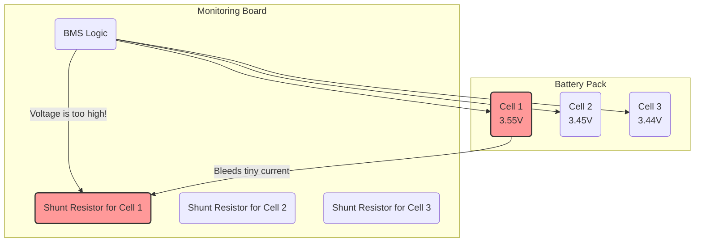

# Chapter 4: Cell Balancing

In our last chapter, [Safety Management](03_safety_management_.md), we built a bodyguard for our battery pack. It stands guard, ready to hit the emergency stop if any cell's voltage gets dangerously high or low. This is fantastic for preventing disasters.

But what if we could prevent the cells from getting so far out of line in the first place? Instead of waiting for an emergency, we can perform regular, gentle course corrections. This preventative maintenance is called **Cell Balancing**.

Think of your battery pack as a team of rowers in a boat. For the boat to move as fast and as far as possible, everyone needs to row in sync. If one rower gets tired (low voltage) or rows too fast (high voltage), the whole team suffers. Cell balancing is the coach's job: to watch each rower and tell the faster ones to ease up a bit, giving the others a chance to keep pace.

### What Are We Trying to Do?

Our goal is to keep the voltage of all the cells in our pack as close to each other as possible, especially during charging.

Why does this matter?
*   **During Charging:** The charger pumps energy into the entire pack. If one cell (the "fastest rower") reaches its `HIGHVOLTAGECUTOFF` limit before the others, the [Safety Management](03_safety_management_.md) system will shut down the charger. The result? That one cell is full, but the rest of the pack isn't! You lose usable capacity.
*   **During Discharging:** As you use the battery, one cell (the "weakest rower") might hit the `LOWVOLTAGECUTOFF` limit first. The BMS will cut power to protect that one cell, even though the others still have energy left to give. Again, you lose usable capacity.

By keeping the cells balanced, we ensure the *entire pack* can charge to its true maximum and discharge to its true minimum. This maximizes your battery's range and extends its overall lifespan.

---

### The Balancing Act: How it Works

The `openBMS` project uses a technique called **passive balancing**. Each cell on the monitoring boards has a tiny resistor next to it. When the BMS decides a cell is "too full" compared to its teammates, it can send a command to activate that cell's resistor.

This resistor acts like a small, controlled leak. It "shunts" or bleeds off a tiny amount of the cell's energy, converting it into a small amount of heat. This process slows down the charging of that specific cell, allowing the other, lower-voltage cells to catch up.



In the diagram, Cell 1 has a higher voltage than the others. The BMS detects this and activates its shunt resistor, slowing it down.

### How the Code Decides to Balance

The logic for this is in the `balanceCells()` function, which is called continuously from the main `loop()`. The strategy is simple:
1.  **Check if balancing is allowed.** We don't want to balance if a cell is already critically low.
2.  **Find the over-achievers.** Compare every cell's voltage to a target threshold.
3.  **Build a command.** For each monitoring board, create a command that says exactly which cells to balance.
4.  **Send the command.** Transmit the command to the board, which then activates the resistors.

#### Code Example: Finding Cells to Balance

First, the code loops through every cell and calculates how much higher its voltage is compared to a pre-defined balancing threshold, `HIVOLTAGESHUNT` (e.g., `3.5V`).

```c++
// File: openBMS.pde

// This is part of the balanceCells() function

float difference[TOTALCELLS];

// Step 1: Find the difference for every cell
for(int i = 1; i<= TOTALCELLS; i++)
{
  // Compare the cell's voltage to our balancing target voltage
  difference[i] = cellVoltage[i] - HIVOLTAGESHUNT;
}
```
*   **Input:** The `cellVoltage` array is full of the latest readings. `HIVOLTAGESHUNT` is set to `3.5` in the configuration.
*   **Output:** The `difference` array now holds the results. If `cellVoltage[5]` was `3.55V`, then `difference[5]` would be `0.05`. If `cellVoltage[6]` was `3.48V`, `difference[6]` would be `-0.02`.

#### Code Example: Building the Command

Now, for each monitoring board, the code checks these differences. If a cell's difference is greater than a tiny buffer (`VOLTAGEALLOWANCE`), it decides that cell needs to be balanced. It then builds a special command byte.

Think of this command as a light switch panel with 12 switches. A `1` means "turn on the resistor" and a `0` means "leave it off."

```c++
// File: openBMS.pde

// This loop runs for each monitoring board
for(int boardNumber = 0; boardNumber < TOTALBOARDS; boardNumber++)
{
  // Reset the command bytes for this board
  CFGR1 = 0x00;
  CFGR2 = 0x00;

  // Check each of the 12 possible cells on this board
  for(int i = 1; i <= 12; i++) 
  {
    int cellNumber = i + (boardNumber*12);
    // If this cell's voltage is significantly above the target...
    if(difference[cellNumber] > VOLTAGEALLOWANCE)
    {
      // ...set the corresponding bit to '1' in our command byte.
      // The code to do this uses bitwise math to flip the right switch.
    }
  }
  // Now that we've built the command for this board, send it.
  writeConfig();
  address++; // Move to the next board's address for the next loop
}
```
*   `VOLTAGEALLOWANCE`: This is a small value (e.g., `0.009V`) to prevent the system from flickering the resistors on and off if a voltage is hovering right at the threshold.
*   `CFGR1` and `CFGR2`: These variables hold the final command bytes. Their names come from the LTC6802 chip's "Configuration Registers."
*   `writeConfig()`: This is the function that actually sends the command to the hardware.

---

### Under the Hood: From Logic to Action

Let's trace the journey from deciding to balance a cell to a resistor actually turning on.

```mermaid
sequenceDiagram
    participant MainLoop as Main Loop
    participant balanceCells() as balanceCells()
    participant writeConfig() as writeConfig()
    participant Board1 as Monitoring Board 1

    MainLoop->>balanceCells(): Time to balance.
    Note over balanceCells(): Cell 5 is 3.55V (too high). <br> Cell 6 is 3.45V (okay).
    balanceCells()->>balanceCells(): Create command for Board 1. <br> Set bit for Cell 5 to '1' in `CFGR1`.
    balanceCells()->>writeConfig(): Send this command.
    writeConfig()->>Board1: New configuration with CFGR1 command.
    Board1->>Board1: Activate shunt resistor for Cell 5.
    Note over Board1: Cell 5 now slowly bleeds energy, allowing others to catch up.
```

The key step is the `writeConfig()` function. It takes the command bytes we just built (`CFGR1`, `CFGR2`) and sends them to the correct monitoring chip using a communication protocol called SPI.

```c++
// File: openBMS.pde

void writeConfig()
{
  TALK // Select the chip we want to talk to
  
  // Send the "Write Configuration" command and our data
  Spi.transfer(address);   // Address of the board we are talking to
  Spi.transfer(WRCFG);     // The command code for "Write Configuration"
  Spi.transfer(0x01);      // A control byte
  Spi.transfer(CFGR1);     // Our balancing command for cells 1-8!
  Spi.transfer(CFGR2);     // Our balancing command for cells 9-12!
  // ... more bytes ...

  DONE // Deselect the chip
}
```
You don't need to understand every detail of SPI communication yet (we'll cover that in [Chapter 7](07_ltc6802_2_chip_communication_.md)). The important part is seeing how the `CFGR1` and `CFGR2` variables, which hold our balancing decisions, are sent directly to the hardware.

### Conclusion

You've just learned about the gentle art of keeping your battery pack healthy and efficient!

1.  **Cell Balancing** is a preventative measure that keeps all cell voltages nearly equal, maximizing the pack's usable capacity and lifespan.
2.  It works by activating small **shunt resistors** to bleed a tiny amount of energy from high-voltage cells, allowing lower-voltage cells to catch up during charging.
3.  The `balanceCells()` function identifies which cells are above a target voltage (`HIVOLTAGESHUNT`).
4.  It then builds a command and uses `writeConfig()` to tell the monitoring chip which resistors to turn on.

So far, we've configured our BMS, taught it how to monitor the battery, given it safety rules, and now shown it how to keep the cells balanced. But how do we know how much "fuel" is in the tank? The next step is to create a fuel gauge by tracking all the energy that goes in and out of the pack.

Next up: [Energy & Power Accounting](05_energy___power_accounting_.md)

---

Generated by [AI Codebase Knowledge Builder](https://github.com/The-Pocket/Tutorial-Codebase-Knowledge)