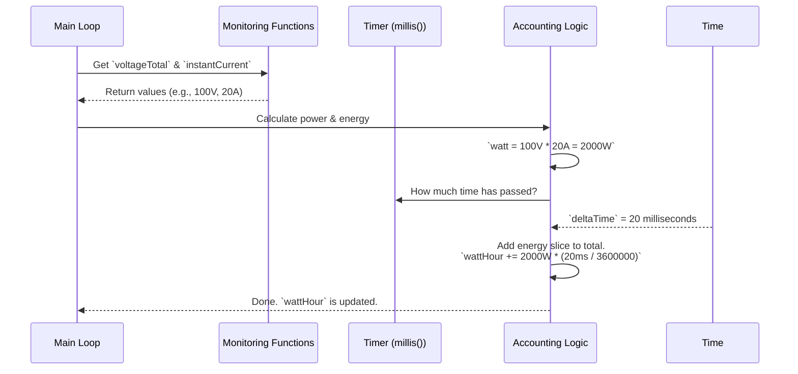

# Chapter 5: Energy & Power Accounting

In [Chapter 4: Cell Balancing](04_cell_balancing_.md), we fine-tuned our BMS to act like a coach, keeping every cell in sync to maximize the pack's health and capacity. This is an essential *internal* task. Now, let's turn our attention to a feature that's all about the user experience: the "fuel gauge."

Imagine driving an electric car. Two of the most important questions you have are: "How fast am I drawing power right now?" and "How much 'fuel' do I have left?" Answering these questions is the job of **Energy & Power Accounting**.

This system is your battery's trip computer, or "e-meter." It provides a real-time view of your power consumption and tracks the total energy used, just like the fuel gauge and odometer in a gasoline car. It's what turns a simple battery pack into a smart energy source.

### What Are We Trying to Do?

Our goal is to calculate two key metrics:
1.  **Instantaneous Power (Watts):** This tells us how much energy is being used *at this very moment*. A high number means we're accelerating hard; a negative number means we're using regenerative braking to charge the battery. This is like a car's speedometer, but for electricity.
2.  **Total Energy (Watt-hours):** This tells us the total amount of "fuel" consumed since the last reset. By watching this number, we get a clear idea of how much capacity has been used. This is like a car's trip meter.

Let's see how the `openBMS` calculates these values.

---

### The Recipe for Energy: Power x Time

To understand energy accounting, let's start with a simple analogy.
*   **Power (Watts)** is like your car's speed (km/h). It's a rate.
*   **Energy (Watt-hours)** is like the distance you've traveled (km). It's a total amount.

If you drive at 100 km/h for one hour, you travel 100 km. Similarly, if you use 1000 Watts of power for one hour, you've consumed 1000 Watt-hours (or 1 kilowatt-hour) of energy.

The BMS does exactly this, but in tiny, rapid steps. It measures the power, waits a fraction of a second, measures the power again, and continuously adds up the little bits of energy used in each interval.

#### Step 1: Calculating Instantaneous Power

The formula for electric power is simple and elegant:
**Power = Voltage × Current**

The BMS already has these numbers from the [Battery State Monitoring](02_battery_state_monitoring_.md) process. It just needs to multiply them.

##### Code Example: Calculating Watts

```c++
// File: openBMS.pde (inside the main loop)

// calculate power and record energy useage
watt = voltageTotal * instantCurrent;
```

*   `voltageTotal`: The total voltage of the entire battery pack, calculated by adding up all the cell voltages.
*   `instantCurrent`: The current in Amps flowing out of (or into) the battery, measured by the current sensor.
*   **Example Input:** The pack voltage (`voltageTotal`) is `100V` and you are drawing `20A` (`instantCurrent`).
*   **Output:** The `watt` variable will be `100 * 20 = 2000` Watts.

#### Step 2: Accumulating Power Over Time

Now that we know the power at this instant, how do we add it to our running total of energy? We can't just add `watt` to `wattHour` because that would be like adding your speed (km/h) to your distance (km)—the units don't match!

We need to multiply the power by the small amount of time that has passed since our last calculation.

##### Code Example: Measuring Time and Calculating Energy

```c++
// File: openBMS.pde

// Keep track of the time between calculations
previousTime = currentTime;
currentTime = millis();
deltaTime = (currentTime - previousTime);

// Add the energy slice from this interval to our total
wattHour = wattHour + watt*deltaTime/3600000;
```

Let's break this down piece by piece:
1.  `currentTime = millis();`: The `millis()` function is a built-in timer that returns the number of milliseconds since the program started. We use it to get a timestamp.
2.  `deltaTime = (currentTime - previousTime);`: We subtract the last timestamp from the current one to find out how much time has passed. This is usually a very small number, like `20` milliseconds.
3.  `wattHour = wattHour + ...`: This is where we add to our running total.
4.  `watt * deltaTime / 3600000`: This is the magic formula! It converts our instantaneous power into a tiny slice of energy.
    *   Why `3,600,000`? There are 1000 milliseconds in a second and 3600 seconds in an hour. So, `1000 * 3600 = 3,600,000` milliseconds in an hour.
    *   Dividing `deltaTime` by this number converts our tiny time slice from milliseconds into hours. The result is a value in Watt-hours that we can add to our total.

**Example Input:**
*   Power (`watt`): `2000` W
*   Time slice (`deltaTime`): `20` ms

**Calculation:**
*   Energy Slice = `2000 * (20 / 3600000)` = `0.011` Watt-hours
*   The `wattHour` variable will be increased by this tiny amount.

This calculation happens hundreds of times per second. Even though each slice is tiny, they add up quickly to give an accurate measurement of total energy used.

---

### Under the Hood: The Accounting Cycle

Let's visualize the entire process from measurement to accumulation.



This cycle repeats continuously:
1.  **Measure:** The BMS gets the latest voltage and current.
2.  **Calculate Power:** It multiplies them to get instantaneous Watts.
3.  **Measure Time:** It checks how long it's been since the last cycle.
4.  **Calculate Energy Slice:** It calculates the Watt-hours for that tiny time interval.
5.  **Accumulate:** It adds this slice to the grand total (`wattHour`).

The result is a reliable and constantly updated e-meter, giving you the confidence to know exactly how your battery is performing.

### Conclusion

You've just learned how your BMS creates its own "fuel gauge"!

1.  **Power and Energy Accounting** provides the user with critical feedback on power usage and total energy consumption.
2.  **Power (Watts)** is calculated instantaneously by multiplying the pack's `voltageTotal` by its `instantCurrent`.
3.  **Energy (Watt-hours)** is calculated by accumulating power over time. The BMS does this in tiny time slices measured in milliseconds.
4.  This system is the foundation for any user display, like an LCD screen or a dashboard app.

Now that our BMS is calculating all this valuable data—from individual cell voltages to total energy used—how do we get it *out*? How can we display it on a screen or send it to a computer for logging? That's what we'll cover in our next chapter.

Next up: [Data Reporting](06_data_reporting_.md)

---

Generated by [AI Codebase Knowledge Builder](https://github.com/The-Pocket/Tutorial-Codebase-Knowledge)