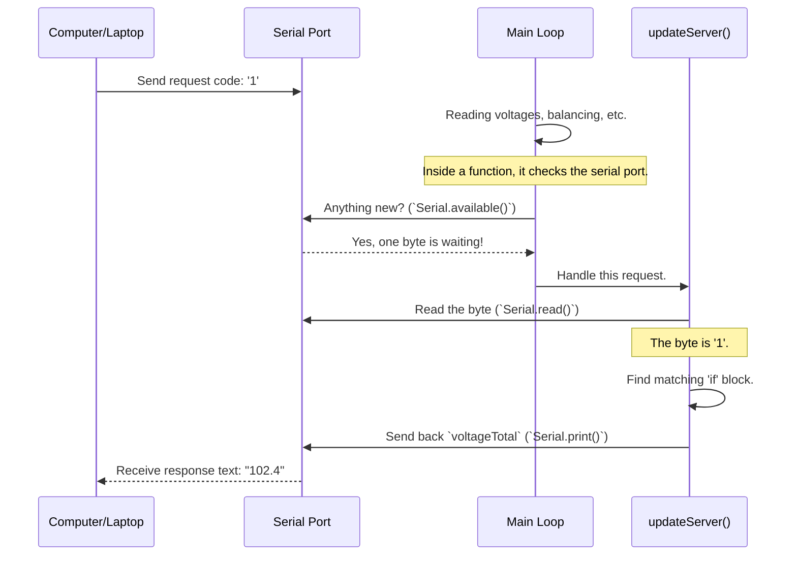

# Chapter 6: Data Reporting

In our last chapter, [Energy & Power Accounting](05_energy___power_accounting_.md), we turned our BMS into a smart "e-meter," capable of tracking real-time power and total energy consumption. We've gathered all this fantastic information—individual cell voltages, pack current, total energy used, and safety status. But this data is useless if it's trapped inside the microcontroller!

How do we get it out? This is the job of **Data Reporting**. Think of this system as the battery's dashboard and communication center. It's how the BMS presents all its valuable insights to the outside world, whether that's a human looking at a screen or another computer logging data.

### What Are We Trying to Do?

Our goal is to make the BMS's internal data visible and usable. We have two primary ways of doing this:
1.  **Local Display:** Show a simple, at-a-glance summary on a small LCD screen connected directly to the BMS. This is perfect for the user who needs to quickly check the battery status.
2.  **Remote Communication:** Allow an external device, like a laptop or a web server, to request specific pieces of information over a serial (USB) connection. This is for more advanced uses like data logging, creating custom dashboards, or remote monitoring.

---

### Method 1: The Local Dashboard (LCD Display)

The simplest way to see what the BMS is doing is to look at a screen. The `openBMS` project is designed to send key information to a small, serial-enabled LCD. This acts just like the dashboard in your car, giving you the most critical information without any fuss.

The BMS code periodically formats a string of text with the latest data and sends it to the LCD.

#### Code Example: Printing to the LCD

This code snippet is inside the main `loop()`. It runs over and over, keeping the screen updated.

```c++
// File: openBMS.pde

// --- Code for the first line of the LCD ---
selectLineOne();        // Move the cursor to the first line
LCD.print("E:");         // Print the label "E" for Energy
LCD.print(Wh);           // Print the total Watt-hours consumed
LCD.print(" A:");        // Print the label "A" for Amps
LCD.print(instantCurrent); // Print the current Amps

// --- Code for the second line of the LCD ---
selectLineTwo();        // Move the cursor to the second line
LCD.print("L");          // Print "L" for the lowest cell
LCD.print(lowestCellNumber); // Print which cell number is lowest
LCD.print(':');
LCD.print(LCDlowcell);   // Print the lowest cell's voltage

LCD.print(" H");         // Print "H" for the highest cell
LCD.print(highestCellNumber); // Print which cell number is highest
// ... and so on to print the highest voltage ...
```

Let's break down how this creates the display:
*   `selectLineOne()` and `selectLineTwo()`: These are helper functions that send a special command to the LCD to tell it where to start writing text.
*   `LCD.print()`: This function sends whatever you put inside the parentheses to the screen. It can be fixed text like `"E:"` or a variable like `Wh` (our total Watt-hours from [Energy & Power Accounting](05_energy___power_accounting_.md)).
*   **Input:** The code uses variables that are constantly being updated, like `Wh`, `instantCurrent`, `lowestCellNumber`, and `highestCellNumber`.
*   **Output:** The physical LCD screen will display something like this:
    ```
    E:2450 A:15
    L14:315 H22:331
    ```
    This gives the user a wealth of information in a tiny space: 2450 Watt-hours used, drawing 15 Amps, cell #14 is the lowest at 3.15V, and cell #22 is the highest at 3.31V.

---

### Method 2: Talking to a Computer (Serial Communication)

Displaying data on an LCD is great, but what if you want to log the battery's performance over an entire day? Or build a fancy graphical dashboard on your computer? For that, we need a way for the computer to ask for specific data.

This is done using a "request-response" model over the serial port (the same port you use to upload code).
1.  **Request:** Your computer sends a simple code (like the number `1` or `2`).
2.  **Response:** The BMS sees the code, understands what data is being requested, and sends just that piece of data back.

It's like ordering from a menu. You give the waiter a number, and they bring you a specific dish.

#### Code Example: The `updateServer()` function

This function is what listens for and responds to requests.

```c++
// File: openBMS.pde

void updateServer()
{
  // Check if there is an incoming request from the computer
  if(Serial.available() > 0)
  {
    // Read the incoming code (the "menu number")
    cellToSend = Serial.read();

    // Check which item was ordered
    if(cellToSend == 1)
    {
      Serial.print(voltageTotal); // Send back the total voltage
    }
    if(cellToSend == 2)
    {
      Serial.print(instantCurrent); // Send back the current
    }
    // ... more if-statements for other data points ...
    if(cellToSend > 4) // Requesting a specific cell's voltage
    {
      Serial.print(cellVoltage[cellToSend-4]);
    }
  }
}
```

*   `Serial.available() > 0`: This checks if the computer has sent any data.
*   `cellToSend = Serial.read()`: This reads the single byte of data (our request code) that the computer sent.
*   `if(cellToSend == 1)`: The code compares the request code to its "menu." If it matches `1`, it knows the computer wants the total voltage.
*   `Serial.print(voltageTotal)`: This sends the value of the `voltageTotal` variable back to the computer.

**Example Interaction:**
1.  **Computer sends:** `'2'`
2.  **BMS receives:** The `if(cellToSend == 2)` condition becomes true.
3.  **BMS sends back:** The text `15` (the current value of `instantCurrent`).

This simple system is incredibly powerful. It allows any other program to communicate with the BMS and get exactly the data it needs, when it needs it.

---

### Under the Hood: The Request-Response Cycle

How does the BMS notice an incoming request while it's busy doing everything else? The check is cleverly placed inside one of the most common functions. Let's trace a request.



The check for an incoming message (`if(Serial.available() > 0)`) happens inside the `readVolts()` function. This is a function that is called very frequently in the main loop and has a built-in delay. Placing the check here is an efficient way to make sure the BMS is always listening for requests without slowing down its other critical tasks.

The logic is simple:
1.  **Listen:** In between its primary duties, the BMS peeks at the serial port to see if a message has arrived.
2.  **Trigger:** If a message is there, it calls the `updateServer()` function.
3.  **Process:** `updateServer()` reads the message, figures out what data is needed, and sends it back.

### Conclusion

You've now learned how the `openBMS` communicates its wealth of information to the user and to other devices.

1.  **Data Reporting** is the system's dashboard, making internal data visible.
2.  It uses two methods: **pushing** data to a local **LCD screen** for a quick visual summary, and **pulling** data on-demand via **serial communication** for logging and advanced control.
3.  The LCD output provides a simple, user-friendly "at-a-glance" view of the battery's status.
4.  The serial request-response model provides a flexible and powerful way for other computers to get specific data points.

Over the past six chapters, we have explored the high-level logic of the BMS: configuration, monitoring, safety, balancing, accounting, and reporting. We've often said that the BMS "talks to the monitoring chips." But how does that conversation actually happen? In our final chapter, we will dive deep into the low-level communication protocol used to command the specialized LTC6802-2 chips that form the heart of our monitoring system.

Next up: [LTC6802-2 Chip Communication](07_ltc6802_2_chip_communication_.md)

---

Generated by [AI Codebase Knowledge Builder](https://github.com/The-Pocket/Tutorial-Codebase-Knowledge)