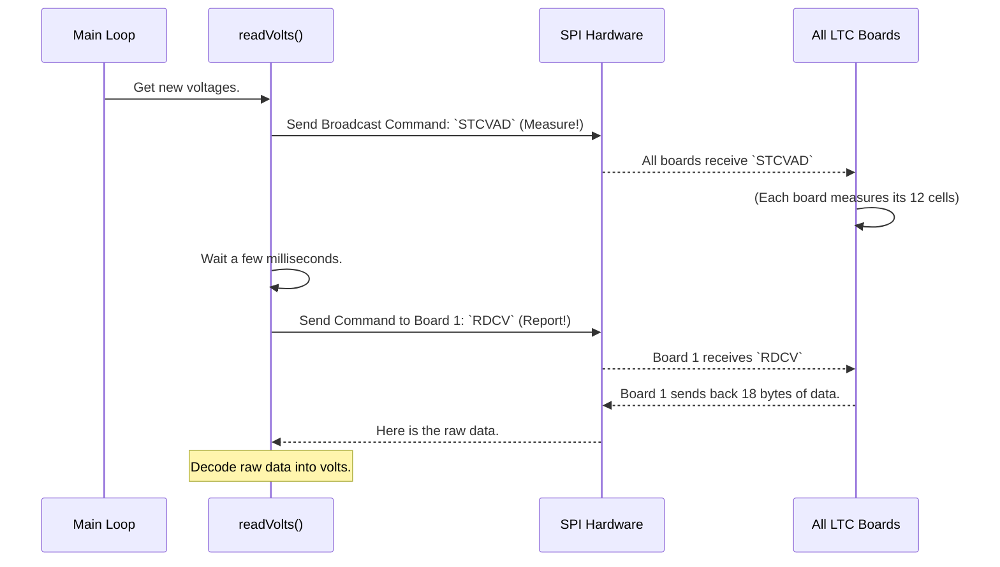

# Chapter 7: LTC6802-2 Chip Communication

Over the last six chapters, we've explored the "brains" of the `openBMS`. We've configured its rules, monitored its health, and reported its data. We've often used phrases like "the BMS reads the cell voltages" or "it tells the board to balance a cell." But we've treated the hardware as a magic box that just gives us the numbers we ask for.

In this final chapter, we're going to open that magic box. We'll learn how our software *actually talks* to the specialized hardware that does the real work: the LTC6802-2 monitoring chips. This low-level conversation is the foundation upon which every other feature is built.

Think of it this way: a team manager can have the best strategy in the world, but it's useless if they can't speak the same language as their players. **LTC6802-2 Chip Communication** is the system for speaking the precise, technical "language" of our battery monitoring hardware.

### What Are We Trying to Do?

Our goal is to understand how the main controller sends commands and receives data from the LTC6802-2 daughter boards. We will focus on the most fundamental task: asking a board, "What are the voltages of the cells you are watching?"

This isn't a simple conversation. The chip doesn't understand high-level commands like `readVolts()`. It speaks a very specific dialect made of two parts:
1.  **A communication protocol (SPI):** The grammar and rules of the conversation.
2.  **A set of command codes:** The specific vocabulary for asking questions and giving orders.

Let's learn this new language.

---

### Concept 1: The Rules of Conversation (SPI)

The controller and the LTC chips talk to each other using a protocol called the **Serial Peripheral Interface (SPI)**. Think of SPI as a set of strict rules for a phone call between two devices.

*   **Chip Select (CS):** You have to dial the right number to talk to a specific person. The controller uses a "Chip Select" line to pick which of the three monitoring boards it wants to talk to. In our code, you see this as `TALK` (to start talking) and `DONE` (to hang up).
*   **Clock (SCK):** Both people on the call need to speak at the same pace. The "Clock" line is a timing signal that synchronizes the conversation, ensuring bits of data are sent and received at the perfect moment.
*   **Data Lines (MOSI/MISO):** A phone call has one person talking and one person listening. SPI has two dedicated data lines:
    *   **MOSI (Master Out, Slave In):** The controller (Master) uses this line to *send commands* to the LTC chip (Slave).
    *   **MISO (Master In, Slave Out):** The LTC chip (Slave) uses this line to *send data back* to the controller.

```mermaid
graph TD
    subgraph Controller (Master)
        Controller_CS[Chip Select]
        Controller_SCK[Clock]
        Controller_MOSI[Data Out]
        Controller_MISO[Data In]
    end
    subgraph LTC6802-2 Board (Slave)
        LTC_CS[Chip Select]
        LTC_SCK[Clock]
        LTC_MOSI[Data In]
        LTC_MISO[Data Out]
    end

    Controller_CS -->|Selects which board to talk to| LTC_CS
    Controller_SCK -->|Synchronizes the conversation| LTC_SCK
    Controller_MOSI -->|Controller sends a command| LTC_MOSI
    LTC_MISO -->|Board sends a response| Controller_MISO
```

This four-wire system is the physical backbone of our communication.

### Concept 2: The Vocabulary (Command Codes)

Now that we know the rules of the conversation, we need to know what words to say. The LTC6802-2 chip has a predefined list of commands it understands. These are defined as constants at the top of our `openBMS.pde` file.

#### Code Example: Command Code Definitions

```c++
// File: openBMS.pde

// LTC6802-2 Command Codes 
#define WRCFG  0x01  // Write Configuration Registers
#define RDCFG  0x02  // Read Configuration 
#define RDCV   0x04  // Read Cell Voltages

#define STCVAD 0x10  // Start all A/D's (Analog-to-Digital Converters)
```

These are like buttons on a vending machine.
*   If we send the code `0x10` (`STCVAD`), we're telling all the chips: "Get ready and measure the voltages of your cells now!"
*   If we send `0x04` (`RDCV`), we're asking: "Please send me the results of the measurements you just took."
*   If we send `0x01` (`WRCFG`), we're saying: "I'm about to send you a new set of instructions, like which cells to balance." This is used in [Cell Balancing](04_cell_balancing_.md).

---

### A Real Conversation: Reading Cell Voltages

Let's put it all together and trace the process of reading voltages, which happens inside the `readVolts()` function. It's a two-step dialogue.

#### Step 1: "Everybody, Measure Now!"

First, the controller needs to tell *all* the monitoring boards to take a voltage reading at the same time. This is a "broadcast" command.

##### Code Example: Sending the "Start Measurement" Command

```c++
// File: openBMS.pde (simplified from readVolts())

void readVolts_Step1_TellToMeasure() {
  // Start the "phone call"
  TALK; // This pulls the Chip Select line LOW

  // Send the "Start Cell Voltage Measurement" command
  Spi.transfer(STCVAD); 

  // Hang up the "phone call"
  DONE; // This sets the Chip Select line HIGH
}
```

*   **Input:** The command constant `STCVAD` (which has a value of `0x10`).
*   **Output:** The controller sends the byte `0x10` out on the MOSI data line. Every LTC chip listening sees this command and starts its internal process to measure the voltage of each of its 12 cells. This takes a small amount of time.

#### Step 2: "Board #1, What Are Your Results?"

After telling the boards to measure, the controller waits a few milliseconds. Then, it goes to each board one by one to collect the data.

##### Code Example: Collecting Data from One Board

```c++
// File: openBMS.pde (simplified from readVolts())

void readVolts_Step2_CollectResults(byte boardAddress) {
  // Start a new call, this time to a specific board
  TALK;

  // First, send the address of the board we want to talk to
  Spi.transfer(boardAddress);
  
  // Second, send the "Read Cell Voltages" command
  Spi.transfer(RDCV);

  // Now, listen for the 18 bytes of data the board sends back
  for(int i=0; i<18; i++) {
    ltcResponse[i] = Spi.transfer(0x00); // Read one byte from MISO
  }

  // Hang up
  DONE;
}
```

*   **Input:** The `boardAddress` (e.g., `0x80` for board 1) and the command `RDCV`.
*   **Output:** The board sends back a stream of 18 bytes, which are stored in the `ltcResponse` array. These 18 bytes contain the raw, encoded voltage readings for all 12 cells on that board. The complex bit-shifting code inside `readVolts()` then acts as a "decoder ring" to turn this raw data into the human-readable voltages we use everywhere else.

This process is then repeated for board #2, board #3, and so on.

---

### Under the Hood: Tracing the Dialogue

Let's visualize this two-step conversation with a sequence diagram.



This sequence—broadcast a command, then poll each device individually for a response—is a very common and robust pattern in embedded systems. It's the engine that powers our entire [Battery State Monitoring](02_battery_state_monitoring_.md) system.

### Conclusion

Congratulations! You've reached the end of the `openBMS` software tutorial and peered into the lowest level of its operation. You've learned that:

1.  **LTC6802-2 Communication** is the process of "speaking the language" of the monitoring hardware.
2.  This language consists of a protocol, **SPI**, which defines the rules of conversation (Chip Select, Clock, Data lines).
3.  It also has a vocabulary of **Command Codes** (`STCVAD`, `RDCV`, etc.) that represent specific actions.
4.  Reading voltages is a two-step process: first, broadcast a "measure" command, then poll each chip individually to collect its results.
5.  This low-level communication is the fundamental bridge between the software's logic and the physical world of the battery.

Across these seven chapters, you've journeyed from high-level configuration all the way down to the bits and bytes of hardware communication. You now have a complete picture of how `openBMS` works to protect, manage, and monitor a battery pack. We hope this knowledge empowers you to build, customize, and innovate with your own battery management projects

---

Generated by [AI Codebase Knowledge Builder](https://github.com/The-Pocket/Tutorial-Codebase-Knowledge)