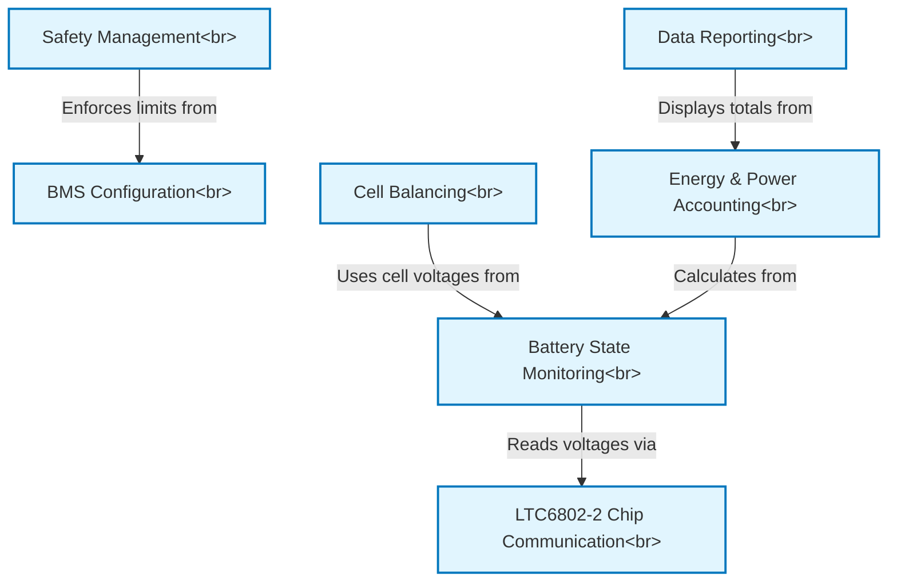

# Tutorial: openBMS

This project is the *brain* for a custom electric vehicle battery pack. Its main job is to constantly monitor the voltage of every single battery cell to ensure the pack operates **safely**. It protects the battery by preventing over-charging or over-discharging, performs automatic **cell balancing** to maximize the pack's lifespan and capacity, and acts as a *fuel gauge* by tracking energy usage. All this vital information is then reported to an LCD screen and a computer.

**Source Repository:** [None](None)

## Chapters

1. [BMS Configuration
](01_bms_configuration_.md)
2. [Battery State Monitoring
](02_battery_state_monitoring_.md)
3. [Safety Management
](03_safety_management_.md)
4. [Cell Balancing
](04_cell_balancing_.md)
5. [Energy & Power Accounting
](05_energy___power_accounting_.md)
6. [Data Reporting
](06_data_reporting_.md)
7. [LTC6802-2 Chip Communication
](07_ltc6802_2_chip_communication_.md)

---

Generated by [AI Codebase Knowledge Builder](https://github.com/The-Pocket/Tutorial-Codebase-Knowledge)