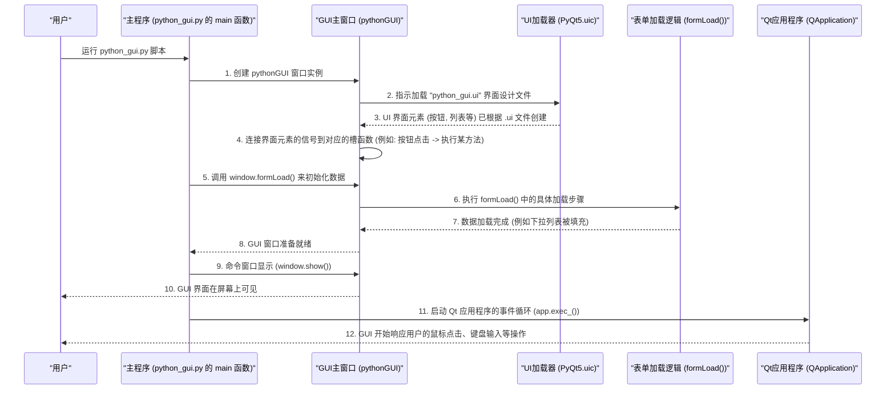

# Chapter 1: Python 图形用户界面 (Python GUI)


欢迎来到 `python_env` 项目的教程！在本章中，我们将一起探索项目的心脏和面孔——Python 图形用户界面 (Python GUI)。

## 1. GUI 是什么？为什么我们需要它？

想象一下，你正在操作一台非常复杂的机器，比如一个用于测试最新电脑芯片的开发板。你可能需要查看它的当前状态（比如温度、电压），或者改变它的一些内部设置（我们称之为“[寄存器 (Register)](02_寄存器__register__.md)”），甚至可能需要给它安装新的控制软件（称为“[固件更新 (Firmware Update)](08_固件更新__firmware_update__.md)”）。

如果每次操作都需要输入一长串复杂的命令行指令，那将会非常低效且容易出错。这时，图形用户界面 (GUI) 就派上用场了！

`python_env` 项目的 Python GUI，就像是这台复杂机器的**仪表盘和控制台**。它为你提供了一个直观的、可视化的界面，让你能够：

*   轻松查看硬件状态。
*   手动读取和写入芯片的[寄存器 (Register)](02_寄存器__register__.md)。
*   启动[固件更新 (Firmware Update)](08_固件更新__firmware_update__.md)流程。
*   运行 [API 测试 (API Client)](05_api_客户端__api_client__.md) 来检查硬件接口。
*   执行[验证脚本 (Validation Scripts)](07_验证脚本__validation_scripts__.md) 来确保硬件功能正常。

简单来说，这个 GUI 将你的鼠标点击和键盘输入，巧妙地转化成对后端复杂功能的调用。它使得与硬件的交互变得简单友好，即使是对命令行不太熟悉的新手也能快速上手。

## 2. 构建 GUI 的工具：PyQt5

我们的 GUI 是使用一个名为 PyQt5 的 Python 工具包构建的。PyQt5 是一套非常强大的库，它允许我们用 Python 语言来创建具有丰富特性（如按钮、文本框、下拉菜单、图表等）的桌面应用程序。

你可以把 PyQt5 想象成一个巨大的乐高积木盒，里面有各种各样预制好的“界面零件”（我们称之为“部件”或 "widgets"）。开发者可以像搭积木一样，把这些零件组合起来，设计出应用程序的外观和交互方式。

## 3. 启动我们的 GUI：初次见面

说了这么多，让我们看看如何启动这个 GUI。在 `python_env` 项目中，GUI 的主要入口点是 `python_gui/python_gui.py` 文件。

当你运行这个 Python 脚本时，它会执行一个 `main()` 函数，这个函数负责创建和显示我们的 GUI 应用程序窗口。

```python
# 文件: python_gui\python_gui.py

# 导入必要的 PyQt5 模块和其他辅助模块
from PyQt5.QtCore import Qt
from PyQt5.QtWidgets import QApplication, QMainWindow
from PyQt5 import uic
# ... 其他导入 ...

# 这是我们 GUI 的主窗口类，继承自 QMainWindow
class pythonGUI(QMainWindow):
    # ... (省略了模型定义等) ...
    def __init__(self):
        super(pythonGUI, self).__init__()
        # 从 "python_gui.ui" 文件加载用户界面的设计布局
        # 这个 .ui 文件通常是用 Qt Designer 这样的可视化工具设计的
        uic.loadUi("gui_forms\\python_gui.ui", self)
        # ... (省略了 API 客户端初始化等) ...
        self.show() # 最后，显示这个窗口

        # --- 将界面上的控件（如按钮）的动作（如点击）连接到相应的处理函数 ---
        # 例如，当 rw_registers 选项卡中的 "btnApplyChanges" 按钮被点击时，
        # 会调用 self.writeRegister 这个方法来写入寄存器
        self.btnApplyChanges.clicked.connect(self.writeRegister)

        # 当 fw_update 选项卡中的 "btnFwUpdate" 按钮被点击时，
        # 会调用 self.fw_update 这个方法来执行固件更新
        self.btnFwUpdate.clicked.connect(self.fw_update)
        
        # ... (还有很多其他的控件事件连接) ...

    # 这个方法会在 GUI 加载时被调用，用于填充初始数据
    def formLoad(self): 
        # 具体的加载逻辑在 form_load.py 文件中定义
        from gui_forms.form_load import formLoad as actual_form_load
        actual_form_load(self)

    # ... (省略了各个按钮点击事件的具体处理方法定义) ...

# 程序的主入口
def main():
    app = QApplication([])  # 创建一个 Qt 应用程序实例，管理 GUI 的事件循环
    window = pythonGUI()    # 创建我们的 pythonGUI 主窗口实例
    window.formLoad()       # 调用 formLoad 方法来初始化窗口内容
    app.exec_()             # 启动应用程序的事件循环，等待用户操作

if __name__ == '__main__':
    main()
```

**代码解释**：

1.  **`import` 语句**：导入了 PyQt5 的核心类，如 `QApplication` (应用程序对象)、`QMainWindow` (主窗口基类)，以及 `uic` (用于加载 `.ui` 设计文件)。
2.  **`pythonGUI` 类**：
    *   它继承自 `QMainWindow`，这是 PyQt5 中标准的应用程序主窗口。
    *   在 `__init__` (构造函数) 中：
        *   `uic.loadUi("gui_forms\\python_gui.ui", self)`: 这行代码非常关键。它读取一个名为 `python_gui.ui` 的文件，这个文件是用图形化工具（如 Qt Designer）预先设计好的界面布局。它会自动创建所有的按钮、文本框等，并将它们添加到窗口中。
        *   `self.show()`: 让窗口显示出来。
        *   `self.btnApplyChanges.clicked.connect(self.writeRegister)`: 这是 PyQt5 中著名的**信号和槽 (signals and slots)** 机制。它的意思是：当 `btnApplyChanges` 这个按钮被 `clicked` (点击，这是一个信号) 时，自动调用 `self.writeRegister` 这个函数 (槽)。这就像是连接电路，按钮按下（信号）触发了某个动作（槽函数执行）。
3.  **`formLoad()` 方法**：这个方法负责在 GUI 第一次显示时，加载一些初始数据和配置。例如，填充下拉列表、设置默认值等。我们稍后会看到它具体做了什么。
4.  **`main()` 函数**：
    *   `app = QApplication([])`: 每个 PyQt5 应用都需要一个 `QApplication` 对象。它负责管理应用程序范围的设置、事件处理等。
    *   `window = pythonGUI()`: 创建我们自定义的 `pythonGUI` 类的实例，也就是我们的主窗口。
    *   `window.formLoad()`: 在窗口显示前，调用 `formLoad` 初始化数据。
    *   `app.exec_()`: 这是程序的主循环。一旦执行这行代码，应用程序就会开始监听用户的操作（如鼠标点击、键盘输入），并根据这些操作触发相应的信号和槽。程序会一直停留在这里，直到窗口被关闭。

当你运行这个 `python_gui.py` 文件后，一个窗口就会出现在你的屏幕上，这就是 `python_env` 的主控制界面！

## 4. GUI 的“幕后英雄”：它是如何工作的？

我们已经看到了如何启动 GUI，那么它内部是如何运作的呢？当 GUI 启动并运行时，会发生一系列事情：

### 4.1. 启动流程概览

下面是一个简化的流程图，展示了从运行脚本到 GUI 显示并响应用户操作的过程：



这个图展示了：
1.  用户运行脚本。
2.  `main()` 函数创建 `pythonGUI` 类的实例。
3.  `pythonGUI` 使用 `uic` 从 `.ui` 文件加载界面布局。
4.  界面上的各种控件（按钮、列表等）的事件（如点击）被连接到相应的处理函数（槽）。
5.  调用 `formLoad()` 方法来填充初始数据。
6.  最后，窗口显示出来，`QApplication` 的事件循环开始运行，等待用户的交互。

### 4.2. 界面初始化：`formLoad` 的作用

在 `pythonGUI` 类中，我们看到了 `formLoad()` 方法的调用。这个方法的具体实现在 `python_gui/gui_forms/form_load.py` 文件中。它的主要任务是在 GUI 启动时，准备好界面上需要显示的初始内容。

让我们看一看 `formLoad.py` 中 `formLoad` 函数的简化版：

```python
# 文件: python_gui\gui_forms\form_load.py

# 导入各种初始化和数据加载函数
from registers.parseDatFile import parseDatFile, loadPartsList 
# (parseDatFile 用于解析寄存器定义文件，我们将在后续章节详细介绍)
# [DAT/CSV 文件解析器 (DAT/CSV Parser)](04_dat_csv_文件解析器__dat_csv_parser__.md)
# [寄存器文件 (Register File)](03_寄存器文件__register_file__.md)

from api_tester.api_tester import api_tester_load 
# (api_tester_load 用于加载 API 测试相关内容)
# [API 客户端 (API Client)](05_api_客户端__api_client__.md)

from validation.validation_scripts import validation_scripts_load
# (validation_scripts_load 用于加载验证脚本列表)
# [验证脚本 (Validation Scripts)](07_验证脚本__validation_scripts__.md)

from fw_update.fw_update import fw_update_load
# (fw_update_load 用于加载固件更新界面的选项)
# [固件更新 (Firmware Update)](08_固件更新__firmware_update__.md)

def formLoad(self_gui): # self_gui 参数是 pythonGUI 主窗口的实例
    # 1. 加载可用的硬件部件列表 (例如，板上的不同芯片)
    loadPartsList(self_gui)

    # 2. 解析描述硬件寄存器等信息的 .dat 文件
    parseDatFile()

    # 3. 根据加载的数据，更新界面上各个下拉菜单的初始选项和显示
    self_gui.cmbPartTextChanged()    # 更新部件选择相关的下拉菜单
    self_gui.cmbBankTextChanged()    # 更新 Bank 选择相关的下拉菜单
    self_gui.cmbRegistersTextChanged() # 更新寄存器选择相关的下拉菜单
    self_gui.rdoToggled()            # 更新数据显示格式 (十六进制/十进制)

    # 4. 为 GUI 的其他功能模块加载初始数据
    api_tester_load(self_gui)         # 初始化 API 测试器选项卡
    validation_scripts_load(self_gui) # 初始化验证脚本选项卡
    fw_update_load(self_gui)          # 初始化固件更新选项卡
```

**代码解释**：

*   `formLoad(self_gui)`: 这个函数接收主 GUI 窗口 (`pythonGUI` 的实例) 作为参数，这样它就可以访问和修改 GUI 上的控件。
*   `loadPartsList(self_gui)`: 尝试识别连接的硬件部件，并填充到 GUI 的一个下拉列表中，让用户可以选择要操作的部件。
*   `parseDatFile()`: 这是一个非常重要的步骤。它会读取一些数据文件（通常是 `.dat` 或 `.csv` 格式），这些文件详细定义了硬件的[寄存器 (Register)](02_寄存器__register__.md)信息，比如它们的名称、地址、包含哪些字段等。我们会在[DAT/CSV 文件解析器 (DAT/CSV Parser)](04_dat_csv_文件解析器__dat_csv_parser__.md) 和 [寄存器文件 (Register File)](03_寄存器文件__register_file__.md) 章节深入了解。
*   `self_gui.cmbPartTextChanged()` 等方法调用：这些是主 GUI 类中定义的方法，它们会根据 `parseDatFile()` 加载的数据来更新界面上相应的下拉菜单和显示。
*   `api_tester_load(self_gui)`, `validation_scripts_load(self_gui)`, `fw_update_load(self_gui)`: 这些函数分别负责初始化 GUI 中 "API 测试"、"验证脚本" 和 "固件更新" 等模块的界面元素和数据。这些功能我们会在后续章节中逐一学习。

通过 `formLoad`，GUI 在启动时就已经准备好了与用户交互所需的基本数据和界面状态。

## 5. 总结

在本章中，我们对 `python_env` 项目的 Python 图形用户界面 (GUI) 有了初步的认识：

*   **GUI 的目的**：它提供了一个用户友好的界面，用于与复杂的硬件系统进行交互，充当仪表盘和控制台。
*   **核心技术**：GUI 是使用 PyQt5 工具包构建的，它允许我们用 Python 创建功能丰富的桌面应用。
*   **启动过程**：我们了解了 `python_gui.py` 中的 `main()` 函数如何创建 `QApplication` 和 `pythonGUI` 主窗口，以及 `.ui` 文件如何定义界面布局。
*   **信号和槽**：学习了 PyQt5 中重要的信号和槽机制，它使得界面控件的事件（如按钮点击）能够触发相应的处理函数。
*   **初始化**：我们看到了 `formLoad` 函数如何在 GUI 启动时加载和准备初始数据，例如从[寄存器文件 (Register File)](03_寄存器文件__register_file__.md) 中读取信息，并填充界面的各个部分。

这个 GUI 是我们与 `python_env` 项目后端功能交互的主要窗口。通过它，我们可以执行各种硬件操作，而无需深入了解底层的复杂命令。

在接下来的章节中，我们将更深入地探索 GUI 的各个组成部分以及它们所控制的后端功能。下一章，我们将聚焦于硬件交互的核心概念之一：[寄存器 (Register)](02_寄存器__register__.md)。

---

Generated by [AI Codebase Knowledge Builder](https://github.com/The-Pocket/Tutorial-Codebase-Knowledge)