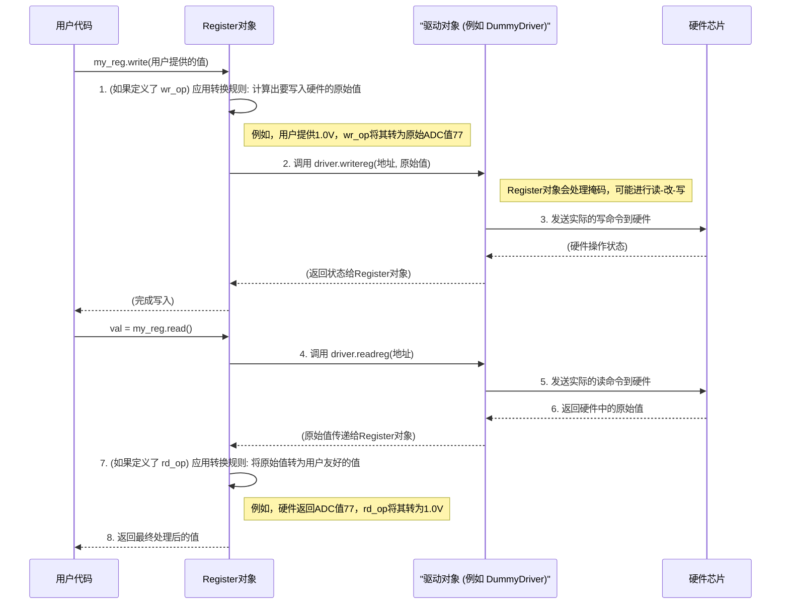

# Chapter 2: 寄存器 (Register)


在上一章[《Python 图形用户界面 (Python GUI)》](01_python_图形用户界面__python_gui__.md)中，我们了解了 `python_env` 项目的图形界面，它允许我们与硬件进行交互。当我们谈论“与硬件交互”时，很多时候我们实际上是在读取或修改硬件芯片内部的一些特定“设置”或“状态指示器”。这些，就是我们本章要讨论的核心概念——**寄存器 (Register)**。

## 1. 什么是寄存器？我们为什么关心它？

想象一下，你有一台非常先进的收音机。这台收音机有很多旋钮和开关：一个用来调频（选择电台），一个用来调音量，可能还有一个开关用来选择 AM 或 FM 模式。

在电子设备（比如电脑芯片、微控制器或我们项目中可能用到的各种硬件模块）内部，这些“旋钮”和“开关”通常就是通过**寄存器**来实现的。

**寄存器**可以被看作是硬件芯片内部的一个个微小的存储单元。每个寄存器都有一个唯一的**地址**（就像邮箱号码），并且可以存储一个特定的数值。这个数值可以：

*   **控制硬件行为**：比如，向某个寄存器写入特定的值可能会点亮一个 LED 灯，启动一个马达，或者改变一个传感器的采样频率。
*   **反映硬件状态**：比如，从某个寄存器读取值可能会告诉你当前的温度，某个操作是否完成，或者设备是否遇到了错误。

在 `python_env` 项目中，我们经常需要直接与这些硬件寄存器打交道，以配置硬件、触发操作或获取数据。如果直接用二进制数字和地址来操作会非常繁琐和易错。因此，我们需要一个更友好的方式来在软件中表示和操作这些硬件寄存器。

`Register` 对象，作为 [寄存器文件 (Register File)](03_寄存器文件__register_file__.md) 中的基本单元，就扮演了这个角色。它代表了一个具体的硬件寄存器。**就像地址簿里的一条联系人信息，它包含了访问该寄存器所需的所有信息，如地址、位掩码（哪些位是有效的）以及可能的读写转换规则。应用程序通过操作这些对象来读取或修改硬件状态。**

## 2. `Register` 类：软件中的硬件寄存器映射

在我们的 `python_env` 项目中，我们使用一个名为 `Register` 的 Python 类（定义在 `api_client/UREFE/common/prototype_com/register.py` 文件中）来在软件层面表示一个硬件寄存器。这个类封装了与特定寄存器交互所需的全部信息和逻辑。

一个 `Register` 对象主要包含以下重要信息：

*   **地址 (Address)**：这是硬件寄存器在芯片内存映射中的唯一位置。就像门牌号一样，它告诉我们去哪里找到这个寄存器。
*   **位掩码 (Mask)**：一个硬件寄存器通常包含多个位（比如8位、16位或32位）。有时候，我们只对其中的一部分位感兴趣。位掩码就像一个筛子，它精确地指出了在这个寄存器中，哪些位是属于我们当前定义的这个“逻辑寄存器”或“字段”的。
    *   例如，一个8位硬件寄存器 `0b10110101`，如果我们的 `Register` 对象的掩码是 `0b00001111` (即 `0x0F`)，那么我们只关心低4位 `0b0101`。当我们读取时，`Register` 类会自动提取这部分；当我们写入时，它也只会修改这部分，而保持其他位不变（通常通过“读-改-写”操作）。
*   **读/写转换规则 (Read/Write Operations, `rd_op`, `wr_op`)**: 有时，寄存器中存储的原始数值（通常是整数）需要转换成对用户更有意义的格式（比如电压、温度值），或者反过来。`rd_op` (read operation) 定义了从硬件读取原始值后如何转换成用户期望的值的规则（通常是一个 Python 表达式字符串，`value` 代表原始值）。`wr_op` (write operation) 则定义了用户提供的值如何转换成写入硬件的原始值的规则。
    *   例如，一个温度传感器寄存器的原始值范围可能是0-255，代表-40°C 到 85°C。`rd_op` 可能就是 `'value * 0.5 - 40'` 这样的转换公式。
*   **绑定驱动 (Driver Binding)**: `Register` 对象本身只知道寄存器的“描述信息”（地址、掩码等），但它不知道如何真正地与物理硬件通信（比如通过USB、JTAG或其他接口）。为此，每个 `Register` 对象需要被“绑定”到一个**驱动程序 (driver)** 对象上。这个驱动程序对象知道如何执行实际的硬件读写操作（例如，通过调用 `driver.readreg(address)` 和 `driver.writereg(address, data)`）。

## 3. 使用 `Register` 对象

让我们通过一个简单的例子来看看如何创建和使用一个 `Register` 对象。

假设我们要控制一个 LED 灯，这个 LED 的开关状态由硬件地址 `0x100` 处的寄存器的第0位（bit 0）控制：0表示关，1表示开。这个硬件寄存器是8位的，但我们只关心第0位。

```python
# 导入 Register 类 和 可能的错误类
from api_client.UREFE.common.prototype_com.register import Register, BoardError

# 首先，我们需要一个“驱动程序”的模拟。
# 在真实应用中，这将是一个与硬件通信的复杂对象。
# 这里我们创建一个非常简单的虚拟驱动。
class DummyDriver:
    def __init__(self):
        self._memory = {}  # 用一个字典来模拟硬件寄存器的存储空间

    def readreg(self, address):
        # 模拟从硬件读取寄存器值
        val = self._memory.get(address, 0) # 如果地址不存在，默认返回0
        print(f"驱动日志：从地址 {hex(address)} 读取到值 {hex(val)}")
        return val

    def writereg(self, address, data):
        # 模拟向硬件写入寄存器值
        print(f"驱动日志：向地址 {hex(address)} 写入值 {hex(data)}")
        self._memory[address] = data
        # 在真实硬件中，这里会发生实际的通信

# 1. 创建一个虚拟驱动的实例
my_hardware_driver = DummyDriver()

# 2. 创建一个 Register 对象来代表 LED 控制位
# 地址是 0x100，我们只关心第0位，所以掩码是 0x01
led_register = Register(address=0x100, mask=0x01)
print(f"创建 LED 寄存器对象：地址={hex(led_register.address)}, 掩码={hex(led_register.mask)}")

# 3. 将 Register 对象绑定到驱动程序
# 这样 led_register 就知道如何通过 my_hardware_driver 来读写硬件了
led_register.bind(my_hardware_driver)
print("LED 寄存器已成功绑定到驱动。")

# 4. 向寄存器写入值 (打开 LED)
# 我们想把第0位设置为1。由于掩码是0x01，Register类知道如何正确操作。
print("\n尝试打开 LED (写入 1 到寄存器的bit 0)...")
led_register.write(1) # 这会调用 my_hardware_driver.writereg(0x100, ...)
                      # Register 类内部会处理掩码，确保只修改目标位

# 5. 从寄存器读取值
current_led_status = led_register.read()
print(f"当前 LED 状态 (从寄存器读取): {current_led_status}") # 应该输出 1

# 6. 关闭 LED (写入 0)
print("\n尝试关闭 LED (写入 0 到寄存器的bit 0)...")
led_register(0) # Register 对象也支持像函数一样调用来写入值

# 7. 再次读取确认
print(f"当前 LED 状态 (再次读取): {int(led_register)}") # 也可以直接转换为整数来读取

# 8. 演示原始读写 (raw_read, raw_write)
# 这些方法通常会绕过 rd_op/wr_op (如果定义了的话)
# 并可能根据掩码进行不同的处理
# 假设硬件地址0x100当前值为0xAA (10101010)
my_hardware_driver._memory[0x100] = 0xAA
raw_value = led_register.raw_read()
print(f"\n假设硬件寄存器 0x100 值为 0xAA。")
print(f"通过掩码 0x01 进行 raw_read() 得到的值: {raw_value}") # 应该为 0 (0xAA & 0x01 = 0)

# 如果我们想设置一个带有读写转换的寄存器
# 比如一个表示电压的寄存器，硬件存的是原始ADC值 (0-255)，我们想用伏特单位 (0-3.3V)
voltage_adc_reg = Register(
    address=0x101,
    mask=0xFF, # 关心全部8位
    rd_op="value * (3.3/255.0)", # 读取原始值后转换为伏特
    wr_op="int(round(value * (255.0/3.3)))" # 用户提供伏特值，转换为原始ADC值写入
)
voltage_adc_reg.bind(my_hardware_driver)

# 模拟硬件中ADC值为128
my_hardware_driver.writereg(0x101, 128)
print(f"\n电压寄存器 (ADC原始值128) 读取 (带rd_op): {voltage_adc_reg.read():.2f} V")

# 用户想设置电压为 1.0V
voltage_adc_reg.write(1.0)
print(f"用户设置电压为 1.0V 后，写入硬件的原始ADC值: {hex(my_hardware_driver.readreg(0x101))}")
```

**代码解释**：

1.  **`DummyDriver` 类**：我们创建了一个简单的 `DummyDriver` 来模拟真实硬件驱动的行为。它有一个 `_memory` 字典来存储寄存器的值，并提供了 `readreg` 和 `writereg` 方法。
2.  **创建 `Register` 对象**：`led_register = Register(address=0x100, mask=0x01)` 创建了一个 `Register` 实例。它告诉我们这个逻辑寄存器位于硬件地址 `0x100`，并且我们只对最低位（由掩码 `0x01` 指定）感兴趣。
3.  **绑定 (`bind`)**：`led_register.bind(my_hardware_driver)` 将 `Register` 对象与我们的虚拟驱动连接起来。之后，所有对 `led_register` 的读写操作都会通过 `my_hardware_driver` 的 `readreg` 和 `writereg` 方法进行。
4.  **写入 (`write` 或 `__call__`)**：`led_register.write(1)` 或 `led_register(0)` 用于向寄存器写入值。`Register` 类内部会智能地处理这个写入。如果掩码不是全1（比如我们的 `0x01`），它通常会执行一个“读-修改-写”操作：
    *   读取地址 `0x100` 的当前完整值。
    *   根据掩码 `0x01` 修改需要改变的位（其他位保持不变）。
    *   将修改后的完整值写回地址 `0x100`。
5.  **读取 (`read` 或 `int()`, `str()`)**：`led_register.read()` 用于从寄存器读取值。`Register` 类会：
    *   从地址 `0x100` 读取完整值。
    *   应用掩码 `0x01` 来提取我们感兴趣的位。
    *   将提取出的位进行右移对齐，返回最终结果。
    例如，如果硬件寄存器 `0x100` 的值是 `0b10101011`，掩码是 `0x01`，`read()` 会返回 `1`。如果掩码是 `0b00001100` (bits 2 and 3)，且硬件值是 `0b10101110`，那么提取 `0b00001100`，右移两位后得到 `0b11` (即3)。
6.  **原始读写 (`raw_read`, `raw_write`)**: 这些方法通常用于直接与硬件值交互，它们可能绕过 `rd_op` 和 `wr_op` 转换。
7.  **带转换的寄存器**: `voltage_adc_reg` 演示了如何使用 `rd_op` 和 `wr_op` 来自动转换值。用户使用方便的单位（伏特），而 `Register` 类负责与硬件的原始整数值进行转换。

## 4. `Register` 类的内部工作机制

当我们调用 `my_register.write(value)` 或 `my_register.read()` 时，`Register` 对象内部发生了什么？

### 4.1 交互流程概览

以下是一个简化的序列图，展示了调用 `write()` 和 `read()` 时主要步骤：



### 4.2 关键代码片段解析 (简化版)

让我们深入 `register.py` (位于 `api_client/UREFE/common/prototype_com/`) 中的一些关键部分，理解其是如何工作的。
(注意：实际代码可能更复杂，这里只展示核心思想的简化逻辑。)

**初始化 (`__init__`)**:
当你创建一个 `Register` 对象时，构造函数会存储基本信息。

```python
# 文件: api_client/UREFE/common/prototype_com/register.py (简化示意)
class Register:
    def __init__(self, address, mask=0xFF, lsb=0, **kw):
        # self.rstruct 存储一个或多个 (地址, 掩码片段, lsb偏移) 元组
        # 对于简单寄存器，通常只有一个条目
        self.rstruct = [(address, mask, lsb)]
        self.driver = None # 驱动程序初始为空
        self.address = address # 主地址，方便访问
        self.mask = mask       # 主掩码，方便访问

        # kw (关键字参数) 用于设置可选属性，如 rd_op, wr_op, type
        self.options(**kw) # options 方法会处理这些额外参数

    def options(self, **kw):
        # 这个方法解析 rd_op, wr_op, type 等选项
        # 例如: self.rd_op = kw.get('rd_op')
        # 例如: self.wr_op = kw.get('wr_op')
        # ... 此处省略具体实现细节 ...
        for param_name, param_value in kw.items():
            if param_name == 'rd_op':
                self.rd_op = param_value
            elif param_name == 'wr_op':
                self.wr_op = param_value
            # ... 其他选项如 'type' (ENUM, STEP) ...
            # else: raise Exception("无效参数...")
        pass # 简化表示
```
构造函数主要保存了地址、掩码等，并通过 `options` 方法设置如 `rd_op` 和 `wr_op` 这样的转换规则。`rstruct` 允许一个逻辑寄存器跨越多个物理地址或由多个不连续的位段组成，但对于初学者，可以先理解为它通常只包含一个条目，对应我们定义的单个地址和掩码。

**绑定驱动 (`bind`)**:
这个方法将 `Register` 对象连接到一个实际的硬件通信驱动。

```python
# 文件: api_client/UREFE/common/prototype_com/register.py (简化示意)
    def bind(self, driver):
        self.driver = driver # 保存驱动程序的引用
```
`bind` 方法很简单，就是将传入的 `driver` 对象保存在 `self.driver` 成员变量中，供后续的读写操作使用。

**读取 (`read` 和 `raw_read`)**:
`read()` 方法提供用户友好的读取，它会应用 `rd_op`。`raw_read()` 则尝试获取寄存器中的原始值。

```python
# 文件: api_client/UREFE/common/prototype_com/register.py (简化示意)
    def raw_read(self):
        if not self.driver:
            raise BoardError("寄存器未绑定到驱动")

        value = 0
        # 遍历 rstruct 中的每个 (物理地址, 该地址上的掩码, lsb偏移)
        # 对于简单情况，rstruct 只有一个条目 (self.address, self.mask, 初始lsb参数)
        for reg_addr_info in self.rstruct:
            addr, mask_part, lsb_offset_part = reg_addr_info
            
            # 1. 从驱动读取该物理地址的完整值
            hw_val = self.driver.readreg(addr)
            
            # 2. 应用该部分的掩码，提取相关位
            current_part_val = hw_val & mask_part
            
            # 3. 将提取的位右移，使其对齐到最低位 (LSB)
            #    例如，如果 mask_part 是 0b11110000 (0xF0)，则右移4位
            temp_mask_for_shift = mask_part
            while (temp_mask_for_shift != 0) and ((temp_mask_for_shift & 1) == 0):
                current_part_val >>= 1
                temp_mask_for_shift >>= 1
            
            # 4. 如果有 lsb_offset_part，则左移以组合多字节/多片段寄存器
            #    对于单一片段的简单寄存器，如果 lsb_offset_part 为0，则此步无操作
            temp_lsb = lsb_offset_part
            while(temp_lsb > 0):
                current_part_val <<= 1
                temp_lsb -= 1
            
            value += current_part_val # 累加各个部分的值
        return value

    def read(self):
        if not self.driver:
            raise BoardError("寄存器未绑定到驱动")
        
        value = self.raw_read() # 获取原始值

        # 如果定义了 rd_op (读取转换规则)，则执行它
        if hasattr(self, 'rd_op') and self.rd_op:
            # exec 比较危险, 实际代码中可能有更安全的求值方式
            # 这里用一个字典来提供 'value' 变量给表达式
            local_namespace = {'value': value}
            exec(f"result = {self.rd_op}", globals(), local_namespace)
            value = local_namespace['result']
        
        # 如果定义了 type (例如 ENUM)，可能还会做进一步转换
        # ... 此处省略类型转换细节 ...
        return value
```
`raw_read` 的核心逻辑是从驱动读取数据，然后使用掩码提取并对齐所需的位。`read` 则在 `raw_read` 的基础上应用 `rd_op` 转换。
（注意：`exec` 的使用需要谨慎，实际项目中可能会采用更安全的表达式求值库。）

**写入 (`write` 和 `raw_write`)**:
`write()` 方法接受用户提供的值，应用 `wr_op`，然后调用 `raw_write()`。`raw_write()` 负责将原始值正确地写入硬件，处理掩码（可能执行读-改-写）。

```python
# 文件: api_client/UREFE/common/prototype_com/register.py (简化示意)
    def raw_write(self, value_to_write): # value_to_write 是已经右对齐的字段值
        if not self.driver:
            raise BoardError("寄存器未绑定到驱动")

        # 对于跨多个物理地址的复杂寄存器，此逻辑会更复杂，
        # 需要将 value_to_write 正确地分配到 rstruct 的各个部分。
        # 这里我们简化，假设rstruct只有一个条目，并且value_to_write是针对这个条目的。
        addr, mask_part, lsb_offset_part = self.rstruct[0] # 简化假设

        # 1. 对齐用户提供的值 (value_to_write) 到它在完整硬件寄存器中的实际位置
        #    如果 mask_part 是 0b11110000 (0xF0)，而 value_to_write 是 0x0A (字段值)
        #    那么 final_val_bits 应该变成 0xA0 (在完整寄存器中的形态)
        final_val_bits = value_to_write
        temp_mask_for_shift = mask_part
        while (temp_mask_for_shift != 0) and ((temp_mask_for_shift & 1) == 0):
            final_val_bits <<= 1
            temp_mask_for_shift >>= 1
        final_val_bits &= mask_part # 确保只在掩码位内

        # 2. 如果掩码不是覆盖整个可写宽度 (例如，不是0xFF对于8位寄存器)
        #    则需要执行读-修改-写操作，以避免破坏同一地址的其他位
        current_hw_val = self.driver.readreg(addr)
        new_hw_val = (current_hw_val & (~mask_part)) | final_val_bits
        
        self.driver.writereg(addr, new_hw_val)

    def write(self, value):
        if not self.driver:
            raise BoardError("寄存器未绑定到驱动")

        processed_value = value
        # 如果定义了 wr_op (写入转换规则)，则执行它
        if hasattr(self, 'wr_op') and self.wr_op:
            local_namespace = {'value': processed_value}
            # exec 比较危险, 实际代码中可能有更安全的求值方式
            exec(f"result = {self.wr_op}", globals(), local_namespace)
            processed_value = local_namespace['result']

        # 如果定义了 type (例如 ENUM)，可能还会做进一步转换
        # ... 此处省略类型转换细节 ...

        # 确保最终写入的是整数
        if isinstance(processed_value, float):
            processed_value = int(round(processed_value))
        elif not isinstance(processed_value, int):
            # 根据实际情况可能需要更复杂的类型检查和转换
            raise TypeError("写入寄存器的值最终必须是整数或可转换为整数")
            
        self.raw_write(processed_value)

    def __call__(self, value): # 允许 my_reg(value) 这种写法
        self.write(value)

    def __str__(self): # 允许 print(my_reg)
        return str(self.read())

    def __int__(self): # 允许 int(my_reg)
        return int(self.read())
```
`raw_write` 的关键在于，如果只修改寄存器的一部分（由`mask_part`决定），它会先读取当前硬件值，然后只更新掩码指定的部分，再写回，从而保留其他位不受影响。`write` 方法则在调用 `raw_write` 之前应用 `wr_op` 转换。
`__call__`, `__str__`, `__int__` 等魔术方法使得 `Register` 对象使用起来更加自然和 Pythonic。

这些 `Register` 对象是与硬件交互的基石。在实际应用中，一个设备可能有成百上千个寄存器。手动为每一个都创建一个 `Register` 对象会非常繁琐。因此，通常会将这些寄存器的定义（地址、掩码、名称、转换规则等）存储在数据文件中（例如 `.csv` 或 `.dat` 文件），然后由另一个更高级别的类来解析这些文件并自动创建所有的 `Register` 对象。这个“更高级别的类”就是我们下一章要讨论的 [寄存器文件 (Register File)](03_寄存器文件__register_file__.md)。

驱动程序（如 `my_hardware_driver`）的实际实现，例如如何通过USB或JTAG与硬件通信，则属于更底层的范畴，我们将在后续章节如 [通信包装器 (Communication Wrapper)](09_通信包装器__communication_wrapper__.md) 和 [FTDI/JTAG 通信 (FTDI/JTAG Communication)](10_ftdi_jtag_通信__ftdi_jtag_communication__.md) 中详细探讨。

## 5. 总结

在本章中，我们深入了解了“寄存器 (Register)”这一核心概念：

*   **什么是寄存器**：它们是硬件芯片内部的微小存储单元，用于控制硬件行为或反映其状态，每个寄存器都有地址和可以存储的值。
*   **`Register` 类**：在 `python_env` 中，`Register` 类是硬件寄存器在软件中的抽象表示。它封装了与特定寄存器交互所需的信息（地址、掩码）和逻辑（读写转换、与驱动程序的绑定）。
*   **核心属性**：我们学习了 `Register` 对象的关键组成部分：地址、位掩码、读写转换规则 (`rd_op`, `wr_op`)，以及绑定驱动的必要性。
*   **使用方法**：通过代码示例，我们看到了如何创建、绑定、读取和写入 `Register` 对象，包括使用转换规则和Pythonic的调用方式。
*   **内部机制**：我们探讨了 `Register` 类在执行读写操作时的大致流程，以及它如何与驱动程序协作来与实际硬件通信。

理解 `Register` 对象是掌握 `python_env` 项目中硬件控制部分的关键一步。它们是构成更复杂硬件接口抽象的基础。

在下一章中，我们将学习如何管理和使用大量的 `Register` 对象，我们将探讨 [寄存器文件 (Register File)](03_寄存器文件__register_file__.md) 的概念，它使得与整个芯片或模块的寄存器集合进行交互变得更加系统和便捷。

---

Generated by [AI Codebase Knowledge Builder](https://github.com/The-Pocket/Tutorial-Codebase-Knowledge)