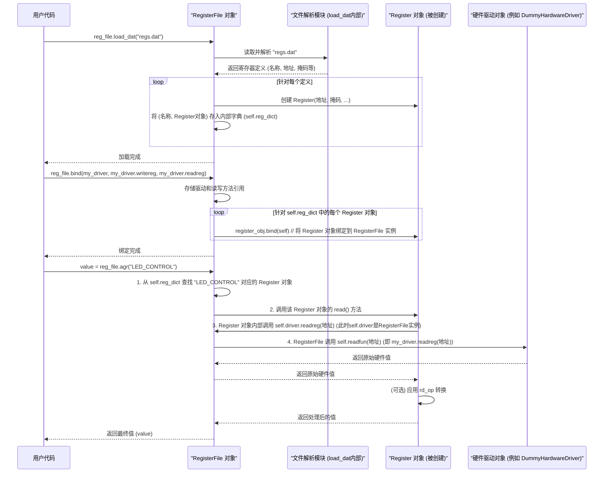

# Chapter 3: 寄存器文件 (Register File)


在上一章[《寄存器 (Register)》](02_寄存器__register__.md)中，我们学习了 `Register` 对象，它代表了硬件上的单个寄存器。我们了解了如何创建它、绑定驱动以及如何通过它来读写硬件值。然而，一个真实的硬件设备，比如一块复杂的芯片，通常包含成百上千个寄存器。如果我们为每一个寄存器都手动创建一个 `Register` 对象并单独管理它们，那将是一项非常繁琐且容易出错的工作。

想象一下，你正在整理一大堆名片，每张名片代表一个硬件寄存器，上面写着它的名字、地址等信息。如果这些名片随意散落，查找某一张特定名片会非常困难。这时，你就需要一个“名片夹”来系统地管理它们。

`寄存器文件 (Register File)` 对象就扮演了这个“名片夹”的角色。

## 1. 什么是寄存器文件？它解决了什么问题？

**寄存器文件 (Register File)** 代表了硬件设备上的一整组寄存器。你可以把它想象成一个硬件的“**地址簿**”或“**地图**”。这个地址簿里记录了设备上所有重要寄存器的信息：

*   **名称 (Name)**：每个寄存器都有一个易于记忆和使用的名字。
*   **地址 (Address)**：寄存器在硬件上的物理地址。
*   **位掩码 (Mask)**：定义了该寄存器名具体对应硬件寄存器中的哪些位。
*   以及其他可能的配置信息，比如读写操作的转换规则等。

`RegisterFile` 的核心任务是：

1.  **集中管理**：它内部维护一个字典（可以看作是“名册”），存储着所有已定义的 [寄存器 (Register)](02_寄存器__register__.md) 对象。
2.  **从文件加载定义**：它能够从特定格式的数据文件（比如 `.dat` 或 `.csv` 文件）中读取这些寄存器的定义信息，并自动为每个定义创建一个对应的 `Register` 对象。这样，我们就不需要手动在代码中逐个定义它们了。这个加载过程通常会涉及到 [DAT/CSV 文件解析器 (DAT/CSV Parser)](04_dat_csv_文件解析器__dat_csv_parser__.md) 的功能。
3.  **按名称访问**：应用程序可以通过寄存器的名字（例如 `MY_CHIP_CONFIG_REG`）来方便地从 `RegisterFile` 中获取对应的 `Register` 对象，然后进行读写操作，而无需记住它们复杂的物理地址或位掩码。
4.  **提供便捷的交互方法**：`RegisterFile` 通常还会提供一些便捷的方法，比如 `agr` (Atomically Get Register，原子读取寄存器) 和 `asr` (Atomically Set Register，原子设定寄存器)，让用户可以直接通过寄存器名称来读取或设置值。

简单来说，`RegisterFile` 就像一个智能的“硬件管家”，它帮助我们组织和访问设备上的大量寄存器，使得与硬件的交互更加高效和规范。

## 2. 如何使用 `RegisterFile`？

让我们通过一个简化的例子来看看如何使用 `RegisterFile`。假设我们有一个硬件设备，它的寄存器定义存储在一个名为 `my_device_regs.dat` 的文件中。

**示例 `my_device_regs.dat` 文件内容 (简化版):**

```
# 这是一个注释行
# 字段名           位范围   地址     寄存器全名        默认值  属性
DEVICE_STATUS     7:0     0x100    SYS.DEVICE_STATUS   0x00    RO
LED_CONTROL       0:0     0x104    SYS.LED_CONTROL     0x0     RW
TEMP_SENSOR_HIGH  15:8    0x108    ADC.TEMP_SENSOR     0x00    RO
TEMP_SENSOR_LOW   7:0     0x108    ADC.TEMP_SENSOR     0x00    RO
```

*   `DEVICE_STATUS`：一个8位只读寄存器，地址为 `0x100`。
*   `LED_CONTROL`：一个1位读写寄存器（控制LED开关），位于地址 `0x104` 的第0位。
*   `TEMP_SENSOR_HIGH` 和 `TEMP_SENSOR_LOW`：它们共同组成一个16位的温度传感器值，共享地址 `0x108`。`_HIGH` 是高8位，`_LOW` 是低8位。`RegisterFile` 和 `Register` 类能够处理这种跨位或共享地址的情况。

现在，我们来看一下 Python 代码如何使用 `RegisterFile` 来加载这些定义并与它们交互。

```python
# 导入 RegisterFile 类和可能的 Register 类 (通常 RegisterFile 内部会使用)
from api_client.UREFE.common.prototype_com.registerfile import RegisterFile
# from api_client.UREFE.common.prototype_com.register import Register # RegisterFile会创建它们

# 假设这是我们的虚拟硬件驱动程序，与上一章类似
class DummyHardwareDriver:
    def __init__(self):
        self._memory = {0x100: 0x42, 0x104: 0x00, 0x108: 0x1A2B} # 预设一些硬件值

    def readreg(self, address):
        val = self._memory.get(address, 0)
        print(f"驱动日志：从地址 {hex(address)} 读取到值 {hex(val)}")
        return val

    def writereg(self, address, data):
        print(f"驱动日志：向地址 {hex(address)} 写入值 {hex(data)}")
        self._memory[address] = data
        # 注意：真实驱动会将整个字写入，RegisterFile/Register的掩码处理确保其他位安全

# 1. 创建 RegisterFile 实例
# wordsize=16 表示我们的寄存器数据通路是16位的（尽管有些寄存器可能只用一部分）
# 这是一个示例参数，实际应根据硬件设定
reg_file = RegisterFile(wordsize=16) 
print("RegisterFile 实例已创建。")

# 2. 加载寄存器定义
# 假设我们有一个 "my_device_regs.dat" 文件，内容如上所示
# 注意：实际使用时，你需要确保文件路径正确，并且文件内容符合 RegisterFile 的解析格式
# 为了本示例能直接运行，我们假设 load_dat 成功创建了几个 Register 对象
# 在真实项目中，你需要创建一个实际的 .dat 文件
try:
    # reg_file.load_dat("my_device_regs.dat") # 真实情况下会调用这个
    # 手动模拟加载结果，以便演示
    from api_client.UREFE.common.prototype_com.register import Register
    reg_file.reg_dict["DEVICE_STATUS"] = Register(address=0x100, mask=0xFF)
    reg_file.reg_dict["LED_CONTROL"] = Register(address=0x104, mask=0x01)
    # TEMP_SENSOR_HIGH 和 TEMP_SENSOR_LOW 需要更复杂的 rstruct 或分别定义
    # 为了简化，我们只模拟一个简单的 TEMP_SENSOR
    reg_file.reg_dict["TEMP_SENSOR"] = Register(address=0x108, mask=0xFFFF) 
    print("寄存器定义已（模拟）加载。")
except FileNotFoundError:
    print("错误：my_device_regs.dat 文件未找到。请确保文件存在于正确路径。")
    exit()

# 3. 创建硬件驱动实例
my_driver = DummyHardwareDriver()
print("虚拟硬件驱动已创建。")

# 4. 将驱动绑定到 RegisterFile
# RegisterFile 会将这个驱动信息传递给它包含的所有 Register 对象
reg_file.bind(driver=my_driver, 
              writefun=my_driver.writereg, # 指定驱动中用于写操作的方法
              readfun=my_driver.readreg)   # 指定驱动中用于读操作的方法
print("驱动已绑定到 RegisterFile。")

# 5. 通过名称访问和操作寄存器
# 5.1 使用 agr (Get Register) 和 asr (Set Register) 方法

# 读取 DEVICE_STATUS 寄存器
status_val = reg_file.agr("DEVICE_STATUS") 
print(f"通过 agr 读取 DEVICE_STATUS 值: {hex(status_val)}") # 应该读取 0x42

# 设置 LED_CONTROL 寄存器来“打开”LED (写入 1)
reg_file.asr("LED_CONTROL", 1) 
led_val_after_set = reg_file.agr("LED_CONTROL")
print(f"通过 asr 设置 LED_CONTROL 为 1 后，读取值为: {led_val_after_set}") # 应该为 1

# 5.2 直接获取 Register 对象并操作 (如果需要更复杂的操作)
if "LED_CONTROL" in reg_file.reg_dict:
    led_register_obj = reg_file.LED_CONTROL # 也可以通过属性方式访问
    # 或者 led_register_obj = reg_file.reg_dict["LED_CONTROL"]
    
    led_register_obj.write(0) # 关闭 LED
    print(f"通过 Register 对象关闭 LED 后，读取值为: {int(led_register_obj)}") # 应该为 0
else:
    print("错误：LED_CONTROL 寄存器未在 reg_file 中定义。")

# 读取 TEMP_SENSOR (作为一个16位值)
temp_val = reg_file.agr("TEMP_SENSOR")
print(f"通过 agr 读取 TEMP_SENSOR 值: {hex(temp_val)}") # 应该读取 0x1A2B
```

**代码解释**：

1.  **创建 `RegisterFile` 实例**：`reg_file = RegisterFile(wordsize=16)`。`wordsize` 参数告诉 `RegisterFile` 硬件寄存器的基本宽度（例如，地址总线上一次读写的数据宽度）。
2.  **加载定义 (`load_dat`)**：`reg_file.load_dat("my_device_regs.dat")` (此处为模拟加载)会读取指定的 `.dat` 文件。该方法内部解析文件内容，为每一条有效的寄存器定义创建一个 [寄存器 (Register)](02_寄存器__register__.md) 对象，并将其存储在 `reg_file` 内部的一个字典中（通常是 `self.reg_dict`），用寄存器的名字作为键。
    *   我们将在 [DAT/CSV 文件解析器 (DAT/CSV Parser)](04_dat_csv_文件解析器__dat_csv_parser__.md) 章节更详细地了解文件格式和解析过程。现在，你只需要知道 `load_dat` (或 `load_csv`) 会帮我们自动创建一堆 `Register` 对象。
3.  **创建驱动实例**：我们创建了一个 `DummyHardwareDriver` 的实例，它模拟了与真实硬件的通信。
4.  **绑定驱动 (`bind`)**：`reg_file.bind(...)` 是非常关键的一步。它告诉 `RegisterFile` 如何与硬件通信。
    *   `driver=my_driver`：传递实际的驱动对象。
    *   `writefun=my_driver.writereg`：告诉 `RegisterFile` 当需要写寄存器时，应该调用 `my_driver` 对象的 `writereg` 方法。
    *   `readfun=my_driver.readreg`：告诉 `RegisterFile` 当需要读寄存器时，应该调用 `my_driver` 对象的 `readreg` 方法。
    `RegisterFile` 在被绑定后，会确保其内部所有的 `Register` 对象也都被正确地配置，以便能通过这个指定的驱动进行实际的硬件读写。
5.  **访问和操作寄存器**：
    *   **`agr("REGISTER_NAME")`**：这是 `RegisterFile` 提供的一个便捷方法，用于读取指定名称的寄存器的值。它会自动找到对应的 `Register` 对象并调用其 `read()` 方法。
    *   **`asr("REGISTER_NAME", value)`**：用于向指定名称的寄存器写入一个值。它会自动找到对应的 `Register` 对象并调用其 `write(value)` 方法。
    *   **属性方式访问**：如果 `RegisterFile` 实现了 `__getattr__` 方法（通常会），你还可以像访问对象属性一样获取 `Register` 对象，例如 `led_obj = reg_file.LED_CONTROL`。然后就可以直接使用这个 `Register` 对象的所有方法了。

通过 `RegisterFile`，我们不再需要关心每个寄存器的具体地址或位掩码，只需要通过它们在 `.dat` 文件中定义的名字就可以进行操作，大大简化了开发过程。

## 3. `RegisterFile` 是如何工作的？（幕后探秘）

理解 `RegisterFile` 内部是如何工作的，有助于我们更好地使用它。

### 3.1 主要工作流程



**流程解释**：

1.  **加载 (`load_dat` / `load_csv`)**:
    *   `RegisterFile` 对象调用其内部的文件解析逻辑（或一个外部的[DAT/CSV 文件解析器 (DAT/CSV Parser)](04_dat_csv_文件解析器__dat_csv_parser__.md)）来读取并解析 `.dat` 或 `.csv` 文件。
    *   对于文件中的每一条寄存器定义，它会创建一个相应的 [寄存器 (Register)](02_寄存器__register__.md) 对象，并用寄存器的名称作为键，将这个 `Register` 对象存储到它内部的一个字典（通常是 `self.reg_dict`）中。
2.  **绑定 (`bind`)**:
    *   `RegisterFile` 保存用户提供的硬件驱动对象以及实际执行读写操作的方法（如 `driver.readreg` 和 `driver.writereg`）。
    *   然后，它会遍历其内部字典 (`self.reg_dict`) 中的每一个 `Register` 对象，并调用这些 `Register` 对象的 `bind()` 方法，将它们绑定到 `RegisterFile` 实例**自身**。
    *   这意味着，当一个 `Register` 对象需要读写硬件时，它会调用其被绑定的“驱动”（即 `RegisterFile` 实例）的 `readreg/writereg` 方法。
    *   `RegisterFile` 实例的 `readreg/writereg` 方法（不是用户提供的，而是 `RegisterFile` 类自己定义的）接着会调用最初用户通过 `bind` 方法传入的实际硬件驱动的读写函数（例如 `my_driver.readreg`）。这形成了一个调用链，允许 `RegisterFile` 在必要时介入处理（例如，日志记录、缓存等）。
3.  **通过名称访问 (`agr`, `asr`, 或属性访问)**:
    *   当用户调用 `reg_file.agr("MY_REGISTER")` 时，`RegisterFile` 会在其内部字典 `self.reg_dict` 中查找名为 "MY\_REGISTER" 的键。
    *   如果找到，它会获取对应的 `Register` 对象。
    *   然后，它会调用这个 `Register` 对象的 `read()` 方法（对于 `asr` 则是 `write()` 方法）。
    *   这个 `Register` 对象接下来会通过其绑定的“驱动”（即 `RegisterFile` 实例）与硬件进行通信，如上所述。

### 3.2 关键代码片段解析 (简化自 `api_client/UREFE/common/prototype_com/registerfile.py`)

让我们看一些 `RegisterFile` 类中关键方法的简化实现，以帮助理解其内部机制。

**初始化 (`__init__`)**:

```python
# 文件: api_client/UREFE/common/prototype_com/registerfile.py (简化示意)
class RegisterFile:
    def __init__(self, wordsize=8, log=False):
        # self.reg_dict 用于存储按名称索引的 Register 对象
        self.reg_dict = dict() 
        # self.reg_dict_m 可能用于存储另一种命名方式的寄存器，例如包含"."的完整路径名
        self.reg_dict_m = dict() 
        self.wordsize = wordsize
        self.driver = None      # 实际的硬件驱动
        self.writefun = None    # 指向实际驱动的写方法
        self.readfun = None     # 指向实际驱动的读方法
        self.log = log          # 是否启用日志记录
        if log:
            self.__initLogging() # 初始化日志配置
        # ... 其他属性如 delayed_write, shaddow_read 等 ...
```
构造函数初始化了一个空字典 `self.reg_dict` 用来存放 `Register` 对象，并保存了如 `wordsize` 等基本配置。

**加载数据文件 (`load_dat`)**:
这个方法负责解析 `.dat` 文件并填充 `self.reg_dict`。实际的解析逻辑比较复杂，这里只展示其核心意图。

```python
# 文件: api_client/UREFE/common/prototype_com/registerfile.py (简化示意)
    def load_dat(self, filename, sep='\t'):
        from .register import Register # 导入 Register 类
        # ... (打开文件，逐行读取) ...
        # f = open(filename)
        # for line in f:
            # cells = parse_line(line, sep) # 假设 parse_line 是一个解析行的辅助函数
            # regname_full = cells[0] # 可能是 "BANK.REGISTER.FIELD"
            # bit_range = cells[1]    # 例如 "7:0"
            # address_str = cells[2]  # 例如 "0x100"
            # regname_short = cells[3] # 可能是 "REGISTER_FIELD" (用作属性访问的键)

            # iaddr = int(address_str, 0) # 转换地址为整数
            # mask, lsb_offset = calculate_mask_and_lsb(bit_range, self.wordsize) # 辅助函数计算掩码
            
            # # 创建 Register 对象
            # new_reg = Register(iaddr, mask, lsb=lsb_offset)
            # # 可以设置 rd_op, wr_op 等 (如果文件中有定义)
            
            # # 存入字典
            # self.reg_dict[regname_short] = new_reg
            # self.reg_dict_m[regname_full] = new_reg 
        # ... (关闭文件) ...
        # 为了演示，我们手动添加一个
        # if "DEVICE_STATUS" not in self.reg_dict: # 避免重复添加（在我们的例子中）
        #    self.reg_dict["DEVICE_STATUS"] = Register(address=0x100, mask=0xFF)
        pass # 实际实现会填充 self.reg_dict 和 self.reg_dict_m
```
`load_dat` (和 `load_csv`) 的核心功能是读取文件，解析每一行来获取寄存器的名称、地址、位掩码等信息，然后为每一条定义创建一个 `Register` 对象，并将其存储在 `self.reg_dict`（以及可能的 `self.reg_dict_m`）中。这样，之后就可以通过名称来查找这些 `Register` 对象了。

**绑定驱动 (`bind`)**:

```python
# 文件: api_client/UREFE/common/prototype_com/registerfile.py (简化示意)
    def bind(self, driver, writefun=None, readfun=None):
        self.driver = driver # 保存对真实硬件驱动的引用

        if writefun:
            self.writefun = writefun # 保存写真实硬件的函数
        else:
            self.writefun = driver.writereg # 默认使用驱动的 writereg 方法

        if readfun:
            self.readfun = readfun # 保存读真实硬件的函数
        else:
            self.readfun = driver.readreg # 默认使用驱动的 readreg 方法

        # 将 RegisterFile 中的所有 Register 对象绑定到 RegisterFile 实例自身
        for register_instance in self.reg_dict.values():
            register_instance.bind(self) # 注意：这里传递的是 self (RegisterFile 实例)
        # 对于 reg_dict_m 中的寄存器也应执行相同的绑定逻辑
```
`bind` 方法首先保存了用户提供的真实硬件驱动 `driver` 以及用于读写操作的函数 `readfun` 和 `writefun`。然后，它遍历 `self.reg_dict` 中的所有 `Register` 对象，并调用每个 `Register` 对象的 `bind(self)` 方法。这意味着每个 `Register` 对象都将当前的 `RegisterFile` 实例视为其“驱动”。

**`RegisterFile` 作为 `Register` 的“驱动” (`readreg`, `writereg`)**:
当 `Register` 对象（已绑定到 `RegisterFile` 实例）执行读写时，它会调用 `RegisterFile` 实例的 `readreg` 或 `writereg` 方法。

```python
# 文件: api_client/UREFE/common/prototype_com/registerfile.py (简化示意)
    def readreg(self, address): # 这个方法被其内部的 Register 对象调用
        if not self.driver: # self.driver 是真实的硬件驱动
            raise BoardError("RegisterFile 未绑定到真实硬件驱动")
        
        # 调用最初绑定的真实驱动的读函数
        data = self.readfun(address) 
        
        if self.log: # 如果启用了日志
            self.logger.info(f'R:{hex(address)}:{hex(data)}') # 记录读操作
        
        # reg_shaddow 用于缓存或延迟写，此处简化
        # self.reg_shaddow[address] = data 
        return data

    def writereg(self, address, data): # 这个方法被其内部的 Register 对象调用
        if not self.driver:
            raise BoardError("RegisterFile 未绑定到真实硬件驱动")

        # 调用最初绑定的真实驱动的写函数
        self.writefun(address, data)
        
        if self.log: # 如果启用了日志
            self.logger.info(f'W:{hex(address)}:{hex(data)}') # 记录写操作
            
        # self.reg_shaddow[address] = data
        # ... (处理 delayed_write 的逻辑) ...
```
当 `RegisterFile` 的这些 `readreg`/`writereg` 方法被其内部的 `Register` 对象调用时，它们实际上是将请求转发给最初通过 `bind` 方法传入的真实硬件驱动的 `readfun`/`writefun`。这种间接调用允许 `RegisterFile` 在实际硬件操作前后执行一些额外的逻辑，比如日志记录、实现读写缓存策略 (`shaddow_read`, `delayed_write`) 等。

**通过属性访问寄存器 (`__getattr__`)**:
这个特殊方法使得我们可以像访问普通属性一样从 `RegisterFile` 对象中获取 `Register` 对象。

```python
# 文件: api_client/UREFE/common/prototype_com/registerfile.py (简化示意)
    def __getattr__(self, register_name):
        if register_name in self.reg_dict:
            return self.reg_dict[register_name]
        # 如果也检查 self.__dict__ 以允许访问普通属性，会更完整
        # elif register_name in self.__dict__:
        #    return self.__dict__[register_name]
        else:
            raise AttributeError(f"错误: RegisterFile 中不存在名为 '{register_name}' 的寄存器")
```
当你写 `reg_obj = my_reg_file.MY_REGISTER` 时，如果 `MY_REGISTER` 不是 `my_reg_file` 的一个常规属性，Python 会自动调用 `__getattr__("MY_REGISTER")`。我们的实现会在 `self.reg_dict` 中查找这个名字，如果找到，就返回对应的 `Register` 对象。

**便捷的 `agr` 和 `asr` 方法**:
这两个方法提供了直接按名称读写寄存器的便捷途径。

```python
# 文件: api_client/UREFE/common/prototype_com/registerfile.py (简化示意)
    def agr(self, string_addr): # string_addr 是寄存器的名字
        # 优先在 self.reg_dict 中查找，其次是 self.reg_dict_m
        target_register = None
        if string_addr in self.reg_dict:
            target_register = self.reg_dict[string_addr]
        elif string_addr in self.reg_dict_m: # 备用字典查找
            target_register = self.reg_dict_m[string_addr]
        
        if target_register:
            if self.log:
                self.logger.info(f'agr: {string_addr}')
            return int(target_register) # 调用 Register 对象的 __int__ (通常执行 read())
        else:
            print(f'寄存器名称错误 ->{string_addr}<-')
            return 'REG NAME ERROR' # 或者抛出异常

    def asr(self, string_addr, value): # string_addr 是寄存器名, value 是要写入的值
        target_register = None
        if string_addr in self.reg_dict:
            target_register = self.reg_dict[string_addr]
        elif string_addr in self.reg_dict_m:
            target_register = self.reg_dict_m[string_addr]

        if target_register:
            if self.log:
                self.logger.info(f'asr: {string_addr}')
            target_register(value) # 调用 Register 对象的 __call__ (通常执行 write(value))
            return
        else:
            print(f'寄存器名称错误 ->{string_addr}<-')
            return 'REG NAME ERROR'
```
`agr` 和 `asr` 方法首先根据提供的寄存器名称 (`string_addr`) 在内部字典中找到对应的 `Register` 对象。然后，`agr` 通常通过将 `Register` 对象转换为整数（这会触发其 `read()` 方法）来获取值。`asr` 则直接调用 `Register` 对象（这会触发其 `write(value)` 方法）来设置值。这些是与硬件交互非常常用的高级函数，我们会在[寄存器访问函数 (agr/asr)](06_寄存器访问函数__agr_asr__.md)章节中可能更详细地看到它们在整个系统中的应用。

## 4. 总结

在本章中，我们学习了 `RegisterFile`（寄存器文件）的概念：

*   **它是什么**：`RegisterFile` 是一个管理硬件设备上大量[寄存器 (Register)](02_寄存器__register__.md) 定义的集合，像一个“硬件地址簿”。
*   **主要功能**：
    *   从 `.dat` 或 `.csv` 文件加载寄存器定义，自动创建 `Register` 对象。
    *   允许通过寄存器名称方便地查找和访问这些 `Register` 对象。
    *   需要绑定到一个硬件驱动程序以进行实际的硬件通信。
    *   提供便捷的 `agr` (读) 和 `asr` (写) 方法，简化寄存器操作。
*   **工作方式**：我们了解了 `RegisterFile` 如何加载定义、如何通过绑定驱动程序与硬件交互，以及 `agr`/`asr` 等方法是如何通过查找内部的 `Register` 对象来实现其功能的。

`RegisterFile` 极大地简化了与包含众多寄存器的复杂硬件设备的交互。它允许开发者使用有意义的名称而不是原始地址来操作硬件，提高了代码的可读性和可维护性。

在下一章中，我们将更深入地探讨 `RegisterFile` 如何理解和解析那些包含寄存器定义的 `.dat` 或 `.csv` 文件，我们将学习 [DAT/CSV 文件解析器 (DAT/CSV Parser)](04_dat_csv_文件解析器__dat_csv_parser__.md) 的相关知识。

---

Generated by [AI Codebase Knowledge Builder](https://github.com/The-Pocket/Tutorial-Codebase-Knowledge)