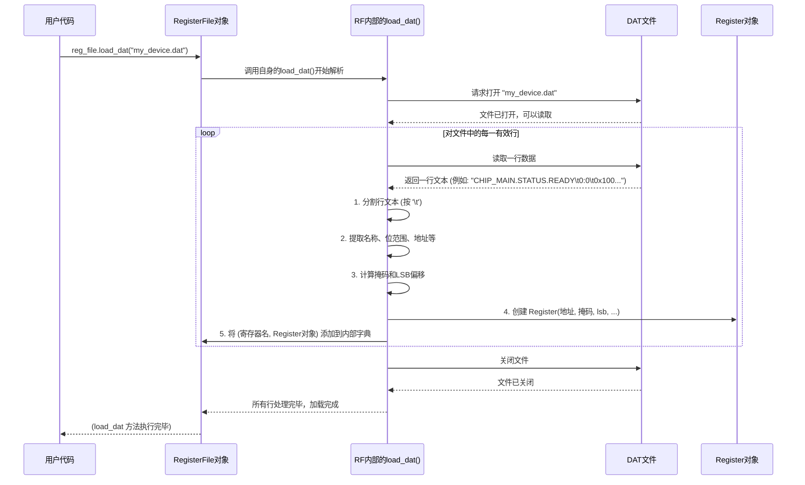

# Chapter 4: DAT/CSV 文件解析器 (DAT/CSV Parser)


欢迎来到 `python_env` 项目教程的第四章！在上一章 [《寄存器文件 (Register File)》](03_寄存器文件__register_file__.md) 中，我们学习了 `RegisterFile` 对象如何帮助我们集中管理硬件设备上的大量寄存器。我们还提到了 `RegisterFile` 可以从 `.dat` 或 `.csv` 文件中加载这些寄存器的定义。那么，这些文件长什么样？`RegisterFile` 又是如何“读懂”它们的呢？这就是本章要探讨的核心——**DAT/CSV 文件解析器 (DAT/CSV Parser)**。

## 1. 为什么要解析文件？手动定义太麻烦啦！

想象一下，你的项目需要与一个包含数百个寄存器的复杂芯片打交道。如果在 Python 代码中为每一个[寄存器 (Register)](02_寄存器__register__.md)都手动编写类似下面的代码：

```python
# 手动创建每一个 Register 对象
reg1 = Register(address=0x100, mask=0xFF, name="STATUS_REG")
reg2 = Register(address=0x102, mask=0x0F, name="CONFIG_REG_LOW_NIBBLE")
# ... 省略其他几百个寄存器的定义 ...
```

这不仅工作量巨大，而且非常容易出错（比如写错地址或掩码）。更糟糕的是，如果硬件设计发生变更，导致寄存器定义更新了，你就不得不在代码中找到并修改所有相关的定义。这简直是一场维护噩梦！

就像你不会想手动把通讯录里的几百个联系人一个个输入到新手机里一样，我们更希望有一种方式能批量“导入”这些信息。

## 2. 救星登场：DAT/CSV 文件和解析器

为了解决这个问题，硬件工程师通常会将芯片的寄存器定义整理成结构化的文本文件。在 `python_env` 项目中，这些文件通常是 `.dat` 或 `.csv` 格式的。

*   **.dat 文件**：通常是一种特定格式的文本文件，可能使用制表符（tab）或其他特殊字符作为分隔符。
*   **.csv 文件 (Comma-Separated Values)**：一种更通用的格式，每一行代表一条记录，记录中的字段用逗号分隔。

这些文件就像是硬件寄存器的“蓝图”或“清单”。它们详细列出了每个寄存器的属性，例如：

*   **名称 (Name)**：寄存器或其字段的易记名称。
*   **位范围 (Bit Range)**：例如 `7:0` 表示这个字段占据了从第0位到第7位。
*   **地址 (Address)**：寄存器在硬件内存中的地址。
*   **完整名称/路径 (Full Name/Path)**：可能包含所属模块或库的层级关系，例如 `MODULE_A.BANK_B.REGISTER_C`。
*   **默认值 (Default Value)**：寄存器复位后的初始值。
*   **访问属性 (Access Property)**：例如 `RO` (只读), `RW` (读写), `WO` (只写)。

这里是一个简化的 `.csv` 文件内容示例，展示了寄存器定义可能的样貌：

```csv
# 这是一个注释行
# 字段名,位范围,地址,寄存器全名,默认值,属性
IP_TOP_STATIC.IPTOP_FORCE_EXT_REFCLK_SEL,0:0,0x0000,IPTOP_FORCE_EXT_REFCLK_SEL,0x0,RW
IP_TOP_STATIC.IPTOP_CLK_MUX_SEL,2:1,0x0000,IPTOP_CLK_MUX_SEL,0x0,RW
ADC_CTRL.ADC_ENABLE,0:0,0x010A,ADC_ENABLE_REG,0x0,RW
ADC_CTRL.ADC_SAMPLE_RATE,7:4,0x010A,ADC_CONFIG_REG,0x3,RW
```

**DAT/CSV 文件解析器** 的任务就是读取并“理解”这种特定格式的文件。它就像一个**字典阅读器**或**翻译官**，能够：

1.  打开并逐行读取文件内容。
2.  按照预定的规则（例如，按逗号或制表符分割）将每一行分解成各个字段。
3.  提取出每个寄存器的名称、地址、位范围和其他属性。
4.  将这些提取出来的信息转换成 [寄存器 (Register)](02_寄存器__register__.md) 对象所需要的数据格式。
5.  最终，这些信息会被加载到 [寄存器文件 (Register File)](03_寄存器文件__register_file__.md) 对象中，供应用程序方便地使用。

通过这种方式，硬件寄存器的定义与Python代码分离开来。当硬件更新时，通常只需要修改 `.dat` 或 `.csv` 文件，而不需要（或很少需要）改动解析和使用这些定义的Python代码。

## 3. 解析在行动：`RegisterFile` 如何加载定义

在上一章中，我们看到了 `RegisterFile` 对象可以通过 `load_dat()` 或 `load_csv()` 方法从文件中加载寄存器定义。实际上，这些方法内部就包含了文件解析的逻辑。

```python
# 假设我们有一个 RegisterFile 实例
from api_client.UREFE.common.prototype_com.registerfile import RegisterFile
reg_file = RegisterFile(wordsize=16) # 假设硬件字长为16位

# 假设我们有一个名为 "my_chip_registers.dat" 的文件，其中包含了寄存器定义
# 这个 .dat 文件需要符合 RegisterFile.load_dat() 方法期望的格式
try:
    # 调用 load_dat() 方法，它会读取并解析文件
    reg_file.load_dat("my_chip_registers.dat") 
    print("寄存器定义从 my_chip_registers.dat 加载成功！")
    
    # 现在 reg_file.reg_dict 内部就充满了根据文件内容创建的 Register 对象
    # 我们可以像之前一样通过名称访问它们
    # status = reg_file.agr("SOME_STATUS_REGISTER_NAME_FROM_FILE")
except FileNotFoundError:
    print("错误：my_chip_registers.dat 文件未找到。")
except Exception as e:
    print(f"加载文件时发生错误: {e}")
```

当 `reg_file.load_dat("my_chip_registers.dat")` (或 `load_csv`) 被调用时，`RegisterFile` 内部的解析逻辑就开始工作了。它会打开指定的文件，一行一行地读取内容，并根据文件格式（`.dat` 文件通常用制表符分隔，`.csv` 文件用逗号分隔）提取所需信息，然后为每个有效的寄存器定义创建一个 [寄存器 (Register)](02_寄存器__register__.md) 对象，并将其添加到 `reg_file` 内部的 `reg_dict` 字典中。

## 4. 揭秘解析器内部：`RegisterFile.load_dat()` 如何工作

让我们更深入地了解一下，当 `RegisterFile` 的 `load_dat()` 方法被调用时，其内部大致会发生什么。

假设我们有一个名为 `my_device.dat` 的文件，其内容（使用制表符分隔）如下：

```text
# 这是一个 .dat 文件示例
# 字段全名 (Field Full Name)    位范围 (Bit Range)    地址 (Address)    寄存器短名 (Short Name) (可选) ...其他字段...
CHIP_MAIN.STATUS.READY        0:0        0x100      READY_BIT
CHIP_MAIN.CONTROL.ENABLE      1:1        0x102      ENABLE_BIT
CHIP_MAIN.DATA_BUFFER         15:0       0x104      DATA_REG
```
*   `CHIP_MAIN.STATUS.READY`：寄存器字段的完整层级名称。
*   `0:0`：表示该字段只占第0位。`15:0` 表示占0到15位。
*   `0x100`：该字段所在硬件寄存器的16进制地址。
*   `READY_BIT`：一个可选的短名称，可能用于在 `RegisterFile` 中作为属性名访问。

`RegisterFile` 的 `load_dat()` 方法（或类似的解析逻辑）会执行以下步骤：

1.  **打开文件**：首先，它会尝试打开用户指定的 `.dat` 文件。
2.  **逐行读取**：然后，它会一行一行地读取文件内容。
3.  **跳过注释/空行**：通常会忽略以特定符号（如 `#`）开头的注释行或完全空白的行。
4.  **分割行内容**：对于有效的数据行，它会根据预设的分隔符（对于 `.dat` 文件，通常是制表符 `\t`）将一行文本分割成多个部分（字段）。
5.  **提取信息**：从分割后的部分中提取关键信息：
    *   **名称相关**：如 `cells[0]` (在上面例子中是 `CHIP_MAIN.STATUS.READY`)，解析器可能会从中派生出用作键的短名称或完整名称。
    *   **位范围**：如 `cells[1]` (例如 `0:0`)。
    *   **地址**：如 `cells[2]` (例如 `0x100`)。
6.  **处理和转换数据**：
    *   将地址字符串（如 `"0x100"`）转换为整数。
    *   从位范围字符串（如 `"0:0"`）计算出实际的**位掩码 (mask)** 和该字段在整个寄存器字中的**最低有效位 (LSB) 偏移**。例如，`0:0` 可能对应掩码 `0x0001`，LSB偏移为0。`15:0` 可能对应掩码 `0xFFFF`。
7.  **创建 `Register` 对象**：使用提取并处理好的地址、掩码、LSB偏移等信息，创建一个新的 [寄存器 (Register)](02_寄存器__register__.md) 对象。
8.  **存入 `RegisterFile`**：将新创建的 `Register` 对象以其名称（或某种派生名称）为键，存储到 `RegisterFile` 实例的内部字典（通常是 `self.reg_dict` 和/或 `self.reg_dict_m`）中。

下面的 Mermaid 图简单展示了这个过程：



`api_client/UREFE/common/prototype_com/registerfile.py` 文件中的 `load_dat` 方法实现了类似的逻辑。下面是一个高度简化的示意性代码片段，展示了其核心思想：

```python
# 简化自 api_client/UREFE/common/prototype_com/registerfile.py 的 load_dat 方法
# class RegisterFile:
#     def load_dat(self, filename, sep='\t'):
#         from .register import Register # 导入 Register 类
#         
#         f = open(filename) # 打开文件
#         for line in f:
#             if len(line) < 3 or line.startswith('#'): # 跳过空行和注释
#                 continue
#
#             cells = line.strip().split(sep) # 移除首尾空白并按分隔符分割
#
#             if len(cells) < 3: # 确保至少有三个核心字段
#                 continue
#
#             full_name_from_file = cells[0]  # 例如 "CHIP_MAIN.STATUS.READY"
#             bit_range_str = cells[1]        # 例如 "0:0"
#             address_str = cells[2]          # 例如 "0x100"
#
#             # 将地址字符串转换为整数
#             iaddr = int(address_str, 0) # '0' 表示自动判断进制 (如 '0x' 前缀)
#
#             # 从位范围字符串解析出最高位和最低位
#             parts = bit_range_str.split(':')
#             idx_max = int(parts[0])
#             idx_min = int(parts[1])
#
#             # 根据位范围计算掩码 (mask)
#             # 例如，0:0 -> mask 0x1; 7:0 -> mask 0xFF; 15:8 -> mask 0xFF00
#             mask = ((1 << (idx_max - idx_min + 1)) - 1) << idx_min
#
#             # LSB (最低有效位) 通常就是 idx_min，用于 Register 对象的 lsb 参数
#             # Register 类内部会用 mask 和 lsb 来正确提取和写入字段值
#
#             # 派生用于在 RegisterFile 中存储和访问的名称
#             # 真实代码中，名称处理可能更复杂
#             regname_short = full_name_from_file.split('.')[-1] # 简单示例：取最后一个点后的部分
#
#             # 创建 Register 对象
#             new_reg = Register(address=iaddr, mask=mask, lsb=idx_min)
#             # 可以在这里根据文件中的其他列（如果存在）为 new_reg 设置更多选项，
#             # 例如 rd_op, wr_op, type 等
#
#             # 将创建的 Register 对象存入 RegisterFile 的字典中
#             self.reg_dict[regname_short] = new_reg # 使用短名作为键
#             # self.reg_dict_m[full_name_from_file] = new_reg # 可能还会用完整名存储
#
#         f.close() # 关闭文件
```
**代码解释**：
*   它打开文件并逐行读取。
*   使用 `split(sep)` （`sep` 默认为制表符 `\t`）来分割行。
*   从分割后的 `cells` 列表中提取名称 (`cells[0]`)、位范围 (`cells[1]`) 和地址 (`cells[2]`)。
*   将字符串形式的地址转换为整数 `iaddr`。
*   从位范围字符串（如 "0:0"）解析出 `idx_max` 和 `idx_min`，并据此计算出 `mask`。`idx_min` 也用作 `Register` 构造函数中的 `lsb` 参数。
*   创建一个 `Register` 对象。
*   将这个 `Register` 对象添加到 `self.reg_dict` 字典中，以便之后可以通过名称访问。

`RegisterFile` 类中还有一个 `load_csv()` 方法，它执行类似的任务，但是针对逗号分隔的 `.csv` 文件，其解析逻辑会更复杂一些，以适应 `.csv` 文件中可能出现的更灵活的格式和选项。

## 5. DAT、CSV 和图形界面：`parseDatFile.py` 的角色

除了 `RegisterFile` 对象直接使用解析器加载寄存器定义外，项目中的其他部分（尤其是图形用户界面 GUI）也可能需要访问这些寄存器信息来展示给用户。

在 `python_env` 项目中，有一个特定的工作流程和工具来处理用于 GUI 的寄存器数据：

1.  **原始 `.dat` 文件**：这些可能是硬件团队提供的原始寄存器定义文件，其格式可能比较特殊。
    *   示例文件位于 `python_gui/dat_files/` 目录下，例如 `ip_e224g_x812_2p00a.dat`。

2.  **转换工具 `dat2csv.py`**：由于直接解析各种自定义 `.dat` 格式可能比较复杂，项目中提供了一个实用脚本 `python_gui/dat_files/dat2csv.py`。它的作用是将这些特定格式的 `.dat` 文件转换为更标准、更易于解析的 `.csv` 文件。
    *   这个脚本会读取 `.dat` 文件，处理其中的制表符和空格，然后将每行数据转换成用逗号分隔的格式，并写入新的 `.csv` 文件。
    *   简化的 `dat2csv.py` 核心逻辑可能如下：
        ```python
        # 简化自 python_gui/dat_files/dat2csv.py
        # for dat_line in dat_file_handle:
        #    # 这里的逻辑会比较复杂，目标是把dat_line中的字段正确提取出来
        #    # 并用逗号连接它们，形成csv_line
        #    # 例如，将多个制表符或空格视为单个分隔符，然后替换为逗号
        #    field1, field2, field3, ... = parse_dat_line_fields(dat_line)
        #    csv_line = ",".join([field1, field2, field3, ...])
        #    csv_file_handle.write(csv_line + '\n')
        ```
    *   转换后生成的 `.csv` 文件也存放在 `python_gui/dat_files/` 目录下，文件名与原 `.dat` 文件对应，例如 `ip_e224g_x812_2p00a.csv`。

3.  **解析转换后的 `.csv` 文件：`parseDatFile.py`**：
    *   一旦有了标准格式的 `.csv` 文件，解析就变得更容易了。项目中有一个 `python_gui/registers/parseDatFile.py` 脚本，它专门负责解析这些由 `dat2csv.py` 生成的 `.csv` 文件。
    *   `parseDatFile()` 函数（在该脚本中定义）会使用 Python 内置的 `csv` 模块来读取这些 `.csv` 文件。
    *   它会提取每一行（代表一个寄存器字段）的各个列，如字段名、位范围、地址、寄存器名、默认值和属性。
    *   这些提取出来的信息并**不直接创建 `Register` 对象**或填充 `RegisterFile`，而是存储在 `parseDatFile.py` 脚本内部定义的**全局列表**中（例如 `ipRegFieldName`, `ipRegAddr`, `tcBanks`, `fpgaRegFieldProperty` 等）。

    下面是 `python_gui/registers/parseDatFile.py` 中解析逻辑的简化示例：
    ```python
    # 简化自 python_gui/registers/parseDatFile.py
    import csv
    
    # 这些列表将在模块级别定义，用于存储解析结果
    # ipRegFieldName = []
    # ipRegAddr = []
    # ipBanks = [] 
    # ... 等等 ...

    def parse_specific_csv_file(filename, target_field_list, target_addr_list, ...):
        with open(filename, mode='r', encoding='utf-8') as file_obj:
            reader_obj = csv.reader(file_obj) # 创建CSV读取器
            
            line_count = 0
            for row_cells_list in reader_obj: # 每一行都是一个单元格列表
                line_count += 1
                if line_count == 1 or not row_cells_list or row_cells_list[0].startswith('#'):
                    continue # 跳过表头、空行或注释行
                
                # 假设CSV列顺序固定: 字段名, 位范围, 地址, 寄存器名, 默认值, 属性
                field_name = row_cells_list[0]
                # bit_range = row_cells_list[1]
                address_str = row_cells_list[2]
                # register_name = row_cells_list[3]
                # ... 其他字段 ...
                
                # 将提取的信息添加到相应的全局列表中
                target_field_list.append(field_name)
                target_addr_list.append(address_str)
                # ... 根据需要处理和存储其他信息 ...
    
    # parseDatFile() 函数会调用类似上面的逻辑来处理所有相关的CSV文件
    # def parseDatFile():
    #     parse_specific_csv_file(evalbrd_parts_filename[0], ipRegFieldName, ipRegAddr, ...)
    #     parse_specific_csv_file(evalbrd_parts_filename[1], tcRegFieldName, tcRegAddr, ...)
    #     # ... 等等 ...
    ```

4.  **GUI 使用解析数据**：
    *   在第一章 [《Python 图形用户界面 (Python GUI)》](01_python_图形用户界面__python_gui__.md) 中，我们看到 `formLoad.py` 里的 `formLoad` 函数导入并调用了 `parseDatFile()`。
    *   GUI 可以直接访问 `parseDatFile.py` 中填充好的那些全局列表（如 `ipBanks`, `ipRegName`）。
    *   这样，GUI 就可以用这些数据来动态填充下拉菜单（例如，选择Bank、选择寄存器）、显示寄存器信息等，而无需先实例化一个完整的 `RegisterFile` 对象或等待它加载。这为GUI提供了快速访问原始寄存器定义信息的方式。

所以，`python_env` 项目中至少有两种主要的“DAT/CSV 文件解析”场景：
*   `RegisterFile` 类内部的 `load_dat`/`load_csv` 方法，用于将文件定义直接加载成可操作的 `Register` 对象集合。
*   `python_gui/registers/parseDatFile.py` 脚本，用于解析（预处理过的）`.csv` 文件，并将原始数据提供给GUI或其他可能需要这些原始信息的模块。

两者都体现了文件解析器的核心思想：读取结构化文本文件，提取有用信息，并使其可供程序使用。

## 6. 总结

在本章中，我们了解了 DAT/CSV 文件解析器在 `python_env` 项目中的重要性：

*   **动机**：解析器使得我们可以将硬件寄存器的定义从 Python 代码中分离出来，存储在易于维护的 `.dat` 或 `.csv` 文件中，从而避免了在代码中手动定义大量寄存器的繁琐和易错。
*   **DAT/CSV 文件**：这些文件以结构化的方式（通常是文本，按行组织，字段间用特定分隔符隔开）存储寄存器的各种属性（名称、地址、位域等）。
*   **解析器的角色**：它像一个“翻译官”，读取这些文件，理解其格式，提取出有用的信息。
*   **`RegisterFile` 中的解析**：我们重点学习了 [寄存器文件 (Register File)](03_寄存器文件__register_file__.md) 的 `load_dat()` (或 `load_csv()`) 方法如何充当解析器，读取文件内容，并为每个定义创建和配置一个 [寄存器 (Register)](02_寄存器__register__.md) 对象，将其加载到 `RegisterFile` 的内部字典中。
*   **GUI 的数据解析流程**：我们还了解了 `python_env` GUI 如何通过 `dat2csv.py` 工具将原始 `.dat` 文件转换为 `.csv` 文件，然后使用 `python_gui/registers/parseDatFile.py` 脚本来解析这些 `.csv` 文件，将寄存器信息加载到全局列表中，供GUI元素（如下拉菜单）使用。

DAT/CSV 文件解析器是连接硬件定义与软件应用的关键桥梁。它使得我们的软件能够灵活适应硬件的变化，并提高了开发效率和代码的可维护性。

在下一章中，我们将探讨 [API 客户端 (API Client)](05_api_客户端__api_client__.md)，看看应用程序是如何通过一个更高级别的接口与这些已经加载和准备好的寄存器进行交互的。

---

Generated by [AI Codebase Knowledge Builder](https://github.com/The-Pocket/Tutorial-Codebase-Knowledge)