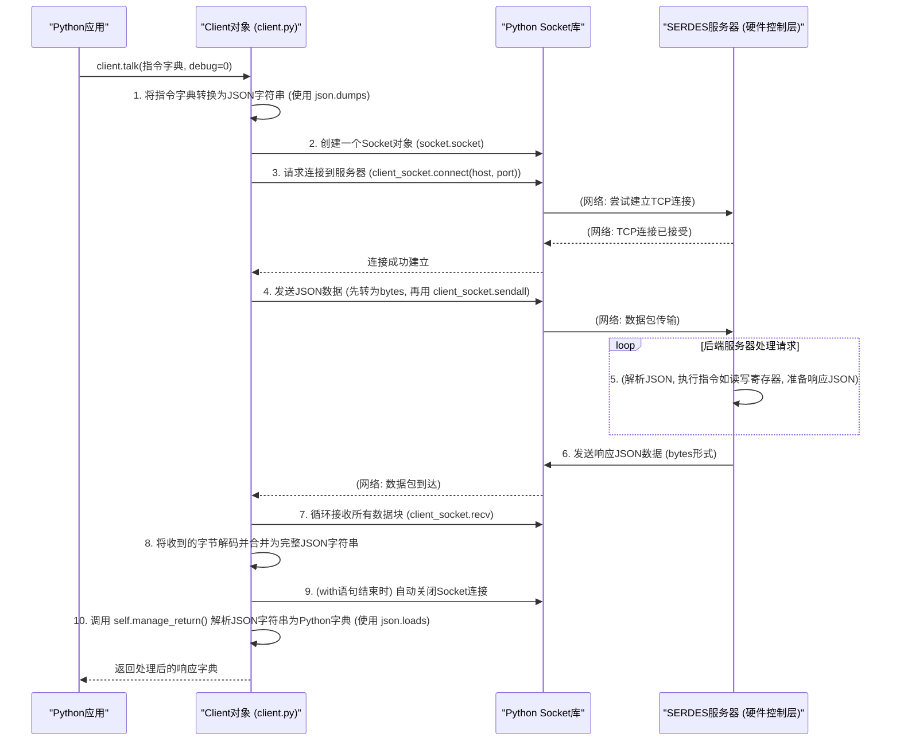

# Chapter 5: API 客户端 (API Client)


在上一章[《DAT/CSV 文件解析器 (DAT/CSV Parser)》](04_dat_csv_文件解析器__dat_csv_parser__.md)中，我们学习了如何解析文件来加载硬件的[寄存器 (Register)](02_寄存器__register__.md)定义。这些定义让我们在软件层面知道了硬件上有哪些寄存器以及它们的属性。但是，仅仅知道这些定义还不够，我们的Python应用程序（比如我们在第一章讨论的[Python 图形用户界面 (Python GUI)](01_python_图形用户界面__python_gui__.md)）需要一种方法来根据这些定义与实际的硬件控制服务进行“对话”——发送指令并接收结果。这就是 API 客户端发挥作用的地方。

## 1. 什么是 API 客户端？为什么需要它？

想象一下，我们的 [Python 图形用户界面 (Python GUI)](01_python_图形用户界面__python_gui__.md) 上有一个按钮，用户点击它想要读取某个[寄存器 (Register)](02_寄存器__register__.md)的当前值。GUI 本身通常不直接与硬件打交道，因为它运行在用户的电脑上，而硬件（比如一块开发板上的芯片）可能连接在这台电脑上，或者甚至在另一台通过网络连接的设备上，由一个专门的“后端服务程序”（我们称之为 SERDES 服务器或硬件控制层）来管理。

这时，API 客户端就派上用场了。你可以把它想象成一部**电话**或者一个**邮递员**：

*   **电话机**：我们的 Python 应用程序（比如 GUI）就是打电话的人。它想告诉远端的 SERDES 服务器（接电话的人）一些事情，比如“请帮我读取地址为 0x123 的寄存器的值”。API 客户端就是这部电话机，它负责建立通话线路（网络连接），把你的话（请求）转换成信号（数据包）发送出去，并接收对方的回应。
*   **邮递员**：应用程序写了一封信（一个指令，比如“更新固件”）。API 客户端就像邮递员，它拿起这封信，确保信封上的地址和邮票都正确（处理网络细节和数据格式化），然后把信送到邮局（发送给服务器）。服务器处理完后，会写一封回信（响应），邮递员再把回信带回来给你。

**API 客户端的核心职责是**：
1.  在 Python 应用程序和后端 SERDES 服务器之间建立通信。
2.  处理网络连接的细节（比如使用哪个 IP 地址和端口号）。
3.  将应用程序的指令（比如一个包含命令和参数的Python字典）转换成服务器能理解的格式（通常是 JSON 字符串）。
4.  通过网络将格式化后的请求发送给服务器。
5.  接收服务器返回的响应。
6.  将响应（通常也是 JSON 字符串）转换回 Python 应用程序能方便使用的数据格式（比如字典）。
7.  关闭网络连接。

基本上，它隐藏了所有底层的网络通信复杂性，让应用程序可以简单地“说出”它的请求，然后“听到”结果。

## 2. API 客户端如何工作：一个简单的比喻

为了更好地理解，让我们用一个餐厅点餐的例子来比喻：

1.  **你 (Python 应用程序/GUI)**：作为顾客来到餐厅，想要点菜。你想点一道“读取寄存器 0x42 的值”。
2.  **API 客户端 (Client 对象)**：餐厅的服务员。
3.  **后端 SERDES 服务器**：餐厅的厨房。

流程是这样的：
*   你告诉服务员（API 客户端）：“我要一份‘读取寄存器 0x42’”。
*   服务员（API 客户端）拿出点菜单，把你口头的点菜（Python 字典形式的指令）写成厨房能看懂的格式（转换为 JSON 字符串）。
*   服务员（API 客户端）把写好的点菜单通过传菜口递给厨房（通过网络套接字发送 JSON 请求到服务器）。
*   厨房（SERDES 服务器）按照订单开始做菜（处理请求，实际读取硬件寄存器）。
*   菜做好了，厨房把菜品（包含寄存器值的 JSON 响应）通过传菜口递给服务员。
*   服务员（API 客户端）把菜品端到你的桌上（将 JSON 响应解析成 Python 字典并返回给应用程序）。

在这个过程中，你作为顾客，不需要关心厨房是怎么运作的，也不需要自己跑到厨房去。服务员（API 客户端）帮你处理了所有中间环节。

## 3. `Client` 类：我们的“电话机”或“服务员”

在 `python_env` 项目中，`api_client/client.py` 文件（以及功能非常相似的 `python_gui/sdk_api/client.py`）定义了一个名为 `Client` 的 Python 类。这个类就是我们前面讨论的 API 客户端的具体实现。

### 3.1 初始化客户端 (`__init__`)

要使用 API 客户端，首先需要创建一个 `Client` 类的实例。在创建它的时候，你需要告诉它后端 SERDES 服务器在哪里，即服务器的**主机名 (hostname) 或 IP 地址**以及服务器正在监听的**端口号 (port number)**。

就像你要打电话，总得知道对方的电话号码（IP 地址 + 端口号）才能拨通。

```python
# 文件: api_client/client.py (为简洁起见，部分导入和路径设置已省略)
import socket # 导入 socket 模块用于网络通信
import json   # 导入 json 模块用于处理 JSON 数据
from functools import partial # 用于 talk 方法中的 iter(partial(...))

class Client():
    """
    Client 类负责管理 SERDES 服务器和 Python 应用程序之间的通信。
    它保存服务器的主机 IP 和端口号。
    使用成员函数 'talk()' 临时建立连接以交换消息。
    每次消息交换完成后关闭连接，以防止套接字锁定。
    """
    def __init__(self, host: str = 'localhost', port: int = 7878):
        """
        构造函数。
        :param host: 运行 SERDES 服务器的机器的 IP 地址。默认为 'localhost' (本机)。
        :param port: SERDES 服务器正在监听的端口号。默认为 7878。
        """
        self.host = host # 服务器的主机名或IP地址
        self.port = port # 服务器正在监听的端口号
        # print(f"API 客户端已配置，准备连接到服务器 {self.host}:{self.port}") # 调试时可以取消注释

# 如何使用：
# 假设服务器运行在 IP 地址为 "192.168.1.100"，端口为 12345 的机器上
# my_api_client = Client(host="192.168.1.100", port=12345)

# 如果服务器就运行在你的电脑上，并且使用默认端口 7878
# my_api_client = Client() 
# print(f"我的API客户端将连接到: {my_api_client.host}:{my_api_client.port}")
```

**代码解释**：
*   `__init__` 方法接收 `host` 和 `port` 作为参数。
*   `self.host` 存储服务器的地址。`'localhost'` 是一个特殊的主机名，表示“这台计算机本身”。
*   `self.port` 存储服务器监听的端口号。端口号用于区分同一台计算机上可能运行的多个网络服务。
*   如果你不提供这些参数，它会使用默认值 `'localhost'` 和 `7878`。

### 3.2 发送请求和接收响应 (`talk`)

`Client` 类中最重要的的方法是 `talk()`。它负责完成一次完整的“对话”：从发送请求到接收响应。

它通常接收一个 Python 字典作为 `send_message` 参数，这个字典代表了要发送给服务器的具体指令和参数。例如，一个读取寄存器的指令可能看起来像这样：`{"fcn": "api_reg_read_ip", "params": {"address": 0x100}}`。

```python
# 文件: api_client/client.py (续)
class Client():
    # ... __init__ 方法同上 ...

    def talk(self, send_message, debug=0):
        """
        向 IP <host> 的端口 <port> 请求连接并传输消息，然后等待响应。
        收到响应后终止连接。

        :param send_message: 一个字典 (表示API服务器期望的输入结构)，
                             或字符串 'exit' (用于关闭服务器应用)。
        :return: return_data: API 调用请求的数据，或错误信息。
        """
        send_message_json_str = "" # 初始化将要发送的JSON字符串

        # 如果不是特殊的 "exit" 指令，将 Python 字典转换为 JSON 字符串
        if send_message != 'exit':
            send_message_json_str = json.dumps(send_message) # "打包" 成 JSON
            if debug == 1:
                print(f"调试信息：发送给服务器的JSON -> {send_message_json_str}")
        else:
            send_message_json_str = send_message # "exit" 指令可以直接作为文本发送

        # 使用 'with' 语句创建套接字，确保使用完毕后自动关闭
        # socket.AF_INET 表示使用 IPv4 地址族
        # socket.SOCK_STREAM 表示使用 TCP协议 (可靠的流式传输)
        with socket.socket(socket.AF_INET, socket.SOCK_STREAM) as client_socket:
            try:
                # client_socket.settimeout(5) # 可以设置超时时间，例如5秒
                client_socket.connect((self.host, self.port))  # 尝试连接到服务器
            except Exception as e:
                # print(f"错误：连接服务器 {self.host}:{self.port} 失败: {e}") # 调试用
                return {"error": f"无法连接到服务器: {str(e)}"} # 返回错误信息字典

            # 将 JSON 字符串转换为 UTF-8 编码的字节序列准备发送
            byte_message_to_send = bytes(send_message_json_str, 'utf-8')
            client_socket.sendall(byte_message_to_send)  # 发送所有数据给服务器

            # ---- 此处服务器正在处理请求 ---- #

            # 从服务器接收响应数据
            # 服务器的响应可能很大，会被分成多个小块 (chunk) 发送
            # 我们需要循环接收，直到所有数据块都收到
            raw_data_chunks_list = []
            try:
                # iter(partial(client_socket.recv, 4096), b'') 是一种持续读取的方式：
                # client_socket.recv(4096) 会尝试读取最多 4096 字节的数据块。
                # 如果服务器关闭了连接或者没有更多数据，recv 会返回空字节串 (b'')。
                # iter 会一直调用 recv，直到它返回 b''，此时循环停止。
                for data_chunk in iter(partial(client_socket.recv, 4096), b''):
                    raw_data_chunks_list.append(data_chunk.decode('utf-8')) # 解码为字符串并添加到列表
            except socket.timeout:
                # print(f"错误：接收服务器响应超时。") # 调试用
                return {"error": "接收服务器响应超时"}
            except Exception as e:
                # print(f"错误：接收数据时发生错误: {e}") # 调试用
                return {"error": f"接收数据错误: {str(e)}"}


            # 将所有接收到的数据块合并成一个完整的字符串
            raw_data_from_server = ''.join(raw_data_chunks_list)
            if debug == 1:
                print(f"调试信息：从服务器收到的原始数据 <- {raw_data_from_server}")
            
            # 'with' 语句结束时，client_socket 会自动关闭

        # 处理和解析从服务器收到的原始数据
        try:
            # 调用 manage_return 方法将原始 JSON 字符串转换为 Python 数据结构
            return_data = self.manage_return(raw_data_from_server)
        except Exception as e:
            # print(f"错误：处理服务器响应失败: {e}") # 调试用
            # 返回一个包含错误信息的字典，以及原始响应方便调试
            return {"error": f"响应处理错误: {str(e)}", "raw_response": raw_data_from_server}
        
        return return_data # 返回处理后的数据 (通常是一个字典)

    def manage_return(self, raw_data_str):
        """
        处理从服务器返回的原始JSON字符串。
        如果服务器端发生错误，此方法（或调用它的代码）应该能识别。
        :param raw_data_str: 从服务器收到的原始 JSON 编码的字符串。
        :return: return_data: 如果没有错误，则返回API用户请求的数据 (Python 字典)。
        """
        if not raw_data_str: # 如果收到的是空字符串
            # print("警告：从服务器收到的响应为空。") # 调试用
            return {"error": "服务器返回空响应"}

        # 将 JSON 字符串 "解包" 成 Python 字典
        structured_data = json.loads(raw_data_str)
        # 实际的 manage_return 可能会根据服务器返回的特定字段检查是否有错误
        # 例如: if structured_data.get('status') == 'error': raise ServerError(structured_data['message'])
        # print(f"调试信息：解析后的响应数据: {structured_data}") # 调试用
        return structured_data

# 使用示例：
# my_api_client = Client() # 假设服务器在 localhost:7878
# # 构造一个读取 IP 寄存器的命令 (这是一个假设的命令结构)
# command_to_send = {"fcn": "api_reg_read_ip", "params": {"address": 0x100}}
# print(f"准备发送命令: {command_to_send}")
# server_response = my_api_client.talk(command_to_send, debug=1) # 启用调试信息打印
# print(f"从服务器收到的最终响应: {server_response}")
#
# # 检查响应中是否有错误
# if isinstance(server_response, dict) and "error" in server_response:
#    print(f"发生错误: {server_response['error']}")
# elif isinstance(server_response, dict):
#    # 假设成功时，响应中有一个 'value' 字段包含寄存器的值
#    register_value = server_response.get('value') 
#    if register_value is not None:
#        print(f"成功读取寄存器值: {register_value}")
#    else:
#        # 实际的响应格式取决于 SERDES 服务器如何定义其 API
#        print(f"收到了响应，但未找到 'value' 字段。完整响应: {server_response}")
```

**代码解释**：
1.  **打包消息 (`json.dumps`)**：如果 `send_message` 是一个字典，`json.dumps(send_message)` 会把它转换成一个 JSON 格式的字符串。这就像服务员把你的口头点单写到标准格式的点菜单上。
2.  **建立连接 (`socket.socket`, `client_socket.connect`)**：
    *   `socket.socket(socket.AF_INET, socket.SOCK_STREAM)` 创建一个套接字对象，这是进行网络通信的端点。`AF_INET` 指的是 IPv4 网络协议，`SOCK_STREAM` 指的是 TCP 连接（一种可靠的连接类型）。
    *   `client_socket.connect((self.host, self.port))` 尝试与指定主机和端口上的服务器建立连接。这就像拨打电话并等待对方接听。
    *   `with ... as client_socket:` 确保无论发生什么（即使是错误），连接最终都会被关闭，这很重要，可以防止资源泄露。
3.  **发送数据 (`client_socket.sendall`)**：`bytes(send_message_json_str, 'utf-8')` 将 JSON 字符串编码成字节序列（网络传输的是字节），然后 `client_socket.sendall()` 将这些字节全部发送给服务器。
4.  **接收数据 (`client_socket.recv`, `iter(partial(...))`)**：
    *   服务器的响应可能一次发不完，所以需要循环接收。`client_socket.recv(4096)` 尝试一次最多接收 4096 字节的数据。
    *   `iter(partial(client_socket.recv, 4096), b'')` 是一个巧妙的写法：它会不断调用 `client_socket.recv(4096)`，直到 `recv` 返回一个空字节串 `b''`（这通常表示服务器已经发送完所有数据并关闭了连接的它那端，或者连接中断了）。
    *   收到的每个数据块（字节串）都被解码成字符串 (`.decode('utf-8')`) 并存入列表，最后用 `''.join()` 合并成完整的响应字符串。
5.  **解包响应 (`manage_return`, `json.loads`)**：
    *   `manage_return()` 方法接收原始的响应字符串。
    *   `json.loads(raw_data_str)` 将 JSON 字符串转换回 Python 字典（或其他对应的数据结构）。这就像服务员把厨房传来的菜（原始数据）摆盘整理好（解析成字典）再端给你。
    *   这个方法也提供了一个进行初步错误检查或数据规范化的机会。

## 4. 通信流程：深入 `talk()` 方法

让我们用一个流程图来更清晰地展示当应用程序调用 `client.talk()` 时，内部发生了什么：



**流程步骤详解**：
1.  **准备消息**：应用程序调用 `talk()` 方法，传入一个包含指令的 Python 字典。`talk()` 方法使用 `json.dumps()` 将这个字典序列化为 JSON 格式的字符串。
2.  **建立连接**：`Client` 创建一个 `socket` 对象，并调用其 `connect()` 方法，尝试连接到在 `Client` 初始化时指定的服务器主机和端口。
3.  **发送请求**：连接成功后，`Client` 将 JSON 请求字符串编码为字节（通常是 UTF-8），然后通过 `socket` 的 `sendall()` 方法发送给服务器。
4.  **等待和接收响应**：`Client` 进入等待状态，使用 `socket` 的 `recv()` 方法循环接收服务器发回的数据。由于数据可能分块到达，它会持续接收直到所有数据都收到。
5.  **关闭连接**：数据接收完毕后（或者在 `with` 语句结束时），`socket` 连接被关闭。`python_env` 中的 `Client` 设计为非持久连接，即每次 `talk()` 都会建立新连接并在完成后关闭，这样可以避免长时间占用资源或连接意外断开导致的问题。
6.  **处理响应**：`Client` 将接收到的完整字节数据解码成字符串，然后调用 `manage_return()` 方法。此方法使用 `json.loads()` 将 JSON 响应字符串反序列化为 Python 字典。
7.  **返回结果**：最后，`talk()` 方法将这个包含服务器响应的 Python 字典返回给调用它的应用程序代码。

## 5. API 客户端在项目中的应用

这个 `Client` 类是 `python_env` 与其后端 SERDES 服务器通信的核心。

### 5.1. [Python 图形用户界面 (Python GUI)](01_python_图形用户界面__python_gui__.md) 的使用
当用户在 GUI 上执行操作，比如点击一个“读取寄存器”按钮并输入了地址后：
1.  GUI 的事件处理函数会收集这些信息（操作类型、寄存器地址等）。
2.  它会构造一个符合 SERDES 服务器 API 要求的命令字典。
3.  然后，GUI 会（或者通过一个中间层）获取一个 `Client` 实例，并调用其 `talk()` 方法，将命令字典作为参数传进去。
4.  `talk()` 方法返回服务器的响应后，GUI 会解析这个响应（比如提取出读取到的寄存器值），并更新界面上的显示。

### 5.2. `wrapper_driver_E112MP` 的角色
在 `api_client/UREFE/common/prototype_com/comms.py` 文件中，我们能看到一个更具体的应用场景。这里定义了一个 `wrapper_driver_E112MP` 类，它扮演了硬件驱动的角色，供 [寄存器文件 (Register File)](03_寄存器文件__register_file__.md) 使用。

这个包装器类的 `readreg` 和 `writereg` 方法内部，并没有直接进行硬件操作，而是：
1.  持有一个 `Client` 实例（在 `__init__` 中创建，通常连接到特定的端口如 `27015`，这可能是一个专门用于 SERDES API 的端口）。
2.  当 `readreg(address)` 被调用时，它会（通过一个辅助的静态方法如 `wrapper_driver_E112MP.read`）构造一个特定的 JSON 命令字典，例如：
    *   可能先发送一个命令设置当前的硬件目标组：`{"fcn": "api_set_group", "params": {"group_id": 0}}`
    *   然后发送读取命令：`{"fcn": "api_reg_read_ip", "params": {"address": address}}`
3.  使用 `Client` 实例的 `talk()` 方法发送这些命令并获取响应。
4.  从响应字典中提取出实际的寄存器值并返回。
`writereg` 的过程类似，只是构造的是写入命令的 JSON。

让我们看一段 `comms.py` 中相关逻辑的简化示意：
```python
# 文件: api_client/UREFE/common/prototype_com/comms.py (简化片段)
# 假设 Client 类已从 api_client.client 或 python_gui.sdk_api.client 导入
from client import Client 

class wrapper_driver_E112MP():
    def __init__(self, ft_unused, pid): # ft 参数在此上下文中可能不直接使用
        self.pid = pid # 用于区分不同的硬件目标 (例如 PHY A, PHY B, FPGA)
        # 创建一个 Client 实例，连接到 SERDES API 服务器
        # 这里的端口 27015 可能是一个特定配置
        self.api_comm_client = Client(port=27015) 

    def readreg(self, address):
        # 调用下面的静态方法 `read`，传入 API 客户端实例和必要参数
        response_dict = wrapper_driver_E112MP.read(self.api_comm_client, self.pid, address)
        
        # 从服务器返回的字典中提取实际的寄存器值
        # 注意：实际的提取逻辑取决于服务器响应的具体格式
        # 例如，如果服务器返回 {"fcn": "...", "value": 123, ...}
        # 或者像原始代码中那样，结果在某个固定位置，如 response_dict[5] (如果响应是列表或特定结构的字典)
        # 这里我们假设 'value' 键或者以地址为键的值是目标数据
        if isinstance(response_dict, dict):
            if 'value' in response_dict:
                return response_dict['value']
            # 尝试使用 response_dict[5] (假设它是规范格式的一部分)
            # 需要注意，如果 response_dict 不是一个至少有6个元素的列表/元组，或者没有键'5'，这会出错
            # 为了安全，应先检查类型和长度/键的存在
            # 原始代码是 res[5]，这可能意味着服务器返回一个列表作为JSON值，或者一个键为 "5" 的字典项
            # 假设它是一个字典，并且 'result' 字段包含实际值（基于原代码的 res[5]）
            # 如果是 `res_dict = res[5]` 的形式，表示 `res` 是一个列表或元组
            # 这里假设 `res` 就是 `response_dict`，且它是列表，或者 `res_dict` 中有名为 '5' 的键
            # 为了更通用和安全，我们还是优先查找 'value'
            # 另一种可能是服务器返回的字典的键是数字字符串，如 "5"
            elif "5" in response_dict and isinstance(response_dict, dict): # 假设是键 "5"
                 return response_dict["5"]
            elif isinstance(response_dict, (list, tuple)) and len(response_dict) > 5: # 假设是列表/元组的第6个元素
                 return response_dict[5]
            else:
                # print(f"警告: 未在响应中找到期望的寄存器值。响应: {response_dict}") # 调试用
                return None # 或者抛出错误
        return None # 如果响应不是字典，或者找不到值

    @staticmethod
    def read(api_client_instance, pid, address):
        debug_api_calls = 0 # 设为1可以打印API调用的JSON
        response = {} # 初始化响应

        # 根据 pid (目标ID) 和 address (寄存器地址) 构造不同的API命令
        # 例如, pid 1 可能对应 "ip_top_block_0", pid 5 对应 "fpga_registers"
        if pid == 1: # 示例：读取 IP 寄存器 (PHYB)
            # 可能需要先设置目标组
            set_group_command = {"fcn": "api_set_group", "params": {"group_id": 0}}
            api_client_instance.talk(set_group_command, debug_api_calls)
            
            read_reg_command = {"fcn": "api_reg_read_ip", "params": {"address": address}}
            response = api_client_instance.talk(read_reg_command, debug_api_calls)
        
        elif pid == 5: # 示例：读取 FPGA 寄存器
            read_reg_command = {"fcn": "api_reg_read_fpga", "params": {"address": address}}
            response = api_client_instance.talk(read_reg_command, debug_api_calls)
        
        # ... 其他 pid 的处理逻辑 ...
        else:
            # print(f"错误: wrapper_driver_E112MP.read 不支持的 pid: {pid}") # 调试用
            response = {"error": f"不支持的PID {pid} 进行读取"}
            
        return response # 返回从服务器获取的完整响应字典

    # writereg 方法和静态的 write 方法会类似地构造和发送写入命令
    # def writereg(self, address, data):
    #     wrapper_driver_E112MP.write(self.api_comm_client, self.pid, address, data)
    #     return

    # @staticmethod
    # def write(api_client_instance, pid, address, value_to_write):
    #     # ... 构造 "api_reg_write_ip", "api_reg_write_fpga" 等命令 ...
    #     # api_client_instance.talk(...)
    #     pass
```
**代码解释**：
*   `wrapper_driver_E112MP` 在初始化时创建了一个 `Client` 实例 (`self.api_comm_client`)，用于后续所有与 SERDES 服务器的通信。
*   当 `readreg(address)` 被调用时，它会委托给静态的 `read()` 方法。
*   `read()` 方法根据传入的 `pid`（用于区分不同的硬件块，如 IP 核、FPGA 等）和 `address`，构造出具体的 JSON 命令。例如，读取 IP 寄存器可能会发送 `{"fcn": "api_reg_read_ip", "params": {"address": address}}` 这样的命令。
*   然后，它使用 `api_client_instance.talk()` （即 `self.api_comm_client.talk()`）将这个命令发送给服务器，并接收响应。
*   `readreg` 方法之后会从 `talk()` 返回的响应字典中提取出实际的寄存器值。**注意**：原始代码中 `result = res[5]` 的部分暗示了服务器响应的一种特定结构（可能是列表，或者字典中有一个键是数字5或字符串"5"）。在上面的简化示例中，我们尝试更通用地处理，比如查找名为 `'value'` 的键，或者如原始代码那样处理索引 `5`。实际项目中，你需要根据后端 SERDES 服务器 API 的具体定义来精确解析响应。

这种包装方式使得 [寄存器文件 (Register File)](03_寄存器文件__register_file__.md) 可以通过标准的 `driver.readreg()` 和 `driver.writereg()` 接口与硬件交互，而这些接口的底层实现则是通过 API 客户端与远程服务器通信。

## 6. 总结

在本章中，我们一起探索了 API 客户端在 `python_env` 项目中的角色和工作原理：

*   **核心作用**：API 客户端是 Python 应用程序（如 GUI 或脚本）与后端 SERDES 服务器（硬件控制层）之间的“电话”或“邮递员”，负责两者之间的通信。
*   **通信方式**：它通过网络套接字（sockets）发送和接收消息，这些消息通常采用 JSON 格式。
*   **`Client` 类**：项目中的 `Client` 类（位于 `api_client/client.py`）封装了这些通信细节。
    *   `__init__(host, port)`: 初始化客户端，指定服务器地址和端口。
    *   `talk(command_dict)`: 发送命令（字典形式，内部转为JSON），接收并解析响应（JSON转为字典）。
*   **工作流程**：我们了解了从打包请求、建立连接、发送数据，到接收数据、关闭连接、解包响应的完整步骤。
*   **实际应用**：API 客户端被项目中的 GUI 和更底层的驱动包装器（如 `wrapper_driver_E112MP`）使用，以执行如读写寄存器、更新固件等操作。

API 客户端是现代软件与硬件交互中非常常见的模式，它提供了一个清晰的接口，将应用程序逻辑与底层通信细节和硬件控制服务分离开来。

在下一章中，我们将学习 [寄存器访问函数 (agr/asr)](06_寄存器访问函数__agr_asr__.md)。这些是更高级别的便捷函数，它们使得通过名称直接读写寄存器变得非常简单。这些函数在其内部，可能就会依赖我们本章讨论的 API 客户端（通过驱动包装器）来与硬件通信。

---

Generated by [AI Codebase Knowledge Builder](https://github.com/The-Pocket/Tutorial-Codebase-Knowledge)