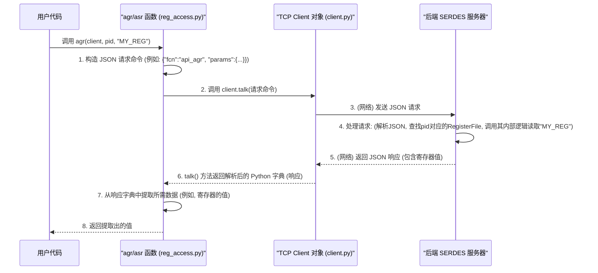

# Chapter 6: 寄存器访问函数 (agr/asr)


欢迎来到 `python_env` 教程的第六章！在上一章[《API 客户端 (API Client)》](05_api_客户端__api_client__.md)中，我们学习了 `Client` 类如何帮助我们的 Python 应用程序与后端 SERDES 服务器进行通信。我们知道了可以通过构造特定的 JSON 命令并使用 `client.talk()` 方法来发送请求和接收响应。

虽然 `API 客户端` 已经为我们处理了底层的网络通信细节，但在日常的硬件交互中，最常见的操作莫过于读取和写入硬件寄存器的值。如果我们每次都需要手动构造类似 `{"fcn": "api_reg_read_ip", "params": {"address": 0x100}}` 这样的字典，然后调用 `talk()`，代码还是会显得有些繁琐，尤其是在需要频繁读写多个寄存器的情况下。

想象一下，你正在编写一个脚本来配置一个复杂的芯片。你可能需要：
1.  读取芯片的状态寄存器 `CHIP_STATUS`。
2.  根据状态，设置配置寄存器 `CONFIG_MODE` 为特定值。
3.  再读取另一个控制寄存器 `CONTROL_REG` 以确认设置。

如果每一步都需要构建 JSON 字符串，代码很快就会变得冗长且难以阅读。这时，我们就需要更简洁、更直接的方法来与寄存器打交道。

这就是本章的主角——`agr` 和 `asr` 函数——大显身手的地方。

## 1. `agr` 和 `asr` 是什么？为什么它们如此便捷？

`agr` 和 `asr` 是在 `python_env` 项目中广泛使用的两个核心辅助函数，它们为与硬件寄存器交互提供了一个非常简单和高级的接口。

*   **`agr` (可能是 Analog Get Register 的缩写)**：用于**读取 (get)** 硬件寄存器的值。你只需要告诉它你要读取哪个寄存器（通过名称），它就会返回该寄存器的当前值。
*   **`asr` (可能是 Analog Set Register 的缩写)**：用于**设置 (set)** 硬件寄存器的值。你告诉它要设置哪个寄存器（通过名称）以及要设置成什么值，它就会帮你完成写入操作。

这两个函数通常被视为对更底层操作的封装。你可以把它们看作是快捷方式或“宏命令”：

*   **使用者**：GUI 界面上的按钮点击事件处理代码、[验证脚本 (Validation Scripts)](07_验证脚本__validation_scripts__.md)中的测试步骤。
*   **`agr`/`asr` 函数**：它们接收寄存器名称和要写入的值（对于 `asr`）。
*   **内部工作**：
    1.  它们会根据你提供的寄存器名称和目标硬件部分（由一个叫做 `pid` 的标识符指定），构造出符合后端 SERDES 服务器 API 规范的 JSON 命令（例如，`{"fcn": "api_agr", ...}` 或 `{"fcn": "api_asr", ...}`）。
    2.  然后，它们利用我们在上一章学习的 [API 客户端 (API Client)](05_api_客户端__api_client__.md) 的 `talk()` 方法，将这个命令发送给服务器。
    3.  服务器接收到命令后，会使用其内部的[寄存器文件 (Register File)](03_寄存器文件__register_file__.md) 实例来定位并操作相应的[寄存器 (Register)](02_寄存器__register__.md) 对象。
    4.  服务器将操作结果返回给 API 客户端，`agr`/`asr` 函数再从响应中提取出你需要的数据（读取到的值或操作成功与否的状态）并返回。

通过使用 `agr` 和 `asr`，你几乎不需要关心 JSON 命令的具体格式，也不需要直接操作 `API 客户端` 的 `talk()` 方法。你只需要专注于“我要操作哪个寄存器”和“我要对它做什么”。

这两个函数通常定义在项目的辅助模块中，例如 `python_gui/registers/reg_access.py` 或 `sub/reg_access.py`。

## 2. 如何使用 `agr` 和 `asr` 函数

使用 `agr` 和 `asr` 非常直观。你通常需要三样东西：
1.  一个 `tcp_client` 对象：这是 [API 客户端 (API Client)](05_api_客户端__api_client__.md) 的一个实例，它知道如何与 SERDES 服务器通信。
2.  一个 `ipid` (或 `pid`)：这是一个标识符，告诉服务器你想要操作的是哪个硬件部分或模块的寄存器（例如，主 IP 核的寄存器、FPGA 的寄存器，还是某个测试芯片 TC 的寄存器）。你可以通过 `get_pid()` 函数获取它。
3.  寄存器的名称 (`reg_name`)：这是在[DAT/CSV 文件解析器 (DAT/CSV Parser)](04_dat_csv_文件解析器__dat_csv_parser__.md) 加载的定义文件中为寄存器指定的名称。

### 2.1. `get_pid(tcp_client, pid_type)`：获取硬件部分标识符

在调用 `agr` 或 `asr` 之前，你可能需要知道目标硬件部分的 `pid`。`get_pid` 函数可以帮助你。

```python
# 导入函数 (假设这些函数在 reg_access.py 中)
from reg_access import get_pid, agr, asr 
# 假设我们已经有了一个 API Client 实例，连接到服务器
# from client import Client # 从上一章我们知道 Client 类
# my_tcp_client = Client(host="localhost", port=7878) # 示例

# 获取 "IP" 类型硬件部分的 PID (例如，主处理芯片)
# 'self.ct' 在很多脚本中通常是指当前的 tcp_client 实例
# 这里我们用一个假设的 my_tcp_client 变量
try:
    # 模拟一个 tcp_client，它有一个 talk 方法
    class MockTcpClient:
        def talk(self, command_dict, debug_val):
            print(f"模拟客户端发送: {command_dict}")
            if command_dict.get("fcn") == "api_get_pid":
                # 假设服务器返回这样一个列表，pid 在索引1的位置
                return ["api_get_pid_response", 10, "some_other_data"] 
            elif command_dict.get("fcn") == "api_agr":
                return ["api_agr_response", "pid_used", "reg_name_used", 0xABCD] # 假设返回值为 0xABCD
            elif command_dict.get("fcn") == "api_asr":
                return "." # 假设成功时返回 "."
            return {"error": "未知命令"}

    my_tcp_client = MockTcpClient()
    
    ip_identifier = get_pid(my_tcp_client, "IP") 
    print(f"获取到的 IP 模块的 PID 是: {ip_identifier}") # 应该输出 10

    fpga_identifier = get_pid(my_tcp_client, "FPGA")
    print(f"获取到的 FPGA 模块的 PID 是: {fpga_identifier}") # 应该输出 10 (基于模拟客户端的固定返回)
except Exception as e:
    print(f"发生错误: {e}")

```
**代码解释**:
*   `get_pid(tcp_client, pid_type)` 函数接收一个 `tcp_client` 实例和 `pid_type` 字符串（如 "IP", "FPGA", "TC"）。
*   它内部会构造一个类似 `{"fcn": "api_get_pid", "params": {"pid_type": pid_type}}` 的命令。
*   通过 `tcp_client.talk()` 发送此命令给服务器。
*   服务器响应中会包含请求类型的 `pid`。此函数解析响应并返回这个 `pid` 值。
*   在我们的模拟例子中，`MockTcpClient` 的 `talk` 方法模拟了服务器的行为，对于 `api_get_pid` 请求，它总是返回一个列表，其中索引 `1` 的元素是 PID (这里是 `10`)。

### 2.2. `agr(tcp_client, ipid, reg_name)`：读取寄存器

一旦有了 `tcp_client` 和 `ipid`，就可以用 `agr` 来读取寄存器的值了。

```python
# (继续使用上一节的 my_tcp_client 和 ip_identifier)
try:
    # 假设我们要读取名为 "DEVICE_STATUS" 的寄存器，它属于 ip_identifier (PID 10) 代表的硬件部分
    status_value = agr(my_tcp_client, ip_identifier, "DEVICE_STATUS")
    print(f"读取到 DEVICE_STATUS 的值是: {hex(status_value)}") # 应该输出 0xabcd (基于模拟客户端的固定返回)

    # 再读取一个名为 "CONTROL_REGISTER" 的寄存器
    control_value = agr(my_tcp_client, ip_identifier, "CONTROL_REGISTER")
    print(f"读取到 CONTROL_REGISTER 的值是: {hex(control_value)}") # 应该输出 0xabcd
except Exception as e:
    print(f"读取寄存器时发生错误: {e}")
```
**代码解释**:
*   `agr(tcp_client, ipid, reg_name)` 接收客户端实例、硬件PID 和寄存器名称。
*   它会构造一个类似 `{"fcn": "api_agr", "params": {"pid": ipid, "reg_name": "DEVICE_STATUS"}}` 的命令。
*   通过 `tcp_client.talk()` 发送命令。
*   服务器响应中会包含读取到的寄存器值。`agr` 函数解析这个响应并返回该值。
*   我们的 `MockTcpClient` 对 `api_agr` 请求固定返回包含 `0xABCD` 的列表，所以 `agr` 调用会返回这个值。

### 2.3. `asr(tcp_client, ipid, reg_name, value)`：设置寄存器

使用 `asr` 来写入或设置寄存器的值。

```python
# (继续使用上一节的 my_tcp_client 和 ip_identifier)
try:
    # 假设我们要设置名为 "LED_CONTROL" 的寄存器 (属于 ip_identifier) 的值为 1 (点亮LED)
    print(f"\n尝试设置 LED_CONTROL 为 1...")
    write_success = asr(my_tcp_client, ip_identifier, "LED_CONTROL", 1)
    if write_success:
        print("设置 LED_CONTROL 为 1 成功！")
    else:
        print("设置 LED_CONTROL 为 1 失败。")

    # 尝试设置另一个寄存器 "CONFIG_MODE" 为 0x05
    print(f"\n尝试设置 CONFIG_MODE 为 0x05...")
    write_success = asr(my_tcp_client, ip_identifier, "CONFIG_MODE", 0x05)
    if write_success:
        print("设置 CONFIG_MODE 为 0x05 成功！")
    else:
        print("设置 CONFIG_MODE 为 0x05 失败。")

except Exception as e:
    print(f"设置寄存器时发生错误: {e}")
```
**代码解释**:
*   `asr(tcp_client, ipid, reg_name, value)` 接收客户端实例、硬件PID、寄存器名称以及要写入的值。
*   它会构造一个类似 `{"fcn": "api_asr", "params": {"pid": ipid, "reg_name": "LED_CONTROL", "value": 1}}` 的命令。
*   通过 `tcp_client.talk()` 发送命令。
*   服务器执行写入操作后会返回一个状态。`asr` 函数解析这个状态，通常如果操作成功会返回 `True`（在实际的 `reg_access.py` 中，如果服务器返回 `.` 则表示成功），否则返回 `False` 或其他错误指示。
*   我们的 `MockTcpClient` 对 `api_asr` 固定返回 `.`，所以 `asr` 调用会返回 `True`。

这些函数使得与寄存器的交互变得像调用普通的 Python 函数一样简单。

## 3. `agr` 和 `asr` 是如何工作的？（幕后探秘）

虽然使用 `agr` 和 `asr` 很简单，但理解它们内部是如何与 [API 客户端 (API Client)](05_api_客户端__api_client__.md) 和后端服务器协作的，能帮助我们更好地排查问题和理解整个系统。

### 3.1. 核心流程

当你在代码中调用 `value = agr(client, pid, "MY_REG")` 时，大致会发生以下事情：



对于 `asr` 函数，流程类似，只是：
*   步骤1中构造的 JSON 命令会包含要写入的值，例如 `{"fcn":"api_asr", "params":{"pid":pid, "reg_name":"MY_REG", "value":123}}`。
*   步骤4中服务器会执行写入操作。
*   步骤5中服务器返回的响应通常表示操作是否成功。
*   步骤7中 `asr` 函数会检查这个成功状态。

关键点在于，这些 `agr`/`asr` 函数是**客户端侧的便捷封装**。它们将用户的简单意图（“读取/设置名为 X 的寄存器”）转换成对后端服务器的特定 API 调用。实际的寄存器查找和硬件操作是由**服务器端**完成的，服务器端通常会维护一个或多个[寄存器文件 (Register File)](03_寄存器文件__register_file__.md)的实例。

### 3.2. 代码实现探究

让我们看看 `python_gui/registers/reg_access.py` (或 `sub/reg_access.py`，它们功能相似) 中这些函数的简化版实现。

**`get_pid` 函数**:
```python
# 简化自 python_gui/registers/reg_access.py
def get_pid(tcp_client, pid_type):
    debug = 0 # 控制是否打印调试信息
    # 1. 构造获取 PID 的命令字典
    get_pid_command = {"fcn": "api_get_pid", "params": {"pid_type": pid_type}}
    
    # 2. 使用 tcp_client 的 talk 方法发送命令并获取响应
    #    响应通常是一个列表或元组，其中特定索引位置包含 PID
    response = tcp_client.talk(get_pid_command, debug) 
    
    # 3. 从响应中提取 PID (假设它在索引 1 的位置)
    #    实际代码中可能有更健壮的错误检查
    pid_value = response[1] 
    return pid_value
```
这个函数非常直接：构建命令，发送，然后从返回的列表中取出 PID。

**`agr` 函数**:
```python
# 简化自 python_gui/registers/reg_access.py
def agr(tcp_client, ipid, reg_name, debug = 0):
    # 1. 构造读取寄存器的命令字典
    agr_command = {"fcn": "api_agr", 
                   "params": {"pid": int(ipid), "reg_name": reg_name}}
    
    # 2. 使用 tcp_client 的 talk 方法发送命令并获取响应
    #    响应通常是一个列表或元组
    response = tcp_client.talk(agr_command, debug)
    
    # 3. 从响应中提取寄存器的值 (假设它在索引 3 的位置)
    #    实际代码中可能有更健壮的错误检查
    register_value = response[3]
    return register_value
```
与 `get_pid` 类似，`agr` 构造特定于“原子读寄存器”的 API 命令，发送它，然后从服务器返回的列表中提取期望的值。

**`asr` 函数**:
```python
# 简化自 python_gui/registers/reg_access.py
def asr(tcp_client, ipid, reg_name, val, debug = 0):
    # 1. 构造设置寄存器的命令字典，包含要写入的值
    asr_command = {"fcn": "api_asr", 
                   "params": {"pid": int(ipid), 
                              "reg_name": reg_name, 
                              "value": val}}
    
    # 2. 使用 tcp_client 的 talk 方法发送命令并获取响应
    response = tcp_client.talk(asr_command, debug)
    
    # 3. 检查响应是否表示成功
    #    在实际代码中，服务器成功时可能返回一个特定的简单字符串，如 "."
    if response == '.': # 或者其他表示成功的条件
        return True
    else:
        return False # 表示写入可能失败或有其他问题
```
`asr` 函数包含了要写入的值 `val` 在其 API 命令中。它也检查服务器的响应，以确定写入操作是否被服务器确认为成功。

从这些实现中我们可以看到，`agr` 和 `asr` 函数本身并不直接管理[寄存器 (Register)](02_寄存器__register__.md)对象或[寄存器文件 (Register File)](03_寄存器文件__register_file__.md)对象。它们是作为[API 客户端 (API Client)](05_api_客户端__api_client__.md)的更高级别用户，专注于构造和发送针对特定寄存器操作的 API 请求。

## 4. `agr` 和 `asr` 在项目中的应用示例

这些函数因其简洁性而在项目的许多地方被使用，尤其是在需要快速与硬件交互的脚本中。例如，在 `python_gui/matlab/post_powerup_workarounds.py` 或其他类似脚本中，你会经常看到它们的身影：

```python
# 简化自 python_gui/matlab/post_powerup_workarounds.py
# 假设 self.ct 是一个已初始化的 tcp_client 实例

# from registers.reg_access import get_pid, agr, asr # 通常在文件顶部导入

def pmd_lane_swap_example(self_obj): # self_obj 是包含 tcp_client (self.ct) 的对象
    # 获取 "IP" 模块的 PID
    ipid = get_pid(self_obj.ct, "IP")

    # 使用 asr 设置一系列 PMD (Physical Medium Dependent) 相关的寄存器
    asr(self_obj.ct, ipid, "PMD_RX0.RX_SPARE_CFG_0.PHYSICAL_TX_MUX_SEL", 0)
    asr(self_obj.ct, ipid, "PMD_TX0.TX_SPARE_CFG_0.LOGICAL_TX_MUX_SEL", 0)

    asr(self_obj.ct, ipid, "PMD_RX1.RX_SPARE_CFG_0.PHYSICAL_TX_MUX_SEL", 1)
    # ... 更多 asr 调用 ...

def check_rx_ready_example(self_obj, lane_num):
    ipid = get_pid(self_obj.ct, "IP")
    
    # 使用 agr 读取某个状态寄存器
    # 注意：寄存器名称通常很长，反映了其在硬件层级结构中的位置
    # agr 的返回值通常是数字，这里假设 1 表示准备好
    ready_status = agr(self_obj.ct, ipid, f"PMD_RX{lane_num}.PMD_RX_OVRDVAL_3.RXX_RDY_O")
    
    if ready_status == 1: # 假设 1 表示就绪
        print(f"通道 {lane_num} 已准备就绪。")
        return True
    else:
        print(f"通道 {lane_num} 未准备就绪。")
        return False
```
这些示例清晰地展示了 `agr` 和 `asr` 如何让脚本代码专注于业务逻辑（比如配置 PMD 通道交换或检查接收器状态），而将与服务器通信的细节隐藏起来。

## 5. 总结

在本章中，我们学习了 `agr` 和 `asr` 这两个便捷的寄存器访问函数：

*   **它们是什么**：`agr` 用于读取寄存器值，`asr` 用于设置寄存器值。它们是高级的辅助函数。
*   **为什么使用它们**：它们极大地简化了通过名称与硬件寄存器交互的过程，使得代码更简洁、更易读。
*   **如何使用**：你需要一个 `tcp_client` 实例、目标硬件的 `pid`（可通过 `get_pid` 获取）、寄存器名称以及要写入的值（对于 `asr`）。
*   **工作原理**：它们通过构造特定的 JSON API 命令（如 `"api_agr"`, `"api_asr"`），并利用 [API 客户端 (API Client)](05_api_客户端__api_client__.md) 的 `talk()` 方法与后端 SERDES 服务器通信。实际的寄存器操作由服务器端完成。
*   **应用场景**：在 GUI 事件处理、初始化脚本、[验证脚本 (Validation Scripts)](07_验证脚本__validation_scripts__.md) 等场景中被广泛使用。

`agr` 和 `asr` 为开发者提供了一层强大的抽象，使得与硬件寄存器的交互几乎和操作本地变量一样方便。

在下一章 [《验证脚本 (Validation Scripts)》](07_验证脚本__validation_scripts__.md) 中，我们将看到这些 `agr` 和 `asr` 函数（以及其他类似工具）是如何被用来编写自动化测试，以验证硬件功能是否按预期工作的。

---

Generated by [AI Codebase Knowledge Builder](https://github.com/The-Pocket/Tutorial-Codebase-Knowledge)