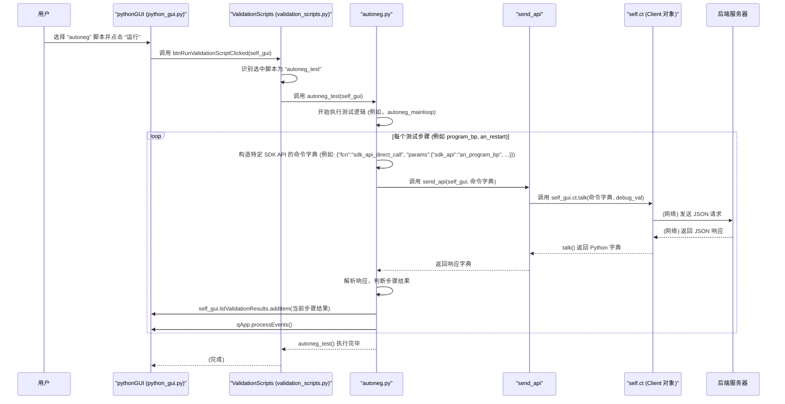

# Chapter 7: 验证脚本 (Validation Scripts)


欢迎来到 `python_env` 教程的第七章！在上一章[《寄存器访问函数 (agr/asr)》](06_寄存器访问函数__agr_asr__.md)中，我们学习了如何使用便捷的 `agr` 和 `asr` 函数来直接通过名称读写硬件寄存器。这些函数极大地简化了与硬件的底层交互。

但是，仅仅能够配置硬件还不够。我们如何确保硬件的复杂功能（比如数据链路的自动协商、高速信号的眼图质量，或者整个芯片的上电初始化序列）真正按照我们的预期工作呢？手动一步步检查这些复杂功能既耗时又容易出错。这时，**验证脚本 (Validation Scripts)** 就派上了大用场。

## 1. 什么是验证脚本？我们为什么需要它？

想象一下，你刚刚完成了一系列复杂的硬件配置，比如设置了一个网络接口的自动协商 (Autoneg) 参数。你怎么知道自动协商过程是否成功，链路是否以期望的速率和模式稳定工作了呢？或者，你想测试某个通信通道的误码率 (BER) 是否在可接受范围内。

**验证脚本**就是一组预先编写好的测试程序，专门用于自动化地验证硬件的特定功能是否按预期工作。它们就像一套详细的“体检项目”，可以系统地检查硬件的各项关键指标和行为。

在 `python_env` 项目中，验证脚本可以用来：
*   测试**误码率 (Bit Error Rate, BER)**：检查数据传输的准确性。
*   绘制**眼图 (Eye Diagram)**：评估高速信号的质量。
*   验证**自动协商 (Autoneg)** 过程：确保通信双方能正确协商工作参数。
*   检查**上电序列 (Power-up Sequence)**：确认芯片各模块按正确的顺序和状态启动。
*   执行其他各种硬件功能测试。

[Python 图形用户界面 (Python GUI)](01_python_图形用户界面__python_gui__.md) 提供了一个方便的界面，允许用户选择并运行这些预定义的验证脚本，然后查看测试结果。这使得即便是对底层细节不太了解的用户，也能轻松地对硬件进行全面的功能验证。

## 2. 如何使用验证脚本：通过 GUI 运行测试

在 `python_env` 项目中，运行验证脚本通常是通过其图形用户界面完成的。

1.  **启动 GUI**：首先，你需要运行 `python_gui/python_gui.py` 来启动主界面。
2.  **选择脚本**：在 GUI 中，通常会有一个专门的“验证 (Validation)”或类似名称的选项卡或区域。在这里，你会找到一个下拉菜单，列出了所有可用的验证脚本。
3.  **运行脚本**：选择你想要运行的脚本后，点击“运行 (Run)”按钮。
4.  **查看结果**：脚本运行过程中，相关的日志信息和测试结果会显示在 GUI 的特定区域（例如一个列表框 `lstValidationResults`）。

这种交互方式的核心由 `python_gui/validation/validation_scripts.py` 文件中的逻辑驱动。

### 2.1 脚本列表的加载

当 GUI 启动或加载验证相关的界面时，`python_gui/validation/validation_scripts.py` 中的 `validation_scripts_load` 函数会被调用。

```python
# 文件: python_gui/validation/validation_scripts.py (简化片段)

# 定义一个包含所有可用验证脚本名称的列表
validation_scripts_list = ["powerup_txrx", # 上电收发器
                        "ber_test",         # 误码率测试
                        "ndes_1d_plot",     # 1D 眼图绘制
                        "ndes_2d_plot",     # 2D 眼图绘制
                        "autoneg",          # 自动协商测试
                        "pwrup_pwrdwn_test",# 上电/断电测试
                        "split_powerup_test",# 分步上电测试
                        "get_ip_reg_dump"]  # 获取IP寄存器转储

# 这个函数会被GUI调用，用来填充下拉菜单
def validation_scripts_load(self_gui): # self_gui 是GUI主窗口的实例
    print("validation_scripts_load: 正在加载验证脚本列表到下拉菜单...")
    # self_gui.cmbValidationScripts 是GUI上的下拉菜单控件
    self_gui.cmbValidationScripts.addItems(validation_scripts_list)
```
**代码解释**：
*   `validation_scripts_list`：一个 Python 列表，硬编码了所有可供用户选择的验证脚本的名称。
*   `validation_scripts_load(self_gui)`：这个函数接收 GUI 主窗口对象 (`self_gui`) 作为参数。它通过调用 `self_gui.cmbValidationScripts.addItems()` 方法，将 `validation_scripts_list` 中的脚本名称填充到 GUI 界面上名为 `cmbValidationScripts` 的下拉菜单中。

### 2.2 运行选定的脚本

当用户在 GUI 中选择了某个脚本并点击“运行”按钮时，`python_gui/validation/validation_scripts.py` 中的 `btnRunValidationScriptClicked` 函数会被触发。

```python
# 文件: python_gui/validation/validation_scripts.py (简化片段)

# 导入各个验证脚本模块中定义的测试执行函数
from validation.powerup_txrx import powerup_txrx
from validation.ber_test import ber_test
from validation.ndes_1d_plot import ndes_1d_plot
# ... 其他脚本的导入 ...
from validation.autoneg import autoneg_test # 导入自动协商测试函数
from registers.rw_registers import get_ip_reg_dump

def btnRunValidationScriptClicked(self_gui): # self_gui 是GUI主窗口的实例
    selected_script_name = self_gui.cmbValidationScripts.currentText()
    if not selected_script_name: # 如果没有选择脚本
        return
    
    print(f"btnRunValidationScriptClicked: 用户选择了脚本 '{selected_script_name}' 并点击了运行。")
    self_gui.lstValidationResults.clear() # 清空之前的测试结果显示区域
    qApp.processEvents() # 处理GUI事件，保持界面响应

    # 根据选择的脚本名称，调用对应的测试函数
    if (selected_script_name == validation_scripts_list[0]): # "powerup_txrx"
        powerup_txrx(self_gui)
    elif(selected_script_name == validation_scripts_list[1]): # "ber_test"
        ber_test(self_gui)
    # ... 其他脚本的 elif 分支 ...
    elif(selected_script_name == validation_scripts_list[4]): # "autoneg"
        autoneg_test(self_gui) # 调用自动协商测试
    elif(selected_script_name == validation_scripts_list[7]): # "get_ip_reg_dump"
        get_ip_reg_dump(self_gui)
    # ... 等等 ...
```
**代码解释**：
*   `btnRunValidationScriptClicked(self_gui)`：当用户点击运行时，此函数被调用。
*   `self_gui.cmbValidationScripts.currentText()`：获取用户在下拉菜单中当前选择的脚本名称。
*   `self_gui.lstValidationResults.clear()`：清空 GUI 上用于显示结果的列表框。
*   `qApp.processEvents()`：这是一个重要的 PyQt 调用，它确保在执行耗时较长的脚本时，GUI 界面不会冻结，能够继续响应用户的其他操作（尽管在脚本运行时通常会限制其他操作）。
*   **`if/elif` 分支**：根据 `selected_script_name`，代码会调用相应导入的测试函数（例如，如果选择了 "autoneg"，则调用 `autoneg_test(self_gui)`）。注意，这些测试函数通常也接收 `self_gui` 作为参数，这样它们就能够访问 GUI 的元素（比如结果列表框 `lstValidationResults`）和 GUI 对象中可能包含的资源（比如 [API 客户端 (API Client)](05_api_客户端__api_client__.md) 实例 `self_gui.ct`）。

## 3. 验证脚本的内部工作：以自动协商为例

我们已经看到用户如何从 GUI 启动一个验证脚本。那么，一个具体的验证脚本（比如 `autoneg_test`）内部是如何工作的呢？

验证脚本通常是一系列精心设计的步骤，这些步骤会：
1.  **配置硬件**：设置寄存器以使硬件进入特定的测试状态。
2.  **触发操作**：启动某个硬件过程（例如，开始自动协商）。
3.  **轮询状态**：读取状态寄存器，检查操作是否完成或是否达到某个条件。
4.  **读取结果**：从硬件获取测试结果数据。
5.  **判断通过/失败**：根据预期的结果与实际结果进行比较。
6.  **报告状态**：将每一步的操作和最终结果输出到 GUI 的结果显示区域。

这些步骤通常会通过调用更底层的函数来与硬件交互，这些函数最终会使用我们在[《API 客户端 (API Client)》](05_api_客户端__api_client__.md)章节中讨论的 `client.talk()` 方法，或者[《寄存器访问函数 (agr/asr)》](06_寄存器访问函数__agr_asr__.md)中介绍的 `agr`/`asr` 函数（如果后端服务器的 API 设计支持直接的 `api_agr`/`api_asr` 调用的话）。

在 `python_env` 项目的验证脚本中，一种常见的与后端服务器通信的方式是使用一个名为 `send_api` 的辅助函数。这个函数通常封装了构造 API 命令字典和调用 `self.ct.talk()`（`self.ct` 是 GUI 对象中持有的 [API 客户端 (API Client)](05_api_客户端__api_client__.md) 实例）的逻辑。

让我们看一个简化的时序图，展示当用户运行 "autoneg" 脚本时发生的情况：



### 3.1 深入 `autoneg.py` 脚本 (简化示例)

`python_gui/validation/autoneg.py` 文件包含了一个用于测试自动协商功能的复杂脚本。让我们看一些其中的关键部分（经过简化）来理解其结构。

首先，脚本通常会定义一个 `send_api` 辅助函数（或者从共享模块导入），用于简化与服务器的通信：
```python
# 文件: python_gui/validation/autoneg.py (或同级目录的 send_api.py, 此处为简化内联)
# 假设 self.ct 是 GUI 主窗口中 API Client 的实例
def send_api_in_script(gui_instance, command_dict_to_send):
    debug_enabled = 0 # 可以设为1来打印详细的通信日志
    # gui_instance.ct 就是 API Client 对象
    response_from_server = gui_instance.ct.talk(command_dict_to_send, debug_enabled)
    return response_from_server
```
**代码解释**：
*   `send_api_in_script` (这里为了区分，加了后缀，实际脚本中可能就叫 `send_api`) 接收 GUI 实例和命令字典。
*   它直接使用 `gui_instance.ct.talk()` 来发送命令并返回服务器的响应。

接下来，一个具体的测试步骤，比如配置自动协商的“基本页 (Base Page)”：
```python
# 文件: python_gui/validation/autoneg.py (简化片段)
# 导入全局配置对象，例如 an_cfg
# from validation.config import an_cfg 

def program_bp_example(gui_instance): # gui_instance 即 self_gui
    # 从配置对象 an_cfg 中获取参数 (简化)
    # an_cfg.bp.selector_field = 1 
    # ... 其他参数设置 ...
    # bp_tech_ability = 0xF0 

    # 为链路伙伴 (Lane 0) 配置基本页
    sdk_api_function_name = 'an_program_bp'
    lane_number = 0
    
    # 构造发送给服务器的命令字典
    # "fcn": "sdk_api_direct_call" 表示调用服务器上的一个通用API入口点
    # "sdk_api": "an_program_bp" 指定了实际要调用的后端SDK函数名
    command_for_lane0 = {
        "fcn": "sdk_api_direct_call", 
        "params": {
            "sdk_api": sdk_api_function_name, 
            "lane_no": lane_number,
            # ... 其他参数如 "bp_selector_field": an_cfg.bp.selector_field ...
            "bp_tech_ability_field": 0xF0 # 简化直接使用值
        }
    }
    
    # 调用 send_api 发送命令
    response_lane0 = send_api_in_script(gui_instance, command_for_lane0)
    
    # 将结果添加到GUI的日志列表
    # response_lane0 通常是一个列表，包含状态和消息
    # 例如: ['an_program_bp', 'Lane 0 BP Config', 'PASS', ...]
    gui_instance.lstValidationResults.addItem(f"{response_lane0[1]} - {response_lane0[2]}")
    if response_lane0[2] == 'FAIL': # 检查是否失败
        return -1 # 返回错误码
    gui_instance.qApp.processEvents() # 保持GUI响应

    # ... 类似地为被测通道 (Lane 2) 配置基本页 ...
    
    return 0 # 表示成功
```
**代码解释**：
*   `program_bp_example(gui_instance)`：这是一个执行特定测试子任务的函数。
*   **参数配置**：它可能会从全局配置对象（如 `an_cfg`，通常在 `validation/config.py` 中定义）读取参数，或者直接硬编码一些值。
*   **构造命令**：它构建一个 Python 字典 `command_for_lane0`。这个字典的结构遵循了项目与后端 SERDES 服务器之间的 API 约定。
    *   `"fcn": "sdk_api_direct_call"`：这通常意味着请求会发送到一个服务器上的通用处理函数。
    *   `"params": {"sdk_api": "an_program_bp", ...}`：`params` 字典内部的 `"sdk_api"` 键指定了服务器端真正应该执行的“SDK 函数”的名称（这里是 `an_program_bp`），其他键值对则是传递给这个SDK函数的参数。
*   **发送和处理响应**：使用 `send_api_in_script` 发送命令。服务器的响应（通常是一个列表或字典）被用来判断操作是否成功，并将相关信息添加到 GUI 的 `lstValidationResults` 列表中。
*   `gui_instance.qApp.processEvents()`：再次调用以确保 GUI 刷新和响应。

### 3.2 复杂脚本中的状态机

对于像自动协商这样包含多个顺序依赖步骤的复杂测试，脚本内部经常会使用**状态机 (State Machine)** 来管理测试流程。`autoneg.py` 中的 `autoneg_mainloop` 函数就是一个很好的例子。

```python
# 文件: python_gui/validation/autoneg.py (简化片段)
from enum import Enum, auto

# 定义自动协商测试流程中的各个状态
class state(Enum):
    powerup=auto()
    set_link_incompatibility=auto()
    chk_page_received_bp=auto()
    read_lp_bp=auto()
    # ... 更多状态 ...
    an_resolved=auto()
    done=auto()

def autoneg_mainloop(gui_instance): # gui_instance 即 self_gui
    current_test_state = state.powerup # 初始状态
    
    while current_test_state != state.done:
        gui_instance.qApp.processEvents() # 确保GUI在每个循环开始时响应

        if current_test_state == state.powerup:
            gui_instance.lstValidationResults.addItem("状态: 正在上电和初始配置...")
            # 调用 program_bp_example(gui_instance) 或类似函数
            # if program_bp_example(gui_instance) != 0: return -1 # 错误处理
            # if pwrup_an(gui_instance) != 0: return -1            
            current_test_state = state.set_link_incompatibility # 转换到下一个状态
        
        elif current_test_state == state.set_link_incompatibility:
            gui_instance.lstValidationResults.addItem("状态: 设置链路不兼容性标志...")
            # if set_link_incompatible(gui_instance, 0) != 0: return -1
            current_test_state = state.chk_page_received_bp
            
        # ... 其他状态的处理逻辑 ...
        # 每个状态会执行一些操作（通常是调用其他函数与硬件交互），
        # 然后根据结果转换到下一个状态。

        elif current_test_state == state.an_resolved:
            gui_instance.lstValidationResults.addItem("状态: 自动协商已解决，配置最终速率...")
            # if an_program_resolved_rate(gui_instance) != 0: return -1
            # ... 其他收尾工作 ...
            current_test_state = state.done # 测试完成

        # ... 可能还会有超时检查和错误处理逻辑 ...
        
        # sleep(0.1) # 短暂延时，避免CPU占用过高 (根据实际情况调整)

    gui_instance.lstValidationResults.addItem("自动协商测试完成。")
    return 0
```
**代码解释**：
*   **`state` Enum**：定义了测试流程中所有可能的状态。
*   **`autoneg_mainloop` 函数**：
    *   使用一个 `while` 循环和 `current_test_state` 变量来驱动状态转换。
    *   在每个状态下，它会执行特定的操作（例如，调用 `program_bp_example`，向 GUI 添加日志）。
    *   根据操作的结果，它会更新 `current_test_state` 以进入下一个预期的状态，或者在出错时提前终止。
    *   循环直到达到 `state.done` 状态。

这种状态机的方法使得复杂的多步骤测试逻辑更易于管理和理解。

### 3.3 通用配置 (`validation/config.py`)

许多验证脚本需要使用一些可配置的参数，例如测试的目标速率、通道号、均衡器设置等。为了避免将这些值硬编码到脚本中，`python_env` 项目通常使用 `python_gui/validation/config.py` 文件来集中管理这些配置。

脚本可以从这个 `config.py` 文件中导入配置对象（如 `cfg` 或特定测试的配置如 `an_cfg`）来获取所需的参数值。
```python
# 示例: python_gui/validation/config.py (可能的样子)
class GlobalConfig:
    def __init__(self):
        self.rate = "100G" # 默认速率
        self.tx_lane_no = 0
        self.rx_lane_no = 2
        # ... 其他全局配置 ...

class AutonegConfig:
    def __init__(self):
        self.timeout_ms = 5000
        self.expected_hcd_rate = "50G_PAM4"
        # ... 其他自动协商相关配置 ...

cfg = GlobalConfig()
an_cfg = AutonegConfig()

# 在验证脚本中 (例如 autoneg.py)
# from validation.config import cfg, an_cfg
# 
# def some_test_step(gui_instance):
#     target_rate = cfg.rate # 使用全局配置中的速率
#     timeout_duration = an_cfg.timeout_ms # 使用Autoneg特定配置中的超时
#     gui_instance.lstValidationResults.addItem(f"测试将使用速率: {target_rate}")
#     # ...
```
这种方式使得用户可以通过修改 `config.py`（或者通过 GUI 间接修改这些配置对象的值）来调整测试参数，而无需修改验证脚本本身的代码。

## 4. 总结

在本章中，我们学习了验证脚本在 `python_env` 项目中的重要作用：

*   **目的**：验证脚本是一组预定义的自动化测试程序，用于检查硬件的各项功能（如误码率、眼图、自动协商、上电序列等）是否按预期工作。
*   **用户交互**：用户通常通过 [Python 图形用户界面 (Python GUI)](01_python_图形用户界面__python_gui__.md) 选择并运行这些脚本。`python_gui/validation/validation_scripts.py` 负责管理脚本列表的显示和分派执行。
*   **内部工作**：
    *   每个验证脚本执行一系列配置硬件、触发操作、检查状态和报告结果的步骤。
    *   它们通过调用辅助函数（如 `send_api`）与后端 SERDES 服务器通信，这些辅助函数内部使用 [API 客户端 (API Client)](05_api_客户端__api_client__.md) 的 `talk()` 方法。
    *   复杂的脚本（如自动协商测试）常使用状态机来管理测试流程。
    *   脚本参数通常从共享的配置文件（如 `validation/config.py`）中获取。
*   **结果反馈**：脚本会将执行过程中的日志和最终结果输出到 GUI 界面上，供用户查看。

验证脚本是确保硬件质量和功能正确性的关键工具。它们将复杂的测试流程自动化，提高了测试效率和可靠性。

在下一章，我们将探讨另一个重要的硬件管理功能：[《固件更新 (Firmware Update)》](08_固件更新__firmware_update__.md)。我们将了解如何通过 `python_env` 为硬件加载新的固件。

---

Generated by [AI Codebase Knowledge Builder](https://github.com/The-Pocket/Tutorial-Codebase-Knowledge)