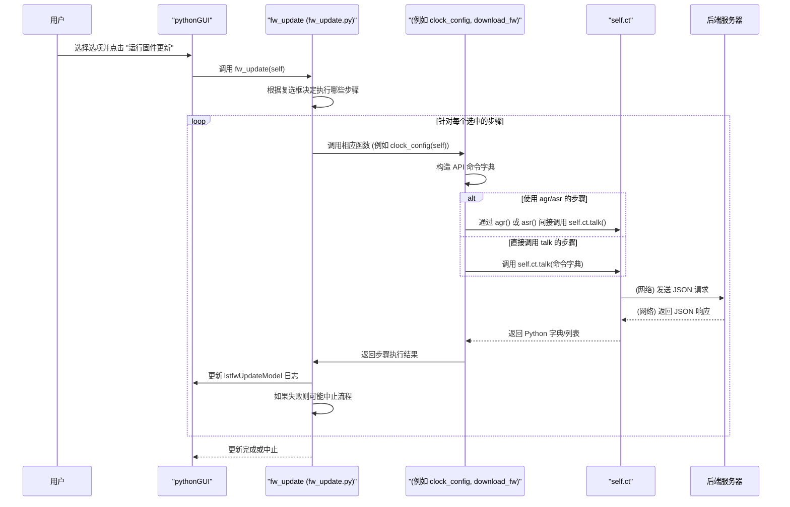

# Chapter 8: 固件更新 (Firmware Update)


欢迎来到 `python_env` 项目教程的第八章！在上一章[《验证脚本 (Validation Scripts)》](07_验证脚本__validation_scripts__.md)中，我们学习了如何使用自动化脚本来验证硬件功能的正确性。这些脚本帮助我们确保硬件在配置后能够按预期工作。但是，如果硬件本身需要升级——比如修复bug或添加新功能——我们就需要更新它的“大脑”，也就是固件。本章将带你了解 `python_env` 项目中固件更新模块是如何工作的。

## 1. 什么是固件？为什么需要更新它？

想象一下你的智能手机或电脑，它们时不时会收到操作系统或应用程序的更新。这些更新通常是为了修复已知问题、提高性能或引入新特性。硬件设备，比如我们项目中可能接触到的芯片或开发板，内部也运行着一种特殊的软件，叫做**固件 (Firmware)**。

固件就像是硬件的“嵌入式操作系统”或“底层驱动程序”。它直接控制硬件的运作，决定了硬件能做什么以及如何做。

**为什么需要更新固件呢？**
*   **修复错误 (Bug Fixes)**：就像所有软件一样，固件也可能存在缺陷。更新固件可以修复这些问题，提高硬件的稳定性和可靠性。
*   **添加新功能 (New Features)**：硬件制造商可能会通过固件更新来为现有硬件增加新的功能或改进现有功能。
*   **性能优化 (Performance Improvements)**：固件更新有时也能优化硬件的性能，比如提高处理速度或降低功耗。
*   **兼容性更新 (Compatibility Updates)**：确保硬件能与新的软件或其他硬件设备良好协作。

`python_env` 项目中的“固件更新”模块正是为了管理和执行这个给硬件“换脑”的过程而设计的。它就像一个专门为硬件定制的软件安装程序。

## 2. `python_env` 中的固件更新模块

在 `python_env` 项目中，固件更新模块负责协调一系列复杂的步骤，以确保新的固件被正确地加载到硬件上并开始运行。这个过程通常包括：

1.  **配置时钟 (Clock Configuration)**：确保硬件上的时钟系统按照新固件的要求正确设置。
2.  **下载固件文件 (Firmware File Download)**：将新的固件二进制文件从你的电脑传输到硬件设备的目标内存中。
3.  **下载校准配置数据 (Calibration Configuration Data Download)**：固件可能需要一些特定的校准数据才能正常工作，这些数据也需要被下载到硬件中。
4.  **启动CPU/固件 (Start CPU/Firmware)**：在所有必要的文件和配置都准备好之后，发出指令让硬件的CPU开始执行新的固件代码。
5.  **检查初始化状态 (Check Initialization Status)**：确认新固件是否成功启动并完成了初始化。

[Python 图形用户界面 (Python GUI)](01_python_图形用户界面__python_gui__.md) 为这个复杂的过程提供了一个用户友好的操作界面，允许用户选择固件版本、配置文件，并触发和监控整个更新流程。

## 3. 如何通过 GUI 进行固件更新

通常，你会通过 `python_env` 的图形用户界面来执行固件更新操作。让我们看看这是如何工作的。

### 3.1. 固件更新界面概览

当你启动 GUI (`python_gui/python_gui.py`) 后，通常会有一个专门的“固件更新 (FW Update)”选项卡。在这个选项卡上，你会看到一些关键的控件：

*   **时钟配置文件选择 (`cmbClkConfigFile`)**：一个下拉菜单，用于选择适合当前固件和硬件的时钟配置文件。
*   **固件版本选择 (`cmbFwVersion`)**：一个下拉菜单，列出了可供下载的固件版本。
*   **步骤选择复选框**：
    *   `chkConfigClock`：是否执行时钟配置步骤。
    *   `chkDownloadFirmware`：是否下载主固件文件。
    *   `chkDownloadCalConfig`：是否下载校准配置文件。
    *   `chkStartCpu`：是否在下载完成后启动CPU运行新固件。
*   **运行按钮 (`btnFwUpdate`)**：点击此按钮开始执行选定的固件更新流程。
*   **结果显示列表 (`lstfwUpdateModel`)**：一个列表框，用于显示固件更新过程中的每一步操作及其结果。

### 3.2. 加载界面选项

当固件更新选项卡被加载时，`python_gui/fw_update/fw_update.py` 文件中的 `fw_update_load` 函数会被调用，以填充下拉菜单中的选项。

```python
# 文件: python_gui/fw_update/fw_update.py (简化片段)

# 定义可用的固件版本列表
fw_versions = ["4p1p3",
               "4p1p2",
               # ... 其他版本 ...
               "3p0p0"]

# 定义可用的时钟配置文件列表 (不含.txt后缀)
clk_config_files = ["Si5391_100M_Out0_531p25_OUT_2_9_Registers",
                    "Si5391_156p25_OUT0_2_5_9_Registers",
                    # ... 其他配置文件 ...
                   ]

def fw_update_load(self): # self 是GUI主窗口的实例
    # 将时钟配置文件名添加到 cmbClkConfigFile 下拉菜单
    self.cmbClkConfigFile.addItems(clk_config_files)
    # 将固件版本名添加到 cmbFwVersion 下拉菜单
    self.cmbFwVersion.addItems(fw_versions)    
```
**代码解释**：
*   `fw_versions` 和 `clk_config_files` 是 Python 列表，预先定义了用户可以选择的固件版本和时钟配置文件。
*   `fw_update_load(self)` 函数将这些列表中的项目添加到 GUI 上对应的下拉菜单控件中，方便用户选择。

### 3.3. 执行固件更新流程

当用户配置好选项并点击“运行”按钮 (`btnFwUpdate`) 时，`python_gui/fw_update/fw_update.py` 中的 `fw_update` 函数会被调用。这个函数是整个固件更新流程的“总指挥”。

```python
# 文件: python_gui/fw_update/fw_update.py (简化片段)
from time import sleep
from fw_update.config_reset import config_reset # 导入配置重置函数
# 导入其他必要的辅助函数，如 clock_config, download_fw 等，它们也定义在此文件中

def fw_update(self): # self 是GUI主窗口的实例    
    self.lstfwUpdateModel.clear() # 清空之前的结果显示
    ret_val = False # 用于跟踪操作是否成功

    # 检查 "配置时钟" 复选框是否被选中
    if(self.chkConfigClock.isChecked()):
        ret_val = clock_config(self) # 调用时钟配置函数
        if(ret_val == False): return # 如果失败，则终止

    # 检查 "测量时钟频率" 复选框 (如果存在且被选中)
    # if(self.chkMeasureClkFreq.isChecked()):
    #     ret_val = measure_clock(self) # 调用时钟测量函数

    # 检查 "下载固件" 复选框是否被选中
    if(self.chkDownloadFirmware.isChecked()):
        sleep(2) # 短暂延时
        ret_val = download_fw(self) # 调用固件下载函数
        if(ret_val == False): return # 如果失败，则终止
        
        config_reset(self) # 下载后执行配置重置

        # if(send_fw_cfg(self)==False): return # 发送固件配置 (写入特定寄存器)
        sleep(2)

        # 检查 "下载校准配置" 复选框是否被选中 (且主固件下载成功)
        if(self.chkDownloadCalConfig.isChecked()):
            ret_val = download_cal_config(self) # 调用校准配置下载函数
            if(ret_val == False): return # 如果失败，则终止
        
        # 检查 "启动CPU" 复选框是否被选中 (且之前的步骤成功)
        if(self.chkStartCpu.isChecked()):
            sleep(2)
            if(send_fw_run_req(self) == True): # 发送启动CPU的请求
                sleep(2)
                check_fw_init_status(self) # 检查固件初始化状态
```
**代码解释**：
*   `fw_update(self)` 函数首先清空结果列表。
*   然后，它会根据用户在 GUI 上勾选的复选框（如 `self.chkConfigClock.isChecked()`）来决定执行哪些步骤。
*   每个步骤都由一个专门的辅助函数处理（例如 `clock_config(self)`，`download_fw(self)`等）。
*   如果在任何关键步骤失败，整个更新流程通常会提前终止。
*   `sleep(2)` 用于在某些步骤之间引入短暂的延时，这可能是为了等待硬件稳定或完成某些内部操作。

## 4. 固件更新的关键步骤详解

`fw_update(self)` 函数像一个总调度员，它调用了多个子函数来完成具体的任务。这些子函数通常会构造特定的 API 命令，并通过 [API 客户端 (API Client)](05_api_客户端__api_client__.md)（通常是 `self.ct`）发送给后端服务器。

让我们看看一些关键步骤的简化实现：

### 4.1. 时钟配置 (`clock_config`)

这一步负责根据选定的配置文件来设置硬件的时钟。

```python
# 文件: python_gui/fw_update/fw_update.py (简化片段)
def clock_config(self):
    dbg_en = 0 # 调试开关
    # 在结果列表中添加日志
    item = QStandardItem("时钟配置开始...") 
    self.lstfwUpdateModel.appendRow(item)    
    self.qApp.processEvents() # 保持GUI响应

    # 获取用户在下拉菜单中选择的时钟配置文件名
    clk_config_file = self.cmbClkConfigFile.currentText() + '.txt' 
    # 构造API命令
    api_clk_config_from_file = {"fcn": "api_clk_config_from_file", 
                                "params": {"file_name": clk_config_file}}
    
    self.setDisabled(True) # 临时禁用GUI，防止用户在操作期间进行其他操作
    # 通过 self.ct (API Client实例) 发送命令到服务器
    value =  self.ct.talk(api_clk_config_from_file, dbg_en) 
    self.setDisabled(False) # 重新启用GUI

    item = QStandardItem(str(value[1])) # value[1] 通常包含服务器返回的状态消息
    self.lstfwUpdateModel.appendRow(item)
    self.qApp.processEvents()

    if(str(value[1]) == "Clock Configuration success"): 
        return True
    else: 
        return False
```
**代码解释**：
*   它获取用户选择的时钟配置文件名。
*   构造一个名为 `api_clk_config_from_file` 的 API 命令，其中包含了文件名作为参数。
*   通过 `self.ct.talk()` 将命令发送给服务器。服务器端会负责读取这个文件并根据其内容配置硬件时钟。
*   根据服务器的响应判断操作是否成功，并更新 GUI 日志。

### 4.2. 固件下载 (`download_fw`)

这一步负责将选定版本的固件文件下载到硬件。

```python
# 文件: python_gui/fw_update/fw_update.py (简化片段)
def download_fw(self):
    dbg_en = 0
    item = QStandardItem("固件下载开始...")
    self.lstfwUpdateModel.appendRow(item)
    self.qApp.processEvents()

    # 获取用户选择的固件版本
    fw_version = self.cmbFwVersion.currentText() 
    # 构造API命令
    api_download_fw = {"fcn": "api_download_fw", 
                       "params": {"project": "x812", "fw_ver": fw_version}}
    
    self.setDisabled(True)
    value =  self.ct.talk(api_download_fw, dbg_en) # 发送命令
    self.setDisabled(False)

    item = QStandardItem(str(value[1])) # 显示服务器返回的状态
    self.lstfwUpdateModel.appendRow(item)
    self.qApp.processEvents()

    if(str(value[1]) == "Firmware Download Fail"): 
        return False
    else: 
        return True
```
**代码解释**：
*   它获取用户选择的固件版本。
*   构造一个名为 `api_download_fw` 的 API 命令，其中包含项目名称（例如 "x812"）和固件版本。
*   服务器端接收到这个命令后，会找到对应的固件文件并将其下载到硬件中。

### 4.3. 配置重置 (`config_reset`)
这个函数通常在下载新固件后被调用，用于将某些硬件配置恢复到默认状态或一个已知的良好状态。

```python
# 文件: python_gui/fw_update/config_reset.py (简化片段)
# 此文件中的 send_api 是一个辅助函数，封装了 self.ct.talk 调用
def send_api(self, sdk_api_direct_call):
    dbg_en = 0
    value =  self.ct.talk(sdk_api_direct_call, dbg_en)
    return value

def config_reset(self):
    # 构造API命令
    api_config_reset = {"fcn": "api_config_reset"} 
    send_api(self, api_config_reset) # 发送命令
    return 0 # 通常不检查返回值，假设它会成功
```
**代码解释**：
*   它发送一个简单的 `api_config_reset` 命令给服务器，由服务器执行相应的重置操作。

### 4.4. 发送固件配置 (`send_fw_cfg`)
这一步用于在固件下载后，向特定的硬件寄存器写入一些配置值，这些值可能是新固件运行所必需的。

```python
# 文件: python_gui/fw_update/fw_update.py (简化片段)
from registers.reg_access import get_pid, asr # 导入 agr/asr 函数

def send_fw_cfg(self):
    ipid = get_pid(self.ct,"IP") # 获取IP部分的PID
    # 向寄存器 0x0001D000 (FW.FW_CFG_0) 写入 0
    ret_val = asr(self.ct, ipid, "0x0001D000", 0) 
    if (ret_val):
        # 向寄存器 0x0001D004 (FW.FW_CFG_1) 写入 0
        ret_val = asr(self.ct, ipid, "0x0001D004", 0)
    
    if(ret_val == False):
        item = QStandardItem("设置 FW_CFG 失败...")
        self.lstfwUpdateModel.appendRow(item)
    return ret_val
```
**代码解释**：
*   它使用我们在[《寄存器访问函数 (agr/asr)》](06_寄存器访问函数__agr_asr__.md)中学到的 `asr` 函数来直接写入硬件寄存器。
*   这里它配置了两个固件配置寄存器（地址为 `0x0001D000` 和 `0x0001D004`）的值为0。

### 4.5. 下载校准配置 (`download_cal_config` 和 `send_cal_config`)
校准配置数据对于固件的精确运行非常重要。这个过程分为两部分：解析校准配置文件，然后将数据写入硬件。

**解析校准配置文件 (`parse_cal_config`)**:
`python_gui/fw_update/parse_cal_config.py` 中的 `parse_cal_config` 函数负责读取一个CSV格式的校准配置文件 (例如 `fw_cal_config_ftiss.csv`)，并从中提取出需要写入的寄存器地址和值。

```python
# 文件: python_gui/fw_update/parse_cal_config.py (简化片段)
import csv

# 全局列表，用于存储从CSV中解析出的地址和值
calConfigRegAddr = []
calConfigRegVal = []
# 校准配置寄存器的基地址
FW_CAL_CONFIG_BASE_ADDR = int("0x0001D018", 0) 

def IsRowRegWrite(row): # 检查行是否表示寄存器写操作
    return row[0] == "REG"

def GetRegAddr(row): # 计算绝对地址
    return str(hex(FW_CAL_CONFIG_BASE_ADDR + int(row[1],0))) 
def GetRegVal(row): # 获取要写入的值
    return int(row[7])

def parse_cal_config():
    calConfigRegAddr.clear() # 清空列表以便重新解析
    calConfigRegVal.clear()
    with open('dat_files\\fw_cal_config_ftiss.csv') as file_obj: # 打开CSV文件
        reader_obj = csv.reader(file_obj)
        for row in reader_obj: # 逐行读取
            if (IsRowRegWrite(row)): # 如果是寄存器写操作
                calConfigRegVal.append(GetRegVal(row))
                calConfigRegAddr.append(GetRegAddr(row))
                # print(calConfigRegAddr[-1] + ' - ' + str(calConfigRegVal[-1])) # 调试打印
```
**代码解释**：
*   它打开一个固定的CSV文件（`fw_cal_config_ftiss.csv`）。
*   逐行解析，如果某行代表一个寄存器写操作（由第一个单元格是否为 "REG" 判断），它会计算出实际的硬件地址（基于 `FW_CAL_CONFIG_BASE_ADDR` 和行中的偏移量）和要写入的值。
*   这些地址和值被分别存储在全局列表 `calConfigRegAddr` 和 `calConfigRegVal` 中。

**发送校准配置 (`send_cal_config`)**:
`python_gui/fw_update/fw_update.py` 中的 `send_cal_config` 函数调用 `parse_cal_config`，然后使用 `asr` 将解析出的数据逐条写入硬件。

```python
# 文件: python_gui/fw_update/fw_update.py (简化片段)
from fw_update.parse_cal_config import parse_cal_config, calConfigRegAddr, calConfigRegVal

def send_cal_config(self):    
    parse_cal_config() # 首先解析CSV文件
    ret_val = True
    ipid = get_pid(self.ct,"IP") # 获取PID
        
    # 遍历解析出来的地址和值列表
    for cntr in range(len(calConfigRegAddr)): 
        # 使用asr将每个值写入对应的地址
        ret_val = asr(self.ct, ipid, calConfigRegAddr[cntr], calConfigRegVal[cntr]) 
        if (ret_val != True): break # 如果写入失败，则停止
    return ret_val

def download_cal_config(self):    
    # ... (日志记录和GUI更新) ...
    if (send_cal_config(self) == True):
        # ... (记录成功) ...
        ret_val = True
    else:
        # ... (记录失败) ...
        ret_val = False
    # ... (GUI更新) ...
    return ret_val
```
**代码解释**：
*   `send_cal_config` 首先调用 `parse_cal_config()` 来填充 `calConfigRegAddr` 和 `calConfigRegVal` 列表。
*   然后它循环遍历这两个列表，使用 `asr` 函数将每一个校准值写入到对应的硬件寄存器地址。

### 4.6. 启动CPU运行固件 (`send_fw_run_req`)

当所有文件和配置都下载完毕后，这一步会发送命令让CPU开始执行新固件。

```python
# 文件: python_gui/fw_update/fw_update.py (简化片段)
def send_fw_run_req(self):    
    # ... (日志记录和GUI更新) ...
    api_fw_run_req = {"fcn": "api_fw_run_req"} # 构造API命令
    
    self.setDisabled(True)
    value =  self.ct.talk(api_fw_run_req, 0) # 发送命令
    self.setDisabled(False)
    # ... (处理响应并更新GUI日志) ...

    if(str(value[1]) == "Firmware Run Req success"): 
        return True
    else: 
        return False
```
**代码解释**：
*   它发送一个 `api_fw_run_req` 命令给服务器，服务器会执行启动CPU的操作。

### 4.7. 检查固件初始化状态 (`check_fw_init_status`)

CPU启动后，新固件会进行初始化。这一步会轮询一个状态寄存器，以确认固件是否成功完成初始化。

```python
# 文件: python_gui/fw_update/fw_update.py (简化片段)
def check_fw_init_status(self):
    # ... (日志记录) ...
    ipid = get_pid(self.ct,"IP")
    cnt = 0 # 计数器，用于超时
    ret_val = False # 初始化完成标志

    # 轮询状态寄存器 PMD.FW_CSR_3.CM_FW_INIT_DONE
    # 需要多次读取，直到它变为1，或者超时
    while(cnt < 100): # 最多尝试100次
        # 使用 agr 读取寄存器值
        fw_init_done_flag = agr(self.ct, ipid, "PMD.FW_CSR_3.CM_FW_INIT_DONE", 0)    
        # cnt-=1 # 原始代码是 cnt-=1，逻辑上应该是 cnt+=1 或 cnt<100 作为循环条件
        cnt += 1 
        sleep(0.1) # 等待0.1秒再检查
        if(fw_init_done_flag): # 如果标志为1
            ret_val = True
            break # 初始化完成，退出循环

    if(ret_val): item = QStandardItem("固件初始化完成...")
    else: item = QStandardItem("固件初始化失败...")
    self.lstfwUpdateModel.appendRow(item)
```
**代码解释**：
*   它使用 `agr` 函数反复读取名为 `PMD.FW_CSR_3.CM_FW_INIT_DONE` 的寄存器。
*   如果该寄存器的值变为1（或True），则表示固件初始化成功。
*   包含一个超时机制（通过 `cnt` 计数器和 `sleep(0.1)`），以避免无限等待。

## 5. 固件更新的整体流程

下面是一个简化的序列图，展示了固件更新的主要交互流程：


这个图表概括了从用户操作到与后端服务器交互，再到结果反馈的整个过程。每个“具体步骤函数”都封装了与特定任务相关的逻辑和API调用。

## 6. 总结

在本章中，我们深入了解了 `python_env` 项目中的固件更新模块：

*   **固件的重要性**：它是硬件的“大脑”，更新固件可以修复错误、添加功能或提升性能。
*   **固件更新流程**：这是一个多步骤的过程，包括时钟配置、固件下载、校准数据下载和启动CPU等。
*   **GUI 交互**：用户可以通过 GUI 方便地选择固件版本、配置文件，并触发和监控更新过程。`fw_update_load` 函数负责加载选项，`fw_update` 函数是核心的流程控制器。
*   **关键步骤实现**：我们分析了 `clock_config`、`download_fw`、`download_cal_config`、`send_fw_run_req` 等关键函数的简化实现，它们大多通过构造特定的 API 命令并使用 [API 客户端 (API Client)](05_api_客户端__api_client__.md) 与后端服务器通信，或者使用 [寄存器访问函数 (agr/asr)](06_寄存器访问函数__agr_asr__.md) 来直接操作硬件寄存器。
*   **校准配置**：`parse_cal_config.py` 负责解析校准数据文件，然后通过 `asr` 写入硬件。

固件更新模块为管理和维护硬件的底层软件提供了一个强大而灵活的工具。

在下一章 [《通信包装器 (Communication Wrapper)》](09_通信包装器__communication_wrapper__.md) 中，我们将探讨更底层的通信抽象，看看 `python_env` 是如何包装不同的通信方式（如FTDI、JTAG）来与硬件进行交互的。

---

Generated by [AI Codebase Knowledge Builder](https://github.com/The-Pocket/Tutorial-Codebase-Knowledge)