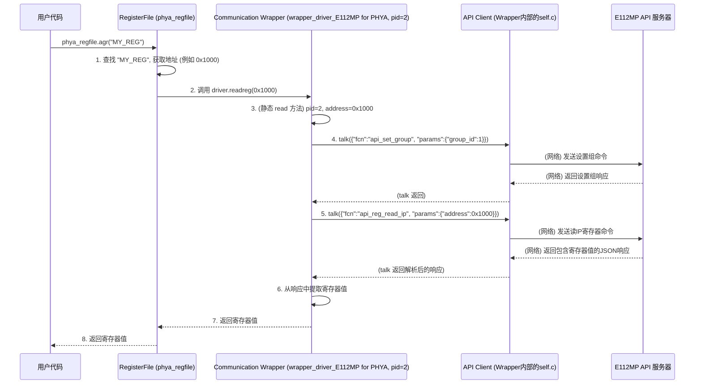

# Chapter 9: 通信包装器 (Communication Wrapper)


欢迎来到 `python_env` 教程的第九章！在上一章[《固件更新 (Firmware Update)》](08_固件更新__firmware_update__.md)中，我们学习了如何通过 `python_env` 为硬件设备更新其固件，这是一个确保硬件保持最新状态和功能的重要过程。我们看到了固件更新的各个步骤如何通过发送 API 命令给后端服务器来执行。

现在，让我们思考一个更普遍的问题：我们的应用程序，尤其是像[《寄存器文件 (Register File)》](03_寄存器文件__register_file__.md)这样的组件，是如何与各种不同的硬件，特别是那些有特定“语言”或控制接口的硬件（比如 E112MP 芯片）进行通信的呢？[《API 客户端 (API Client)》](05_api_客户端__api_client__.md)为我们提供了与后端服务器对话的“电话机”，但如果这个服务器只听得懂特定的指令格式，而我们的[《寄存器文件 (Register File)》](03_寄存器文件__register_file__.md)发出的是通用的读写请求（例如 `phya_regfile.readreg(地址)`），这时就需要一个“翻译官”了。

这就是**通信包装器 (Communication Wrapper)** 发挥作用的地方。

## 1. 什么是通信包装器？为什么我们需要它？

想象一下，你有一个通用的[《寄存器文件 (Register File)》](03_寄存器文件__register_file__.md)对象，比如 `phya_regfile`，它代表了芯片上 PHYA 部分的所有寄存器。当你通过 `phya_regfile.agr("某个寄存器名")` 来读取一个寄存器时，`RegisterFile` 内部最终会调用其绑定的“驱动程序”的 `readreg(地址)` 方法。

但是，不同的硬件设备或其控制服务器可能有截然不同的通信协议和命令格式。例如，一个简单的硬件可能直接通过 FTDI/JTAG 接口（我们将在下一章讨论）进行控制，而另一个更复杂的硬件（如 E112MP）可能通过一个专门的 API 服务器进行控制，这个服务器只接受特定格式的 JSON 请求。

**通信包装器 (Communication Wrapper)** 就是一个**适配层**或**翻译层**，专门为特定的硬件或其 API 服务器设计。它的核心任务是：

1.  **接收通用请求**：它接收来自 `RegisterFile` 的通用寄存器读写请求，比如 `driver.readreg(address)` 或 `driver.writereg(address, data)`。
2.  **翻译请求**：它将这些通用的请求“翻译”成特定硬件的 API 服务器能够理解的具体 API 调用格式（通常是 JSON 字符串）。
3.  **发送翻译后的指令**：它使用我们在[《API 客户端 (API Client)》](05_api_客户端__api_client__.md)章节学到的 `Client` 对象，将这些翻译后的指令发送给目标 API 服务器。
4.  **返回结果**：它接收来自 API 服务器的响应，并可能需要将其转换回 `RegisterFile` 期望的格式。

**打个比方**：
假设 `RegisterFile` 是一个只会说“国际通用语”（如“读取地址X”或“写入数据Y到地址Z”）的老板。而 E112MP 硬件的 API 服务器是一个只懂“E112MP 方言”（如特定 JSON 命令 `{"fcn": "api_reg_read_ip", "params": {"address": X}}`）的本地工头。

通信包装器（比如 `wrapper_driver_E112MP`）就像一个精通这两种语言的秘书。当老板用“国际通用语”下达指令时，秘书会将其准确翻译成“E112MP 方言”，然后通过电话（API 客户端）传达给本地工头。工头执行完毕后，秘书再把结果翻译回“国际通用语”报告给老板。

这样一来，`RegisterFile` 就不需要关心它正在与哪个具体类型的硬件或服务器打交道，它只需要按照标准方式与其“驱动程序”（即通信包装器）交互即可。

## 2. 通信包装器如何工作？以 `wrapper_driver_E112MP` 为例

在 `python_env` 项目中，`api_client/UREFE/common/prototype_com/comms.py` 文件里的 `wrapper_driver_E112MP` 类就是一个典型的通信包装器。它专门用于与 E112MP 硬件（或其模拟器）的 API 服务器进行通信。

这个包装器实现了 `RegisterFile` 所期望的 `readreg(address)` 和 `writereg(address, data)` 方法，从而可以被绑定为 `RegisterFile` 的驱动程序。

### 2.1 初始化包装器

当你创建一个 `wrapper_driver_E112MP` 实例时，你需要告诉它它将为哪个具体的硬件部分工作（通过 `pid`，即部件标识符），并且它内部会创建一个[《API 客户端 (API Client)》](05_api_客户端__api_client__.md)的实例，用于与后端的 API 服务器通信。

```python
# 文件: api_client/UREFE/common/prototype_com/comms.py (简化片段)
# 假设 Client 类已从 client.py 导入
from client import Client 

class wrapper_driver_E112MP():
    def __init__(self, ft_unused, pid): # ft_unused 在此场景下未使用
        self.ft = ft_unused # 保存传入的参数，但在此包装器中可能不直接使用
        self.pid = pid      # 部件标识符 (例如 1 代表 PHYB, 2 代表 PHYA, 5 代表 FPGA)
        # 创建一个 API Client 实例，用于与 SERDES API 服务器通信
        # 端口 27015 可能是为 E112MP API 服务器配置的特定端口
        self.c = Client(port=27015) 
        # print(f"通信包装器 E112MP 已为 PID {self.pid} 初始化，连接到端口 {self.c.port}")

# 如何使用 (通常在 prototype_comm 中自动完成):
# 假设我们要为 PHYA (pid=2) 创建一个包装器
# phya_wrapper = wrapper_driver_E112MP(None, pid=2)
```
**代码解释**：
*   `__init__(self, ft_unused, pid)`：构造函数接收一个 `pid`。`pid` 非常重要，因为它决定了后续的 API 调用应该针对硬件的哪个部分（比如 PHYA、PHYB 还是 FPGA）。
*   `self.c = Client(port=27015)`：创建一个 `Client` 对象。这个客户端将负责将翻译后的命令发送到运行在指定端口（这里是 `27015`）的 E112MP API 服务器。

### 2.2 实现 `readreg` (读取寄存器)

当 `RegisterFile` 需要读取一个寄存器的值时，它会调用其驱动（即 `wrapper_driver_E112MP` 实例）的 `readreg(address)` 方法。

```python
# 文件: api_client/UREFE/common/prototype_com/comms.py (续)
class wrapper_driver_E112MP():
    # ... __init__ 方法同上 ...

    def readreg(self, address):
        # 调用静态方法 read，传入 API 客户端实例 (self.c)、部件ID (self.pid) 和地址
        res = wrapper_driver_E112MP.read(self.c, self.pid, address)
        # res 通常是服务器返回的完整响应 (例如一个列表)
        # 这里假设实际的寄存器值在响应列表的特定位置 (例如索引5)
        # 注意：res[5] 的具体含义取决于API服务器的响应格式
        # return res[5] 
        # 在comms.py的实际代码中，静态read方法内部已经处理了res[5]，所以这里直接返回res
        return res 

    @staticmethod
    def read(c, pid, address):
        debug = 0 # API调用调试开关，设为1会打印更多信息
        res_dict = {} # 初始化响应字典

        # 根据 pid (部件ID) 构造不同的API读命令
        if pid == 1: # 假设 pid 1 对应 "PHYB" (IP 核组 0)
            # 可能需要先设置目标组 (在E112MP API中，组0通常是PHYB)
            set_group_command = {"fcn": "api_set_group", "params": {"group_id": 0}}
            c.talk(set_group_command, debug) # 发送设置组的命令
            
            # 构造读取 IP 寄存器的命令
            read_reg_command = {"fcn": "api_reg_read_ip", "params": {"address": address}}
            res_dict = c.talk(read_reg_command, debug) # 发送读取命令
        
        elif pid == 2: # 假设 pid 2 对应 "PHYA" (IP 核组 1)
            set_group_command = {"fcn": "api_set_group", "params": {"group_id": 1}}
            c.talk(set_group_command, debug)
            
            read_reg_command = {"fcn": "api_reg_read_ip", "params": {"address": address}}
            res_dict = c.talk(read_reg_command, debug)
        
        elif pid == 5: # 假设 pid 5 对应 "FPGA"
            read_reg_command = {"fcn": "api_reg_read_fpga", "params": {"address": address}}
            res_dict = c.talk(read_reg_command, debug)
        
        else:
            # print(f"错误: wrapper_driver_E112MP.read 不支持的 pid: {pid}")
            return {"error": f"不支持的PID {pid} 进行读取"} # 或者返回一个错误指示
            
        # 从服务器返回的字典中提取实际的寄存器值
        # 原始代码是 result = res[5]，这表明服务器响应的JSON被解析后，
        # 如果是一个列表，则取第6个元素；如果是字典，则键为 "5" 或 5。
        # 为了清晰，我们假设期望的值在 'value' 键中，或者按原始方式处理
        if isinstance(res_dict, (list, tuple)) and len(res_dict) > 5:
            return res_dict[5] 
        elif isinstance(res_dict, dict) and 'value' in res_dict: # 更通用的假设
            return res_dict['value']
        else:
            # print(f"警告: 未在响应 {res_dict} 中找到期望的寄存器值。")
            # 根据实际API调整错误处理或默认返回值
            return None # 或者根据API规范处理错误
```
**代码解释**：
1.  `readreg(self, address)` 方法本身很简单，它只是调用了一个静态的辅助方法 `wrapper_driver_E112MP.read(...)`。
2.  **`read(c, pid, address)` (静态方法)**：这才是真正的“翻译官”。
    *   它接收[《API 客户端 (API Client)》](05_api_客户端__api_client__.md)的实例 `c`、部件ID `pid` 和要读取的寄存器地址 `address`。
    *   **根据 `pid` 选择目标和命令**：
        *   如果 `pid` 是 `1` (PHYB) 或 `2` (PHYA)，它首先会发送一个 `api_set_group` 命令来告诉服务器接下来要操作的是哪个 IP 核组。这是 E112MP API 的一个特定要求。
        *   然后，它构造一个 `api_reg_read_ip` 命令，其中包含要读取的 `address`。
        *   如果 `pid` 是 `5` (FPGA)，它直接构造一个 `api_reg_read_fpga` 命令。
    *   **发送命令**：它使用 `c.talk(命令字典, debug)` 将构造好的命令发送给 API 服务器。
    *   **提取结果**：服务器的响应（`res_dict`）通常是一个包含多个信息的列表或字典。原始代码 `result = res[5]` 暗示了期望的数据位于响应的某个特定位置。在我们的简化示例中，我们尝试了一种更通用的方式（查找 `'value'` 键）或模拟了原始的索引访问。**重要的是，这部分必须与 E112MP API 服务器实际返回的 JSON 响应格式严格对应。**

### 2.3 实现 `writereg` (写入寄存器)

`writereg(address, data)` 方法与 `readreg` 类似，只是它构造的是写入命令，并且命令中会包含要写入的数据。

```python
# 文件: api_client/UREFE/common/prototype_com/comms.py (续)
class wrapper_driver_E112MP():
    # ... __init__ 和 readreg/read 方法同上 ...

    def writereg(self, address, data):
        # 调用静态方法 write，传入API客户端、pid、地址和要写入的数据
        wrapper_driver_E112MP.write(self.c, self.pid, address, data)
        return # writereg 通常不返回有意义的值

    @staticmethod
    def write(c, pid, address, value_to_write):
        debug = 0
        # 根据 pid 构造不同的API写命令
        if pid == 1: # PHYB
            set_group_command = {"fcn": "api_set_group", "params": {"group_id": 0}}
            c.talk(set_group_command, debug)
            write_reg_command = {"fcn": "api_reg_write_ip", 
                                 "params": {"address": address, "value": value_to_write}}
            c.talk(write_reg_command, debug)
        
        elif pid == 2: # PHYA
            set_group_command = {"fcn": "api_set_group", "params": {"group_id": 1}}
            c.talk(set_group_command, debug)
            write_reg_command = {"fcn": "api_reg_write_ip", 
                                 "params": {"address": address, "value": value_to_write}}
            c.talk(write_reg_command, debug)
        
        elif pid == 5: # FPGA
            write_reg_command = {"fcn": "api_reg_write_fpga", 
                                 "params": {"address": address, "value": value_to_write}}
            c.talk(write_reg_command, debug)
        # ... 其他 pid 的处理逻辑 ...
        else:
            # print(f"错误: wrapper_driver_E112MP.write 不支持的 pid: {pid}")
            pass # 通常写操作不特别关注返回值，除非API服务器有明确的错误响应
```
**代码解释**：
*   `writereg(self, address, data)` 调用静态的 `write(...)` 方法。
*   `write(c, pid, address, value_to_write)` (静态方法) 与 `read` 方法非常相似：
    *   它同样根据 `pid` 设置组和选择 API 函数名（`api_reg_write_ip` 或 `api_reg_write_fpga`）。
    *   关键区别在于，构造的命令字典中 `"params"` 部分会额外包含一个 `"value": value_to_write` 键值对，用于告诉服务器要写入什么数据。
    *   它也使用 `c.talk()` 发送命令。写操作通常不处理复杂的返回值，除非 API 服务器会返回明确的成功/失败状态。

## 3. 通信包装器在系统中的位置和交互流程

现在我们来梳理一下，当用户通过[《寄存器文件 (Register File)》](03_寄存器文件__register_file__.md)的 `agr` 方法读取一个寄存器时，这个通信包装器是如何参与进来的。

1.  **初始化 (`prototype_comm`)**：
    *   在 `api_client/UREFE/common/prototype_com/comms.py` 文件的 `prototype_comm` 类的 `__init__` 方法中，会根据 `tc_architecture` (例如 "E112MP") 创建相应的通信包装器实例。
    *   例如，如果 `tc_architecture == 'E112MP'`：
        ```python
        # 简化自 prototype_comm.__init__
        # self.ft = None # 对于E112MP，ft可能不直接使用
        # ip_wrapper_PHYA_E112MP = wrapper_driver_E112MP(self.ft, pid=2)
        # self.phya_regfile = RegisterFile(32, log=False) # 创建RegisterFile实例
        # # 将 RegisterFile 绑定到通信包装器
        # self.phya_regfile.bind(ip_wrapper_PHYA_E112MP, 
        #                        (ip_wrapper_PHYA_E112MP.writereg), 
        #                        (ip_wrapper_PHYA_E112MP.readreg))
        ```
    这里，`phya_regfile` (一个 `RegisterFile` 实例) 就被“绑定”到了 `ip_wrapper_PHYA_E112MP` (一个 `wrapper_driver_E112MP` 实例，作为其驱动程序)。

2.  **用户操作 (`phya_regfile.agr("寄存器名")`)**:
    *   用户代码（比如一个[《验证脚本 (Validation Scripts)》](07_验证脚本__validation_scripts__.md)）调用 `phya_regfile.agr("MY_CONFIG_REG")`。
    *   `phya_regfile` 内部会：
        *   查找名为 "MY\_CONFIG\_REG" 的[《寄存器 (Register)》](02_寄存器__register__.md)对象。
        *   从该 `Register` 对象获取其硬件地址 (例如 `0x1000`)。
        *   调用其绑定的驱动程序的 `readreg` 方法，即 `ip_wrapper_PHYA_E112MP.readreg(0x1000)`。

3.  **包装器执行翻译和通信**:
    *   `ip_wrapper_PHYA_E112MP.readreg(0x1000)` 被调用。
    *   由于这个包装器实例的 `pid` 是 `2` (代表 PHYA)，它的 `read` 静态方法会：
        *   发送 `{"fcn": "api_set_group", "params": {"group_id": 1}}` (设置目标为 PHYA 组)。
        *   发送 `{"fcn": "api_reg_read_ip", "params": {"address": 0x1000}}`。
        *   这两个命令都是通过其内部的 `Client` 实例 (`self.c`) 的 `talk()` 方法发送给 E112MP API 服务器的。
    *   服务器处理请求后返回 JSON 响应。
    *   `Client.talk()` 接收并解析此 JSON 响应。
    *   `wrapper_driver_E112MP.read()` 从响应中提取出实际的寄存器值。
    *   这个值逐层返回，最终成为 `phya_regfile.agr(...)` 的返回值。

下面的序列图展示了这个简化的流程：



## 4. 通信包装器的好处

使用通信包装器带来了几个重要的好处：
*   **抽象和解耦**：[《寄存器文件 (Register File)》](03_寄存器文件__register_file__.md)不需要知道如何与每一种特定硬件的 API 服务器直接对话。它只需要一个实现了 `readreg` 和 `writereg` 接口的“驱动程序”。
*   **可扩展性**：如果需要支持一种新的硬件或新的 API 服务器，只需要为它编写一个新的通信包装器类，而 `RegisterFile` 和使用它的上层代码可以保持不变。
*   **代码复用**：通用的 `RegisterFile` 逻辑可以在多种硬件上复用。
*   **简化上层逻辑**：上层代码（如[《验证脚本 (Validation Scripts)》](07_验证脚本__validation_scripts__.md)或 GUI 逻辑）可以使用统一的方式（通过 `RegisterFile` 的 `agr`/`asr`）来操作寄存器，而不必关心底层的通信细节。

在 `comms - back_up.py` 文件中，你还可以看到其他类型的包装器，例如 `wrapper_ISDS_driver`，它适配的是 `isds_driver_umr` 这种更底层的驱动接口，而不是一个网络 API 服务器。这进一步说明了包装器作为适配层的灵活性。

## 5. 总结

在本章中，我们深入探讨了通信包装器 (Communication Wrapper) 的概念和作用：

*   **它是什么**：一个适配层，用于将来自[《寄存器文件 (Register File)》](03_寄存器文件__register_file__.md)的通用寄存器读写请求，翻译成特定硬件 API 服务器能理解的具体 API 调用格式。
*   **为什么需要它**：为了让 `RegisterFile` 能够以统一的方式与具有不同通信接口或命令格式的多种硬件（或其控制服务器）进行交互。
*   **核心组件 (`wrapper_driver_E112MP`)**：
    *   它实现了 `readreg` 和 `writereg` 方法，使其可以作为 `RegisterFile` 的驱动。
    *   它内部持有一个[《API 客户端 (API Client)》](05_api_客户端__api_client__.md)实例，用于与后端服务器通信。
    *   它根据部件ID (`pid`) 和操作类型（读/写）构造特定格式的 JSON API 命令。
*   **工作流程**：我们了解了从 `RegisterFile` 发起请求，到包装器翻译并发送命令，再到从服务器获取并返回结果的完整流程。
*   **优点**：提供了良好的抽象，增强了系统的可扩展性和代码复用性。

通信包装器是 `python_env` 项目中连接高级抽象（如 `RegisterFile`）与特定硬件实现（如 E112MP API 服务器）的关键桥梁。

在下一章，也是我们教程的最后一章，[《FTDI/JTAG 通信 (FTDI/JTAG Communication)》](10_ftdi_jtag_通信__ftdi_jtag_communication__.md)，我们将目光投向更底层的硬件通信方式。虽然本章讨论的 `wrapper_driver_E112MP` 是通过网络 API 与服务器通信，但这个服务器最终可能就是通过 FTDI 或 JTAG 这类接口与物理硬件直接对话的。我们将简单了解这些直接的硬件通信方法。

---

Generated by [AI Codebase Knowledge Builder](https://github.com/The-Pocket/Tutorial-Codebase-Knowledge)