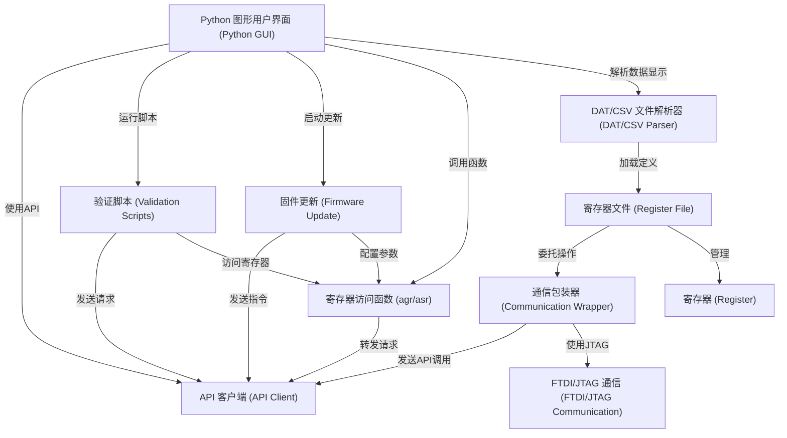

# Tutorial: python_env

这个项目是一个 *Python* 环境，用于与 **SERDES** (串行器/解串器) 硬件进行交互。
它提供了一个*图形用户界面* (GUI)，让用户可以方便地查看和修改硬件的*寄存器状态*，运行预定义的*验证脚本*来测试硬件功能，以及执行*固件更新*流程。
所有这些操作都通过一个*API客户端*与后端的硬件控制服务器进行通信。

**Source Repository:** [None](None)

## Chapters

1. [Python 图形用户界面 (Python GUI)
](01_python_图形用户界面__python_gui__.md)
2. [寄存器 (Register)
](02_寄存器__register__.md)
3. [寄存器文件 (Register File)
](03_寄存器文件__register_file__.md)
4. [DAT/CSV 文件解析器 (DAT/CSV Parser)
](04_dat_csv_文件解析器__dat_csv_parser__.md)
5. [API 客户端 (API Client)
](05_api_客户端__api_client__.md)
6. [寄存器访问函数 (agr/asr)
](06_寄存器访问函数__agr_asr__.md)
7. [验证脚本 (Validation Scripts)
](07_验证脚本__validation_scripts__.md)
8. [固件更新 (Firmware Update)
](08_固件更新__firmware_update__.md)
9. [通信包装器 (Communication Wrapper)
](09_通信包装器__communication_wrapper__.md)
10. [FTDI/JTAG 通信 (FTDI/JTAG Communication)
](10_ftdi_jtag_通信__ftdi_jtag_communication__.md)

---

Generated by [AI Codebase Knowledge Builder](https://github.com/The-Pocket/Tutorial-Codebase-Knowledge)