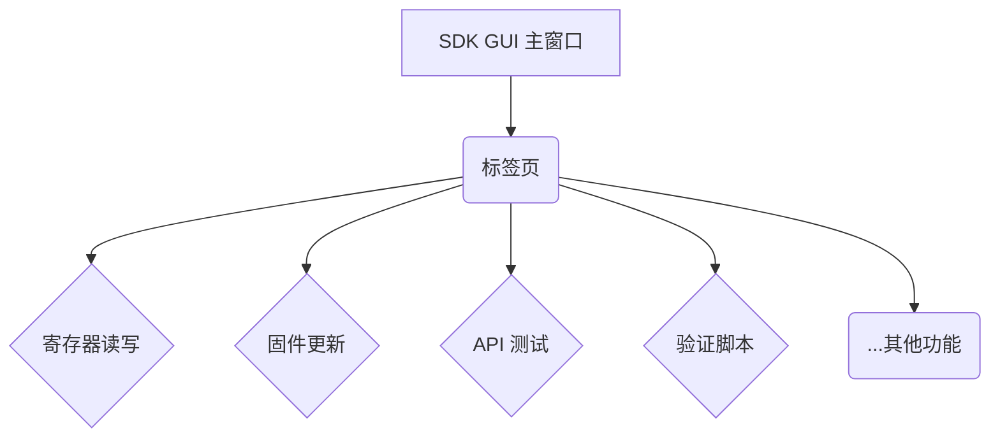
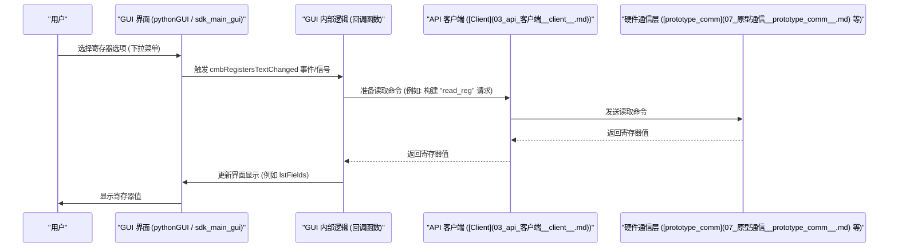

# Chapter 1: SDK GUI 主应用程序 (sdk_main_gui / pythonGUI)


欢迎来到 `python_sdk` 的世界！这是我们系列教程的第一章。在本章中，我们将一起探索 SDK 的图形用户界面 (GUI) 主应用程序。

想象一下，你需要和一套复杂的硬件设备打交道，进行各种测试和配置。每次都手动编写 Python 脚本来完成这些任务，不仅繁琐，而且容易出错，特别是对于新手或者只需要快速检查某些状态的情况。为了解决这个问题，我们引入了 SDK GUI 主应用程序。

**把它想象成汽车的仪表盘和中控台。** 你不需要打开发动机盖，手动调整线路（编写脚本），而是可以通过方向盘、油门、刹车以及中控台上的按钮和旋钮（GUI 控件）来驾驶汽车，并通过仪表盘（GUI 显示区域）查看速度、油量等信息。SDK GUI 就是这样一个“控制中心”，让你能够通过图形化的方式，轻松地与 SDK 的各项功能进行交互。

**核心用途示例：快速读取硬件寄存器值**

假设你是一名硬件工程师或测试人员，想要快速查看某个特定硬件寄存器当前的值，但又不想编写任何代码。SDK GUI 如何帮助你实现这个目标呢？这就是我们本章要探讨的核心场景。

## 什么是 SDK GUI 主应用程序？

SDK GUI 主应用程序（在代码中可能被称为 `sdk_main_gui` 或 `pythonGUI`）是提供给用户的图形界面入口。它像一个集成的控制面板，将 SDK 提供的各种核心功能模块，如：

*   寄存器读写 (Register Read/Write)
*   固件更新 (Firmware Update)
*   API 测试 (API Testing)
*   验证脚本执行 (Validation Script Execution)

都汇集到一个窗口中。

### 主要组成部分

1.  **标签页 (Tabs):** 就像文件柜里的不同抽屉，GUI 使用标签页来组织不同的功能区域。你可以点击不同的标签页（例如，“寄存器读写”、“固件更新”）来切换到对应的功能面板。这使得界面保持整洁，易于导航。



2.  **控件 (Controls):** 在每个标签页内，你会看到各种控件，如按钮、下拉菜单、文本框、复选框、单选按钮等。这些就是你与 SDK 功能交互的“开关”和“旋钮”。例如：
    *   **下拉菜单 (Dropdowns / ComboBoxes):** 用于从列表中选择选项（如选择要操作的寄存器）。
    *   **按钮 (Buttons):** 用于触发操作（如点击“读取”按钮来获取寄存器值，或点击“应用更改”来写入值）。
    *   **文本框 (Text Boxes / LineEdits):** 用于显示信息（如寄存器的当前值）或接收用户输入（如要写入的新值）。
    *   **单选/复选框 (Radio/Check Boxes):** 用于设置选项（如选择显示格式为十六进制还是十进制）。

3.  **后台集成:** GUI 自身通常不直接执行硬件操作。它更像是一个“指挥官”，接收用户的指令，然后通过调用 SDK 的其他核心组件来完成实际工作。这些后台组件包括：
    *   [API 客户端 (Client)](03_api_客户端__client__.md)：负责与硬件或模拟器进行通信。
    *   [验证脚本框架 (Validation Framework)](02_验证脚本框架__validation_framework__.md)：用于执行预定义的测试序列。
    *   寄存器定义和访问逻辑（将在 [寄存器定义解析](05_寄存器定义解析__register_definition_parsing__.md) 和 [寄存器文件](06_寄存器文件__registerfile__.md) 章节中介绍）。

### 使用的技术

这个 GUI 通常使用 Python 的图形界面库来构建，最常见的是 **PyQt** 或 **PySide**。这些库让开发者可以用 Python 代码来创建窗口、按钮、布局等界面元素，并处理用户的点击、输入等事件。

## 如何使用 GUI 读取寄存器值？

现在，让我们回到之前的核心用途示例：如何使用 GUI 快速读取一个硬件寄存器。

1.  **启动 GUI:**
    根据项目的设置，你可能需要运行一个特定的 Python 文件来启动 GUI。通常，这会是类似 `python_gui.py` 或 `sdk_main_gui.py` 的文件。在命令行中，你可能会运行：
    ```bash
    # 假设主 GUI 文件是 python_gui.py
    python python_env/python_gui/python_gui.py
    ```
    或者
    ```bash
    # 假设主 GUI 文件是 sdk_main_gui.py
    python sdk_gui/sdk_main_gui.py
    ```
    启动后，你应该能看到 SDK 的主窗口。

2.  **导航到寄存器读写功能:**
    在主窗口中找到标签页区域。点击名为“寄存器读写”、“RW Registers”或类似的标签页，切换到寄存器操作界面。

3.  **选择目标寄存器:**
    在这个界面上，你会看到一些下拉菜单，用于定位你想要读取的寄存器：
    *   找到 “Part” 或 “设备部分” (例如 `cmbPart`) 下拉菜单，选择对应的硬件部分。
    *   找到 “Bank” 或 “寄存器组” (例如 `cmbBank`) 下拉菜单，选择寄存器所属的组。
    *   找到 “Register” 或 “寄存器” (例如 `cmbRegisters`) 下拉菜单，从中选择你感兴趣的具体寄存器名称。

4.  **读取和查看值:**
    *   当你选择完寄存器后，界面可能会自动查询并显示该寄存器的当前值。或者，可能需要你点击一个明确的“读取” (Read) 按钮来触发查询。
    *   寄存器的值通常会显示在旁边的文本框、列表（如 `lstFields`）或表格中。
    *   注意旁边是否有“十六进制 (Hex)” / “十进制 (Dec)” 的单选按钮（如 `rdoHex`），你可以切换它们来改变数值的显示格式。

通过这几个简单的点击和选择操作，你就无需编写任何代码，成功读取了硬件寄存器的值！

## GUI 是如何工作的？（幕后探秘）

了解 GUI 如何在后台运作，有助于你更好地理解整个 SDK 的结构。让我们以读取寄存器的操作为例，看看大致流程：

1.  **用户交互:** 用户在 GUI 界面上选择了一个寄存器（例如，通过 `cmbRegisters` 下拉菜单）。
2.  **事件触发:** GUI 检测到用户的操作（例如，下拉菜单选项改变），触发了一个内部事件（在 PyQt/PySide 中称为“信号”）。
3.  **回调函数执行:** 这个信号会连接到一个特定的 Python 函数（称为“槽”或“回调函数”），这个函数被执行。例如，`cmbRegistersTextChanged` 函数会被调用。
4.  **准备命令:** 回调函数内部的逻辑开始工作。它可能会从界面上收集必要的信息（如寄存器名称），然后准备一个读取命令。
5.  **通过客户端通信:** 回调函数会利用 [API 客户端 (Client)](03_api_客户端__client__.md) 的实例，将准备好的读取命令发送给负责与硬件通信的底层模块（可能是 [原型通信 (prototype_comm)](07_原型通信__prototype_comm__.md) 或其他驱动）。
6.  **硬件响应:** 硬件执行读取操作，并将结果返回给通信模块。
7.  **结果返回:** 通信模块将结果通过 [API 客户端 (Client)](03_api_客户端__client__.md) 返回给之前的回调函数。
8.  **更新界面:** 回调函数收到结果后，会更新 GUI 界面上的相应控件（如 `lstFields` 或文本框），将读取到的值显示给用户。

下面是一个简化的时序图，展示了这个过程：



### 代码一瞥

让我们看一些简化后的代码片段，了解 GUI 的构建和事件处理。

**1. 主窗口设置 (`python_gui.py` 或 `sdk_main_gui.py`)**

这段代码展示了如何创建主窗口、加载界面布局（通常来自一个 `.ui` 文件），以及如何将用户的操作（信号）连接到处理函数（槽）。

```python
# 文件: python_env\python_gui\python_gui.py (简化示例)
import sys
# 根据实际使用的库，可能是 PyQt5, PyQt6 或 PySide6
from PyQt5.QtWidgets import QApplication, QMainWindow
from PyQt5 import uic
# from sdk_api.client import Client # 导入 API 客户端

class pythonGUI(QMainWindow):
    def __init__(self):
        super(pythonGUI, self).__init__()
        # 从 "python_gui.ui" 文件加载界面设计
        uic.loadUi("gui_forms\\python_gui.ui", self)
        # 创建 API 客户端实例，用于后续通信 (简化，未实际创建)
        # self.ct = Client(port=27015)
        self.show() # 显示窗口

        # --- 信号与槽连接 ---
        # 当寄存器下拉框 (cmbRegisters) 的文本改变时，调用 self.cmbRegistersTextChanged 函数
        self.cmbRegisters.currentTextChanged.connect(self.cmbRegistersTextChanged)
        # 当“应用更改”按钮 (btnApplyChanges) 被点击时，调用 self.writeRegister 函数
        self.btnApplyChanges.clicked.connect(self.writeRegister)
        # ... 可能还有其他控件的信号连接 ...

    # --- 槽函数 (处理信号) ---
    def cmbRegistersTextChanged(self):
        # 当用户改变寄存器选择时，此函数会被调用
        print("处理函数：寄存器选择已更改!")
        # 这里可以添加代码，例如调用另一个函数来获取并显示寄存器的详细信息
        # 例如: cmbRegistersTextChanged(self) # 调用在其他地方定义的具体实现
        pass # 简化示例

    def writeRegister(self):
        # 当用户点击“应用更改”按钮时，此函数会被调用
        print("处理函数：尝试写入寄存器!")
        # 这里可以添加代码，例如获取用户输入的值，然后调用 API 客户端来写入
        # 例如: writeRegisters(self) # 调用在其他地方定义的具体实现
        pass # 简化示例

    # ... 可能还有其他在类中定义的辅助函数 ...

def main():
    app=QApplication(sys.argv) # 创建应用程序对象
    window=pythonGUI()         # 创建主窗口实例
    # window.formLoad()        # 可能有初始化加载数据的步骤
    app.exec_()                # 启动应用程序的事件循环，等待用户交互

if __name__ == '__main__':
    main() # 如果脚本是直接运行的，则执行 main 函数
```

**解释:** 这段代码是 GUI 应用的骨架。`__init__` 方法负责初始化窗口和建立连接：它告诉程序，“当用户做某个操作时（信号），去执行这个函数（槽）”。`main` 函数则是启动整个应用的入口。

**2. 回调/事件处理逻辑 (`sdk_callbacks.py`)**

通常，为了保持主 GUI 文件的简洁，具体的处理逻辑会放在单独的文件或类中（如 `sdk_callbacks.py`）。这些函数（回调）包含了实际与 SDK 其他部分交互的代码。

```python
# 文件: sdk_gui\sdk_callbacks.py (简化概念示例)
# (注意：这是一个概念性示例，实际结构和函数名可能不同)

class sdk_callbacks():
    # 初始化时，传入主 GUI 窗口和 API 客户端的引用
    def __init__(self, main_gui_instance, client_instance):
        self.sdk_main_gui = main_gui_instance # 保存对主 GUI 窗口的引用
        self.client = client_instance        # 保存对 API 客户端的引用

    # 处理寄存器选择变化的函数 (示例回调)
    def handle_register_change(self):
        # 1. 从 GUI 界面获取当前选择的寄存器名称
        selected_register = self.sdk_main_gui.cmbRegisters.currentText()
        print(f"回调函数：用户选择了寄存器 {selected_register}")

        # 2. (可选) 准备一个读取命令的字典
        read_command = {"fcn": "api_read_register", "params": {"name": selected_register}}

        # 3. (可选) 使用 API 客户端发送命令并获取响应
        # try:
        #    # response = self.client.talk(read_command) # 发送命令
        #    # value = response.get("value") # 从响应中提取值
        #    # 4. 将获取到的值更新到 GUI 的显示区域
        #    # self.sdk_main_gui.some_value_display.setText(str(value))
        # except Exception as e:
        #    # 如果出错，在状态栏显示错误信息
        #    # self.sdk_main_gui.statusBar.showMessage(f"读取错误: {e}")
        pass # 简化，此处不实际调用 self.client

    # 处理写入按钮点击的函数 (示例回调)
    def handle_write_register(self):
        # 1. 从 GUI 界面获取寄存器名称和要写入的值
        register_name = self.sdk_main_gui.cmbRegisters.currentText()
        value_to_write = self.sdk_main_gui.some_input_field.text() # 假设有个输入框叫 some_input_field
        print(f"回调函数：用户尝试写入寄存器 {register_name}，值为 {value_to_write}")

        # 2. 准备一个写入命令的字典
        write_command = {
            "fcn": "api_write_register",
            "params": {"name": register_name, "value": value_to_write}
        }

        # 3. 使用 API 客户端发送命令
        # try:
        #    # response = self.client.talk(write_command) # 发送命令
        #    # 4. (可选) 检查响应状态并在状态栏显示消息
        #    # if response.get("status") == "success":
        #    #     self.sdk_main_gui.statusBar.showMessage("写入成功!")
        #    # else:
        #    #     self.sdk_main_gui.statusBar.showMessage("写入失败!")
        # except Exception as e:
        #    # self.sdk_main_gui.statusBar.showMessage(f"写入错误: {e}")
        pass # 简化，此处不实际调用 self.client

# 注意：在实际的 GUI 代码中，会创建 sdk_callbacks 的实例，
# 并将 GUI 控件的信号连接到这个实例的方法上，例如：
# self.callbacks_inst = sdk_callbacks(self, self.ct) # 创建实例
# self.btnApplyChanges.clicked.connect(self.callbacks_inst.handle_write_register) # 连接信号到回调
```

**解释:** 这个文件（或类似文件）中的函数是真正干活的地方。它们接收来自 GUI 的触发信号，然后与 SDK 的核心功能（如 [API 客户端 (Client)](03_api_客户端__client__.md)）进行交互，最后可能还会将结果反馈回 GUI 界面上。

## 总结

在本章中，我们初步认识了 `python_sdk` 的图形用户界面 (SDK GUI) 主应用程序。我们了解到：

*   GUI 提供了一个可视化的、用户友好的方式来操作 SDK，避免了直接编写脚本的复杂性。
*   它像一个控制中心，通过标签页和各种控件（按钮、下拉菜单等）集成了 SDK 的核心功能。
*   GUI 在后台通过调用 [API 客户端 (Client)](03_api_客户端__client__.md) 等核心组件来完成实际的硬件交互任务。
*   我们通过一个读取寄存器的例子，了解了如何使用 GUI 以及其内部大致的工作流程。

这个 GUI 是你与 `python_sdk` 交互的主要入口点。

**下一章展望:**

现在我们对 SDK 的“仪表盘”有了基本了解。接下来，让我们深入了解 GUI 中一项强大的功能——用于运行自动化测试的框架。请继续阅读 [第 2 章：验证脚本框架 (Validation Framework)](02_验证脚本框架__validation_framework__.md)。

---

Generated by [AI Codebase Knowledge Builder](https://github.com/The-Pocket/Tutorial-Codebase-Knowledge)