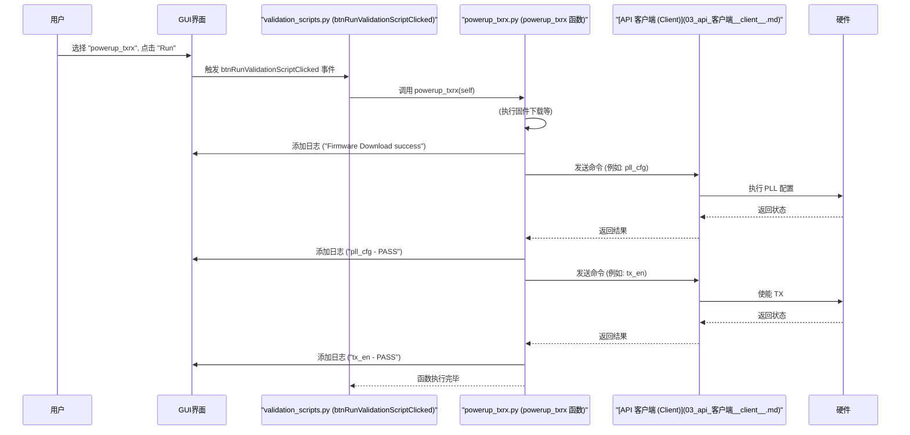

# Chapter 2: 验证脚本框架 (Validation Framework)


在上一章 [第 1 章：SDK GUI 主应用程序 (sdk_main_gui / pythonGUI)](01_sdk_gui_主应用程序__sdk_main_gui___pythongui__.md) 中，我们了解了 SDK 的图形用户界面 (GUI)，它就像我们与硬件交互的“控制面板”。我们学会了如何通过点击按钮和选择菜单来执行一些基本操作，比如读取寄存器值。

但是，想象一下，你需要进行更复杂的测试，比如验证硬件上电后一系列功能是否正常，或者执行一个完整的比特误码率 (BER) 测试。这些测试通常涉及多个步骤，需要按特定顺序执行一系列命令，并检查中间结果。每次都在 GUI 上手动点击几十次来完成这些步骤，既费时又容易出错。有没有一种方法可以把这些常用的测试流程“录制”下来，然后一键运行呢？

答案是肯定的！这就是本章要介绍的 **验证脚本框架 (Validation Framework)**。

**把它想象成一份详细的“体检流程单”。** 去医院体检时，医生不会让你自己一项一项地决定做什么检查，而是会给你一份流程单，上面列好了需要做的所有项目（抽血、测视力、心电图等）以及它们的顺序。你只需要按照流程单走完即可。验证脚本框架就是这样一套预先定义好的“硬件体检流程单”。

**核心用途示例：一键执行硬件上电和基本功能检查**

假设你需要验证硬件是否能正确上电，并让发送器 (TX) 和接收器 (RX) 进入工作状态。这是一个非常常见的操作。使用验证脚本框架，你可以直接在 GUI 中选择一个名为 `powerup_txrx` 的脚本并运行，它会自动完成所有必要的配置和检查步骤，最后告诉你结果是“通过”还是“失败”。

## 什么是验证脚本框架？

验证脚本框架是一套专门用于自动化测试和验证硬件功能的 Python 脚本集合。它就像一个由测试工程师精心编写的测试用例库，包含了针对不同硬件功能模块的自动化测试流程。这些功能可能包括：

*   **上电序列 (Power Up):** 确保硬件各部分按正确顺序启动和初始化。
*   **比特误码率测试 (BER Test):** 测试数据传输的可靠性。
*   **眼图扫描 (Eye Scan):** 分析信号质量。
*   **自动协商 (Autonegotiation):** 测试设备间自动确定通信速率和模式的能力。

这个框架的核心是 `validation_scripts.py` 文件。它扮演着一个“脚本调度员”的角色：

1.  它知道所有可用的测试脚本有哪些。
2.  它将这些脚本的名称提供给 [SDK GUI 主应用程序](01_sdk_gui_主应用程序__sdk_main_gui___pythongui__.md)，让用户可以在界面上看到并选择。
3.  当用户在 GUI 中选择一个脚本并点击“运行”时，`validation_scripts.py` 会调用并执行那个具体的测试脚本文件（例如 `powerup_txrx.py`, `ber_test.py` 等）。

这些具体的测试脚本（比如 `powerup_txrx.py`）则包含了实际的测试逻辑。它们通常会利用我们将在后续章节介绍的核心组件，如 [API 客户端 (Client)](03_api_客户端__client__.md) 或 [原型通信 (prototype_comm)](07_原型通信__prototype_comm__.md)，来向硬件发送命令、读取状态、执行计算，并最终将测试结果（成功、失败、日志信息）报告回 GUI 界面。

### 主要组成部分

```mermaid
graph LR
    A[SDK GUI 主应用程序] -- 用户选择并点击运行 --> B(validation_scripts.py);
    B -- 调用 --> C{powerup_txrx.py};
    B -- 调用 --> D{ber_test.py};
    B -- 调用 --> E{autoneg.py};
    B -- 调用 --> F(...其他测试脚本);
    C -- 使用 --> G([API 客户端 (Client)](03_api_客户端__client__.md));
    D -- 使用 --> G;
    E -- 使用 --> G;
    G -- 与硬件交互 --> H{硬件};
    C -- 报告结果 --> A;
    D -- 报告结果 --> A;
    E -- 报告结果 --> A;

    style B fill:#f9f,stroke:#333,stroke-width:2px
    style G fill:#ccf,stroke:#333,stroke-width:2px
```

1.  **`validation_scripts.py` (脚本调度员):**
    *   维护一个可用验证脚本的列表 (`validation_scripts_list`)。
    *   在 GUI 中填充脚本选择下拉菜单 (`cmbValidationScripts`)。
    *   包含一个处理函数 (`btnRunValidationScriptClicked`)，当用户点击运行时，它会根据下拉菜单的选择，调用相应的测试函数。

2.  **具体测试脚本文件 (例如 `validation/powerup_txrx.py`, `validation/ber_test.py`):**
    *   每个文件通常包含一个或多个函数，代表一个完整的测试流程。
    *   这些函数按顺序执行测试步骤：配置硬件、启动操作、检查状态、收集数据。
    *   使用 `send_api` 辅助函数（内部调用 [API 客户端 (Client)](03_api_客户端__client__.md)）与硬件通信。
    *   将执行过程中的重要信息和最终结果输出到 GUI 的结果列表 (`lstValidationResults`) 中。

3.  **辅助/配置/工作区文件 (例如 `validation/config.py`, `matlab/workarounds.py`):**
    *   `config.py`: 可能包含测试中使用的配置参数（如速率、通道号）。
    *   `workarounds.py`: 可能包含一些针对特定硬件版本或固件的“变通方法”或特定序列，这些方法被主测试脚本调用。

## 如何使用验证脚本框架运行测试？

让我们回到核心示例：运行 `powerup_txrx` 脚本来执行硬件上电和基本功能检查。

1.  **启动 GUI:** 像第一章那样启动 SDK GUI 应用程序。
2.  **导航到验证脚本功能:** 在主窗口中找到标签页区域，点击名为 “Validation” 或类似名称的标签页。
3.  **选择测试脚本:** 你会看到一个下拉菜单（通常名为 `cmbValidationScripts`）。点击它，在列表中找到并选择 `powerup_txrx`。
4.  **运行脚本:** 点击下拉菜单旁边的“运行”(Run) 按钮（通常名为 `btnRunValidationScriptClicked`）。
5.  **观察结果:** 脚本开始执行。你会看到下方的结果列表框（通常名为 `lstValidationResults`）中开始滚动输出信息。这些信息显示了脚本正在执行的步骤以及每个步骤的结果（例如，“Firmware Download success”, “pll_en_poll - PASS”, “tx_en - PASS”）。如果一切顺利，最后会显示一个表示测试成功的消息。如果中间有任何步骤失败，会显示错误信息，脚本可能会提前终止。

就这样，通过几次简单的点击，你就执行了一个包含数十个甚至上百个底层操作的复杂测试流程！

## 验证脚本是如何工作的？（幕后探秘）

当你点击“运行”按钮时，后台发生了什么？让我们以运行 `powerup_txrx` 为例，看看大致的流程：

1.  **用户操作:** 用户在 GUI 的 “Validation” 标签页选择了 `powerup_txrx` 脚本，并点击了 “Run” 按钮。
2.  **GUI 事件触发:** GUI 检测到按钮点击事件，执行与之关联的函数，也就是 `validation_scripts.py` 文件中的 `btnRunValidationScriptClicked` 函数。
3.  **脚本识别与调用:** `btnRunValidationScriptClicked` 函数读取 `cmbValidationScripts` 下拉菜单的当前选项，发现是 "powerup_txrx"。于是，它调用在 `validation/powerup_txrx.py` 文件中定义的 `powerup_txrx()` 函数，并将 GUI 窗口实例 (`self`) 传递给它，以便脚本能将结果写回 GUI。
4.  **测试序列执行 (`powerup_txrx()`):**
    *   `powerup_txrx()` 函数开始执行。它可能首先调用 `download_fw()` (来自 `fw_update.fw_download`) 来下载固件。
    *   然后，它会调用一系列辅助函数或直接调用 `send_api()` (通常在 `powerup_txrx.py` 或 `validation` 目录的其他文件中定义) 来配置 PLL、TX、RX 等。
    *   `send_api()` 函数内部会使用 [API 客户端 (Client)](03_api_客户端__client__.md) 的实例 (`self.ct`)，将具体的 API 命令（如 `pll_cfg`, `tx_cfg`, `rx_en`）发送给硬件。
    *   每执行一步，`powerup_txrx()` 可能会检查 [API 客户端 (Client)](03_api_客户端__client__.md) 返回的结果。
    *   同时，它会使用 `self.lstValidationResults.addItem("...")` 将执行状态（如 "正在配置 TX..." 或 "TX 配置成功"）添加到 GUI 的结果列表中。
5.  **完成与报告:** 所有步骤成功执行完毕后，`powerup_txrx()` 函数结束。用户在 GUI 上看到了完整的执行日志和最终状态。

下面是一个简化的时序图，展示了这个过程：



### 代码一瞥

让我们看一些简化后的代码片段，了解验证脚本框架的实现。

**1. 脚本调度 (`validation_scripts.py`)**

这段代码展示了如何定义可用的脚本列表，以及如何根据用户的选择来调用对应的测试函数。

```python
# 文件: python_env\python_gui\validation\validation_scripts.py (简化示例)
from PyQt5.QtWidgets import qApp # 用于处理 GUI 事件

# 导入具体的测试脚本函数
from validation.powerup_txrx import powerup_txrx
from validation.ber_test import ber_test
from validation.ndes_1d_plot import ndes_1d_plot
# ... 其他脚本导入 ...
from matlab.workarounds import get_ip_reg_dump # 导入辅助函数

# 定义可在 GUI 下拉菜单中显示的脚本名称列表
validation_scripts_list = ["powerup_txrx",
                        "ber_test",
                        "ndes_1d_plot",
                        # "ndes_2d_plot", # 为简洁省略
                        # "autoneg",      # 为简洁省略
                        # ... 其他脚本名称 ...
                        "get_ip_reg_dump"]

# 当 GUI 加载时调用此函数，用于填充下拉菜单
def validation_scripts_load(self):
    print("validation_scripts_load: 正在加载验证脚本列表...")
    self.cmbValidationScripts.addItems(validation_scripts_list) # 将列表项添加到下拉菜单

# 当用户点击 "Run" 按钮时调用此函数
def btnRunValidationScriptClicked(self):
    selected_script = self.cmbValidationScripts.currentText() # 获取用户选择的脚本名称
    if not selected_script: return # 如果没有选择，则不执行任何操作

    print(f"btnRunValidationScriptClicked: 用户选择了运行脚本 '{selected_script}'")
    self.lstValidationResults.clear() # 清空上次的运行结果
    qApp.processEvents() # 刷新 GUI 界面

    # --- 根据选择的脚本名称，调用对应的函数 ---
    if (selected_script == validation_scripts_list[0]): # "powerup_txrx"
        powerup_txrx(self) # 调用 powerup_txrx.py 中的 powerup_txrx 函数
    elif(selected_script == validation_scripts_list[1]): # "ber_test"
        ber_test(self)     # 调用 ber_test.py 中的 ber_test 函数
    elif(selected_script == validation_scripts_list[2]): # "ndes_1d_plot"
        ndes_1d_plot(self) # 调用 ndes_1d_plot.py 中的 ndes_1d_plot 函数
    # ... elif 语句处理其他脚本 ...
    elif(selected_script == validation_scripts_list[-1]): # "get_ip_reg_dump"
        get_ip_reg_dump(self) # 调用 workarounds.py 中的 get_ip_reg_dump 函数

    print(f"脚本 '{selected_script}' 执行完毕。")
```

**解释:** 这个文件是连接 GUI 和具体测试脚本的桥梁。`validation_scripts_list` 定义了用户能看到的所有选项。`btnRunValidationScriptClicked` 函数就像一个电话接线员，根据用户拨打的“分机号”（选择的脚本名称），将电话转接到对应的“部门”（具体的测试函数）。注意 `self` 被传递下去了，这样测试脚本就能更新 GUI 界面。

**2. 具体测试脚本 (`validation/powerup_txrx.py`)**

这是一个简化版的上电测试脚本，展示了其基本结构：按顺序调用 API，并报告结果。

```python
# 文件: python_env\python_gui\validation\powerup_txrx.py (简化示例)
from time import sleep
from PyQt5.QtWidgets import qApp # 用于 GUI 事件处理
from fw_update.fw_download import download_fw # 导入固件下载功能
# from sdk_api.sdk_api_enums import * # 导入可能用到的枚举值
from validation.config import cfg # 导入配置
# from matlab.workarounds import * # 导入可能用到的辅助函数/变通方法

# 一个辅助函数，用于简化 API 调用和结果处理
def send_api(self, sdk_api_direct_call):
    # print(f"  调用 API: {sdk_api_direct_call}") # 调试信息
    # 实际会调用 self.ct.talk(...) 与 Client 通信
    # value = self.ct.talk(sdk_api_direct_call, dbg_en=0)
    # return value
    # --- 简化模拟返回 ---
    # 假设总是成功，返回一个模拟的成功结果列表
    # 格式通常是 [status_code, api_name, "PASS", ...]
    sleep(0.1) # 模拟耗时
    api_name = sdk_api_direct_call.get("params", {}).get("sdk_api", "unknown_api")
    return [0, f"api_{api_name}", "PASS", f"模拟结果：{api_name} 成功"]

# 主要的上电测试函数，由 validation_scripts.py 调用
def powerup_txrx(self, skip_fw_dl=False):
    self.lstValidationResults.addItem("--- 开始执行 powerup_txrx 脚本 ---")
    qApp.processEvents()

    # 步骤 1: 固件下载 (除非跳过)
    if not skip_fw_dl:
        self.lstValidationResults.addItem("正在下载固件...")
        qApp.processEvents()
        if download_fw(self): # 调用固件下载函数
             self.lstValidationResults.addItem("固件下载失败!")
             return -1 # 出错则返回
        self.lstValidationResults.addItem("固件下载成功。")
        qApp.processEvents()
        sleep(0.5) # 等待一会儿

    # 步骤 2: 配置 PLL
    self.lstValidationResults.addItem("正在配置 PLL...")
    qApp.processEvents()
    sdk_api_direct_call = {"fcn": "sdk_api_direct_call", "params": {"sdk_api": "pll_cfg",
                                    "rate": cfg.rate, "width": cfg.width}}
    ret_val = send_api(self, sdk_api_direct_call)
    if (ret_val[2] == 'FAIL'): return -1 # 检查结果
    self.lstValidationResults.addItem(f"{ret_val[1]} - {ret_val[2]}") # 显示 API 名称和结果
    qApp.processEvents()

    # 步骤 3: 配置 TX (发送器)
    self.lstValidationResults.addItem("正在配置 TX...")
    qApp.processEvents()
    sdk_api_direct_call = {"fcn": "sdk_api_direct_call", "params": {"sdk_api": "tx_cfg", "lane_no": cfg.tx_lane_no, "tx_rate": cfg.rate, "master": 1}} # 简化参数
    ret_val = send_api(self, sdk_api_direct_call)
    if (ret_val[2] == 'FAIL'): return -1
    self.lstValidationResults.addItem(f"{ret_val[1]} - {ret_val[2]}")
    qApp.processEvents()

    # 步骤 4: 配置 RX (接收器)
    # ... 类似地调用 rx_cfg ...

    # 步骤 5: 启动 CPU
    # ... 调用 start_cpu ...

    # 步骤 6: 使能 PLL, TX, RX 并检查状态
    # ... 调用 pll_en_start, pll_en_poll, tx_en, rx_en, tx_en_done_status, rx_en_done_status ...
    # ... 每次调用后都使用 send_api 并检查结果 ...

    # (省略了许多中间步骤和变通方法的调用)

    self.lstValidationResults.addItem("--- powerup_txrx 脚本执行完毕 ---")
    qApp.processEvents()
    return 0 # 成功完成
```

**解释:** 这个脚本是实际执行测试的地方。它像一个按部就班的工程师，一步一步地执行操作。`powerup_txrx` 函数是入口点。它调用其他函数（如 `download_fw`）或使用 `send_api` 辅助函数来与硬件交互。`send_api` 函数封装了与 [API 客户端 (Client)](03_api_客户端__client__.md) 的通信细节（这里用模拟代替了实际调用）。脚本通过 `self.lstValidationResults.addItem()` 将进度和结果反馈给用户界面。

**3. 变通方法/辅助函数 (`matlab/workarounds.py`)**

有时，测试脚本需要执行一些非常规的操作或者硬件特定的序列，这些通常放在辅助文件中。

```python
# 文件: python_env\python_gui\matlab\workarounds.py (简化示例)

# 导入与寄存器交互的函数 (可能来自 registers.reg_access 或通过 Client)
# from registers.reg_access import asr, agr, get_pid
# from validation.powerup_txrx import send_api # 或者直接用 Client

FAIL = 'FAIL'
PASS = 'PASS'

# 一个变通方法的例子：强制使能 TX 数据路径
def tx_data_enable_workaround(self, lane_num):
    print(f"  执行变通方法: tx_data_enable_workaround for lane {lane_num}")
    # ipid = get_pid(self.ct, "IP") # 获取硬件部分的 ID

    # 假设需要设置两个寄存器字段
    # ret_val1 = asr(self.ct, ipid, f"PMD_TX{lane_num}.PMD_TX_OVRDVAL_0.TXX_DATA_EN_I", 1)
    # ret_val2 = asr(self.ct, ipid, f"PMD_TX{lane_num}.PMD_TX_OVRDEN_0.OVRD_EN_TXX_DATA_EN_I", 1)

    # --- 简化模拟 ---
    # 使用 send_api 模拟寄存器写操作
    call1 = {"fcn": "api_write_register", "params": {"name": f"PMD_TX{lane_num}.TXX_DATA_EN_I", "value": 1}}
    ret_val1 = send_api(self, {"fcn":"sdk_api_direct_call", "params":{"sdk_api":"write_register_mock", **call1['params']}}) # 模拟调用
    call2 = {"fcn": "api_write_register", "params": {"name": f"PMD_TX{lane_num}.OVRD_EN_TXX_DATA_EN_I", "value": 1}}
    ret_val2 = send_api(self, {"fcn":"sdk_api_direct_call", "params":{"sdk_api":"write_register_mock", **call2['params']}}) # 模拟调用

    if (ret_val1[2] != 'PASS' or ret_val2[2] != 'PASS'):
        print("    变通方法失败!")
        return FAIL # 如果任一写入失败，则返回失败

    print("    变通方法成功!")
    return PASS # 成功返回
```

**解释:** 这个文件包含了一些可能被多个测试脚本调用的辅助函数或特定硬件的解决方法 (`workarounds`)。这里的 `tx_data_enable_workaround` 函数就是一个例子，它可能需要直接操作某些寄存器（通过 `asr` 或 `send_api` 模拟的 `api_write_register`）来达到特定目的。主测试脚本（如 `powerup_txrx.py`）会在需要时调用这些函数。

## 总结

在本章中，我们探索了 `python_sdk` 的验证脚本框架：

*   我们了解到，这个框架提供了一种**自动化执行复杂硬件测试流程**的方法，解决了手动操作 GUI 繁琐易错的问题。
*   它由一个**脚本调度员 (`validation_scripts.py`)** 和一系列**具体的测试脚本 (`powerup_txrx.py`, `ber_test.py` 等)** 组成。
*   用户可以通过 GUI 轻松选择并运行这些预定义的测试脚本。
*   测试脚本在后台按顺序执行一系列操作，通常利用 [API 客户端 (Client)](03_api_客户端__client__.md) 与硬件交互，并将结果反馈到 GUI。
*   我们通过 `powerup_txrx` 的例子，了解了如何使用框架以及其内部的基本工作流程和代码结构。

验证脚本框架是进行自动化硬件验证和测试的强大工具。

**下一章展望:**

我们已经看到，无论是 GUI 的手动操作（第一章）还是验证脚本的自动化执行（本章），最终都需要一个组件来实际与硬件进行通信。这个核心组件就是 [API 客户端 (Client)](03_api_客户端__client__.md)。在下一章中，我们将深入了解这个客户端是如何工作的。请继续阅读 [第 3 章：API 客户端 (Client)](03_api_客户端__client__.md)。

---

Generated by [AI Codebase Knowledge Builder](https://github.com/The-Pocket/Tutorial-Codebase-Knowledge)