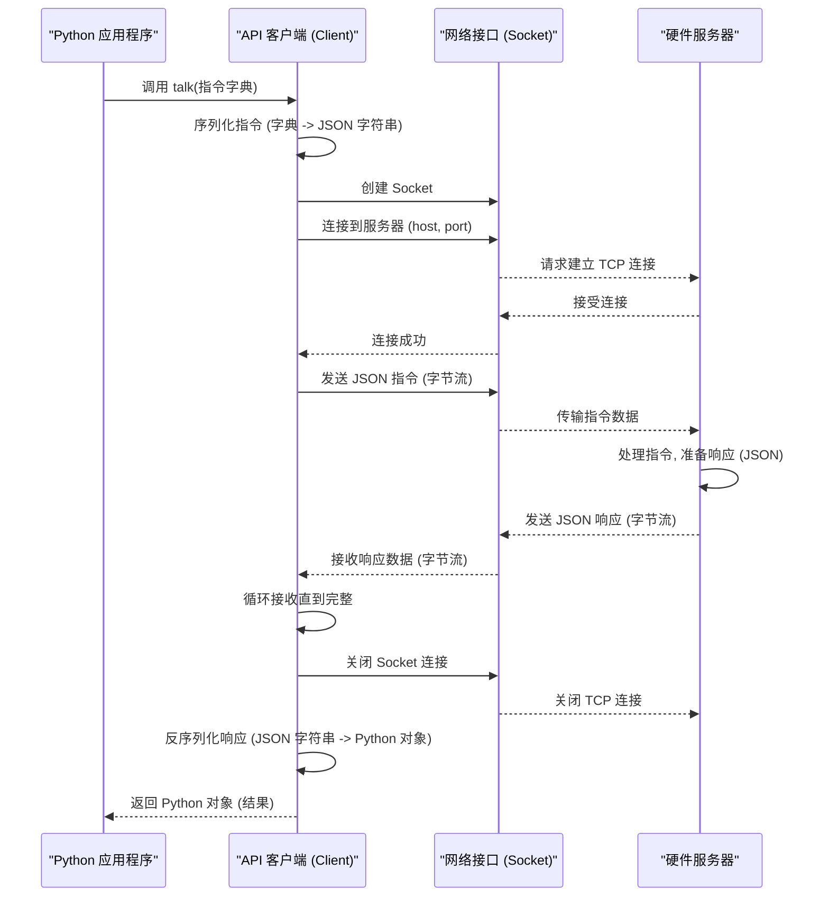

# Chapter 3: API 客户端 (Client)


欢迎来到我们 `python_sdk` 教程的第三章！在 [第 2 章：验证脚本框架 (Validation Framework)](02_验证脚本框架__validation_framework__.md) 中，我们学习了如何使用预定义的脚本来自动化复杂的硬件测试流程。无论是通过 [第 1 章：SDK GUI 主应用程序](01_sdk_gui_主应用程序__sdk_main_gui___pythongui__.md) 手动操作，还是通过验证脚本自动执行，它们最终都需要一种方式来与硬件（或其模拟服务器）进行对话。

想象一下，你的 Python 应用程序（比如 GUI 或验证脚本）需要给远端的硬件发送指令，比如“读取寄存器 X 的值”或者“配置发送器 Y”。这个过程就像是你要给另一个人打电话传达信息。你需要知道对方的电话号码（IP 地址和端口号），拨号建立连接，用双方都能理解的语言（数据格式，如 JSON）说话，听取对方的回复，然后挂断电话。如果每次发送指令都要手动处理这些网络连接和数据格式转换的细节，那将非常繁琐且容易出错。

这就是 **API 客户端 (Client)** 发挥作用的地方。它扮演着 **电话接线员** 的角色，专门负责处理你的应用程序和硬件服务器之间的所有通信细节。

**核心用途示例：从 Python 脚本发送读取寄存器的指令**

假设你正在编写一个简单的 Python 脚本，需要直接查询硬件上某个寄存器的值。你不想通过 GUI 操作，也不想运行完整的验证脚本，只想快速地发送一个读取命令并获取结果。API 客户端就是帮你完成这个任务的工具。

## 什么是 API 客户端 (Client)？

API 客户端 (`Client` 类，通常在 `client.py` 文件中定义) 是 `python_sdk` 中负责管理网络通信的核心组件。它的主要职责是：

1.  **连接管理:** 知道硬件服务器的地址（IP 地址）和“门牌号”（端口号），并在需要时建立网络连接。
2.  **消息封装:** 将应用程序想要发送的指令（通常是一个 Python 字典）转换成适合网络传输的格式（通常是 JSON 字符串）。
3.  **发送与接收:** 将封装好的消息通过网络发送给服务器，并等待服务器返回结果。
4.  **消息解析:** 将从服务器接收到的网络数据（JSON 字符串）转换回 Python 应用程序可以理解的格式（通常是 Python 字典或列表）。

它就像一个专业的信使，你只需要告诉它要把什么信（指令）送到哪里（服务器地址），以及取回什么回信（结果），而不需要关心信使是如何选择路线、交通工具或者如何打包信件的。

### 主要工作流程

```mermaid
graph TD
    A[Python 应用程序 (GUI/脚本)] -- 想要发送指令 --> B(API 客户端);
    B -- 知道服务器地址 --> C(网络);
    B -- 1. 建立连接 --> C;
    B -- 2. 格式化指令 (转为 JSON) --> C;
    B -- 3. 发送指令 --> C;
    C -- 指令 --> D{硬件服务器};
    D -- 处理指令 --> D;
    D -- 准备响应 (JSON) --> C;
    C -- 响应 --> B;
    B -- 4. 接收响应 --> C;
    B -- 5. 解析响应 (JSON 转 Python 对象) --> A;
    B -- 6. 关闭连接 --> C;
    A -- 收到结果 --> A;

    style B fill:#ccf,stroke:#333,stroke-width:2px
    style D fill:#f9f,stroke:#333,stroke-width:2px
```

这个客户端使得 SDK 的其他部分（如 [GUI](01_sdk_gui_主应用程序__sdk_main_gui___pythongui__.md) 或 [验证脚本](02_验证脚本框架__validation_framework__.md)）可以专注于 *业务逻辑*（要发送什么指令，如何处理结果），而将底层的 *网络通信* 细节完全交给客户端处理。

## 如何使用 API 客户端发送指令？

让我们回到核心示例：使用 API 客户端从一个简单的 Python 脚本中读取寄存器值。

1.  **导入 `Client` 类:**
    首先，你需要在你的 Python 脚本中导入 `Client` 类。

    ```python
    # 导入 Client 类
    # 注意：实际路径可能根据你的项目结构有所不同
    # 可能来自 'api_client.client' 或 'sdk_api.client'
    from api_client.client import Client
    ```
    **解释:** 这行代码告诉 Python：“嘿，我要使用那个叫做 `Client` 的工具，它在 `api_client/client.py` 文件里。”

2.  **创建客户端实例:**
    你需要创建一个 `Client` 类的实例，并告诉它硬件服务器的 IP 地址和端口号。如果服务器就在你的本地计算机上运行，IP 地址通常是 `'localhost'`。端口号需要与服务器监听的端口一致（例如，代码中常见的 `7878` 或 `27015`）。

    ```python
    # 创建 Client 实例，指定服务器运行的主机和端口
    # 假设服务器在本地运行，端口是 27015
    ct = Client(host='localhost', port=27015)
    # 在 sdk_callbacks.py 中可能是这样获取实例:
    # self.client = Client(port=int(self.config_page_int.port_number_field.text()))
    ```
    **解释:** 这就像是拿起电话，拨打了接线员的总机号码（端口号 `27015`），并告诉接线员你要联系的是本地线路 (`'localhost'`)。`ct` 现在就是你和接线员沟通的“电话听筒”。

3.  **准备指令:**
    你需要将你的请求（比如“读取寄存器 `PLL_STATUS`”）构造成一个特定格式的 Python 字典。这个格式是服务器能理解的。通常，它会包含一个表示要执行哪个 API 函数的键（如 `"fcn"`）和一个包含具体参数的键（如 `"params"`）。

    ```python
    # 准备要发送的指令字典
    # 假设有一个 API 函数叫 'api_reg_read_ip' 用于读取 IP 寄存器
    # 参数是寄存器的地址 (这里用一个示例地址 0x100)
    read_command = {
        "fcn": "api_reg_read_ip",
        "params": {"address": 0x100}
    }
    # 在验证脚本 (如 powerup_txrx.py) 中可能这样构造：
    # sdk_api_direct_call = {"fcn": "sdk_api_direct_call", "params": {"sdk_api": "pll_cfg", ...}}
    ```
    **解释:** 这就像是你在纸上写下了你的请求：“请帮我调用‘读取 IP 寄存器’功能，目标地址是 0x100”。这个字典就是这张“指令便签”。

4.  **发送指令并接收响应:**
    使用客户端实例的 `talk()` 方法发送指令字典。这个方法会处理所有网络通信，并将服务器返回的结果（通常也是一个字典或列表）返回给你。

    ```python
    # 使用 talk() 方法发送指令并获取响应
    try:
        response = ct.talk(read_command)
        # 打印从服务器收到的响应
        print("服务器响应:", response)
        # 你可以从 response 中提取你需要的信息
        # 例如，假设响应格式为 [status, api_name, result, msg, addr, value]
        # register_value = response[5] # 提取寄存器值 (根据实际响应格式)
        # print("读取到的寄存器值:", register_value)
    except Exception as e:
        print(f"通信时发生错误: {e}")
    ```
    **解释:** 你把写好的“指令便签”（`read_command`）通过“电话听筒” (`ct`) 的 `talk()` 方法交给了接线员。接线员会完成与对方（服务器）的通话，并将对方的回复（`response`）告诉你。如果中间出了问题（比如电话线断了），`try...except` 能帮你捕获错误。

通过这简单的四步，你就使用 API 客户端成功地与硬件服务器进行了一次通信，发送了指令并获取了结果，而完全不用关心底层的网络细节。

## API 客户端是如何工作的？（幕后探秘）

当你调用 `ct.talk(read_command)` 时，客户端内部发生了什么？

1.  **序列化指令:** `talk()` 方法首先接收到你的 Python 字典 `read_command`。它使用 `json.dumps()` 函数将这个字典转换成 JSON 格式的字符串。JSON 是一种轻量级的数据交换格式，非常适合在网络上传输。
    ```python
    # 内部操作示例 (简化自 client.py 的 talk 方法)
    send_message_str = json.dumps(read_command) # {'fcn': 'api_reg_read_ip', 'params': {'address': 256}} -> '{"fcn": "api_reg_read_ip", "params": {"address": 256}}'
    ```
2.  **建立网络连接:** 客户端使用 Python 的 `socket` 库来创建一个网络连接。它使用你在创建 `Client` 实例时提供的 `host` 和 `port`，尝试连接到正在监听的硬件服务器。
    ```python
    # 内部操作示例 (简化自 client.py 的 talk 方法)
    # 创建一个 socket 对象
    client_socket = socket.socket(socket.AF_INET, socket.SOCK_STREAM)
    # 尝试连接到服务器
    client_socket.connect((self.host, self.port)) # ('localhost', 27015)
    ```
3.  **发送数据:** 连接建立后，客户端将 JSON 字符串转换成字节流 (`bytes`)，并通过 `socket` 发送给服务器。
    ```python
    # 内部操作示例 (简化自 client.py 的 talk 方法)
    byte_message_to_send = bytes(send_message_str, 'utf-8') # 转换成 UTF-8 编码的字节
    client_socket.sendall(byte_message_to_send) # 发送数据
    ```
4.  **等待并接收响应:** 客户端会等待服务器处理请求并发送回响应。它使用 `socket` 的 `recv()` 方法接收来自服务器的数据。服务器通常也会发送 JSON 格式的响应。响应可能很大，所以会循环接收直到所有数据都收到。
    ```python
    # 内部操作示例 (简化自 client.py 的 talk 方法)
    raw_data_list = []
    while True:
        chunk = client_socket.recv(4096) # 一次最多接收 4096 字节
        if not chunk: break # 如果没有数据了，退出循环
        raw_data_list.append(chunk.decode('utf-8')) # 将字节解码成字符串并添加到列表
    raw_data = ''.join(raw_data_list) # 拼接所有接收到的字符串
    ```
5.  **关闭连接:** 收到完整的响应后（或者发生错误时），客户端会关闭这个网络连接。这是一种“非持久连接”策略，每次 `talk()` 调用都会建立和关闭连接，以避免长时间占用网络资源或导致连接锁死。
    ```python
    # 内部操作示例 (简化自 client.py 的 talk 方法)
    # 使用 'with' 语句可以确保 socket 在退出时自动关闭
    # with socket.socket(...) as client_socket:
    #     ... # 连接、发送、接收
    # # 离开 'with' 代码块后，socket 自动关闭
    ```
6.  **反序列化响应:** 客户端将接收到的原始 JSON 字符串 (`raw_data`) 使用 `json.loads()` 函数转换回 Python 对象（通常是字典或列表）。
    ```python
    # 内部操作示例 (简化自 client.py 的 manage_return 方法)
    structured_data = json.loads(raw_data) # '[-1, "api_reg_read_ip", "FAIL", ...]' -> [-1, 'api_reg_read_ip', 'FAIL', ...]
    ```
7.  **返回结果:** 最后，`talk()` 方法将这个解析后的 Python 对象返回给调用它的应用程序代码。

下面是一个简化的时序图，展示了这个过程：



### 代码一瞥 (`client.py`)

让我们看一下 `api_client/client.py` 文件中 `Client` 类的关键部分（简化版）。

```python
# 文件: python_env\api_client\client.py (简化示例)
import json
import socket
from functools import partial # 用于 socket 接收

class Client():
    """
    管理 Python 应用与硬件服务器通信的客户端类。
    """
    def __init__(self, host: str = 'localhost', port: int = 7878):
        """
        初始化客户端，保存服务器的 IP 地址和端口号。
        :param host: 服务器的 IP 地址 (例如 'localhost' 或 '192.168.1.100')。
        :param port: 服务器监听的端口号 (例如 7878)。
        """
        self.host = host
        self.port = port
        print(f"客户端已初始化，准备连接到 {host}:{port}")

    def talk(self, send_message, debug=0):
        """
        连接服务器，发送消息，接收响应，然后断开连接。
        :param send_message: 要发送的指令 (通常是字典)。
        :param debug: 是否打印调试信息 (0 或 1)。
        :return: 服务器返回的数据 (通常是字典或列表)，或发生连接错误时返回异常。
        """
        # 1. 序列化指令 (Python 字典 -> JSON 字符串)
        # （如果 send_message 是 'exit' 字符串，则直接发送）
        if isinstance(send_message, dict):
            send_message_str = json.dumps(send_message)
            if debug == 1:
                print("发送的 JSON:", send_message_str)
        else:
            send_message_str = str(send_message) # 允许发送非字典消息，如 'exit'

        # 2. 建立连接、发送、接收、关闭 (使用 'with' 自动管理关闭)
        try:
            # 使用 'with' 语句确保 socket 会被正确关闭
            with socket.socket(socket.AF_INET, socket.SOCK_STREAM) as client_socket:
                # 设置超时 (可选，例如 5 秒)
                # client_socket.settimeout(5)
                # 2a. 连接服务器
                print(f"正在连接 {self.host}:{self.port}...")
                client_socket.connect((self.host, self.port))
                print("连接成功!")

                # 3. 发送数据 (JSON 字符串 -> 字节流)
                byte_message_to_send = bytes(send_message_str, 'utf-8')
                client_socket.sendall(byte_message_to_send)
                print("指令已发送。")

                # ---- 服务器正在处理请求 ---- #

                # 4. 接收响应 (字节流 -> 字符串)
                print("正在等待服务器响应...")
                raw_data_list = []
                # 使用 iter 和 partial 持续接收数据，直到连接关闭
                for data in iter(partial(client_socket.recv, 4096), b''):
                    raw_data_list.append(data.decode('utf-8'))
                raw_data = ''.join(raw_data_list)
                print("收到原始响应:", raw_data)

            # 5. ('with' 语句结束时，连接已自动关闭)

            # 6. 反序列化响应 (JSON 字符串 -> Python 对象)
            return_data = self.manage_return(raw_data)

            # 7. 返回结果
            return return_data

        except socket.timeout:
            print("错误：连接超时！")
            raise ConnectionError(f"连接 {self.host}:{self.port} 超时")
        except ConnectionRefusedError:
            print("错误：连接被拒绝！服务器可能未运行或端口错误。")
            raise ConnectionError(f"无法连接到 {self.host}:{self.port}，连接被拒绝")
        except Exception as e:
            print(f"通信时发生未知错误: {e}")
            raise e # 重新抛出异常

    def manage_return(self, raw_data):
        '''
        解析收到的 JSON 数据。如果 JSON 无效，会引发异常。
        （实际代码中可能包含更复杂的错误检查）
        :param raw_data: 从服务器收到的原始字符串数据。
        :return: 解析后的 Python 对象 (字典或列表)。
        '''
        try:
            structured_data = json.loads(raw_data)
            # print("解析后的响应:", structured_data) # 调试时可以取消注释
            return structured_data
        except json.JSONDecodeError as e:
            print(f"错误：无法解析服务器响应 '{raw_data[:100]}...' 为 JSON: {e}")
            raise ValueError(f"服务器响应不是有效的 JSON: {e}")


# 示例用法 (通常这个 if __name__ == "__main__": 部分用于测试或命令行接口)
if __name__ == "__main__":
    # 创建一个连接到端口 27015 的客户端
    ct_test = Client(port=27015)

    # 准备一个模拟的读取寄存器命令
    test_command = {"fcn": "api_reg_read_ip", "params": {"address": 0x100}}

    print("\n--- 开始测试通信 ---")
    try:
        # 发送命令并获取响应
        response_data = ct_test.talk(test_command, debug=1)
        print("\n--- 通信成功 ---")
        print("最终收到的 Python 对象:", response_data)
    except Exception as err:
        print(f"\n--- 通信失败 ---")
        print(f"测试过程中捕获到错误: {err}")

```

**解释:** 这段代码展示了 `Client` 类的核心逻辑。`__init__` 存储服务器地址。`talk` 是主要方法，它按顺序执行：序列化、连接、发送、接收、关闭、反序列化，并处理了常见的网络错误（超时、连接拒绝）。`manage_return` 负责将收到的 JSON 文本转回 Python 能用的数据结构。

### 其他模块如何使用客户端

你在 SDK 的其他地方会看到这个 `Client` 被使用。例如：

*   **GUI 回调 (`sdk_gui/sdk_callbacks.py`):** 当你在 GUI 点击按钮时，触发的回调函数（比如 `phy_config` 或 `dump_registers_val`）会获取 `Client` 实例（通常是 `self.client`），准备好命令字典，然后调用 `self.client.talk(command)` 来发送。

    ```python
    # 文件: sdk_gui\sdk_callbacks.py (片段示例)
    # ... 省略其他代码 ...
    def phy_config(self):
        # ... 准备参数 ...
        load_preamble = {"fcn": "api_load_preamble", "params": self.preamble_params}
        # 使用客户端发送命令
        server_msg = self.client.talk(load_preamble, self.debug)
        # ... 处理响应 ...

    def dump_registers_val(self):
        # ...
        set_group = {"fcn": "api_set_group", "params": {"group_id": 0}}
        # 使用客户端发送命令
        self.client.talk(set_group, self.debug)
        # ...
    ```

*   **验证脚本 (`validation/*.py`):** 验证脚本中的辅助函数，如 `send_api` (定义在 `powerup_txrx.py` 或 `send_api.py` 中)，内部也是调用 `self.ct.talk()` 或 `self.client.talk()`。

    ```python
    # 文件: python_env\python_gui\validation\powerup_txrx.py (片段示例)
    def send_api(self, sdk_api_direct_call):
        # 内部调用 Client 的 talk 方法
        value = self.ct.talk(sdk_api_direct_call, dbg_en=0)
        return value
    ```

*   **驱动包装器/原型通信 (`prototype_com/comms.py`):** 像 `wrapper_driver_E112MP` 这样的类，它可能自己创建一个 `Client` 实例 (`self.c`)，或者从外部接收一个实例，然后在它的 `readreg` 和 `writereg` 方法内部调用 `self.c.talk()` 来执行底层的寄存器读写 API。

    ```python
    # 文件: python_env\api_client\UREFE\common\prototype_com\comms.py (片段示例)
    class wrapper_driver_E112MP():
        def __init__(self,ft,pid):
            # ...
            # 这个包装器自己创建了一个 Client 实例
            self.c = Client(port=27015)

        def readreg(self, address):
            # 调用内部的 read 方法
            res = wrapper_driver_E112MP.read(self.c, self.pid, address)
            return res

        @staticmethod # read 和 write 定义为静态方法，接收 Client 实例 c
        def read(c, pid, address):
            # ...
            if pid == 1:
                # ...
                reg_read_ip = {"fcn": "api_reg_read_ip", "params": {"address": address}}
                # 使用传入的 Client 实例 c 进行通信
                res = c.talk(reg_read_ip, debug=0)
            # ...
            return res[5] # 假设结果在响应的第 6 个元素
    ```

这些例子都说明了 API 客户端是 SDK 中进行实际硬件（服务器）通信的标准接口。

## 总结

在本章中，我们深入了解了 `python_sdk` 的通信核心——API 客户端 (Client)：

*   我们理解了它的**核心作用**：像一个电话接线员，负责处理应用程序与硬件服务器之间的所有网络通信细节（连接、数据格式转换、发送/接收）。
*   它**解决了什么问题**：避免了在应用程序代码中直接处理复杂的网络编程，让开发者可以专注于业务逻辑。
*   我们学习了**如何使用**它：导入 `Client` 类，创建实例（指定服务器地址和端口），准备指令字典，调用 `talk()` 方法发送并接收结果。
*   我们探究了它的**工作原理**：通过 `socket` 建立 TCP 连接，使用 JSON 进行数据序列化/反序列化，以及采用非持久连接的方式进行通信。
*   我们看到了 SDK 中**其他组件**（如 GUI 回调、验证脚本、驱动包装器）是如何依赖 API 客户端来完成与硬件服务器的交互。

API 客户端是连接软件逻辑和硬件操作的桥梁，理解它对于掌握整个 SDK至关重要。

**下一章展望:**

我们现在知道了如何通过 API 客户端发送指令。但是，这些指令通常需要配置参数（比如速率、模式、通道号等）。这些配置信息从哪里来？如何在不同的测试和场景中管理这些配置？下一章，我们将探讨 SDK 如何处理这些设置。请继续阅读 [第 4 章：配置管理 (Configuration Management)](04_配置管理__configuration_management__.md)。

---

Generated by [AI Codebase Knowledge Builder](https://github.com/The-Pocket/Tutorial-Codebase-Knowledge)