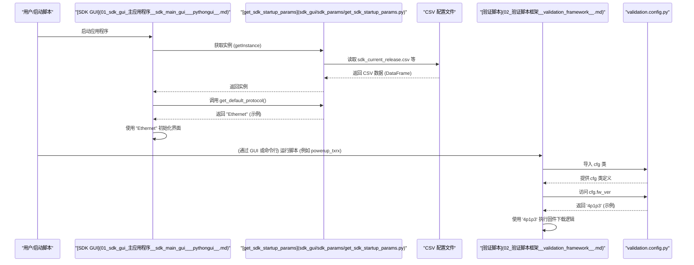

# Chapter 4: 配置管理 (Configuration Management)


欢迎来到 `python_sdk` 教程的第四章！在 [第 3 章：API 客户端 (Client)](03_api_客户端__client__.md) 中，我们了解了 SDK 如何通过 API 客户端与硬件服务器进行通信，发送指令并接收响应。我们知道了，无论是 [GUI 手动操作](01_sdk_gui_主应用程序__sdk_main_gui___pythongui__.md) 还是 [自动化验证脚本](02_验证脚本框架__validation_framework__.md)，最终都需要通过这个客户端来“对话”。

但是，想一想，当这些指令（比如“配置发送器”或“运行 BER 测试”）被发送时，它们通常需要伴随一些具体的参数。例如，“配置发送器”需要知道使用哪个数据速率，“运行 BER 测试”需要知道测试的目标误码率是多少，或者硬件上电时应该加载哪个版本的固件。如果每次运行测试或启动 GUI 时，我们都必须手动输入所有这些参数，那会非常麻烦，而且容易出错。更重要的是，如果我们需要针对不同的硬件版本或测试场景使用不同的设置，该如何管理呢？

这就是 **配置管理 (Configuration Management)** 要解决的问题。

**把它想象成一个应用程序的“设置”菜单或者一个游戏的“选项”面板。** 你不需要在程序的代码里到处寻找和修改参数，而是在一个集中的地方（或者几个相关的地方）定义好所有的设置项。当程序需要知道某个设置时，它就去这个“设置中心”查找。

**核心用途示例：验证脚本如何知道要加载哪个固件版本？**

假设我们的 [验证脚本框架](02_验证脚本框架__validation_framework__.md) 中的 `powerup_txrx` 脚本在启动时需要下载固件。脚本是如何知道应该下载哪个版本的固件文件呢？它总不能每次都弹窗问用户吧？配置管理就是让脚本能够自动找到预先定义好的固件版本信息。

## 什么是配置管理？

配置管理是 `python_sdk` 中负责处理所有测试和硬件操作所需参数（如固件版本、时钟频率、数据速率、寄存器默认值、测试参数等）的一套机制。它的核心思想是 **将配置信息与执行逻辑（代码）分离开来**。这样做的好处是：

1.  **易于修改:** 当需要更改设置（比如更新固件版本或调整测试速率）时，只需要修改配置文件，而不需要改动核心的 Python 代码。
2.  **提高可读性:** 代码逻辑更清晰，因为它专注于“做什么”，而不是被各种具体的数值参数淹没。
3.  **便于管理不同场景:** 可以为不同的硬件、项目或测试条件维护不同的配置集。

在 `python_sdk` 中，配置管理主要通过以下几个文件实现：

1.  **`validation/config.py`:** 这个文件就像一个**“快速设置面板”**。它通常用 Python 代码直接定义了一些在验证脚本中最常用的、相对静态的配置参数。比如默认的固件版本、默认的数据速率和位宽、一些测试用的特定参数（如 PRBS 模式）等。验证脚本会直接导入这个文件来获取这些常用设置。

2.  **`sdk_params/get_sdk_startup_params.py` 和相关的 CSV 文件:** 这部分更像是**“高级设置”或“外部档案库”**。`get_sdk_startup_params.py` 模块负责从多个逗号分隔值 (CSV) 文件中读取更详细的启动参数和协议相关的默认设置。这些 CSV 文件（例如 `sdk_protocol_defaults_*.csv`, `sdk_startup_params_*.csv`, `sdk_gui_params_*.csv`）允许更灵活地管理不同项目 (IP Name) 的配置，并且可以让非程序员（比如硬件工程师）更容易地通过编辑表格来修改配置。这些参数通常在 GUI 启动时加载，用于填充下拉菜单的默认选项、设置初始状态等。

```mermaid
graph TD
    subgraph "配置来源"
        A[validation/config.py] --> B{常用验证参数 (硬编码)};
        C[sdk_params/*.csv 文件] --> D(详细启动/协议参数);
    end

    subgraph "使用者"
        E([验证脚本框架](02_验证脚本框架__validation_framework__.md)) -- 主要使用 --> A;
        F([SDK GUI 主应用程序](01_sdk_gui_主应用程序__sdk_main_gui___pythongui__.md)) -- 主要使用 --> G([get_sdk_startup_params.py](sdk_gui/sdk_params/get_sdk_startup_params.py));
        G -- 读取 --> C;
        H([API 客户端 (Client)](03_api_客户端__client__.md)) -- 间接使用 (通过脚本/GUI) --> B & D;
    end

    style A fill:#lightgrey,stroke:#333
    style C fill:#lightgrey,stroke:#333
    style G fill:#ccf,stroke:#333,stroke-width:2px
```

## 如何使用配置管理（解决我们的示例）？

让我们回到核心示例：`powerup_txrx` 脚本如何知道要加载哪个固件版本？

**场景 1: 使用 `validation/config.py`**

最常见的情况是，固件版本作为一个常用的验证参数，被定义在 `validation/config.py` 文件中。

1.  **定义配置:**
    打开 `python_env/python_gui/validation/config.py` 文件，你会看到类似这样的代码：

    ```python
    # 文件: python_env\python_gui\validation\config.py (简化示例)
    from sdk_api.sdk_api_enums import * # 导入可能需要的枚举值

    class cfg:
        # 定义固件版本字符串
        fw_ver = '4p1p3' # <--- 在这里定义了固件版本!

        # 定义默认 CPU 时钟频率 (单位: 10 MHz)
        cpu_clk_freq_10_mhz = 5

        # 定义默认数据速率和位宽 (使用枚举值)
        rate = ipname_txX_rxX_rate.IPNAME_ETH_212P5G.value
        width = ipname_txX_rxX_width.IPNAME_WIDTH_160_BIT.value

        # 其他测试参数...
        tc_pat_sel = 'prbs13' # 测试码型选择
        rx_pat_sel = 3        # 接收端码型选择 (需匹配)
        tx_lane_no = 1        # 发送通道号
        rx_lane_no = 1        # 接收通道号
    ```
    **解释:** 这个文件里定义了一个名为 `cfg` 的类，它就像一个配置参数的容器。里面直接用变量赋值的方式定义了各种参数，比如 `fw_ver` 被设置成了 `'4p1p3'`。

2.  **在脚本中使用配置:**
    然后，在 `powerup_txrx.py` 脚本中，会导入这个 `cfg` 类，并直接访问需要的参数。

    ```python
    # 文件: python_env\python_gui\validation\powerup_txrx.py (简化示例)
    from fw_update.fw_download import download_fw # 导入固件下载功能
    from validation.config import cfg # <--- 导入配置类!

    # 主要的上电测试函数
    def powerup_txrx(self, skip_fw_dl=False):
        # ... 其他代码 ...

        # 检查是否需要下载固件
        if not skip_fw_dl:
            self.lstValidationResults.addItem(f"正在下载固件版本: {cfg.fw_ver}") # <--- 使用 cfg.fw_ver
            # 调用下载函数时，可能会将 cfg.fw_ver 作为参数传入，
            # 或者 download_fw 函数内部自己也会导入 cfg 来获取版本号。
            if download_fw(self): # 假设 download_fw 内部会使用 cfg.fw_ver
                 self.lstValidationResults.addItem("固件下载失败!")
                 return -1
            self.lstValidationResults.addItem("固件下载成功。")
            # ...
        # ... 后续步骤使用其他配置参数 ...
        sdk_api_direct_call = {"fcn": "sdk_api_direct_call", "params": {"sdk_api": "pll_cfg",
                                        "rate": cfg.rate, "width": cfg.width}} # <--- 使用 cfg.rate 和 cfg.width
        # ...
    ```
    **解释:** 脚本通过 `from validation.config import cfg` 引入了配置。然后，当需要固件版本时，直接使用 `cfg.fw_ver` 就可以得到在 `config.py` 中定义的值 `'4p1p3'`。同样地，配置 PLL 时使用了 `cfg.rate` 和 `cfg.width`。

**场景 2: 使用 `get_sdk_startup_params.py` 和 CSV 文件**

假设 GUI 启动时需要根据当前选定的项目 (IP Name) 来决定默认的协议是什么。这个信息可能存储在 CSV 文件中。

1.  **定义配置 (CSV 文件):**
    可能有一个名为 `sdk_current_release.csv` 的文件，内容类似：

    ```csv
    product,default_protocol,project,ip_name
    MyProduct,Ethernet,ProjectA;ProjectB,IPCoreA;IPCoreB
    ```
    还有一个 `sdk_protocol_defaults_IPCoreA.csv` 文件：

    ```csv
    protocol,default_rate,default_width
    Ethernet,10G,32
    PCIE,8G,16
    ```
    **解释:** CSV 文件就像电子表格，用逗号分隔数据。第一行是列名。`sdk_current_release.csv` 定义了产品的默认协议和支持的项目/IP。`sdk_protocol_defaults_IPCoreA.csv` 定义了 IPCoreA 这个项目下不同协议的默认速率和位宽。

2.  **加载配置 (`get_sdk_startup_params.py`):**
    `get_sdk_startup_params.py` 文件中的类会负责读取这些 CSV 文件。它通常使用 `pandas` 库来方便地处理 CSV 数据。

    ```python
    # 文件: sdk_gui\sdk_params\get_sdk_startup_params.py (简化概念示例)
    import pandas as pd
    from sdk_params.get_sdk_default_mapping import get_sdk_default_mapping # 用于读取文件的辅助类
    from sdk_sub.sdk_config import sdk_gui_config # 用于查找文件路径

    class get_sdk_startup_params:
        # ... (Singleton pattern 实现代码省略) ...
        __instance = None
        @staticmethod
        def getInstance():
           if get_sdk_startup_params.__instance == None: get_sdk_startup_params()
           return get_sdk_startup_params.__instance

        def __init__(self):
           if get_sdk_startup_params.__instance != None: raise Exception("单例类!")
           else: get_sdk_startup_params.__instance = self
           self.sdk_csv_mapping = get_sdk_default_mapping.getInstance()
           self.gui_cfg = sdk_gui_config.getInstance()
           # 加载当前发布信息
           self.current_release = self._load_csv("sdk_current_release.csv")
           # 可能还有加载其他文件的逻辑...

        def _load_csv(self, filename):
            """辅助方法：加载 CSV 文件"""
            try:
                file_path = self.gui_cfg.find_file_path(filename) # 找到文件路径
                df = self.sdk_csv_mapping.parse_file(file_path) # 使用辅助类读取
                df.columns = df.columns.str.lower() # 列名转小写
                return df
            except Exception as e:
                print(f"错误：加载 {filename} 失败: {e}")
                return pd.DataFrame() # 返回空的 DataFrame

        def get_default_protocol(self):
            """获取默认协议"""
            if not self.current_release.empty:
                return self.current_release['default_protocol'][0]
            return "Unknown" # 默认值

        def load_project_specific_defaults(self, ip_name):
            """加载特定项目的协议默认值"""
            filename = f"sdk_protocol_defaults_{ip_name}.csv"
            self.protocol_defaults_df = self._load_csv(filename)

        def get_protocol_default_rate(self, protocol):
            """获取指定协议的默认速率"""
            if hasattr(self, 'protocol_defaults_df') and not self.protocol_defaults_df.empty:
                match = self.protocol_defaults_df[self.protocol_defaults_df['protocol'].str.lower() == protocol.lower()]
                if not match.empty:
                    return match['default_rate'].iloc[0]
            return "N/A" # 默认值
    ```
    **解释:** 这个类使用 `pandas` 读取 CSV 文件到 DataFrame (一种表格状的数据结构) 中。`_load_csv` 是一个读取文件的辅助方法。`get_default_protocol` 从加载的 `current_release` DataFrame 中获取默认协议。`load_project_specific_defaults` 根据 IP 名称加载对应的协议默认值文件。`get_protocol_default_rate` 则可以在加载后查询特定协议的默认速率。它使用了单例 (Singleton) 模式，确保全局只有一个实例。

3.  **在 GUI 中使用配置:**
    [SDK GUI 主应用程序](01_sdk_gui_主应用程序__sdk_main_gui___pythongui__.md) 在启动时，会获取 `get_sdk_startup_params` 的实例，并调用它的方法来获取默认值，用于初始化界面控件。

    ```python
    # 文件: python_env\python_gui\python_gui.py (简化概念示例)
    from sdk_params.get_sdk_startup_params import get_sdk_startup_params

    class pythonGUI(QMainWindow):
        def __init__(self):
            # ... (GUI 初始化代码) ...
            self.startup_params = get_sdk_startup_params.getInstance() # 获取单例实例
            self.load_initial_config() # 调用加载配置的方法

        def load_initial_config(self):
            """加载并应用初始配置到 GUI 控件"""
            try:
                # 获取默认协议并设置到某个标签或下拉菜单
                default_proto = self.startup_params.get_default_protocol()
                self.lblDefaultProtocol.setText(f"默认协议: {default_proto}")

                # 假设用户选择了一个项目 "IPCoreA"
                selected_ip_name = "IPCoreA" # (实际中这可能来自用户的选择)
                self.startup_params.load_project_specific_defaults(selected_ip_name)

                # 获取 Ethernet 协议的默认速率并填充速率下拉菜单
                ethernet_rate = self.startup_params.get_protocol_default_rate("Ethernet")
                # 假设有一个速率下拉菜单 cmbRate
                # self.cmbRate.setCurrentText(str(ethernet_rate)) # 设置默认选项
                print(f"为 Ethernet 设置默认速率: {ethernet_rate}")

            except Exception as e:
                print(f"加载初始配置时出错: {e}")
    ```
    **解释:** GUI 代码在初始化时 (`__init__` 或 `load_initial_config`) 获取 `get_sdk_startup_params` 的实例。然后调用实例的方法（如 `get_default_protocol`, `load_project_specific_defaults`, `get_protocol_default_rate`）来获取从 CSV 文件读出的配置信息，并用这些信息来设置界面元素的初始状态（比如标签的文本、下拉菜单的默认选项）。

## 配置管理是如何工作的？（幕后探秘）

让我们用一个简单的流程图总结一下，当 SDK 的不同部分需要配置参数时，发生了什么：



这个图展示了两种主要的配置获取方式：

1.  **GUI 启动时:** GUI 通过 `get_sdk_startup_params` 模块加载 CSV 文件中的配置，用于初始化界面。
2.  **验证脚本运行时:** 验证脚本直接从 `validation/config.py` 中导入并使用预定义的配置参数。

### 代码实现细节

*   **`validation/config.py`:** 实现非常直接，就是一个 Python 类，里面定义了各种类属性作为配置参数。

    ```python
    # 文件: python_env\python_gui\validation\config.py (关键部分)
    class cfg:
        fw_ver = '4p1p3' # 直接赋值定义参数
        rate = ipname_txX_rxX_rate.IPNAME_ETH_212P5G.value # 可以使用枚举值
        # ... 其他参数 ...
    ```

*   **`get_sdk_startup_params.py`:**
    *   **单例模式 (Singleton):** 使用 `__instance` 静态变量和 `getInstance()` 静态方法来确保整个应用程序中只有一个 `get_sdk_startup_params` 实例。这避免了重复读取 CSV 文件，并保证了全局配置的一致性。
    *   **依赖 `get_sdk_default_mapping.py`:** 它不直接读取 CSV，而是委托给 `get_sdk_default_mapping` 类（也是一个单例）来完成实际的文件解析。`get_sdk_default_mapping` 可能还包含一些逻辑来检查文件是否被修改过，是否需要重新加载。
    *   **使用 Pandas:** `pandas.read_csv()` 被用来高效地读取和操作 CSV 数据。
    *   **错误处理:** 代码中（如 `_load_csv`）通常包含 `try...except` 块来处理文件未找到、格式错误等异常情况。

    ```python
    # 文件: sdk_gui\sdk_params\get_sdk_default_mapping.py (简化概念)
    import pandas as pd
    import os

    class get_sdk_default_mapping:
        # ... (Singleton 实现) ...
        def parse_file(self, file_name):
            # 检查文件是否存在或是否需要更新 (简化逻辑)
            # if not os.path.exists(file_name): raise FileNotFoundError(...)
            try:
                # 使用 pandas 读取 CSV
                df = pd.read_csv(file_name)
                # 进行一些基本的有效性检查 (例如，是否为空)
                if df.empty: raise ValueError(f"{file_name} is Empty")
                # ... 其他检查 ...
                return df
            except pd.errors.EmptyDataError: # 处理特定 pandas 错误
                raise ValueError(f"{file_name} file is empty")
            # ... 其他错误处理 ...
    ```

    ```python
    # 文件: sdk_gui\sdk_params\get_sdk_startup_params.py (关键部分)
    class get_sdk_startup_params:
        # ... (Singleton 实现) ...
        def __init__(self):
            # ...
            self.sdk_csv_mapping = get_sdk_default_mapping.getInstance() # 获取映射器实例
            self.gui_cfg = sdk_gui_config.getInstance() # 获取 GUI 配置实例 (可能用于找路径)
            # 使用映射器实例来解析文件
            self.current_release = self._load_csv("sdk_current_release.csv")
            # ...

        def _load_csv(self, filename):
            try:
                file_path = self.gui_cfg.find_file_path(filename) # 查找文件完整路径
                df = self.sdk_csv_mapping.parse_file(file_path) # 委托给映射器解析
                df.columns = df.columns.str.lower() # 标准化列名
                return df
            # ... (错误处理) ...
    ```

## 总结

在本章中，我们学习了 `python_sdk` 的配置管理机制：

*   我们理解了**配置管理的重要性**：将配置参数（如固件版本、速率）与代码逻辑分离，使得修改和管理不同场景的设置更加方便。
*   我们了解了**两种主要的配置方式**：
    *   **`validation/config.py`:** 用于定义验证脚本常用的、相对静态的参数（类似快速设置）。
    *   **`get_sdk_startup_params.py` 和 CSV 文件:** 用于加载更详细、可能与项目相关的启动参数和默认值，常被 GUI 用来初始化界面（类似高级设置或外部档案）。
*   我们通过示例了解了验证脚本和 GUI 如何**访问和使用**这些配置信息。
*   我们探讨了其**内部实现**，包括 `config.py` 的直接定义方式，以及 `get_sdk_startup_params.py` 如何利用单例模式和 Pandas 库从 CSV 文件加载数据。

配置管理为 `python_sdk` 提供了一种灵活且有条理的方式来处理各种操作所需的设置参数。

**下一章展望:**

现在我们知道了 SDK 如何管理配置参数以及如何通过 [API 客户端](03_api_客户端__client__.md) 发送命令。但是，许多命令，尤其是那些直接操作硬件的命令，都需要与硬件的“寄存器”打交道。SDK 是如何知道这些寄存器的名称、地址以及内部结构（字段）的呢？下一章，我们将深入探讨 SDK 如何解析硬件的寄存器定义。请继续阅读 [第 5 章：寄存器定义解析 (Register Definition Parsing)](05_寄存器定义解析__register_definition_parsing__.md)。

---

Generated by [AI Codebase Knowledge Builder](https://github.com/The-Pocket/Tutorial-Codebase-Knowledge)