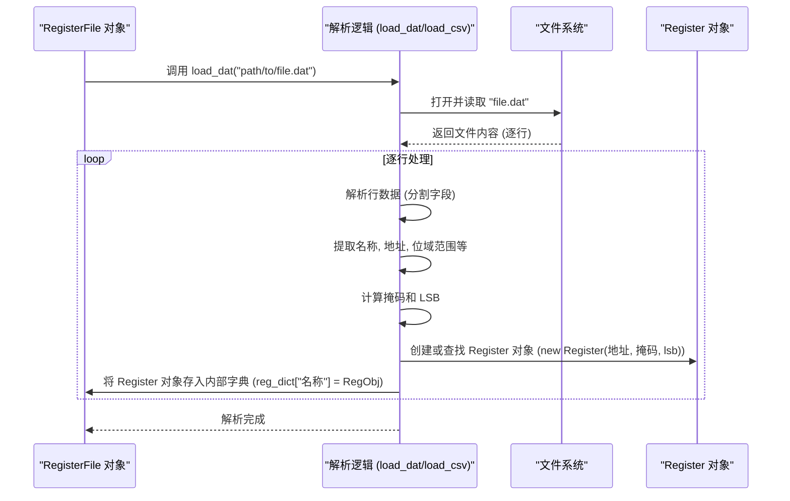

# Chapter 5: 寄存器定义解析 (Register Definition Parsing)


欢迎来到 `python_sdk` 教程的第五章！在上一章 [第 4 章：配置管理 (Configuration Management)](04_配置管理__configuration_management__.md) 中，我们学习了 SDK 如何管理各种操作所需的参数，比如数据速率或固件版本，通过 `validation/config.py` 或 CSV 文件将配置与代码分离。

现在，我们知道如何发送命令 ([第 3 章：API 客户端 (Client)](03_api_客户端__client__.md))，也知道如何管理这些命令的参数 ([第 4 章：配置管理](04_配置管理__configuration_management__.md))。但是，当我们与硬件交互时，尤其是读写寄存器时，我们是怎么知道哪个寄存器对应哪个地址？寄存器内部的各个字段（位域）又是如何定义的？如果我们只能通过硬编码的内存地址（比如 `0x10A4`）来操作硬件，代码会变得难以阅读和维护。一旦硬件设计更新，地址发生变化，我们就得修改所有相关的代码。

这就是 **寄存器定义解析 (Register Definition Parsing)** 发挥作用的地方。

**把它想象成解读一份硬件的“蓝图”或“字典”。** 硬件工程师设计芯片时，会创建详细的文档（通常是 `.dat` 或 `.csv` 文件），列出每个寄存器的名字、地址、包含哪些位域 (bit fields)、每个位域的作用、占据哪些比特位、复位后的默认值是多少等等。寄存器定义解析功能就是读取并理解这份“蓝图”，将这些信息加载到程序内存中，建立起符号名称（如 `PLL_CTRL.ENABLE`）与物理地址和位掩码之间的映射关系。

**核心用途示例：如何让 SDK 理解 `PLL_CTRL.ENABLE` 这个名字？**

假设你想通过 Python 代码使能 PLL（锁相环）。你希望写出像 `my_register_file.PLL_CTRL.ENABLE = 1` 这样易于理解的代码，而不是 `write_register(0x100, 0x01)` 这样晦涩难懂的代码（假设 `PLL_CTRL` 在地址 `0x100`，`ENABLE` 位是最低位 bit 0）。寄存器定义解析就是让 SDK 能够理解 `PLL_CTRL.ENABLE` 实际上是指向地址 `0x100` 的第 0 位，并将你的赋值 `1` 正确地写入该位置。

## 什么是寄存器定义解析？

寄存器定义解析是 `python_sdk` 的一个关键功能，它负责从特定格式的文件（通常是 `.dat` 或 `.csv`）中读取硬件寄存器的详细规格说明。这些规格包括：

*   **寄存器名称 (Register Name):** 方便人类阅读和代码编写的符号名称，例如 `PLL_CTRL`。
*   **寄存器地址 (Address):** 该寄存器在硬件内存映射中的物理地址，例如 `0x100`。
*   **位域名称 (Field Name):** 寄存器内有特定功能的一组比特位的名称，例如 `ENABLE`。
*   **位域范围 (Bit Range/Mask):** 该位域占据寄存器中的哪些比特位，例如 `[0:0]` 或对应的掩码 `0x0001`。
*   **复位值 (Reset Value):** 硬件复位后该寄存器或位域的默认值。
*   **读写属性 (Access):** 该寄存器或位域是只读 (RO)、只写 (WO)、还是读写 (RW)。

解析器读取这些信息后，通常会将它们组织成程序可以理解的数据结构，最常见的是存储在一个 [寄存器文件 (RegisterFile)](06_寄存器文件__registerfile__.md) 对象内部。这个过程就像是将工程师的设计文档翻译成机器可以执行的指令。

### 主要流程

```mermaid
graph LR
    A[硬件设计工程师] --> B(创建寄存器定义文件 .dat/.csv);
    C(寄存器定义解析器) -- 读取 --> B;
    C -- 解析信息 --> D{内存中的数据结构};
    D -- 通常存储在 --> E([寄存器文件 RegisterFile](06_寄存器文件__registerfile__.md));
    F[Python 脚本/GUI] -- 使用符号名称访问 --> E;
    E -- 根据解析结果 --> G{计算地址/掩码/值};
    G -- 通过 --> H([API 客户端 Client](03_api_客户端__client__.md));
    H -- 发送读写命令 --> I(硬件);

    style B fill:#lightgrey,stroke:#333
    style C fill:#ccf,stroke:#333,stroke-width:2px
    style E fill:#f9f,stroke:#333,stroke-width:2px
```

这个流程的核心优势在于**抽象**：应用程序代码（脚本或 GUI）只需要和友好的符号名称打交道，而底层的地址、掩码计算和转换细节则由解析器和 `RegisterFile` 对象自动处理。

## 如何使用（或让 SDK 使用）寄存器定义？

通常，你作为 SDK 的使用者，并不需要*直接*调用解析器。这个过程更多地是在幕后发生，通常是在初始化 `RegisterFile` 对象时自动完成。你需要做的，主要是确保 SDK 能够找到正确的寄存器定义文件。

让我们回到核心示例：让 SDK 理解 `PLL_CTRL.ENABLE`。

1.  **准备寄存器定义文件:**
    硬件团队会提供一个 `.dat` 或 `.csv` 文件，其中包含了 `PLL_CTRL` 寄存器的定义。这个文件可能看起来像这样（这是一个简化的 `.dat` 文件片段，格式可能因项目而异）：

    ```
    # Field Name           Bit Range  Address  Register Name  Reset Value  Properties
    PLL_CTRL.ENABLE        [0:0]      0x100    PLL_CTRL       0x0          RW
    PLL_CTRL.DIVIDER       [7:1]      0x100    PLL_CTRL       0x40         RW
    PLL_CTRL.LOCK_STATUS   [8:8]      0x100    PLL_CTRL       0x0          RO
    ...其他寄存器或字段...
    ```
    或者，在 `.csv` 文件中可能像这样（注意：`python_sdk` 中似乎使用 `.dat`，并可能通过 `dat2csv.py` 转换）：

    ```csv
    FieldName,BitRange,Address,RegisterName,ResetValue,Properties
    PLL_CTRL.ENABLE,"[0:0]",0x100,PLL_CTRL,0x0,RW
    PLL_CTRL.DIVIDER,"[7:1]",0x100,PLL_CTRL,0x40,RW
    PLL_CTRL.LOCK_STATUS,"[8:8]",0x100,PLL_CTRL,0x0,RO
    ```
    **解释:** 这就像一个表格，每一行描述了一个寄存器的一个字段（或整个寄存器）。例如，第一行告诉我们：有一个字段叫 `ENABLE`，属于 `PLL_CTRL` 寄存器，它位于地址 `0x100`，占据第 `0` 位，复位值是 `0`，并且是可读写的 (`RW`)。

2.  **SDK 加载定义文件:**
    在 SDK 的初始化代码中（通常在创建 `RegisterFile` 实例时），会调用相应的加载函数，比如 `load_dat` 或 `load_csv`，并传入这个定义文件的路径。

    ```python
    # 文件: (可能在创建 RegisterFile 实例的地方)
    from api_client.UREFE.common.prototype_com.registerfile import RegisterFile

    # 创建一个 RegisterFile 实例 (假设寄存器位宽是 16)
    reg_file = RegisterFile(wordsize=16)

    # 加载寄存器定义 (假设使用 load_dat 方法)
    # 注意: 实际路径需要根据项目结构确定
    dat_file_path = 'path/to/your/register_definition.dat'
    try:
        # 调用 RegisterFile 的方法来解析文件
        reg_file.load_dat(dat_file_path, sep='\t') # sep 是分隔符
        print(f"成功从 {dat_file_path} 加载寄存器定义。")
        # 或者使用 load_csv
        # reg_file.load_csv(csv_file_path, sep=',')
    except FileNotFoundError:
        print(f"错误：找不到寄存器定义文件 {dat_file_path}")
    except Exception as e:
        print(f"加载寄存器定义时出错: {e}")

    # (可选) 绑定驱动程序，以便进行实际的硬件读写
    # from some_driver import my_driver
    # reg_file.bind(my_driver)
    ```
    **解释:** 这段代码首先创建了一个 `RegisterFile` 对象，它将作为我们访问寄存器的主要接口。然后，我们调用 `load_dat` 方法，告诉它去读取并解析指定路径的 `.dat` 文件。解析完成后，`reg_file` 对象内部就包含了所有寄存器和字段的“知识”。

3.  **通过符号名称访问:**
    一旦定义被加载，你就可以在代码中使用点符号 (`.`) 来访问寄存器和字段了。

    ```python
    # 现在可以使用符号名称了
    try:
        # 读取 PLL_CTRL 寄存器的 ENABLE 字段的当前值
        # current_enable_status = reg_file.PLL_CTRL.ENABLE.read() # .read() 可能不是这样用，更可能是直接访问
        current_enable_status = int(reg_file.PLL_CTRL_ENABLE) # 假设解析后字段名直接可用
        print(f"当前 PLL 使能状态: {current_enable_status}")

        # 写入值 1 到 PLL_CTRL 寄存器的 ENABLE 字段
        # reg_file.PLL_CTRL.ENABLE = 1  # 直接赋值触发写入
        reg_file.asr("PLL_CTRL.ENABLE", 1) # 使用 asr (Assign Register) 方法写入
        print("已尝试设置 PLL_CTRL.ENABLE = 1")

        # 读取只读字段 LOCK_STATUS
        # lock_status = reg_file.PLL_CTRL.LOCK_STATUS.read()
        lock_status = reg_file.agr("PLL_CTRL.LOCK_STATUS") # 使用 agr (Access Register) 方法读取
        print(f"PLL 锁定状态: {lock_status}")

    except AttributeError as e:
        print(f"访问寄存器字段时出错: {e}. 确保定义已正确加载。")
    except Exception as e:
        print(f"与硬件交互时出错: {e}")

    # 注意：实际访问方式可能依赖于 RegisterFile 和 Register 类的具体实现。
    # 上面的 .asr() 和 .agr() 是 RegisterFile 类中实际提供的方法。
    # .dat 文件中的点可能被替换为下划线，例如 PLL_CTRL.ENABLE 变成 PLL_CTRL_ENABLE
    ```
    **解释:** 加载定义后，你可以像访问普通 Python 对象属性一样使用寄存器和字段名（例如 `reg_file.PLL_CTRL_ENABLE`，或者通过 `agr`/`asr` 方法使用字符串 `"PLL_CTRL.ENABLE"`）。当你执行 `reg_file.asr("PLL_CTRL.ENABLE", 1)` 时，`RegisterFile` 对象会在内部查找 `PLL_CTRL.ENABLE` 的定义，找到对应的地址 `0x100` 和掩码/位移信息，计算出需要写入硬件的最终值（比如 `0x0001`，如果寄存器只有这一个字段被修改），然后通过绑定的驱动程序和 [API 客户端 (Client)](03_api_客户端__client__.md) 将这个值写入地址 `0x100`。你完全不需要关心这些底层细节！

## 寄存器定义解析是如何工作的？（幕后探秘）

当你调用 `reg_file.load_dat(dat_file_path)` 或 `reg_file.load_csv(csv_file_path)` 时，内部发生了什么？

1.  **文件读取:** 解析器（可能是 `RegisterFile` 类的方法，或像 `parseDatFile.py` 这样的独立模块）打开指定的 `.dat` 或 `.csv` 文件。
2.  **逐行处理:** 解析器逐行读取文件内容。
3.  **解析单元格/字段:** 对于每一行，它根据定义的分隔符（如制表符 `\t` 或逗号 `,`）将行分割成多个单元格（字段）。
4.  **提取信息:** 它从这些单元格中提取关键信息：字段名 (`PLL_CTRL.ENABLE`)、位域范围 (`[0:0]`)、地址 (`0x100`)、寄存器名 (`PLL_CTRL`)、复位值 (`0x0`)、属性 (`RW`) 等。
5.  **计算掩码和位移:** 解析器根据位域范围（如 `[7:1]`）计算出相应的位掩码（`0xFE`）和最低有效位 (LSB) 的位置（`1`）。
6.  **创建/更新 `Register` 对象:**
    *   如果这是一个新遇到的寄存器或字段，解析器会创建一个 `Register` 对象（来自 `register.py`）。这个对象会存储地址、掩码、LSB 位置以及可能的读写操作转换逻辑。
    *   如果这个字段属于一个已经部分定义的寄存器（比如同一个地址的不同位域），它可能会更新现有的 `Register` 对象或添加一个新的表示该字段的 `Register` 对象。
7.  **存储到字典:** 创建或更新的 `Register` 对象会被存储到 `RegisterFile` 内部的一个字典（如 `self.reg_dict` 或 `self.reg_dict_m`）中。字典的键通常是寄存器或字段的名称（可能是处理过的名称，如 `PLL_CTRL_ENABLE` 或 `PLL_CTRL.ENABLE`）。



### 代码一瞥

让我们看看相关的代码片段（简化版）。

**1. 寄存器定义文件 (`.dat` 示例)**

```
# Field Name           Bit Range  Address  Register Name  Reset Value  Properties ...
IP_TOP.CHIP_ID         [15:0]     0x0000   CHIP_ID_REG    0xE224       RO
TC_TOP.TC_CTRL.ENABLE  [0:0]      0x8000   TC_CTRL_REG    0x0          RW
TC_TOP.TC_CTRL.MODE    [2:1]      0x8000   TC_CTRL_REG    0x1          RW
FPGA.SYS_CTRL.RESET    [0:0]      0xF000   SYS_CTRL_REG   0x0          WO
```
**解释:** 这是硬件寄存器规格的文本表示。每一行定义了一个寄存器字段或整个寄存器。

**2. `RegisterFile` 加载方法 (`registerfile.py`)**

`RegisterFile` 类中包含了 `load_dat` 和 `load_csv` 方法来处理这些文件。

```python
# 文件: python_env\api_client\UREFE\common\prototype_com\registerfile.py (简化 load_dat)
import re
from .register import Register # 导入 Register 类

class RegisterFile:
    # ... (其他方法如 __init__, bind, agr, asr 省略) ...

    def load_dat(self, filename, sep='\t'):
        """从 .dat 文件加载寄存器定义"""
        try:
            f = open(filename)
            for line in f:
                if len(line) < 3 or line.startswith('#'): continue # 跳过短行和注释

                # 使用正则表达式或 split 处理制表符分隔的行
                cells = re.sub('\t+', '\t', line.strip()).split(sep)
                if len(cells) < 6: continue # 确保有足够的列

                # 提取信息 (索引可能根据实际 .dat 格式调整)
                field_name_full = cells[0] # 例如 "PLL_CTRL.ENABLE"
                bit_range_str = cells[1]   # 例如 "[0:0]" or "[7:1]"
                address_str = cells[2]     # 例如 "0x100"
                # register_name = cells[3] # 可能需要 Register Name
                # reset_val_str = cells[4] # 可能需要 Reset Value
                # properties = cells[5]    # 可能需要 Properties (RW/RO/WO)

                # 解析地址
                try:
                    if address_str.startswith('0x'): iaddr = int(address_str, 16)
                    elif address_str.startswith('0'): iaddr = int(address_str, 8)
                    else: iaddr = int(address_str, 10)
                except ValueError: continue # 跳过无效地址

                # 解析位域范围并计算掩码和 LSB
                match = re.match(r'\[(\d+):?(\d+)?\]', bit_range_str)
                if match:
                    idx_max = int(match.group(1))
                    idx_min_str = match.group(2)
                    idx_min = int(idx_min_str) if idx_min_str else idx_max

                    mask = ((1 << (idx_max - idx_min + 1)) - 1) << idx_min
                    lsb = idx_min
                else:
                    # 可能是整个寄存器 [15:0] 或 [7:0] 等
                    # 需要根据 wordsize 处理，这里简化，假设无效则跳过
                    continue

                # 处理名称 (将 '.' 替换为 '_', 并存储原始名称映射)
                regname_processed = re.sub('\.', '_', field_name_full) # 例如 "PLL_CTRL_ENABLE"
                regname_original = field_name_full # 例如 "PLL_CTRL.ENABLE"

                # 创建 Register 对象并存入字典
                # 注意：实际实现可能更复杂，需要处理跨地址寄存器等
                new_reg = Register(iaddr, mask, lsb)
                self.reg_dict[regname_processed] = new_reg
                # 同时存储原始名称到处理后名称的映射，或使用另一个字典 self.reg_dict_m
                self.reg_dict_m[regname_original] = new_reg

                # (可选) 处理父寄存器 (例如 PLL_CTRL)
                # parent_reg_name = field_name_full.rpartition('.')[0] # "PLL_CTRL"
                # if parent_reg_name and (parent_reg_name not in self.reg_dict):
                #     # 创建一个代表整个寄存器的 Register 对象 (掩码通常是全 F)
                #     full_mask = (1 << self.wordsize) - 1
                #     self.reg_dict[parent_reg_name] = Register(iaddr, full_mask)
                #     self.reg_dict_m[parent_reg_name] = self.reg_dict[parent_reg_name]

            f.close()
            print(f"成功解析 {filename}")

        except FileNotFoundError:
            print(f"错误: 文件 {filename} 未找到。")
            raise # 重新抛出异常
        except Exception as e:
            print(f"解析 {filename} 时发生错误: {e}")
            raise # 重新抛出异常

    # load_csv 方法类似，只是分隔符和列索引可能不同
    # ...
```
**解释:** `load_dat` 方法打开文件，逐行读取。它使用字符串处理和简单的数学运算来提取地址、计算位掩码和 LSB 位置。然后，它创建一个 `Register` 对象来存储这些信息，并将这个对象以处理后的名称（通常是点换成下划线）作为键，存入 `RegisterFile` 内部的 `reg_dict` 字典中。它还可能在 `reg_dict_m` 中存储原始名称的映射。这样，之后通过 `agr("PLL_CTRL.ENABLE")` 或 `asr("PLL_CTRL.ENABLE", val)` 访问时，就能找到对应的 `Register` 对象。

**3. `Register` 类 (`register.py`)**

`Register` 类是存储单个寄存器或字段信息的载体。

```python
# 文件: python_env\api_client\UREFE\common\prototype_com\register.py (简化)

class Register:
    """表示一个硬件寄存器或其一部分 (位域)"""
    def __init__(self, address, mask, lsb=0, **options):
        """
        初始化 Register 对象。
        :param address: 寄存器地址。
        :param mask: 与该字段相关的位掩码。
        :param lsb: 该字段的最低有效位 (LSB) 位置。
        :param options: 其他选项 (如 rd_op, wr_op 用于值转换)。
        """
        self.address = address
        self.mask = mask
        self.lsb = lsb
        self.width = self._calculate_width(mask >> lsb) # 计算位宽
        self.parent = None # 指向 RegisterFile 的引用 (通过 bind 设置)
        # ... (处理 options, 如 rd_op, wr_op) ...

    def _calculate_width(self, normalized_mask):
        """根据归一化后的掩码计算位宽"""
        width = 0
        while normalized_mask > 0:
            normalized_mask >>= 1
            width += 1
        return width

    def bind(self, parent_register_file):
        """将此 Register 绑定到 RegisterFile"""
        self.parent = parent_register_file

    def _read_from_hw(self):
        """通过绑定的 RegisterFile 从硬件读取原始寄存器值"""
        if self.parent and hasattr(self.parent, 'readreg'):
            # 调用 RegisterFile 的 readreg 方法读取整个寄存器的值
            return self.parent.readreg(self.address)
        else:
            raise RuntimeError("Register 没有绑定到有效的 RegisterFile")

    def _write_to_hw(self, value_to_write):
        """通过绑定的 RegisterFile 将值写入硬件"""
        if self.parent and hasattr(self.parent, 'writereg'):
            # 调用 RegisterFile 的 writereg 方法写入整个寄存器的值
            self.parent.writereg(self.address, value_to_write)
        else:
            raise RuntimeError("Register 没有绑定到有效的 RegisterFile")

    def read(self):
        """读取此字段的值 (应用掩码和位移)"""
        raw_value = self._read_from_hw()
        field_value = (raw_value & self.mask) >> self.lsb
        # ... (可能应用 rd_op 转换) ...
        return field_value

    def write(self, value):
        """写入此字段的值 (需要读-改-写操作)"""
        # 1. 读取当前寄存器的原始值
        current_raw_value = self._read_from_hw()
        # 2. 准备要写入字段的值 (确保在位宽范围内)
        value &= (1 << self.width) - 1 # 应用位宽限制
        # 3. 将值左移到正确的位置
        shifted_value = value << self.lsb
        # 4. 清除当前值中对应字段的位 (使用反转的掩码)
        cleared_value = current_raw_value & (~self.mask)
        # 5. 将新值合并到清除后的值中
        new_raw_value = cleared_value | (shifted_value & self.mask)
        # 6. 将计算出的新原始值写入硬件
        self._write_to_hw(new_raw_value)
        # ... (可能应用 wr_op 转换) ...

    def __int__(self):
        """允许使用 int(register_object) 来读取值"""
        return self.read()

    def __call__(self, value):
        """允许使用 register_object(value) 来写入值"""
        self.write(value)
```
**解释:** `Register` 类存储了从定义文件中解析出的关键信息：地址 (`address`)、掩码 (`mask`) 和 LSB 位置 (`lsb`)。它的 `read()` 方法负责从硬件读取整个寄存器的值，然后应用掩码和位移来提取该字段的值。它的 `write()` 方法执行一个“读-改-写”操作：先读取寄存器的当前值，然后只修改该字段对应的比特位，最后将修改后的完整值写回硬件。`__int__` 和 `__call__` 方法提供了方便的语法糖，使得可以直接用 `int(reg)` 读取和 `reg(value)` 写入。`bind` 方法将 `Register` 对象与其所属的 `RegisterFile` 关联起来，以便调用 `readreg`/`writereg` 进行实际的硬件操作。

**4. 辅助脚本 (`dat2csv.py`, `parseDatFile.py`)**

项目中还包含 `dat2csv.py` 和 `parseDatFile.py`。

*   `dat_files/dat2csv.py`: 这个脚本似乎用于将 `.dat` 文件预处理成 `.csv` 文件，主要是将制表符（或其他空格）分隔的列转换为逗号分隔，方便后续使用标准的 CSV 库（如 Python 内置的 `csv` 或 `pandas`）来读取。
*   `registers/parseDatFile.py`: 这个脚本看起来是一个独立的、专门用于解析（可能是转换后的 `.csv` 文件）并提取寄存器信息的模块。它将解析结果存储在各种全局列表（如 `ipBanks`, `ipRegFieldName`, `ipRegAddr` 等）中。虽然 `RegisterFile` 类自身有 `load_csv`/`load_dat` 方法，但这个独立脚本可能被 GUI 或其他需要直接访问原始寄存器列表信息的工具使用。

**注意:** `RegisterFile` 中的 `load_dat` 实现似乎直接解析 `.dat` 文件，而 `parseDatFile.py` 似乎解析的是 `.csv` 文件。这可能意味着 SDK 中存在两种解析路径，或者 `RegisterFile` 的 `load_dat` 是后续添加的，而 `parseDatFile.py` 是早期用于 GUI 的。

## 总结

在本章中，我们深入了解了 `python_sdk` 的寄存器定义解析功能：

*   我们明白了**为什么需要解析**：它将人类可读的寄存器/字段名称（如 `PLL_CTRL.ENABLE`）与底层的硬件地址和位掩码联系起来，提高了代码的可读性和可维护性。
*   我们了解了**解析的对象**：通常是硬件工程师提供的 `.dat` 或 `.csv` 文件，其中详细描述了寄存器的规格。
*   我们知道了**如何触发解析**：通常在创建 [寄存器文件 (RegisterFile)](06_寄存器文件__registerfile__.md) 对象后，调用其 `load_dat` 或 `load_csv` 方法来加载定义文件。
*   我们探讨了**内部工作原理**：解析器读取文件，提取信息，计算掩码/位移，创建 `Register` 对象，并将其存储在 `RegisterFile` 的内部字典中，以供后续通过符号名称进行访问。
*   我们看到了相关的代码实现，包括 `RegisterFile` 的加载方法和 `Register` 类如何存储信息并执行读写操作。

寄存器定义解析是 SDK 实现符号化寄存器访问的基础，它将复杂的硬件细节隐藏起来，让开发者能够更专注于应用逻辑。

**下一章展望:**

我们已经学习了 SDK 如何理解寄存器的定义。现在，是时候深入了解那个存储和管理这些已解析定义的中心对象了——[寄存器文件 (RegisterFile)](06_寄存器文件__registerfile__.md)。在下一章，我们将详细探讨 `RegisterFile` 类是如何利用这些解析结果，提供便捷的寄存器读写接口，并可能实现缓存等高级功能的。请继续阅读 [第 6 章：寄存器文件 (RegisterFile)](06_寄存器文件__registerfile__.md)。

---

Generated by [AI Codebase Knowledge Builder](https://github.com/The-Pocket/Tutorial-Codebase-Knowledge)