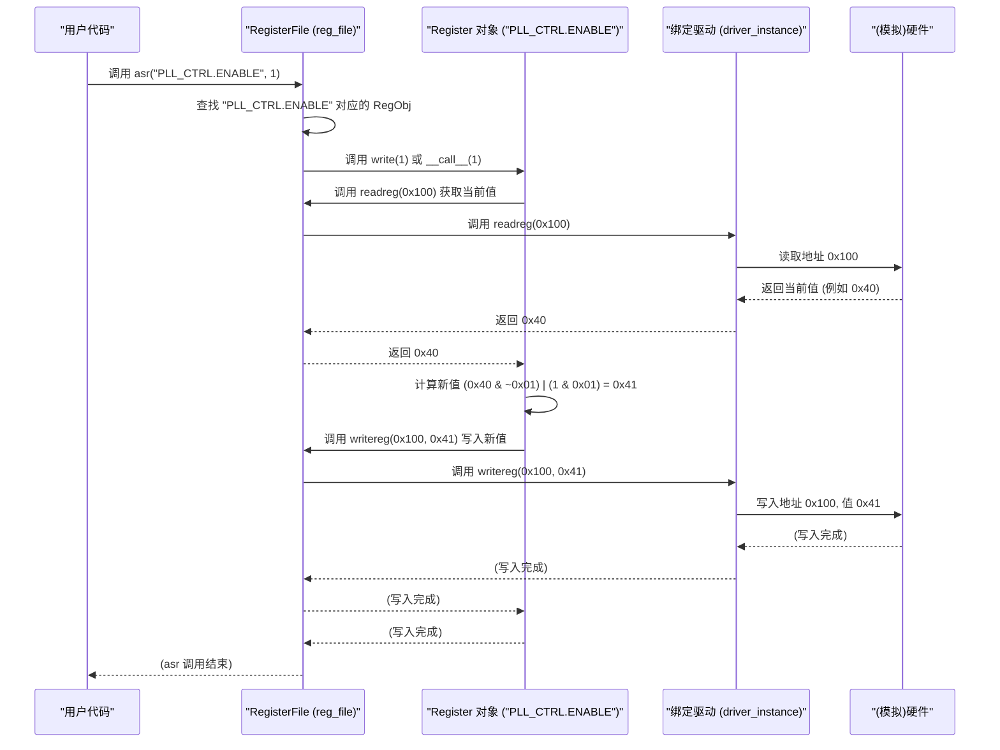

# Chapter 6: 寄存器文件 (RegisterFile)


欢迎来到 `python_sdk` 教程的第六章！在上一章 [第 5 章：寄存器定义解析](05_寄存器定义解析__register_definition_parsing__.md) 中，我们学习了 SDK 如何读取和理解硬件寄存器的“蓝图”——`.dat` 或 `.csv` 文件，将寄存器名称、地址和位域等信息加载到内存中。我们知道了 SDK 如何理解像 `PLL_CTRL.ENABLE` 这样的符号名称。

但是，仅仅理解了定义还不够。我们需要一个“智能的代理”来利用这些定义，并实际与硬件进行交互。如果每次读写寄存器，我们都需要手动查找地址、计算掩码、然后调用底层的通信函数，那将非常繁琐且容易出错。

想象一下，你有一个非常聪明的笔记本。这本笔记本不仅记录了你所有联系人的姓名、电话号码和地址（就像寄存器定义），而且它还连接了电话线（驱动程序），并且知道如何帮你拨打电话和接听回复。你只需要告诉笔记本：“给‘张三’打电话”，它就能自动查找号码并拨号。**寄存器文件 (RegisterFile)** 就是这样一个“智能笔记本”。

**核心用途示例：如何通过名称读写 PLL 的使能位？**

假设你想要使能硬件上的 PLL（锁相环），并且在寄存器定义文件中，你知道这个控制位叫做 `PLL_CTRL.ENABLE`。你希望能够用非常简单直观的方式来操作它，例如：

*   读取状态：`当前状态 = my_register_file.agr("PLL_CTRL.ENABLE")`
*   写入状态：`my_register_file.asr("PLL_CTRL.ENABLE", 1)`

而不需要关心 `PLL_CTRL` 寄存器的具体地址是 `0x100`，也不需要知道 `ENABLE` 位在第 0 位，更不用说手动执行读-改-写操作。`RegisterFile` 就是帮你实现这种便捷操作的核心工具。

## 什么是寄存器文件 (RegisterFile)？

`RegisterFile` 类（通常在 `registerfile.py` 文件中定义）是 `python_sdk` 中用于管理和访问硬件寄存器的核心抽象。你可以把它理解为：

1.  **寄存器定义的容器:** 它存储了从 `.dat` 或 `.csv` 文件中解析出来的所有寄存器和位域的详细信息（地址、掩码、LSB 等），这些信息通常保存在内部的字典（如 `reg_dict` 和 `reg_dict_m`）中，键是寄存器/字段的名称。
2.  **硬件交互的代理:** 它需要绑定一个**驱动程序 (Driver)**。这个驱动程序知道如何进行实际的底层硬件读写操作（例如，通过 [API 客户端 (Client)](03_api_客户端__client__.md) 发送命令）。`RegisterFile` 通过调用这个驱动程序的 `readreg` 和 `writereg` 函数来完成与硬件的通信。
3.  **用户友好的接口:** 它提供了简单的方法（如 `agr` 和 `asr`）让用户可以通过**符号名称**（字符串）来读取和写入寄存器或位域的值，而无需关心底层的地址和位操作细节。

```mermaid
graph TD
    A(用户代码: agr/asr) --> B(RegisterFile 对象);
    B -- 查找定义 --> C{内部字典 (reg_dict/reg_dict_m)};
    C -- 获取 --> D(Register 对象: 地址, 掩码, LSB);
    B -- 调用 --> E(绑定的驱动程序: readreg/writereg);
    E -- 通过 --> F([API 客户端 (Client)](03_api_客户端__client__.md) 等);
    F -- 与硬件通信 --> G(硬件);

    style B fill:#f9f,stroke:#333,stroke-width:2px
    style E fill:#ccf,stroke:#333,stroke-width:2px
```

基本上，`RegisterFile` 就像一个翻译官和执行者，它将你用高级语言（符号名称）下达的指令，翻译成低级语言（地址和值），然后命令它的助手（驱动程序）去执行。

## 如何使用 RegisterFile（解决我们的示例）？

让我们看看如何使用 `RegisterFile` 来轻松读写 `PLL_CTRL.ENABLE` 位。

**第一步：创建 RegisterFile 实例**

首先，你需要创建一个 `RegisterFile` 对象。创建时通常需要指定硬件寄存器的位宽（例如 16 位或 32 位）。

```python
# 文件: (你的脚本或初始化代码中)
# 从正确的路径导入 RegisterFile 类
from api_client.UREFE.common.prototype_com.registerfile import RegisterFile

# 创建一个 RegisterFile 实例，假设寄存器是 16 位的
# log=True 表示开启寄存器访问日志记录 (可选)
reg_file = RegisterFile(wordsize=16, log=True)

print("RegisterFile 对象已创建。")
```

**解释:** 这行代码创建了一个空的“智能笔记本” `reg_file`，并告诉它硬件的基本规则（寄存器是 16 位的）。`log=True` 参数表示我们希望记录下所有通过这个 `reg_file` 进行的寄存器读写操作，方便调试。

**第二步：加载寄存器定义**

接下来，你需要告诉 `RegisterFile` 硬件的“蓝图”在哪里。这通过调用 `load_dat` 或 `load_csv` 方法完成，我们在 [第 5 章：寄存器定义解析](05_寄存器定义解析__register_definition_parsing__.md) 中已经了解了这个过程。

```python
# 文件: (紧接着上一步)
# 指定寄存器定义文件的路径
# 注意：你需要替换成你项目中实际的文件路径
dat_file_path = 'path/to/your/register_definition.dat'

try:
    # 调用 load_dat 方法加载并解析 .dat 文件
    # sep='\t' 指定了文件中的分隔符是制表符
    reg_file.load_dat(dat_file_path, sep='\t')
    print(f"成功从 {dat_file_path} 加载寄存器定义。")
except FileNotFoundError:
    print(f"错误：找不到寄存器定义文件 {dat_file_path}")
except Exception as e:
    print(f"加载寄存器定义时出错: {e}")
```

**解释:** 这段代码让 `reg_file` 读取并“学习”了 `.dat` 文件中的所有内容。现在，`reg_file` 内部知道了 `PLL_CTRL.ENABLE` 以及所有其他寄存器和字段的地址、掩码等信息。

**第三步：绑定驱动程序**

光有定义还不行，`RegisterFile` 需要一个“助手”来帮它执行实际的硬件读写。你需要将一个驱动程序对象绑定给它。这个驱动程序对象必须提供 `readreg(address)` 和 `writereg(address, data)` 方法（或者在绑定时指定其他名称的方法）。

`python_sdk` 提供了多种驱动程序实现，例如 `wrapper_driver_E112MP` (在 `comms.py` 中)，它内部使用了 [API 客户端 (Client)](03_api_客户端__client__.md) 来通信。我们将在 [第 8 章：驱动程序包装器](08_驱动程序包装器__wrapper_driver____.md) 和 [第 7 章：原型通信](07_原型通信__prototype_comm__.md) 中了解更多关于驱动和通信的细节。

```python
# 文件: (紧接着上一步)
# 假设我们有一个驱动程序实例 driver_instance
# 这可能来自 comms.py 中的 wrapper_driver_E112MP 或其他实现
# from api_client.UREFE.common.prototype_com.comms import wrapper_driver_E112MP
# 假设已经创建了驱动实例:
# driver_instance = wrapper_driver_E112MP(ft=None, pid=1) # ft 和 pid 需要实际设置

# --- 模拟一个简单的驱动程序用于演示 ---
class DummyDriver:
    def __init__(self):
        self.registers = {} # 用字典模拟硬件寄存器
        print("模拟驱动程序已创建。")
    def readreg(self, address):
        value = self.registers.get(address, 0) # 如果没写过，默认返回 0
        print(f"模拟驱动: 读取地址 {hex(address)}，值: {hex(value)}")
        return value
    def writereg(self, address, data):
        print(f"模拟驱动: 写入地址 {hex(address)}，值: {hex(data)}")
        self.registers[address] = data
# 创建模拟驱动实例
driver_instance = DummyDriver()
# --- 模拟驱动结束 ---


# 将驱动程序实例绑定到 RegisterFile
# RegisterFile 会使用 driver_instance 的 readreg 和 writereg 方法
try:
    # bind 方法接收驱动对象，以及可选的读写函数引用
    # 如果省略读写函数，默认使用驱动对象的 .readreg 和 .writereg
    reg_file.bind(driver_instance) # 在 E112MP 例子中会传入包装器实例
    print("驱动程序已成功绑定到 RegisterFile。")
except AttributeError:
    print("错误：提供的驱动程序对象没有 readreg 或 writereg 方法。")
except Exception as e:
    print(f"绑定驱动程序时出错: {e}")

```

**解释:** `bind` 方法就像是给你的“智能笔记本”接上了电话线。它告诉 `reg_file`：“以后需要读写硬件时，就调用 `driver_instance` 的 `readreg` 和 `writereg` 方法吧。” 现在 `reg_file` 既懂定义，又能操作硬件了。我们这里用了一个 `DummyDriver` 来模拟实际的驱动，方便演示。

**第四步：通过名称读写寄存器 (agr/asr)**

现在，所有准备工作就绪！你可以使用 `RegisterFile` 提供的 `agr` (Access Global Register，访问全局寄存器) 和 `asr` (Assign Register，分配寄存器) 方法，通过字符串名称来读写寄存器字段了。

```python
# 文件: (紧接着上一步)

# 寄存器字段名称 (与 .dat 文件中一致)
target_field = "PLL_CTRL.ENABLE" # 或者可能是处理后的 "PLL_CTRL_ENABLE"

try:
    # --- 读取字段值 ---
    print(f"\n尝试读取字段 '{target_field}' 的值...")
    # 调用 agr 方法读取
    current_value = reg_file.agr(target_field)
    # agr 返回的是整数值
    print(f"读取成功！字段 '{target_field}' 的当前值为: {current_value}")

    # --- 写入字段值 ---
    new_value = 1
    print(f"\n尝试向字段 '{target_field}' 写入值 {new_value}...")
    # 调用 asr 方法写入
    reg_file.asr(target_field, new_value)
    print(f"写入指令已发送 (模拟驱动应该已记录操作)。")

    # --- 再次读取以验证 ---
    print(f"\n再次读取字段 '{target_field}' 以验证写入...")
    updated_value = reg_file.agr(target_field)
    print(f"读取成功！字段 '{target_field}' 的新值为: {updated_value}")

    # --- 尝试访问一个完整的寄存器 (假设已定义) ---
    # full_reg_name = "PLL_CTRL" # .dat 文件中定义的寄存器名
    # if full_reg_name in reg_file.reg_dict_m: # 检查是否存在
    #    print(f"\n尝试读取整个寄存器 '{full_reg_name}'...")
    #    full_reg_value = reg_file.agr(full_reg_name)
    #    print(f"寄存器 '{full_reg_name}' 的值为: {hex(full_reg_value)}")

except AttributeError as e:
    # 如果 agr/asr 找不到名称，或者 Register 对象有问题，可能抛出 AttributeError
    print(f"\n错误: 访问寄存器时出错 - {e}")
except BoardError as e:
    # 如果驱动程序通信失败，可能抛出 BoardError
    print(f"\n错误: 与硬件通信失败 - {e}")
except Exception as e:
    print(f"\n发生意外错误: {e}")
```

**解释:**

*   `reg_file.agr("PLL_CTRL.ENABLE")`：你告诉 `RegisterFile`：“帮我读取 `PLL_CTRL.ENABLE` 的值。” `RegisterFile` 会自动查找定义，找到地址和掩码，然后让绑定的驱动程序去硬件（这里是模拟驱动）读取地址 `0x100` 的值，提取出第 0 位的值，最后返回给你。
*   `reg_file.asr("PLL_CTRL.ENABLE", 1)`：你告诉 `RegisterFile`：“把 `PLL_CTRL.ENABLE` 的值设为 `1`。” `RegisterFile` 会查找定义，然后执行一个“读-改-写”操作：
    1.  让驱动读取地址 `0x100` 的当前值。
    2.  计算新值：将当前值的第 0 位清零，然后将 `1` 设置到第 0 位。
    3.  让驱动把这个计算出的新值写回地址 `0x100`。

整个过程你都不需要关心地址 `0x100` 和位掩码 `0x0001` 这些细节！`RegisterFile` 都帮你处理了。

## RegisterFile 是如何工作的？（幕后探秘）

当我们调用 `reg_file.asr("PLL_CTRL.ENABLE", 1)` 时，内部发生了什么？

1.  **名称查找:** `asr` 方法接收到字符串 `"PLL_CTRL.ENABLE"`。它会在内部的字典 `self.reg_dict_m` (或 `self.reg_dict`) 中查找这个键。
2.  **获取 Register 对象:** 查找到对应的 `Register` 对象。我们在 [第 5 章](05_寄存器定义解析__register_definition_parsing__.md) 中知道，这个对象存储了该字段的地址 (`0x100`)、掩码 (`0x0001`) 和 LSB (`0`)。
3.  **调用 Register 对象的写入方法:** `asr` 方法内部会调用这个 `Register` 对象的写入逻辑。这通常是通过调用 `Register` 对象的 `write()` 方法或类似的内部函数实现的（或者直接调用 `Register` 的 `__call__` 方法，如 `self.reg_dict_m["PLL_CTRL.ENABLE"](1)`）。
4.  **执行读-改-写 (在 Register 对象内部):**
    a.  `Register` 对象的 `write()` 方法首先需要知道寄存器的当前值。它会调用其父级 `RegisterFile` 对象的 `readreg(address)` 方法（即 `self.parent.readreg(self.address)`），传入地址 `0x100`。
    b.  `RegisterFile` 的 `readreg()` 方法会调用**绑定的驱动程序**的 `readreg(0x100)` 方法。
    c.  驱动程序与硬件通信，返回地址 `0x100` 的当前值（假设是 `0x40`）。
    d.  `Register` 对象的 `write()` 方法拿到当前值 `0x40`。
    e.  它使用掩码 `0x0001` 和 LSB `0`，结合要写入的值 `1`，计算出新的寄存器值：`new_value = (current_value & ~mask) | ((value << lsb) & mask)` => `(0x40 & ~0x0001) | ((1 << 0) & 0x0001)` => `0x40 | 0x01` => `0x41`。
    f.  `Register` 对象的 `write()` 方法调用其父级 `RegisterFile` 对象的 `writereg(address, data)` 方法（即 `self.parent.writereg(self.address, new_raw_value)`），传入地址 `0x100` 和新值 `0x41`。
    g.  `RegisterFile` 的 `writereg()` 方法会调用**绑定的驱动程序**的 `writereg(0x100, 0x41)` 方法。
    h.  驱动程序将值 `0x41` 写入硬件地址 `0x100`。
5.  **完成:** 操作结束。

`agr` 的流程类似，但更简单，它只需要调用驱动的 `readreg`，然后应用掩码和位移提取字段值即可。

下面是一个简化的时序图，展示了 `asr` 的调用流程：



### 代码实现细节 (`registerfile.py` 和 `register.py`)

让我们看看 `RegisterFile` 和 `Register` 类中的关键代码片段（简化版）。

**1. `RegisterFile` 类 (`registerfile.py`)**

这个类负责存储定义、绑定驱动和提供 `agr`/`asr` 接口。

```python
# 文件: python_env\api_client\UREFE\common\prototype_com\registerfile.py (简化)
from .register import Register, BoardError # 导入 Register 类和自定义错误
import logging # 用于日志记录

class RegisterFile:
    def __init__(self, wordsize=8, log=False):
        """初始化 RegisterFile"""
        self.reg_dict = dict() # 存储处理后名称 -> Register 对象的映射
        self.reg_dict_m = dict() # 存储原始名称 -> Register 对象的映射
        self.wordsize = wordsize
        self.driver = None      # 绑定的驱动程序对象
        self.writefun = None    # 指向驱动的写入函数
        self.readfun = None     # 指向驱动的读取函数
        self.log = log          # 是否开启日志
        if log: self.__initLogging() # 初始化日志记录器 (私有方法)
        # ... 其他初始化 (省略 shaddow_read, delayed_write 等) ...

    def __initLogging(self): # 简化版日志初始化
        # ... (配置 logging 模块，例如设置日志文件和格式) ...
        self.logger = logging.getLogger(f"RegFile_{id(self)}")
        # ... (实际代码更复杂，这里仅示意) ...
        print("日志记录已初始化 (如果 log=True)。")

    def load_dat(self, filename, sep='\t'):
        """从 .dat 文件加载寄存器定义 (上一章已介绍，此处省略实现细节)"""
        print(f"开始加载 {filename} ...")
        # ... (读取文件，解析每一行) ...
        # ... (创建 Register 对象 new_reg) ...
        # self.reg_dict[processed_name] = new_reg
        # self.reg_dict_m[original_name] = new_reg
        # ... (循环处理所有行) ...
        print(f"完成加载 {filename}。")

    def bind(self, driver, writefun=None, readfun=None):
        """绑定驱动程序"""
        self.driver = driver
        # 确定使用哪个读写函数 (如果未提供，尝试用驱动的默认方法)
        self.writefun = writefun or getattr(driver, 'writereg', None)
        self.readfun = readfun or getattr(driver, 'readreg', None)
        if not (self.writefun and self.readfun):
            raise AttributeError("驱动程序缺少必需的 readreg/writereg 方法")
        # 将 self (RegisterFile 实例) 绑定到每个 Register 对象
        for register in self.reg_dict.values():
            register.bind(self) # 让 Register 对象能回调 RegisterFile
        print("驱动已绑定，所有内部 Register 对象已更新。")

    def readreg(self, address):
        """内部方法：调用绑定的驱动读取寄存器"""
        if not self.driver: raise BoardError("未绑定驱动")
        data = self.readfun(address) # 调用驱动的读取函数
        if self.log: # 如果开启了日志
            # 记录日志信息 (地址和读取到的值)
            self.logger.info(f'R:{address:x}:{data:x}')
        return data

    def writereg(self, address, data):
        """内部方法：调用绑定的驱动写入寄存器"""
        if not self.driver: raise BoardError("未绑定驱动")
        self.writefun(address, data) # 调用驱动的写入函数
        if self.log: # 如果开启了日志
            # 记录日志信息 (地址和写入的值)
            self.logger.info(f'W:{address:x}:{data:x}')

    def agr(self, string_addr):
        """访问全局寄存器 (读取)"""
        # 尝试在 self.reg_dict_m (原始名称) 或 self.reg_dict (处理后名称) 中查找
        register_obj = self.reg_dict_m.get(string_addr) or self.reg_dict.get(string_addr)
        if register_obj:
            if self.log: self.logger.info(f'agr:{string_addr}') # 记录 agr 操作
            # 调用 Register 对象的 __int__ 方法，触发其 read()
            return int(register_obj)
        else:
            print(f'寄存器名称错误 ->{string_addr}<-')
            raise AttributeError(f'未知寄存器名称: {string_addr}')

    def asr(self, string_addr, value):
        """分配寄存器 (写入)"""
        register_obj = self.reg_dict_m.get(string_addr) or self.reg_dict.get(string_addr)
        if register_obj:
            if self.log: self.logger.info(f'asr:{string_addr}') # 记录 asr 操作
            # 调用 Register 对象的 __call__ 方法，触发其 write()
            register_obj(value) # 等价于 register_obj.write(value)
        else:
            print(f'寄存器名称错误 ->{string_addr}<-')
            raise AttributeError(f'未知寄存器名称: {string_addr}')

    # ... (其他方法如 save_contents, load_contents 等省略) ...

```

**解释:**

*   `__init__`: 初始化存储寄存器定义的字典 (`reg_dict`, `reg_dict_m`) 和驱动相关的变量。如果 `log=True`，会初始化日志记录器。
*   `load_dat`: 负责解析 `.dat` 文件并将结果（`Register` 对象）存入字典（已在上一章详细介绍）。
*   `bind`: 保存驱动程序对象和读写函数的引用，并将 `RegisterFile` 自身传递给每个 `Register` 对象，让 `Register` 知道它的“父级”是谁。
*   `readreg`/`writereg`: 这是 `RegisterFile` 内部与**绑定驱动**交互的方法。它们被 `Register` 对象回调。如果开启了日志，它们会在调用驱动前后记录信息。
*   `agr`/`asr`: 这是提供给用户的**公共接口**。它们接收字符串名称，在字典中查找对应的 `Register` 对象，然后调用该对象的读取 (`__int__` -> `read()`) 或写入 (`__call__` -> `write()`) 方法来完成操作。如果找不到名称，会报错。

**2. `Register` 类 (`register.py`)**

这个类代表一个具体的寄存器字段，存储其地址/掩码/LSB，并实现读写逻辑。

```python
# 文件: python_env\api_client\UREFE\common\prototype_com\register.py (简化)

class Register:
    """表示一个硬件寄存器或其一部分 (位域)"""
    def __init__(self, address, mask=0xFF, lsb=0, **kw):
        """初始化 Register 对象"""
        self.address = address # 寄存器地址
        self.mask = mask       # 位域掩码
        self.lsb = lsb         # 最低有效位 (LSB) 位置
        # 根据掩码和 LSB 计算位宽 (width)
        self.width = self._calculate_width(mask >> lsb)
        self.parent = None     # 指向所属的 RegisterFile (通过 bind 设置)
        # ... (处理其他选项 kw，如 rd_op, wr_op 用于值转换，省略) ...

    def _calculate_width(self, normalized_mask):
        """根据归一化后的掩码计算位宽 (简化版)"""
        width = 0
        temp_mask = normalized_mask
        while temp_mask > 0:
            temp_mask >>= 1
            width += 1
        return width if width > 0 else 1 # 至少为 1 位

    def bind(self, parent_register_file):
        """将此 Register 绑定到其所属的 RegisterFile"""
        self.parent = parent_register_file

    def _read_from_hw(self):
        """通过绑定的 RegisterFile 从硬件读取原始寄存器值"""
        if self.parent and hasattr(self.parent, 'readreg'):
            # 调用 RegisterFile (父级) 的 readreg 方法
            return self.parent.readreg(self.address)
        else:
            raise RuntimeError("Register 没有绑定到有效的 RegisterFile")

    def _write_to_hw(self, value_to_write):
        """通过绑定的 RegisterFile 将值写入硬件"""
        if self.parent and hasattr(self.parent, 'writereg'):
            # 调用 RegisterFile (父级) 的 writereg 方法
            self.parent.writereg(self.address, value_to_write)
        else:
            raise RuntimeError("Register 没有绑定到有效的 RegisterFile")

    def read(self):
        """读取此字段的值 (应用掩码和位移)"""
        raw_value = self._read_from_hw() # 获取整个寄存器的原始值
        # 提取该字段的值
        field_value = (raw_value & self.mask) >> self.lsb
        # ... (可能应用 rd_op 转换，省略) ...
        return field_value

    def write(self, value):
        """写入此字段的值 (执行读-改-写操作)"""
        # 1. 读取当前寄存器的原始值
        current_raw_value = self._read_from_hw()
        # 2. 准备要写入字段的值 (确保在位宽内，并移位)
        value &= (1 << self.width) - 1 # 限制值在位宽内
        shifted_value = value << self.lsb
        # 3. 清除当前值中对应字段的位
        cleared_value = current_raw_value & (~self.mask)
        # 4. 合并新值
        new_raw_value = cleared_value | (shifted_value & self.mask)
        # 5. 将计算出的新原始值写入硬件
        self._write_to_hw(new_raw_value)
        # ... (可能应用 wr_op 转换，省略) ...

    def __int__(self):
        """允许使用 int(register_object) 来读取值 (调用 self.read)"""
        return self.read()

    def __call__(self, value):
        """允许使用 register_object(value) 来写入值 (调用 self.write)"""
        self.write(value)

    # ... (其他方法如 __str__, __repr__, __len__ 省略) ...
```

**解释:**

*   `__init__`: 保存地址、掩码、LSB，并计算位宽。
*   `bind`: 保存对父级 `RegisterFile` 的引用 (`self.parent`)。
*   `_read_from_hw`/`_write_to_hw`: 这两个**内部**方法通过调用 `self.parent.readreg()` 和 `self.parent.writereg()` 来与 `RegisterFile`（最终是与硬件）交互。
*   `read`: 实现读取逻辑：调用 `_read_from_hw` 获取原始值，然后用掩码和 LSB 提取字段值。
*   `write`: 实现写入逻辑（读-改-写）：调用 `_read_from_hw` 获取当前值，计算新值，然后调用 `_write_to_hw` 写回硬件。
*   `__int__`/`__call__`: 提供语法糖，使得 `RegisterFile` 中的 `agr` 和 `asr` 可以方便地调用 `read()` 和 `write()`。

## 总结

在本章中，我们深入探讨了 `python_sdk` 的核心组件之一——寄存器文件 (RegisterFile)：

*   我们理解了 **`RegisterFile` 的角色**：它是一个智能的容器和代理，利用解析好的寄存器定义，通过绑定的驱动程序，提供了一个用户友好的、基于符号名称的硬件寄存器访问接口。
*   它**解决了什么问题**：极大地简化了硬件交互，让开发者无需关心底层的地址、掩码和读写细节，提高了代码的可读性和可维护性。
*   我们学习了**如何使用**它：创建实例 -> 加载定义 (`load_dat`/`load_csv`) -> 绑定驱动 (`bind`) -> 使用 `agr`/`asr` 通过名称读写。
*   我们探究了它的**工作原理**：`agr`/`asr` 查找对应的 `Register` 对象，`Register` 对象负责执行具体的读或读-改-写逻辑，并通过回调 `RegisterFile` 的 `readreg`/`writereg` 方法与绑定的驱动程序（最终是硬件）通信。

`RegisterFile` 是连接高级软件逻辑与低级硬件操作的关键桥梁，掌握它对于有效使用 `python_sdk` 至关重要。

**下一章展望:**

我们已经看到 `RegisterFile` 需要一个驱动程序来与硬件通信。那么，这些通信是如何在底层实现的呢？SDK 中用于与硬件原型或评估板进行低级通信的模块是什么？在下一章，我们将深入了解 `python_sdk` 中负责与硬件原型直接对话的组件。请继续阅读 [第 7 章：原型通信 (prototype_comm)](07_原型通信__prototype_comm__.md)。

---

Generated by [AI Codebase Knowledge Builder](https://github.com/The-Pocket/Tutorial-Codebase-Knowledge)