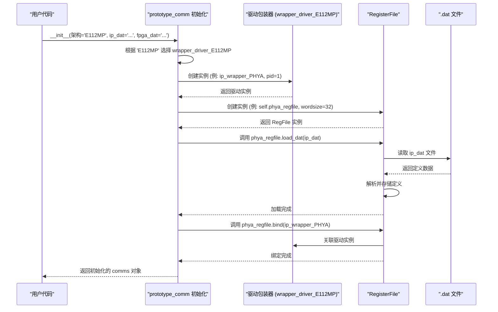

# Chapter 7: 原型通信 (prototype_comm)


欢迎来到 `python_sdk` 教程的第七章！在 [第 6 章：寄存器文件 (RegisterFile)](06_寄存器文件__registerfile__.md) 中，我们学习了 `RegisterFile` 这个“智能笔记本”如何利用解析好的寄存器定义，并需要绑定一个驱动程序来执行实际的硬件读写操作。我们知道了如何通过 `reg_file.agr()` 和 `reg_file.asr()` 这样的友好接口与寄存器交互。

但是，这里引出了一个新问题：我们可能有多种与硬件通信的方式（比如通过 JTAG 调试接口、ISDS 接口，或者通过网络与一个 [API 客户端 (Client)](03_api_客户端__client__.md) 对话），而且不同的硬件目标（比如 E112MP 芯片或 FPGA）可能需要不同的通信驱动和不同的寄存器定义文件（`.dat` 文件）。如果每次我们要与特定硬件交互时，都需要手动选择正确的驱动程序，创建 `RegisterFile` 实例，加载正确的 `.dat` 文件，并将它们绑定在一起，这将变得非常复杂和容易出错。

我们需要一个更高层次的“项目经理”，它能根据我们要操作的目标硬件，自动地完成所有这些准备工作，并提供一个简单统一的入口。

**原型通信 (`prototype_comm`)** 就是这个“项目经理”。

**核心用途示例：如何方便地与 E112MP 硬件的各个部分（PHY A, FPGA 等）通信？**

假设你正在为一个基于 E112MP 架构的项目编写测试脚本。你希望能够像下面这样，通过一个统一的对象 `comms`，轻松地访问不同硬件部分（比如物理层 A - PHYA，现场可编程门阵列 - FPGA）的寄存器，而不需要关心底层使用的是哪个驱动、加载的是哪个 `.dat` 文件：

```python
# 读取 PHYA 的某个寄存器字段
value_phya = comms.phya_regfile.agr('RX0.RXS_CFG_4.CG_BYPASS_EN_ADC_GAIN_CAL')

# 写入 FPGA 的某个寄存器字段
comms.fpga_regfile.asr('FPGA.RESETS.PHY_RESET_N', 1)
```

`prototype_comm` 就是实现这种便捷操作的关键组件。它负责根据你指定的硬件架构（如 'E112MP'），自动设置好所有必要的通信链路和寄存器文件。

## 什么是原型通信 (prototype_comm)？

`prototype_comm` （通常在 `comms.py` 文件中定义）是连接上层应用逻辑（如测试脚本或 [SDK GUI](01_sdk_gui_主应用程序__sdk_main_gui___pythongui__.md)）和底层硬件通信驱动的关键桥梁。把它想象成一个建筑项目的项目经理：

1.  **了解项目需求 (目标架构):** 你告诉它项目是基于哪个硬件架构的（例如 'E112MP', 'PCIe6', 'C8'）。
2.  **招募合适的团队 (选择驱动):** 根据架构，它知道需要哪种类型的通信方式和驱动程序包装器（例如，对于 'E112MP'，它可能选择基于 [API 客户端](03_api_客户端__client__.md) 的 `wrapper_driver_E112MP`；对于 'C8'，它可能选择基于 JTAG 的驱动）。
3.  **准备蓝图 (加载寄存器定义):** 你提供相应的寄存器定义文件（`.dat` 文件）的路径。
4.  **组建团队并分配任务 (创建和绑定):**
    *   它会创建对应硬件部分（如 PHYA, PHYB, FPGA, TC）的 [驱动程序包装器 (wrapper_driver_*)](08_驱动程序包装器__wrapper_driver____.md) 实例。
    *   它会为每个硬件部分创建相应的 [寄存器文件 (RegisterFile)](06_寄存器文件__registerfile__.md) 实例。
    *   它会自动调用 `load_dat()` 方法，将正确的 `.dat` 文件加载到对应的 `RegisterFile` 实例中。
    *   它会自动调用 `bind()` 方法，将创建好的驱动包装器实例绑定到对应的 `RegisterFile` 实例。
5.  **提供统一指挥中心 (暴露接口):** 最后，它将这些配置好的 `RegisterFile` 实例（例如 `comms.phya_regfile`, `comms.fpga_regfile`）作为自己的属性暴露出来，供上层代码直接使用。

```mermaid
graph TD
    A[上层应用 (脚本/GUI)] -- 调用 --> B(prototype_comm 对象 'comms');
    B -- 包含 --> C(phya_regfile: RegisterFile);
    B -- 包含 --> D(phyb_regfile: RegisterFile);
    B -- 包含 --> E(fpga_regfile: RegisterFile);
    B -- 包含 --> F(tc_regfile: RegisterFile);
    C -- 已绑定 --> G(驱动包装器 A);
    D -- 已绑定 --> H(驱动包装器 B);
    E -- 已绑定 --> I(驱动包装器 C);
    F -- 已绑定 --> J(驱动包装器 D);
    G -- 可能使用 --> K([API 客户端 Client](03_api_客户端__client__.md) 或 JTAG/ISDS 库);
    H -- 可能使用 --> K;
    I -- 可能使用 --> K;
    J -- 可能使用 --> K;
    K -- 与硬件交互 --> L(硬件);

    style B fill:#f9f,stroke:#333,stroke-width:2px
    style C fill:#ccf,stroke:#333
    style G fill:#lightgrey,stroke:#333
```

通过这种方式，`prototype_comm` 极大地简化了针对特定硬件的初始化过程，让使用者可以专注于业务逻辑，而不是复杂的配置细节。

## 如何使用 prototype_comm (解决我们的示例)？

使用 `prototype_comm` 非常简单，主要步骤就是创建它的实例，并提供必要的参数。

**第一步：导入并创建 prototype_comm 实例**

你需要从 `comms.py` 文件中导入 `prototype_comm` 类，并在创建实例时告诉它目标硬件架构和 `.dat` 文件的路径。

```python
# 文件: (你的测试脚本，例如 e112mp_example.py)
import os
import sys
# 导入 prototype_comm 类 (确保路径正确)
from api_client.UREFE.common.prototype_com.comms import prototype_comm

# --- 准备参数 ---
# 1. 指定目标硬件架构
tc_architecture = 'E112MP'

# 2. 指定各个部分的 .dat 文件名 (如果某个部分没有 .dat 文件，可以设为 None)
phy_datfile = 'ip_e112mp_x589_3p05a.dat'
tc_datfile = 'tc_e112mp_x589_3p05a.dat'
fpga_datfile = 'fpga_e112mp_x589_3p05a_SM1_revB.dat'

# 3. 构建 .dat 文件的完整路径 (根据你的项目结构调整)
# (假设 .dat 文件在 'common/dat/' 目录下)
base_dat_path = os.path.join(os.path.abspath('.'), 'common', 'dat')
ip_dat_path = os.path.join(base_dat_path, phy_datfile) if phy_datfile else None
tc_dat_path = os.path.join(base_dat_path, tc_datfile) if tc_datfile else None
fpga_dat_path = os.path.join(base_dat_path, fpga_datfile) if fpga_datfile else None

# --- 创建 prototype_comm 实例 ---
print(f"正在初始化针对架构 '{tc_architecture}' 的通信...")
try:
    # 创建实例，传入架构和 .dat 文件路径
    comms = prototype_comm(tc_architecture,
                          ip_dat_path=ip_dat_path,
                          fpga_dat_path=fpga_dat_path,
                          tc_dat_path=tc_dat_path)
    print("prototype_comm 初始化成功！")
except Exception as e:
    print(f"prototype_comm 初始化失败: {e}")
    # 可能需要在这里退出脚本
    sys.exit(1)

```

**解释:** 这段代码首先定义了我们要操作的硬件架构 `'E112MP'` 和对应的 `.dat` 文件名。然后，它构造了这些文件的完整路径。最关键的一步是 `comms = prototype_comm(...)`，这行代码创建了 `prototype_comm` 的实例。在 `__init__` 方法内部，`prototype_comm` 会自动完成驱动选择、`RegisterFile` 创建、加载 `.dat` 文件和绑定驱动的所有工作。执行完这行代码后，`comms` 对象就已经是一个完全配置好的、可以用来与 E112MP 硬件交互的“指挥中心”了。

**第二步：通过 comms 对象访问 RegisterFile**

初始化完成后，你就可以像我们的核心示例那样，通过 `comms` 对象的属性来访问各个硬件部分的 `RegisterFile` 实例，并使用它们的 `agr` 和 `asr` 方法了。

```python
# 文件: (紧接着上一步)

# 检查 comms 对象是否成功创建
if 'comms' in locals():
    try:
        # 示例 1: 读取 PHYA (物理层 A) 的寄存器字段
        reg_name_phya = 'RX0.RXS_CFG_4.CG_BYPASS_EN_ADC_GAIN_CAL'
        print(f"\n读取 PHYA 寄存器字段: {reg_name_phya}")
        # 通过 comms.phya_regfile 访问 PHYA 的 RegisterFile
        value_phya = comms.phya_regfile.agr(reg_name_phya)
        print(f" -> 读取到的值: {hex(value_phya)}")

        # 示例 2: 读取并写入 FPGA 的寄存器字段
        reg_name_fpga = 'FPGA.RESETS.PHY_RESET_N'
        print(f"\n读取 FPGA 寄存器字段: {reg_name_fpga}")
        # 通过 comms.fpga_regfile 访问 FPGA 的 RegisterFile
        value_fpga_before = comms.fpga_regfile.agr(reg_name_fpga)
        print(f" -> 当前值: {value_fpga_before}")

        new_value_fpga = 1 # 假设要写入 1
        print(f"写入 FPGA 寄存器字段 {reg_name_fpga} = {new_value_fpga}")
        comms.fpga_regfile.asr(reg_name_fpga, new_value_fpga)
        # (asr 不返回值，它执行写入操作)

        print(f"再次读取 FPGA 寄存器字段: {reg_name_fpga}")
        value_fpga_after = comms.fpga_regfile.agr(reg_name_fpga)
        print(f" -> 新值: {value_fpga_after}")

        # 示例 3: 访问 TC (测试控制器) 的寄存器字段 (如果定义了 tc_datfile)
        if comms.tc_regfile: # 检查 tc_regfile 是否有效 (是否加载了 .dat)
            reg_name_tc = 'TC.RX_LANE_SEL.RX_LANE_SEL'
            print(f"\n读取 TC 寄存器字段: {reg_name_tc}")
            value_tc = comms.tc_regfile.agr(reg_name_tc)
            print(f" -> 读取到的值: {hex(value_tc)}")

    except AttributeError as e:
        print(f"\n错误: 访问寄存器时出错 - 可能是名称错误或 .dat 文件未正确加载: {e}")
    except Exception as e:
        # BoardError 可能由 RegisterFile 或驱动抛出
        print(f"\n错误: 与硬件通信或操作时出错: {e}")

    # --- 使用完毕后，可以断开连接 ---
    # (可选，取决于驱动是否需要显式关闭)
    # print("\n断开通信连接...")
    # comms.disconnect()
    # print("连接已断开。")

```

**解释:** 一旦 `comms` 对象创建成功，你就可以直接使用 `comms.phya_regfile`、`comms.fpga_regfile`、`comms.tc_regfile` 等属性了。这些属性就是已经完全配置好的 [RegisterFile](06_寄存器文件__registerfile__.md) 实例。你可以像之前学习的那样，调用它们的 `agr()` 和 `asr()` 方法来读写寄存器。整个过程非常简洁直观，`prototype_comm` 隐藏了所有底层的复杂性。

## prototype_comm 是如何工作的？（幕后探秘）

当我们执行 `comms = prototype_comm('E112MP', ...)` 时，`prototype_comm` 的 `__init__` 方法内部具体做了哪些事情？

1.  **接收参数:** `__init__` 方法接收到硬件架构 `'E112MP'` 和各个 `.dat` 文件的路径。
2.  **架构判断:** 它内部会有一个 `if/elif/else` 结构，根据传入的 `tc_architecture` ('E112MP') 来决定后续的操作。
3.  **选择并创建驱动包装器:** 对于 `'E112MP'` 架构，它知道需要使用 `wrapper_driver_E112MP` 这个类（我们将在 [第 8 章](08_驱动程序包装器__wrapper_driver____.md) 详细了解它）。它会为需要交互的硬件部分（PHYA, PHYB, FPGA, TC, Controller）分别创建 `wrapper_driver_E112MP` 的实例。注意，这些包装器实例在创建时，内部可能就会自动创建一个 [API 客户端 (Client)](03_api_客户端__client__.md) 实例来准备与后端的 API 服务器通信。每个包装器实例会被赋予一个特定的 `pid` (物理 ID)，用于区分不同的硬件部分（例如，pid=1 代表 PHYA，pid=5 代表 FPGA）。
    ```python
    # 内部简化逻辑示例
    if self.tc_architecture == 'E112MP':
        # 创建驱动包装器实例，传入 pid
        ip_wrapper_PHYA = wrapper_driver_E112MP(self.ft, pid=1) # self.ft 可能在此例中未使用
        fpga_wrapper = wrapper_driver_E112MP(self.ft, pid=5)
        # ... 为其他部分创建包装器 ...
    ```
4.  **创建 RegisterFile 实例:** 它为每个硬件部分创建一个 `RegisterFile` 实例，并根据架构确定寄存器的位宽（例如，E112MP 使用 32 位）。
    ```python
    # 内部简化逻辑示例
    if self.tc_architecture == 'E112MP':
        # 创建 RegisterFile 实例，指定位宽
        self.phya_regfile = RegisterFile(wordsize=32, log=False)
        self.fpga_regfile = RegisterFile(wordsize=32, log=False) # 注意：示例代码中 FPGA 也用了 32 位
        # ... 为其他部分创建 RegisterFile ...
    ```
5.  **加载寄存器定义:** 它检查传入的 `.dat` 文件路径是否有效。如果路径有效，就调用对应 `RegisterFile` 实例的 `load_dat()` 方法加载定义。
    ```python
    # 内部简化逻辑示例
    if ip_dat_path is not None:
        self.phya_regfile.load_dat(ip_dat_path)
        # self.phyb_regfile.load_dat(ip_dat_path) # PHYA 和 PHYB 可能共享同一个 .dat
    if fpga_dat_path is not None:
        self.fpga_regfile.load_dat(fpga_dat_path)
    # ... 加载其他部分的 .dat ...
    ```
6.  **绑定驱动和 RegisterFile:** 最后，它调用每个 `RegisterFile` 实例的 `bind()` 方法，将之前创建的对应驱动包装器实例传递给它。这样，`RegisterFile` 就知道该通过哪个驱动去执行读写操作了。
    ```python
    # 内部简化逻辑示例
    if self.tc_architecture == 'E112MP':
        self.phya_regfile.bind(ip_wrapper_PHYA) # 默认使用包装器的 readreg/writereg
        self.fpga_regfile.bind(fpga_wrapper)
        # ... 绑定其他部分的驱动 ...
    ```
7.  **完成初始化:** `__init__` 方法执行完毕，返回的 `comms` 对象现在包含了所有配置好的 `RegisterFile` 实例，可以直接使用。

下面是一个简化的时序图，展示了这个初始化过程：



### 代码一瞥 (`comms.py`)

让我们看看 `prototype_comm` 类在 `comms.py` 中的 `__init__` 方法（经过大幅简化以突出核心逻辑）。

```python
# 文件: python_env\api_client\UREFE\common\prototype_com\comms.py (简化 __init__)
import os
# 导入 RegisterFile 类
from .registerfile import RegisterFile
# 导入 API 客户端 (驱动包装器会用到)
from client import Client

# --- 假设 wrapper_driver_E112MP 定义在这里或已导入 ---
class wrapper_driver_E112MP():
    def __init__(self, ft, pid): # ft 在这个实现中可能没用
        self.pid = pid
        # 驱动包装器内部创建 Client 实例用于通信
        self.c = Client(port=27015) # 假设 API 服务器在 27015 端口
        print(f"  驱动包装器 E112MP (pid={pid}) 已创建，并连接到 Client。")

    def readreg(self, address):
        """读取寄存器 (调用静态方法 read)"""
        # 调用静态方法，传入 Client 实例、pid 和地址
        res = wrapper_driver_E112MP.read(self.c, self.pid, address)
        return res

    def writereg(self, address, data):
        """写入寄存器 (调用静态方法 write)"""
        # 调用静态方法，传入 Client 实例、pid、地址和数据
        wrapper_driver_E112MP.write(self.c, self.pid, address, data)
        return

    @staticmethod
    def write(c, pid, address, value):
        """静态方法：通过 Client 发送写入命令"""
        debug = 0
        # 根据 pid 选择 API 函数 (简化)
        if pid in [1, 2]: # PHYA/PHYB (IP)
             api_fcn = "api_reg_write_ip"
             # 可能需要先设置 group_id
             # set_group = {"fcn": "api_set_group", "params": {"group_id": pid-1}}
             # c.talk(set_group, debug)
        elif pid == 3: # TC
             api_fcn = "api_reg_write_tc"
        elif pid == 5: # FPGA
             api_fcn = "api_reg_write_fpga"
        else:
             print(f"错误: 未知的 pid {pid} 无法写入")
             return
        # 构造 API 命令并发送
        command = {"fcn": api_fcn, "params": {"address": address, "value": value}}
        # print(f"    发送写命令: {command}") # 调试信息
        c.talk(command, debug)

    @staticmethod
    def read(c, pid, address):
        """静态方法：通过 Client 发送读取命令"""
        debug = 0
        res = [None]*6 # 模拟 API 返回格式 [status, fcn, pass/fail, msg, addr, value]
        # 根据 pid 选择 API 函数 (简化)
        if pid in [1, 2]: # PHYA/PHYB (IP)
            api_fcn = "api_reg_read_ip"
            # 可能需要先设置 group_id
        elif pid == 3: # TC
            api_fcn = "api_reg_read_tc"
        elif pid == 5: # FPGA
            api_fcn = "api_reg_read_fpga"
        else:
             print(f"错误: 未知的 pid {pid} 无法读取")
             return 0 # 返回默认值
        # 构造 API 命令并发送
        command = {"fcn": api_fcn, "params": {"address": address}}
        # print(f"    发送读命令: {command}") # 调试信息
        res = c.talk(command, debug) # 假设 talk 返回 [status, fcn, ..., value]
        result = res[5] # 提取返回值 (假设在第6个位置)
        return result
# --- 驱动包装器定义结束 ---


class prototype_comm:
    def __init__(self, tc_architecture, ip_dat_path=None, fpga_dat_path=None, tc_dat_path=None):
        """
        初始化 prototype_comm。
        根据 tc_architecture 选择驱动、创建 RegisterFile 并绑定。
        """
        self.ft = None # 在 E112MP 示例中似乎未使用
        self.tc_architecture = tc_architecture
        # 定义支持的架构列表 (简化)
        self.supported_architectures = ['E112MP'] # 可以扩展其他架构

        print(f"初始化 prototype_comm for {tc_architecture}...")

        # --- 根据架构进行选择和配置 ---
        if self.tc_architecture == 'E112MP':
            print("  检测到 E112MP 架构，开始配置...")
            # 1. 创建驱动包装器实例
            # (pid: 1=PHYB, 2=PHYA, 3=TC, 4=Controller(MAC?), 5=FPGA)
            # 注意：示例代码中 pid=1 是 PHYB, pid=2 是 PHYA
            ip_wrapper_PHYB = wrapper_driver_E112MP(self.ft, pid=1)
            ip_wrapper_PHYA = wrapper_driver_E112MP(self.ft, pid=2)
            tc_wrapper      = wrapper_driver_E112MP(self.ft, pid=3)
            # controller_wrapper = wrapper_driver_E112MP(self.ft, pid=4) # 控制器包装器
            fpga_wrapper    = wrapper_driver_E112MP(self.ft, pid=5)

            # 2. 创建 RegisterFile 实例 (指定 32 位)
            self.phyb_regfile = RegisterFile(wordsize=32, log=False)
            self.phya_regfile = RegisterFile(wordsize=32, log=False)
            self.fpga_regfile = RegisterFile(wordsize=32, log=False)
            self.tc_regfile   = RegisterFile(wordsize=32, log=False)
            # self.cont_regfile = RegisterFile(wordsize=32, log=False) # 控制器 RegisterFile

            # 3. 加载 .dat 文件 (如果提供了路径)
            print("  加载 .dat 文件...")
            if ip_dat_path is not None:
                print(f"    加载 IP .dat: {ip_dat_path}")
                self.phyb_regfile.load_dat(ip_dat_path)
                self.phya_regfile.load_dat(ip_dat_path) # PHYA 和 PHYB 用同一个文件
            if fpga_dat_path is not None:
                print(f"    加载 FPGA .dat: {fpga_dat_path}")
                self.fpga_regfile.load_dat(fpga_dat_path)
            if tc_dat_path is not None:
                print(f"    加载 TC .dat: {tc_dat_path}")
                self.tc_regfile.load_dat(tc_dat_path)
            # (可能还需要加载 Controller 的 .dat 文件)

            # 4. 绑定驱动和 RegisterFile
            print("  绑定驱动...")
            # 使用默认的 readreg/writereg 方法进行绑定
            self.phyb_regfile.bind(ip_wrapper_PHYB)
            self.phya_regfile.bind(ip_wrapper_PHYA)
            self.tc_regfile.bind(tc_wrapper)
            # self.cont_regfile.bind(controller_wrapper)
            self.fpga_regfile.bind(fpga_wrapper)
            print("  E112MP 配置完成。")

        # (可以添加 elif self.tc_architecture == 'OtherArch': ... 来支持其他架构)
        else:
            raise ValueError(f"不支持的硬件架构: {self.tc_architecture}")

    def disconnect(self):
        """断开与硬件的连接 (如果需要)"""
        # 这个方法在示例代码中是空的，但可以根据实际驱动需要实现关闭逻辑
        try:
            print("正在断开连接 (如果需要)...")
            # if self.driver_needs_disconnecting:
            #     self.driver.disconnect()
        except Exception as error:
            print(f'关闭通信驱动时出错: {error}')

```

**解释:**

*   `__init__` 方法是核心。它首先检查传入的 `tc_architecture`。
*   在 `if self.tc_architecture == 'E112MP':` 代码块中：
    *   它为 PHYA, PHYB, TC, FPGA 等创建了 `wrapper_driver_E112MP` 实例，并传入了不同的 `pid` 来区分它们。
    *   它为这些部分创建了 32 位的 `RegisterFile` 实例。
    *   它根据传入的路径调用 `load_dat()` 加载定义。
    *   它调用 `bind()` 将每个 `RegisterFile` 与其对应的驱动包装器关联起来。
*   `wrapper_driver_E112MP` 类展示了一个典型的驱动包装器：
    *   它在初始化时创建了一个 [API 客户端 (Client)](03_api_客户端__client__.md) 实例。
    *   它的 `readreg` 和 `writereg` 方法最终会调用静态方法 `read` 和 `write`。
    *   静态方法 `read` 和 `write` 负责构造正确的 API 命令（基于 `pid` 选择不同的 API 函数，如 `api_reg_read_ip`, `api_reg_write_fpga` 等），然后通过 `Client` 实例的 `talk()` 方法发送给后端的 API 服务器来执行实际的硬件操作。

这个过程展示了 `prototype_comm` 如何将架构选择、驱动管理、`RegisterFile` 初始化和绑定这些复杂的步骤封装起来，提供一个简洁易用的接口。

## 总结

在本章中，我们了解了 `python_sdk` 中的“项目经理”——原型通信 (`prototype_comm`)：

*   我们理解了它的**核心作用**：作为一个高级别的协调器，它根据目标硬件架构，自动初始化和管理底层的通信驱动（包装器）和 [寄存器文件 (RegisterFile)](06_寄存器文件__registerfile__.md)，并将它们绑定在一起。
*   它**解决了什么问题**：避免了用户手动进行复杂的驱动选择、`RegisterFile` 创建、`.dat` 加载和绑定操作，尤其是在处理包含多个硬件部分的复杂系统时。
*   我们学习了**如何使用**它：通过传入目标架构和 `.dat` 文件路径来创建 `prototype_comm` 实例，然后就可以直接通过实例的属性（如 `comms.phya_regfile`）访问已经配置好的 `RegisterFile`。
*   我们探究了它的**工作原理**：`__init__` 方法根据架构选择驱动包装器类，创建实例（这些实例内部可能创建 [API 客户端](03_api_客户端__client__.md)），创建 `RegisterFile` 实例，加载 `.dat` 文件，最后将驱动绑定到 `RegisterFile`。

`prototype_comm` 是 `python_sdk` 中实现易用性和硬件抽象的关键层。它使得与不同硬件原型的交互变得统一和简单。

**下一章展望:**

我们已经看到 `prototype_comm` 会根据硬件架构选择并实例化不同的“驱动程序包装器”（如 `wrapper_driver_E112MP`）。这些包装器是实际与底层通信库（如 [API 客户端](03_api_客户端__client__.md)、JTAG 库或 ISDS 库）对话的组件。在下一章，我们将深入了解这些驱动程序包装器的具体实现和作用。请继续阅读 [第 8 章：驱动程序包装器 (wrapper_driver_*)](08_驱动程序包装器__wrapper_driver____.md)。

---

Generated by [AI Codebase Knowledge Builder](https://github.com/The-Pocket/Tutorial-Codebase-Knowledge)