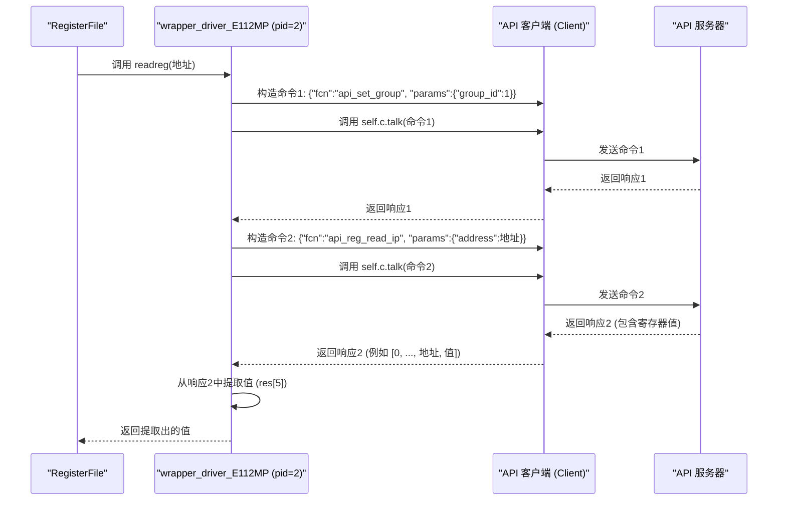

# Chapter 8: 驱动程序包装器 (wrapper_driver_*)


欢迎来到 `python_sdk` 教程的第八章，也是我们核心组件介绍的最后一章！在 [第 7 章：原型通信 (prototype_comm)](07_原型通信__prototype_comm__.md) 中，我们学习了 `prototype_comm` 如何像一个项目经理一样，根据指定的硬件架构（如 'E112MP'）自动选择和配置所需的组件，包括为每个硬件部分（如 PHYA, FPGA）实例化一个特定的驱动程序。

但是，我们留下了一个悬念：`prototype_comm` 选中的这些“驱动程序”具体是什么？它们是如何与 [第 6 章：寄存器文件 (RegisterFile)](06_寄存器文件__registerfile__.md) 协同工作的？`RegisterFile` 总是调用 `readreg(address)` 和 `writereg(address, data)` 这两个方法，但底层的硬件通信方式可能千差万别——有时是通过 ISDS 接口直接与硬件对话，有时是通过 JTAG 调试器，有时是像 E112MP 那样，通过 [API 客户端 (Client)](03_api_客户端__client__.md) 向一个服务器发送网络命令。`RegisterFile` 如何能够用同样的方式调用不同的底层通信机制呢？

这就是 **驱动程序包装器 (wrapper_driver_*)** 发挥作用的地方。

**把它们想象成“万能适配器”或“翻译器”。** 你的 `RegisterFile` 只会说一种“标准语言”（即调用 `readreg` 和 `writereg`），但不同的硬件接口可能说不同的“方言”（ISDS 命令、JTAG 指令、API 调用）。驱动程序包装器就是那个站在中间的翻译官，它懂得“标准语言”，也懂得特定硬件接口的“方言”。它将 `RegisterFile` 的标准请求翻译成底层接口能够理解的具体操作。

**核心用途示例：RegisterFile 如何与 E112MP 的 API 服务器通信？**

当 `prototype_comm` 为 E112MP 架构设置好 `RegisterFile` 后，你调用 `comms.phya_regfile.asr("SOME_REGISTER", 0x123)`。`phya_regfile` 会调用其绑定的驱动程序的 `writereg(address, data)` 方法。这个“驱动程序”实际上是一个 `wrapper_driver_E112MP` 实例。这个包装器如何将这个简单的 `writereg` 调用转换成发送给 API 服务器的具体 JSON 命令呢？这就是本章要解开的谜题。

## 什么是驱动程序包装器 (wrapper_driver_*)？

驱动程序包装器 (`wrapper_driver_*`，例如 `wrapper_driver_E112MP`, `wrapper_ISDS_driver`, `wrapper_ISDS_driver_IP_PCIE6` 等，通常定义在 `comms.py` 或类似文件中) 是一系列 Python 类，它们的核心职责是：

1.  **实现标准接口:** 提供统一的 `readreg(self, address)` 和 `writereg(self, address, data)` 方法，供 [RegisterFile](06_寄存器文件__registerfile__.md) 调用。
2.  **封装底层细节:** 在这些标准方法的内部，它们会调用实际的底层通信库或方法。这些底层方法根据包装器的类型而不同：
    *   `wrapper_driver_E112MP`：内部会持有一个 [API 客户端 (Client)](03_api_客户端__client__.md) 的实例，并调用 `client.talk()` 来发送构造好的 API 命令（如 `api_reg_read_ip`, `api_reg_write_fpga`）。
    *   `wrapper_ISDS_driver` / `wrapper_ISDS_driver_IP_PCIE6`: 内部会持有一个 ISDS 驱动的实例（如 `isds_driver_umr`），并调用其 `readreg` 或 `writereg` 方法，可能还需要进行地址转换（加上偏移量 `addr_offset`、位移 `shift_op` 等）。
    *   基于 JTAG 的包装器（如 `comms - back_up.py` 中的 `wrapper_driver` 配合 `Py_JTAG`）：内部会持有一个 JTAG 驱动实例（如 `ft`），并调用其特定的读写函数（如 `ft.read_register`, `ft.write_register`）。
3.  **区分硬件部分 (可选):** 像 `wrapper_driver_E112MP` 这样的包装器，在创建时会接收一个 `pid` (物理 ID)。在 `readreg`/`writereg` 内部，它会根据这个 `pid` 来决定调用哪个具体的 API 函数（例如，`pid=2` 调用 `api_reg_read_ip` 并设置 `group_id=1` 代表 PHYA，`pid=5` 调用 `api_reg_read_fpga` 代表 FPGA）。

它们就像是不同型号的电源适配器，虽然最终目的都是给设备供电（读写寄存器），但它们各自连接到不同的电源插座（底层通信方式），并将电压和接口转换成设备所需的标准（`readreg`/`writereg` 接口）。

```mermaid
graph LR
    A([RegisterFile](06_寄存器文件__registerfile__.md)) -- 调用标准接口 --> B{驱动程序包装器};
    subgraph "不同的包装器类型"
        B -- wrapper_driver_E112MP --> C(调用 Client.talk);
        B -- wrapper_ISDS_driver --> D(调用 isds_driver.readreg/writereg);
        B -- wrapper_JTAG_driver --> E(调用 jtag_driver.read/write);
    end
    C -- 使用 --> F([API 客户端 Client](03_api_客户端__client__.md));
    D -- 使用 --> G(ISDS 驱动库);
    E -- 使用 --> H(JTAG 驱动库);
    F --> I(硬件/API服务器);
    G --> I;
    H --> I;

    style B fill:#f9f, stroke:#333, stroke-width:2px;
    style F fill:#ccf, stroke:#333;
```

## 如何使用驱动程序包装器（解决我们的示例）？

作为 `python_sdk` 的最终用户，你通常**不需要直接创建或调用**驱动程序包装器。这个过程是隐藏在 [原型通信 (prototype_comm)](07_原型通信__prototype_comm__.md) 的初始化过程中的。

回顾一下 [第 7 章](07_原型通信__prototype_comm__.md) 的内容，当你创建 `prototype_comm` 实例时，例如：

```python
# (回顾自第 7 章)
from api_client.UREFE.common.prototype_com.comms import prototype_comm

# 指定架构和 .dat 文件路径
tc_architecture = 'E112MP'
ip_dat_path = 'path/to/ip_e112mp.dat'
fpga_dat_path = 'path/to/fpga_e112mp.dat'
# ... 其他路径 ...

# 创建 prototype_comm 实例
comms = prototype_comm(tc_architecture,
                      ip_dat_path=ip_dat_path,
                      fpga_dat_path=fpga_dat_path,
                      # ... 其他路径 ...
                      )
```

在 `prototype_comm` 的 `__init__` 方法内部，它会执行以下关键步骤（针对 E112MP 架构）：

1.  **选择包装器:** 它确定需要使用 `wrapper_driver_E112MP`。
2.  **实例化包装器:** 它为 PHYA (pid=2), PHYB (pid=1), FPGA (pid=5) 等分别创建 `wrapper_driver_E112MP` 的实例。
    ```python
    # prototype_comm 内部 (简化示意)
    ip_wrapper_PHYA = wrapper_driver_E112MP(self.ft, pid=2)
    fpga_wrapper    = wrapper_driver_E112MP(self.ft, pid=5)
    # ...
    ```
3.  **创建 RegisterFile:** 它创建对应的 `RegisterFile` 实例。
    ```python
    # prototype_comm 内部 (简化示意)
    self.phya_regfile = RegisterFile(wordsize=32)
    self.fpga_regfile = RegisterFile(wordsize=32)
    # ...
    ```
4.  **加载定义:** 调用 `load_dat()` 加载 `.dat` 文件。
    ```python
    # prototype_comm 内部 (简化示意)
    self.phya_regfile.load_dat(ip_dat_path)
    self.fpga_regfile.load_dat(fpga_dat_path)
    # ...
    ```
5.  **绑定:** 将创建好的**包装器实例**绑定到对应的 `RegisterFile` 实例。
    ```python
    # prototype_comm 内部 (简化示意)
    self.phya_regfile.bind(ip_wrapper_PHYA) # <--- 绑定发生在这里！
    self.fpga_regfile.bind(fpga_wrapper)    # <--- 绑定发生在这里！
    # ...
    ```

之后，当你调用 `comms.phya_regfile.agr()` 或 `comms.fpga_regfile.asr()` 时，`RegisterFile` 内部会调用其绑定的 `ip_wrapper_PHYA` 或 `fpga_wrapper` 实例的 `readreg` 或 `writereg` 方法。

**所以，驱动程序包装器是被 `prototype_comm` 自动选择和使用，并被 `RegisterFile` 调用的，用户代码通常不直接接触它们。** 它们是实现硬件通信抽象的关键“幕后功臣”。

## 驱动程序包装器是如何工作的？（幕后探秘）

让我们深入了解一下，当 `RegisterFile` 调用一个包装器（比如 `wrapper_driver_E112MP`）的 `readreg(address)` 方法时，内部发生了什么。

1.  **`RegisterFile` 调用:** 某个操作（如 `agr`）导致 `RegisterFile` 需要读取硬件，于是它调用 `self.readfun(address)`，这个 `self.readfun` 在 `bind()` 时被设置为了指向 `wrapper_driver_E112MP` 实例的 `readreg` 方法。
2.  **包装器 `readreg` 执行:** `wrapper_driver_E112MP` 的 `readreg(self, address)` 方法被执行。
3.  **获取底层通信工具:** 包装器实例内部持有与底层通信方式对应的工具。对于 `wrapper_driver_E112MP`，它持有一个 [API 客户端 (Client)](03_api_客户端__client__.md) 的实例，通常命名为 `self.c`。
4.  **识别目标硬件部分 (使用 pid):** 包装器实例还持有创建时传入的 `pid`（例如，PHYA 是 2，FPGA 是 5）。
5.  **构造底层命令:** `readreg` 方法根据 `pid` 和 `address` 构造出底层通信库所需的具体命令。
    *   对于 `pid=2` (PHYA)，它需要调用 IP 寄存器读取 API。它可能会先发送一个 `api_set_group` 命令来选择 PHYA (group_id=1)，然后构造 `{"fcn": "api_reg_read_ip", "params": {"address": address}}` 命令。
    *   对于 `pid=5` (FPGA)，它直接构造 `{"fcn": "api_reg_read_fpga", "params": {"address": address}}` 命令。
6.  **执行底层通信:** 包装器调用底层通信工具执行命令。`wrapper_driver_E112MP` 会调用 `self.c.talk(command)`。
7.  **解析结果:** 底层通信工具返回结果。`client.talk()` 会返回一个列表或字典。
8.  **提取并返回值:** 包装器的 `readreg` 方法从返回的结果中提取出实际的寄存器值（例如，从返回列表的第 6 个元素 `res[5]` 获取），然后将这个值返回给调用者 (`RegisterFile`)。

`writereg(self, address, data)` 的流程类似，只是构造的命令是写入命令（如 `api_reg_write_ip`），并且需要将 `data` 也包含在命令参数中。

下面是一个简化的时序图，展示了 `RegisterFile` 通过 `wrapper_driver_E112MP` 读取 PHYA 寄存器的过程：



### 代码一瞥

让我们看看 `wrapper_driver_E112MP` 和一个基于 ISDS 的包装器 (`wrapper_ISDS_driver_IP_PCIE6`) 的简化代码实现，以理解它们是如何工作的。

**1. `wrapper_driver_E112MP` (来自 `comms.py`)**

这个包装器使用 [API 客户端 (Client)](03_api_客户端__client__.md) 与后端服务器通信。

```python
# 文件: python_env\api_client\UREFE\common\prototype_com\comms.py (简化)
from client import Client # 导入 API 客户端

class wrapper_driver_E112MP():
    def __init__(self, ft, pid): # ft 在这个实现中似乎未使用
        """初始化包装器，保存 pid 并创建 Client 实例"""
        self.pid = pid
        # 关键：包装器内部创建并持有一个 Client 实例
        self.c = Client(port=27015) # 假设 API 服务器在 27015 端口
        print(f"  驱动包装器 E112MP (pid={pid}) 已创建。")

    def readreg(self, address):
        """标准读取方法：翻译成 API 调用"""
        print(f"  包装器(pid={self.pid}): readreg 地址 {hex(address)}")
        # 调用静态方法 read，传入 Client 实例、pid 和地址
        # 静态方法负责具体的 API 命令构造和发送
        res_value = wrapper_driver_E112MP.read(self.c, self.pid, address)
        print(f"  包装器(pid={self.pid}): 读取到值 {hex(res_value)}")
        return res_value

    def writereg(self, address, data):
        """标准写入方法：翻译成 API 调用"""
        print(f"  包装器(pid={self.pid}): writereg 地址 {hex(address)} 数据 {hex(data)}")
        # 调用静态方法 write，传入 Client 实例、pid、地址和数据
        wrapper_driver_E112MP.write(self.c, self.pid, address, data)
        print(f"  包装器(pid={self.pid}): 写入完成")
        return

    @staticmethod
    def write(c, pid, address, value):
        """静态方法：根据 pid 构造并发送写入 API 命令"""
        debug = 0
        api_fcn = None
        # 根据 pid 选择 API 函数名
        if pid == 1: # PHYB
            # set_group = {"fcn": "api_set_group", "params": {"group_id": 0}}
            # c.talk(set_group, debug) # 可能需要先设置组
            api_fcn = "api_reg_write_ip"
        elif pid == 2: # PHYA
            # set_group = {"fcn": "api_set_group", "params": {"group_id": 1}}
            # c.talk(set_group, debug)
            api_fcn = "api_reg_write_ip"
        elif pid == 5: # FPGA
            api_fcn = "api_reg_write_fpga"
        # ... (其他 pid 的情况) ...

        if api_fcn:
            # 构造命令字典
            command = {"fcn": api_fcn, "params": {"address": address, "value": value}}
            print(f"    发送写命令: {command}") # 调试信息
            # 通过 Client 发送命令
            c.talk(command, debug)
        else:
            print(f"错误: 未知的 pid {pid} 无法写入")

    @staticmethod
    def read(c, pid, address):
        """静态方法：根据 pid 构造并发送读取 API 命令"""
        debug = 0
        res = [None] * 6 # 模拟 API 返回格式
        api_fcn = None
        # 根据 pid 选择 API 函数名
        if pid == 1: # PHYB
            # 可能需要先设置组
            api_fcn = "api_reg_read_ip"
        elif pid == 2: # PHYA
            # 可能需要先设置组
            api_fcn = "api_reg_read_ip"
        elif pid == 5: # FPGA
            api_fcn = "api_reg_read_fpga"
        # ... (其他 pid 的情况) ...

        if api_fcn:
            # 构造命令字典
            command = {"fcn": api_fcn, "params": {"address": address}}
            print(f"    发送读命令: {command}") # 调试信息
            # 通过 Client 发送命令并获取响应
            res = c.talk(command, debug)
            # 从响应中提取值 (假设在第6个位置)
            result = res[5]
            return result
        else:
            print(f"错误: 未知的 pid {pid} 无法读取")
            return 0 # 返回默认值
```

**解释:**

*   `__init__` 创建了一个 [API 客户端](03_api_客户端__client__.md) 实例 `self.c` 并保存了 `pid`。
*   `readreg` 和 `writereg` 方法是提供给 `RegisterFile` 的标准接口。它们内部调用了静态方法 `read` 和 `write`。
*   静态方法 `read` 和 `write` 是真正执行翻译工作的地方。它们根据传入的 `pid` 决定要使用的 API 函数名（如 `"api_reg_read_ip"` 或 `"api_reg_write_fpga"`），然后构造包含地址和（对于写入）数据的命令字典。
*   最后，它们使用传入的 `Client` 实例 `c` 的 `talk()` 方法将命令发送出去，并（对于读取）从响应中提取结果。

**2. `wrapper_ISDS_driver_IP_PCIE6` (来自 `comms - back_up.py`)**

这个包装器使用 ISDS 驱动库与硬件通信，并执行地址转换。

```python
# 文件: python_env\api_client\UREFE\common\prototype_com\comms - back_up.py (简化)
# 假设 isds_driver_umr 类已经被导入或定义
# from .ISDSInterface import isds_driver_umr

class wrapper_ISDS_driver_IP_PCIE6():
    def __init__(self, isds_driver_instance, phy_subsystem_address, addr_offset, shift_op=0):
        """初始化包装器，保存 ISDS 驱动实例和地址转换参数"""
        # 关键：持有传入的底层 ISDS 驱动实例
        self.isds_driver = isds_driver_instance
        self.sub_system_addr = phy_subsystem_address # 子系统地址
        self.addr_offset = addr_offset             # 地址偏移量
        self.shift_op = shift_op                   # 地址位移操作
        print(f"  驱动包装器 ISDS PCIe6 已创建。")

    def readreg(self, address):
        """标准读取方法：翻译成 ISDS 调用 (PCIe6 特定序列)"""
        print(f"  包装器(ISDS): readreg 原始地址 {hex(address)}")
        # --- 执行 PCIe6 特定的读取序列 ---
        # 1. 写入地址低 16 位 (通过 ISDS 寄存器 52)
        self.isds_driver.writereg(self.sub_system_addr, 52 << 2, (address & 0xFFFF), custom=False)
        # 2. 写入地址高 16 位 (通过 ISDS 寄存器 152)
        self.isds_driver.writereg(self.sub_system_addr, 152 << 2, (address >> 16), custom=False)
        # 3. 发起读取请求 (写入 ISDS 寄存器 51, 值 1+4 表示读请求+pmd选择)
        self.isds_driver.writereg(self.sub_system_addr, 51 << 2, 1 + 4, custom=False)
        # 4. 读取数据低 16 位 (从 ISDS 寄存器 54)
        lower_data = self.isds_driver.readreg(self.sub_system_addr, 54 << 2, custom=False)
        # 5. 读取数据高 16 位 (从 ISDS 寄存器 154)
        upper_data = self.isds_driver.readreg(self.sub_system_addr, 154 << 2, custom=False)
        # 6. 合并数据
        readData = lower_data + (upper_data << 16)
        print(f"  包装器(ISDS): 读取到值 {hex(readData)}")
        return readData

    def writereg(self, address, data):
        """标准写入方法：翻译成 ISDS 调用 (PCIe6 特定序列)"""
        print(f"  包装器(ISDS): writereg 原始地址 {hex(address)} 数据 {hex(data)}")
        # --- 执行 PCIe6 特定的写入序列 ---
        # 1. 写入地址低 16 位 (ISDS 寄存器 52)
        self.isds_driver.writereg(self.sub_system_addr, 52 << 2, (address & 0xFFFF), custom=False)
        # 2. 写入地址高 16 位 (ISDS 寄存器 152)
        self.isds_driver.writereg(self.sub_system_addr, 152 << 2, (address >> 16), custom=False)
        # 3. 写入数据低 16 位 (ISDS 寄存器 53)
        self.isds_driver.writereg(self.sub_system_addr, 53 << 2, (data & 0xFFFF), custom=False)
        # 4. 写入数据高 16 位 (ISDS 寄存器 153)
        self.isds_driver.writereg(self.sub_system_addr, 153 << 2, (data >> 16), custom=False)
        # 5. 发起写入请求 (写入 ISDS 寄存器 51, 值 3+4 表示写请求+pmd选择)
        self.isds_driver.writereg(self.sub_system_addr, 51 << 2, 3 + 4, custom=False)
        print(f"  包装器(ISDS): 写入完成")
        return
```

**解释:**

*   `__init__` 保存了传入的底层 `isds_driver` 实例以及用于地址计算的参数 (`sub_system_addr`, `addr_offset`, `shift_op`)。
*   `readreg` 和 `writereg` 方法实现了 `RegisterFile` 所需的标准接口。
*   它们的内部逻辑不再是构造 API 命令，而是调用底层 `self.isds_driver` 的 `readreg` 和 `writereg` 方法。
*   **关键**：它们执行了一系列特定的 ISDS 寄存器读写操作来间接完成目标地址的读写，这展示了包装器如何封装特定硬件接口的复杂协议。例如，读取一个 32 位寄存器需要先设置地址（分两次写入），然后发起读请求，最后再分两次读取数据并组合。这种复杂性被完全隐藏在了包装器内部。

这两个例子清晰地展示了驱动程序包装器的核心功能：**提供统一接口，封装底层差异**。无论是通过网络 API 还是直接的硬件接口（如 ISDS），`RegisterFile` 都可以通过调用包装器的 `readreg`/`writereg` 来完成任务，而无需关心具体的实现细节。

## 总结

在本章中，我们揭开了驱动程序包装器 (`wrapper_driver_*)` 的神秘面纱：

*   我们理解了它们是**连接 `RegisterFile` 和底层通信库的桥梁**，像翻译器或适配器一样工作。
*   它们的核心作用是**提供统一的 `readreg`/`writereg` 接口**，同时**封装不同硬件通信方式（API Client, ISDS, JTAG 等）的实现细节**。
*   我们知道了它们通常由 [原型通信 (prototype_comm)](07_原型通信__prototype_comm__.md) 根据硬件架构**自动选择、实例化和绑定**到 `RegisterFile`，用户一般不直接操作它们。
*   我们通过 `wrapper_driver_E112MP` 和 `wrapper_ISDS_driver_IP_PCIE6` 的例子，看到了它们如何将标准的读写调用**翻译**成具体的 API 命令构造和发送，或者翻译成特定的底层驱动函数调用序列。

驱动程序包装器是 `python_sdk` 实现硬件抽象和灵活性的关键技术。它们使得上层代码（如验证脚本或 GUI）可以编写一次，就能通过 `prototype_comm` 和 `RegisterFile` 与使用不同通信接口的硬件进行交互。

**教程总结:**

恭喜你完成了 `python_sdk` 核心组件系列教程！我们从用户界面 [SDK GUI](01_sdk_gui_主应用程序__sdk_main_gui___pythongui__.md) 和 [验证脚本框架](02_验证脚本框架__validation_framework__.md) 开始，了解了如何与 SDK 交互以及如何自动化测试。接着，我们深入探讨了负责通信的 [API 客户端 (Client)](03_api_客户端__client__.md) 和管理设置的 [配置管理](04_配置管理__configuration_management__.md)。然后，我们学习了 SDK 如何理解硬件的语言——通过 [寄存器定义解析](05_寄存器定义解析__register_definition_parsing__.md) 和核心的 [寄存器文件 (RegisterFile)](06_寄存器文件__registerfile__.md)。最后，我们了解了 [原型通信 (prototype_comm)](07_原型通信__prototype_comm__.md) 如何协调这一切，以及本章介绍的 [驱动程序包装器](08_驱动程序包装器__wrapper_driver____.md) 如何适配不同的底层通信方式。

希望这个系列教程能帮助你更好地理解 `python_sdk` 的架构和工作原理，为后续使用和开发打下坚实的基础！

---

Generated by [AI Codebase Knowledge Builder](https://github.com/The-Pocket/Tutorial-Codebase-Knowledge)