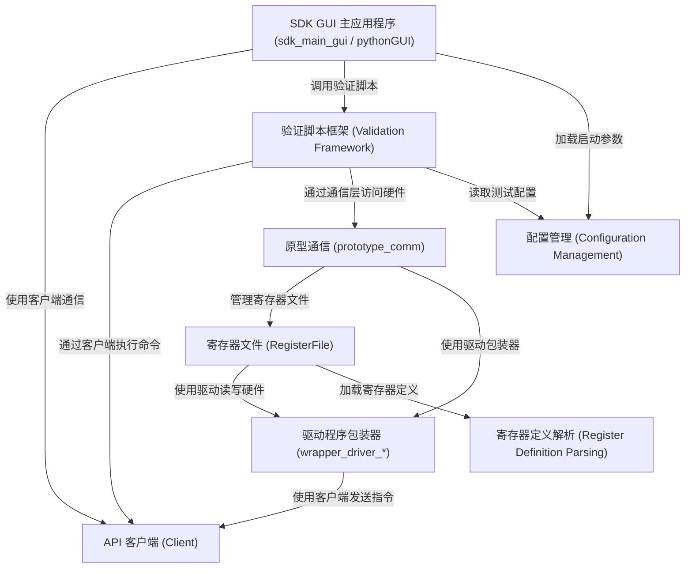

# Tutorial: python_sdk

该项目是一个 **Python SDK (软件开发工具包)**，旨在简化用户与 *硬件设备*（特别是 SERDES 芯片）的交互、配置和测试。
它提供了一个图形界面 (GUI)，用户可以通过该界面执行 **寄存器读写**、固件更新、运行 *自动化验证脚本* 等操作，无需编写复杂的底层代码。
SDK 内部封装了网络通信、寄存器映射、驱动程序调用等复杂性，提供了一套标准化的接口。

**Source Repository:** [None](None)

## Chapters

1. [SDK GUI 主应用程序 (sdk_main_gui / pythonGUI)
](01_sdk_gui_主应用程序__sdk_main_gui___pythongui__.md)
2. [验证脚本框架 (Validation Framework)
](02_验证脚本框架__validation_framework__.md)
3. [API 客户端 (Client)
](03_api_客户端__client__.md)
4. [配置管理 (Configuration Management)
](04_配置管理__configuration_management__.md)
5. [寄存器定义解析 (Register Definition Parsing)
](05_寄存器定义解析__register_definition_parsing__.md)
6. [寄存器文件 (RegisterFile)
](06_寄存器文件__registerfile__.md)
7. [原型通信 (prototype_comm)
](07_原型通信__prototype_comm__.md)
8. [驱动程序包装器 (wrapper_driver_*)
](08_驱动程序包装器__wrapper_driver____.md)

---

Generated by [AI Codebase Knowledge Builder](https://github.com/The-Pocket/Tutorial-Codebase-Knowledge)