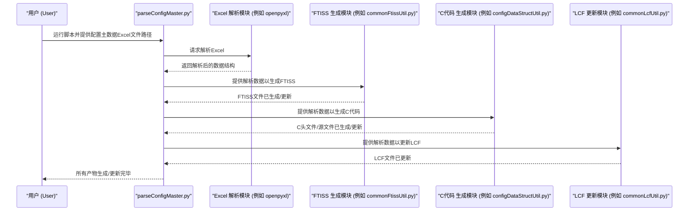

# Chapter 1: 配置主数据解析


欢迎来到 `scripts` 项目的入门教程！在本章中，我们将一起探索 `ParseConfigMaster` 模块，它是整个项目的核心“大脑”。

## 1.1 为什么需要配置主数据解析？

想象一下，你正在开发一个复杂的固件项目。这个固件需要根据不同的硬件版本、不同的运行模式进行配置。这些配置可能涉及到内存地址、寄存器设置、时钟频率等等，并且这些信息需要同步到代码文件（如 C 头文件、源文件）、链接器脚本、文档（如 FTISS 文件）等多个地方。

如果手动管理这些配置，会怎么样呢？
*   **效率低下**：每次配置变更，都需要手动修改所有相关文件。
*   **容易出错**：手动修改很容易遗漏或改错，导致固件行为异常甚至编译失败。
*   **难以维护**：随着项目越来越复杂，配置项越来越多，手动管理将成为一场噩梦。

`ParseConfigMaster` 模块就是为了解决这些问题而诞生的。它的核心思想是：**集中管理，自动同步**。

**核心用例：**
假设你需要为一个新的硬件版本调整某个模块的时钟频率。
*   **传统方式**：你可能需要找到对应的 C 语言宏定义并修改它，然后更新链接器脚本中相关的内存区域描述（如果影响了内存布局），接着修改 FTISS 文件中的相关参数以供其他团队参考，最后可能还要更新相关的开发文档。
*   **使用 `ParseConfigMaster`**：你只需要在被称为“配置主数据”的中央 Excel 文件中，找到对应的参数并修改其值。然后运行 `ParseConfigMaster` 脚本，所有相关的 C 文件、LCF 文件、FTISS 文件等都会被自动更新。

这就像一个高度自动化的秘书，你给它一份总纲（主配置文件），它就能帮你处理各种相关的细节文件，确保所有信息同步且一致。

## 1.2 什么是“配置主数据”？

“配置主数据”（Config Master Data）通常是一个精心设计的 Excel 文件。这个文件是所有固件配置信息的唯一真实来源 (Single Source of Truth)。它包含了固件运行所需的各种详细参数和设置。

这个 Excel 文件内部可能包含多个工作表 (Sheet)，每个工作表针对固件的不同方面或模块进行配置。例如，可能有一个工作表专门定义不同模块的寄存器默认值，另一个工作表定义不同模式下的 PLL (锁相环) 参数等。

下面是一个高度简化的概念性示例，展示了配置主数据中一个工作表可能的样子：

| 模块   | 参数名称             | 参数值 (模式A) | 参数值 (模式B) | 描述                     | FW_CTRL |
| :----- | :------------------- | :------------- | :------------- | :----------------------- | :------ |
| CM     | CM::clk_div_ratio    | 2              | 4              | 主模块时钟分频比         | Y       |
| TX     | TX::power_level      | 5              | 3              | 发射器功率等级           | Y       |
| RX     | RX::gain_setting     | 10             | 12             | 接收器增益设置           | N       |
| PMD    | PMD::lane_enable_mask| 0xFF           | 0x0F           | PMD通道使能掩码          | Y       |
| INFO   | F_REFCLK_OUT (MHz)   | 100            | 156.25         | 输出参考时钟频率         | -       |

*   **模块 (Module)**: 指示参数所属的硬件模块。
*   **参数名称 (Parameter Name)**: 参数的唯一标识符，通常带有层级结构。
*   **参数值 (Parameter Value)**: 针对不同模式或条件的具体配置值。
*   **描述 (Description)**: 对参数的简要说明。
*   **FW_CTRL**: 一个控制列，标记为 'Y' (Yes) 的参数才会被固件解析和使用。

`ParseConfigMaster` 模块会读取这个 Excel 文件，理解其中的结构和数据，然后根据这些信息执行后续的自动化任务。

## 1.3 `ParseConfigMaster` 的主要产出

当 `ParseConfigMaster` 模块解析完配置主数据后，它会自动生成或更新多种类型的产物文件。这些产物对于固件的编译、运行和文档化都至关重要。主要产出包括：

1.  **FTISS 文件**：
    *   **用途**：FTISS (Format for Technical Information and Standardized Settings) 文件是一种标准化的 Excel 格式，用于在不同团队或工具之间共享技术信息和配置设定。
    *   **如何生成**：`ParseConfigMaster` 会将解析后的配置数据按照 FTISS 规范格式化并写入新的 Excel 文件。
    *   **相关章节**：我们将在 [第 2 章：FTISS 文件处理](02_ftiss_文件处理_.md) 中详细讨论。

2.  **C 语言头文件 (.h) 和源文件 (.c)**：
    *   **用途**：这些 C 文件直接被固件代码包含和使用。头文件通常定义配置相关的结构体、枚举和宏；源文件则可能包含这些结构体的实例（即配置数据本身）或用于应用这些配置的函数。
    *   **如何生成**：脚本会根据 Excel 中的参数名和值，自动生成 C 语言的数据结构定义和初始化数据。
    *   **相关章节**：关于 C 结构体的生成，详见 [第 3 章：寄存器C结构生成](03_寄存器c结构生成_.md)。

3.  **链接器脚本 (LCF 文件)**：
    *   **用途**：LCF (Linker Command File) 文件指导链接器如何在最终的固件镜像中分配内存。配置数据的变化有时会影响内存布局（例如，某个配置查找表的大小改变了）。
    *   **如何生成**：脚本会根据解析到的配置数据大小，计算并更新 LCF 文件中相关的内存区域定义。
    *   **相关章节**：LCF 文件的处理和校验将在 [第 4 章：LCF 文件处理与校验](04_lcf_文件处理与校验_.md) 中介绍。

这些自动化的产出确保了所有相关文件都与配置主数据保持一致，极大地提高了开发效率和准确性。

## 1.4 `ParseConfigMaster` 是如何工作的？概览

`ParseConfigMaster` 模块本身是一个 Python 脚本，作为整个解析和生成过程的总指挥。它协调调用项目中的其他 Python 模块来完成特定任务。

下面是一个简化的流程图，展示了 `ParseConfigMaster` 的主要工作流程：



这个流程的核心步骤是：
1.  **接收输入**：用户通过命令行提供配置主数据 Excel 文件的路径。
2.  **解析 Excel**：主脚本 (`ParseConfigMaster/parseConfigMaster.py`) 调用相关工具库（如 `openpyxl`）和自定义的解析辅助模块（如 `ParseConfigMaster/commonParserUtil.py`）来读取和理解 Excel 中的数据。
3.  **分发任务**：主脚本将解析得到的数据传递给各个专门的生成/更新模块。
    *   例如，传递给 `ParseConfigMaster/ConfigDataBook/configDataFtissUtil.py` 和 `ParseConfigMaster/commonFtissUtil.py` 来处理 [FTISS 文件处理](02_ftiss_文件处理_.md)。
    *   传递给 `ParseConfigMaster/ConfigDataBook/configDataStructUtil.py` 和 `ParseConfigMaster/commonStructUtil.py` 来处理 [寄存器C结构生成](03_寄存器c结构生成_.md)。
    *   传递给 `ParseConfigMaster/commonLcfUtil.py` 来处理 [LCF 文件处理与校验](04_lcf_文件处理与校验_.md)。
4.  **生成产物**：各个模块根据接收到的数据，执行各自的逻辑，生成或更新对应的文件。
5.  **完成**：所有任务完成后，脚本退出。

## 1.5 核心组件与脚本结构

`ParseConfigMaster` 模块化设计使其易于维护和扩展。下面介绍一些关键的辅助脚本和配置文件：

### 1.5.1 配置文件: `ParseConfigMaster/__E224ParserConfig.py`

这个文件是整个解析器的“神经中枢设置面板”。它定义了许多全局常量和配置，指导解析器如何工作。例如：

*   需要解析的 Excel 工作表名称 (`gParsedSheets`)。
*   Excel 文件中数据表格的起始行/列偏移量 (`gRowOffset`, `gColumnOffset`)。
*   输出文件的命名约定。
*   硬件模块列表 (`gConfigDataModules`, `gPllModules`)。
*   支持的信号类型 (`gCfgMasterSignalTypeSupported`)。

```python
# ParseConfigMaster/__E224ParserConfig.py (部分示例)
gProject = "E224"  # 当前项目名称

# 需要解析的Excel工作表名称，区分大小写
gParsedSheets = ["CONFIG_DATA_BOOK", "PLLContexts"]

# 数据表上方的空行数 (用于移除表格边框填充)
gRowOffset = 1
# 数据表左侧的空列数 (用于移除表格边框填充)
gColumnOffset = 1

# 包含关键头部信息的行范围 (例如协议、速率_频率_位宽信息)
gKeyHeaderRowsRange = 2

# 信号名称和详情所在的列索引 (忽略边框填充后)
gSignalInfoHeaderColumnIdx = 1

# 支持的配置主数据信号类型
gCfgMasterSignalTypeSupported = ["PIN", "REG"] # 区分大小写
```
修改这个文件中的配置，可以改变解析器的行为，以适应不同的项目需求或 Excel 格式的微小变化。

### 1.5.2 通用解析工具: `ParseConfigMaster/commonParserUtil.py`

这个模块提供了一系列通用的辅助函数，用于简化 Excel 数据的解析过程。这些函数被项目的其他解析组件广泛复用。例如：

*   `toListAndRemovePaddings()`: 将 Excel 工作表对象转换为列表，并移除指定的边框填充。
*   `findSupportedHeaders()`: 查找并返回 Excel 表中所有标记为 "SUPPORTED" 的表头的行索引。
*   `populateSignalDict()`: 从原始表格数据中提取信号信息（行索引、信号位宽、原始字符串等），并按模块和依赖类型（如仅速率相关、宽度相关、时钟相关等）组织到不同的字典中。

设想一下，当你拿到一个原始的 Excel 工作表数据后，`populateSignalDict` 就像一个数据整理员，它会逐行扫描，识别出哪些是有效的信号，提取出信号的关键信息，并将其分门别类地存好，方便后续处理。

```python
# ParseConfigMaster/commonParserUtil.py (概念性调用示例)

# 假设 aRawTable 是从Excel工作表读取并经过初步处理的二维列表数据
# gConfigDataModules 是在 __E224ParserConfig.py 中定义的模块列表
# aSignalNameColumnIdx 等是信号名、控制列等的列索引

# signal_dictionaries_tuple = commonParserUtil.populateSignalDict(
#     aRawTable,
#     gConfigDataModules,
#     aSignalNameColumnIdx,
#     aFwCtrlIdx,
#     aWidthDepIdx,
#     aClkDepIdx
# )
# # signal_dictionaries_tuple 会包含多个字典，
# # 例如：所有信号的字典、仅速率依赖信号的字典、仅宽度依赖信号的字典等。
```
这个函数帮助将混杂的 Excel 数据结构化，为后续的 C 代码生成、FTISS 文件生成等步骤做好准备。

### 1.5.3 其他通用工具模块

除了 `commonParserUtil.py`，还有其他几个 `common*.py` 模块，各自负责一部分通用功能：

*   **`ParseConfigMaster/commonStructUtil.py`**: 包含生成 C 语言结构体（struct）时所需的通用函数。例如，它有函数可以将 Excel 中的信号名格式化为符合 C 语言规范的成员变量名，或者通过 `getOptimalBitFieldArrangement` 函数优化结构体成员的排列以节省内存。这部分内容与 [第 3 章：寄存器C结构生成](03_寄存器c结构生成_.md) 紧密相关。
*   **`ParseConfigMaster/commonFtissUtil.py`**: 封装了生成 FTISS Excel 文件所需的通用逻辑，例如初始化 FTISS 文件、写入表头、写入数据行等。更多细节请参考 [第 2 章：FTISS 文件处理](02_ftiss_文件处理_.md)。
*   **`ParseConfigMaster/commonLcfUtil.py`**: 提供了更新 LCF（链接器脚本）文件的通用功能。例如，`groupBlockHelper` 函数帮助计算特定配置块在内存中的大小，并格式化成 LCF 文件中的条目。相关内容见 [第 4 章：LCF 文件处理与校验](04_lcf_文件处理与校验_.md)。
*   **`ParseConfigMaster/commonObjAndIndexLutUtil.py`**: 负责生成固件中常用的一些 C 对象和查找表（LUT, Look-Up Table）。这些查找表使得固件能够根据索引快速查找到对应的配置数据。例如，`genCommonCfgMasterFiles` 函数会生成包含速率索引到实际数据映射关系的 C 文件。
*   **`ParseConfigMaster/commonSettingApplier.py`**: 生成 C 函数，这些函数的作用是将解析得到的配置值实际应用（写入）到硬件寄存器中。它会扫描硬件寄存器描述文件，找到与配置主数据中信号对应的寄存器和位域。

这些通用模块体现了“不要重复自己”（DRY - Don't Repeat Yourself）的编程原则，使得整个 `scripts` 项目更加模块化和易于管理。

### 1.5.4 主执行脚本: `ParseConfigMaster/__main__.py`

这是用户直接从命令行运行的入口脚本。它的主要职责是：

1.  **解析命令行参数**：接收用户输入的参数，最重要的就是配置主数据 Excel 文件的路径。还可能包括一些控制脚本行为的标志，如是否启用日志、日志级别、解析上下文（针对固件、SDK还是硬件）等。
2.  **参数校验**：检查输入参数的有效性，例如文件路径是否存在，硬件版本号格式是否正确。
3.  **初始化日志**：如果用户启用了日志记录，则配置日志系统。
4.  **调用核心解析逻辑**：调用 `ParseConfigMaster/parseConfigMaster.py`中的主函数 `parseConfigMaster()`，并将处理好的参数传递给它。

下面是 `__main__.py` 中核心部分的简化示意：
```python
# ParseConfigMaster/__main__.py (简化版)
# 此文件是命令行工具的入口点

# ... 导入所需模块 ...
from parseConfigMaster import parseConfigMaster # 从同级目录的 parseConfigMaster.py 导入主函数
# ...

if __name__ == "__main__":
    # 使用 argparse 解析命令行参数
    vParser = argparse.ArgumentParser(...)
    vParser.add_argument(dest="cfgMaster", ...) # 配置主数据Excel文件路径
    vParser.add_argument("-q", "--loggingEnabled", ...) # 是否禁用日志
    # ... 其他参数 ...
    _ParsedArgs = vParser.parse_args()

    vCfgMasterPath = _ParsedArgs.cfgMaster # 获取Excel文件路径
    # 从路径中提取硬件版本信息，例如 "x814_rel1p0"
    vHwVar = vCfgMasterPath.split('/')[-2]

    # ... 校验参数的有效性 ...

    # 如果启用了日志，进行日志相关设置
    if _ParsedArgs.loggingEnabled:
        # ... 配置日志 ...
        pass

    # 调用核心解析函数
    parseConfigMaster(vHwVar, vCfgMasterPath,
                      _ParsedArgs.loggingEnabled,
                      _ParsedArgs.parseForSDK + _ParsedArgs.parseForHW) # 传递解析上下文
```
用户通过运行这个脚本来启动整个配置主数据的解析和产物生成流程。

### 1.5.5 核心协调器: `ParseConfigMaster/parseConfigMaster.py`

这个脚本中的 `parseConfigMaster()` 函数是整个流程的“大脑”或“总指挥”。它按照预定的顺序，一步步地调用其他模块来完成任务。其主要工作流程可以概括为以下几个阶段：

1.  **初始化与预处理**：
    *   加载配置主数据 Excel 文件。
    *   对每个需要解析的工作表（例如 "CONFIG_DATA_BOOK", "PLLContexts"）进行预处理，如去除换行符、合并单元格填充等，得到干净的原始表格数据。这是通过 `preProcessExcelSheet()` 函数完成的。

2.  **解析核心数据表**：
    *   针对 "CONFIG_DATA_BOOK" 工作表：调用 `parseConfigData()` 函数（位于 `parseConfigMaster.py` 内部，但主要逻辑委托给 `ConfigDataBook/configDataParserUtil.py`）。这一步会提取出所有与配置数据手册相关的信号、它们的依赖关系、以及原始的速率索引等信息。
    *   针对 "PLLContexts" 工作表：调用 `parsePllContext()` 函数（类似地，主要逻辑委托给 `PllContexts/pllParserUtil.py`）。这一步提取 PLL 上下文相关的配置。

3.  **生成 C 语言结构体**：
    *   使用 `ConfigDataBook/configDataStructUtil.py` 和 `PllContexts/pllStructUtil.py` 中的 `genStructFiles()` 函数，为 "CONFIG_DATA_BOOK" 和 "PLLContexts" 解析出的数据分别生成对应的 C 语言头文件和源文件。这些文件定义了固件中用来存储配置数据的数据结构。细节请看 [第 3 章：寄存器C结构生成](03_寄存器c结构生成_.md)。

4.  **生成配置应用函数 (Setting Applier)**：
    *   调用 `commonSettingApplier.genDefaultSettingApplier()`。这个函数会生成 C 代码，这些代码负责在固件运行时将解析出来的配置值应用（写入）到实际的硬件寄存器中。

5.  **生成通用对象和索引查找表 (LUT)**：
    *   调用 `commonObjAndIndexLutUtil.genCommonCfgMasterFiles()`。此函数会生成一些固件通用的 C 文件（例如 `common_config_master_defaults.c/h`），其中包含重要的枚举定义和查找表。这些查找表帮助固件根据特定的索引（如速率索引）快速定位到相应的配置数据集。

6.  **更新链接器脚本 (LCF)**：
    *   调用 `commonLcfUtil.updateLcf()`。根据解析到的配置数据（特别是各个配置块的大小），更新 `arc.lcf` 文件中相应的内存区域定义。这确保了固件的内存布局与实际配置数据的大小相符。详见 [第 4 章：LCF 文件处理与校验](04_lcf_文件处理与校验_.md)。

7.  **生成 FTISS 文件**：
    *   分别调用 `ConfigDataBook/configDataFtissUtil.py` 和 `PllContexts/pllFtissUtil.py` 中的 `genFtissFile()` 函数，为 "CONFIG_DATA_BOOK" 和 "PLLContexts" 的数据生成对应的 FTISS Excel 文件。这些文件用于团队间的信息共享和文档化。具体内容见 [第 2 章：FTISS 文件处理](02_ftiss_文件处理_.md)。

下面是 `parseConfigMaster()` 函数内部流程的简化示意：
```python
# ParseConfigMaster/parseConfigMaster.py (简化流程示意)

def parseConfigMaster(aHwVar, aCfgMasterPath, aLoggingEnabled, aParsingContext):
    # ... 初始化日志等 ...

    # 加载 Excel 工作簿
    vExlBook = openpyxl.load_workbook(aCfgMasterPath, data_only=True)

    # === 阶段 1: 解析配置主数据 Excel 工作表 ===
    print(f"\n{' STAGE 1: PARSE CONFIG MASTER ':=^64}")
    # 解析 CONFIG_DATA_BOOK 工作表
    vConfigDataRawTable = preProcessExcelSheet(vExlBook[gParsedSheets[0]])
    # 调用 parseConfigData 获取解析后的对象
    (vLineRateDepObj, vWidthDepObj, ...) = parseConfigData(vConfigDataRawTable)
    vConfigDataObj = (vLineRateDepObj, vWidthDepObj, ...) # 打包对象

    # 解析 PLLContexts 工作表
    vPllRawTable = preProcessExcelSheet(vExlBook[gParsedSheets[1]])
    (vPllObj, ...) = parsePllContext(vPllRawTable)

    # === 阶段 2: 生成 .c/.h 文件中的结构体 ===
    print(f"\n{' STAGE 2: STRUCT ':=^64}")
    # 为 CONFIG_DATA_BOOK 生成结构体
    vConfigDataStructGroup = __E224ParserConfig.gConfigDataOutputNamesDict[__E224ParserConfig.gProject]
    configDataStructUtil.genStructFiles(aHwVar, aCfgMasterPath, vConfigDataStructGroup, ...)
    # 为 PLLContexts 生成结构体
    pllStructUtil.genStructFiles(aHwVar, aCfgMasterPath, ...)

    # === 阶段 3: 生成 apply_config_master_defaults.c/.h 中的设置应用函数 ===
    print(f"\n{' STAGE 3: DEFAULT SETTING APPLIER ':=^64}")
    commonSettingApplier.genDefaultSettingApplier(aHwVar, aCfgMasterPath, vConfigDataObj, vPllObj)

    # ... 如果是 HW 上下文，则提前返回 ...

    # === 阶段 4: 生成 common_config_master.c/.h 中的索引 LUT 和枚举 ===
    print(f"\n{' STAGE 4: INDEX LUT & ENUM ':=^64}")
    commonObjAndIndexLutUtil.genCommonCfgMasterFiles(aHwVar, aCfgMasterPath, ...)

    # === 阶段 5: 更新 arc.lcf ===
    print(f"\n{' STAGE 5: ARC.LCF ':=^64}")
    commonLcfUtil.updateLcf(aHwVar, ...)

    # === 阶段 6: 生成 FTISS 文件 ===
    print(f"\n{' STAGE 6: FTISS ':=^64}")
    configDataFtissUtil.genFtissFile(aHwVar, ...)
    pllFtissUtil.genFtissFile(aHwVar, ...)

    print("所有任务完成！")
```
通过这种分阶段、模块化的处理方式，`ParseConfigMaster` 能够清晰、高效地完成从原始Excel配置到多种目标产物的自动转换。

## 1.6 总结与展望

在本章中，我们初步认识了 `ParseConfigMaster` 模块——这个项目中的“核心大脑”。我们了解到：

*   **它为何存在**：为了解决手动管理复杂固件配置带来的低效、易错和维护困难的问题。
*   **它的核心输入**：一个中央“配置主数据”Excel 文件，作为所有配置的唯一真实来源。
*   **它的主要产出**：自动生成的 FTISS 文件、C 语言头文件和源文件、以及更新后的链接器脚本 (LCF 文件)。
*   **它的工作方式**：通过主控脚本 `parseConfigMaster.py` 协调一系列专用模块（通用工具模块、特定工作表处理模块等）来完成解析和生成任务。
*   **关键组件**：如 `__E224ParserConfig.py` (全局配置)、`commonParserUtil.py` (通用解析)、`__main__.py` (入口) 和 `parseConfigMaster.py` (核心协调器)。

`ParseConfigMaster` 的目标是实现配置管理的自动化和一致性，将开发人员从繁琐的手动同步工作中解放出来。

我们已经对配置主数据解析的核心概念有了初步了解。在下一章中，我们将深入探讨第一个具体的产物类型：[第 2 章：FTISS 文件处理](02_ftiss_文件处理_.md)，看看它是如何被生成和使用的。

---

Generated by [AI Codebase Knowledge Builder](https://github.com/The-Pocket/Tutorial-Codebase-Knowledge)