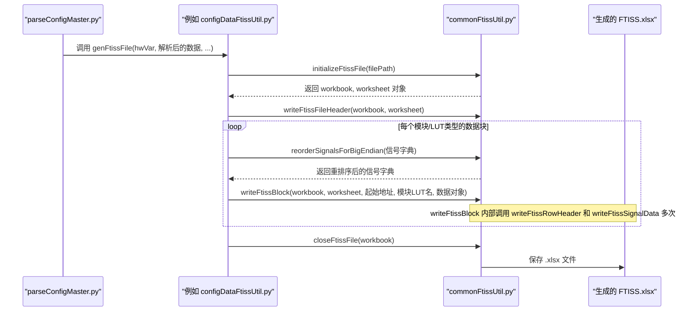

# Chapter 2: FTISS 文件处理


在上一章 [配置主数据解析](01_配置主数据解析_.md) 中，我们了解了 `ParseConfigMaster` 模块如何作为项目的“核心大脑”，集中处理和分发配置信息。它的一项重要任务就是生成 FTISS 文件。本章，我们将深入探讨 FTISS 文件本身，以及 `scripts` 项目中用于创建、读取和验证这些文件的脚本工具。

## 2.1 什么是 FTISS 文件？为什么它很重要？

想象一下，你正在参与一个大型的固件开发项目，其中涉及到多个团队：硬件设计团队、固件开发团队、系统验证团队，甚至还有客户支持团队。这些团队都需要准确、一致地了解固件的各种技术细节。FTISS 文件正是为了满足这一需求而设计的。

**FTISS (固件测试接口规范表 - Firmware Test Interface Specification Sheet)** 通常是一个标准化的 Excel 文件。它就像是固件的“蓝图”或“详细说明书”，详细定义了以下关键信息：

*   **内存映射 (Memory Map)**：固件中各个模块、数据结构在内存中的具体地址和布局。
*   **硬件寄存器布局 (Hardware Register Layout)**：芯片上各个硬件寄存器的地址、名称、位域 (bit fields) 定义、以及它们的复位后默认值 (Post Reset Value)。
*   **固件配置参数 (Firmware Configuration Parameters)**：固件运行时使用的各种配置参数，例如不同工作模式下的参数设置、校准值等。

**打个比方：**
如果把固件开发比作建造一座高科技大楼，那么：
*   “配置主数据” (我们在 [配置主数据解析](01_配置主数据解析_.md) 中讨论过) 就像是项目的总设计规划书。
*   FTISS 文件则像是从这份总规划书中派生出的、针对特定部分（如电路系统、暖通空调系统）的详细施工图纸和材料清单。

**FTISS 文件的重要性体现在：**

1.  **标准化沟通**：为不同团队和工具提供了一种通用的、标准化的格式来描述和交换固件技术信息。这减少了因格式不统一而导致的误解和沟通障碍。
2.  **权威文档**：作为固件寄存器、内存布局和配置参数的重要参考文档。当对某个寄存器的功能或某个配置参数的含义有疑问时，FTISS 文件是查找答案的权威来源之一。
3.  **自动化基础**：许多自动化工具依赖 FTISS 文件作为输入。例如，测试脚本可能读取 FTISS 来了解如何访问特定寄存器，或者文档生成工具可能基于 FTISS 自动生成部分用户手册内容。
4.  **确保一致性**：通过脚本自动生成 FTISS 文件，可以确保其内容与“配置主数据”等源信息保持一致，避免了手动维护可能引入的错误。

在 `scripts` 项目中，有一套专门的脚本负责创建、读取和验证这些 FTISS Excel 文件，确保这份“蓝图”的准确性和可用性。

## 2.2 FTISS 文件的“诞生”：由 `ParseConfigMaster` 自动生成

正如我们在 [配置主数据解析](01_配置主数据解析_.md) 中提到的，`ParseConfigMaster` 模块的一个主要产出就是 FTISS 文件。当配置主数据 Excel 文件发生变更后，运行 `ParseConfigMaster` 脚本会自动更新相应的 FTISS 文件。

**核心用例：**
假设一位工程师在“配置主数据”Excel 文件中修改了某个模块 `TX` 的一个寄存器 `TX_CTRL` 中某个位域 `ENABLE_FEATURE_X` 的默认值。当 `ParseConfigMaster` 脚本运行时，它会：
1.  读取并解析“配置主数据”中的这个变更。
2.  在其第 6 阶段（生成 FTISS 文件阶段）调用相关的 FTISS 生成工具。
3.  自动更新或重新生成包含 `TX` 模块寄存器定义的 FTISS 文件（例如，一个名为 `config_data_book_ftiss.xlsx` 的文件），确保其中 `TX_CTRL` 寄存器 `ENABLE_FEATURE_X` 位域的“Post Reset Value”反映了最新的修改。

这样，其他依赖此 FTISS 文件的团队或工具就能获取到最新的寄存器默认值信息。

### FTISS 文件长什么样？

一个典型的 FTISS Excel 文件包含多个列，用于详细描述每个寄存器及其位域。以下是一个高度简化的 FTISS 文件片段示例，展示了一个名为 `MODULE_A_CONFIG` 的寄存器：

| NOTE | NAME                       | TYPE   | Post Reset Value | Bits  | Description              | Ahex | Adec | MSB | LSB | RegSize | BitSize |
| :--- | :------------------------- | :----- | :--------------- | :---- | :----------------------- | :--- | :--- | :-- | :-- | :------ | :------ |
| REG  | 0x0000                     | CONFIG | FW-Ignore        | module_a_config[0] | Module A Configuration Word 0 | 0000 | 0    |     |     | 32      |         |
|      | FEATURE_ENABLE             | RW     | 0b1              | 0     | Enable a specific feature| 0000 | 0    | 0   | 0   |         | 1       |
|      | MODE_SELECT                | RW     | 0b10             | 2:1   | Select operation mode    | 0000 | 0    | 2   | 1   |         | 2       |
|      | RESERVED                   | RW     | 0b0...0          | 31:3  | Reserved bits            | 0000 | 0    | 31  | 3   |         | 29      |
| REG  | 0x0004                     | CONFIG | FW-Ignore        | module_a_data[0]   | Module A Data Word 0      | 0004 | 4    |     |     | 32      |         |
|      | DATA_VALUE                 | RW     | 0x00000000       | 31:0  | Data value for Module A  | 0004 | 4    | 31  | 0   |         | 32      |

**关键列解释：**
*   **NOTE**: 特殊标记，例如 "REG" 表示这是一个寄存器/字 (word) 的起始行。
*   **NAME**: 寄存器或位域的名称。对于 "REG" 行，通常是寄存器的地址；对于位域行，是位域的名称。
*   **TYPE**: 访问类型，例如 "RW" (可读写)，"RO" (只读)。"CONFIG" 通常用于 "REG" 行。
*   **Post Reset Value**: 位域的复位后默认值，通常以二进制 (0b) 或十六进制 (0x) 表示。
*   **Bits**: 位域在寄存器中的位置。例如 "0" 表示第0位，"2:1" 表示第1位到第2位。
*   **Description**: 对寄存器或位域的文字描述。
*   **Ahex / Adec**: 寄存器的十六进制地址和十进制地址。
*   **MSB / LSB**: 位域的最高有效位 (Most Significant Bit) 和最低有效位 (Least Significant Bit)。
*   **RegSize**: 寄存器的大小（例如32位）。
*   **BitSize**: 位域的大小（占多少位）。

`ParseConfigMaster` 会从配置主数据中提取信息，并按照这种标准格式填充到 FTISS Excel 文件中。

### 涉及的主要生成脚本

`ParseConfigMaster` 在生成 FTISS 文件时，主要依赖以下几个脚本：

1.  **`ParseConfigMaster/ConfigDataBook/configDataFtissUtil.py`**: 负责处理从配置主数据的 "CONFIG_DATA_BOOK" 工作表解析出来的数据，并生成对应的 FTISS 文件（例如 `config_data_book_ftiss.xlsx`）。
2.  **`ParseConfigMaster/PllContexts/pllFtissUtil.py`**: 负责处理从 "PLLContexts" 工作表解析出来的数据，并生成对应的 FTISS 文件（例如 `pll_contexts_ftiss.xlsx`）。
3.  **`ParseConfigMaster/commonFtissUtil.py`**: 这是一个通用的 FTISS 工具模块，被上述两个脚本调用。它提供了写入 FTISS 文件头、行数据、处理字节序等基础功能。我们将在后面详细介绍它。

此外，`ParseConfigMaster` 可能还会调用 `pkgGenAdaptValsFtiss.py`（通过 `ParseConfigMaster/commonConfigAdapters.py`）来生成一些特定的 FTISS 文件，例如 `master_config_vals_ftiss.xlsx`，它汇总了某些自适应算法的配置值。

## 2.3 FTISS 文件的“体检”：使用 `ftissValidityCheck.py` 进行校验

生成 FTISS 文件只是第一步，我们还需要确保这些“蓝图”与最终的“建筑物”（即编译好的固件）完全一致。`ftissValidityCheck.py` 脚本就是为此而生的“质检员”。

**核心用例：**
固件团队刚刚编译完成了一个新版本的固件，生成了 `E224_hex.fw` 文件。与此同时，`ParseConfigMaster` 也基于最新的配置主数据生成了相关的 FTISS 文件。现在，工程师需要验证：FTISS 文件中描述的寄存器默认值、内存布局等信息，是否与实际固件镜像中的情况完全吻合？

此时，工程师会运行 `ftissValidityCheck.py` 脚本。

**它如何工作？**

1.  **输入**：
    *   固件的十六进制镜像文件路径 (例如 `./x812_rel2p1/E224_hex.fw`)。
    *   包含 FTISS 文件和 `fw_memory_map.csv` 文件的目录路径 (例如 `./x812_rel2p1`)。`fw_memory_map.csv` 文件描述了固件中不同模块的基地址以及它们各自对应的 FTISS 文件名。

2.  **处理流程**：
    *   `parseFwHexFile()`: 解析固件的 `.fw` 文件，提取出内存中每个地址实际存储的值。
    *   `parseFwMemoryMapFile()`: 读取 `fw_memory_map.csv`，找到每个模块（如 `TX_REGS`, `RX_REGS`）的基地址和它关联的 FTISS 文件（如 `tx_regs_ftiss.xlsx`）。
    *   对于 `fw_memory_map.csv` 中列出的每个 FTISS 文件：
        *   `parseFtiss()`: 解析该 FTISS Excel 文件，提取出每个寄存器及其位域的定义，特别是它们的地址和“Post Reset Value”（复位后默认值）。
    *   `compareMemoryMap()`: 核心比较步骤。它会逐个地址比较从 `.fw` 文件中读取到的实际值和从 FTISS 文件中解析出的期望值。

3.  **输出**：
    *   如果所有值都匹配，脚本会报告成功。
    *   如果发现任何不一致，脚本会打印出详细的差异报告，指出哪个地址、哪个位域的值不匹配，以及期望值和实际值分别是什么。

**如何运行 `ftissValidityCheck.py`？**

该脚本通常通过命令行运行，需要提供固件 hex 文件路径和 FTISS 文件目录路径作为参数。

```bash
python ftissValidityCheck.py ./x812_rel2p1/E224_hex.fw ./x812_rel2p1
```

下面是 `ftissValidityCheck.py` 中 `main()` 函数的简化版，展示了参数的接收和核心函数的调用：

```python
# ftissValidityCheck.py (简化版 main 函数)
import argparse
import sys

# ... 其他导入和全局变量 ...
# gCPUtoAPBOffset = "0x10000" # CPU 地址到 APB 地址的偏移量

def main() -> None:
    argParser = argparse.ArgumentParser(
        description="验证 fw_memory_map.csv 和相关的 FTISS 文件是否与编译后的固件匹配。"
    )
    argParser.add_argument("fwhex", help="固件 hex 文件路径, 例如: ./x812_rel2p1/E224_hex.fw")
    argParser.add_argument("ftiss", help="FTISS 文件目录路径, 例如: ./x812_rel2p1")
    argParser.add_argument(
        "--offset",
        dest="offset",
        default=gCPUtoAPBOffset, # 默认偏移量
        help=f"十六进制偏移量，会从 FTISS 地址中减去 (用于 APB 到 CPU 地址转换)。默认值 {gCPUtoAPBOffset}。"
    )
    args = argParser.parse_args()

    # 1. 解析固件 hex 文件
    hexMemoryMap = parseFwHexFile(args.fwhex) # 返回 {地址: 值} 字典

    # 2. 解析 fw_memory_map.csv 和相关的 FTISS 文件
    #    int(args.offset, 16) 将十六进制字符串偏移量转为整数
    ftissMemoryMap, ftissNameMap = parseFwMemoryMapFile(args.ftiss, int(args.offset, 16)) # 返回 {地址: 值} 和 {地址: 位域信息}

    # 3. 比较两个内存映射
    success = compareMemoryMap(hexMemoryMap, ftissMemoryMap, ftissNameMap)

    sys.exit(0 if success else 1) # 成功则返回0，失败则返回1

if __name__ == "__main__":
    main()
```
这个校验步骤至关重要，它确保了 FTISS 这份“蓝图”的权威性和准确性，是固件质量保障的重要环节。

## 2.4 其他 FTISS 生成工具

除了 `ParseConfigMaster` 之外，`scripts` 项目中还有一些其他的独立脚本也用于生成特定类型的 FTISS 文件。这些工具通常服务于特定的场景。

### 2.4.1 `genFwConfigFtiss.py`: 从 C 代码生成 FTISS

有些固件配置参数（例如，某些校准数据结构或自适应算法的参数）可能是直接在 C 语言的头文件 (.h) 和源文件 (.c) 中定义和初始化的，而不是通过配置主数据 Excel 文件管理。为了给这些直接在代码中定义的配置也生成标准化的 FTISS 文档，就可以使用 `genFwConfigFtiss.py` 脚本。

**核心用例：**
项目中有 `fw_cal_config.h` 和 `fw_cal_config.c` 文件，它们定义了一系列校准相关的结构体和全局变量，并赋予了初始值。为了方便其他团队查阅这些校准参数的详细布局和默认值，工程师可以运行：

```bash
python genFwConfigFtiss.py x812_rel2p1
```
(其中 `x812_rel2p1` 是硬件版本)

该脚本会：
1.  **词法分析 (Lexing)**：读取指定的 C 头文件 (例如 `fw_cal_config.h`)，将其分解为一系列的词法单元 (token)，例如关键字 `struct`、标识符、类型 `uint32_t`、操作符 `{`, `;` 等。`Lexer` 类负责此任务。
2.  **语法分析 (Parsing)**：基于这些词法单元，解析出 C 代码中定义的结构体 (struct) 名称、成员变量名、位宽等信息。`Parser` 类负责此任务。
3.  **提取初始化数据**：解析对应的 C 源文件 (例如 `fw_cal_config.c`)，找到结构体变量的初始化值。
4.  **生成 FTISS**：将解析到的结构体定义和初始化数据，按照 FTISS 格式写入到 Excel 文件中 (例如 `fw_cal_config_ftiss.xlsx`)。这个过程通常会使用 `pkgGenFtissClass.py` 中的工具类。

`genFwConfigFtiss.py` 中的 `Lexer` 如何找到 FTISS 文件名？
它会查找 C 代码注释中特定格式的指令，例如：
```c
// FTISS: fw_tx_cal_config_ftiss.xlsx
struct tFwTxCalConfig_t gFwTxCalConfig = { ... };
```
`Lexer` 在解析注释时，会识别出 `// FTISS: ftiss_name.xlsx` 这样的模式，并提取出 FTISS 文件名。

### 2.4.2 `pkgGenFtissClass.py`: 通用 FTISS 生成类

这个 Python 模块 (`pkgGenFtissClass.py`) 提供了一个名为 `genFtiss` 的类和一个工厂函数 `createFtiss`，它们是许多独立 FTISS 生成脚本（如 `genFwConfigFtiss.py`, `genNwayAdaptFtiss.py`, `pkgGenAdaptValsFtiss.py`）的底层工具。

它封装了创建 FTISS Excel 文件的通用逻辑，例如：
*   创建工作簿和工作表。
*   写入标准的 FTISS 列标题。
*   根据输入数据，格式化并写入代表寄存器 ("REG" 行) 和位域的行。
*   处理数值转换（例如，十进制转为特定位宽的二进制字符串，并添加下划线分隔）。
*   设置单元格样式（例如，加粗、背景色）。

`genFtiss` 类的 `createFtiss` 方法（或者更准确地说是模块级的 `createFtiss` 函数）是其主要入口点。它接收一个特定格式的数据列表和目标 FTISS 文件路径，然后生成相应的 Excel 文件。

数据列表的格式大致如下：
```python
# pkgGenFtissClass.py 的 createFtiss 函数期望的数据格式示例
# List[List[List[word_name, field_name, field_val, field_width]]]
# 最外层列表代表所有数据
# 中间层列表代表一个 "Word" (通常是一个32位寄存器)
# 最内层列表代表一个 "Field" (位域)
aDataList = [
    [ # 第一个 Word (例如，地址 0x00)
        ["my_module_config_reg", "ENABLE_FEATURE_A", 1, 1], # [字名称, 字段名, 字段值, 字段位宽]
        ["my_module_config_reg", "MODE", 2, 2],
        ["my_module_config_reg", "RESERVED", 0, 29]
    ],
    [ # 第二个 Word (例如，地址 0x04)
        ["my_module_status_reg", "STATUS_FLAG_X", 0, 1],
        ["my_module_status_reg", "ERROR_CODE", 0, 7]
        # ... 可能还有更多字段，或者一个大的 RESERVED 字段补齐32位
    ]
]
# pkgGenFtissClass.createFtiss(aDataList, "output_ftiss.xlsx")
```

### 2.4.3 其他专用 FTISS 生成脚本

还有一些更 spezifische 的脚本，例如：
*   **`genNwayAdaptFtiss.py`**: 专门为 N-Way Adaptation (一种自适应算法) 的 FFE (前馈均衡器) 提示值 (cursor hints) 生成 FTISS 文件 (`nway_adapt_vals_ftiss.xlsx`)。它内部定义了这些提示值的数据结构，并使用 `pkgGenFtissClass.createFtiss` 来生成文件。
*   **`pkgGenPwrupPwrdnTablesFtiss.py`**: 解析一个名为 `master_pmd_sequence_tables.xlsx` 的更高级别的 Excel 文件（其中定义了上电、掉电序列中的硬件命令和参数），并从中提取信息生成 `pwrup_pwrdn_tables_ftiss.xlsx`。这个 FTISS 文件详细描述了上电/掉电序列中每个步骤的命令、参数和控制标志。

这些专用脚本展示了 FTISS 格式的灵活性，它可以用来描述各种类型的固件相关数据。

## 2.5 深入幕后：FTISS 文件的生成过程 (`ParseConfigMaster` 篇)

现在，让我们回到 `ParseConfigMaster` 自动生成 FTISS 文件的主流程。当 `ParseConfigMaster` 解析完配置主数据后，它如何将这些信息转换成 FTISS Excel 文件呢？

这个过程可以简化为以下序列图：



核心的 FTISS 生成逻辑主要封装在 `ParseConfigMaster/commonFtissUtil.py` 模块中，而像 `ParseConfigMaster/ConfigDataBook/configDataFtissUtil.py`这样的模块则负责准备数据并调用 `commonFtissUtil.py` 中的函数。

### `ConfigDataBook/configDataFtissUtil.py` (和 `PllContexts/pllFtissUtil.py`)

以 `configDataFtissUtil.py` 中的 `genFtissFile` 函数为例，它的主要职责是：

1.  **接收数据**：从 `parseConfigMaster.py` 接收解析后的配置数据对象（例如 `aConfigDataObj`，包含了不同依赖类型的数据），以及重用的一些对象（`aConfigDataRecycledObj`，如优化后的位域排列），还有简化的速率组信息 (`aReducedGroupRatesDict`)。
2.  **初始化 FTISS 文件**：
    *   确定输出 FTISS 文件名和路径 (例如 `doc/x814_rel1p0/config_data_book_ftiss.xlsx`)。
    *   调用 `commonFtissUtil.initializeFtissFile()` 创建一个新的 Excel 工作簿和工作表。
    *   调用 `commonFtissUtil.writeFtissFileHeader()` 写入标准的 FTISS 列标题。
3.  **迭代处理数据块**：
    *   遍历所有硬件模块 (CM, RX, TX 等)。
    *   对于每个模块，遍历不同的 LUT (查找表) 类型（例如，基础速率依赖、宽度依赖、时钟依赖等）。
    *   **准备数据**：
        *   从传入的对象中提取当前模块和 LUT 类型对应的信号信息。
        *   获取之前阶段计算好的、经过优化的位域排列 (`_OptimizedSignalInfoDict`)。
        *   调用 `commonFtissUtil.reorderSignalsForBigEndian()` 对信号进行重排序，以适配大端字节序在 FTISS 中的表示。这个函数确保在一个32位字内部，位域的列出顺序是从高地址位（或后定义的位域）到低地址位（或先定义的位域），这样当它们按顺序填充时，可以正确表示大端格式。
        *   构建传递给 `writeFtissBlock` 的数据对象 `_DepObj`。
    *   **写入数据块**：调用 `commonFtissUtil.writeFtissBlock()`，传入工作簿、工作表、当前块的起始地址、模块和LUT类型的名称，以及准备好的数据对象。`writeFtissBlock` 会负责将这整块数据写入 FTISS 文件，并返回下一个可用地址。
4.  **关闭文件**：所有数据块写入完毕后，调用 `commonFtissUtil.closeFtissFile()` 保存 Excel 文件。

下面是 `ConfigDataBook/configDataFtissUtil.py` 中 `genFtissFile` 函数的简化骨架：
```python
# ParseConfigMaster/ConfigDataBook/configDataFtissUtil.py (简化骨架)
import os
import __E224ParserConfig
import commonFtissUtil # 导入通用 FTISS 工具

def genFtissFile(aHwVar: str, aStructGroup: dict, aConfigDataObj, aConfigDataRecycledObj, aReducedGroupRatesDict: dict) -> None:
    # ... (解包输入对象 aConfigDataObj 等) ...
    (vRateToColDataDict, vModuleToSignalInfoDict, vRateIdxConvertDict) = vLineRateDepObj # 示例解包
    vModuleToBitArrangement = aConfigDataRecycledObj

    vFileName = __E224ParserConfig.gFtissFileNameConfigData # 例如 "config_data_book_ftiss.xlsx"
    vFilePath = os.path.join(__E224ParserConfig.gDocPath(aHwVar), vFileName)
    print(f"正在生成 {vFileName}...", end='', flush=True)

    vWorkbook, vWorksheet = commonFtissUtil.initializeFtissFile(vFilePath) # 初始化文件
    commonFtissUtil.writeFtissFileHeader(vWorkbook, vWorksheet) # 写入文件头

    vStartAdress = 0 # 初始化起始地址

    for vModule in vModuleToSignalInfoDict: # 遍历模块，例如 CM, RX, TX
        for vIdx, [vLutType, vDepObj] in enumerate(vLutTypeOrderDict.items()): # 遍历 LUT 类型
            if vDepObj is None: continue # 跳过无效的 LUT 类型

            # ... (为当前模块和 LUT 类型准备 _RateToColDataDict, _ModuleToSignalInfoDict 等) ...
            # ... (处理 _ReducedGroupRatesDict) ...

            if len(_ModuleToSignalInfoDict[vModule]) > 0: # 如果当前模块在此 LUT 类型下有信号
                _OptimizedSignalInfoDict = vModuleToBitArrangement[vModule][vIdx] # 获取优化后的信号信息
                _ReversedSignalsInfoDict = commonFtissUtil.reorderSignalsForBigEndian(_OptimizedSignalInfoDict) # 大端重排序

                _ModuleLutType = aStructGroup["variableNames"][".xlsx"][vIdx](vModule.lower()) # 生成 FTISS 中的 LUT 名称
                _DataForBlock = (_RateToColDataDict, _ReversedSignalsInfoDict, _RateIdxConvertDict, _ReducedGroupRatesDict)

                # 核心调用：写入一个数据块
                vStartAdress = commonFtissUtil.writeFtissBlock(vWorkbook, vWorksheet, vStartAdress, _ModuleLutType, _DataForBlock)

    commonFtissUtil.closeFtissFile(vWorkbook) # 保存文件
    print("完成")
```

### `commonFtissUtil.py` (通用 FTISS 工具)

这个模块是实际执行 FTISS 文件写入操作的核心。它提供了一系列函数来构建 FTISS Excel 文件：

*   **`initializeFtissFile(aFilePath)`**:
    *   使用 `xlsxwriter` 库创建一个新的 Excel 工作簿 (`Workbook`)。
    *   在工作簿中添加一个名为 "APB" 的工作表 (`Worksheet`)。
    *   返回工作簿和工作表对象。
    ```python
    # commonFtissUtil.py (部分)
    import xlsxwriter
    # ...
    gFtissSheetName = "APB"

    def initializeFtissFile(aFilePath):
        vWorkbook = xlsxwriter.Workbook(aFilePath) # 创建工作簿
        vWorksheet = vWorkbook.add_worksheet(gFtissSheetName) # 添加工作表
        return vWorkbook, vWorksheet
    ```

*   **`writeFtissFileHeader(aWorkbook, aWorksheet)`**:
    *   获取 `gFtissColTitles` (一个包含所有标准 FTISS 列名的列表)。
    *   在工作表的第一行 (行号0) 写入这些列标题，并设置为粗体。
    *   初始化一个全局行计数器 `gExcelRowCounter`。
    ```python
    # commonFtissUtil.py (部分)
    gFtissColTitles = ["NOTE", "NAME", "TYPE", "Post Reset Value", ...] # 完整的列名列表
    gExcelRowCounter = None

    def writeFtissFileHeader(aWorkbook, aWorksheet) -> None:
        global gExcelRowCounter
        vCellFormat = aWorkbook.add_format()
        vCellFormat.set_bold(True) # 设置粗体
        aWorksheet.write_row(0, 0, gFtissColTitles, vCellFormat) # 写入第一行
        gExcelRowCounter = 1 # 从第二行开始写数据 (1-indexed for data rows)
    ```

*   **`writeFtissRowHeader(aWorkbook, aWorksheet, aRow)`**:
    *   用于写入 "REG" 类型的行，即标记一个新寄存器（或字）的开始。
    *   `aRow` 是一个包含该行所有单元格数据的列表。
    *   在当前 `gExcelRowCounter` 指示的行写入 `aRow`。
    *   对特定列（如 "NOTE", "TYPE", "Post Reset Value", "Bits", "Description"）的单元格应用特殊格式（例如，加粗、背景色）。
    *   增加 `gExcelRowCounter`。
    ```python
    # commonFtissUtil.py (部分)
    def writeFtissRowHeader(aWorkbook, aWorksheet, aRow) -> None:
        global gExcelRowCounter
        aWorksheet.write_row(gExcelRowCounter, 0, aRow) # 写入行数据
        # ... (应用格式化，例如背景色和粗体) ...
        # vCellFormat = aWorkbook.add_format({'bold': True, 'bg_color': '#DCECFC'})
        # aWorksheet.conditional_format(f"A{gExcelRowCounter+1}:A{gExcelRowCounter+1}", {"type": "no_blanks", "format": vCellFormat})
        gExcelRowCounter += 1
    ```

*   **`writeFtissSignalData(aWorksheet, aRow)`**:
    *   用于写入描述具体位域 (signal/field) 的数据行。
    *   `aRow` 是包含该位域所有信息的列表。
    *   在当前 `gExcelRowCounter` 指示的行写入 `aRow`。
    *   增加 `gExcelRowCounter`。

*   **`reorderSignalsForBigEndian(aSignalInfoDict)`**:
    *   输入 `aSignalInfoDict` 是一个字典，键是信号名，值是 `[行索引, 位域大小]`。
    *   在 FTISS 中，对于大端系统，一个32位字内的位域通常按从高位到低位或者某种特定顺序排列。这个函数确保从配置主数据解析出来的信号（可能按原始顺序）在写入 FTISS 前被正确地重新排序。
    *   它会按32位对信号进行分组，然后反转每个组内信号的顺序。这确保了当这些信号按新顺序逐个写入FTISS时，它们在概念上的32位字中处于正确的大端位置。

*   **`writeFtissBlock(aWorkbook, aWorksheet, aStartDecAddr, aModuleLutType, aDataObj)`**:
    *   这是一个核心的包装函数，负责写入一个完整的 FTISS 数据块（例如，一个模块在特定速率下的所有相关寄存器和位域）。
    *   **参数**：
        *   `aStartDecAddr`: 当前数据块的起始十进制地址。
        *   `aModuleLutType`: FTISS 中显示的模块和 LUT 类型名称 (例如 "cm_base", "rx_width_dep")。
        *   `aDataObj`: 一个元组，包含 `(速率到列数据字典, 重排序后的信号信息字典, 速率索引转换字典, 简化的速率组字典)`。
    *   **逻辑**：
        *   遍历 `aReducedGroupRatesDict` 中的每个“锚点速率” (`vAnchorRate`) 及其关联的“简化速率组” (`vReducedRates`)。**重要**：为了避免在 FTISS 中出现指向相同内存地址的重复条目（这会干扰其他工具），通常只为锚点速率（或简化速率组中的第一个速率）实际生成 FTISS 条目。
        *   内部调用 `__writeHeader` 来为每个32位字写入 "REG" 行。`__formatRateName` 用于格式化速率名称。
        *   内部调用 `__writeSignalsInWordBlocks` (或类似逻辑) 来迭代 `aDataObj` 中提供的信号信息 (`vReversedSignalsInfoDict`)。
        *   对于每个信号：
            *   计算其在 FTISS 行中的各个值（如 "Post Reset Value", "Bits", "MSB", "LSB", "Description"）。
            *   调用 `writeFtissSignalData()` 写入该信号行。
            *   管理位计数器，当达到32位时，开始新的 "REG" 行和新的字地址。
        *   返回此数据块写入完毕后的下一个可用十进制地址。

    ```python
    # commonFtissUtil.py writeFtissBlock 简化示意
    def writeFtissBlock(aWorkbook, aWorksheet, aStartDecAddr: int, aModuleLutType: str, aDataObj):
        # ... 解包 aDataObj ...
        (vRateToColDataDict, vReversedSignalsInfoDict, vRateIdxConvertDict, vReducedGroupRatesDict) = aDataObj
        vWordIncrement = __E224ParserConfig.gRegisterLength // 8 # 通常是 4 (32位系统)

        vCurrentBlockStartAddr = aStartDecAddr
        for vAnchorRate, vReducedRateGroupList in vReducedGroupRatesDict.items():
            # 只为简化速率组中的第一个速率生成 FTISS 条目 (避免重复)
            vRateToProcess = vReducedRateGroupList[0]
            vFormattedRateName = __formatRateName(vRateToProcess) # 内部辅助函数，格式化速率名

            vBitCount = 0
            vWordCount = 0
            vCurrentDecAddrForRate = vCurrentBlockStartAddr # 每个锚点速率块从新的起始地址开始

            for _SignalName, (_RowIdx, _BitFieldSize) in vReversedSignalsInfoDict.items():
                if vBitCount == 0: # 每个新字开始时
                    vHexAddr = commonUtils.dec2hex(vCurrentDecAddrForRate, None, True, True)
                    # 调用 __writeHeader (或直接调用 writeFtissRowHeader)
                    # ... 准备 REG 行数据 ...
                    writeFtissRowHeader(aWorkbook, aWorksheet, reg_row_data)

                # ... (从 vRateToColDataDict 和 _RowIdx 获取信号值) ...
                # ... (准备信号行数据 _SignalRow) ...
                writeFtissSignalData(aWorksheet, _SignalRow)
                vBitCount += _BitFieldSize

                if vBitCount >= __E224ParserConfig.gRegisterLength: # 到达字边界
                    vBitCount = 0
                    vWordCount += 1
                    vCurrentDecAddrForRate += vWordIncrement
            # 更新下一个锚点速率块的起始地址
            vCurrentBlockStartAddr = vCurrentDecAddrForRate # 或者 vCurrentBlockStartAddr += (vWordCount * vWordIncrement)
        return vCurrentBlockStartAddr # 返回下一个可用的起始地址
    ```

通过这些模块的协同工作，`ParseConfigMaster` 能够高效、准确地将配置主数据中的信息转换为符合规范的 FTISS Excel 文件。

## 2.6 深入幕后：FTISS 文件的校验过程 (`ftissValidityCheck.py` 篇)

`ftissValidityCheck.py` 脚本通过一系列步骤来确保 FTISS 文件与固件镜像的一致性：

1.  **`parseFwHexFile(path)`**:
    *   读取指定的固件 `.fw` 文件 (例如 `E224_hex.fw`)。这种文件通常包含一系列地址和对应的数据值。
    *   脚本逐行解析文件，提取地址和数据。`.fw` 文件中的地址可能是4字节对齐的字地址，需要乘以4转换为字节地址。
    *   构建并返回一个字典 `memoryMap = {字节地址: 4字节整数值}`，代表固件镜像的实际内存内容。
    ```python
    # ftissValidityCheck.py (部分 parseFwHexFile)
    def parseFwHexFile(path: str) -> dict:
        # ... (检查文件是否存在) ...
        print(f"正在解析固件 hex 文件 {path}")
        memoryMap = {}
        with open(path, "r") as file:
            for line in file.readlines():
                # 示例行: "00000000/DEADBEEF;" (地址/值)
                line = line.replace(";\n", "").replace(" ", "")
                addr4Str, valStr = line.split("/") # addr4Str 是字地址
                # ... (处理地址范围情况) ...
                addr_byte = int(addr4Str, 16) * 4 # 转换为字节地址
                memoryMap[addr_byte] = int(valStr, 16) # 存储字节地址和值
        return memoryMap
    ```

2.  **`parseFwMemoryMapFile(dirPath, globalOffset)`**:
    *   读取位于 `dirPath` 目录下的 `fw_memory_map.csv` 文件。
    *   这个 CSV 文件定义了固件中各个重要模块（如 `CM_REGS`, `TX_REGS`）的基地址（通常是 APB/AHB 地址）以及它们各自对应的 FTISS 文件名。
    *   遍历 `fw_memory_map.csv` 的每一行：
        *   提取模块名、APB/AHB 地址、以及备注中包含的 FTISS 文件名 (例如，从 "Registers for TX (tx_regs_ftiss.xlsx)" 中提取 `tx_regs_ftiss.xlsx`)。
        *   对于每个找到的 FTISS 文件，调用 `parseFtiss()` 函数进行解析。
        *   `globalOffset` 用于将 FTISS 中的 APB 地址转换成 CPU 视角下的 ICCM 地址。
    *   返回两个字典：一个是从所有 FTISS 文件汇总得到的 `memoryMap = {地址: 值}`，另一个是 `nameMap = {地址: [位域信息列表]}` 用于调试。

3.  **`parseFtiss(path, baseAddress, memoryMap, nameMap)`**:
    *   使用 `pandas` 库读取指定的 FTISS Excel 文件 (`path`)。
    *   `baseAddress` 是当前 FTISS 文件所描述模块在内存中的基地址。
    *   遍历 FTISS 文件中所有描述位域的行（通常 `NOTE` 列不为 "REG" 的行）。
    *   对于每个寄存器（由相同的 `Adec` 值标识）：
        *   逐个读取其位域的 "Post Reset Value" 和 "Bits" 定义。
        *   将所有位域的 "Post Reset Value"（二进制字符串）拼接起来，转换成一个完整的32位整数值。
        *   计算该寄存器的绝对地址 (`int(row["Adec"]) + baseAddress`)。
        *   将计算得到的 {绝对地址: 32位整数值}存入传入的 `memoryMap` 字典。
        *   同时，存储位域的名称、起止位、值等信息到 `nameMap`，用于后续比较失败时提供更详细的错误信息。
    ```python
    # ftissValidityCheck.py (parseFtiss 简化逻辑)
    def parseFtiss(path: str, baseAddress: int, memoryMap: dict, aNameMap: dict) -> None:
        # ... (读取 Excel, 过滤非字段行) ...
        vDf = pd.read_excel(path, header=0, engine="openpyxl", na_values="")
        vDf = vDf[vDf.NOTE != "REG"] # 只关心位域行

        for _, fields_in_word in vDf.groupby("Adec"): # 按 Adec (十进制偏移) 分组，每个组是一个字
            current_word_address = 0
            binary_string_for_word = "" # 用于拼接一个字的所有位域的二进制值

            for _, field_row in fields_in_word.iterrows():
                current_word_address = int(field_row["Adec"]) + baseAddress
                # 将 Post Reset Value (二进制字符串) 前插 (因为FTISS通常高位在前)
                binary_string_for_word = str(field_row["Post Reset Value"]) + binary_string_for_word
                # ... (解析 Bits 列，填充 aNameMap) ...

            binary_string_for_word = binary_string_for_word.replace("_", "") # 去掉下划线
            word_value = int(binary_string_for_word, base=2) # 转换为整数
            memoryMap[current_word_address] = word_value
    ```

4.  **`compareMemoryMap(hexMemoryMap, ftissMemoryMap, aFtissNameMap)`**:
    *   获取 `hexMemoryMap` (来自固件) 和 `ftissMemoryMap` (来自FTISS文件) 中所有共同存在的地址。
    *   遍历这些共同地址：
        *   比较两个字典中对应地址的值。
        *   如果不相等，表示存在差异：
            *   打印错误信息，包括地址、固件中的值、FTISS中的值。
            *   使用 `aFtissNameMap` 查找在该地址下具体是哪些位域的值不匹配，并打印出来，帮助定位问题。
            *   增加全局错误计数器 `gErrorCount`。
    *   最后报告总共检查的字节数、未检查的字节数以及最终的错误计数。如果 `gErrorCount` 为0，则校验通过。

这个校验过程确保了 FTISS 作为“设计蓝图”与固件这一“实际产品”之间的高度一致性。

## 2.7 总结与展望

在本章中，我们深入了解了 FTISS 文件——固件项目的“蓝图”和“说明书”。我们学习了：

*   **FTISS 是什么**：它是一种标准化的 Excel 文件，用于详细描述固件的内存映射、寄存器布局和配置参数。
*   **FTISS 的重要性**：它促进团队沟通，作为权威文档，是自动化的基础，并帮助确保信息一致性。
*   **FTISS 的主要生成方式**：通过运行 `ParseConfigMaster` 脚本，可以根据“配置主数据”自动生成或更新 FTISS 文件。核心的生成逻辑由 `ParseConfigMaster/commonFtissUtil.py` 提供，并由 `ConfigDataBook/configDataFtissUtil.py` 和 `PllContexts/pllFtissUtil.py` 等模块针对特定数据进行调用。
*   **FTISS 的校验**：`ftissValidityCheck.py` 脚本可以将 FTISS 文件中的内容与编译后的固件镜像进行比较，以验证其准确性。
*   **其他 FTISS 工具**：还存在如 `genFwConfigFtiss.py` (从C代码生成FTISS) 和 `pkgGenFtissClass.py` (通用的FTISS生成底层库) 等工具，服务于不同的FTISS创建需求。

理解 FTISS 文件的处理对于固件开发和验证至关重要，因为它关系到不同团队能否基于一份准确、一致的信息进行协作。

在 [配置主数据解析](01_配置主数据解析_.md) 中，我们看到 `ParseConfigMaster` 不仅生成 FTISS 文件，还会生成 C 语言的头文件和源文件。在下一章 [第 3 章：寄存器C结构生成](03_寄存器c结构生成_.md) 中，我们将详细探讨这些 C 代码是如何根据配置主数据自动生成的。

---

Generated by [AI Codebase Knowledge Builder](https://github.com/The-Pocket/Tutorial-Codebase-Knowledge)