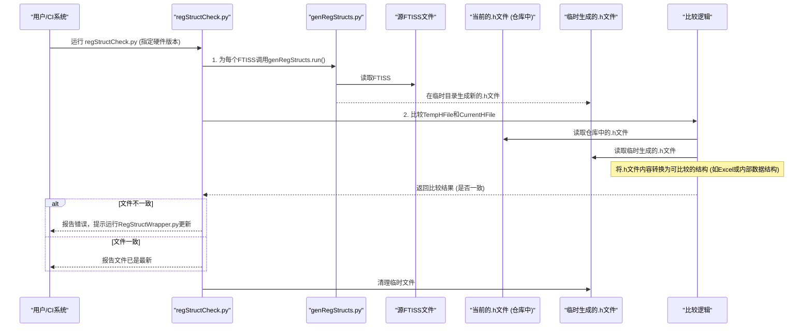

# Chapter 3: 寄存器C结构生成


在上一章 [FTISS 文件处理](02_ftiss_文件处理_.md) 中，我们探讨了 FTISS 文件作为固件“蓝图”的重要角色，以及 `scripts` 项目如何生成和校验它们。FTISS 文件详细描述了硬件寄存器的布局。现在，我们将学习如何利用这些信息，为固件开发生成 C 语言的结构体 (struct)，使得访问这些硬件寄存器更加安全、便捷和直观。

## 3.1 为什么要为寄存器生成C结构体？

想象一下，你是一位固件工程师，需要控制一个复杂的硬件设备。这个设备上有许多“旋钮”和“开关”，在硬件层面，这些就是**寄存器 (Register)**。每个寄存器有特定的地址，内部可能还划分成多个**位域 (Bit-field)**，每个位域控制硬件的某个特定功能。

**核心用例：**
假设你需要为一个名为 `PERIPH_A` 的外设模块，启用其 `MODULE_CTRL` 寄存器（在模块内的偏移地址为 `0x100`）中的 `FEATURE_XYZ` 功能。该功能由这个寄存器的第5位控制。

**传统方式（直接操作内存地址）：**
你可能会这样写C代码：
```c
#define PERIPH_A_BASE_ADDR 0x40010000 // 外设A的基地址
#define MODULE_CTRL_OFFSET 0x100      // MODULE_CTRL寄存器的偏移
#define FEATURE_XYZ_BIT_POS 5         // FEATURE_XYZ 位的位置

// 启用功能
*(volatile uint32_t*)(PERIPH_A_BASE_ADDR + MODULE_CTRL_OFFSET) |= (1 << FEATURE_XYZ_BIT_POS);

// 禁用功能
*(volatile uint32_t*)(PERIPH_A_BASE_ADDR + MODULE_CTRL_OFFSET) &= ~(1 << FEATURE_XYZ_BIT_POS);
```
这种方法有什么问题呢？
*   **易出错**：“魔法数字”（如 `0x100`, `5`）容易写错，且不直观。如果硬件设计变更，这些数字需要手动在代码中各处修改。
*   **可读性差**：代码难以理解每个数字的含义，除非配合详尽的文档。
*   **维护困难**：随着寄存器和位域增多，这种代码会变得非常难以管理。

**使用C结构体的方式：**
如果我们可以将 `PERIPH_A` 模块的所有寄存器抽象成一个C结构体，代码会变成什么样呢？
```c
// 假设 PERIPH_A_REG_BASE 是一个指向硬件模块内存映射区域的结构体指针
// 并且 MODULE_CTRL 是该结构体的一个成员，FEATURE_XYZ 是 MODULE_CTRL 内的一个位域成员

// 启用功能
PERIPH_A_REG_BASE.MODULE_CTRL.mFields.FEATURE_XYZ = 1;

// 禁用功能
PERIPH_A_REG_BASE.MODULE_CTRL.mFields.FEATURE_XYZ = 0;
```
这种方式的优点显而易见：
*   **类型安全**：编译器可以检查你是否正确访问了成员。
*   **可读性高**：代码清晰地表达了操作意图。
*   **易于维护**：如果寄存器布局或位域位置改变，只需要更新 FTISS 文件并重新运行脚本生成新的结构体定义，固件代码通常无需修改（或只需少量修改）。

本章介绍的脚本，就是将 [FTISS 文件处理](02_ftiss_文件处理_.md) 中讨论的 FTISS 文件（硬件寄存器的“蓝图”）自动转换成这些方便易用的 C 语言结构体定义的“遥控器按键”。

## 3.2 生成的C结构体是什么样的？

这些脚本会为每个硬件模块生成一个 `.h` 头文件（例如 `pmd_reg_structs.h`, `tx_reg_structs.h`）。文件中主要包含以下几种C定义：

1.  **寄存器联合体 (Union)**：为每个寄存器定义一个 `union`。
2.  **位域结构体 (Struct)**：在 `union` 内部定义一个匿名 `struct` 来描述该寄存器的所有位域。
3.  **模块封装结构体 (Wrapper Struct)**：定义一个大的 `struct`，将模块内所有寄存器的联合体实例作为其成员，从而映射整个模块的寄存器空间。
4.  **访问宏 (Access Macro)**：定义一个宏，方便地获取指向模块封装结构体的指针。

让我们看一个简化的例子。假设我们有如下的 FTISS 文件片段，描述了 `MODULE_A` 中的一个寄存器 `CONFIG_REG`：

**FTISS 文件 (`module_a_ftiss.xlsx` 的一部分):**
| NOTE | NAME         | TYPE | Post Reset Value | Bits | Description        | Ahex | BitSize |
| :--- | :----------- | :--- | :--------------- | :--- | :----------------- | :--- | :------ |
| REG  | 0x0004       | RW   |                  | module_a_config_reg[0] | Configuration Reg  | 0004 | 32      |
|      | ENABLE       | RW   | 0b0              | 0    | Enable bit         | 0004 | 1       |
|      | MODE         | RW   | 0b01             | 2:1  | Mode select        | 0004 | 2       |
|      | INT_THRESHOLD| RW   | 0x0A             | 7:3  | Interrupt Threshold| 0004 | 5       |
|      | RESERVED     | RW   | 0                | 31:8 | Reserved           | 0004 | 24      |

脚本会生成类似这样的 C 代码 (`module_a_reg_structs.h`):
```c
// ... (版权和包含等头信息) ...

// 为 CONFIG_REG (地址 0x0004) 生成的联合体和结构体
typedef union MODULE_A__CONFIG_REG_U // 名称通常由 模块名__寄存器名_U 构成
{
    uint32_t mReg; // 允许以32位整数方式整体读写寄存器
    struct
    {
        // 位域声明顺序通常与硬件小端模式下的内存布局对应
        // FTISS中从上到下是低位到高位, 脚本内部可能反转顺序处理
        uint32_t ENABLE           :1;  // 名称来自 FTISS 的 NAME 列，宽度来自 BitSize 列
        uint32_t MODE             :2;
        uint32_t INT_THRESHOLD    :5;
        uint32_t RESERVED0        :24; // RESERVED 位域名会自动编号
    } mFields; // 允许按位域访问
} MODULE_A__CONFIG_REG_T; // 类型定义

// (可能还有其他寄存器的定义...)

// 为 MODULE_A 所有寄存器生成的封装结构体
typedef struct tHwModuleA
{
    // 假设 0x0000 是一个 RESERVED 区域
    MODULE_A_RESERVED_T RESERVED_0; // 用于填充地址间隙，确保后续成员地址正确
    MODULE_A__CONFIG_REG_T CONFIG_REG; // CONFIG_REG 在偏移 0x0004
    // ... 其他寄存器实例 ...
} tHwModuleA_t;

// 访问宏，用于获取模块寄存器映射的基地址指针
// GLOBAL_REG_BASE 是全局基地址，MODULE_A_BASE 是模块的偏移
#define MODULE_A_REG_BASE   (*(volatile tHwModuleA_t*)(GLOBAL_REG_BASE + MODULE_A_BASE))
```
通过 `MODULE_A_REG_BASE.CONFIG_REG.mFields.ENABLE = 1;` 这样的代码，固件就可以清晰、安全地操作硬件了。

## 3.3 核心脚本 `genRegStructs.py`：从FTISS到C代码

`genRegStructs.py` 脚本是实现这一转换的核心。它读取一个 FTISS Excel 文件，解析其中的寄存器和位域定义，然后生成对应的 C 语言头文件。

**工作流程概览：**
1.  **输入参数解析**：脚本接收 FTISS 文件路径作为输入，并从中推断出模块名称（例如，从 `tx_ftiss.xlsx` 推断出模块名 `tx`）。
2.  **解析FTISS**：使用 `pandas` 库读取 FTISS 文件的 "APB" 工作表。
3.  **数据提取与转换**：
    *   遍历 FTISS 的每一行。
    *   如果是 "REG" 行，记录下当前寄存器的名称（通常基于其在 FTISS 中的 "Bits" 列，如 `module_a_config_reg[0]`）。
    *   如果是位域行，提取位域的名称 ("NAME")、大小 ("BitSize") 和它所属的寄存器地址 ("Ahex")。
    *   将这些信息组织成一个按寄存器地址分组的数据结构。
4.  **生成C代码**：
    *   为每个寄存器地址组生成一个 `typedef union`。
    *   在 `union` 内部，为该寄存器的所有位域生成一个 `struct mFields` 定义。脚本会注意位域的顺序，确保它们在内存中正确排列（通常通过反转 FTISS 中的位域顺序实现，如 `sigs.iloc[::-1]`)。
    *   特殊处理名为 "RESERVED" 的位域，通过添加计数器（如 `RESERVED0`, `RESERVED1`）来避免命名冲突。
    *   生成一个顶层的 `typedef struct tHw<ModuleName>_t`，它包含了模块内所有已定义的寄存器联合体实例。
    *   如果寄存器地址之间存在间隙，会插入 `RESERVED_X` 占位结构体 (`<ModuleName>_RESERVED_T`)。
    *   最后，生成一个访问宏，如 `MODULE_A_REG_BASE`。

### 3.3.1 解析输入参数 (`inputParser`)

`genRegStructs.py` 脚本首先需要知道要处理哪个 FTISS 文件以及输出到哪里。
```python
# genRegStructs.py (inputParser 函数简化示意)
def inputParser(aCLInputList: list) -> tuple:
    vInputPath = aCLInputList[INPUT_FILE] # 通常是 sys.argv[1]
    if "ftiss.xlsx" not in vInputPath:
        raise TypeError(f"文件应为 ftiss.xlsx 文件，当前指向 {os.path.abspath(vInputPath)}")
    else:
        # 从文件名 "xxx_ftiss.xlsx" 中提取 "xxx" 作为模块名
        vBlockName = vInputPath.split("/")[-1].split("_ftiss")[0]

    if len(aCLInputList) > 2: # 如果指定了输出路径
        vOutputPath = aCLInputList[OUTPUT_FILE] # 通常是 sys.argv[2]
    else:
        # 默认输出路径，例如 ../hw/xxx_reg_structs.h
        vOutputPath = f"../hw/{vBlockName}_reg_structs.h"
    return vInputPath, vOutputPath, vBlockName
```
这段代码负责从命令行参数中获取输入的 FTISS 文件路径，并从中推断出模块名和默认的输出C头文件路径。

### 3.3.2 解析FTISS文件 (`parseXlsx`)

此函数使用 `pandas` 库来读取和处理 Excel 数据。
```python
# genRegStructs.py (parseXlsx 函数简化示意)
import pandas as pd

def parseXlsx(aXlPath: str, aBase: str) -> pd.DataFrameGroupBy: # 返回按地址分组的数据
    vXlDataFrame = pd.read_excel(aXlPath, engine="xlrd", sheet_name="APB", header=0)
    vCondensedDataframe = pd.DataFrame(columns=["ADDR", "SIGNAL", "MASK", "AHEX"]) # 存储提取信息
    vCurrAddr = "" # 当前处理的寄存器名称 (来自FTISS的Bits列)

    for idx, row in vXlDataFrame.iterrows():
        if row["NOTE"] == "REG": # 寄存器定义行
            # 例如 aBase="PMD", row["Bits"]="TXFFE_COEFF_LIMIT4[0]" -> "PMD__TXFFE_COEFF_LIMIT4"
            vCurrAddr = f'{aBase.upper()}__{row["Bits"].replace("[", "").replace("]", "")}'
        else: # 位域定义行
            try:
                # 提取位域名(SIGNAL)、位宽(MASK/BitSize)、寄存器十六进制偏移(AHEX)
                vSignalName = row['NAME'].upper().split('[')[0] # 取 "[...]"之前的部分
                vBitSize = int(row["BitSize"])
                vHexOffset = int(row["Ahex"], 16) # 十六进制字符串转整数
                vCondensedDataframe.loc[len(vCondensedDataframe)] = [vCurrAddr, vSignalName, vBitSize, vHexOffset]
            except ValueError as error:
                print(f"值错误: {error}，请检查FTISS文件第 {idx} 行，确保 NAME, BitSize, Ahex 不为空。")
                sys.exit(1)
    # 按寄存器名 (vCurrAddr，它唯一标识了一个寄存器地址) 分组
    groups = vCondensedDataframe.groupby("ADDR", sort=False)
    return groups
```
该函数的核心任务是从 FTISS 的每一行提取关键信息（寄存器名、位域名、位宽、十六进制偏移地址），并将属于同一个寄存器的位域组织在一起。

### 3.3.3 生成C代码 (`writeToC`)

这是生成C头文件的核心函数。它遍历 `parseXlsx` 返回的分组数据，为每个寄存器生成 `union` 定义，然后将所有寄存器组织到一个大的 `struct` 中。

```python
# genRegStructs.py (writeToC 函数简化示意)
# OPEN_CURLY, CLOSE_CURLY = "{\n", "}"
# TAB = lambda n=1: " "*n*4
# CUSTOM_SPACING = lambda s : " "*(50 - len(s)) # 用于对齐注释
# RESERVED_REG = lambda base : f"typedef struct {base}_RESERVED..." # 定义一个通用占位符

def writeToC(aGroupingObject: pd.DataFrameGroupBy, aBase: str, aOutputPath: str, aInputPath: str) -> None:
    with open(aOutputPath, "w") as vOutFile:
        # 写入文件头 (版权，#ifndef/#define 保护，#include "common.h")
        vOutFile.write(commonUtils.getCopyright(aInputFilePath=aInputPath)) # 使用通用工具生成
        vOutFile.write(f"\n#ifndef __{aBase.upper()}_REG_STRUCTS_H__\n")
        # ... 其他头信息 ...

        # 1. 为每个寄存器生成 union 定义
        for addr_name, sigs_df in aGroupingObject: # addr_name 是寄存器名, sigs_df 是其位域的DataFrame
            vOutFile.write(f"\ntypedef union {addr_name}_U\n{OPEN_CURLY}") // 例如 PMD__TXFFE_COEFF_LIMIT4_U
            vOutFile.write(f"{TAB()}uint32_t mReg;\n") // 整体访问
            vOutFile.write(f"{TAB()}struct\n{TAB()+OPEN_CURLY}") // 位域访问结构体
            vResCounter = 0 # RESERVED 位域计数器
            # sigs_df.iloc[::-1] 表示反向迭代位域，这通常是为了匹配小端硬件的内存布局
            for _, signal_row in sigs_df.iloc[::-1].iterrows():
                vSignalName = signal_row["SIGNAL"]
                if vSignalName == "RESERVED":
                    vSignalName = f"{vSignalName}{vResCounter}"
                    vResCounter += 1
                # 输出: uint32_t FIELD_NAME       :BIT_WIDTH;
                vOutFile.write(f"{TAB(2)}uint32_t {vSignalName}{CUSTOM_SPACING(vSignalName)}:{signal_row['MASK']};\n")
            vOutFile.write(f"{TAB()+CLOSE_CURLY} mFields;\n")
            vOutFile.write(f"{CLOSE_CURLY} {addr_name}_T;\n\n") // 类型定义，例如 PMD__TXFFE_COEFF_LIMIT4_T

        # 2. 定义一个占位符结构体，用于填充寄存器地址间的空隙
        vOutFile.write(f"\n{RESERVED_REG(aBase.upper())}")

        # 3. 生成包含所有寄存器的顶层封装结构体
        vOutFile.write(f"\ntypedef struct tHw{aBase.replace('_','').capitalize()}\n{OPEN_CURLY}")
        vDecValCounter = 0 # 当前地址计数器 (十进制字节偏移)
        for addr_name, sigs_df in aGroupingObject:
            # sigs_df.iloc[0]["AHEX"] 是当前寄存器的十六进制偏移 (来自FTISS)
            # 如果当前地址计数器小于寄存器实际偏移，则填充 RESERVED 结构
            while vDecValCounter < sigs_df.iloc[0]["AHEX"]:
                vLine = f"{aBase.upper()}_RESERVED_T RESERVED_{vDecValCounter//4}"
                vOutFile.write(f"{TAB()}{vLine};{CUSTOM_SPACING(vLine)}//{hex(vDecValCounter)}\n")
                vDecValCounter += 4 # 通常寄存器是4字节对齐
            # 写入当前寄存器实例
            vLine = f"{addr_name}_T {addr_name}"
            vOutFile.write(f"{TAB()}{vLine};{CUSTOM_SPACING(vLine)}//{hex(vDecValCounter)}\n")
            vDecValCounter += 4
        vOutFile.write(f"{CLOSE_CURLY} tHw{aBase.replace('_','').capitalize()}_t;\n")

        # 4. 生成访问宏
        # generatePointerDef 根据模块名生成合适的宏，如 ACTIVE_TX_BASE 或 PMD_BASE
        vPointerDef = generatePointerDef(aBase)
        vMacroName = f"{aBase.upper()}_REG_BASE"
        vStructType = f"tHw{aBase.replace('_','').capitalize()}_t"
        vOutFile.write(f"\n#define {vMacroName}{CUSTOM_SPACING(vMacroName)}(*(volatile {vStructType}*)(GLOBAL_REG_BASE + {vPointerDef}))\n\n")

        vOutFile.write(f'\n#endif     //__{aBase.upper()}_REG_STRUCTS_H__')
```
此函数精心构造C代码字符串，并将其写入输出的 `.h` 文件。它确保了寄存器按地址顺序排列，空隙被填充，并且位域在结构体中以正确的顺序声明。`generatePointerDef` 函数会根据模块名（`aBase`）判断是多实例的模块（如 `TX`，每个 lane 一个）还是单实例模块（如 `PMD`），并生成相应的基地址宏名，如 `ACTIVE_TX_BASE` 或 `PMD_BASE`。

## 3.4 编排者 `RegStructWrapper.py`：批量生成

在一个大型固件项目中，通常有多个硬件模块，对应多个 FTISS 文件。`RegStructWrapper.py` 脚本的作用就是调用 `genRegStructs.py` 来为所有这些 FTISS 文件生成相应的 C 结构体头文件。

它内部维护一个字典 `gFtissToOutput`，映射了 FTISS 文件的路径和期望生成的 C 头文件的相对路径。
```python
# RegStructWrapper.py (简化示意)
import genRegStructs
import os
from FwPythonLibs import commonUtils # 导入通用工具库
import argparse

PROJECT_ROOT = commonUtils.trimPath(os.path.realpath(__file__), "/firmware") # 获取项目根目录

# FTISS文件路径到输出C头文件路径的映射 (使用lambda动态生成路径)
gFtissToOutput = {
    f"{PROJECT_ROOT}/pmd/design/doc/pmd_ftiss.xlsx": lambda aFwVar : f"../hw/{aFwVar}/pmd_reg_structs.h",
    f"{PROJECT_ROOT}/cm/design/doc/cm_ftiss.xlsx": lambda aFwVar : f"../hw/{aFwVar}/cm_reg_structs.h",
    # ... 其他模块的映射 ...
    f"{PROJECT_ROOT}/tx/design/doc/tx_ftiss.xlsx": lambda aFwVar : f"../hw/{aFwVar}/tx_reg_structs.h",
}

if __name__ == "__main__":
    argParser = argparse.ArgumentParser(description="将设计FTISS文件转换为固件结构体定义")
    argParser.add_argument("vFwVariant", help="硬件版本路径，格式如: x814_rel1p0") # 例如 x812_rel2p1
    args = argParser.parse_args()
    vFwVariant = args.vFwVariant # 用户指定的硬件版本

    # 根据硬件版本确定源路径 (有些版本文件在子目录中)
    vSourcePath = vFwVariant
    if vFwVariant not in ["x812_rel2p1"]: # 假设某些新版本路径不同
         vSourcePath = f"x814_rel1p0/{vFwVariant}"

    for vFtissPath, fnGetOutputPath in gFtissToOutput.items():
        vOutputPath = fnGetOutputPath(vSourcePath) # 获取实际输出路径
        print(f"{vFwVariant} - 处理 {vFtissPath} 生成 {vOutputPath}...", end='', flush=True)
        # 调用 genRegStructs.py 的主函数 run()
        # ["placeholder", vFtissPath, vOutputPath] 模拟命令行参数传递给 genRegStructs.py
        genRegStructs.run(["placeholder", vFtissPath, vOutputPath])
        print("完成")
```
`RegStructWrapper.py` 遍历 `gFtissToOutput` 字典中的每一项，为每个 FTISS 文件调用 `genRegStructs.run()` 函数，从而批量生成所有模块的寄存器结构体头文件。用户只需运行 `RegStructWrapper.py` 并提供硬件版本号。

## 3.5 守护者 `regStructCheck.py`：确保定义最新

生成的 C 结构体头文件会被提交到代码仓库。但是，如果源头 FTISS 文件发生了修改，而开发者忘记重新运行 `RegStructWrapper.py` 来更新头文件，就会导致固件代码使用的寄存器定义与实际硬件不符，从而引发严重问题。

`regStructCheck.py` 脚本就是为了防止这种情况而设计的。它的任务是：**验证当前代码仓库中的 `_reg_structs.h` 文件是否与其对应的 FTISS 文件保持同步。**

**校验流程：**



**核心步骤详解：**

1.  **重新生成**：`regStructCheck.py` 首先会调用 `genRegStructs.py`，基于当前的 FTISS 文件在一系列**临时目录**（例如 `tempNew/`）中生成全新的 `_reg_structs.h` 文件。这代表了“最新”的定义。
2.  **内容提取与转换**：为了方便比较，脚本会分别解析“当前仓库中的 `.h` 文件”和“临时生成的新的 `.h` 文件”。`regStructToexcel()` 函数负责这个任务，它会读取 `.h` 文件，提取出寄存器名、位域名和位宽等信息，并将这些信息组织成一种结构化数据（在脚本中，它最终将这些信息写入临时的 Excel 文件，但这主要是为了生成差异报告，核心比较可以在内存中进行）。
    ```python
    # regStructCheck.py (regStructToexcel 简化示意)
    def regStructToexcel(aBasePath: str, aFwVariant: str, aFtissToOutputDict: dict, aType: str, aExcelDict: dict) -> None:
        # aType 可以是 "New" (新生成的) 或 "Curr" (当前仓库的)
        # aExcelDict 用于存储所有解析结果，键是文件名，值是包含寄存器信息的字典
        for vFtissPath, fnGetFwPath in aFtissToOutputDict.items():
            excelFileName = fnGetFwPath(aBasePath, aFwVariant).split("/")[-1].split(".")[0] # 如 "pmd_reg_structs"
            if excelFileName not in aExcelDict: aExcelDict[excelFileName] = {}
            regDict = aExcelDict[excelFileName] # 当前文件的信息字典
            for key in [f"Regs ({aType})", f"Fields ({aType})", f"Bits ({aType})"]: regDict[key] = []

            regName = "" # 当前解析的寄存器名
            # 打开 .h 文件 (新生成的或当前仓库的)
            with open(fnGetFwPath(aBasePath, aFwVariant)) as f1:
                for line in f1: # 逐行解析
                    if line.startswith("typedef union"): # 找到联合体定义
                        regName = line.split(" ")[-1][:-3] # 提取寄存器名
                    if line.startswith("typedef struct"): break # 遇到顶层封装结构体则停止解析单个寄存器
                    
                    splitLine = line.split(" ")
                    if ("uint32_t" in splitLine) and splitLine[-1]!="mReg;\n": # 找到位域定义行
                        fieldName = splitLine[splitLine.index("uint32_t")+1] # 提取位域名
                        number = splitLine[-1].split(";")[0] # 提取位宽
                        regDict[f"Regs ({aType})"].append(regName)
                        regDict[f"Fields ({aType})"].append(fieldName)
                        regDict[f"Bits ({aType})"].append(number)
            # ... (后续对齐和填充列表，确保长度一致，方便比较) ...
            aExcelDict[excelFileName] = regDict # 更新总字典
    ```
3.  **对齐与比较**：`alignData()` 函数对从新旧文件中提取的数据进行对齐，使得差异更容易被发现。例如，如果一个位域在一个版本中存在而在另一个版本中不存在，它会插入空值，以便在生成的对比报告（Excel）中清晰显示。然后，脚本直接比较这些结构化数据。
4.  **报告结果**：
    *   如果所有文件都一致，脚本会提示“文件已是最新”。
    *   如果发现任何差异，脚本会报错，指出哪些 `.h` 文件已过时，并通常会在一个特定目录（例如 `regStructCheckexcels/`）下生成 Excel 对比报告。这些 Excel 文件会高亮显示新旧版本之间的差异（例如，使用不同的背景色标记不匹配的单元格，如 `applyColor` 函数所做）。开发者可以查看这些报告来了解具体的改动，并被提示需要运行 `RegStructWrapper.py` 来更新官方的 `.h` 文件。
5.  **清理**：最后，脚本会删除临时生成的 `.h` 文件和目录。

通过 `regStructCheck.py`，项目可以确保固件代码所依赖的寄存器定义始终是最新的，这对于持续集成 (CI) 和防止因定义不同步导致的 bug 至关重要。

## 3.6 与 ParseConfigMaster 的关系

你可能记得在 [第 1 章：配置主数据解析](01_配置主数据解析_.md) 中提到，`ParseConfigMaster` 的产出物之一是 C 语言的头文件和源文件。这些 C 文件通常定义的是*固件配置数据*的结构体，这些数据在固件启动或运行时被加载到 RAM 中。

而本章讨论的“寄存器C结构生成” (`genRegStructs.py` 等脚本) 专注于从 FTISS 文件生成用于直接访问**硬件寄存器**（Memory-Mapped I/O）的C结构体。

两者是互补的：
*   `ParseConfigMaster` 生成的 FTISS 文件 ([第 2 章：FTISS 文件处理](02_ftiss_文件处理_.md)) 可以作为 `genRegStructs.py` 的输入，用来生成硬件寄存器访问结构体。
*   `ParseConfigMaster` 本身也可能生成C结构体，但这些通常是为了管理存储在RAM中的配置参数，而不是直接映射到硬件寄存器的位域。

因此，这些脚本共同为固件提供了全面的数据和硬件接口的抽象。

## 3.7 总结与展望

在本章中，我们学习了如何将硬件寄存器的描述（通常来自FTISS文件）转换为C语言结构体，从而为固件代码提供一种类型安全、易于理解的方式来访问和操作硬件寄存器。

我们了解到：
*   **为什么需要C结构体**：它们克服了直接使用“魔法数字”访问寄存器的缺点，提高了代码的可读性、可维护性和安全性。
*   **生成的结构体形态**：包括针对每个寄存器的 `union`（包含 `mReg` 和 `mFields`），封装整个模块的 `struct`，以及便捷的访问宏。
*   **核心脚本 `genRegStructs.py`**：它负责读取FTISS文件，解析寄存器和位域信息，并生成相应的C头文件。
*   **编排脚本 `RegStructWrapper.py`**：它能够批量调用 `genRegStructs.py` 为项目中的多个FTISS文件生成C结构体。
*   **校验脚本 `regStructCheck.py`**：它通过比较当前仓库中的 `.h` 文件和根据最新FTISS重新生成的文件，来确保寄存器定义的同步性。

通过这些脚本，开发者可以更高效地与硬件打交道，减少出错的可能，并使得固件代码更加清晰。

在理解了如何为配置数据（由 `ParseConfigMaster` 处理）和硬件寄存器（由 `genRegStructs.py` 处理）生成C结构之后，我们还需要关注这些数据如何在内存中布局，以及如何确保链接器正确地分配它们。下一章，[第 4 章：LCF 文件处理与校验](04_lcf_文件处理与校验_.md)，将深入探讨链接器控制文件 (LCF) 的处理与校验。

---

Generated by [AI Codebase Knowledge Builder](https://github.com/The-Pocket/Tutorial-Codebase-Knowledge)