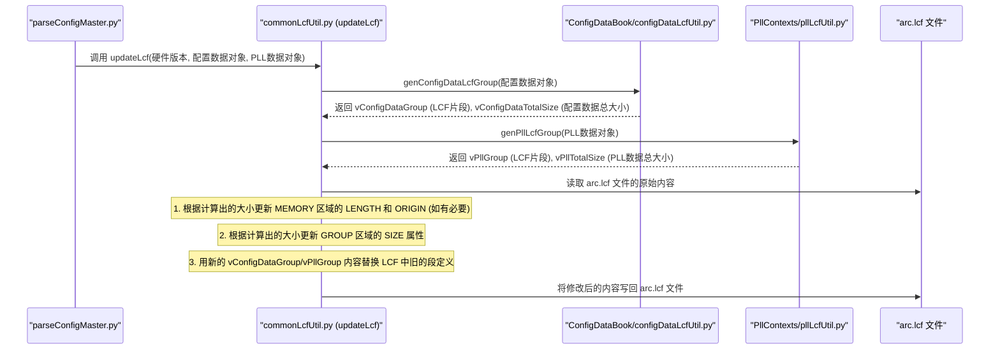
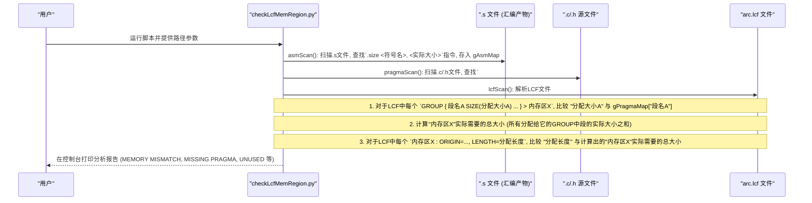

# Chapter 4: LCF 文件处理与校验


欢迎来到 `scripts` 项目教程的第四章！在上一章 [寄存器C结构生成](03_寄存器c结构生成_.md) 中，我们学习了如何将硬件寄存器的描述（通常来自FTISS文件）转换为C语言结构体，从而方便固件代码访问硬件。现在，我们将目光投向一个对固件至关重要的文件——LCF（链接器命令文件），并探讨 `scripts` 项目中用于处理和校验它的工具。

## 4.1 为什么 LCF 文件如此重要？

想象一下，你正在建造一座复杂的城市（你的固件）。这座城市里有居民区（代码）、商业区（数据）、工业区（特定功能模块）等等。LCF 文件就像是这座城市的**总体规划图**和**土地使用法规**。它指导着“城市建设者”（链接器）如何组织城市中的各种建筑（代码和数据段），并将它们精确地放置在城市的物理土地上（微控制器的内存中）。

如果 LCF 文件中的“规划”出了问题，比如：
*   **规划不准确**：给一个需要很大空间的“购物中心”（某个数据表）只分配了一小块“土地”（内存区域），那么“购物中心”就建不下，导致编译链接失败或者运行时内存溢出。
*   **规划未更新**：城市发展了，新建了一个大型“体育馆”（新的功能模块），但总体规划图（LCF）没有及时更新，没有为“体育馆”预留土地，那么“体育馆”就无处安放。

这组脚本就是“城市规划局”和“土地管理局”的工具。它们能够：
1.  **解析LCF文件**：读取并理解现有的城市规划图，获取各个区域（内存区域）的信息。
2.  **自动更新LCF**：当城市规划需要调整时（例如，某个配置数据的大小改变了），自动更新LCF文件中的内存大小或地址。
3.  **校验LCF文件**：确保LCF文件中定义的内存区域与实际的“建筑需求”（代码和数据大小）相匹配，防止出现上述的规划问题。

**核心用例：**
假设你正在开发一个新功能，这个功能引入了一个较大的常量配置表。
*   **手动方式**：你需要估算这个表的大小，然后在LCF文件中找到合适的内存区域，手动修改该区域的大小分配，并调整后续区域的起始地址。这个过程非常繁琐且容易出错。
*   **使用 `scripts` 项目的工具**：
    *   如果这个配置表是由 [配置主数据解析](01_配置主数据解析_.md) 管理的，那么 `ParseConfigMaster` 在运行时会自动调用 `commonLcfUtil.py` 来更新LCF文件中对应内存区域的大小。
    *   之后，你可以运行 `checkLcfMemRegion.py` 来验证你的代码（包括这个新表）实际占用的空间是否与LCF中的定义一致。
    *   你还可以运行 `genInfoMemoryMap.py` 来生成一份最新的内存“地籍图”，清晰地看到各个部分是如何分配的。

这些工具确保了内存的“地契”和“建筑规范”始终准确无误，并能适应不断变化的“建筑规划”。

## 4.2 LCF 文件基础掠影

LCF (Linker Command File) 文件通常包含以下关键信息：

*   **`MEMORY` 命令**：定义微控制器上可用的物理内存区域，例如 `ICCM` (指令紧耦合内存), `DCCM` (数据紧耦合内存), `FLASH`, `RAM` 等。每个区域都有一个名称、起始地址 (`ORIGIN`) 和长度 (`LENGTH`)。
    ```
    MEMORY
    {
      ICCM_MAIN  : ORIGIN = 0x00000000, LENGTH = 0x00010000 /* 64KB */
      DCCM_MAIN  : ORIGIN = 0x10000000, LENGTH = 0x00010000 /* 64KB */
      /* ... 其他内存区域 ... */
    }
    ```

*   **`SECTIONS` 命令 (或 `GROUP` 命令)**：指示链接器如何将输入文件中的各个代码段和数据段（称为输入段，input sections）组合成输出段（output sections），并将这些输出段放置到 `MEMORY` 命令定义的特定内存区域中。
    ```
    SECTIONS
    {
      GROUP SIZE(0x0000_0800) BLOCK(4) : {
        FW_CFG          ALIGN(4) SIZE(0x100) :{} /* 固件配置数据 */
        FW_CAL_CONFIG   ALIGN(4) SIZE(0x200) :{} /* 校准配置数据 */
        /* ... 其他段 ... */
      } > DCCM_DATA_CONFIG /* 这个GROUP被放置到名为 DCCM_DATA_CONFIG 的内存区域 */

      /* ... 其他 SECTIONS 或 GROUP 定义 ... */
    }
    ```
    这里，`FW_CFG` 和 `FW_CAL_CONFIG` 是我们C代码中通过 `#pragma data("FW_CFG")` 等方式定义的段名。`SIZE(0x100)` 表示为 `FW_CFG` 段分配了 `0x100` 字节的空间。

理解这些基本概念有助于我们更好地理解后续脚本的工作原理。

## 4.3 核心工具与它们的工作

`scripts` 项目提供了一系列 Python 脚本来与 LCF 文件交互。

### 4.3.1 `ParseConfigMaster/commonLcfUtil.py` - 自动更新LCF的“规划师”

我们在 [第 1 章：配置主数据解析](01_配置主数据解析_.md) 中已经知道，`ParseConfigMaster` 会根据中央的 Excel 配置文件生成多种产物，其中就包括更新 LCF 文件。这个更新任务主要由 `commonLcfUtil.py` 模块中的 `updateLcf` 函数完成。

**工作流程：**
当 `ParseConfigMaster` 解析完配置主数据（例如 "CONFIG_DATA_BOOK" 和 "PLLContexts" 工作表）并计算出这些数据结构在内存中实际需要占用的大小后，`parseConfigMaster.py` 会调用 `commonLcfUtil.updateLcf()`。



**`commonLcfUtil.py` 内部是如何工作的？**
`updateLcf` 函数内部有一个嵌套函数 `__applyUpdates`，它负责实际的读写操作。更深一层，`__updateMemoryRegion` 函数处理 `MEMORY` 区域的更新。

1.  **读取 LCF**：脚本首先读取现有的 `arc.lcf` 文件内容到内存中。
2.  **计算大小**：通过调用 `ConfigDataBook/configDataLcfUtil.py` 中的 `genConfigDataLcfGroup` 和 `PllContexts/pllLcfUtil.py` 中的 `genPllLcfGroup`，获取由配置主数据生成的各个数据块（例如 `CONFIG_MASTER`、`PLL_CNTX_LUT`）的实际大小和它们在 LCF 中应有的 `GROUP` 块定义字符串。
    *   `groupBlockHelper` 函数 (在 `commonLcfUtil.py` 中) 是一个辅助函数，被上述两个 `Util` 模块用来计算单个数据块（LUT）的大小并格式化其 LCF 条目。
      ```python
      # ParseConfigMaster/commonLcfUtil.py (groupBlockHelper 简化示意)
      def groupBlockHelper(aGroupBlockProcessed, aObj):
          # aObj 包含: (LUT名, 对齐空格数, 优化后的信号信息字典, 数组元素数量)
          (aLutName, aLutWhiteSpaces, aOptimizedSignalInfoDict, aArrElementCount) = aObj

          # 计算单个结构体的大小 (所有位域大小之和，转换为字节)
          _StructSize = sum(_signal[gIdxFieldSize] for _signal in aOptimizedSignalInfoDict.values())
          _StructSize //= 8 # 从 bit 转换为 byte
          vTotalSize = _StructSize * aArrElementCount # 乘以数组元素个数得到总大小

          # 格式化 LCF 中的 GROUP 条目
          aGroupBlockProcessed.append(f"  {aLutName:<{aLutWhiteSpaces}} ALIGN({gWordSize})" +
                                  f" SIZE({commonUtils.dec2hex(vTotalSize, None, False, True)}) :{{}}\n")
          return vTotalSize
      ```
3.  **更新 `MEMORY` 区域**：脚本会查找 LCF 文件中 `MEMORY` 定义块。
    *   当找到与配置主数据相关的内存区域（例如 `CONFIG_MASTER` 或 `PLL_CNTX_LUT`）时，它会用新计算出的总大小更新该区域的 `LENGTH` 属性。
    *   如果某个区域的 `LENGTH` 改变了，那么它之后所有区域的 `ORIGIN`（起始地址）也需要相应地调整。脚本会自动处理这种连锁更新。
      ```python
      # ParseConfigMaster/commonLcfUtil.py (__updateMemoryRegion 内的简化逻辑)
      # vSubPattern 是一个正则表达式，用于匹配和替换 ORIGIN 和 LENGTH
      # _Origin 是新计算的起始地址，tmpHexLen 是新计算的长度 (十六进制字符串)
      # aLcfLinesInput[aRowIdx] 是当前处理的 LCF 文件中的一行
      if re.search(f"^({gConfigDataLabel}|MASTER_CONFIG)", _LineContent): # 如果是配置主数据区域
          _Length = vConfigDataTotalSize # 使用新的总大小
          tmpHexLen = commonUtils.dec2hex(vConfigDataTotalSize, gHexDigitCount)
          # 使用正则表达式替换旧的 ORIGIN 和 LENGTH
          aLcfLinesInput[aRowIdx] = vSubPattern.sub(f"\g<1>{_Origin}\g<3>{tmpHexLen}\g<5>",
                                                  aLcfLinesInput[aRowIdx])
      # ... 其他区域的类似处理 ...
      vNextOrigin += _Length # 更新下一个区域的起始地址
      ```
4.  **更新 `GROUP` 块**：脚本会找到定义具体数据段的 `GROUP` 块（例如，指向 `MASTER_CONFIG` 内存区域的 `GROUP`）。
    *   它会用新计算出的总大小更新 `GROUP SIZE(...)` 中的值。
    *   它会将 `genConfigDataLcfGroup` 或 `genPllLcfGroup` 生成的新的段定义内容（包含所有数据子块及其 `SIZE`）替换掉旧的段定义。
5.  **写回 LCF**：最后，脚本将修改后的所有行写回到 `arc.lcf` 文件。

通过这种方式，`commonLcfUtil.py` 确保了 LCF 文件中与配置主数据相关的内存分配始终与最新的配置数据大小保持一致。

### 4.3.2 `checkLcfMemRegion.py` - LCF 内容的“审计员”

仅仅更新 LCF 文件是不够的，我们还需要验证 LCF 文件中的声明与实际编译生成的目标文件是否一致。`checkLcfMemRegion.py` 就是扮演这个“审计员”的角色。它会检查：
*   C代码中通过 `#pragma data("SECTION_NAME")` 定义的数据段，其真实大小是否与 LCF 文件中为 `SECTION_NAME` 分配的 `SIZE` 相符。
*   LCF 文件中 `MEMORY` 区域定义的 `LENGTH` 是否真的能容纳所有分配给它的 `GROUP` 块。
*   是否存在某些 `#pragma` 定义的段没有在 LCF 中使用，或者 LCF 中的段没有对应的 `#pragma`。

**如何运行？**
你需要提供项目目录、平台类型、编译产生的汇编文件路径 (`.s` 文件目录) 和 LCF 文件路径。
```bash
python checkLcfMemRegion.py <项目根目录> <平台名称> <汇编文件输出目录> <LCF文件路径>
# 示例:
# python scripts/checkLcfMemRegion.py ./firmware x814_rel1p0 ./output/x814_rel1p0/obj ./firmware/config/x814_rel1p0/arc.lcf
```

**工作流程：**


1.  **`asmScan(aFilePath)`**:
    *   此函数扫描编译器生成的汇编 (`.s`) 文件。
    *   它使用正则表达式 `gSizeMask = re.compile(r'^\s*.size\s+(\w+),\s*(\d+)', re.MULTILINE)` 来查找类似 `.size gMyGlobalVariable, 128` 这样的行。
    *   这表示符号 `gMyGlobalVariable` 编译后的实际大小是 `128` 字节。
    *   结果存储在全局字典 `gAsmMap` 中，格式为：`{'符号名': '实际大小字符串'}`。

2.  **`pragmaScan(aFilePath)`**:
    *   此函数扫描 C 语言的源文件 (`.c`) 和头文件 (`.h`)。
    *   它使用正则表达式 `gPragmaMask` 查找被 `#pragma data("SECTION_NAME")` 和 `#pragma data()` 包围的代码块。
    *   在这些代码块中，它用 `gPragmaMemberPattern` 查找定义的全局变量（通常以 `g` 开头，如 `gMyConfigTable`）。
    *   对于找到的每个全局变量，它会去 `gAsmMap` 中查询其实际大小。
    *   然后，它将同一个 `SECTION_NAME` 下所有变量的实际大小（注意需要 `addPadding` 处理对齐）累加起来，得到这个 `SECTION_NAME` 的总需求大小。
    *   结果存储在全局字典 `gPragmaMap` 中，格式为：`{'SECTION_NAME': 计算出的总需求大小}`。
    ```python
    # checkLcfMemRegion.py (pragmaScan 简化片段)
    def pragmaScan(aFilePath):
        vFile = open(aFilePath, "rt").read()
        for vPragmaMatch in gPragmaMask.findall(vFile): # 找到 #pragma data(...) 包裹的区域
            vPragmaSize = 0
            vPragmaName = vPragmaMatch[0] # "SECTION_NAME"
            vPragmaBody = vPragmaMatch[1] # pragma 之间的代码
            vMembers = gPragmaMemberPattern.findall(vPragmaBody) # 找到所有全局变量名

            for vMember in set(vMembers): # 遍历变量名
                if vMember in gAsmMap: # 如果在汇编中找到了这个变量的大小
                    # addPadding确保计算的大小与编译器处理对齐后的大小一致
                    vPragmaSize += addPadding(int(gAsmMap[vMember])) 
            gPragmaMap[vPragmaName] = vPragmaSize # 记录该SECTION_NAME的总大小
    ```

3.  **`lcfScan()`**:
    *   此函数解析 LCF 文件。
    *   **GROUP 块分析**：它使用 `gGroupMask` 正则表达式找到 `GROUP SIZE(...) BLOCK(...) : { ... } > MEMORY_REGION_NAME` 这样的块。
        *   对于 `GROUP` 内部的每个 `SECTION_NAME ALIGN(...) SIZE(ALLOCATED_HEX_SIZE) : {}` 定义 (通过 `gSectionMask` 匹配)，它会：
            *   提取 `SECTION_NAME` 和十六进制的 `ALLOCATED_HEX_SIZE`。
            *   从 `gPragmaMap` 中获取 `SECTION_NAME` 的计算需求大小 (`vCalculated`)。
            *   比较 `int(ALLOCATED_HEX_SIZE, 16)` 和 `vCalculated`。如果不相等，则报告 "MEMORY MISMATCH"。
            *   如果 `SECTION_NAME` 在 `gPragmaMap` 中不存在，则报告 "MISSING PRAGMA"。
        *   累加 `GROUP` 中所有段的 `vCalculated` 大小，得到该 `GROUP` 实际需要的总大小，存入 `gGroupMap`。
    *   **MEMORY 区域分析**：它使用 `gMemBlockMask` 正则表达式找到 `MEMORY_REGION_NAME : ORIGIN = ..., LENGTH = ALLOCATED_LENGTH` 这样的定义。
        *   对于每个 `MEMORY_REGION_NAME`，从 `gGroupMap` 中获取其总需求大小 (`vCalcLen`)。
        *   比较 `int(ALLOCATED_LENGTH, 16)` 和 `vCalcLen`。如果不相等，则报告 "MEMORY MISMATCH"。
        *   如果 `MEMORY_REGION_NAME` 在 `gGroupMap` 中不存在（即 LCF 中定义了一个内存区域，但没有 `GROUP` 块指向它），则报告 "MISSING GROUP BLOCK"。
    *   **未使用 Pragma 分析**：最后，它会检查 `gPragmaMap` 中的哪些 `SECTION_NAME` 没有在 LCF 的任何 `GROUP` 块中被使用，报告为 "UNUSED"。

脚本的输出会清晰地指出 LCF 文件中存在哪些问题，帮助开发者快速定位和修复。

### 4.3.3 `genMemoryMap.py` & `genInfoMemoryMap.py` - LCF 可视化的“测绘员”

理解内存是如何被划分和使用的非常重要。这两个脚本帮助我们将 LCF 文件中定义的内存布局信息可视化。

*   **`genMemoryMap.py`**:
    *   **输入**: LCF 文件路径 (`arc.lcf`) 和配置文件路径 (`config.h`，用于获取DCCM基地址等信息)。
    *   **工作**: 主要通过 `parseArcFile` 函数解析 `arc.lcf` 文件中的 `MEMORY` 块。它提取每个内存区域（如 `ICCM_MAIN`, `FW_CFG`, `DCCM_ADAPT`）的名称、在 LCF 中计算出的 APB/AHB 地址（相对于模块基地址）、以及分配的长度。
    *   **输出**: 生成一个 `fw_memory_map.csv` 文件。这个 CSV 文件列出了各个内存块的名称、地址、大小和一些注释（来自脚本内置的 `NOTES_DICTIONARY`）。这个文件可以被其他工具（如 `ftissValidityCheck.py`，见 [FTISS 文件处理](02_ftiss_文件处理_.md)）使用。
    ```python
    # genMemoryMap.py (parseArcFile 简化片段)
    def parseArcFile(aArcFilePath, aConfigFilePath, aIccmDf, aDccmDf, aVariant, ...):
        # ... (从 aConfigFilePath 读取 PMD_DCCM_BASE 等) ...
        with open (aArcFilePath, "r") as f:
            # 解析 LCF 文件中的 MEMORY { ... } 部分
            x = f.read().split("MEMORY")[2].split("}")[0].split('\n') 
            x = list(map(lambda a: a.replace(" ", ""), x))[1:-1] # 清理和分割行
            
            for i, text in enumerate(x):
                name = text.split(":")[0] # 内存区域名
                if name.startswith("#"): continue # 跳过注释
                
                origin = int(text.split("ORIGIN=")[1].split(",")[0], 16) # 起始地址
                length = int(text.split('LENGTH=')[1].split("#")[0], 16) # 长度

                if aVariant == True: # 用于生成 fw_memory_map.csv
                    # activeApb, activeFw 是当前处理的内存类型 (ICCM/DCCM) 的基地址
                    # 计算并格式化地址和长度，添加到 DataFrame (aIccmDf 或 aDccmDf)
                    # ... gIccmDf.loc[len(gIccmDf)] = [NAME, ADDR, LENGTH_STR, NOTE] ...
                # ... (else 分支用于 genInfoMemoryMap.py 的另一种数据收集模式) ...
    # 主流程中
    # gIccmDf.to_csv(gFwMemoryMapPath) # 保存为 CSV
    ```

*   **`genInfoMemoryMap.py`**:
    *   **输入**: 构建输出目录的路径 (`MAP_DIR`)，脚本会从中推断 LCF、`config.h`、链接器 map 文件 (`.map`) 和 ELF dump 文件的路径。
    *   **工作**:
        1.  调用 `genMemoryMap.parseArcFile` 来获取 LCF 中定义的内存区域及其大小，填入 Pandas DataFrame。
        2.  解析链接器生成的 `.map` 文件中的 "SECTION SUMMARY" 部分，获取各个段（如 `.text`, `.data`, `.bss`）的实际使用大小。
        3.  解析 `elfdump` 工具生成的 ELF 文件摘要 (`e224_fw_elf_dump.txt`)，获取段的属性（如 `PROGBITS`, `NOBITS`）。
        4.  将来自 LCF 的分配信息、来自 `.map` 文件的实际使用信息、以及来自 ELF dump 的属性信息整合到多个 DataFrame 中。
        5.  使用 `pandas.ExcelWriter` 和 `xlsxwriter` 将这些 DataFrame 输出到一个名为 `fw_memory_allocations.xlsx` 的 Excel 文件中，每个 DataFrame 存为一个工作表。
        6.  为关键的内存分配数据（如 ICCM 和 DCCM 的总体使用情况）生成饼图或柱状图，嵌入到 Excel 文件中，使内存使用情况一目了然。
    *   **输出**: 生成 `fw_memory_allocations.xlsx`，提供了一个非常详细和可视化的固件内存布局报告。
    ```bash
    # 运行 genInfoMemoryMap.py (通常在构建流程中自动调用)
    # python scripts/genInfoMemoryMap.py output/x814_rel1p0 
    ```
    ```python
    # genInfoMemoryMap.py (简化片段 - 写入 Excel 和图表部分)
    # ... (前面已经填充好了 gIccmDf, gDccmDf, gDistroIccmDf 等 DataFrame) ...
    with pd.ExcelWriter(gInfoFwMemoryMapPath, engine='xlsxwriter') as writer:
        workbook = writer.book
        for sheetname, df in vDfs.items():  # vDfs 是一个包含所有要输出的DataFrame的字典
            df.to_excel(writer, sheet_name=sheetname)
            worksheet = writer.sheets[sheetname]

            if (sheetname == 'ICCM_Memory_Allocation' or sheetname == 'DCCM_Memory_Allocation'):
                # ... (代码创建图表对象 chart) ...
                chart = workbook.add_chart({'type': 'pie'})
                chart.add_series({ # 配置图表数据源
                    'categories': f'={sheetname}!B2:B{lastRow}', # 标签列
                    'values':     f'={sheetname}!C2:C{lastRow}', # 数据列
                    'data_labels': {'value': True, 'legend_key': True},
                })
                worksheet.insert_chart('G4', chart) # 将图表插入到工作表
            # ... (调整列宽等格式化操作) ...
    writer.close()
    ```
这两个脚本，特别是 `genInfoMemoryMap.py`，是理解固件内存使用情况、排查内存问题的有力工具。

### 4.3.4 `sectionValidityCheck.py` - LCF 完整性的“检查员”

在复杂的项目中，可能会出现这样的情况：某个汇编文件（`.s`）中用 `.section` 指令定义了一个数据段，但这个段名后来在 LCF 文件的任何 `GROUP` 块中都没有被引用。这意味着这个段可能被遗忘了，或者相关的C代码已经被移除，但汇编中的定义还在。这样的“孤儿段”虽然不一定会导致编译错误，但它表明了代码和链接脚本之间可能存在不同步。

`sectionValidityCheck.py` 的职责就是找出这些在 `.s` 文件中定义但未在 LCF 文件中引用的段。

**如何运行？**
```bash
python sectionValidityCheck.py <LCF文件路径> <汇编文件目录路径>
# 示例:
# python scripts/sectionValidityCheck.py ./firmware/config/x814_rel1p0/arc.lcf ./output/x814_rel1p0/obj
```

**工作流程：**

1.  **`parseLcfFile(aArcFilePath)`**:
    *   此函数解析 LCF 文件。它不是简单地用正则表达式匹配，而是实现了一个简易的词法分析器 (`readLcfToken`) 来逐个读取 LCF 文件中的“令牌”（如 `SECTION`, `{`, `GROUP`, 段名等），同时会处理和跳过注释。
    *   它关注 `SECTIONS { GROUP ... : { section_name1 ... section_name2 ... } > ... }` 这样的结构。
    *   提取出所有在 `GROUP` 块内部定义的段名（如 `section_name1`, `section_name2`）。
    *   返回一个包含所有在 LCF 中实际引用的段名的集合 (Set)。
    ```python
    # sectionValidityCheck.py (parseLcfFile 简化逻辑)
    def parseLcfFile(aArcFilePath: str) -> Set[str]:
        vSectionNames = set()
        with open(aArcFilePath, "r") as file:
            # ... (vContext 用于跟踪当前解析的块类型，如 "sections", "group") ...
            # ... (vExpectingSectionName 标记是否期待一个段名) ...
            while True:
                vToken = readLcfToken(file) # 读取下一个有效标记
                if not vToken: break
                # ... (根据 vToken 和 vContext 更新状态) ...
                # 如果在 SECTIONS { GROUP ... { 内，并且期待一个段名
                if len(vContext) >= 2 and vContext[-2] == "sections" and \
                   vContext[-1] == "group" and vExpectingSectionName and \
                   vToken != "{" and vToken != "}":
                    if vToken != "*" and vToken[0] != ".": # 忽略特殊段
                        vSectionNames.add(vToken)
                    vExpectingSectionName = False # 已读到段名，下一个期待的是ALIGN等
                elif vToken == "}": # GROUP 块结束
                    vExpectingSectionName = True # 下一个可能是新的段名或块结束
        return vSectionNames
    ```

2.  **`parseAsmFile(aAsmFilePath)`**:
    *   此函数解析单个汇编 (`.s`) 文件。
    *   它查找以 `\t.section\t` 开头，后跟段名和逗号的行 (例如 `\t.section\tmy_asm_section, "aw", @progbits`)，或者段名被引号包围的行 (例如 `\t.section\t"another_section", ...`)。
    *   提取所有通过 `.section` 指令定义的段名。
    *   返回一个包含该 `.s` 文件中所有自定义段名的集合。

3.  **主逻辑 (`main`)**:
    *   调用 `parseLcfFile` 获取 LCF 中引用的所有段名 (`vLcfSectionNames`)。
    *   遍历指定的汇编文件目录及其子目录中所有的 `.s` 文件。对每个 `.s` 文件调用 `parseAsmFile`，将结果累积到一个总的集合 `vAsmSectionNames` 中，该集合包含所有 `.s` 文件中定义的段名。同时，记录每个段名是在哪些 `.s` 文件中定义的。
    *   比较这两个集合：遍历 `vAsmSectionNames` 中的每个段名，检查它是否存在于 `vLcfSectionNames` 中。
    *   如果一个段名存在于 `vAsmSectionNames` 但不存在于 `vLcfSectionNames`（并且不在全局的 `gSkipSection` 豁免列表中），则打印一条警告，指出该段未在 LCF 中被引用，并列出定义了该段的 `.s` 文件。

这个脚本有助于保持代码库的整洁，确保链接器脚本的定义与实际代码需求同步。

## 4.4 总结与展望

在本章中，我们深入探讨了 LCF 文件的重要性以及 `scripts` 项目中用于处理和校验 LCF 文件的关键工具。我们学习了：

*   **LCF 文件的核心作用**：如同城市的“总体规划图”，指导链接器如何组织和放置代码与数据。
*   **`commonLcfUtil.py`** (通过 `ParseConfigMaster` 调用)：能够根据配置数据的变化自动更新 LCF 文件中相关内存区域的大小和 `GROUP` 块的定义，确保规划与需求同步。
*   **`checkLcfMemRegion.py`**：作为“审计员”，通过比较汇编产物、C代码中的`#pragma`定义以及LCF文件中的声明，来校验内存分配的准确性和一致性。
*   **`genMemoryMap.py` 和 `genInfoMemoryMap.py`**：作为“测绘员”，解析LCF和链接器输出，生成易于理解的内存地图CSV文件和包含图表的Excel报告，帮助开发者洞察内存使用情况。
*   **`sectionValidityCheck.py`**：作为“检查员”，确保所有在汇编文件中定义的段都在LCF中得到了合理的引用，防止出现“孤儿段”。

这些工具共同构成了固件开发中内存管理和链接过程自动化的重要组成部分，极大地提高了效率和可靠性。

LCF文件定义了“在哪里”以及“多大”地放置数据。但除了这些由配置主数据或固定代码产生的数据外，固件运行时还会动态使用内存（如堆栈）。如何从整体上管理和验证整个固件的内存布局，确保所有部分都能和谐共存且不发生冲突呢？这正是我们下一章 [第 5 章：内存布局管理与验证](05_内存布局管理与验证_.md) 将要探讨的内容。

---

Generated by [AI Codebase Knowledge Builder](https://github.com/The-Pocket/Tutorial-Codebase-Knowledge)