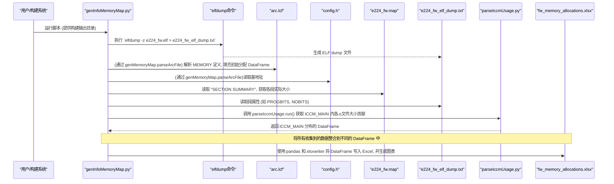

# Chapter 5: 内存布局管理与验证


在上一章 [LCF 文件处理与校验](04_lcf_文件处理与校验_.md) 中，我们学习了链接器命令文件（LCF）的重要性，以及 `scripts` 项目中用于自动更新和校验 LCF 文件中特定配置数据区域的工具。LCF 文件像是我们固件“城市”的总体规划图，规定了各个“建筑”（代码和数据）应该放在哪里以及占用多大空间。

但是，仅仅确保配置数据的 LCF 条目被正确更新是不够的。一个健康的固件需要对其所有内存区域（如 ICCM、DCCM）的使用情况进行全面的规划、分析和验证。我们需要确保整个“城市”的布局是合理的，没有浪费，也没有冲突。本章将介绍 `scripts` 项目中更宏观的内存“城市规划师”和“审计员”工具，它们帮助我们管理和验证整个固件的内存布局。

## 5.1 为什么需要内存布局管理与验证？

想象一下，我们的固件项目越来越复杂，加入了许多新功能、新的数据结构。突然有一天，固件编译链接失败了，提示某个内存区域不足！或者更糟糕的是，固件能够编译通过，但在运行时偶尔会崩溃，经过艰难的调试，发现是某个数据结构越界写入，破坏了邻近的其他数据或代码。

**核心用例：**
假设开发团队最近为固件添加了几个新模块，并且一些旧模块的数据结构也增大了。在一次集成编译后，链接器报错，提示 `DCCM_MAIN` 区域空间不足，无法容纳所有的全局变量和堆栈。或者，即使链接通过，固件在特定操作下会“死机”，怀疑是内存分配重叠或越界导致的。

这时，我们就需要：
1.  **清晰了解当前的内存使用状况**：哪些模块占用了多少 ICCM？DCCM 的使用率是多少？哪些段（如 `.text`, `.data`, `.bss`）占用了主要空间？
2.  **验证内存规划的正确性**：LCF 文件中定义的各个内存区域大小是否足够？实际代码和数据的大小是否超出了 LCF 中的分配？是否存在内存区域之间的意外重叠？
3.  **优化内存使用**：是否存在可以压缩或重新布局以节省空间的部分？

本章介绍的脚本就是为了解决这些问题。它们就像是固件内存空间的“城市规划师”和“审计员”。
*   **规划师**的工具（如 `genMemoryMap.py`）帮助我们绘制出内存的“地籍图”，明确各个区域的边界和用途。
*   **审计员**的工具（如 `genInfoMemoryMap.py`, `checkLcfMemRegion.py`）则检查实际的内存使用是否符合规划，是否存在空间浪费或冲突，确保内存资源得到高效和正确的使用。

这些脚本会读取链接器脚本（`.lcf`）、目标文件的映射信息（`.map`）以及可能在 FTISS 中定义的内存区域（间接通过 `fw_memory_map.csv`），从而对固件的内存布局进行全面的分析和验证。

## 5.2 我们的“内存审计工具箱”概览

为了有效地管理和验证固件的内存布局，`scripts` 项目提供了一个工具箱，其中包含几个关键的 Python 脚本：

1.  **`genMemoryMap.py`**：
    *   **角色**：内存“地籍测绘员”。
    *   **功能**：解析 LCF 文件，生成一个高层的内存地图文件 `fw_memory_map.csv`。这个 CSV 文件列出了固件中主要的内存块（如代码区、数据区、特定配置区）的名称、在物理内存中的地址（通常是 APB/AHB 地址）、分配的大小以及一些注释。
    *   **用途**：为其他工具（如 `ftissValidityCheck.py`）提供输入，也作为固件内存布局的快速参考文档。

2.  **`genInfoMemoryMap.py`**：
    *   **角色**：内存“审计分析师”。
    *   **功能**：这是一个功能更强大的脚本，它不仅读取 LCF 文件，还会解析链接器生成的 `.map` 文件和 ELF 文件的 dump 信息。然后，它生成一个详细的 Excel 报告 (`fw_memory_allocations.xlsx`)，其中包含各个内存区域（ICCM, DCCM 等）的使用情况、各个段（`.text`, `.data`, `.bss` 等）的大小和属性，甚至还包含图表（如饼图）来可视化内存分配。
    *   **用途**：深入分析内存使用细节，发现潜在的内存浪费或瓶颈，是排查内存相关问题的重要工具。

3.  **`checkLcfMemRegion.py`** (已在 [LCF 文件处理与校验](04_lcf_文件处理与校验_.md) 中详细介绍)：
    *   **角色**：LCF“规划一致性检查员”。
    *   **功能**：校验 LCF 文件中为特定 C 代码段（通过 `#pragma data` 定义）分配的大小是否与这些段编译后的实际大小相符。
    *   **用途**：确保 LCF 中的规划与代码的实际需求一致，防止因 LCF 定义不当导致的内存溢出或浪费。在本章中，我们视其为整体内存验证的一个环节。

4.  **`ftissValidityCheck.py`** (已在 [FTISS 文件处理](02_ftiss_文件处理_.md) 中详细介绍)：
    *   **角色**：FTISS“蓝图符合性检验员”。
    *   **功能**：校验 FTISS 文件中定义的寄存器默认值等信息是否与编译后的固件镜像一致。它依赖 `fw_memory_map.csv` (由 `genMemoryMap.py` 生成) 来定位 FTISS 描述的硬件模块在内存中的基地址。
    *   **用途**：确保硬件寄存器相关的内存区域的内容符合设计预期。在本章中，我们关注它如何利用内存地图进行验证。

接下来，我们将逐个了解这些工具如何帮助我们进行内存布局的管理与验证。

## 5.3 生成高层内存地图：`genMemoryMap.py` 的使用

`genMemoryMap.py` 脚本的主要任务是从 LCF 文件中提取信息，生成一个名为 `fw_memory_map.csv` 的文件。这个 CSV 文件提供了一个固件内存布局的概览。

**用途：**
*   为其他自动化脚本（例如 `ftissValidityCheck.py`）提供输入，告知它们固件中不同模块或内存区域的基地址。
*   作为一份简单明了的文档，供开发人员快速查阅主要内存块的分配情况。

**如何运行：**
该脚本通常需要 LCF 文件路径和 `config.h`（可能包含DCCM基地址等）的路径作为间接输入（通过构建输出目录推断）。一个典型的调用可能是构建系统的一部分，或者手动运行：
```bash
# 假设脚本和输出目录结构符合预期
python scripts/genMemoryMap.py output/x814_rel1p0
```
这里 `output/x814_rel1p0` 是一个示例的构建输出目录，脚本会从中找到需要的 `arc.lcf` 和 `config.h`。

**输入：**
*   LCF 文件 (例如 `firmware/config/x814_rel1p0/arc.lcf`)：包含 `MEMORY` 区域定义。
*   `config.h` 文件 (例如 `firmware/config/x814_rel1p0/config.h`)：可能包含某些基地址的宏定义（如 `PMD_DCCM_BASE`）。

**输出 (`fw_memory_map.csv` 示例片段)：**
```csv
NAME,APB/AHB ADDRESS,Length (Bytes),Notes
FW_CFG,0x10000000,"0x400 (1024 bytes)",Firmware-specific configurations. Includes fast sim settings and feature enables(fw_cfgs_ftiss.xlsx)
FW_CAL_CONFIG,0x10000400,"0x1C0 (448 bytes)",Firmware Calibration specific configurations. Includes tunable parameters (fw_cal_config_ftiss.xlsx)
MASTER_CONFIG,0x100005C0,"0x3A10 (14864 bytes)",Master Config Tables (config_master_config_data_ftiss.xlsx)
PLL_CNTX_LUT,0x10004000,"0x800 (2048 bytes)",Master Config PLL Cntx Tab (config_master_pll_context_ftiss.xlsx)
DCCM_ADAPT_LANE0,0x1000C000,"0x470 (1136 bytes)",Stored adaptation values for lane0. (adapt_vals_ftiss.xlsx)
...
```
每一行列出一个内存块的名称、APB/AHB 总线地址、十六进制和十进制的大小，以及一段描述性注释（通常包含关联的 FTISS 文件名）。

**工作原理简介：**
`genMemoryMap.py` 脚本中的核心逻辑在 `parseArcFile` 函数中。
1.  **读取配置**：从 `config.h` 文件中解析出必要的基地址宏定义，如 `PMD_DCCM_BASE` 和 `CPU_DCCM_BASE`，以确定 DCCM 区域在 APB 总线和 CPU 视角下的地址。ICCM 通常有固定的基地址。
2.  **解析 LCF `MEMORY` 块**：
    *   打开 LCF 文件，定位到 `MEMORY { ... }` 定义块。
    *   逐行解析 `MEMORY` 块中的条目。每个条目格式通常为：`REGION_NAME : ORIGIN = 0xADDRESS, LENGTH = 0xSIZE`。
    *   提取 `REGION_NAME`、`ORIGIN` (起始地址) 和 `LENGTH` (长度)。
3.  **地址转换与格式化**：
    *   将 LCF 中定义的 `ORIGIN` (通常是相对于某个基础，如 ICCM 或 DCCM 的 CPU 视图起始地址) 转换为 APB/AHB 总线地址。这是通过加上 `ICCM_APB_ADDR - ICCM_FW_ADDR` 或 `DCCM_APB_ADDR - DCCM_FW_ADDR` 这样的偏移量来完成的。
    *   格式化地址和长度为十六进制字符串，并附带十进制大小。
4.  **处理特殊情况**：
    *   对于某些按 lane (通道) 重复的内存区域 (如 `DCCM_ADAPT`)，脚本会将其拆分为多个条目 (如 `DCCM_ADAPT_LANE0`, `DCCM_ADAPT_LANE1` 等)，并计算每个 lane 的地址和大小。
    *   脚本内部有一个 `NOTES_DICTIONARY`，根据 `REGION_NAME` 查找对应的注释信息，这通常会指明与该内存区域相关的 FTISS 文件名。
5.  **生成 CSV**：将提取和格式化后的信息存入 Pandas DataFrame，并最终写入 `fw_memory_map.csv` 文件。

下面是 `genMemoryMap.py` 中 `parseArcFile` 函数的一个高度简化的片段，展示了其核心解析逻辑：
```python
# genMemoryMap.py (parseArcFile 函数简化示意)
# (部分全局变量和辅助函数定义已省略)

def parseArcFile(
        aArcFilePath: str,      # LCF 文件路径
        aConfigFilePath: str,   # config.h 文件路径
        aIccmDf: pd.DataFrame,  # 用于存储 ICCM 相关条目的 DataFrame
        aDccmDf: pd.DataFrame,  # 用于存储 DCCM 相关条目的 DataFrame
        aVariant: bool,         # 模式选择 (True 表示为 fw_memory_map.csv 生成)
        aIccmSize: int,         # ICCM 总大小 (此模式下未使用)
        aDccmSize: int          # DCCM 总大小 (此模式下未使用)
    ) -> Tuple[int, int, int, int]: # 返回值在此模式下不重要

    # 从 aConfigFilePath 中读取 PMD_DCCM_BASE, CPU_DCCM_BASE 等...
    # DCCM_APB_ADDR = ...
    # DCCM_FW_ADDR = ...
    # ICCM_APB_ADDR = 0x00010000 # 假设 ICCM 的 APB 基地址
    # ICCM_FW_ADDR  = 0x00000000 # 假设 ICCM 的 CPU 视图基地址

    activeDF = aIccmDf # 当前操作的 DataFrame，默认为 ICCM
    activeApb, activeFw = ICCM_APB_ADDR, ICCM_FW_ADDR # 当前区域的基地址

    with open (aArcFilePath, "r") as f:
        # 定位到 LCF 文件中的 MEMORY 块内容
        lcf_memory_content = f.read().split("MEMORY")[2].split("}")[0].split('\n')
        lcf_memory_lines = list(map(lambda line: line.replace(" ", ""), lcf_memory_content))[1:-1] # 清理空格和首尾行

        for i, text_line in enumerate(lcf_memory_lines):
            name = text_line.split(":")[0] # 获取内存区域名称

            # 如果是 DCCM 的第一个区域，切换 activeDF 和基地址
            if "DCCM_MAIN" in name: # 假设 "DCCM_MAIN" 是DCCM区域的第一个条目
                activeDF = aDccmDf
                activeApb, activeFw = DCCM_APB_ADDR, DCCM_FW_ADDR

            if name.startswith("#"): continue # 跳过注释行

            # 解析 ORIGIN 和 LENGTH
            origin = int(text_line.split("ORIGIN=")[1].split(",")[0],16)
            length = int(text_line.split('LENGTH=')[1].split("#")[0].strip(), 16) # 去掉注释，转换为整数

            if aVariant == True: # 确保是在为 fw_memory_map.csv 生成数据
                # ... (处理 LANE_BASED_GROUPS 和 LENGTH_EXCEPTIONS 的逻辑) ...
                # 例如，对普通区域：
                # 计算最终的 APB 地址
                final_apb_addr = activeApb - activeFw + origin
                # 从 NOTES_DICTIONARY 获取备注
                note_text = NOTES_DICTIONARY[name]
                # 格式化长度字符串
                length_str = f"{hexFormat(length)} ({length} bytes)"
                # 添加到 DataFrame
                activeDF.loc[len(activeDF)] = [LAB_NAME_MAPPING[name], hexFormat(final_apb_addr), length_str, note_text]
    
    # 返回值在此简化场景中不重要
    return 0,0,0,0

# 在主流程中:
# gIccmDf = pd.DataFrame(columns=["NAME", "APB/AHB ADDRESS", "Length (Bytes)", "Notes"])
# gDccmDf = pd.DataFrame(columns=["NAME", "APB/AHB ADDRESS", "Length (Bytes)", "Notes"])
# parseArcFile(gArcFilePath, gConfigFilePath, gIccmDf, gDccmDf, True, 0, 0)
# gFinalDf = pd.concat([gIccmDf, gDccmDf], ignore_index=True)
# gFinalDf.to_csv(gFwMemoryMapPath, index=False) # 保存为 CSV
```
这个脚本为我们提供了一个标准化的、机器可读的固件内存地图，是后续更详细分析和验证的基础。

## 5.4 深度剖析内存使用：`genInfoMemoryMap.py` 的力量

`genInfoMemoryMap.py` 是一个更为强大的内存分析工具。它不仅解析 LCF 文件，还结合了链接器生成的 `.map` 文件和 ELF 文件 dump (`elfdump`) 的信息，生成一份详尽的 Excel 报告 (`fw_memory_allocations.xlsx`)。

**用途：**
*   **详细审计**：提供每个内存区域（ICCM, DCCM）中各个段（如 `.text`, `.data`, `.bss`, 以及自定义段）的分配大小和实际使用大小。
*   **可视化分析**：通过在 Excel 报告中嵌入饼图或柱状图，直观展示内存的分配比例和使用情况。
*   **问题定位**：帮助开发者快速找到内存使用率过高的区域，或者发现未充分利用的内存空间。

**如何运行：**
脚本需要一个参数，即包含构建产物（如 `.map` 文件, `arc.lcf`, `config.h`, `e224_fw.elf`）的目录路径。
```bash
python scripts/genInfoMemoryMap.py output/x814_rel1p0
```

**输入：**
*   LCF 文件 (`arc.lcf`)：定义内存区域和分配。
*   链接器 map 文件 (`e224_fw.map`)：包含“SECTION SUMMARY”部分，列出每个段的实际大小和地址。
*   ELF dump 文件 (`e224_fw_elf_dump.txt`)：通过 `elfdump -z e224_fw.elf` 生成，包含段的属性信息 (如 `PROGBITS`, `NOBITS`)。
*   `config.h`：用于获取基地址等信息。

**输出 (`fw_memory_allocations.xlsx` 内容概览)：**
这个 Excel 文件通常包含多个工作表 (Sheet)：
*   **`ICCM_Memory_Allocation` / `DCCM_Memory_Allocation`**：
    *   列出 LCF 中定义的 ICCM/DCCM 内的各个逻辑块（如 `FW_CFG`, `MASTER_CONFIG`, `DCCM_MAIN`）。
    *   显示每个块分配的内存大小（来自 LCF）和占总 ICCM/DCCM 的百分比。
    *   通常会附带一个饼图，显示 ICCM/DCCM 中各大块的分配比例。
*   **`ICCM_Distribution` / `DCCM_Distribution`**：
    *   更细致地展示 ICCM/DCCM 中实际的段信息。
    *   列出来自 `.map` 文件的段名（如 `.text`, `.data`, `.bss`, `FW_CFG`），它们的类型（如 `text`, `data`, `bss`），属性（如 `PROGBITS`, `NOBITS`，来自 ELF dump），以及实际占用的内存大小。
*   **`ICCM_MAIN_Distribution`**：
    *   特别针对 `ICCM_MAIN`（通常包含大部分代码）进行分析，列出其中各个目标文件 (`.o`) 对 `.text` 段的贡献大小，帮助找到代码体积较大的模块。这个信息来自 `parseIccmUsage.py` 脚本的辅助分析。

**工作原理：**
`genInfoMemoryMap.py` 的工作流程可以概括如下：



**核心步骤详解：**

1.  **生成 ELF Dump**：脚本首先会调用 `elfdump` 工具来生成关于固件 ELF 文件的详细信息，特别是段头（section headers）信息，并将其保存到文本文件中。
2.  **解析 LCF (初步分配)**：调用 `genMemoryMap.py` 中的 `parseArcFile` 函数（以另一种模式运行，`aVariant=False`），从 LCF 文件中读取 `MEMORY` 块的定义，获取 ICCM 和 DCCM 中各个顶层内存区域（如 `FW_CFG`, `DCCM_ADAPT`）的名称和 LCF 中声明的分配大小。这些信息被用来填充初始的 `ICCM_Memory_Allocation` 和 `DCCM_Memory_Allocation` DataFrame。
3.  **解析链接器 Map 文件 (`.map`)**：
    *   打开 `.map` 文件，找到 "SECTION SUMMARY" 部分。
    *   这一部分列出了链接器最终放置的每个段（如 `.text`, `.data`, `.bss`, 以及用户自定义的如 `FW_CFG`），它们的起始地址和大小。
    *   脚本解析这些信息，提取段名和其实际占用的长度（十六进制，需转换为十进制）。这些数据用于填充 `ICCM_Distribution` 和 `DCCM_Distribution` DataFrame 中的“Mem. Used (dec)”列。
    ```python
    # genInfoMemoryMap.py (解析 .map 文件片段简化示意)
    # ...
    # vDccmFlag 用于区分当前处理的是 ICCM 相关的段还是 DCCM 相关的段
    # FIRST_DCCM_TYPE = ".bss" (假设 .bss 是 DCCM 中出现的第一个典型段类型)
    with open (gFwMapPath, "r") as f:
        map_content = f.read().split("SECTION SUMMARY")[1].split("SECTION DETAILS")[0].split('\n')
        map_lines = list(map(lambda line: line.replace(" ", ""), map_content))[6:-1] # 清理和定位

        for i, text_line in enumerate(map_lines):
            if not text_line: continue # 跳过空行
            # ... (处理只有段名，没有长度的行，如宏段) ...
            
            hex_length = text_line[-8:] # 段的十六进制长度
            length = int(hex_length, 16) # 转换为十进制

            # 判断段类型 (text, data, bss)
            # type_char = text_line[-25] # 'a' for data, 's' for bss, 't' for text
            # ... (根据 type_char 确定 type 字符串) ...
            
            section_name = text_line[0: (-25 - len(type) + 1)] # 提取段名

            # 根据是否遇到DCCM的标志性段，决定将此段信息加入ICCM还是DCCM的Distribution DataFrame
            if FIRST_DCCM_TYPE in section_name: # 或基于地址范围判断
                activeDF = gDistroDccmDf 
                vDccmFlag = 1
            # else: activeDF = gDistroIccmDf (已默认)

            activeDF.loc[len(activeDF)] = [/*序号*/, type, /*属性(稍后填充)*/, section_name, length]
            # ...
    ```
4.  **解析 ELF Dump 文件**：
    *   打开之前生成的 `e224_fw_elf_dump.txt` 文件。
    *   解析 "Section headers" 部分，这里列出了每个段的名称和属性（如 `PROGBITS` 表示段包含实际数据，`NOBITS` 表示段只占空间不占文件大小，如 `.bss`）。
    *   根据段名，将解析到的属性信息填充到 `ICCM_Distribution` 和 `DCCM_Distribution` DataFrame 中对应的“Attribute”列。
5.  **调用 `parseIccmUsage.py`**：这个辅助脚本专门解析 `.map` 文件中更详细的 `ICCM_MAIN` 分配情况，特别是各个目标文件 (`.o`) 对 `.text` 段的贡献。`genInfoMemoryMap.py` 调用它并获取结果 DataFrame，用于生成 `ICCM_MAIN_Distribution` 工作表。
6.  **写入 Excel 并生成图表**：
    *   使用 `pandas.ExcelWriter` 和 `xlsxwriter` 库。
    *   将所有准备好的 DataFrame（`gIccmDf`, `gDccmDf`, `gDistroIccmDf`, `gDistroDccmDf`, `gIccmMainDf`等）写入到 `fw_memory_allocations.xlsx` 文件的不同工作表中。
    *   对于 `ICCM_Memory_Allocation` 和 `DCCM_Memory_Allocation` 等工作表，创建图表对象（如饼图），设置数据源为 DataFrame 中的特定列（如“Blocks”作为类别，“Mem. Used (dec)”作为值）。
    *   将生成的图表插入到对应的工作表中。
    *   调整列宽等格式。
    ```python
    # genInfoMemoryMap.py (写入Excel和图表部分简化示意)
    # vDfs 是一个字典，包含了所有要写入的DataFrame: {'SheetName': DataFrameObject}
    with pd.ExcelWriter(gInfoFwMemoryMapPath, engine='xlsxwriter') as writer:
        workbook = writer.book
        for sheetname, df_to_write in vDfs.items():
            df_to_write.to_excel(writer, sheet_name=sheetname) # 将DataFrame写入工作表
            worksheet = writer.sheets[sheetname] # 获取工作表对象

            # 为特定的工作表生成图表
            if (sheetname == 'ICCM_Memory_Allocation' or sheetname == 'DCCM_Memory_Allocation'):
                # ... (获取数据范围，例如最后一行号 lastRow) ...
                chart = workbook.add_chart({'type': 'pie'}) # 创建饼图
                chart.add_series({
                    'categories': f'={sheetname}!B2:B{lastRow}', # 标签列 (Blocks)
                    'values':     f'={sheetname}!C2:C{lastRow}', # 数据列 (Mem. Used (dec))
                    'data_labels': {'value': True, 'legend_key': True},
                })
                worksheet.insert_chart('G4', chart) # 在G4单元格插入图表
            # ... (其他图表类型和格式化，如调整列宽) ...
        writer.close() # 保存Excel文件
    ```

通过这份详细的报告，开发者可以像专业的审计师一样，对固件的内存使用情况进行彻底的检查和分析。

## 5.5 LCF与代码一致性检查：`checkLcfMemRegion.py` 的角色

我们在 [LCF 文件处理与校验](04_lcf_文件处理与校验_.md) 中已经详细讨论过 `checkLcfMemRegion.py`。这里我们简要回顾并强调它在整个内存布局验证中的作用。

**回顾其功能**：
`checkLcfMemRegion.py` 的核心任务是：
1.  扫描 C 源代码和头文件，找出通过 `#pragma data("SECTION_NAME")` 定义的段及其包含的全局变量。
2.  扫描编译器生成的汇编文件 (`.s`)，获取这些全局变量的实际编译后大小。
3.  累加同一 `SECTION_NAME` 下所有变量的实际大小，得到该段的总需求。
4.  解析 LCF 文件，找到 `GROUP` 块中对 `SECTION_NAME` 的 `SIZE` 分配。
5.  比较 LCF 中的分配大小与计算出的实际需求大小，报告不匹配 ("MEMORY MISMATCH")、LCF 中引用了但代码中没有的段 ("MISSING PRAGMA") 或代码中定义了但 LCF 中未使用的段 ("UNUSED")。

**在全局验证中的作用**：
这个脚本确保了 LCF 文件中对特定数据区的“承诺”（分配的大小）与这些数据区在代码中的“实际需求”保持一致。如果 `checkLcfMemRegion.py` 报告了 "MEMORY MISMATCH"，例如 LCF 分配的大小小于实际需求，那么在运行时就可能发生数据越界，破坏相邻内存区域，导致固件崩溃。这直接关系到内存布局的稳定性和正确性。

## 5.6 FTISS与固件镜像校验：`ftissValidityCheck.py` 的角色

同样，在 [FTISS 文件处理](02_ftiss_文件处理_.md) 中我们已经介绍了 `ftissValidityCheck.py`。它主要用于验证 FTISS 文件中描述的硬件寄存器上电复位值是否与实际固件镜像（`.fw` 十六进制文件）中的内容一致。

**在全局验证中的作用**：
`ftissValidityCheck.py` 在执行校验时，需要知道 FTISS 文件描述的各个硬件模块（如 `TX_REGS`, `RX_REGS`）在内存中的基地址。这些基地址从哪里来呢？正是从 `genMemoryMap.py` 生成的 `fw_memory_map.csv` 文件中读取的。

因此，`ftissValidityCheck.py` 间接地参与了内存布局的验证：
1.  它依赖 `fw_memory_map.csv` 来正确定位内存中的硬件寄存器区域。如果内存地图本身是错误的（例如，某个模块的基地址在 LCF 中定义错了，导致 `fw_memory_map.csv` 也错了），那么 `ftissValidityCheck.py` 的比较就可能在错误的地址上进行，从而掩盖问题或报告虚假问题。
2.  如果 `ftissValidityCheck.py` 成功通过，并且我们确信 `fw_memory_map.csv` 是准确的，那么这表明不仅寄存器的值正确，这些寄存器块在内存中的“位置”（由内存地图指示）也是符合预期的。

## 5.7 综合运用：内存“城市规划”的审计流程

现在，让我们看看如何将这些工具组合起来，形成一个完整的内存“城市规划”审计流程，以解决本章开头提出的核心用例（固件因内存问题构建失败或运行时崩溃）。

1.  **获取高层地图 (`genMemoryMap.py`)**：
    *   首先，运行 `genMemoryMap.py` 生成 `fw_memory_map.csv`。这让我们对主要的内存区域划分有一个初步的了解。

2.  **进行详细审计 (`genInfoMemoryMap.py`)**：
    *   接着，运行 `genInfoMemoryMap.py` 生成 `fw_memory_allocations.xlsx`。
    *   打开这份 Excel 报告：
        *   检查 `ICCM_Memory_Allocation` 和 `DCCM_Memory_Allocation` 工作表中的饼图和数据。**如果某个区域（如 DCCM_MAIN）的使用率非常高（例如超过90%），或者“Unassigned”（未分配）空间非常小，这可能就是链接失败的原因。**
        *   查看 `ICCM_Distribution` 和 `DCCM_Distribution` 工作表，了解哪些具体的段（`.text`, `.data`, `.bss` 或自定义段）占用了最多的空间。
        *   如果代码体积过大，可以查看 `ICCM_MAIN_Distribution`，找到是哪些 `.o` 文件贡献了最多的代码量。

3.  **校验 LCF 与代码一致性 (`checkLcfMemRegion.py`)**：
    *   运行 `checkLcfMemRegion.py`。
    *   **如果报告 "MEMORY MISMATCH"，特别是 LCF 分配小于实际需求的情况，这可能直接导致运行时的数据越界和崩溃。** 需要根据报告调整 LCF 中对应段的 `SIZE` 定义。
    *   "MISSING PRAGMA" 或 "UNUSED" 也指示了 LCF 和代码之间的不同步，应进行清理。

4.  **校验 FTISS 与固件镜像 (`ftissValidityCheck.py`)**：
    *   在 `fw_memory_map.csv` 确认无误后，运行 `ftissValidityCheck.py`。
    *   如果校验失败，可能意味着：
        *   硬件寄存器的上电复位值与设计不符。
        *   或者，如果 `fw_memory_map.csv` 中的地址是错误的（例如，LCF中定义的某个寄存器块的基地址不正确），导致比较了错误内存区域的数据。

**解决核心用例：**
回到我们的用例——DCCM 空间不足或运行时崩溃。
*   `genInfoMemoryMap.py` 的报告会清晰地显示 DCCM 是否真的满了，以及是哪些数据段（全局变量、BSS段等）占用了空间。
*   如果 DCCM 确实不足，开发者需要考虑：
    *   优化数据结构，减少内存占用。
    *   将一些非关键数据移到其他内存区域（如果可用）。
    *   如果硬件允许，调整 LCF 中 DCCM 的总大小（但这通常涉及更底层的硬件配置）。
*   `checkLcfMemRegion.py` 可以帮助发现是否有某个特定的数据结构超出了其在 LCF 中分配的区域，从而导致运行时踩踏了其他数据。
*   `ftissValidityCheck.py` 确保了寄存器区域的正确性，排除了因寄存器配置错误导致的间接内存问题。

通过这一套组合拳，开发团队可以系统地分析、验证和优化固件的内存布局，确保“城市”的健康运行。

## 5.8 总结与展望

在本章中，我们探讨了对整个固件内存布局进行管理和验证的重要性。我们了解了 `scripts` 项目提供的“内存审计工具箱”：

*   **`genMemoryMap.py`**：作为“地籍测绘员”，生成高层的 `fw_memory_map.csv`，为其他工具和开发者提供内存区域概览。
*   **`genInfoMemoryMap.py`**：作为“审计分析师”，结合 LCF、`.map` 文件和 ELF dump 信息，生成包含图表的详细 Excel 报告 `fw_memory_allocations.xlsx`，深度剖析内存使用情况。
*   **`checkLcfMemRegion.py`**：作为 LCF“规划一致性检查员”，确保 LCF 中对 C 代码段的内存分配与其实际大小相符。
*   **`ftissValidityCheck.py`**：作为 FTISS“蓝图符合性检验员”，在 `fw_memory_map.csv` 的辅助下，校验寄存器定义与固件镜像的一致性。

这些工具协同工作，帮助我们从不同层面理解和确保固件内存的规划合理、使用高效、状态正确，从而提升固件的稳定性和可靠性。

到目前为止，我们已经学习了配置主数据解析、FTISS 文件处理、C结构生成、LCF处理以及内存布局验证等多个方面的脚本工具。这些脚本在实现各自功能时，可能会用到一些通用的辅助函数或库。在下一章，也是本教程的最后一章，[FwPythonLibs 通用工具](06_fwpythonlibs_通用工具_.md)，我们将了解 `scripts` 项目中提供的一些可复用的通用 Python 工具库。

---

Generated by [AI Codebase Knowledge Builder](https://github.com/The-Pocket/Tutorial-Codebase-Knowledge)