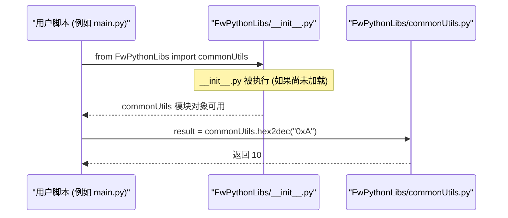

# Chapter 6: FwPythonLibs 通用工具


欢迎来到 `scripts` 项目教程的最后一章！在上一章 [内存布局管理与验证](05_内存布局管理与验证_.md) 中，我们学习了如何使用脚本工具来分析和验证固件的整体内存使用情况，确保“城市”的规划合理且资源得到有效利用。现在，我们将目光转向那些支撑着前面所有章节中讨论的各种脚本的“幕后英雄”——`FwPythonLibs` 通用工具库。

## 6.1 为什么需要通用工具库？

想象一下，你正在负责一个大型的工程项目，项目中有很多不同的团队（或脚本）在进行各自的工作。如果每个团队在遇到类似的问题时（比如，需要一把螺丝刀，或者需要测量长度）都各自去购买或制造一套工具，那将会是多么低效和浪费！不仅如此，每个团队制造的工具可能标准不一，导致最终的工程质量参差不齐。

`FwPythonLibs` 就好比是这个大型工程项目的中央工具房。它收集了各种常用且标准化的工具，比如：
*   数字转换器（十六进制、十进制、二进制互转）
*   文件路径处理器（统一路径分隔符、裁剪路径）
*   Excel 表格助手（合并单元格处理、自动调整列宽）
*   版本控制系统（Perforce）的快捷接口
*   自定义的“警报器”（异常处理）

**核心用例：**
假设项目中的多个脚本（比如 [配置主数据解析](01_配置主数据解析_.md) 中的 `parseConfigMaster.py` 和 [寄存器C结构生成](03_寄存器c结构生成_.md) 中的 `genRegStructs.py`）都需要将一个十进制数字转换为特定长度的十六进制字符串，并且要求统一添加 "0x" 前缀和下划线分隔符。

*   **没有 `FwPythonLibs` 的情况**：每个脚本可能都需要自己编写一段逻辑来实现这个转换。这将导致：
    *   **代码重复**：同样的功能在多处实现。
    *   **不一致性**：一个脚本可能实现为 "0xAB_CD"，另一个可能是 "0xABCD"，或者忘记了补零。
    *   **维护困难**：如果转换规则需要修改（例如，下划线规则改变），需要找到所有实现的地方逐一修改。

*   **使用 `FwPythonLibs` 的情况**：所有脚本都可以从 `FwPythonLibs` 中导入一个名为 `commonUtils` 的“工具箱”，然后调用其中的 `dec2hex()` “转换工具”。
    ```python
    from FwPythonLibs import commonUtils

    decimal_val = 255
    hex_string = commonUtils.dec2hex(decimal_val, aLength=4, aAddUnderScore=True, aAddPrefix=True)
    # hex_string 将会是 "0x00_FF"
    ```
    这样就确保了功能的一致性、代码的简洁性和维护的便捷性。当转换规则需要调整时，只需修改 `commonUtils.dec2hex()` 这一个地方即可。

`FwPythonLibs` 的目标就是提供一个共享的、经过良好测试的 Python 代码库，为项目中的其他自动化脚本提供基础且可重用的工具函数，从而提高开发效率和代码质量。

## 6.2 `FwPythonLibs` 工具箱概览

`FwPythonLibs` 作为一个 Python 包（一个包含 `__init__.py` 文件的目录），其内部包含了多个 `.py` 文件，每个文件可以看作是工具箱中的一个“抽屉”，装着特定类型的工具：

*   **`commonUtils.py`**：通用工具抽屉。包含最常用的一些杂项工具，如：
    *   十六进制、十进制、二进制数字之间的转换。
    *   文件和目录路径处理。
    *   生成标准的版权信息头。
    *   列表操作（如扁平化）。

*   **`excelUtils.py`**：Excel 处理工具抽屉。专为操作 Excel 文件（通常使用 `openpyxl` 库）提供便利，如：
    *   取消合并单元格并填充值。
    *   移除单元格中的换行符。
    *   自动调整列宽以适应内容。

*   **`customExceptions.py`**：自定义异常抽屉。定义项目中特有的异常类型，使得错误处理更加明确。

*   **`p4Utils.py`**：Perforce (P4) 版本控制工具抽屉。封装了与 P4 服务器交互的一些常用操作。

*   **`__init__.py`**：工具箱的“说明书”或“索引”。这个特殊文件使得 `FwPythonLibs` 目录可以被 Python 识别为一个包，并且可以控制哪些工具从包中“暴露”出来供外部使用。

接下来，我们将逐个打开这些“抽屉”，看看里面有哪些实用的工具。

## 6.3 通用工具抽屉 (`commonUtils.py`)

`commonUtils.py` 文件提供了许多与具体业务逻辑无关的通用辅助函数。

### 6.3.1 数字转换工具

在处理硬件配置和底层数据时，经常需要在不同的数字进制之间进行转换。

*   **`hex2dec(aHexNum: str)`**: 将十六进制字符串（如 "0x1A_2B"）转换为十进制整数。
    ```python
    from FwPythonLibs import commonUtils

    hex_val_str = "0x00_FF"
    decimal_val = commonUtils.hex2dec(hex_val_str)
    print(f"'{hex_val_str}' 转换为十进制是: {decimal_val}") # 输出: '0x00_FF' 转换为十进制是: 255
    ```
    这个函数会首先移除十六进制字符串中的下划线，然后使用 `int(hex_string, 16)` 将其转换为十进制数。它还会检查输入是否以 "0x" 开头。

*   **`dec2hex(aVal: int, aLength: int = None, aAddUnderScore: bool = True, aAddPrefix: bool = True) -> str`**: 将十进制整数转换为十六进制字符串。
    ```python
    from FwPythonLibs import commonUtils

    dec_val = 4095
    # 转换为8位长度的十六进制，带下划线和0x前缀
    hex_str1 = commonUtils.dec2hex(dec_val, aLength=8, aAddUnderScore=True, aAddPrefix=True)
    print(f"{dec_val} 转换为十六进制 (长8, 带下划线, 带前缀): {hex_str1}") # 输出: 4095 转换为十六进制 (长8, 带下划线, 带前缀): 0x0000_0FFF

    # 不指定长度，不带下划线，不带前缀
    hex_str2 = commonUtils.dec2hex(dec_val, aAddUnderScore=False, aAddPrefix=False)
    print(f"{dec_val} 转换为十六进制 (默认长, 无下划线, 无前缀): {hex_str2}") # 输出: 4095 转换为十六进制 (默认长, 无下划线, 无前缀): FFF
    ```
    该函数使用 Python 的 `format(value, '0{length}X')` 功能进行核心转换，并根据参数添加 "0x" 前缀和下划线（每4位）。

*   **`dec2bin(aVal: int, aLength: int = None, aAddUnderScore: bool = True, aAddPrefix: bool = False) -> str`**: 将十进制整数转换为二进制字符串。
    ```python
    from FwPythonLibs import commonUtils

    dec_val = 10
    # 转换为8位长度的二进制，带下划线，不带'b'前缀
    bin_str = commonUtils.dec2bin(dec_val, aLength=8, aAddUnderScore=True, aAddPrefix=False)
    print(f"{dec_val} 转换为二进制 (长8, 带下划线, 无前缀): {bin_str}") # 输出: 10 转换为二进制 (长8, 带下划线, 无前缀): 0000_1010
    ```
    与 `dec2hex` 类似，它使用 `format(value, '0{length}b')` 进行转换，并处理下划线和可选的前缀。

### 6.3.2 路径处理工具

在脚本中处理文件和目录路径时，统一路径格式和获取相对路径非常重要。

*   **`unifyPathSeparator(aPath: str) -> str`**: 将路径字符串中的所有反斜杠 (`\`) 替换为正斜杠 (`/`)。
    ```python
    from FwPythonLibs import commonUtils

    path_with_backslash = "C:\\Users\\project\\file.txt"
    unified_path = commonUtils.unifyPathSeparator(path_with_backslash)
    print(f"原始路径: {path_with_backslash}")       # 输出: 原始路径: C:\Users\project\file.txt
    print(f"统一后路径: {unified_path}")         # 输出: 统一后路径: C:/Users/project/file.txt
    ```
    这有助于确保路径在不同操作系统或工具间的兼容性。它内部使用正则表达式 `re.sub("[\\\]+", '/', aPath)` 来完成替换。

*   **`trimPath(aPath : str, aKey : str) -> str`**: 从给定路径 `aPath` 中，裁剪掉从关键词 `aKey` 开始及其之后的部分，并统一路径分隔符。
    ```python
    from FwPythonLibs import commonUtils

    full_path = "/home/user/project_root/firmware/src/main.c"
    key_dir = "/firmware"
    base_path = commonUtils.trimPath(full_path, key_dir)
    print(f"完整路径: {full_path}")  # 输出: 完整路径: /home/user/project_root/firmware/src/main.c
    print(f"裁剪关键字: {key_dir}")    # 输出: 裁剪关键字: /firmware
    print(f"基础路径: {base_path}")    # 输出: 基础路径: /home/user/project_root
    ```
    这个函数首先调用 `unifyPathSeparator`，然后使用字符串的 `split()` 方法根据 `aKey` 来裁剪路径。它在脚本需要定位项目根目录等场景下非常有用。

### 6.3.3 版权信息生成器

为自动生成的文件添加标准的版权信息是一个常见的需求。

*   **`getCopyright(aDetailedInfoMask : int = 7, aOutputFilePathFull : str = None, aInputFilePath : str = None) -> str`**: 生成包含 Synopsys 版权和一些可选详细信息（如运行者、时间、脚本名、输入/输出文件路径）的文本块。
    ```python
    from FwPythonLibs import commonUtils
    import os

    # 假设这是我们的输出文件路径
    output_file = os.path.abspath("./output/generated_file.h")
    # 假设这是输入文件
    input_file = os.path.abspath("./input/source_data.xlsx")

    # 生成包含运行者、时间、脚本、输入和输出信息的版权头
    # aDetailedInfoMask: 7 (二进制0b111) 表示包含用户、时间、脚本信息
    # 若要包含输入和输出，掩码会更大
    # 0: Run by, 1: Time, 2: Script, 3: Input, 4: Output, 5: FTISS File
    # 例如，包含所有基本信息 (0,1,2) 以及 Output (4)
    # Mask = (1<<0) | (1<<1) | (1<<2) | (1<<4) = 1 | 2 | 4 | 16 = 23
    copyright_text = commonUtils.getCopyright(
        aDetailedInfoMask=23, # 包含用户、时间、脚本和输出文件信息
        aOutputFilePathFull=output_file,
        aInputFilePath=input_file # 虽然掩码中没有指定 Input, 但可以传入
    )
    print(copyright_text)
    ```
    输出会是类似这样的文本块（具体时间、用户等会变化）：
    ```
    ////////////////////////////////////////////////////////////////////////////
    //
    // Copyright (C) 2024 Synopsys, Inc.  All rights reserved.        <-- 年份会是当前年份
    //
    // SYNOPSYS CONFIDENTIAL - This is an unpublished, proprietary work of
    // Synopsys, Inc., and is fully protected under copyright and trade secret
    // laws.  You may not view, use, disclose, copy, or distribute this file or
    // any information contained herein except pursuant to a valid written
    // license agreement. It may not be used, reproduced, or disclosed to others
    // except in accordance with the terms and conditions of that agreement.
    //
    ////////////////////////////////////////////////////////////////////////////

    /********************************************************************
    * DO NOT EDIT. THIS IS AN AUTO-GENERATED FILE.
    * Run by:      your_username                                       <-- 当前用户名
    * Time:        2024-07-15 10:30:00                                 <-- 当前时间
    * Script:      /path/to/your/script.py - your_function()           <-- 调用此函数的脚本和函数名
    * Output:      /path/to/your/project/output/generated_file.h       <-- 输出文件路径
    ********************************************************************/
    ```
    该函数内部使用 `datetime.datetime.now()` 获取当前时间，`getpass.getuser()` 获取当前用户名，`inspect.stack()` 获取调用者信息，并使用 `textwrap.dedent()` 来格式化输出的多行字符串。`aDetailedInfoMask` 是一个位掩码，用于控制哪些详细信息被包含在内。

### 6.3.4 其他通用工具

*   **`flatten(aNestedObject, aDepth: int = 1) -> list`**: 将嵌套列表（多维列表）“扁平化”为一维列表。
*   **`convertTableToColumnBased(aRawTable) -> Tuple[list]`**: 将一个表示表格的二维列表（行列表）转置为列列表。
*   **`checkDuplicatesInList(aList: list) -> None`**: 检查列表中是否有重复元素，如果有则抛出 `ValueError`。
*   **`tab(n: int=1) -> str`**: 返回指定数量的缩进（每个缩进4个空格）。

这些小工具在各种数据处理和代码生成任务中都非常方便。

## 6.4 Excel 处理工具抽屉 (`excelUtils.py`)

当脚本需要读取或预处理 Excel 文件（特别是那些由 `ParseConfigMaster` 处理的复杂表格）时，`excelUtils.py` 中的函数能提供很大帮助。这些函数通常操作 `openpyxl` 库的工作表对象。

*   **`unmergeAndFillValuesInSheet(aExlSheet)`**: 处理 Excel 工作表中的合并单元格。它会取消所有合并单元格的合并状态，并将原合并区域左上角单元格的值填充到所有被取消合并的单元格中。
    ```python
    # 假设已经用 openpyxl 打开了一个工作簿并获取了工作表对象 aSheet
    # import openpyxl
    # from FwPythonLibs import excelUtils
    #
    # workbook = openpyxl.load_workbook("my_excel_file.xlsx")
    # aSheet = workbook.active
    #
    # # 假设 aSheet 中 A1:B2 是合并单元格，值为 "Hello"
    # excelUtils.unmergeAndFillValuesInSheet(aSheet)
    # # 现在 A1, A2, B1, B2 四个单元格的值都会是 "Hello"，并且它们不再是合并状态
    #
    # workbook.save("my_excel_file_processed.xlsx")
    ```
    这个函数对简化后续的逐行逐单元格解析非常有益，因为解析合并单元格通常比较复杂。

*   **`replaceNewlineInSheet(aExlSheet)`**: 移除工作表中所有单元格内字符串值中的换行符 (`\n`)。
    ```python
    # 承接上例
    # from FwPythonLibs import excelUtils
    #
    # # 假设 aSheet 的 C1 单元格值为 "Line1\nLine2"
    # excelUtils.replaceNewlineInSheet(aSheet)
    # # 现在 C1 单元格的值会是 "Line1Line2"
    #
    # workbook.save("my_excel_file_processed.xlsx")
    ```
    这在数据需要被当作单行文本处理时很有用。

*   **`adjustExcelColWidth(aExlSheet)`**: 自动调整工作表中所有列的宽度，使其能够容纳该列中最长单元格的内容。
    ```python
    # 承接上例
    # from FwPythonLibs import excelUtils
    #
    # excelUtils.adjustExcelColWidth(aSheet)
    # # aSheet 中各列的宽度会被调整，以完整显示其内容
    #
    # workbook.save("my_excel_file_processed.xlsx")
    ```
    这使得自动生成的 Excel 文件更易于人工阅读。

这些 Excel 工具函数使得 `ParseConfigMaster` 等模块在处理来自 Excel 的原始数据时，能够先进行有效的预处理，简化后续的解析逻辑。

## 6.5 自定义异常抽屉 (`customExceptions.py`)

在复杂的脚本项目中，定义一些自定义的异常类有助于更精确地表达错误类型，并使错误处理代码更清晰。

`customExceptions.py` 文件中定义了一个基础的自定义异常类：
```python
# FwPythonLibs/customExceptions.py (部分)
class CustomException(Exception):
    def __init__(self, customMsg = "\n", *args, **kwargs):
        super().__init__(customMsg, *args, **kwargs)

# 其他更具体的自定义异常可以基于 CustomException 派生
# 例如:
# class FileParsingError(CustomException):
#     pass
# class ConfigurationError(CustomException):
#     pass
```
这个 `CustomException` 类继承自 Python 内置的 `Exception` 类。它允许在创建异常实例时传递一个自定义的消息 `customMsg`。

**如何使用？**
在其他脚本中，当遇到特定于项目逻辑的错误条件时，可以抛出这个自定义异常：
```python
from FwPythonLibs.customExceptions import CustomException # 注意导入路径

def process_data(data):
    if data is None:
        raise CustomException("!ERROR: 输入数据不能为空！")
    # ... 其他处理 ...

try:
    process_data(None)
except CustomException as e:
    print(f"捕获到自定义异常: {e}") # 输出: 捕获到自定义异常: !ERROR: 输入数据不能为空！
```
通过使用自定义异常，脚本可以更优雅地处理预期内的错误情况，并向用户提供更具体的错误信息。例如，在 `commonUtils.getCopyright()` 中，如果传入的参数不合法，它就会抛出 `CustomException`。

## 6.6 Perforce (P4) 工具抽屉 (`p4Utils.py`)

如果项目使用 Perforce (P4) 作为版本控制系统，`p4Utils.py` 提供了一些与 P4 服务器交互的便捷函数。这些函数是对 `P4Python` 库（通常通过 `import P4`导入）的简单封装。

*   **`createP4Obj()`**: 创建一个 P4 Python 对象实例。
*   **`connectToP4Server(aP4Obj)`**: 使用给定的 P4 对象连接到 P4 服务器。
*   **`printP4Env(aP4Obj)`**: 打印当前 P4 环境的相关信息（如 P4HOST, P4PORT, P4CLIENT, P4USER）。

**使用示例（概念性）：**
```python
# from FwPythonLibs import p4Utils, commonUtils # 假设 commonUtils 也被使用
#
# p4 = p4Utils.createP4Obj()
# if p4:
#     try:
#         p4Utils.connectToP4Server(p4)
#         if p4.connected():
#             p4Utils.printP4Env(p4)
#
#             # 假设我们要编辑一个文件
#             # file_to_edit = "path/to/my_file.txt"
#             # try:
#             #    p4.run_edit(file_to_edit) # P4Python 的实际命令
#             #    print(f"文件 {file_to_edit} 已为编辑签出。")
#             # except P4.P4Exception as e:
#             #    for error in p4.errors:
#             #        print(f"P4 错误: {error}")
#
#             p4.disconnect()
#     except Exception as e:
#         print(f"与P4交互时发生错误: {e}")
```
这些函数简化了P4操作的初始化步骤。在实际脚本中，你可能会使用 `p4.run("edit", file_path)`、`p4.run("submit", "-d", "提交描述")` 等 `P4Python` 提供的命令来执行更复杂的操作。`p4Utils.py` 提供的这些函数主要用于建立连接和获取环境信息，为后续的具体P4命令调用做准备。

## 6.7 工具箱的“组装说明” (`__init__.py`)

`FwPythonLibs` 目录下的 `__init__.py` 文件扮演着重要的角色。它使得 Python 将 `FwPythonLibs` 目录视为一个“包”（Package），而不是一个普通的目录。更重要的是，它可以控制从这个包中导入时，哪些模块或模块中的哪些名称是可见的。

`scripts` 项目中的 `FwPythonLibs/__init__.py` 文件内容如下：
```python
# FwPythonLibs/__init__.py
'''
////////////////////////////////////////////////////////////////////////////
//
// Copyright (C) 2025 Synopsys, Inc.  All rights reserved.
//
// SYNOPSYS CONFIDENTIAL - This is an unpublished, proprietary work of
// Synopsys, Inc., and is fully protected under copyright and trade secret
// laws.  You may not view, use, disclose, copy, or distribute this file or
// any information contained herein except pursuant to a valid written
// license agreement. It may not be used, reproduced, or disclosed to others
// except in accordance with the terms and conditions of that agreement.
//
////////////////////////////////////////////////////////////////////////////
'''
from .commonUtils import *
from .excelUtils import *
from .customExceptions import *
# 注意：p4Utils 没有在这里用 * 导入，所以使用 p4Utils 需要 from FwPythonLibs import p4Utils
```
这里的 `from .commonUtils import *` 语句意味着，当你执行 `from FwPythonLibs import some_name` 时，如果 `some_name` 是在 `commonUtils.py` 中定义的（并且不是以下划线开头的），那么它可以被直接导入。例如，因为 `hex2dec` 在 `commonUtils.py` 中定义，所以你可以写：
```python
from FwPythonLibs import hex2dec # 这是不正确的，因为 hex2dec 不是直接在 __init__.py 中定义的
# 正确的方式是，如果 __init__.py 使用了 from .commonUtils import *
# 那么 commonUtils 模块本身不会被直接导入到 FwPythonLibs 命名空间下
# 而是 commonUtils 里的所有公有名称被提升到了 FwPythonLibs 命名空间
# 所以，更常见的用法是：
from FwPythonLibs import commonUtils # 导入模块
value = commonUtils.hex2dec("0x10")

# 或者，如果 __init__.py 是 from .commonUtils import hex2dec
# 那么可以 from FwPythonLibs import hex2dec
# value = hex2dec("0x10")

# 根据提供的 __init__.py 文件 (from .commonUtils import *)
# 以及通常的 Python 包实践，更清晰的用法是导入模块本身：
from FwPythonLibs import commonUtils, excelUtils, customExceptions
# 然后通过模块名访问其函数：
commonUtils.dec2hex(10)
excelUtils.adjustExcelColWidth(my_sheet)
raise customExceptions.CustomException("错误!")

# 对于 p4Utils，因为它没有在 __init__.py 中用 * 导出或单独导出
# 所以必须这样导入：
from FwPythonLibs import p4Utils
p4_obj = p4Utils.createP4Obj()
```

简单来说，`__init__.py` 帮助组织了 `FwPythonLibs` 这个工具箱，使得其他脚本可以方便地按需取出并使用其中的工具。它定义了当你 `import FwPythonLibs` 或 `from FwPythonLibs import ...` 时，实际能获取到哪些东西。

**调用流程示意图 (以 `commonUtils.hex2dec` 为例)：**


当用户脚本尝试导入 `FwPythonLibs.commonUtils` 时，Python 解释器会找到 `FwPythonLibs` 目录，执行其 `__init__.py`（如果尚未执行）。然后，由于 `commonUtils` 是该目录下的一个模块，它会被加载，使得用户脚本可以调用 `commonUtils.hex2dec()`。

## 6.8 总结与展望

在本章中，我们一起探索了 `FwPythonLibs` 这个为 `scripts` 项目提供基础支持的通用工具库。我们了解到：

*   **它为何存在**：为了避免代码重复，提供标准化的工具函数，提高开发效率和代码一致性，就像一个共享的工具箱。
*   **它的主要组成部分**：
    *   `commonUtils.py`：提供数字转换、路径处理、版权生成等通用功能。
    *   `excelUtils.py`：提供Excel文件预处理的辅助函数。
    *   `customExceptions.py`：定义项目特定的异常类型。
    *   `p4Utils.py`：封装Perforce版本控制操作的简单接口。
    *   `__init__.py`：作为包的入口点，组织和暴露库的功能。
*   **如何使用它们**：通过 `from FwPythonLibs import module_name` 或特定函数来在其他脚本中调用这些工具。

`FwPythonLibs` 中的这些工具可能看起来比较零散，但它们是构建更复杂脚本（如我们在前几章讨论的 `ParseConfigMaster`, `genRegStructs`, `checkLcfMemRegion` 等）的基石。它们体现了软件工程中“不要重复自己”（DRY）的重要原则。

至此，我们已经完成了对 `scripts` 项目中主要脚本模块和支持库的入门学习之旅。从 [配置主数据解析](01_配置主数据解析_.md) 开始，我们了解了项目如何处理核心配置；接着探索了 [FTISS 文件处理](02_ftiss_文件处理_.md)、[寄存器C结构生成](03_寄存器c结构生成_.md)、[LCF 文件处理与校验](04_lcf_文件处理与校验_.md) 和 [内存布局管理与验证](05_内存布局管理与验证_.md) 等关键自动化任务；最后，我们认识了为这一切提供支持的 `FwPythonLibs` 通用工具。

希望这个系列教程能帮助你理解 `scripts` 项目的结构和工作原理，并为你将来使用或贡献这些脚本打下坚实的基础。祝你在固件自动化脚本的世界中探索愉快！

---

Generated by [AI Codebase Knowledge Builder](https://github.com/The-Pocket/Tutorial-Codebase-Knowledge)