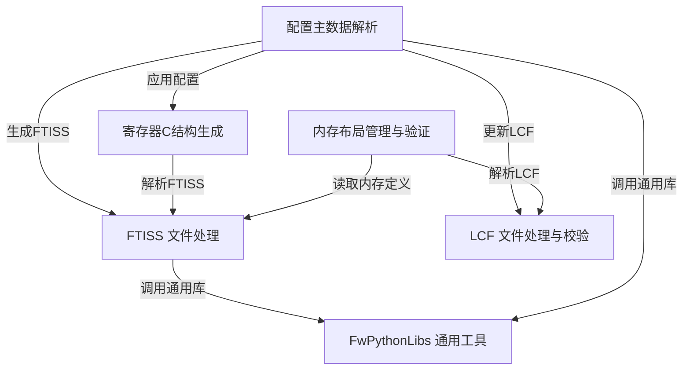

# Tutorial: scripts

该项目是一套Python脚本集合，旨在*自动化固件开发*中的关键流程。它围绕 **FTISS (固件测试接口规范表)** 构建，这份表格如同固件的“蓝图”，详细定义了内存映射、寄存器和配置参数。这些脚本能够**创建、读取和校验FTISS文件**，解析中央的“配置主数据”Excel文件，并据此自动*更新FTISS、生成C代码以及更新链接器脚本(LCF)*。此外，脚本还负责管理和验证固件的内存布局，从FTISS生成C语言的寄存器结构体。项目包含一个共享的*通用工具库(FwPythonLibs)*，为其他脚本提供基础功能支持，从而提升开发效率和代码一致性。

**Source Repository:** [None](None)

## Chapters

1. [配置主数据解析
](01_配置主数据解析_.md)
2. [FTISS 文件处理
](02_ftiss_文件处理_.md)
3. [寄存器C结构生成
](03_寄存器c结构生成_.md)
4. [LCF 文件处理与校验
](04_lcf_文件处理与校验_.md)
5. [内存布局管理与验证
](05_内存布局管理与验证_.md)
6. [FwPythonLibs 通用工具
](06_fwpythonlibs_通用工具_.md)

---

Generated by [AI Codebase Knowledge Builder](https://github.com/The-Pocket/Tutorial-Codebase-Knowledge)