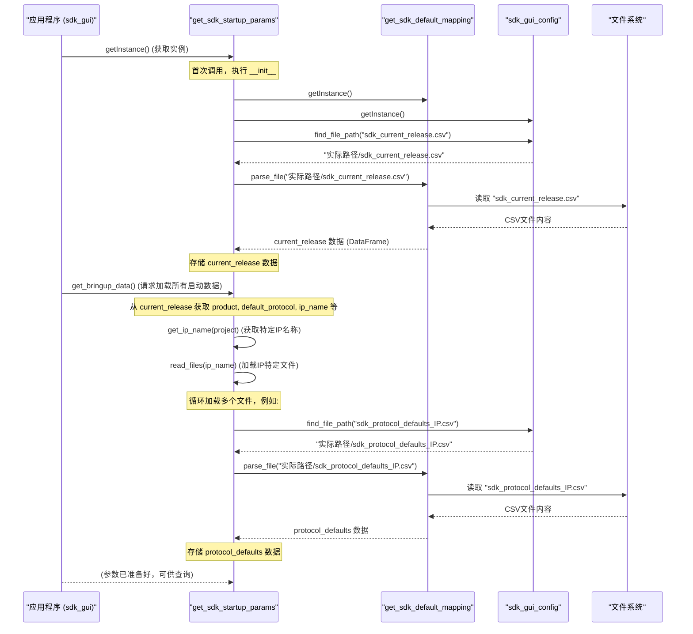

# Chapter 1: 参数加载与管理


欢迎来到 `sdk_gui` 项目的教程！本章我们将一起探索 "参数加载与管理" 模块。把它想象成我们应用程序的“后勤总管”，专门负责在程序启动和运行前，准备好所有必需的配置数据。

## 1.1 为什么需要参数加载与管理？

想象一下，你正在启动一个复杂的软件，比如我们的 `sdk_gui`。这个软件需要知道很多初始信息才能正常工作：
*   默认使用哪个通信协议？
*   有哪些预设的启动配置方案？
*   界面上某些下拉菜单应该显示哪些选项？

如果把这些信息都写死在代码里，那每次想修改一点点东西（比如换个默认协议，或者为一个新型号的设备添加新的配置），都得重新修改代码、编译、发布，非常麻烦。

**参数加载与管理**模块就是为了解决这个问题而生的。它允许我们将这些易变的配置信息存储在程序外部的文件中（通常是 CSV 文件），然后在程序启动时读取这些文件，并将配置数据提供给其他模块使用。

**核心用例：** 当 `sdk_gui` 启动时，它需要知道当前支持的产品是什么，默认应该使用哪个协议，以及针对特定 IP（可以理解为一个硬件模块或版本）的默认参数有哪些。参数加载与管理模块会从预定义的 CSV 文件中读取这些信息，并让它们在程序内部随手可得。

这就像一位大厨在烹饪前，他的助手会根据菜单（配置文件）把所有需要的食材（参数）准备好并放在手边。

## 1.2 核心概念

在我们深入代码之前，先来了解几个核心概念：

*   **配置参数 (Configuration Parameters):** 这些是程序运行所需的各种设置值。例如，默认的波特率、IP 地址、支持的设备列表等。将它们放在外部文件中，使得修改配置无需更改程序代码，提高了灵活性。
*   **CSV 文件 (Comma-Separated Values):** 这是一种简单的文本文件格式，用逗号来分隔不同的数据字段。它非常适合存储表格数据，并且可以用普通的文本编辑器或电子表格软件（如 Excel）轻松查看和编辑。`sdk_gui` 主要使用 CSV 文件来存储配置参数。

    例如，一个名为 `sdk_current_release.csv` 的文件可能长这样：
    ```csv
    Product,Default_Protocol,Project,IP_Name
    AwesomeProduct,UDP,MainProject;SideProject,CoolIP_v1;AnotherIP_v2
    ```
    这一行数据告诉程序，当前产品名是 "AwesomeProduct"，默认协议是 "UDP"，支持 "MainProject" 和 "SideProject" 两个项目，以及对应的 IP 名称。

*   **单例模式 (Singleton Pattern):** 在我们的参数管理模块中，你会看到一些类使用了单例模式。简单来说，单例模式确保一个类在整个程序运行期间只有一个实例（对象）。这对于管理全局配置信息非常有用，因为它可以保证所有地方访问到的都是同一份、最新的配置数据，避免了数据不一致的问题。

## 1.3 参数“搬运工”：`get_sdk_default_mapping`

`get_sdk_default_mapping.py` 文件中的 `get_sdk_default_mapping` 类是参数加载的基础。你可以把它看作是一个勤勤恳恳的“搬运工”，专门负责从单个 CSV 文件中读取数据。

**主要职责：**
*   读取指定的 CSV 文件。
*   进行一些基础的数据校验，比如文件是否存在、是否为空、是否有缺失数据。
*   将读取到的数据转换成程序易于处理的格式（Pandas DataFrame）。

让我们看看它的关键部分：

```python
# 文件: sdk_params/get_sdk_default_mapping.py
import pandas as pd
import os

class get_sdk_default_mapping:
    __instance = None # 用于单例模式

    @staticmethod
    def getInstance():
       """ 静态访问方法，获取单例 """
       if get_sdk_default_mapping.__instance == None:
          get_sdk_default_mapping()
       return get_sdk_default_mapping.__instance

    def __init__(self):
     """ 模拟私有构造函数 """
     if get_sdk_default_mapping.__instance != None:
        raise Exception("This class is a singleton!") # 确保只有一个实例
     else:
        get_sdk_default_mapping.__instance = self
     self.sdk_gui_csv_df = [] # 用来存储读取到的CSV数据
     self.mapping_file_path = str()
     self.mapping_file_date = None # 文件最后修改日期


    def parse_file(self, file_name):
       # 记录文件最后修改时间，用于后续可能的更新检查
       self.mapping_file_date = os.path.getmtime(file_name)

       try:
         # 使用 pandas 库来读取 CSV 文件
         self.sdk_gui_csv_df = pd.read_csv(file_name)
         
         # 一些基本的数据有效性检查
         if self.sdk_gui_csv_df.dropna(axis=1, how='all').empty: # 检查是否所有列都为空
            raise ValueError(f"{file_name} 中缺少数据")
         if self.sdk_gui_csv_df.empty: # 检查DataFrame是否为空
            raise ValueError(f"{file_name} 为空文件")
         if self.sdk_gui_csv_df.isnull().values.any(): # 检查是否有任何缺失值
            raise ValueError(f"文件 {file_name} 包含缺失值")
       
         # 如果文件成功读取且通过校验，则返回数据
         # get_mapping_params 实际上只是返回 self.sdk_gui_csv_df
         # 内部的更新检查逻辑我们在此简化，核心是上面的读取和校验
         return self.get_mapping_params(file_name) 
       
       except pd.errors.EmptyDataError: # pandas特定的空文件错误
          raise ValueError(f"{file_name} 文件是空的")
       except pd.errors.ParserError: # pandas解析错误
          raise ValueError(f"解析 {file_name} 文件时出错")
       except FileNotFoundError: # 文件未找到错误
          raise ValueError(f"文件 {file_name} 未找到")

    def get_mapping_params(self, file_name):
       # 此方法主要用于返回已加载的数据。
       # 原始代码中包含一个文件更新检查逻辑，
       # 如果文件自上次读取后被修改，理论上会重新加载。
       # 为简化理解，我们主要关注它返回 self.sdk_gui_csv_df 的功能。
       # mapping_file_date_new = os.path.getmtime(file_name)
       # delta = mapping_file_date_new - self.mapping_file_date
       # if (delta > 0):
       #    # 实际代码中 self.init(file_name) 可能需要调整为重新调用 parse_file 或类似逻辑
       #    print(f"文件 {file_name} 已更新，理论上应重新加载")
       return self.sdk_gui_csv_df

```

**代码解释：**
*   `getInstance()`: 这是获取 `get_sdk_default_mapping` 类唯一实例的方法。如果你需要读取 CSV，就通过这个方法获取对象。
*   `__init__()`: 构造函数。它确保了单例模式的实现，并初始化了一些内部变量，比如 `sdk_gui_csv_df` 用来存放从 CSV 文件读取出来的数据（一个 Pandas DataFrame）。
*   `parse_file(file_name)`: 这是核心方法。
    *   它接收一个 `file_name` (文件名)作为参数。
    *   使用 `pd.read_csv(file_name)` 来读取文件内容。Pandas 是一个强大的数据处理库，`read_csv` 可以方便地将 CSV 文件内容读入一个 DataFrame 对象，这是一种二维的、大小可变的、可以包含异构类型数据的表格结构，非常适合后续的数据操作。
    *   接下来是一系列的 `try-except` 块，用于捕获和处理可能发生的错误，比如文件找不到、文件是空的、或者文件格式有问题导致无法解析。
    *   它还进行了一些数据校验，确保读取到的数据不是完全无效的。
    *   成功读取并校验后，数据存储在 `self.sdk_gui_csv_df` 中，并通过调用 `get_mapping_params` 返回。
*   `get_mapping_params(file_name)`: 在当前上下文中，它主要负责返回已经加载到 `self.sdk_gui_csv_df` 中的数据。原始代码中包含了一个基于文件修改时间检查文件是否更新的逻辑，如果文件更新了，理论上它会触发数据的重新加载（尽管示例中的 `self.init` 调用可能需要具体实现）。对于初学者，可以理解为它提供了获取已加载数据的方式，并且系统有机制尝试保持数据为最新。

这个类本身不决定 *哪些* 文件需要被读取，它只负责 *如何* 读取单个文件。

## 1.4 参数“总指挥”：`get_sdk_startup_params`

如果说 `get_sdk_default_mapping` 是搬运工，那么 `get_sdk_startup_params.py` 文件中的 `get_sdk_startup_params` 类就是“总指挥”或“项目经理”。它知道程序启动时具体需要哪些配置文件，并协调 `get_sdk_default_mapping` 去读取它们，然后将这些参数整合起来供其他模块使用。

**主要职责：**
*   决定程序启动需要加载哪些核心配置文件 (例如：`sdk_current_release.csv`, `sdk_protocol_defaults_*.csv` 等)。
*   使用 `get_sdk_default_mapping` 实例来读取这些文件。
*   处理和存储从多个文件中读取到的参数。
*   提供方法给其他模块以获取这些配置参数。

```python
# 文件: sdk_params/get_sdk_startup_params.py
from sdk_params.get_sdk_default_mapping import *
# sdk_gui_config 用于帮助定位文件路径，我们将在后续章节 [GUI辅助与资源管理](06_gui辅助与资源管理_.md) 中详细了解它
from sdk_sub.sdk_config import * 

class get_sdk_startup_params:
   __instance = None # 用于单例模式

   @staticmethod
   def getInstance():
     """ 静态访问方法，获取单例 """
     if get_sdk_startup_params.__instance == None:
        get_sdk_startup_params()
     return get_sdk_startup_params.__instance

   def __init__(self):
     """ 模拟私有构造函数 """
     if get_sdk_startup_params.__instance != None:
        raise Exception("This class is a singleton!") # 确保只有一个实例
     else:
        get_sdk_startup_params.__instance = self
     
     # 获取文件读取器（搬运工）的实例
     self.sdk_csv_mapping = get_sdk_default_mapping.getInstance()
     # 获取GUI配置实例，主要用于查找文件路径
     self.gui_cfg = sdk_gui_config.getInstance()

     # === 程序初始化时，立即加载最核心的配置 ===
     # 使用 gui_cfg.find_file_path 找到 "sdk_current_release.csv" 文件的实际路径
     # 然后调用 sdk_csv_mapping.parse_file 来读取它
     self.current_release = self.sdk_csv_mapping.parse_file(
         self.gui_cfg.find_file_path("sdk_current_release.csv")
     )
     # 将列名统一转为小写，方便后续按名称访问，避免大小写问题
     self.current_release.columns = self.current_release.columns.str.lower()

   def read_files(self, ip_name):
      """根据 ip_name 加载特定于该 IP 的一系列配置文件"""
      # 加载协议默认值文件，文件名中包含 ip_name
      self.protocol_defaults_df = self.sdk_csv_mapping.parse_file(
          self.gui_cfg.find_file_path(f"sdk_protocol_defaults_{ip_name}.csv")
      )
      self.protocol_defaults_df.columns = self.protocol_defaults_df.columns.str.lower()

      # 加载启动参数文件
      self.start_up_params = self.sdk_csv_mapping.parse_file(
          self.gui_cfg.find_file_path(f"sdk_startup_params_{ip_name}.csv")
      )
      self.start_up_params.columns = self.start_up_params.columns.str.lower()
      
      # 加载GUI参数文件
      self.gui_params = self.sdk_csv_mapping.parse_file(
          self.gui_cfg.find_file_path(f"sdk_gui_params_{ip_name}.csv")
      )
      self.gui_params.columns = self.gui_params.columns.str.lower()

      # 加载模式映射文件
      self.pattern_mapping = self.sdk_csv_mapping.parse_file(
          self.gui_cfg.find_file_path(f"sdk_pattern_mapping_{ip_name}.csv")
      )
      self.pattern_mapping.columns = self.pattern_mapping.columns.str.lower()

   def get_bringup_data(self):
        """加载并准备所有必要的启动数据"""
        # 从已加载的 current_release 中获取基本信息
        self.product = self.current_release['product'][0]
        self.default_protocol = self.current_release['default_protocol'][0]
        # 'project' 和 'ip_name' 字段可能包含多个值，用分号分隔
        self.all_project = self.current_release['project'][0].split(';')
        self.all_ip_name = self.current_release['ip_name'][0].split(';')
        
        # 根据第一个项目对应的 IP 名称，加载相关的详细配置文件
        # get_ip_name 是一个辅助方法，用于从项目名称找到对应的 IP 名称
        self.read_files(self.get_ip_name(self.all_project[0]))

   # --- 提供获取参数的方法 ---
   def get_product(self):
        return self.product

   def get_default_protocol(self):
        return self.default_protocol

   def get_ip_name(self, project):
        """根据项目名称查找对应的 IP 名称"""
        # 这是一个简化的查找逻辑示例
        for idx in range(len(self.all_ip_name)):
            # 如果项目名 (转小写) 包含在某个 IP 名称 (转小写) 中
            if project.lower() in self.all_ip_name[idx].lower():
                return self.all_ip_name[idx]
        return None # 如果没找到，可以返回 None 或抛出错误
```

**代码解释：**
*   `__init__()`:
    *   获取 `get_sdk_default_mapping`（搬运工）和 `sdk_gui_config`（路径查找助手，来自[GUI辅助与资源管理
](06_gui辅助与资源管理_.md)章节）的实例。
    *   **关键一步**：它会立即加载 `sdk_current_release.csv` 文件。这个文件通常包含了最高级别的配置，比如当前产品是什么，默认用什么协议，支持哪些项目和IP版本。可以把它看作是配置的“总纲”。
    *   `self.current_release.columns = self.current_release.columns.str.lower()`: 这是一个很好的实践，将所有列名转换为小写。这样做可以避免因为大小写不一致（例如，CSV里是 `Product`，代码里想用 `product`）导致的出错，让代码更健壮。
*   `read_files(ip_name)`: 这个方法根据传入的 `ip_name`（代表特定的硬件或配置目标）来加载一系列更详细的配置文件。文件名通常会包含这个 `ip_name`，例如 `sdk_protocol_defaults_CoolIP_v1.csv`。它同样会把读取到的数据的列名转为小写。
*   `get_bringup_data()`: 这是应用程序在启动时通常会调用的一个核心方法。
    *   它首先从 `self.current_release`（就是 `sdk_current_release.csv` 的内容）中提取出产品名称、默认协议、所有支持的项目和IP名称列表。
    *   然后，它会（在这个例子中）默认选择第一个项目对应的 IP 名称，并调用 `read_files()` 来加载与这个 IP 相关的所有详细参数文件。这意味着程序启动后，会有一套针对特定 IP 的默认配置被加载进来。
*   `get_product()` 和 `get_default_protocol()`: 这些是简单的“getter”方法，允许程序的其他部分方便地获取已经加载好的特定配置参数，比如产品名称和默认协议。
*   `get_ip_name(project)`: 这是一个辅助函数，根据给定的 `project` 名称，从 `self.all_ip_name` 列表中找到并返回对应的 `ip_name`。

## 1.5 它们是如何协同工作的？

让我们通过一个简单的场景来看看这两个类是如何协同工作的，以完成参数的加载：

1.  **应用程序 (sdk_gui) 启动。**
2.  `sdk_gui` 的某个部分（比如主程序入口）需要获取启动配置。它会首先获取 `get_sdk_startup_params` 的实例：
    `startup_params = get_sdk_startup_params.getInstance()`
3.  在 `get_sdk_startup_params` 的 `__init__` 方法中：
    *   它会获取 `get_sdk_default_mapping` 的实例： `mapper = get_sdk_default_mapping.getInstance()`
    *   它会获取 `sdk_gui_config` 的实例 (用于查找文件路径)。
    *   它会指示 `mapper` 读取 `sdk_current_release.csv` 文件：`current_release_data = mapper.parse_file("path/to/sdk_current_release.csv")`。
    *   读取到的 `current_release_data` 被存储起来。
4.  接着，应用程序可能会调用 `startup_params.get_bringup_data()`。
5.  在 `get_bringup_data()` 方法中：
    *   从已加载的 `current_release_data` 中解析出当前产品、默认协议、项目列表和IP列表。
    *   根据解析出的（比如第一个）IP 名称，调用 `startup_params.read_files(ip_name)`。
6.  在 `read_files(ip_name)` 方法中：
    *   会构建出多个特定于 `ip_name` 的CSV文件名，例如 `sdk_protocol_defaults_<ip_name>.csv`。
    *   对于每个这样的文件名，它再次使用 `mapper.parse_file("path/to/specific_file.csv")` 来读取文件。
    *   所有这些特定于IP的参数也被存储起来。
7.  至此，所有必需的启动参数都已加载到 `startup_params` 对象中。
8.  应用程序的其他模块现在可以通过 `startup_params` 提供的 `get_product()`、`get_default_protocol()` 等方法，或者直接访问其存储的数据成员（如 `startup_params.protocol_defaults_df`）来获取配置信息。

下面是一个简化的时序图，展示了这个过程：



通过这种方式，`sdk_gui` 就能在启动时动态加载所需的配置，而不需要硬编码这些值。如果需要支持新的IP或修改默认设置，只需更新相应的 CSV 文件即可。

## 1.6 总结与展望

在本章中，我们学习了 `sdk_gui` 项目中“参数加载与管理”模块的重要性、核心概念以及它的两个主要组成部分：
*   `get_sdk_default_mapping`: 负责从单个 CSV 文件读取和校验数据的“搬运工”。
*   `get_sdk_startup_params`: 负责决定加载哪些文件、协调读取过程并将参数整合起来的“总指挥”。

我们了解到，通过将配置参数外部化到 CSV 文件中，并利用这两个类进行加载和管理，`sdk_gui` 实现了配置的灵活性和可维护性。这就像为我们的应用程序配备了一个高效的后勤团队，确保它在启动时拥有一切所需的“物资”。

现在，应用程序已经成功加载了它的配置参数，下一步是什么呢？自然是构建用户能看到和交互的界面了！

在下一章中，我们将深入探讨 [主界面与视图组件](02_主界面与视图组件_.md)，看看 `sdk_gui` 是如何搭建起它的“门面”的。

---

Generated by [AI Codebase Knowledge Builder](https://github.com/The-Pocket/Tutorial-Codebase-Knowledge)