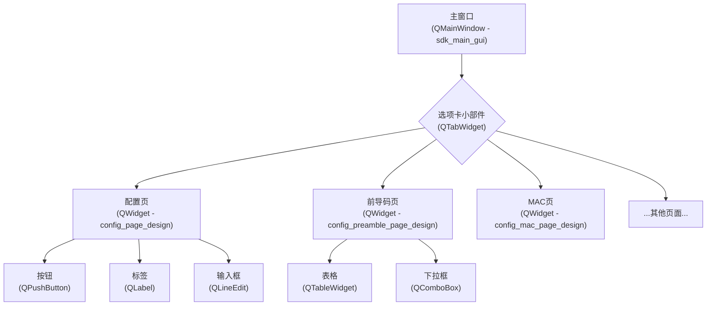
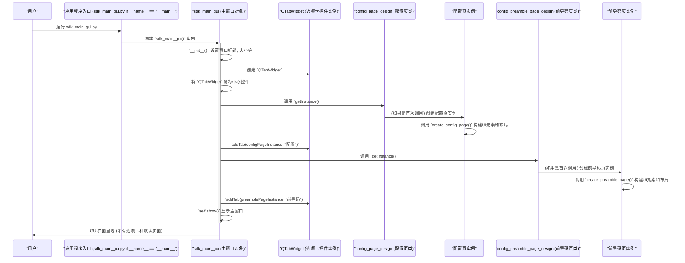

# Chapter 2: 主界面与视图组件


在上一章 [参数加载与管理](01_参数加载与管理_.md) 中，我们学习了 `sdk_gui` 如何在启动时准备好所有必需的配置数据，就像大厨备好了所有食材一样。现在，食材已经准备就绪，是时候搭建一个漂亮的“餐厅”——也就是用户界面(GUI)——来向用户展示这些信息，并允许用户进行操作了。

本章，我们将探索 `sdk_gui` 的“门面”——主界面和构成这个界面的各个视图组件。

## 2.1 引言：搭建软件的“店面”

想象一下，当你打开 `sdk_gui` 软件时，你期望看到什么？

**核心用例：** 用户启动 `sdk_gui` 后，会看到一个主应用程序窗口。这个窗口内部会有多个选项卡，比如“配置”(Config)、“前导码”(Preamble)、“MAC”、“PHY”以及可能存在的多个“通道”(Channel)页面。用户可以通过点击这些选项卡，轻松地在不同的功能界面之间切换，查看当前状态、修改参数设置，或者执行某些操作。

这就像一个房子的整体框架（主窗口）和里面的不同房间（各个视图/页面）。每个房间都有其特定的用途和内部陈设（界面元素）。用户通过这些房间与软件进行交互。主界面和视图组件正是构建这个“房子”和“房间”的关键，是用户体验的基础。

## 2.2 核心概念：构成用户界面的积木

在深入了解 `sdk_gui` 如何搭建界面之前，让我们先熟悉几个基本概念。这些概念来自于 `PySide6` (一个 Python 的 GUI 框架)，`sdk_gui` 使用它来创建界面。

*   **主窗口 (`QMainWindow`)**:
    这是整个应用程序最外层的窗口，它包含了菜单栏、工具栏、状态栏以及中心区域，是所有其他界面元素的“家”。在我们的房子比喻中，它就是房子的整体框架和外墙。
    在 `sdk_gui` 项目中，`sdk_main_gui.py` 文件里的 `sdk_main_gui` 类扮演的就是这个角色。

*   **选项卡小部件 (`QTabWidget`)**:
    这是一个非常实用的控件，它允许你在同一个区域内显示多个不同的页面（或称为“视图”）。用户可以通过点击不同的选项卡标签来切换显示哪个页面。就像房子里有多个房间（卧室、客厅、厨房），你可以选择进入哪一个。
    `sdk_gui` 使用 `QTabWidget` 来组织和展示不同的配置页面和功能页面。

*   **视图/页面 (`QWidget` 的子类)**:
    每个选项卡背后都是一个独立的视图或页面。这个页面负责展示特定功能的界面元素和信息。例如，“配置页”是一个视图，专门处理全局配置；“前导码页”是另一个视图，用于设置前导码参数。在我们的比喻中，这就是每个房间内部的装修和布局。
    这些视图通常定义在 `sdk_design` 目录下的各个 `*_design.py` 文件中。例如，`sdk_config_design.py` 定义了“配置页”的结构和内容。

*   **小部件 (`QWidget` 及其各种子类)**:
    这些是构成用户界面的最基本元素，比如按钮 (`QPushButton`)、文本标签 (`QLabel`)、输入框 (`QLineEdit`)、下拉选择框 (`QComboBox`)、表格 (`QTableWidget`) 等。它们就像房间里的具体家具、电器和装饰品。

*   **布局管理器 (Layout Managers)**:
    在页面上放置了许多小部件后，我们需要一种方式来组织它们的排列。布局管理器（如 `QGridLayout` 网格布局, `QVBoxLayout` 垂直布局, `QHBoxLayout` 水平布局）就负责这个工作。它们会自动调整小部件的大小和位置，确保界面在不同窗口尺寸下依然美观。这就像是如何在房间里摆放家具，让空间看起来整洁有序。

下面是一个简单的示意图，展示了这些组件如何组织在一起：



## 2.3 构建主界面：`sdk_main_gui.py` 概览

`sdk_main_gui.py` 文件中的 `sdk_main_gui` 类是整个 GUI 的起点和核心。它继承自 `QMainWindow`，负责创建和管理主窗口以及主要的选项卡界面。

### 2.3.1 初始化主窗口

当 `sdk_main_gui` 对象被创建时，它的 `__init__` 方法会执行一系列初始化操作：

1.  **设置窗口基本属性**：如标题、初始大小、最小尺寸和窗口图标。
2.  **加载参数**：它会获取在 [参数加载与管理](01_参数加载与管理_.md) 章节中讨论的 `get_sdk_startup_params` 实例，并调用其方法来加载程序运行所需的配置数据。
3.  **创建菜单栏**：例如 "文件" (File) 菜单及其下的选项。
4.  **创建核心的 `QTabWidget`**：这是容纳所有功能页面的容器。
5.  **将 `QTabWidget` 设置为中心部件**：这意味着选项卡界面将占据主窗口的主要区域。

让我们看一个简化的 `__init__` 方法示例：

```python
# 文件: sdk_main_gui.py
import sys
from PySide6.QtWidgets import QMainWindow, QTabWidget, QApplication # QtWidgets 包含了常用的UI元素
from PySide6.QtGui import QIcon
# 假设 sdk_config 和 get_sdk_startup_params 已正确导入
from sdk_sub.sdk_config import sdk_gui_config
from sdk_params.get_sdk_startup_params import get_sdk_startup_params
# 导入页面设计类 (稍后会用到)
from sdk_design.sdk_config_design import config_page_design
from sdk_design.sdk_config_preamble_design import config_preamble_page_design
# 导入自定义垂直选项卡类 (稍后解释)
from sdk_design.sdk_channel_page_design import sdk_channel_design # 只是为了演示导入，实际代码中create_vertical_tabs在sdk_main_gui.py中
# (假设 create_vertical_tabs 类定义在本文件或已导入)
from PySide6.QtCore import QSize
from PySide6.QtWidgets import QTabBar, QStylePainter, QStyleOptionTab, QStyle # 为了 create_vertical_tabs
from PySide6.QtGui import QColor, QFont # 为了 create_vertical_tabs

class create_vertical_tabs(QTabBar): # 先定义这个类，后面会用到
    def tabSizeHint(self, index: int) -> QSize:
        s = super().tabSizeHint(index)
        s.transpose() # 交换宽度和高度
        return s
    def paintEvent(self, event): # 实际绘制逻辑会更复杂
        # 为了简化，我们只调用父类的绘制，并进行一些基本设置
        # 实际代码中，这里会处理文本的旋转和选项卡的自定义绘制
        super().paintEvent(event)


class sdk_main_gui(QMainWindow):
    def __init__(self):
        super().__init__()
        self.setWindowTitle('SDK GUI 演示程序') # 设置窗口标题
        self.setMinimumSize(1000, 600)      # 设置窗口最小尺寸
        
        # 获取 GUI 配置实例，用于查找资源文件路径
        gui_cfg = sdk_gui_config.getInstance()
        # self.setWindowIcon(QIcon(gui_cfg.find_file_path("synopsys_icon.ico"))) # 设置窗口图标

        # 获取参数实例 (回顾第一章)
        sdk_csv_params = get_sdk_startup_params.getInstance()
        sdk_csv_params.get_bringup_data() # 加载数据

        # 创建选项卡小部件
        self.sdk_gui_tabs = QTabWidget()
        # 使用自定义的垂直选项卡栏，并设置其在窗口西部（左侧）
        self.sdk_gui_tabs.setTabBar(create_vertical_tabs(self))
        self.sdk_gui_tabs.setTabPosition(QTabWidget.West)

        # 将选项卡小部件设置为主窗口的中心部件
        self.setCentralWidget(self.sdk_gui_tabs)

        # 后续会在这里添加各个页面到 sdk_gui_tabs中
        self._add_pages_to_tabs() # 调用一个方法来添加页面

        self.show() # 显示主窗口

    def _add_pages_to_tabs(self):
        # 1. 获取配置页设计类的实例
        self.sdk_cfg = config_page_design.getInstance()
        # 2. 调用方法创建配置页的UI元素
        self.sdk_cfg.create_config_page()
        # 3. 将创建好的配置页作为一个选项卡添加到 QTabWidget 中
        self.sdk_gui_tabs.addTab(self.sdk_cfg, "配置") # "配置" 是选项卡的标题

        # 添加前导码页
        gs_config_tab = config_preamble_page_design.getInstance()
        gs_config_tab.create_preamble_page()
        self.sdk_gui_tabs.addTab(gs_config_tab, "前导码")
        
        # 实际应用中还会添加 MAC 页, PHY 页, 通道页等
        # 例如:
        # self.mac_config_tab = config_mac_page_design.getInstance()
        # self.mac_config_tab.create_mac_page()
        # self.sdk_gui_tabs.addTab(self.mac_config_tab, "MAC")
        # self.sdk_gui_tabs.setTabEnabled(self.sdk_gui_tabs.indexOf(self.mac_config_tab), False) # 初始禁用某个标签页

# 主程序入口 (用于独立测试此模块)
# if __name__ == "__main__":
# app = QApplication(sys.argv)
# main_window = sdk_main_gui()
# sys.exit(app.exec())
```
**代码解释：**
*   `super().__init__()`: 调用父类 `QMainWindow` 的构造函数，这是标准做法。
*   `self.setWindowTitle(...)`, `self.setMinimumSize(...)`: 设置窗口的基本属性。
*   `sdk_csv_params = get_sdk_startup_params.getInstance()`: 这里我们重用了第一章学习的参数加载模块，获取配置数据。
*   `self.sdk_gui_tabs = QTabWidget()`: 创建了一个标准的选项卡小部件。
*   `self.sdk_gui_tabs.setTabBar(create_vertical_tabs(self))`: 这一行比较特殊。它用一个自定义的 `create_vertical_tabs` 对象替换了标准的水平选项卡栏，从而实现垂直排列的选项卡。我们稍后会简要看一下 `create_vertical_tabs`。
*   `self.sdk_gui_tabs.setTabPosition(QTabWidget.West)`: 将垂直选项卡栏放置在窗口的左侧（West）。
*   `self.setCentralWidget(self.sdk_gui_tabs)`: 这是关键一步，它告诉主窗口，选项卡小部件是它的主要内容显示区域。
*   `_add_pages_to_tabs()` 方法（以及后续的 `addTab` 调用）演示了如何将不同的“房间”（视图页面）添加到这个选项卡“房子”中。
    *   `config_page_design.getInstance()`: 获取“配置页”设计类的单例实例。这些页面设计类通常也采用单例模式，确保在整个应用中只有一个实例。
    *   `self.sdk_cfg.create_config_page()`: 调用页面实例的方法来构建该页面的具体UI元素。
    *   `self.sdk_gui_tabs.addTab(self.sdk_cfg, "配置")`: 将构建好的配置页面 (`self.sdk_cfg`) 添加到选项卡小部件中，并给这个选项卡命名为“配置”。
    *   `setTabEnabled(index, False)`: 有时我们可能希望某个页面初始时是不可用的，这个方法可以禁用特定的选项卡。

### 2.3.2 特殊的垂直选项卡 (`create_vertical_tabs`)

`sdk_gui` 为了界面布局和视觉效果，使用了垂直排列的选项卡，而不是通常的水平排列。这是通过一个自定义类 `create_vertical_tabs` 实现的，它继承自 `QTabBar`（`QTabWidget` 内部用于显示选项卡标签的组件）。

```python
# 文件: sdk_main_gui.py (create_vertical_tabs 部分)
from PySide6.QtCore import QSize
from PySide6.QtWidgets import QTabBar, QStylePainter, QStyleOptionTab, QStyle # QStyleOptionTab 用于获取选项卡的样式信息
from PySide6.QtGui import QColor, QFont # QFont 用于设置字体

class create_vertical_tabs(QTabBar):
    # 这个方法告诉布局系统，选项卡应该有多大
    def tabSizeHint(self, index: int) -> QSize:
        size = super().tabSizeHint(index) # 获取原始建议的大小
        size.transpose() # 关键：交换宽度和高度，使其变为垂直方向的尺寸
        return size

    # 这个方法负责实际绘制每个选项卡
    def paintEvent(self, event): # event 是绘制事件对象
        painter = QStylePainter(self) # QStylePainter 帮助我们用当前应用的风格来绘制
        option = QStyleOptionTab()    # QStyleOptionTab 包含了绘制选项卡所需的所有信息

        for index in range(self.count()): # 遍历所有选项卡
            self.initStyleOption(option, index) # 初始化当前选项卡的样式选项
            
            # 实际代码中这里会有复杂的逻辑来判断是普通选项卡还是特殊选项卡 (如索引0和4)
            # 并分别进行绘制，包括背景色、文字旋转和对齐等
            # 为了简化，我们假设所有选项卡都简单绘制
            
            tabRect = self.tabRect(index) # 获取当前选项卡的矩形区域
            
            # 模拟简单绘制（实际代码更复杂，会旋转文字）
            painter.drawControl(QStyle.CE_TabBarTabShape, option) # 绘制选项卡的基本形状
            # painter.rotate(90) # 如果要旋转文字，会在这里进行变换
            painter.drawText(tabRect, QtCore.Qt.AlignCenter | QtCore.Qt.TextDontClip, self.tabText(index))
            # painter.restore() # 恢复之前的绘制状态

        # 注意：上面的 paintEvent 是一个高度简化的示意。
        # 实际的 paintEvent (如您提供的代码片段中) 会更复杂，
        # 它会区分不同的选项卡 (例如通过索引)，应用不同的样式，
        # 并且正确地旋转和平移画布来绘制垂直文本。
        # 对于初学者，理解其目的是实现自定义的垂直选项卡绘制即可。
```
**代码解释：**
*   `tabSizeHint` 方法通过调用 `super().tabSizeHint(index)` 获取原始的、为水平选项卡建议的尺寸，然后调用 `transpose()` 方法将宽度和高度互换。这样，每个选项卡就被认为是“高而窄”而不是“宽而扁”的。
*   `paintEvent` 方法是自定义绘制的核心。它在 `sdk_gui` 的实际代码中会更复杂，需要：
    *   获取每个选项卡的矩形区域 (`self.tabRect(index)`).
    *   保存当前绘制状态 (`painter.save()`).
    *   移动坐标系 (`painter.translate()`) 并旋转 (`painter.rotate(90)`)，以便将文本垂直绘制。
    *   绘制选项卡的背景、边框和文本 (`painter.drawControl(QStyle.CE_TabBarTabShape, option)` 和 `painter.drawControl(QStyle.CE_TabBarTabLabel, option)` 或 `painter.drawText(...)`).
    *   恢复绘制状态 (`painter.restore()`).
    *   对于初学者，重点是理解这个类使得选项卡能够垂直显示，并且可以自定义其外观。具体绘制细节可以暂时不必深究。

## 2.4 深入视图组件：以“配置页”为例 (`sdk_design/sdk_config_design.py`)

现在我们来看看构成每个选项卡内容的“房间”是如何设计的。以“配置页” (`config_page_design.py`) 为例，其他页面的设计也遵循类似的模式。

每个 `sdk_design` 目录下的 `*_design.py` 文件通常定义一个继承自 `QWidget` 的类。这个类负责构建该特定页面的所有UI元素，并将它们组织起来。

### `config_page_design` 类

*   **单例模式 (Singleton Pattern)**: 和 `get_sdk_default_mapping` 等类一样，页面设计类通常也使用单例模式。这意味着在整个应用程序的生命周期中，`config_page_design` 类只有一个实例。这样做的好处是，无论从哪里访问配置页，都是同一个对象，方便状态管理和数据同步。
*   **`create_config_page()` 方法**: 这是该类的核心方法。当主窗口需要显示配置页时，会调用这个方法来实际创建页面上的所有小部件（按钮、标签、输入框等）并将它们用布局管理器排列好。

让我们看一个 `create_config_page()` 方法的**高度简化**示例，展示如何添加几个UI元素：

```python
# 文件: sdk_design/sdk_config_design.py
from PySide6.QtWidgets import QWidget, QGridLayout, QLabel, QLineEdit, QPushButton, QHBoxLayout, QGroupBox, QSpacerItem, QSizePolicy
from PySide6.QtCore import Qt
from sdk_sub.sdk_config import sdk_gui_config # 用于获取资源路径等

class config_page_design(QWidget): # 继承自 QWidget，表示这是一个自定义的UI组件
    __instance = None
    @staticmethod
    def getInstance():
      if config_page_design.__instance == None:
         config_page_design()
      return config_page_design.__instance

    def __init__(self):
      super().__init__()
      if config_page_design.__instance != None:
         # 如果尝试创建第二个实例，则抛出异常
         raise Exception("config_page_design 是一个单例类!")
      else:
         config_page_design.__instance = self
      
      # self.gui_cfg = sdk_gui_config.getInstance() # 获取配置实例，可能用于加载样式等

    def create_config_page(self):
        # 1. 创建一个主布局，比如网格布局
        self.config_page_grid = QGridLayout()

        # 2. 创建一些小部件
        self.client_label = QLabel("客户端信息:") # 创建一个文本标签
        self.client_label.setAlignment(Qt.AlignCenter) # 文本居中

        self.port_number_label = QLabel("端口号:")
        self.port_number_field = QLineEdit()      # 创建一个单行文本输入框
        self.port_number_field.setText('27015')   # 设置默认文本
        self.port_number_field.setEnabled(False)  # 初始时可能设为不可编辑

        # 3. 创建更复杂的布局组合，比如一个水平布局放端口号标签和输入框
        client_info_layout = QHBoxLayout()
        client_info_layout.addWidget(self.port_number_label)
        client_info_layout.addWidget(self.port_number_field)

        # 4. 创建一个配置按钮组
        self.config_buttons_grpbox = QGroupBox("配置选项") # 带标题的分组框
        config_buttons_layout = QVBoxLayout() # 按钮垂直排列
        self.preamble_button = QPushButton("前导码配置")
        self.mac_button = QPushButton("MAC 配置")
        self.phy_button = QPushButton("PHY 配置")
        config_buttons_layout.addWidget(self.preamble_button)
        # ... 添加其他按钮 ...
        self.config_buttons_grpbox.setLayout(config_buttons_layout) # 将布局设置给分组框

        # 5. 将小部件和子布局添加到主网格布局中
        # addWidget(widget, row, column, rowSpan, columnSpan)
        self.config_page_grid.addWidget(self.client_label, 0, 0, 1, 2) # 标签占两列
        self.config_page_grid.addLayout(client_info_layout, 1, 0, 1, 2) # 水平布局也占两列
        self.config_page_grid.addWidget(self.config_buttons_grpbox, 2, 0, 1, 2) # 分组框占两列
        
        # (实际代码会有更多的小部件和更复杂的布局)
        # 例如，添加一个状态栏：
        self.status_box = QLineEdit("就绪")
        self.status_box.setEnabled(False)
        self.config_page_grid.addWidget(self.status_box, 3, 0, 1, 2)


        # 6. 最后，将主布局设置给这个页面 (self)
        self.setLayout(self.config_page_grid)

        # 7. 应用样式 (widgets_formatting 方法会做这件事)
        self._apply_styles() # 假设有个方法应用样式

    def _apply_styles(self):
        # 在这里，可以通过加载CSS文件或直接设置属性来美化界面
        # self.client_label.setStyleSheet("color: purple; font-weight: bold;")
        # self.preamble_button.setIcon(QIcon(self.gui_cfg.find_file_path("preamble.png")))
        pass # 简化处理
```
**代码解释：**
*   `config_page_design` 类继承自 `QWidget`，这意味着它可以被当作一个独立的UI块使用（比如添加到 `QTabWidget` 中）。
*   `create_config_page` 方法是UI构建的中心。
    *   它首先创建了一个 `QGridLayout` 作为此页面的主要布局方式。
    *   然后，创建了各种小部件，如 `QLabel`（标签）、`QLineEdit`（文本框）、`QPushButton`（按钮）和 `QGroupBox`（分组框）。
    *   小部件可以通过 `addWidget()` 添加到布局中，子布局（如 `client_info_layout`）可以通过 `addLayout()` 添加到主布局中。这些方法通常需要指定小部件或子布局在网格中的行、列以及可能跨越的行数和列数。
    *   `setLayout(self.config_page_grid)` 这行代码将 `config_page_grid` 设置为 `config_page_design` 这个 `QWidget` 的主布局。从此，这个布局管理器就负责页面内所有子元素的排列了。
    *   实际的 `sdk_config_design.py` 和其他 `*_design.py` 文件会包含更多的小部件和更精细的布局控制，以及通过 `widgets_formatting` 方法加载CSS样式表来美化界面。

### 其他视图组件概览

`sdk_gui` 项目中 `sdk_design` 目录下的其他主要视图组件也遵循类似的模式：

*   **`sdk_config_preamble_design.py` (前导码页)**:
    *   通常包含产品信息显示、项目选择下拉框。
    *   核心是一个 `QTableWidget` (表格)，用于显示和配置各种前导码参数，如模式 (Mode)、速率 (Rate)、位宽 (Width)、标准 (Standard)、参考时钟 (RefClk) 等。
    *   用户选择不同的模式或标准时，表格中的默认值会相应更新。

*   **`sdk_config_mac_design.py` (MAC配置页)**:
    *   界面相对复杂，包含MAC类型选择 (虚拟MAC/真实MAC)、测试用例选择 (环回测试/互操作测试)。
    *   根据用户的选择，页面下方会动态显示不同的配置选项，例如针对环回测试的链路0和链路1的参数设置，包括协议通道、技术能力值 (Techability Value) 和相关的 A0-A18 技术能力按钮。
    *   大量使用了 `QGroupBox`, `QRadioButton`, `QCheckBox`, `QLineEdit`, `QTableWidget` 和自定义按钮。

*   **`sdk_config_phy_design.py` (PHY配置页)**:
    *   用于配置每个物理通道 (Lane) 的PHY层参数。
    *   通常会有一个表头区域定义如“通用”(General)、“发送端”(TX)、“接收端”(RX) 等参数类别及其子项（如标准、模式、EQ-Pre、使能等）。
    *   下方会为每个活动的通道动态创建一行配置控件，包含多个下拉框 (`QComboBox`) 和复选框 (`QCheckBox`)，允许用户精细调整每个通道的PHY设置。

*   **`sdk_channel_page_design.py` (通道页)**:
    *   当PHY配置完成并运行后，每个物理通道可能会有自己的专属页面。
    *   这个页面用于显示该通道的详细测试结果，如BER (误码率)、眼图、校准码等。
    *   可能包含 `QTableWidget` 来显示数值结果，以及图表区域（可能集成 `pyqtgraph` 或类似库）来可视化数据。
    *   还会有如“更新绘图”、“刷新”、“同步PM”等操作按钮。

所有这些页面都封装了各自的UI逻辑，使得主窗口 `sdk_main_gui` 的代码可以保持相对简洁，只需负责将这些预先设计好的页面模块组装起来。

## 2.5 主界面与视图的协同工作

现在我们把所有部分串联起来，看看当用户启动 `sdk_gui` 时，界面是如何一步步构建并呈现的：



**流程解释：**
1.  用户启动应用程序。
2.  `sdk_main_gui` 主窗口对象被创建。
3.  在其构造函数 (`__init__`) 中：
    *   主窗口的基本属性被设置。
    *   一个 `QTabWidget` 实例被创建，并被设置为主窗口的中心显示区域。
    *   接着，主窗口会逐个处理它想要包含的功能页面：
        *   它会调用相应页面设计类（如 `config_page_design`）的 `getInstance()`静态方法来获取该页面的单例实例。
        *   如果这是第一次获取该页面的实例，页面设计类的构造函数会被调用。
        *   然后，主窗口会调用该页面实例的 `create_<page_name>_page()` 方法（例如 `create_config_page()`），这个方法负责构建该页面内部所有的UI元素（按钮、标签、输入框等）和布局。
        *   一旦页面的UI构建完成，主窗口就通过 `self.sdk_gui_tabs.addTab(page_instance, "页面名称")` 将这个页面添加到 `QTabWidget`中，并给它一个用户可见的名称。
4.  这个过程会为所有预定义的页面（配置页、前导码页、MAC页、PHY页等）重复进行。
5.  最后，当所有页面都已添加到选项卡小部件后，主窗口调用 `self.show()` 方法，将整个构建好的用户界面显示给用户。

用户现在看到的将是一个包含多个选项卡的应用程序窗口，每个选项卡背后都是一个精心设计的、用于特定功能的视图组件。

## 2.6 总结与展望

在本章中，我们一起探索了 `sdk_gui` 项目是如何搭建起它的“门面”——主界面和各个视图组件的。我们了解到：

*   **`sdk_main_gui`** (继承自 `QMainWindow`) 是整个应用程序的框架，它容纳了所有其他的UI部分。
*   **`QTabWidget`** 被用来创建多选项卡的界面，使得用户可以在不同的功能模块之间轻松切换。`sdk_gui` 还使用了自定义的垂直选项卡栏 `create_vertical_tabs` 来实现独特的视觉效果。
*   每一个功能页面（如配置页、前导码页、MAC页、PHY页、通道页）都是一个独立的 **`QWidget` 子类** (定义在 `sdk_design` 目录下)，它们负责构建和管理各自区域内的UI元素和布局。这些页面设计类通常采用单例模式。

通过这种模块化的设计，`sdk_gui` 的界面结构清晰，易于扩展和维护。我们现在拥有了一个可视化的操作平台，就像一座装修好了的房子，有了不同的房间，每个房间里也摆放了家具。

但是，光有漂亮的界面还不够。用户点击了界面上的按钮，或者在输入框里填了数据，程序应该如何响应这些操作呢？如何将用户的动作与后台的逻辑处理联系起来，让软件“活”起来？

这正是我们下一章 [回调与应用逻辑协调器](03_回调与应用逻辑协调器_.md) 将要揭示的秘密。它将为我们的“房子”接通“水、电、煤气”，并安装上“智能控制系统”，让它真正运作起来。敬请期待！

---

Generated by [AI Codebase Knowledge Builder](https://github.com/The-Pocket/Tutorial-Codebase-Knowledge)