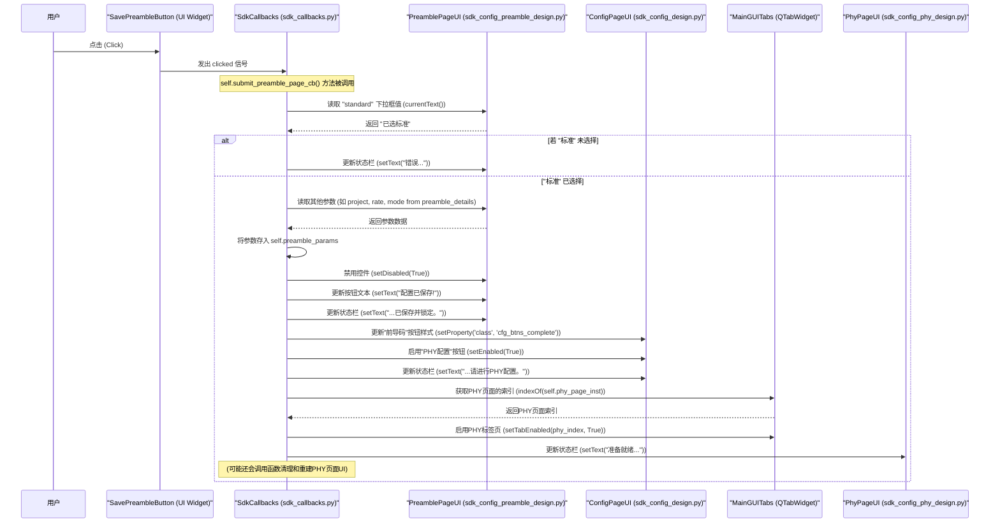

# Chapter 3: 回调与应用逻辑协调器


欢迎回来！在上一章 [主界面与视图组件](02_主界面与视图组件_.md) 中，我们学习了 `sdk_gui` 是如何搭建起用户可以看到和交互的“门面”——各种窗口、选项卡和页面。我们现在有了一个漂亮的“房子”，里面有不同的“房间”和“家具”。但是，如果这些“家具”（比如按钮）只是摆设，用户点击了却没有反应，那这个“房子”依然是死气沉沉的。

本章，我们将深入探讨 `sdk_gui` 的“神经中枢”——**回调与应用逻辑协调器**。它负责让我们的界面“活”起来，响应用户的每一个动作，并执行相应的处理逻辑。

## 3.1 为什么需要回调与应用逻辑协调器？

想象一下，我们的 `sdk_gui` 界面已经显示出来了，用户看到了“前导码配置”页面上的“保存”按钮。

**核心用例：** 当用户在“前导码页”上填写完所有参数后，点击了“保存”按钮。程序应该如何响应？
1.  它需要读取用户在页面上输入的各种配置数据（比如项目名称、模式、标准等）。
2.  它可能需要对这些数据进行校验，确保它们是有效的。
3.  它需要将这些有效的配置数据“保存”起来（可能是暂存在内存中，或者准备发送给后台服务）。
4.  它应该更新界面上的状态信息，告诉用户“保存成功”或者指出错误。
5.  它可能还需要根据这次操作的结果，启用或禁用界面上的其他按钮或选项卡，引导用户进行下一步操作（比如，前导码配置完成后，才能进行PHY配置）。

如果每一个按钮、每一个输入框的响应逻辑都分散地写在它们各自的UI设计代码里，那整个程序会变得非常混乱和难以维护。当一个小小的需求变更（比如保存成功后多一个提示）都可能需要修改很多地方。

**回调与应用逻辑协调器** (在 `sdk_gui` 项目中主要由 `sdk_callbacks.py` 文件中的 `sdk_callbacks` 类实现) 就是为了解决这个问题而生的。它像一个高度专业的“事件调度员”或“控制中心操作员”：
*   它“监听”着来自界面上各个组件的“信号”（比如按钮被点击）。
*   当接收到信号时，它会执行预先定义好的“处理程序”（回调函数）。
*   这些处理程序集中管理了应用的业务逻辑，如数据处理、状态更新、流程控制等。

它将用户的意图（点击、输入）转化为程序的实际行为，驱动着整个应用的功能流程。

## 3.2 核心概念

在深入 `sdk_callbacks.py` 的代码之前，我们先来理解几个关键概念：

*   **事件 (Event)**: 用户在界面上的各种操作，例如点击鼠标按钮、在输入框中键入文本、从下拉列表中选择一个项目等，这些都被视为事件。
*   **回调函数 (Callback Function)**: 这是一种特殊的函数。你不会立即调用它，而是把它“注册”或“传递”给另一个部分（比如一个按钮）。当特定的事件（比如按钮被点击）发生时，这个预先注册的函数就会被“回调”执行。就像你给快递员留下电话号码，告诉他货到了就打这个电话（回调你的号码）。
*   **信号与槽 (Signals and Slots - PySide6 特性)**: 这是 `PySide6` (Qt GUI框架) 提供的一种强大而灵活的回调实现机制，也是 `sdk_gui` 中响应用户操作的核心方式。
    *   **信号 (Signal)**: 当一个对象（通常是一个界面小部件，如 `QPushButton` 按钮）的状态发生改变或某个特定事件发生时，它会“发出”(emit)一个信号。例如，按钮被点击时会发出 `clicked()` 信号；输入框内容改变时会发出 `textChanged()` 信号。信号本身不包含处理逻辑，它只是一个通知。
    *   **槽 (Slot)**: 一个普通的 Python 函数或类的方法。它可以被“连接”(connect)到一个或多个信号上。当连接的信号被发出时，这个槽函数就会被自动执行。槽函数包含了响应事件的具体逻辑。
    *   **连接 (Connection)**: 使用特定方法 (如 `widget.signal_name.connect(slot_function)`) 将一个信号与一个槽关联起来的过程。一个信号可以连接到多个槽，一个槽也可以响应多个信号。

```mermaid
    graph LR
        A[用户点击按钮] --> B(按钮对象 QPushButton);
        B -- 发出 --> C[clicked() 信号];
        C -- 连接到 (connect) --> D[槽函数 (一个Python方法)];
        D -- 执行 --> E[应用逻辑 (如保存数据, 更新UI)];
```

*   **应用逻辑协调器 (`sdk_callbacks` 类)**: 在我们的 `sdk_gui` 项目中，`sdk_callbacks` 类扮演了这个角色。它是一个中心化的模块，主要负责：
    *   获取各个UI页面 ([主界面与视图组件](02_主界面与视图组件_.md) 中创建的) 的实例。
    *   建立信号和槽之间的连接。
    *   实现作为槽的具体回调方法，这些方法包含了大部分的应用逻辑。

## 3.3 `sdk_callbacks`：GUI 的“神经中枢”

`sdk_callbacks.py` 文件中的 `sdk_callbacks` 类是整个GUI交互逻辑的核心。它像我们身体的神经中枢，接收来自各个“感官”（UI组件）的信号，并指挥身体的各个部分（其他UI组件、数据处理模块等）做出响应。

### 3.3.1 初始化：获取“感官”和“工具”

当 `sdk_callbacks` 对象被创建时，它的 `__init__` 方法会做一些准备工作，主要是获取它需要操作的界面元素实例和可能用到的其他工具（比如参数管理器）：

```python
# 文件: sdk_callbacks.py (简化片段)
# 导入必要的模块和页面设计类
from sdk_design.sdk_config_design import config_page_design
from sdk_design.sdk_config_preamble_design import config_preamble_page_design
from sdk_design.sdk_config_mac_design import config_mac_page_design
from sdk_params.get_sdk_startup_params import get_sdk_startup_params
# ... 其他导入 ...

class sdk_callbacks():
    sdk_main_gui = None # 用于存储主GUI窗口的引用

    def __init__(self):
        super().__init__()
        # 1. 获取各个UI页面设计类的单例实例
        #    这些实例是在 [主界面与视图组件](02_主界面与视图组件_.md) 章节中讨论的页面对象
        self.config_page_int = config_page_design.getInstance()
        self.preamble_page_inst = config_preamble_page_design.getInstance()
        self.mac_page_inst = config_mac_page_design.getInstance()
        # self.phy_page_inst = config_PHY_design.getInstance() # 获取PHY页面实例

        # 2. 获取参数管理器实例 (来自 [参数加载与管理](01_参数加载与管理_.md) 章节)
        self.sdk_params = get_sdk_startup_params.getInstance()
        
        # 3. 初始化客户端 (用于后续与后台通信，将在下一章详细介绍)
        # self.get_sdk_client(int(self.config_page_int.port_number_field.text()))
        # ... 其他初始化 ...

    def get_sdk_client(self, port=7878, host='localhost', *__args):
        # 这是一个获取客户端实例的方法，我们将在下一章深入
        # if self.config_page_int.port_number_field.text():
        #     # ... 客户端初始化逻辑 ...
        pass # 暂时简化

    def set_main_instance(self, main_gui_instance):
        # 保存主窗口 (sdk_main_gui) 的实例，
        # 这样回调函数就可以操作它 (比如切换标签页)
        self.sdk_main_gui = main_gui_instance
```
**代码解释:**
*   `__init__` 方法中，`sdk_callbacks` 通过调用各个页面设计类 (如 `config_page_design`) 的 `getInstance()` 方法，获取了这些UI页面的唯一实例。这样，`sdk_callbacks` 就能直接访问和操作这些页面上的按钮、输入框等元素了。
*   它还获取了 `get_sdk_startup_params` 的实例，以便在需要时读取或使用配置参数。
*   `set_main_instance(main_gui_instance)` 方法非常重要。主程序 (`sdk_main_gui.py`) 在创建了 `sdk_callbacks` 的实例后，会调用这个方法把自己（主窗口实例）传递过来。这样，`sdk_callbacks` 内部的方法就能控制主窗口的行为，例如切换选项卡。

## 3.4 连接信号与槽：让按钮“说话”

仅仅获取了UI元素的实例还不够，我们还需要告诉程序：当某个UI元素发出某个信号时，应该执行哪个函数（槽）。这个“告诉”的过程就是“连接信号与槽”，通常在 `sdk_callbacks` 的一个初始化方法（比如名为 `init` 的方法）中完成。

`PySide6` 中连接信号和槽的基本语法是：`发送信号的对象.信号名.connect(要执行的槽函数)`。

### 3.4.1 简单回调：使用 `lambda` 函数

对于一些非常简单的操作，比如点击一个按钮就切换到另一个选项卡，我们可以使用 `lambda` 函数（一种小型的匿名函数）作为槽。

```python
# 文件: sdk_callbacks.py (init 方法片段)
class sdk_callbacks():
    # ... ( __init__ 和 set_main_instance 如上) ...

    def init(self):
        # --- 配置页 (Config Page) 按钮的回调设置 ---
        # 当 "前导码配置" 按钮 (self.config_page_int.preamble_button) 被点击 (clicked) 时...
        self.config_page_int.preamble_button.clicked.connect(
            # ...执行这个 lambda 函数：让主窗口的选项卡切换到索引为 1 的页面
            lambda: self.sdk_main_gui.sdk_gui_tabs.setCurrentIndex(1)
        )

        # 当 "MAC 配置" 按钮被点击时，切换到索引为 2 的标签页 (MAC页)
        self.config_page_int.mac_button.clicked.connect(
            lambda: self.sdk_main_gui.sdk_gui_tabs.setCurrentIndex(2)
        )

        # 当 "PHY 配置" 按钮被点击时，切换到索引为 3 的标签页 (PHY页)
        self.config_page_int.PHY_button.clicked.connect(
            lambda: self.sdk_main_gui.sdk_gui_tabs.setCurrentIndex(3)
        )
        
        # 当端口号输入框内容被编辑时，尝试重新获取客户端 (更复杂逻辑，暂时简化)
        # self.config_page_int.port_number_field.textEdited.connect(
        # lambda: self.get_sdk_client()
        # )

        # 菜单栏 "转储寄存器" 动作触发时，调用 dump_registers_val 方法
        # self.sdk_main_gui.reg_dumps.triggered.connect(lambda:self.dump_registers_val())
        
        # ... 其他页面的回调设置将在下面展示 ...
```
**代码解释:**
*   `self.config_page_int.preamble_button` 就是我们在配置页创建的那个“前导码配置”按钮对象。
*   `.clicked` 是这个按钮对象内置的一个信号，当按钮被用户点击时就会发出。
*   `.connect(...)` 方法将这个 `clicked` 信号连接到一个槽。
*   `lambda: self.sdk_main_gui.sdk_gui_tabs.setCurrentIndex(1)` 就是这个槽。它是一个简单的 `lambda` 函数，其功能是调用主窗口 (`self.sdk_main_gui`) 的选项卡控件 (`sdk_gui_tabs`) 的 `setCurrentIndex(1)` 方法，使得选项卡切换到索引为1的页面（通常是“前导码页”）。

### 3.4.2 复杂回调：调用专用的成员方法

当用户操作需要执行更复杂的逻辑时（比如读取数据、校验、更新多个UI元素等），使用 `lambda` 函数就不太方便了。这时，我们会将信号连接到 `sdk_callbacks` 类自身的一个专门为此编写的成员方法上。

```python
# 文件: sdk_callbacks.py (init 方法片段 - 续)
class sdk_callbacks():
    # ... (前面的代码) ...
    def init(self):
        # ... (配置页按钮的回调如上) ...

        # --- 前导码页 (Preamble Page) 的回调设置 ---
        # "返回" 按钮 (在页面头部) 点击后，切换回索引为 0 的标签页 (配置页)
        self.preamble_page_inst.sdk_config_preamble_header.back_btn.clicked.connect(
            lambda: self.sdk_main_gui.sdk_gui_tabs.setCurrentIndex(0)
        )
        # "重置前导码" 按钮点击后，调用本类的 self.reset_premable_page_cb 方法
        self.preamble_page_inst.reset_preamble.clicked.connect(
            lambda: self.reset_premable_page_cb()
        )
        # "保存前导码" 按钮点击后，调用本类的 self.submit_preamble_page_cb 方法
        self.preamble_page_inst.save_preamble.clicked.connect(
            lambda: self.submit_preamble_page_cb()
        )
        # 当 "项目选择" 下拉框 (project_value_cb) 的选项被激活 (改变) 时...
        self.preamble_page_inst.project_value_cb.activated.connect(
            # ...调用本类的 self.change_project_cb 方法
            lambda: self.change_project_cb()
        )
        
        # --- MAC 页的回调 (示例) ---
        # self.mac_page_inst.apply_mac.clicked.connect(
        # lambda: self.submit_mac_page_configuration()
        # )
        # ... 其他MAC页、PHY页的信号连接 ...
```
**代码解释:**
*   `self.preamble_page_inst.save_preamble.clicked.connect(lambda: self.submit_preamble_page_cb())`：
    *   `self.preamble_page_inst.save_preamble` 是前导码页面上的“保存”按钮。
    *   它的 `clicked` 信号被连接到了 `self.submit_preamble_page_cb` 这个方法。注意，这里仍然用了一个 `lambda` 函数来调用 `self.submit_preamble_page_cb()`。这样做是因为 `.connect()` 期望传递的是一个可调用对象。直接写 `self.submit_preamble_page_cb` 也是可以的（如果该方法不需要参数或者其参数签名与信号匹配）。使用 `lambda` 的好处是可以在连接时传递额外的参数或者进行简单的适配，但在这个例子中主要是为了保持一致性或处理某些特定情况。更简洁的方式是直接 `connect(self.submit_preamble_page_cb)`。
*   `self.preamble_page_inst.project_value_cb.activated.connect(lambda: self.change_project_cb())`:
    *   `project_value_cb` 是前导码页面上的项目选择下拉框。
    *   `activated` 是 `QComboBox` (下拉框) 在用户选择一个新项目后发出的信号。
    *   它连接到了 `self.change_project_cb` 方法。

这样，当用户点击“保存前导码”按钮时，`sdk_callbacks` 类中的 `submit_preamble_page_cb` 方法就会被执行。当用户改变项目选择时，`change_project_cb` 方法就会被执行。这些方法内部就包含了响应这些事件的具体应用逻辑。

## 3.5 编写回调逻辑：响应用户操作

现在我们来看看这些被连接的槽方法（如 `change_project_cb` 和 `submit_preamble_page_cb`）内部都做了些什么。

### 示例1：响应下拉框选择变化 (`change_project_cb`)

当用户在前导码页面选择了一个新的“项目”时，`change_project_cb` 方法会被调用。它的主要任务是根据新选择的项目，去加载对应的 IP 名称和相关配置。

```python
# 文件: sdk_callbacks.py (回调方法片段)

# ... (class sdk_callbacks 及其 init 方法) ...

    def change_project_cb(self):
        # 1. 从前导码页面的 "project_value_cb" 下拉框获取当前选中的项目名称
        selected_project = self.preamble_page_inst.project_value_cb.currentText()
        
        # 2. 使用参数管理器 self.sdk_params (来自第一章) 的 get_ip_name 方法
        #    来查找这个项目对应的 IP 名称 (例如 "CoolIP_v1")
        ip_name = self.sdk_params.get_ip_name(selected_project)
        
        if ip_name is None:
            # 3a. 如果没有找到对应的 IP 名称 (可能配置文件有误)
            #     在页面的状态栏 (status_box) 显示错误消息
            self.preamble_page_inst.status_box.setText(
                f"错误：项目 {selected_project} 对应的后端CSV文件不存在。"
            )
            #     并将下拉框恢复到第一个选项 (默认项目)
            self.preamble_page_inst.project_value_cb.setCurrentIndex(0)
            return # 结束处理
        
        # 3b. 如果找到了 IP 名称，就让参数管理器去读取与这个IP相关的所有配置文件
        #     (例如 sdk_protocol_defaults_CoolIP_v1.csv, sdk_startup_params_CoolIP_v1.csv 等)
        self.sdk_params.read_files(ip_name)
        
        # 4. (可选) 更新状态栏，提示用户配置已加载
        self.preamble_page_inst.status_box.setText(f"已成功加载项目 {selected_project} (IP: {ip_name}) 的配置。")
        
        # 实际代码中，这里可能还会根据新加载的参数，刷新前导码页面的表格内容
        # self.preamble_page_inst.populate_table_with_defaults() # 假设有这样一个方法
```
**代码解释:**
1.  `self.preamble_page_inst.project_value_cb.currentText()`: 从前导码页面的项目下拉框获取当前选定的文本。
2.  `self.sdk_params.get_ip_name(selected_project)`: 调用 [参数加载与管理](01_参数加载与管理_.md) 模块的功能，根据项目名找到对应的IP名。
3.  错误处理：如果找不到IP，就在前导码页面的 `status_box` (一个文本框，用作状态显示) 中显示错误，并重置下拉框。
4.  `self.sdk_params.read_files(ip_name)`: 如果找到了IP，就让参数管理器加载该IP的一系列配置文件。这些新的配置数据现在就可以被程序的其他部分使用了。
5.  最后，更新状态栏提示用户。

这个回调函数清晰地展示了如何响应用户输入、如何与其他模块（参数管理器）交互，以及如何更新UI反馈用户。

### 示例2：响应保存按钮点击 (简化的 `submit_preamble_page_cb`)

当用户点击前导码页面的“保存”按钮时，`submit_preamble_page_cb` 方法会被调用。这个方法通常会执行以下操作：
*   进行输入校验。
*   收集用户在页面上配置的数据。
*   更新UI状态，比如禁用已配置的区域，改变按钮文本，提示用户操作结果。
*   启用工作流程中的下一步，比如允许用户配置MAC或PHY。
*   准备或重新构建后续配置页面的内容。

```python
# 文件: sdk_callbacks.py (回调方法片段)

# ... (class sdk_callbacks 及其 init, change_project_cb 方法) ...

    def submit_preamble_page_cb(self):
        # 1. 进行一些基本的校验，例如检查 "standard" 下拉框是否已选择
        selected_standard = self.preamble_page_inst.preamble_table_standard_box.currentText()
        if selected_standard == '':
            self.preamble_page_inst.status_box.setText("错误：请先选择模式 (Mode) 和标准 (Standard)！")
            return # 不满足条件，则提前退出

        # 2. 从界面收集前导码参数，并存储在 self.preamble_params 字典中
        #    (这是一个简化示例，实际代码会从 self.preamble_page_inst.preamble_details 获取更多数据)
        self.preamble_params = {
            "project": self.preamble_page_inst.project_value_cb.currentText(),
            "rate": self.preamble_page_inst.preamble_details.get("Rate"), # 从字典获取速率
            "width": self.preamble_page_inst.preamble_details.get("Width"), # 获取位宽
            "mode": 1 if self.preamble_page_inst.preamble_details.get('Mode') == 'Ethernet' else 0,
            # ... 其他从UI收集的参数 ...
        }
        
        # 3. 更新前导码页面的UI状态：
        #    - 禁用参数表格和项目选择下拉框，防止用户再次修改
        self.preamble_page_inst.preamble_table.setDisabled(True)
        self.preamble_page_inst.project_value_cb.setDisabled(True)
        #    - 更改 "保存" 按钮的文本并禁用它
        self.preamble_page_inst.save_preamble.setText('配置已保存!')
        self.preamble_page_inst.save_preamble.setDisabled(True)
        #    - 更新前导码页面的状态栏信息
        self.preamble_page_inst.status_box.setText("前导码配置已保存并锁定。")

        # 4. 更新主配置页面 (Config Page) 上按钮的样式和状态：
        #    - 将 "前导码配置" 按钮的样式属性 'class' 设置为 'cfg_btns_complete' (表示完成)
        self.config_page_int.preamble_button.setProperty('class', 'cfg_btns_complete')
        #    - (实际代码中会调用 self.config_page_int.widget_style_sheet 刷新样式)
        
        # 5. 启用主配置页面上的 "PHY 配置" 按钮，并更新其样式和主配置页状态
        self.config_page_int.PHY_button.setEnabled(True) # 启用PHY配置按钮
        self.config_page_int.PHY_button.setProperty('class', 'cfg_btns_incomplete') # 标记为待配置
        self.config_page_int.status_box.setText("前导码配置完毕。请进行PHY配置。")

        # 6. (重要) 启用PHY配置标签页，并可能清除和重建PHY页面的内容
        #    这确保PHY页面使用最新的前导码信息来构建其配置选项
        phy_tab_index = self.sdk_main_gui.sdk_gui_tabs.indexOf(self.phy_page_inst) # 获取PHY页的索引
        if phy_tab_index != -1: # 确保找到了PHY页
             self.sdk_main_gui.sdk_gui_tabs.setTabEnabled(phy_tab_index, True)
             # self.sdk_main_gui.sdk_gui_tabs.setTabToolTip(phy_tab_index, "") # 清除提示

        #    实际代码中，这里会调用类似 self.clear_layout() 和 sdk_config_lanes() 
        #    来动态生成PHY配置页的UI元素，这部分比较复杂，此处简化。
        # self.clear_layout(self.phy_page_inst.dummy_links_grid) # 清理PHY页旧布局
        # sdk_config_lanes_instance = sdk_config_lanes() # 创建PHY通道配置UI的辅助类实例
        # self.phy_res = copy.deepcopy(sdk_config_lanes_instance.fetch_res()) # 获取默认PHY资源结构
        # self.config_lane_page_handle = sdk_config_lanes_instance.fetch_lane_handle() # 获取PHY Lane控件句柄
        self.phy_page_inst.status_box.setText("准备就绪。请设置PHY配置。")
```
**代码解释:**
*   这个函数首先做一些校验。
*   然后，它从 `self.preamble_page_inst` (前导码页实例) 的属性中（如 `preamble_details` 字典，该字典在 `sdk_config_preamble_design.py` 中当用户与表格交互时被填充）收集数据，并存入 `self.preamble_params`。这个字典之后可能会被用于 [客户端通信与后台交互](04_客户端通信与后台交互_.md)。
*   接着，它大量地更新了UI：
    *   在前导码页面，禁用了刚配置过的元素，更改了按钮文本和状态栏。
    *   在主配置页面 (`self.config_page_int`)，更新了“前导码配置”按钮的视觉状态（通过 `setProperty`，通常配合CSS样式表来改变外观），并启用了“PHY配置”按钮。
    *   启用了PHY配置的主选项卡，让用户可以进入下一步。
*   最后，它通常会触发PHY配置页面的重新构建或内容更新，以反映当前的前导码设置。这部分在实际代码中可能涉及到动态创建UI元素，如 `sdk_config_lanes` 类的逻辑。

这个例子展示了回调函数如何协调多个UI页面之间的状态和行为，实现了一个清晰的工作流程。

## 3.6 工作流程：一次点击的幕后故事

让我们通过一个时序图来更直观地看看当用户点击“保存前导码”按钮后，内部发生了什么：


这个图清晰地展示了 `sdk_callbacks` 如何作为中心协调者，在接收到用户操作（按钮点击）后，与各个UI页面进行交互，读取数据，更新界面状态，并控制应用的流程。

## 3.7 总结与展望

在本章中，我们深入了解了 `sdk_gui` 的“大脑”——回调与应用逻辑协调器 (`sdk_callbacks`)：

*   我们理解了**回调**的基本概念，以及 `PySide6` 中强大的**信号与槽机制**是如何实现它的。
*   我们看到了 `sdk_callbacks` 类如何在其 `__init__` 方法中获取各个UI页面的实例，并通过 `set_main_instance` 与主窗口建立联系。
*   我们学习了如何在 `sdk_callbacks` 的 `init` 方法中，使用 `.connect()` 将UI部件（如按钮、下拉框）发出的**信号**（如 `clicked`, `activated`）连接到**槽**（简单的 `lambda` 函数或 `sdk_callbacks` 类的专用方法）。
*   通过 `change_project_cb` 和简化的 `submit_preamble_page_cb` 示例，我们看到了回调方法（槽）内部如何执行**应用逻辑**：读取用户输入、调用其他模块功能（如参数加载）、进行数据处理、以及细致地更新多个UI元素的状态，从而引导用户完成操作流程。

至此，我们的 `sdk_gui` 不仅有了漂亮的“外观”（通过[主界面与视图组件](02_主界面与视图组件_.md)构建），还有了响应用户操作的“灵魂”。用户现在可以与界面进行有意义的交互了。

但是，`sdk_gui` 作为一个SDK的图形界面，其核心目的之一是与某个后端服务或硬件进行通信，发送配置、执行命令、获取结果。我们收集到的 `self.preamble_params` 这样的数据，最终是要发送出去的。

那么，`sdk_gui` 是如何与外部世界（比如一个运行在本地或远程的服务器程序）进行通信的呢？这正是我们下一章 [客户端通信与后台交互](04_客户端通信与后台交互_.md) 将要探索的内容。敬请期待！

---

Generated by [AI Codebase Knowledge Builder](https://github.com/The-Pocket/Tutorial-Codebase-Knowledge)