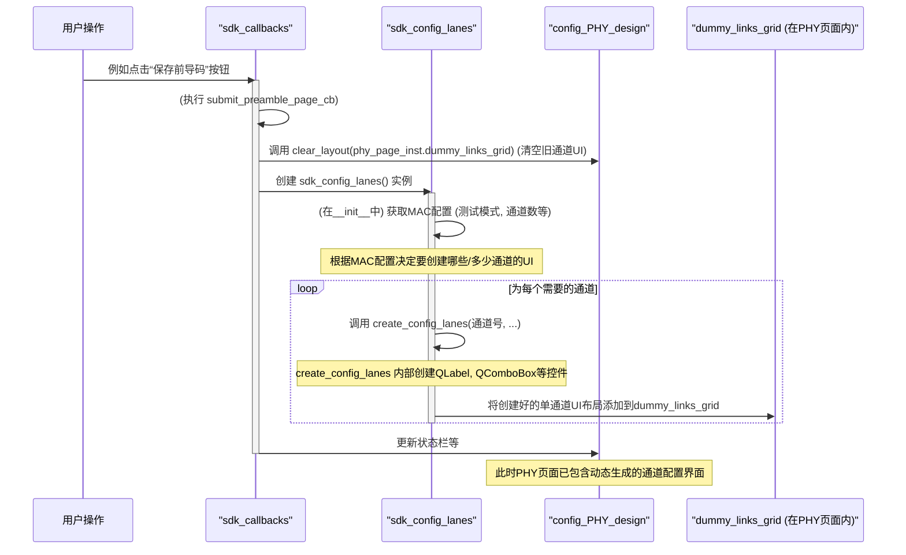

# Chapter 5: PHY通道动态配置


欢迎来到 `sdk_gui` 教程的第五章！在上一章 [客户端通信与后台交互](04_客户端通信与后台交互_.md) 中，我们学习了 `sdk_gui` 如何作为“通讯员”与后端服务器进行数据交换，发送配置并接收结果。我们知道，PHY（物理层）的配置通常涉及到多个独立的物理通道（Lanes），每个通道都有其特定的参数。

如果我们的硬件支持不同数量的通道，或者根据不同的测试模式需要配置不同数量的通道，那么为每一种情况都预先设计好固定的界面将会非常繁琐且缺乏灵活性。本章，我们将探索 `sdk_gui` 中一个非常智能的特性——**PHY通道动态配置**，它能像一位经验丰富的“模块装配师”一样，根据用户的需求（MAC配置）自动搭建出恰到好处的PHY通道配置界面。

## 5.1 为什么需要PHY通道动态配置？——“按需搭建”的智慧

想象一下，你正在使用 `sdk_gui` 配置一个支持多种模式的PHY设备。
*   在“环回测试”(Loopback Test) 模式下，你可能需要配置4个通道，并且这些通道的某些参数（比如标准、使能状态）可能是预设的。
*   在“AN禁用”(AN Disabled) 模式下，你可能只需要配置2个通道，并且可以自由设定它们的标准、码型等参数。
*   如果换了一款硬件，它可能只支持1个或支持多达8个通道。

**核心用例：** 用户在“MAC配置页”选择了“环回测试”模式，并指定了参与测试的链路（Link）及其包含的通道数量。当用户切换到“PHY配置页”时，`sdk_gui` 应该自动根据这些MAC层面的选择，为每个需要配置的PHY通道动态生成一行用户界面元素（如标签、下拉框、复选框等），而不是显示一个固定数量的、可能不适用当前场景的通道配置区域。

如果PHY配置页的通道数量是写死的，那么：
*   对于通道较少的场景，界面上会有很多无用的空白或禁用的控件，显得冗余。
*   对于通道较多的场景，预设的界面可能不够用，无法完成配置。
*   每次硬件或测试需求变更，都可能需要修改界面代码。

**PHY通道动态配置**正是为了解决这个问题。它使得PHY配置页能够根据上游的配置（主要是MAC配置中的测试模式和AN使能状态）来“量体裁衣”，只生成和展示当前场景下真正需要的通道配置界面。这就像一个智能的模块装配师，依据用户输入的设计蓝图（MAC配置），自动构建和展示特定功能的配置区域（PHY通道UI）。

## 5.2 核心概念：动态UI的“积木”与“装配师”

*   **MAC配置作为“设计蓝图”**: 用户在MAC配置页面所做的选择（例如，测试模式是“环回”还是“AN禁用”，在环回模式下选择了哪些通道参与测试，AN是否使能等）是动态构建PHY通道界面的主要依据。这些信息告诉“装配师”需要构建多少个模块，以及每个模块的基本规格。
*   **PHY通道UI作为“按需构建的配置区域”**: 在PHY配置页面上，每一行代表一个物理通道的配置。这一行包含了设置该通道所需的各种控件，如标准显示、码型选择、环回模式选择、使能复选框等。这些行不是预先画好的，而是根据“设计蓝图”在运行时动态创建的。
*   **`sdk_config_lanes.py` 文件中的 `sdk_config_lanes` 类**: 这就是我们的“智能装配师”。这个类负责读取MAC配置的“蓝图”，然后根据蓝图动态创建、组织和管理PHY设置页面上的各个通道（Lane）相关的用户界面元素。它将一个个小的UI控件（积木）组装成代表单个通道的配置行，再将这些行添加到PHY配置页面中。

## 5.3 如何“触发”动态配置？—— 自动化的魔力

用户并不会直接“调用”或“使用”这个动态配置功能。相反，这个过程是在用户完成某些先决条件配置后自动触发的。

通常的流程是：
1.  用户在 [主界面与视图组件](02_主界面与视图组件_.md) 章节介绍的“前导码页”完成基本配置并保存。
2.  然后，用户可能会进入“MAC配置页”（如果当前流程需要），选择测试模式（例如“环回测试”或“AN禁用模式”）、AN使能状态等，并提交MAC配置。
3.  在 [回调与应用逻辑协调器](03_回调与应用逻辑协调器_.md) 章节讨论的 `sdk_callbacks` 模块中，当这些配置（如前导码或MAC配置）被成功提交后，相应的回调函数（例如 `submit_preamble_page_cb` 或 `submit_mac_page_configuration`）会被执行。
4.  在这些回调函数内部，会有一段逻辑专门负责**准备和更新PHY配置页面**。这个准备过程就包括了调用“智能装配师” (`sdk_config_lanes`) 来动态构建PHY通道的UI。

所以，用户通过完成前置配置，间接触发了PHY通道UI的动态生成。当用户导航到PHY配置页时，看到的已经是根据他们之前的选择量身定制的界面了。

## 5.4 内部实现：探秘“智能装配师”的工作坊

让我们来看看当用户提交了前导码或MAC配置后，`sdk_gui` 内部是如何一步步动态生成PHY通道配置界面的。

### 5.4.1 概览：从回调到UI生成



**流程解释：**
1.  **触发点**：用户的某个操作（如点击“保存前导码”按钮）会调用 `sdk_callbacks` 中的一个回调函数，比如 `submit_preamble_page_cb`。
2.  **清理旧UI**：在该回调函数中，首先会清理掉PHY配置页面上可能存在的旧的通道UI元素。这是通过调用一个类似 `clear_layout()` 的方法，作用于PHY配置页 (`config_PHY_design` 实例) 内的一个特定布局容器（如 `dummy_links_grid`）来实现的。
3.  **唤醒装配师**：接着，回调函数会创建 `sdk_config_lanes` 类的一个实例。
4.  **读取蓝图**：`sdk_config_lanes` 的构造函数 (`__init__`) 会被执行。它会访问 `config_mac_page_design` 的实例（获取MAC配置信息，如测试模式 `mac_test_case_type` 和相关的通道数据 `mac_config_data`）或者 `get_sdk_startup_params` 的实例（获取一些默认的通道支持信息）。
5.  **按需装配**：根据获取到的配置（“蓝图”），`sdk_config_lanes` 会判断需要为哪些通道、以及多少个通道创建UI。它会根据不同的测试模式（如 `loopback`, `InterOp`, `without_AN`）调用不同的内部方法来处理。
6.  **创建单个通道UI**：在这些内部方法中，会有一个核心的函数（如 `create_config_lanes`，它内部可能调用 `init_config_lanes`）负责为**单个**PHY通道创建所有必要的UI控件（`QLabel`、`QComboBox`、`QCheckBox`等）。这些控件的名称通常会包含通道号和类型前缀，以确保唯一性，这是通过 `setattr` 动态设置对象属性来实现的。
7.  **添加到布局**：创建好的单个通道的UI控件会被组织到一个布局中（通常是 `QHBoxLayout`，代表一行），然后这个行布局会被添加到 `config_PHY_design` 实例的 `dummy_links_grid` 网格布局中。
8.  **循环往复**：步骤6和7会为所有需要配置的通道重复进行。
9.  **完成**：当所有通道的UI都创建并添加到PHY配置页面后，`sdk_config_lanes` 实例的初始化完成。此时，PHY配置页面就拥有了根据当前上下文动态生成的、最新的通道配置界面。

### 5.4.2 代码探秘：深入“装配车间”

让我们更具体地看看代码是如何实现这个动态过程的。

**1. 触发动态配置的源头 (`sdk_callbacks.py`)**

在 `sdk_callbacks.py` 的 `submit_preamble_page_cb` 方法（或者 `submit_mac_page_configuration`，取决于具体流程设计）中，当用户成功保存了前导码（和/或MAC）配置后，会执行以下操作来更新PHY页面：

```python
# 文件: sdk_callbacks.py (submit_preamble_page_cb 简化片段)
# ... (其他代码) ...
    def submit_preamble_page_cb(self):
        # ... (参数收集和UI更新代码) ...

        # 启用PHY配置相关的UI元素
        self.config_page_int.PHY_button.setEnabled(True)
        self.sdk_main_gui.sdk_gui_tabs.setTabEnabled(
            self.sdk_main_gui.sdk_gui_tabs.indexOf(self.phy_page_inst), True
        )

        # --- 动态配置PHY通道UI的关键步骤 ---
        # 1. 清理PHY页面上旧的通道布局
        self.clear_layout(self.phy_page_inst.dummy_links_grid)
        
        # 2. 创建 sdk_config_lanes 实例，这将触发UI的动态构建
        sdk_config_lanes_instance = sdk_config_lanes() 
        
        # 3. (可选) 获取构建好的配置数据结构和控件句柄
        self.phy_res = copy.deepcopy(sdk_config_lanes_instance.fetch_res())
        self.config_lane_page_handle = sdk_config_lanes_instance.fetch_lane_handle()

        self.phy_page_inst.status_box.setText("准备就绪。请设置PHY配置。")
        # ... (其他代码) ...

    def clear_layout(self, layout):
        # 这是一个辅助方法，用于递归地清除布局中的所有小部件和子布局
        if layout is not None:
            while layout.count():
                item = layout.takeAt(0)
                widget = item.widget()
                if widget is not None:
                    widget.deleteLater() # 安全地删除小部件
                else:
                    # 如果是子布局，则递归清除
                    self.clear_layout(item.layout()) 
```
**代码解释：**
*   `self.clear_layout(self.phy_page_inst.dummy_links_grid)`：调用 `clear_layout` 方法，将 `self.phy_page_inst` (即 `config_PHY_design` 的实例) 中的 `dummy_links_grid` 布局里的所有旧内容都清除掉。`dummy_links_grid` 是PHY配置页面中预留给动态通道UI的“空地”。
*   `sdk_config_lanes_instance = sdk_config_lanes()`：**这是核心！** 当这行代码执行时，会创建 `sdk_config_lanes` 类的一个新实例。正如我们稍后会看到的，`sdk_config_lanes` 的构造函数 (`__init__`) 包含了所有动态生成PHY通道UI的逻辑。
*   `fetch_res()` 和 `fetch_lane_handle()`：这些方法用于从 `sdk_config_lanes` 实例中获取动态生成UI后对应的配置数据结构 (`self.phy_res`) 和一些控件的引用 (`self.config_lane_page_handle`)，方便后续读取用户输入或操作这些控件。

**2. “智能装配师”的核心逻辑 (`sdk_design/sdk_config_lanes.py`)**

`sdk_config_lanes` 类是动态UI生成的主力。

```python
# 文件: sdk_design/sdk_config_lanes.py (构造函数简化片段)
from PySide6.QtWidgets import QWidget, QGridLayout, QHBoxLayout, QGroupBox, QLabel, QComboBox, QCheckBox
# 导入其他必要的模块
from sdk_design.sdk_config_mac_design import config_mac_page_design
from sdk_design.sdk_config_phy_design import config_PHY_design
from sdk_params.get_sdk_startup_params import get_sdk_startup_params

class sdk_config_lanes(QWidget): # 通常继承自QWidget，尽管它本身不直接显示
    def __init__(self):
        super().__init__()

        # 获取其他模块的实例，以便读取配置信息
        self.mac_config_tab = config_mac_page_design.getInstance()
        self.phy_config_tab = config_PHY_design.getInstance() # 这是PHY配置页的UI实例
        self.sdk_params = get_sdk_startup_params.getInstance()

        self.phy_out = [] # 用于存储每个动态生成的通道的配置数据

        # 根据MAC配置页面选择的测试类型，决定如何生成PHY通道UI
        t_type = self.mac_config_tab.mac_test_case_type 

        if t_type == "loopback":
            self.lb_tc_lanes() # 调用为“环回测试”模式生成通道UI的方法
        # elif t_type == "InterOp":
        #     self.interop_tc_lanes()
        # elif t_type == "Real":
        #     self.real_tc_lanes()
        else: # 默认情况，或者当MAC配置中的AN被禁用时
            self.without_AN() # 调用为“AN禁用”模式生成通道UI的方法
```
**代码解释：**
*   构造函数 `__init__` 首先获取了MAC配置页面 (`self.mac_config_tab`)、PHY配置页面 (`self.phy_config_tab`) 和全局参数 (`self.sdk_params`) 的实例。
*   `t_type = self.mac_config_tab.mac_test_case_type`：从MAC配置页面读取用户选择的测试模式。这是决定如何构建PHY通道UI的“设计蓝图”的关键部分。
*   根据 `t_type` 的值，会调用不同的方法（如 `lb_tc_lanes()` 或 `without_AN()`）来执行特定模式下的UI生成逻辑。

**3. 为特定模式生成通道UI (以 `without_AN` 为例)**

`without_AN()` 方法（以及类似的 `lb_tc_lanes()` 等）负责确定需要创建多少个通道的UI，并为每个通道调用更底层的UI创建函数。

```python
# 文件: sdk_design/sdk_config_lanes.py (without_AN 简化片段)
    def without_AN(self):
        # 从全局启动参数中获取支持的TX通道列表 (例如 "1;1;0;0" 表示通道0和1支持TX)
        tx_lanes_supported = self.sdk_params.start_up_params['tx_lanes_supported'][0].split(';')
        
        # 为所有在 AN 禁用模式下配置的通道创建一个整体的分组框
        lane_without_AN_grpbox = QGroupBox() 
        # 在这个分组框内使用网格布局来排列每一行的通道配置
        self.lane_without_AN_grid = QGridLayout() 

        for lane_idx in range(len(tx_lanes_supported)):
            if tx_lanes_supported[lane_idx] == '1': # 如果参数文件表明此通道支持TX
                # "lane_without_AN" 是一个前缀，用于在动态创建控件时保证名称唯一性
                # lane_idx 是当前通道的索引
                self.create_config_lanes(lane_idx, lane_idx, "lane_without_AN") 
                
                # 根据数据库 (CSV参数文件) 为新创建的控件填充默认值和选项
                self.check_database("lane_without_AN", lane_idx) 
                # (如果这些动态控件需要有自己的回调逻辑，可以在这里连接它们)
                # self.phy_cb("lane_without_AN", lane_idx) 
        
        lane_without_AN_grpbox.setLayout(self.lane_without_AN_grid) # 将网格布局设置给分组框
        
        # 最后，将这个包含所有动态生成的通道UI的分组框，添加到PHY主配置页面的
        # dummy_links_grid 布局中。dummy_links_grid 是PHY页面预留的“空地”。
        self.phy_config_tab.dummy_links_grid.addWidget(lane_without_AN_grpbox, 2, 0, 4, 4)
        # (addWidget的参数分别是：要添加的控件，行，列，跨几行，跨几列)
```
**代码解释：**
*   `tx_lanes_supported`: 这个信息通常来自[参数加载与管理](01_参数加载与管理_.md)章节加载的CSV配置文件，它定义了在当前IP或模式下，哪些物理通道是可用的。
*   循环：遍历所有支持的通道。
*   `self.create_config_lanes(lane_idx, lane_idx, "lane_without_AN")`: 为当前通道调用核心的UI创建函数。参数包括通道索引、在布局中的行索引和名称前缀。
*   `self.check_database(...)`: 调用此方法从已加载的参数中读取该通道的默认配置（如默认码型、EQ预设选项等），并填充到刚刚创建的UI控件中。
*   `self.phy_config_tab.dummy_links_grid.addWidget(...)`: 这是将动态生成的UI“放置”到PHY配置页面上的关键一步。`self.phy_config_tab` 是 `config_PHY_design` 的实例，`dummy_links_grid` 是其内部的一个 `QGridLayout` 成员，专门用于容纳这些动态内容。

**4. 创建单个通道的UI控件 (`init_config_lanes` 和 `create_config_lanes`)**

这两个方法是实际“制造”UI控件的地方。`init_config_lanes` 负责创建控件实例并初始化数据结构，`create_config_lanes` 负责将这些控件组织到布局中。

```python
# 文件: sdk_design/sdk_config_lanes.py (init_config_lanes 简化片段)
    def init_config_lanes(self, lane_no, str_att): 
        # lane_no: 通道硬件索引 (e.g., 0, 1, 2...)
        # str_att: 名称前缀 (e.g., "lane_without_AN", "lb_l0")

        # --- 动态创建并存储UI控件 ---
        # 使用 setattr 和 f-string 动态生成控件的属性名，并创建控件实例
        # 例如，对于通道0，前缀为"lane_without_AN"，会创建名为
        # self.lane_without_AN_0_gn_standard_label 的QLabel控件
        setattr(self, f"{str_att}_{lane_no}_gn_standard_label", QLabel()) # 用于显示通道标准
        setattr(self, f"{str_att}_{lane_no}_gn_pattern_cb", QComboBox()) # 码型选择下拉框
        setattr(self, f"{str_att}_{lane_no}_tx_enable_checkbox", QCheckBox("TX")) # TX 使能复选框
        # ... (类似地创建其他控件：环回下拉框, LT复选框, EQ预设下拉框, TX/RX Lane标签, 预编码/灰度编码复选框等)

        # --- 初始化控件状态 ---
        getattr(self, f"{str_att}_{lane_no}_tx_enable_checkbox").setChecked(True) # 默认勾选TX使能
        # ... (根据需要设置其他控件的初始状态，如禁用某些控件)
        # getattr(self, f"{str_att}_{lane_no}_tx_precoder_checkbox").setDisabled(True)


        # --- 为该通道准备一个字典来存储其配置值 ---
        phy_out_dict = {} 
        # 键名也使用同样的动态命名方式，方便后续通过名称访问和赋值
        phy_out_dict[f"{str_att}_{lane_no}_gn_standard_label"] = '' # 初始为空，稍后由 check_database 填充
        phy_out_dict[f"{str_att}_{lane_no}_gn_pattern_cb"] = ''
        phy_out_dict[f"{str_att}_{lane_no}_tx_enable_checkbox"] = True # 对应复选框的初始状态
        # ... (为该通道的所有相关配置项创建条目) ...
        self.phy_out.append(phy_out_dict) # self.phy_out 是一个列表，每个元素是一个通道的配置字典
```
**代码解释 `init_config_lanes`:**
*   `setattr(self, name, value)`: 这是Python的内置函数，允许你动态地给一个对象（这里是 `self`，即 `sdk_config_lanes` 的实例）设置一个名为 `name` 的属性，并赋值为 `value`。通过 `f-string` (格式化字符串字面值) 构造唯一的属性名，例如 `lane_without_AN_0_gn_pattern_cb`，确保每个通道的每个控件都有一个独一无二的程序内名称。
*   `getattr(self, name)`: 与 `setattr` 对应，用于获取名为 `name` 的属性的值（这里是获取刚创建的控件实例，以便设置其属性）。
*   `self.phy_out.append(phy_out_dict)`: `self.phy_out` 列表存储了所有动态生成的通道的配置信息。`sdk_callbacks` 可以通过 `fetch_res()` 方法获取这个列表，从而知道用户在动态生成的UI上做了哪些选择。

```python
# 文件: sdk_design/sdk_config_lanes.py (create_config_lanes 简化片段)
    def create_config_lanes(self, lane_no, idx, str_att):
        # lane_no: 通道硬件索引
        # idx: 该通道UI在父布局中的行索引
        # str_att: 名称前缀

        # 1. 初始化该通道的所有UI控件和对应的数据结构
        self.init_config_lanes(lane_no, str_att)

        # 2. 创建一个水平布局 (QHBoxLayout) 来容纳当前通道的所有配置控件 (形成一行)
        tmp_layout = QHBoxLayout()

        # 3. 将该通道的各个控件按顺序添加到这个水平布局中
        #    再次使用 getattr 和动态生成的名称来获取控件实例
        tmp_layout.addWidget(getattr(self, f"{str_att}_{lane_no}_gn_standard_label"))
        tmp_layout.addWidget(getattr(self, f"{str_att}_{lane_no}_gn_pattern_cb"))
        tmp_layout.addWidget(getattr(self, f"{str_att}_{lane_no}_gn_loopback_cb"))
        tmp_layout.addWidget(getattr(self, f"{str_att}_{lane_no}_gn_link_t_checkbox"))
        # ... (添加TX相关的控件: EQ预设, 使能, 预编码, TX Lane标签) ...
        el = QLabel("-------->") # 一个简单的分隔符标签
        el.setStyleSheet("QLabel {font-weight:bold; color:purple;}")
        tmp_layout.addWidget(el)
        # ... (添加RX相关的控件: RX Lane标签, 灰度编码, RX使能) ...

        # 4. (可选) 创建一个QGroupBox来包围这一行的控件，使其看起来更整洁 (实际代码中是这样的)
        # tmp_grpbox = QGroupBox()
        # tmp_grpbox.setLayout(tmp_layout)

        # 5. 获取正确的父网格布局 (例如 self.lane_without_AN_grid 或 self.lb_l0_grid)
        #    getattr(self, grid_name) 中的 grid_name 是像 "lane_without_AN_grid" 这样的字符串
        parent_grid_layout = getattr(self, f"{str_att}_grid")
        
        # 6. 将包含当前通道所有控件的水平布局 (tmp_layout) 添加到父网格布局的指定行 (idx)
        #    如果使用了 tmp_grpbox，则添加 tmp_grpbox
        parent_grid_layout.addLayout(tmp_layout, idx, 0) # (布局, 行, 列)
```
**代码解释 `create_config_lanes`:**
*   它首先调用 `init_config_lanes` 来确保所有控件都已创建。
*   然后，它创建一个 `QHBoxLayout` (`tmp_layout`)，将属于当前通道的所有控件（通过 `getattr` 获取）横向排列起来，形成一个完整的配置行。
*   最后，这个代表单通道配置的 `tmp_layout` 被添加到由 `str_att` 指定的父网格布局（例如 `self.lane_without_AN_grid`）中，占据新的一行。

**5. PHY配置页的占位符 (`sdk_design/sdk_config_phy_design.py`)**

在PHY配置页的UI设计类 `config_PHY_design` 中，需要有一个预定义的布局容器，`sdk_config_lanes` 类会将动态生成的通道UI添加到这里。

```python
# 文件: sdk_design/sdk_config_phy_design.py (create_PHY_page 简化片段)
    def create_PHY_page(self):
        # ... (其他UI元素如页面头部、固定表头、按钮等的创建) ...

        # 为动态生成的通道UI元素创建一个占位符容器
        dummy_links_widget = QWidget() # 创建一个空的QWidget作为容器的载体
        self.dummy_links_grid = QGridLayout() # 这是“智能装配师”sdk_config_lanes将填充的网格布局
        dummy_links_widget.setLayout(self.dummy_links_grid) # 将网格布局设置给容器QWidget

        # ... (创建其他UI元素如状态栏) ...

        # 将所有部分添加到PHY页面的主布局 (self.phy_page_grid) 中
        self.phy_page_grid.addWidget(self.sdk_header_inst.tabs_page_header(), 0, 0, 1, 4) # 页面头部
        self.phy_page_grid.addWidget(lane_header_top_grpbox, 1, 0, 1, 4) # 固定的通道参数表头
        
        # 将包含 dummy_links_grid 的 dummy_links_widget 添加到主布局的特定位置
        # 这就是动态通道UI将被插入的地方
        self.phy_page_grid.addWidget(dummy_links_widget, 2, 0, 8, 4) # 从第2行开始，占8行空间
        
        # ... (添加提交/重置按钮和状态栏等到主布局) ...
        self.setLayout(self.phy_page_grid)
```
**代码解释：**
*   `self.dummy_links_grid = QGridLayout()`：在PHY配置页的 `create_PHY_page` 方法中，创建了一个名为 `dummy_links_grid` 的 `QGridLayout`。这个布局在初始时是空的。
*   `self.phy_page_grid.addWidget(dummy_links_widget, 2, 0, 8, 4)`：将包含这个空 `dummy_links_grid` 的 `dummy_links_widget` 添加到PHY页面的主布局中，占据一个预留的位置。
*   当 `sdk_config_lanes` 类被实例化并执行其UI生成逻辑时，它会通过 `self.phy_config_tab.dummy_links_grid` (其中 `self.phy_config_tab` 是 `config_PHY_design` 的实例) 访问到这个 `dummy_links_grid`，并将动态创建的通道UI逐行添加到其中。

通过这种方式，`sdk_gui` 实现了一个高度灵活的PHY配置界面，能够根据用户的上游选择（如MAC配置）自动调整其内容和结构，大大提升了用户体验和软件的可维护性。

## 5.5 总结与展望

在本章中，我们一起探索了 `sdk_gui` 项目中“PHY通道动态配置”这一智能特性：

*   我们理解了**为什么需要**动态生成UI，以及它如何解决因硬件差异或测试模式不同导致的界面固定性问题。
*   我们熟悉了**核心概念**：MAC配置是“设计蓝图”，PHY通道UI是“按需构建的配置区域”，而 `sdk_config_lanes` 类是实现这一过程的“智能装配师”。
*   我们了解了这个动态配置过程通常是在用户完成前导码或MAC配置并提交后，由 `sdk_callbacks` 中的回调函数**自动触发**的。
*   我们深入探究了**内部实现**：
    *   `sdk_callbacks` 如何调用 `clear_layout` 清理旧UI，并创建 `sdk_config_lanes` 实例。
    *   `sdk_config_lanes` 的构造函数如何根据MAC配置决定生成策略。
    *   `without_AN` (或类似方法) 如何确定要创建的通道数量，并循环调用 `create_config_lanes`。
    *   `init_config_lanes` 和 `create_config_lanes` 如何使用 `setattr` 和 `getattr` 动态创建和命名UI控件 (`QLabel`, `QComboBox` 等)，并将它们组织到布局中。
    *   这些动态生成的UI最终被添加到 `config_PHY_design` 页面中预设的 `dummy_links_grid` 占位符布局里。

至此，`sdk_gui` 不仅能够加载参数、展示界面、响应用户操作、与后台通信，还能根据用户的具体场景智能地调整其PHY配置界面，提供真正“量身定制”的体验。

我们的 `sdk_gui` 已经具备了相当完善的功能。但是，一个复杂的GUI应用程序往往还需要一些辅助工具和资源管理机制来确保其稳定运行和良好用户体验，例如统一的样式管理、文件路径查找、日志记录等。

在下一章，也是我们基础教程的最后一章 [GUI辅助与资源管理](06_gui辅助与资源管理_.md) 中，我们将了解 `sdk_gui` 是如何处理这些“幕后英雄”般的工作的。敬请期待！

---

Generated by [AI Codebase Knowledge Builder](https://github.com/The-Pocket/Tutorial-Codebase-Knowledge)