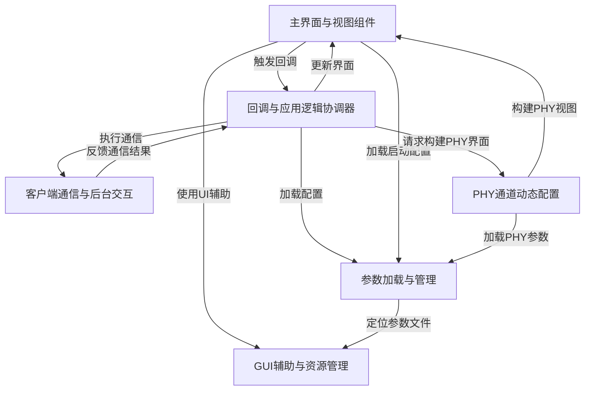

# Tutorial: sdk_gui

这是一个 **图形用户界面 (GUI)** 应用程序，旨在帮助用户配置和测试 *SERDES PHY硬件*。
它提供了一系列配置页面，例如 *前导码、MAC和PHY设置*，允许用户调整参数并通过与后端服务器交互来应用这些配置并查看结果。

**Source Repository:** [None](None)

## Chapters

1. [参数加载与管理
](01_参数加载与管理_.md)
2. [主界面与视图组件
](02_主界面与视图组件_.md)
3. [回调与应用逻辑协调器
](03_回调与应用逻辑协调器_.md)
4. [客户端通信与后台交互
](04_客户端通信与后台交互_.md)
5. [PHY通道动态配置
](05_phy通道动态配置_.md)
6. [GUI辅助与资源管理
](06_gui辅助与资源管理_.md)

---

Generated by [AI Codebase Knowledge Builder](https://github.com/The-Pocket/Tutorial-Codebase-Knowledge)