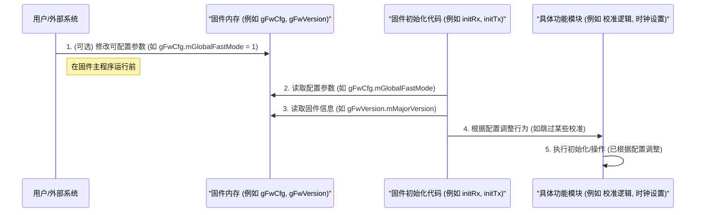

# Chapter 1: 固件配置管理


欢迎来到 `source` 项目固件的入门教程！在本教程中，我们将一步步探索固件是如何工作的。这是我们的第一站：固件配置管理。

## 1.1 为什么需要固件配置管理？

想象一下你正在使用一台新的智能设备，比如一个智能音箱或者一台路由器。你可能会注意到，这些设备在启动时有时会很快，有时会进行一些“自检”或“校准”过程。或者，你可能知道某些设备可以根据网络状况调整其性能。这些行为是如何控制的呢？

答案就在于**固件配置管理**。

就像汽车有不同的驾驶模式（例如经济模式、运动模式、雪地模式）一样，固件也需要一种方式来调整其行为以适应不同的需求或条件。例如：

*   **快速启动需求**：在某些情况下，我们希望设备尽可能快地启动并开始工作，即使这意味着跳过一些不那么关键的校准步骤。
*   **不同工作速率**：设备可能需要在不同的通信速率下工作（比如网速快慢），每种速率可能需要不同的内部参数设置才能达到最佳性能。

固件配置管理就是负责处理这些设置和选项的模块。它允许用户或系统在固件初始化时（也就是刚启动的时候）设定一些参数，从而“定制”固件的行为。

在本章中，我们将了解固件配置是如何定义的，以及它们如何影响固件的初始化和运行。

## 1.2 核心概念

让我们先来认识几个与固件配置管理相关的核心概念。

### 1.2.1 固件配置参数 (`gFwCfg`)

这是最核心的一个概念。在我们的 `source` 项目中，有一组专门的配置参数，它们被统称为“固件配置”（Firmware Configuration）。这些参数通常定义在一个全局的数据结构中，方便固件的各个部分读取和使用。

你可以把这些参数想象成一个控制面板，上面有很多开关和旋钮，每个都控制着固件的某一部分行为。

### 1.2.2 “快速模式” (Fast Mode)

“快速模式”是一类非常重要的配置。当启用某个快速模式时，固件可能会：

*   跳过某些耗时的校准步骤。
*   减少某些操作的等待时间。
*   使用预设的“快捷”参数。

这样做的目的是为了加快固件的启动速度或某些操作的执行速度。当然，这可能意味着牺牲一些精度或鲁棒性，就像汽车的运动模式加速快但可能更耗油一样。

### 1.2.3 速率相关参数 (Rate-Related Parameters)

固件，特别是与通信相关的固件（比如我们这里的PHY固件，用于物理层通信），通常需要处理不同的数据传输速率。例如，一个网络设备可能支持10 Mbps、100 Mbps、1 Gbps等多种速率。

对于每种速率，固件内部的一些关键参数（如滤波器系数、时钟设置等）可能需要有所不同，以确保最佳的通信质量。固件配置管理也涉及到如何根据当前的工作速率加载和应用这些特定的参数集。

### 1.2.4 固件版本与硬件信息

除了可调整的行为配置外，固件通常还会包含一些固定的信息，例如固件自身的版本号、编译日期、以及它所适配的硬件版本。这些信息虽然在运行时通常不能被用户修改，但它们是固件“身份”和“状态”的重要组成部分，可以看作是一种静态配置。系统可以通过读取这些信息来了解当前运行的固件详情。

## 1.3 如何使用固件配置？

固件的配置通常在系统初始化阶段设定。对于 `gFwCfg` 这样的可配置参数，一种常见的做法是：

1.  系统上电，引导加载程序 (bootloader) 将固件加载到内存中。
2.  在固件的主控制程序开始运行之前（例如，在 `cpu_run_req` 信号有效之前），更高层级的软件或硬件接口可以访问固件内存中的特定区域，修改这些配置参数。
3.  固件开始初始化时，它会读取这些配置参数，并根据这些参数的值来调整其后续的初始化流程和行为。

让我们看一个例子。在 `phy_common.c` 文件中，定义了一个名为 `gFwCfg` 的全局结构体，它包含了许多快速模式的开关：

```c
// 来自 phy_common.c
#pragma data("fw_cfg", LIT)
// 用户可以在 bootload 之后、cpu_run_req 之前通过 APB 接口访问 ICCM 中的这些变量，
// 以应用所需的快速配置。
__attribute__((used)) const volatile tFwCfg_t gFwCfg =
{
    0,    // uint32_t mGlobalFastMode            全局快速模式
    0,    // uint32_t mCmPllClkFastMode          共模PLL时钟快速模式
    0,    // uint32_t mRxPwrUpSkipWaitFastMode   接收器上电跳过等待快速模式
    0,    // uint32_t mTxPwrUpSkipWaitFastMode   发送器上电跳过等待快速模式
    0,    // uint32_t mRxAdaptSkipFastMode       接收器自适应跳过快速模式
    // ... 还有更多配置项 ...
    0,    // uint32_t mRxAdcVrefCalFastMode      接收器ADC参考电压校准快速模式
    // WORD BOUNDARY
    0,    // uint32_t mRxAdcClkDeskewFastMode    接收器ADC时钟去歪斜快速模式
    // ... 等等 ...
};
#pragma data() // 结束 #pragma data("fw_cfg", LIT)
```

在这段代码中：
*   `gFwCfg` 是一个 `tFwCfg_t` 类型的结构体变量。
*   它包含了许多成员，例如 `mGlobalFastMode`（全局快速模式）、`mRxPwrUpSkipWaitFastMode`（接收器上电跳过等待快速模式）等。
*   这些成员的初始值都被设为 `0`，表示默认情况下不启用这些快速模式。
*   注释中提到，用户可以在固件运行前修改这些值。例如，如果想启用全局快速模式，可以将 `gFwCfg.mGlobalFastMode` 设置为 `1`。

固件的初始化代码随后会检查这些标志。例如，在接收器 (RX) 的初始化过程中，可能会有如下逻辑（简化自 `pmd_rx.c` 中的 `configInitRxFastMode` 函数）：

```c
// 来自 pmd_rx.c (简化示例)
#include "phy_common.h" // 为了访问 gFwCfg

// 假设 eFastMode_PmdSkip 是一个定义为 1 的常量
#define eFastMode_PmdSkip 1 

static void configInitRxFastMode()
{
    // 配置上电跳过等待设置
    if (gFwCfg.mGlobalFastMode == eFastMode_PmdSkip || 
        gFwCfg.mRxPwrUpSkipWaitFastMode == eFastMode_PmdSkip)
    {
        // 如果全局快速模式或RX上电快速模式被启用
        // 则调用函数来配置跳过某些等待步骤
        // pmdLaneRxControl_configRxSkipWaits(); // 实际调用的函数
        // printf("接收器：快速上电模式已启用，跳过某些等待。\n"); // 示意
    }

    // 配置自适应跳过设置
    if (gFwCfg.mGlobalFastMode == eFastMode_PmdSkip || 
        gFwCfg.mRxAdaptSkipFastMode == eFastMode_PmdSkip)
    {
        // 如果全局快速模式或RX自适应快速模式被启用
        // 则配置跳过自适应过程中的某些步骤
        // rxAdaptCtrlDerived_configRxAdaptationSkip(); // 实际调用的函数
        // printf("接收器：快速自适应模式已启用，跳过某些自适应步骤。\n"); // 示意
    }
}
```
这个 `configInitRxFastMode` 函数会在接收器初始化时（例如在 `initRx` 函数中）被调用。它会检查 `gFwCfg` 中的相关标志位，如果某个快速模式被启用了，就会执行相应的配置，比如调用一个函数来跳过某些校准或等待。

## 1.4 固件信息：版本号与硬件兼容性

除了可以由用户调整的配置外，固件本身也携带了一些重要的“身份”信息。这些信息通常在编译固件时就固定下来了，并在固件初始化时加载到特定的内存地址，供系统查询。

在 `fw_build_info.c` 文件中，我们可以看到这类信息的定义：

```c
// 来自 fw_build_info.c

// ... 其他宏定义和包含 ...

// 存储固件版本信息在程序内存的末尾
volatile struct tFwVersion_t gFwVersion __attribute__((used)) =
{
    .mMajorVersion = 3,     // 主版本号
    .mMinorVersion = 0,     // 次版本号
    .mSubVersion = 04,      // 子版本号
    .mPatchVersion = 00,    // 补丁版本号
    .mDay = 23 ,           // 日
    .mMonth = 12,           // 月
    .mYear = 2024,          // 年
};

// 硬件版本信息示例 (根据 PLATFORM 宏选择)
#if PLATFORM == x812_rel2p1
volatile struct tHwVersion_t gHwVersion __attribute__((used)) =
{
    .mPmdMajorVersion = 2,
    .mPmdMinorVersion = 1,
    .mPmaMajorVersion = 2,
    .mPmaMinorVersion = 1,
};
// ... 其他平台的硬件版本 ...
#endif // PLATFORM
```
这里：
*   `gFwVersion` 存储了固件的详细版本号和构建日期。
*   `gHwVersion` 存储了固件兼容的硬件版本信息。`PLATFORM` 是一个编译时定义的宏，用于选择适配特定硬件平台的版本号。

这些信息对于调试、兼容性检查和设备管理非常重要。例如，系统可以读取 `gFwVersion` 来确认当前运行的是哪个版本的固件，或者读取 `gHwVersion` 来确保固件与硬件匹配。

## 1.5 内部实现：配置是如何存储和访问的

你可能会好奇，这些配置参数和固件信息在底层是如何工作的。

### 1.5.1 内存中的配置数据

简单来说，像 `gFwCfg`、`gFwVersion` 这样的配置数据，本质上是存储在微控制器内存特定区域的变量。

*   `volatile`: 这个关键字告诉编译器，这个变量的值可能会在程序代码的控制之外被改变（比如被硬件直接修改，或者像 `gFwCfg` 那样被外部系统在固件运行前修改）。因此，编译器不应该对这个变量的访问做过多优化（比如缓存到寄存器中）。
*   `const` (对于 `gFwCfg`): 这表示固件代码自身不应该修改 `gFwCfg` 的值。它的值是在固件开始执行前由外部设定的，固件只读取它。
*   `__attribute__((used))`: 这个是编译器特定的属性（通常用于 GCC 或兼容的编译器），它告诉编译器即使这个变量看起来在代码中没有被直接引用，也不要把它优化掉。这对于那些通过特定地址被外部访问的变量很重要。
*   `#pragma data(...)`: 这是编译器指令，用于将特定的变量放置到内存的特定段 (section) 中。例如，`#pragma data("fw_cfg", LIT)` 可能意味着将 `gFwCfg` 放入一个名为 "fw_cfg" 的只读数据段（Literal data section）。这样做有助于内存组织和管理，也方便外部系统知道去哪里找这些配置。

### 1.5.2 配置读取流程

下图展示了一个简化的固件配置读取和应用流程：



这个流程大致如下：
1.  **设置配置 (可选)**: 在固件的核心逻辑开始执行之前，用户或外部系统（比如主处理器或者调试工具）有机会修改 `gFwCfg` 中的值。对于 `gFwVersion` 这样的静态信息，它们是在编译时就固化在固件镜像里的。
2.  **读取配置**: 当固件开始初始化时（比如 `initRx()` 或 `initTx()` 函数被调用），它会从内存中读取 `gFwCfg` 的值。
3.  **读取固件信息**: 同样，固件也可能读取 `gFwVersion` 等信息，用于日志记录或其他目的。
4.  **应用配置**: 固件的各个模块会根据读取到的配置值来决定自己的行为。例如，如果 "跳过RX校准" 的快速模式被启用，那么RX初始化模块就会跳过相关的校准函数调用。
5.  **执行操作**: 最终，固件的各个功能模块会按照配置好的方式运行。

例如，在 `pmd_rx.c` 的 `initRx()` 函数中，你会看到类似这样的调用：
```c
// 来自 pmd_rx.c
void initRx()
{
    // ... 其他初始化步骤 ...

    // 设置引脚覆盖
    setRxPinOvrd();

    // 电源启动/关闭序列配置
    configRxPowerUpCmdsSequence();
    configRxPowerDownCmdsSequence();

    // ... 其他默认设置 ...

    // 初始化快速模式设置
    configInitRxFastMode(); // <--- 在这里读取和应用 gFwCfg 中的快速模式

    // ... 更多初始化步骤 ...
}
```
而 `configInitRxFastMode()` 内部则会去检查 `gFwCfg` 的值，正如我们之前看到的。

对于速率相关的参数，情况类似。固件在确定了当前的通信速率后，会从预定义的表格或者通过计算得到该速率下合适的参数，然后将这些参数写入到硬件寄存器中。这些预定义的表格也可以看作是固件配置的一部分。

## 1.6 总结

在本章中，我们初步了解了**固件配置管理**的重要性。我们学习到：

*   固件配置允许我们像调整汽车驾驶模式一样，调整固件的行为以适应不同需求，例如实现“快速模式”或针对不同通信速率加载特定参数。
*   核心配置参数（如 `gFwCfg`）通常是全局可见的结构体，可以在固件启动初期被外部系统设定。
*   固件内部的初始化函数（如 `initRx` 中的 `configInitRxFastMode`）会读取这些配置，并据此调整其操作流程。
*   固件还包含一些静态信息，如版本号 (`gFwVersion`) 和硬件兼容性信息 (`gHwVersion`)，它们是固件身份的一部分。
*   通过编译器指令如 `#pragma data` 和属性如 `volatile`、`__attribute__((used))`，这些配置数据被妥善地存储在内存中并能被正确访问。

理解了固件是如何配置其基本行为之后，我们就可以进一步探索固件是如何在其主控制循环中响应外部请求并执行更复杂任务的了。

在下一章中，我们将学习 [主控制循环与请求处理](02_主控制循环与请求处理_.md)，看看固件是如何动起来的！

---

Generated by [AI Codebase Knowledge Builder](https://github.com/The-Pocket/Tutorial-Codebase-Knowledge)