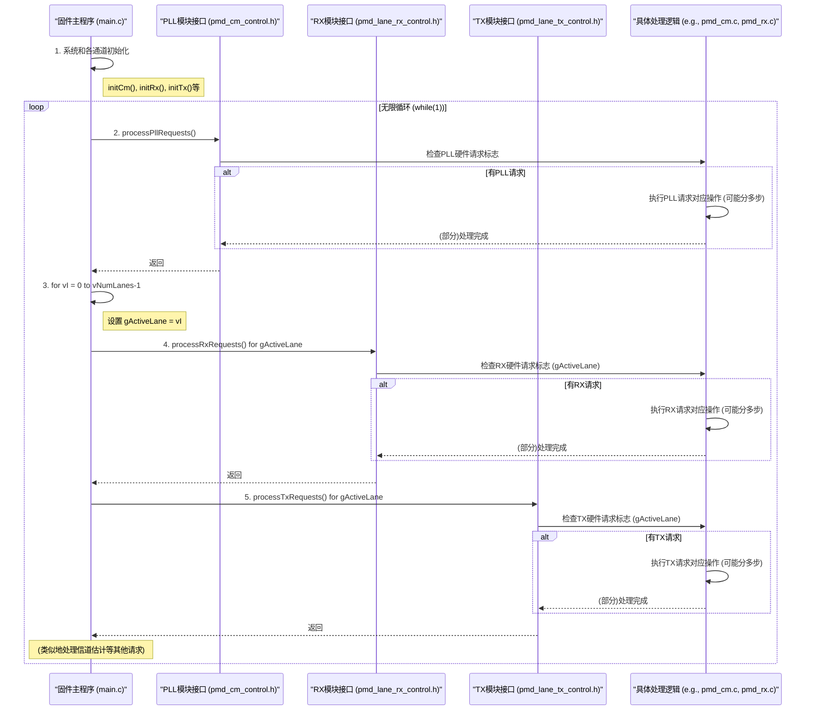

# Chapter 2: 主控制循环与请求处理


在上一章 [固件配置管理](01_固件配置管理_.md) 中，我们了解了如何通过配置参数来定制固件的行为，例如启用“快速模式”或设置与特定通信速率相关的参数。现在，我们已经配置好了固件，那么固件是如何“活”起来并持续工作的呢？

这就是本章要探讨的核心：**主控制循环与请求处理**。

## 2.1 固件的“心脏”：为什么需要主控制循环？

想象一下一个繁忙的餐厅厨房。厨师长（主控制循环）需要时刻关注来自服务员的各种点菜请求（来自不同模块的请求），比如有的客人点了开胃菜（PLL配置），有的点了主菜（RX数据接收），有的点了甜点（TX数据发送）。厨师长不能只处理一个请求就下班，他需要不断地检查新的订单，并指挥不同的厨师（请求处理函数）去完成各自的任务，确保整个厨房高效运转。

固件程序也面临类似的情况。它不是一次性执行完就结束的程序，而是需要长时间持续运行，并随时响应来自内部不同硬件模块或外部系统的指令。例如：

*   **PLL（锁相环）模块**：可能需要调整时钟频率。
*   **RX（接收器）模块**：可能需要根据信号变化进行自适应调整，或者处理速率变更的请求。
*   **TX（发送器）模块**：可能需要配置发送功率，或者响应发送数据的请求。

**主控制循环 (Main Control Loop)** 就是固件程序的核心驱动力。它通常位于 `main()` 函数中，在一个无限循环里不断地查询各个模块是否有待处理的请求，然后调用相应的函数来处理这些请求。这个循环确保了固件能够持续响应和管理各种事件和任务。

## 2.2 核心概念解析

让我们来认识一下构成主控制循环和请求处理机制的几个关键部分。

### 2.2.1 `main()` 函数：固件的起点

和大多数C语言程序一样，固件的执行始于 `main()` 函数。这个函数是整个固件程序的入口点和“大脑”。

### 2.2.2 初始化阶段 (Initialization Phase)

在进入主控制循环之前，固件需要进行一系列的初始化操作。这就像厨师长在开门营业前，需要确保厨房设备正常、食材准备就绪一样。初始化阶段通常包括：

*   设置系统时钟 (RTC)。
*   初始化日志系统，方便后续记录事件和调试（参考 [事件日志记录](08_事件日志记录_.md)）。
*   初始化通用模块（Common Modules, CM），比如PLL。
*   针对每个通信通道（Lane），初始化接收器（RX）和发送器（TX）模块。
*   读取在 [固件配置管理](01_固件配置管理_.md) 中设定的配置参数，并据此调整初始化行为。

### 2.2.3 无限循环 (`while(1)`)：持续运行的动力

初始化完成后，固件会进入一个无限循环，通常是 `while(1)` 语句。这个循环是固件持续工作的保证，使其能够不断地检查和处理新的请求，永不停歇，除非系统断电或被明确指示停止。

### 2.2.4 请求 (Requests) 与请求标志

“请求”是其他模块或外部系统向主控制循环发出的“工作指令”。这些请求通常通过特定的硬件寄存器中的标志位来表示。当某个模块需要固件处理某项任务时，它会设置相应的请求标志位。主控制循环会定期扫描这些标志位。

例如，PMD（Physical Medium Dependent，物理介质相关）层的硬件逻辑可能会设置一个标志位，请求固件执行接收器重新校准。

### 2.2.5 请求处理函数 (Request Processors)

针对不同类型的请求，固件中会有专门的函数来处理它们。这些函数被称为请求处理器。当主控制循环检测到一个请求时，它会调用相应的请求处理函数。

例如，在 `source` 项目中：
*   `processPllRequests()`: 处理与PLL相关的请求。
*   `processRxRequests()`: 处理来自接收器模块的请求。
*   `processTxRequests()`: 处理来自发送器模块的请求。
*   `processChannelEstRequest()`: 处理信道估计相关的请求（参考 [信道估计 (Channel Estimation)](05_信道估计__channel_estimation__.md)）。

这些处理函数自身可能也包含状态机，以便处理一些需要多个步骤才能完成的复杂请求。我们将在下一章 [PMD层请求与状态机](03_pmd层请求与状态机_.md) 中详细探讨。

### 2.2.6 通信通道 (`gActiveLane` 与多通道处理)

现代通信芯片通常包含多个并行的通信通道（Lanes），每个通道都可以独立收发数据。固件需要能够管理所有这些通道。

在 `source` 项目中，全局变量 `gActiveLane` 用于指示当前正在处理的是哪个通道。主控制循环通常会遍历所有活动的通道，并为每个通道调用相应的请求处理函数。

## 2.3 主控制循环如何工作？

让我们通过 `main.c` 文件中的 `main()` 函数来看看主控制循环是如何运作的。

### 2.3.1 `main()` 函数概览

固件的入口点是 `main()` 函数。它的基本结构如下：

```c
// 来自 main.c (简化结构)
#include "common.h"         // 通用定义
#include "pmd_cm.h"         // CM (PLL) 相关
#include "pmd_rx.h"         // RX 相关
#include "pmd_tx.h"         // TX 相关
#include "chn_est.h"        // 信道估计相关
#include "event_log.h"      // 事件日志相关
// ... 其他必要的头文件 ...

uint32_t gActiveLane = 0; // 当前活动的通道号

int main(void)
{
    uint8_t vI; // 用于循环的计数器
    uint8_t vNumLanes = pmdControl_getPmdNumLanes(); // 获取通道数量

    // 1. 通用初始化
    rtcInit();          // 初始化实时时钟 (参考 [定时与延时工具](07_定时与延时工具_.md))
    logInfo(CpuReset);  // 记录CPU复位事件

    // 记录固件版本信息 (参考 [固件配置管理](01_固件配置管理_.md))
    logInfoData(FwYear,(char*)&gFwVersion.mYear,sizeof(gFwVersion.mYear));
    logInfoData(FwVesion,(char*)&gFwVersion.mPatchVersion,sizeof(gFwVersion.mPatchVersion));

    // 2. CM (通用模块, 通常是PLL) 初始化
    initCm();
    pmdCmControl_SetPmdCmFwInitDone(); // 通知硬件CM固件初始化完成

    // 3. 各通道 (Lane) 初始化
    for (vI = 0; vI < vNumLanes; vI++)
    {
        gActiveLane = vI; // 设置当前活动通道

        initRx(); // 初始化接收器
        initTx(); // 初始化发送器

        // 移除RX/TX复位覆盖，允许硬件开始工作
        pmdLaneTxControl_RemoveTxResetOvrd();
        pmdLaneRxControl_RemoveRxResetOvrd();
    }

    pmdControl_SignalFwStatus(eFwProgressStatus_FwPowerUpInitComplete); // 通知系统固件上电初始化完成
    logInfo(InitDone); // 记录初始化完成事件

    // 4. 主控制循环 (无限循环)
    while (1)
    {
        // 4.1 处理PLL请求 (不区分通道)
        processPllRequests();

        // 4.2 遍历每个通道，处理该通道的特定请求
        for (vI = 0; vI < vNumLanes; vI++)
        {
            gActiveLane = vI; // 设置当前活动通道

            // 处理软件自适应请求 (如果启用)
            if (swAdaptEnabled() && gEthRxAdaptSwControl[gActiveLane].mSwReq)
            {
                processSwAdaptRequests(); // 具体的自适应请求处理
            }

            // 处理RX请求
            processRxRequests();

            // 处理TX请求
            processTxRequests();

            // 处理信道估计请求
            processChannelEstRequest();

            // ... 可能还有其他特定于通道的处理逻辑 ...
            // 例如，处理首次数据使能触发 (简化)
            if((gRxFirstDataEnTriggered[gActiveLane] == false) && /* ... 条件 ... */ )
            {
                // ... 触发RX数据使能的逻辑 ...
            }
            if((gTxFirstDataEnTriggered[gActiveLane] == false) && /* ... 条件 ... */ )
            {
                // ... 触发TX数据使能的逻辑 ...
            }
        }
    }
    // 程序通常不会执行到这里，因为 while(1) 是无限循环
    // return 0; // 理论上的返回，但在嵌入式固件中main通常不返回
}
```

让我们分解一下这段代码：

1.  **通用初始化**：
    *   `rtcInit()`: 初始化实时时钟，用于定时功能。
    *   `logInfo()` / `logInfoData()`: 记录重要的启动信息，如CPU复位和固件版本。这依赖于 [事件日志记录](08_事件日志记录_.md) 模块。
    *   这里的固件版本 `gFwVersion` 是在 [固件配置管理](01_固件配置管理_.md) 中讨论过的。

2.  **CM 初始化**：
    *   `initCm()`: 初始化通用模块，主要是PLL（锁相环），它为PHY提供必要的时钟信号。
    *   `pmdCmControl_SetPmdCmFwInitDone()`: 设置一个硬件标志，通知PMD控制器，固件对CM的初始化已经完成，硬件可以开始后续操作。

3.  **各通道初始化**：
    *   固件通过一个 `for` 循环遍历所有可用的物理通道 (`vNumLanes`)。
    *   `gActiveLane = vI;`: 在处理每个通道之前，将全局变量 `gActiveLane` 设置为当前通道的索引。这样，后续的 `initRx()`、`initTx()` 以及请求处理函数就知道它们应该操作哪个通道的硬件寄存器和状态。
    *   `initRx()` 和 `initTx()`: 分别初始化当前通道的接收器和发送器子系统。这些函数内部会读取 `gFwCfg` 中的配置（如在 [固件配置管理](01_固件配置管理_.md) 中看到的 `configInitRxFastMode()`）。
    *   `pmdLaneTxControl_RemoveTxResetOvrd()` / `pmdLaneRxControl_RemoveRxResetOvrd()`: 固件在初始化时可能会通过覆盖（override）方式保持RX/TX处于复位状态，初始化完成后再解除复位，让硬件逻辑开始正常工作。

4.  **主控制循环 (`while(1)`)**：
    *   这是固件的核心，一旦进入就不会退出。
    *   `processPllRequests()`: 首先调用处理PLL请求的函数。PLL通常是所有通道共享的，所以这个调用在通道循环之外。
    *   内部的 `for` 循环再次遍历所有通道：
        *   `gActiveLane = vI;`: 同样，为每个通道设置 `gActiveLane`。
        *   `processSwAdaptRequests()`: 如果启用了以太网软件自适应并且有请求，则处理。
        *   `processRxRequests()`: 调用处理当前活动通道RX请求的函数。
        *   `processTxRequests()`: 调用处理当前活动通道TX请求的函数。
        *   `processChannelEstRequest()`: 调用处理当前活动通道信道估计请求的函数。
        *   还有一些特定逻辑，比如检查和处理 `gRxFirstDataEnTriggered` 和 `gTxFirstDataEnTriggered`，这些通常与首次数据传输的使能有关。

这个主循环就像一个勤奋的管家，不断地巡视房子的每个房间（PLL、各个Lane的RX/TX），看看是否有需要处理的事情。

## 2.4 请求是如何被发现和处理的？

主控制循环通过调用各个 `process...Requests()` 函数来分派任务。那么这些函数内部是如何工作的呢？让我们简单看一下其中一个函数的例子，以 `processPllRequests()` 为例（来自 `pmd_cm.c`）：

```c
// 来自 pmd_cm.c (简化)

// PLL命令状态枚举
typedef enum eCmdState
{
    eCmdSt_Idle,  // 空闲状态
    eCmdSt_Run,   // 运行状态
    eCmdSt_Done   // 完成状态
} eCmdState_t;

static eCmdState_t gPllXCmdState; // PLL命令处理的当前状态 (全局静态变量)

void processPllRequests()
{
    bool vFwCmdAck = false; // 固件命令应答标志
    tPmdCmPllXPwrCmdParams_t vPmdCmPllXPwrCmdParams; // 存储从硬件读取的命令参数

    // 从硬件寄存器读取PLL电源命令的参数 (例如，是否有命令使能、命令类型等)
    pmdCmControl_GetPmdCmPllXPwrCmdParams(&vPmdCmPllXPwrCmdParams);

    switch (gPllXCmdState) // 根据当前状态进行处理
    {
        case eCmdSt_Idle: // 如果当前是空闲状态
        {
            // 检查硬件是否有新的电源命令使能 (mFwPwrCmdEn 是从硬件读出的标志)
            if (false == vPmdCmPllXPwrCmdParams.mFwPwrCmdEn)
            {
                break; // 没有新命令，保持空闲
            }
            // 有新命令，转换到运行状态
            gPllXCmdState = eCmdSt_Run;
            // FALLTHROUGH (直接进入下一个case)
        }
        case eCmdSt_Run: // 如果当前是运行状态
        {
            if (vPmdCmPllXPwrCmdParams.mFwPwrCmdAbort) // 检查是否有中止命令
            {
                vFwCmdAck = true; // 如果是中止命令，直接确认完成
            }
            else
            {
                // 调用更底层的函数处理具体的电源状态命令
                // processCmPstateCmds 会根据命令类型执行具体操作，并返回是否完成
                vFwCmdAck = processCmPstateCmds(&vPmdCmPllXPwrCmdParams);
            }

            if (vFwCmdAck == true) // 如果命令处理完成
            {
                pmdCmControl_AckPmdCmPllXFwCmd(1); // 通过硬件寄存器向硬件发送“已处理”的应答信号
                gPllXCmdState = eCmdSt_Done;       // 转换到完成状态
            }
            break;
        }
        case eCmdSt_Done: // 如果当前是完成状态
        {
            // 等待硬件撤销命令使能信号 (mFwPwrCmdEn)
            if (false == vPmdCmPllXPwrCmdParams.mFwPwrCmdEn)
            {
                pmdCmControl_AckPmdCmPllXFwCmd(0); // 撤销固件的应答信号
                gPllXCmdState = eCmdSt_Idle;       // 返回空闲状态，准备接收下一个命令
            }
            break;
        }
    }
    return;
}
```
在这个简化的 `processPllRequests` 函数中：
1.  **读取请求**：`pmdCmControl_GetPmdCmPllXPwrCmdParams()` 函数会从特定的硬件寄存器中读取与PLL电源命令相关的信息，比如 `mFwPwrCmdEn` (固件电源命令使能) 标志。这就像服务员查看是否有新的点餐单。
2.  **状态机**：函数内部使用一个简单的状态机 (`gPllXCmdState`) 来管理命令处理的流程：
    *   `eCmdSt_Idle`：空闲状态，等待新的命令。如果 `mFwPwrCmdEn` 为真，表示有新命令，则进入 `eCmdSt_Run`。
    *   `eCmdSt_Run`：运行状态，调用 `processCmPstateCmds()` 来执行具体的命令操作。这个函数可能会需要一些时间来完成（比如配置PLL寄存器、等待稳定等）。当 `processCmPstateCmds()` 返回 `true`（表示完成）或收到中止请求时，就向硬件发送确认信号 `pmdCmControl_AckPmdCmPllXFwCmd(1)`，并进入 `eCmdSt_Done` 状态。
    *   `eCmdSt_Done`：完成状态，等待硬件方撤销 `mFwPwrCmdEn` 信号（表示硬件知道了命令已完成）。一旦硬件撤销，固件也撤销自己的确认信号 `pmdCmControl_AckPmdCmPllXFwCmd(0)`，然后返回 `eCmdSt_Idle`，准备处理下一个命令。
3.  **非阻塞行为**：重要的是，`processPllRequests` 以及类似的 `processRxRequests`、`processTxRequests` 函数通常被设计成**非阻塞 (non-blocking)** 的。这意味着如果一个请求需要较长时间才能完成（比如一个复杂的校准过程），这些函数不会一直卡在那里等待。它们会执行当前状态的一小部分工作，然后快速返回，让主循环可以继续处理其他模块的请求。在下一次被主循环调用时，它们会从上次离开的状态继续执行。这种机制是实现多任务协作的关键，我们将在 [PMD层请求与状态机](03_pmd层请求与状态机_.md) 中更深入地学习。

`processRxRequests()` (来自 `pmd_rx.c`) 和 `processTxRequests()` (来自 `pmd_tx.c`) 的结构与 `processPllRequests()` 类似。它们也会检查各自模块的请求标志，并使用内部状态机来处理请求和与硬件进行握手。例如，`processRxRequests()` 会检查 `vPmdLaneRxFwReqParams.mFwReq` (固件请求) 和 `vPmdLaneRxFwReqParams.mFwReqType` (请求类型) 来决定执行哪个操作。

`processChannelEstRequest()` (来自 `chn_est.c`) 同样如此，它会检查 `rxControl_ReadChnEstReq()` 返回的信道估计请求使能标志，并调用 `runChannelEstimationAlgo()` 执行实际的信道估计算法，该算法本身也是一个状态机。

## 2.5 内部工作流程：一个简化的视角

为了更直观地理解主控制循环和请求处理的协作，我们可以用一个序列图来表示：



这个图展示了：
1.  固件首先执行初始化。
2.  然后进入无限循环。
3.  在循环中，依次调用各个模块的请求处理入口函数（如 `processPllRequests`）。
4.  这些入口函数会通过对应的控制接口（如 `pmdCmControl_GetPmdCmPllXPwrCmdParams`）读取硬件是否有请求。
5.  如果检测到请求，则会调用更深层次的逻辑（“具体处理逻辑”）来执行实际操作。这些操作往往通过状态机实现，可以分多次调用完成。
6.  对于区分通道的操作，会先设置 `gActiveLane`，然后调用针对该通道的请求处理函数。

这种轮询（Polling）和基于状态机的处理方式，使得固件可以在单线程环境下高效地处理来自多个源的并发请求，而不会因为等待某个耗时操作而阻塞其他任务。

## 2.6 总结

在本章中，我们探索了固件的“心脏”——**主控制循环与请求处理**机制。我们学到了：

*   固件通过 `main()` 函数中的一个**无限循环 (`while(1)`)** 来实现持续运行。
*   在进入主循环之前，固件会执行一系列**初始化**操作，包括通用模块（如PLL）和各个通信通道（Lane）的RX/TX模块。
*   主循环会**轮询**检查来自不同模块（PLL, RX, TX, 信道估计等）的**请求标志**。
*   当检测到请求时，主循环会调用相应的**请求处理函数**（如 `processPllRequests()`, `processRxRequests()`）。
*   这些请求处理函数通常采用**非阻塞**的方式工作，内部可能包含状态机，以便高效处理需要多个步骤的复杂任务。
*   全局变量 `gActiveLane` 用于在多通道系统中指定当前操作的通道。

理解了主控制循环这个“指挥中心”是如何工作的，我们就能更好地理解固件是如何协调各个子系统来完成复杂任务的。

在下一章中，我们将深入了解这些请求处理函数内部是如何通过状态机来管理复杂操作的：[PMD层请求与状态机](03_pmd层请求与状态机_.md)。

---

Generated by [AI Codebase Knowledge Builder](https://github.com/The-Pocket/Tutorial-Codebase-Knowledge)