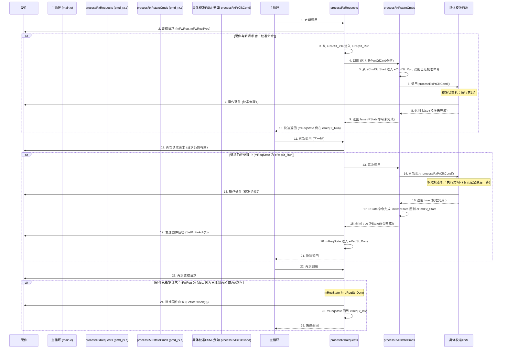

# Chapter 3: PMD层请求与状态机


在上一章 [主控制循环与请求处理](02_主控制循环与请求处理_.md) 中，我们学习了固件是如何通过主控制循环来轮询并调用诸如 `processPllRequests()`、`processRxRequests()` 和 `processTxRequests()` 等函数来处理来自不同模块的请求的。这些函数是固件响应硬件事件和执行命令的入口。但是，如果一个请求的任务非常复杂，比如要给一个硬件模块完整上电，或者重新配置通信速率，这往往涉及到一系列精确的步骤，可能还需要等待硬件反馈。这些复杂任务是如何在不阻塞整个系统的前提下被有序执行的呢？

答案就在于 **PMD层请求与状态机**。

## 3.1 为什么需要PMD层状态机？“一步一步来”的智慧

PMD（Physical Medium Dependent，物理介质相关）层是固件中直接与物理硬件打交道的部分。想象一下，我们要启动一个精密设备的某个部件，比如PHY的接收器（RX）或发送器（TX）。这通常不是按一个按钮就能瞬间完成的事情，它更像是一个多步骤的SOP（标准操作流程）：

1.  **步骤A**：给某个电路模块上电。
2.  **步骤B**：等待模块A稳定。
3.  **步骤C**：配置模块A的几个关键寄存器。
4.  **步骤D**：给另一个电路模块B上电。
5.  **步骤E**：配置模块B...
6.  ...等等，直到整个部件启动完成。

如果我们在一个简单的函数里按顺序执行这些步骤，并且其中“等待模块A稳定”需要较长时间，那么整个固件就会卡在这里，无法响应其他任何请求，比如来自另一个通道的紧急信号处理。这显然是不可接受的。

**状态机（State Machine）** 提供了一种优雅的解决方案。它将一个复杂的操作分解成一系列明确的“状态”（States）。每个状态代表操作流程中的一个特定阶段。固件在每个状态只执行一小部分工作，然后可以快速返回，让主控制循环继续处理其他事务。当下一次轮到处理这个请求时，状态机会从它上次离开的状态继续执行，直到整个操作完成。

这就像一个工厂里的自动化生产线：
*   **请求 (Request)**：好比是要生产一个完整的产品（例如，完成RX上电）。
*   **状态机 (State Machine)**：就是这条生产线本身。
*   **状态 (State)**：是生产线上的每一个工位。
*   **操作 (Action in a state)**：是每个工位执行的具体任务（例如，安装一个零件、拧紧一个螺丝）。
*   **转换 (Transition)**：是从一个工位移动到下一个工位的条件（例如，当前工位任务完成）。

通过这种方式，PMD层可以有序地管理复杂的硬件操作序列，例如上电、配置速率或执行校准，同时保持整个系统的响应性。

## 3.2 核心概念解析

让我们来熟悉一下PMD层请求和状态机的几个核心概念：

### 3.2.1 PMD层 (PMD Layer)

正如其名，PMD层负责处理与物理硬件直接相关的具体任务。我们之前看到的 `pmd_rx.c`（处理RX）、`pmd_tx.c`（处理TX）和 `pmd_cm.c`（处理通用模块，如PLL）中的代码就属于PMD层。

### 3.2.2 PMD请求 (PMD Requests)

这些是来自硬件逻辑或固件其他高层部分，要求PMD层执行特定操作的“指令”。在 [主控制循环与请求处理](02_主控制循环与请求处理_.md) 中，我们看到 `processRxRequests()` 会检查硬件寄存器中的 `mFwReq`（固件请求）和 `mFwReqType`（请求类型）标志。这些就是PMD请求的例子。

例如，硬件可能会设置一个请求，类型为 `eRxFwReqType_PwrCtlCmd`（电源控制命令），具体命令可能是配置速率 (`eRxFwCmd_RateConfig`)。

### 3.2.3 状态机 (State Machine)

状态机是一种行为模型，它由一组有限的状态、状态之间的转换以及在每个状态下执行的动作组成。在我们的固件中，状态机用于将复杂的PMD操作分解为可管理的小步骤。

### 3.2.4 状态 (States)

状态代表了操作过程中的一个特定阶段或进展点。例如，一个PLL上电序列的状态机可能包含以下状态：
*   `eCmdSt_Idle`：空闲，等待命令。
*   `eCmdSt_Run`：正在执行命令（可能内部还有子状态）。
*   `eCmdSt_Done`：命令执行完毕，等待硬件确认。

在C代码中，状态通常用枚举类型（`enum`）来定义，并用一个变量来存储当前状态。

```c
// 来自 pmd_cm.c (PLL请求处理状态)
typedef enum eCmdState
{
    eCmdSt_Idle,  // 空闲状态
    eCmdSt_Run,   // 运行状态
    eCmdSt_Done   // 完成状态
} eCmdState_t;

static eCmdState_t gPllXCmdState; // 用于存储PLL命令处理的当前状态
```
这个 `gPllXCmdState` 变量就跟踪着PLL命令处理的当前进度。

### 3.2.5 转换 (Transitions) 与动作 (Actions)

**转换**是指从一个状态迁移到另一个状态。转换通常由某个事件触发，例如：
*   当前状态的任务已完成。
*   检测到某个硬件信号的变化。
*   定时器超时。

**动作**是在进入某个状态、处于某个状态或退出某个状态时执行的操作。例如，在进入“配置寄存器”状态时，动作就是向硬件寄存器写入特定的值。

### 3.2.6 非阻塞执行 (Non-Blocking Execution)

这是PMD层状态机设计的关键原则。每个状态执行的操作都应该是短暂的。如果一个操作需要等待（例如，等待硬件稳定），状态机不会停在那里空等，而是会记录下当前状态，然后函数返回。主控制循环可以继续处理其他任务。在下一次调用到这个状态机时，它会检查等待条件是否满足。如果满足，就转换到下一个状态；如果不满足，就再次快速返回。

这种机制确保了即使PMD层在处理一个耗时的操作（如持续几百微秒的校准），固件的整体响应性也不会受到太大影响。

## 3.3 PMD层请求与状态机如何协同工作？

在上一章中，我们看到了 `main()` 函数会调用像 `processRxRequests()` 这样的函数。这些函数是处理PMD请求的第一道关卡。它们内部通常包含一个顶层状态机来管理与硬件的请求/应答握手，并且当请求需要复杂的多步操作时，它们会调用更具体的、包含内部状态机的处理函数。

让我们以 `pmd_rx.c` 中的 `processRxRequests()` 和它调用的 `processRxPstateCmds()` 为例，看看它们是如何工作的。

**场景：** 硬件向RX PMD层发起一个“电源控制命令”（`eRxFwReqType_PwrCtlCmd`），具体命令是“配置速率”（`eRxFwCmd_RateConfig`）。

1.  **主控制循环调用 `processRxRequests()`**：
    ```c
    // 来自 pmd_rx.c (processRxRequests 简化顶层状态机)
    // vpPmdRx 指向 gPmdRx[gActiveLane]，存储当前通道RX PMD的状态信息
    // vPmdLaneRxFwReqParams 存储从硬件读到的请求参数

    switch (vpPmdRx->mReqState) // mReqState 是顶层请求处理状态 (eReqSt_Idle, eReqSt_Run, eReqSt_Done)
    {
        case eReqSt_Idle: // 当前空闲
            if (vPmdLaneRxFwReqParams.mFwReq == false) // 检查硬件是否有请求 (mFwReq)
            {
                break; // 没有请求，直接返回
            }
            vpPmdRx->mReqState = eReqSt_Run; // 有请求，转换到运行状态
            // FALLTHROUGH (直接进入下一个case)

        case eReqSt_Run: // 正在处理请求
            // 检查请求类型 (mFwReqType)
            if (vPmdLaneRxFwReqParams.mFwReqType == eRxFwReqType_PwrCtlCmd)
            {
                // 调用处理PState命令的状态机
                vFwAck = processRxPstateCmds(); // vFwAck 会在PState命令完成后为true
            }
            // else if (其他请求类型，如 eRxFwCmd_Cca - CCA连续校准请求) { ... }
            // else if (其他请求类型，如 eRxFwReqType_StrupAdpt - 启动自适应请求) { ... }

            if (vFwAck == true) // 如果内部的状态机报告任务完成
            {
                pmdLaneRxControl_SetRxFwAck(1);    // 向硬件发送“已处理”的应答信号
                vpPmdRx->mReqState = eReqSt_Done;  // 转换到完成状态
            }
            break;

        case eReqSt_Done: // 请求处理完成，等待硬件撤销请求
            // 硬件通常会在看到 mFwAck=1 后，将 mFwReq 置为 false
            // 在下一次 processRxRequests 被调用时，如果 mFwReq 已经是 false (代码中省略了这个判断逻辑，直接执行)
            // (实际代码中，这个状态等待 mFwReq 变为 false，或者直接清除ACK并返回IDLE)
            pmdLaneRxControl_SetRxFwAck(0);    // 撤销固件的应答信号
            vpPmdRx->mReqState = eReqSt_Idle;  // 返回空闲状态，准备接收下一个请求
            break;
    }
    ```
    这段代码展示了 `processRxRequests` 如何使用 `mReqState` 这个状态变量来管理与硬件的“请求-运行-应答-完成”的交互流程。当它在 `eReqSt_Run` 状态检测到 `eRxFwReqType_PwrCtlCmd` 类型的请求时，它会调用 `processRxPstateCmds()`。

2.  **`processRxPstateCmds()` 执行具体的PState命令**：
    `processRxPstateCmds()` 函数本身也是一个状态机，它负责解析和执行具体的电源状态（PState）命令。

    ```c
    // 来自 pmd_rx.c (processRxPstateCmds 简化状态机)
    // vpPstateCmdFsm 指向 gPmdRx[gActiveLane].mPstateCmdFsm，存储PState命令处理的状态
    static bool processRxPstateCmds()
    {
        bool vFwPwrCmdDone = false; // 当前PState命令是否完成

        switch (vpPstateCmdFsm->mCmdState) // mCmdState 是PState命令处理状态 (eCmdSt_Start, eCmdSt_Run)
        {
            case eCmdSt_Start: // 开始处理一个新的PState命令
                // 从硬件读取具体的命令类型 (mCurrentCmd) 和参数
                pmdLaneRxControl_GetRxFwPwrCmdParams(vpPstateCmdFsm);
                vpPstateCmdFsm->mCmdState = eCmdSt_Run; // 转换到运行状态
                // FALLTHROUGH

            case eCmdSt_Run: // 正在执行PState命令
                // 根据具体的命令类型 (vpPstateCmdFsm->mCurrentCmd) 执行操作
                if (vpPstateCmdFsm->mCurrentCmd == eRxFwCmd_RateConfig)
                {
                    configRxRateCfgs(); // 调用函数配置与速率相关的设置
                    vFwPwrCmdDone = true;   // 速率配置操作比较简单，一次完成
                }
                else if (vpPstateCmdFsm->mCurrentCmd == eRxFwCmd_PrClkCondDcCalCoarse)
                {
                    // 这个是PR时钟调理粗校准命令，它本身也是一个状态机
                    // 它可能不会一次完成
                    vFwPwrCmdDone = processRxPrClkCond(eCalMode_Coarse);
                }
                // ... 其他 eRxFwCmd_xxxx 命令的处理 ...
                else
                {
                    // 处理硬件特定的PState命令
                    vFwPwrCmdDone = processHwSpecificRxPstateCmds(vpPstateCmdFsm);
                }

                if (vFwPwrCmdDone == true) // 如果当前PState命令已完成
                {
                    vpPstateCmdFsm->mCmdState = eCmdSt_Start; // 返回开始状态，准备处理下一个PState命令
                }
                break;
        }
        return vFwPwrCmdDone; // 返回当前PState命令是否已完成
    }
    ```
    在这个例子中：
    *   `mCmdState` (`eCmdSt_Start`, `eCmdSt_Run`) 管理单个PState命令的执行流程。
    *   当 `mCurrentCmd` 是 `eRxFwCmd_RateConfig` 时，它调用 `configRxRateCfgs()`。这个函数会直接应用速率相关的配置，可以认为它在一次调用中就完成了。所以 `vFwPwrCmdDone` 被设为 `true`。
    *   但是，如果命令是 `eRxFwCmd_PrClkCondDcCalCoarse`（一种时钟校准），它会调用 `processRxPrClkCond()`。这个函数本身又是一个更复杂的、包含多个步骤的状态机（我们将在 [时钟调理校准 (Clk Cond Cal)](04_时钟调理校准__clk_cond_cal__.md) 中详细学习这类校准）。`processRxPrClkCond()` 只有在它内部的所有校准步骤都完成后才会返回 `true`。在此之前，它每次被调用时只执行一小步，并返回 `false`。

    这种嵌套的状态机结构（`processRxRequests` 调用 `processRxPstateCmds`，后者又可能调用如 `processRxPrClkCond` 的具体操作状态机）使得固件能够模块化地处理非常复杂的操作序列。

**关键点：非阻塞行为**
在整个流程中，如果一个操作（比如 `processRxPrClkCond()` 中的某一步）尚未完成，它会返回 `false`。这使得 `processRxPstateCmds()` 也返回 `false`，进而 `processRxRequests()` 中的 `vFwAck` 为 `false`，于是 `mReqState` 保持在 `eReqSt_Run`。`processRxRequests()` 函数会很快返回，主控制循环可以继续轮询其他模块。当下一次 `processRxRequests()` 被调用时，内部的状态机会从上次中断的地方继续执行。

## 3.4 内部实现：PMD状态机如何运转

让我们通过一个简化的序列图来看看一个需要多步完成的PMD请求（例如一个校准命令）是如何通过状态机被处理的：



这个序列图清晰地展示了：
*   **轮询和非阻塞**：主循环不断调用 `processRxRequests`。如果一个操作没有完成，函数会快速返回，不会阻塞。
*   **状态保持**：每个状态机（`processRxRequests` 的 `mReqState`，`processRxPstateCmds` 的 `mCmdState`，以及 `processRxPrClkCond` 内部的状态）都会记住当前的进度。
*   **分层处理**：顶层的 `processRxRequests` 负责与硬件的通用请求/应答握手，而底层的状态机负责具体命令的执行逻辑。
*   **硬件交互**：状态机在适当的时候读取硬件状态或写入硬件寄存器，并根据硬件的反馈（隐式或显式）来推进状态。

### 状态变量的存储

你可能注意到代码中使用了像 `vpPmdRx->mReqState` 或 `vpPstateCmdFsm->mCmdState` 这样的变量。
*   `vpPmdRx` 通常是指向一个全局数组 `gPmdRx[NUM_LANES]` 中对应当前活动通道 `gActiveLane` 的元素。例如 `gPmdRx[gActiveLane].mReqState`。
*   `gPmdRx` 是一个 `tPmdRx_t` 类型的结构体数组，每个通道一个。这个结构体 (`struct tPmdRx_t`) 内部就包含了该通道RX PMD层所有相关的状态变量，比如：
    *   `mReqState`：用于 `processRxRequests` 的顶层状态。
    *   `mPstateCmdFsm`：一个子结构体，包含 `processRxPstateCmds` 所需的状态，如 `mCmdState` 和 `mCurrentCmd`。
    *   `mAdaptReqFsm`：用于自适应请求的状态机。
    *   还有其他用于特定操作（如CCA、启动自适应等）的状态机变量。

`pmd_tx.c` 中的 `gPmdTx[NUM_LANES]` 和 `pmd_cm.c` 中的 `gPllXCmdState`（虽然 `pmd_cm.c` 的PLL通常不区分lane，只有一个全局状态）也扮演着类似的角色，存储各自模块状态机的状态信息。

这种将状态信息与特定通道或模块关联起来的做法，使得固件能够同时管理多个通道上各自独立的PMD操作。

## 3.5 总结

在本章中，我们深入了解了PMD层是如何使用状态机来处理复杂硬件操作的：

*   **PMD层** 直接与物理硬件交互，执行如上电、配置、校准等任务。
*   这些任务通常涉及多个步骤，需要**状态机**来有序地、非阻塞地管理。
*   状态机将复杂操作分解为一系列**状态**，每个状态执行一部分工作，然后根据条件**转换**到下一个状态。
*   **非阻塞执行**是核心，它确保固件在处理耗时PMD操作时仍能响应其他事件。
*   `processRxRequests`（以及TX和CM中的类似函数）作为入口，通过内部状态机与硬件进行请求/应答握手，并调用更具体的、也基于状态机的函数来执行实际命令。
*   状态变量存储在与各通道/模块相关的全局结构中，使得并发操作成为可能。

理解了PMD层请求和状态机的工作原理，我们就能更好地欣赏固件是如何在资源受限的微控制器上实现复杂而可靠的硬件控制的。许多PMD层的具体操作，比如各种校准，都是通过这种状态机机制来实现的。

我们已经看到PMD层如何通过状态机执行像速率配置这样的命令。其中一些命令，比如时钟相关的校准，本身就是非常复杂的过程。在下一章 [时钟调理校准 (Clk Cond Cal)](04_时钟调理校准__clk_cond_cal__.md) 中，我们将深入探讨一个具体的PMD层校准示例，看看它是如何利用状态机完成精密调校的。

---

Generated by [AI Codebase Knowledge Builder](https://github.com/The-Pocket/Tutorial-Codebase-Knowledge)