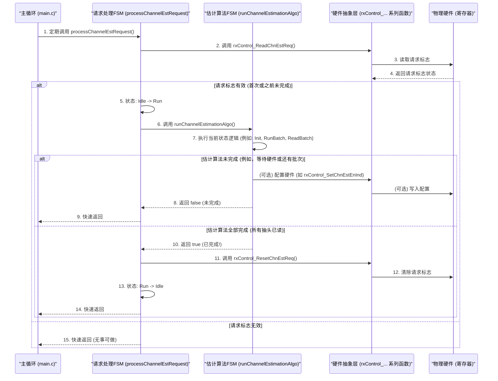

# Chapter 5: 信道估计 (Channel Estimation)


欢迎来到 `source` 项目固件教程的第五章！在上一章 [时钟调理校准 (Clk Cond Cal)](04_时钟调理校准__clk_cond_cal__.md) 中，我们学习了固件如何通过精密的状态机来校准ADC时钟的占空比和相位，以确保精确的数据采样。现在，即使我们有了完美的时钟，信号在传输过程中仍然会受到各种干扰。本章，我们将探讨**信道估计 (Channel Estimation)**，了解固件是如何“侦察”信号传输路径的特性，为后续的信号恢复做好准备。

## 5.1 洞察传输路径：为什么需要信道估计？

想象一下，你在一间空旷的大厅里对着远处的朋友说话。你的声音可能会因为墙壁的反射而产生回声，或者因为距离太远而衰减。你的朋友听到的声音，就是原始声音经过这个“大厅”（即信道）调制后的结果。如果朋友想要准确理解你的话，他们的大脑需要下意识地“滤除”这些回声和补偿音量的减弱。

在数字通信中，信号在从发送端到接收端的过程中，会经过各种物理媒介，如电缆、光纤或无线空间。这个传输路径就是所谓的**信道 (Channel)**。信号在信道中传输时，会经历各种变化：

*   **衰减 (Attenuation)**：信号强度减弱，就像声音传远了会变小。
*   **失真 (Distortion)**：信号波形发生改变，例如产生回声（多径效应）。
*   **噪声 (Noise)**：信道中混入的各种干扰信号。

这些因素都会降低数据接收的准确性。如果我们能了解信道是如何“扭曲”信号的，我们就能在接收端尝试“反向扭曲”接收到的信号，从而恢复出原始信号。**信道估计**就是这样一个过程，它帮助我们分析和理解信号传输通道的特性。

这个功能就像声纳探测海底地形一样。固件会发送一些特殊的“探测信号”（或者利用已知的训练序列），然后分析接收到的信号，测量出一系列被称为**“抽头”（taps）** 的参数。这些抽头值共同描绘了信道的响应特性——即信道是如何对输入信号产生影响的。了解了这些信息后，接收器中的**均衡器 (Equalizer)** 就可以利用这些抽头值来补偿信道引入的衰减和失真，从而大大提高数据接收的准确性。

## 5.2 核心概念解析

让我们来认识一下信道估计中的几个关键概念：

*   **信道 (Channel)**：信号从发送端到接收端所经过的物理路径。它可以是电线、光纤、空气等。
*   **信道脉冲响应 (Channel Impulse Response)**：如果向信道输入一个非常短暂、理想的脉冲信号，信道输出的响应就称为信道脉冲响应。它完整地描述了信道的线性特性。
*   **抽头 (Taps)**：在数字信号处理中，信道脉冲响应通常用一系列离散的样本值来表示，这些样本值就称为“抽头”。每个抽头代表了信号在某个特定延迟下的强度和相位。你可以把它们想象成原始信号经过不同路径、不同延迟后到达接收端的多个“回声”的快照。
*   **信道估计 (Channel Estimation)**：通过分析已知的发送信号和对应的接收信号（或者仅分析接收信号的特定特征），来计算出信道抽头值的过程。
*   **均衡器 (Equalizer)**：接收器中的一个数字滤波器，它利用信道估计得到的抽头值来补偿信道对信号造成的影响，试图恢复原始信号。
*   **状态机 (State Machine)**：由于信道估计通常涉及多个步骤（配置硬件、启动测量、读取结果、处理数据），因此常使用状态机来管理这个过程，确保每一步都按顺序正确执行，正如我们在 [PMD层请求与状态机](03_pmd层请求与状态机_.md) 中学到的那样。

## 5.3 信道估计是如何工作的？

在 `source` 项目中，信道估计主要由 `chn_est.c` 文件中的逻辑实现。固件通常会通过一个状态机 (`runChannelEstimationAlgo`) 来分批计算和读取多达100个信道抽头。这个过程通常由更高层的请求（例如，在系统初始化后或链路状态改变时）触发。

### 5.3.1 谁发起了信道估计请求？

信道估计过程并不是凭空启动的。在我们的固件中，主控制循环会定期检查是否有信道估计的请求。

在 `main.c` 的主循环中，我们会看到这样的调用：
```c
// 来自 main.c (简化片段)
// ... (在 for 循环遍历每个通道 gActiveLane 内) ...
processChannelEstRequest();
// ...
```
这个 `processChannelEstRequest()` 函数（定义在 `chn_est.c` 中）就是信道估计模块的入口。它会检查是否有来自硬件或其他系统模块的请求。

`processChannelEstRequest()` 函数本身是一个简单的状态机，负责管理请求的生命周期：
```c
// 来自 chn_est.c (简化片段)
// gChannelEst 是一个全局数组，每个通道有一个对应的结构体实例
// gChannelEst[gActiveLane].mChannelEstReq 存储请求处理状态机的状态

void processChannelEstRequest()
{
    struct tChannelEstReq_t * vpChannelEstReq = &gChannelEst[gActiveLane].mChannelEstReq;

    switch (vpChannelEstReq->mState)
    {
        case eChannelEstReqState_Idle: // 空闲状态
        {
            // rxControl_ReadChnEstReq() 读取硬件寄存器，检查是否有信道估计请求标志
            if ((bool)rxControl_ReadChnEstReq() == false)
            {
                break; // 没有请求，保持空闲
            }
            // 有请求，转换到运行状态
            vpChannelEstReq->mState = eChannelEstReqState_Run;
            // 注意：这里没有 break，会直接进入下一个 case (FALLTHROUGH)
            // （在实际代码中，通常会在状态转换后返回，等待下一次主循环调用）
            // 为了简化，我们假设它能直接进入执行，但理解其非阻塞特性很重要
        }
        case eChannelEstReqState_Run: // 运行状态
        {
            // 调用核心的信道估计算法状态机
            bool vChnEstDone = runChannelEstimationAlgo();
            if (vChnEstDone == false)
            {
                break; // 估计算法还未完成，等待下一次调用
            }

            // 估计算法完成，清除请求标志，返回空闲状态
            rxControl_ResetChnEstReq(eChannelEstReqConst_ChnEstEnOffset); // 清除硬件中的请求标志
            vpChannelEstReq->mState = eChannelEstReqState_Idle;
            break;
        }
    }
}
```
这段代码展示了：
1.  在 `eChannelEstReqState_Idle` 状态，它通过 `rxControl_ReadChnEstReq()` 检查硬件是否有请求。
2.  如果有请求，它转换到 `eChannelEstReqState_Run` 状态，并调用 `runChannelEstimationAlgo()`。
3.  `runChannelEstimationAlgo()` 是实际执行信道估计的状态机。它会返回一个布尔值，`true` 表示估计完成，`false` 表示仍在进行中。
4.  如果 `runChannelEstimationAlgo()` 返回 `true`，则通过 `rxControl_ResetChnEstReq()` 清除硬件请求标志，并将状态机恢复到 `eChannelEstReqState_Idle`。

`rxControl_ReadChnEstReq()` 和 `rxControl_ResetChnEstReq()` 是与硬件交互的辅助函数，它们会读取或写入特定的硬件寄存器位来获取和清除请求。这些底层硬件操作我们将在 [硬件抽象与控制函数](06_硬件抽象与控制函数_.md) 中详细了解。

### 5.3.2 核心算法：`runChannelEstimationAlgo()`

`runChannelEstimationAlgo()` 函数是信道估计的核心，它也是一个状态机，负责分批获取所有100个抽头。

```c
// 来自 chn_est.c (全局变量和 runChannelEstimationAlgo 简化结构)
// 每个通道都有自己的信道估计数据结构
struct tChannelEst_t gChannelEst[NUM_LANES];

bool runChannelEstimationAlgo()
{
    bool vDone = false; // 标记整个信道估计过程是否完成
    // vpChannelEstFsm 指向当前活动通道的信道估计算法状态机
    struct tRxChannelEst_t * vpChannelEstFsm = &gChannelEst[gActiveLane].mChannelEstFsm;

    switch (vpChannelEstFsm->mChannelEstState) // mChannelEstState 是算法的当前状态
    {
        case eChannelEstState_Init: // 初始化状态
        {
            vpChannelEstFsm->mChannelEstInd = 0; // 当前处理的批次索引，从0开始
            vpChannelEstFsm->mCoeffRegOffset = 0; // 寄存器内抽头偏移量
            // mCoeffReg 指向存储抽头系数的硬件寄存器的起始地址
            // (struct tChannelEstReg_t*) 是类型转换，告诉编译器如何解读这块内存
            vpChannelEstFsm->mCoeffReg = (struct tChannelEstReg_t*)&READ_REG(RX_REG_BASE, RX__STATUS99);

            // 根据固件配置 gFwCfg (来自 [固件配置管理](01_固件配置管理_.md)) 设置快速模式参数
            if (gFwCfg.mGlobalFastMode >= eFastMode_Fast1 || gFwCfg.mRxChnEstFastMode >= eFastMode_Fast1)
            {
                // 如果启用了快速模式，使用更快的参数配置硬件
                rxControl_SetChnEstNtopLdVal(eChannelEstConst_NTopFastsim, eChannelEstConst_LdValFastsim);
            }
            else
            {
                // 正常模式下的参数
                rxControl_SetChnEstNtopLdVal(eChannelEstConst_NTop, eChannelEstConst_LdVal);
            }

            // 使能信道估计器模式并设置训练增益
            rxControl_SetChnEstModeGain(eChannelEstConst_ModeEnable, eChannelEstConst_CoeffTrainGain);

            // 启动硬件的自适应过程 (一个硬件状态机)
            startRxModeCtlFsm(eChannelEstConst_AdaptStart, eChannelEstConst_AdaptEnd);

            vpChannelEstFsm->mChannelEstState = eChannelEstState_RunChannelEst; // 进入下一状态
            break; // 本次调用完成，返回 false (因为 vDone 仍为 false)
        }

        case eChannelEstState_RunChannelEst: // 运行信道估计（针对当前批次）
        {
            // 使能信道估计器，并根据 mChannelEstInd 配置硬件以计算特定批次的抽头
            // getStartIndexFromInd() 会根据 mChannelEstInd 计算出索引起始值
            rxControl_SetChnEstEnInd(); // 这个函数内部会调用 getStartIndexFromInd()

            vpChannelEstFsm->mChannelEstState = eChannelEstState_ReadChannelEst; // 进入读取状态
            break;
        }

        case eChannelEstState_ReadChannelEst: // 读取信道估计结果（当前批次）
        {
            // 等待硬件完成当前批次的抽头计算 (训练完成)
            // rxControl_ReadChnEstDone() 会检查硬件状态位
            if (rxControl_ReadChnEstDone() == 0)
            {
                break; // 硬件还未完成，等待下一次调用
            }

            // 硬件已完成，读取并存储这一批次的5个抽头系数
            for (int vI = 0; vI < 5; ++vI) // 每批读取5个抽头
            {
                const uint32_t vCoeffIndex = vpChannelEstFsm->mChannelEstInd * 5 + vI; // 计算全局抽头索引

                // 特殊处理：第80个抽头系数的寄存器地址不连续，需要跳到新的地址
                if (vCoeffIndex == eChannelEstConst_GapCoeffIndex) // eChannelEstConst_GapCoeffIndex 通常是 80
                {
                    vpChannelEstFsm->mCoeffReg = (struct tChannelEstReg_t*)&READ_REG(RX_REG_BASE, RX__STATUS131);
                    vpChannelEstFsm->mCoeffRegOffset = 0; // 重置寄存器内偏移
                }

                // 从指向的硬件寄存器结构中读取抽头值
                uint32_t vCoeff;
                if (vpChannelEstFsm->mCoeffRegOffset == 0) { vCoeff = vpChannelEstFsm->mCoeffReg->mCoeff0; }
                else if (vpChannelEstFsm->mCoeffRegOffset == 1) { vCoeff = vpChannelEstFsm->mCoeffReg->mCoeff1; }
                else { vCoeff = vpChannelEstFsm->mCoeffReg->mCoeff2; } // 一个寄存器通常包含2或3个抽头值

                // 将读取到的抽头值存储到全局数组中
                vpChannelEstFsm->mChannelEstCoeff[vCoeffIndex] = vCoeff;

                // 移动到寄存器中的下一个抽头位置
                ++vpChannelEstFsm->mCoeffRegOffset;
                if (vpChannelEstFsm->mCoeffRegOffset >= eChannelEstConst_CoeffsPerReg) // eChannelEstConst_CoeffsPerReg 通常是3
                {
                    // 当前寄存器的所有抽头已读完，移动到下一个寄存器地址
                    ++vpChannelEstFsm->mCoeffReg; // 指针移动到下一个相邻的寄存器结构
                    vpChannelEstFsm->mCoeffRegOffset = 0; // 重置寄存器内偏移
                }
            }

            // 禁用当前批次的信道估计器
            rxControl_ResetChnEstEn();

            // 更新批次索引，准备处理下一批
            vpChannelEstFsm->mChannelEstInd++;

            // 检查是否所有100个抽头都已训练和记录完毕
            if (vpChannelEstFsm->mChannelEstInd == eChannelEstConst_IndMax) // eChannelEstConst_IndMax 通常是 20 (100/5)
            {
                vDone = true; // 所有批次完成！
                vpChannelEstFsm->mChannelEstState = eChannelEstState_Init; // 重置状态机到初始状态，备下次使用
            }
            else
            {
                // 还有更多批次要处理，回到运行状态准备下一批
                vpChannelEstFsm->mChannelEstState = eChannelEstState_RunChannelEst;
            }
            break;
        }
    }
    return vDone; // 返回整个过程是否完成
}
```

让我们逐步分析这个状态机：
1.  **`eChannelEstState_Init` (初始化状态)**:
    *   设置批次索引 `mChannelEstInd` 为0。
    *   `mCoeffReg` 指针被设置为第一个存放抽头系数的硬件寄存器地址 (例如 `RX__STATUS99`)。硬件寄存器通常是内存映射的，所以可以用指针访问。
    *   根据全局配置 `gFwCfg` (来自 [固件配置管理](01_固件配置管理_.md)) 中的快速模式设置，调用 `rxControl_SetChnEstNtopLdVal()` 来配置硬件信道估计器的一些参数（如积分时间等）。
    *   调用 `rxControl_SetChnEstModeGain()` 来使能硬件的信道估计模式并设定一个训练增益。
    *   调用 `startRxModeCtlFsm()` 启动一个硬件自适应控制状态机，这可能是让硬件进入准备好进行抽头计算的状态。
    *   最后，将状态切换到 `eChannelEstState_RunChannelEst`。

2.  **`eChannelEstState_RunChannelEst` (运行信道估计状态)**:
    *   此状态负责为**当前批次**的抽头计算做准备。
    *   它调用 `rxControl_SetChnEstEnInd()`。这个函数会告诉硬件：“请开始计算从某个索引起始的这一批抽头”。起始索引由 `mChannelEstInd` 和一个辅助函数 `getStartIndexFromInd()` 决定，例如，如果 `mChannelEstInd` 是0，起始抽头可能是第4个（硬件可能跳过最前面几个）。
        ```c
        // 来自 chn_est.c
        uint32_t getStartIndexFromInd()
        {
            struct tRxChannelEst_t * vpChannelEstFsm = &gChannelEst[gActiveLane].mChannelEstFsm;
            // chn_est 索引 (mChannelEstInd)  起始抽头索引
            //      00                          04
            //      01                          09 (0*5+4 = 4, 1*5+4 = 9, ... )
            //      ..                          ..
            return vpChannelEstFsm->mChannelEstInd * 5 + 4;
        }
        ```
    *   然后状态切换到 `eChannelEstState_ReadChannelEst`。

3.  **`eChannelEstState_ReadChannelEst` (读取信道估计状态)**:
    *   这是实际读取抽头值的地方。
    *   首先，它调用 `rxControl_ReadChnEstDone()` 来检查硬件是否已经完成了当前这批抽头的计算。如果硬件还没算完，函数就直接 `break`，返回 `false`，主循环下次再调用时会再次进入这个状态检查。这体现了**非阻塞**的设计。
    *   当硬件完成后，进入一个 `for` 循环，读取这一批次的5个抽头系数。
    *   `vCoeffIndex` 计算出当前抽头在总共100个抽头中的绝对索引。
    *   有一个特殊情况处理 `eChannelEstConst_GapCoeffIndex` (通常是抽头80)。由于硬件设计的原因，第80个抽头系数可能存储在一个不连续的寄存器地址 (`RX__STATUS131`)，所以需要更新 `mCoeffReg` 指针。
    *   通过 `mCoeffReg->mCoeff0`、`mCoeffReg->mCoeff1`、`mCoeffReg->mCoeff2` 从硬件寄存器中读取实际的抽头值。一个32位硬件寄存器可能存放2到3个抽头值（每个抽头值占若干位）。`mCoeffRegOffset` 用于在单个寄存器内的多个抽头值之间切换。
    *   读取到的抽头值 `vCoeff` 被存储在 `vpChannelEstFsm->mChannelEstCoeff[vCoeffIndex]` 数组中。
    *   当一个寄存器中的所有抽头（通常是3个，由 `eChannelEstConst_CoeffsPerReg` 定义）被读完后，`mCoeffReg` 指针会递增，指向物理上相邻的下一个寄存器（除非遇到上面说的地址跳变）。
    *   读完一批5个抽头后，调用 `rxControl_ResetChnEstEn()` 禁用信道估计器，为下一批做准备。
    *   `mChannelEstInd` 批次索引加1。
    *   如果 `mChannelEstInd` 达到了 `eChannelEstConst_IndMax` (例如20，表示20批 * 5个/批 = 100个抽头已全部读取)，那么整个信道估计过程完成 (`vDone = true`)，状态机回到 `eChannelEstState_Init`。
    *   否则，状态机回到 `eChannelEstState_RunChannelEst`，准备处理下一批抽头。

这个 `Init -> Run -> Read -> (Run -> Read ... ) -> Init` 的循环会一直持续，直到所有100个抽头都被成功获取。由于每次调用 `runChannelEstimationAlgo()` 只执行状态机的一小部分工作（尤其是当等待硬件时会快速返回），所以它不会阻塞 [主控制循环与请求处理](02_主控制循环与请求处理_.md) 中的其他任务。

## 5.4 内部实现：抽丝剥茧看流程

让我们用一个更宏观的视角和一个简化的序列图来看看当一个信道估计请求发生时，固件内部是如何一步步工作的。

### 5.4.1 非代码视角的工作流程

1.  **请求信号**：硬件或系统中的某个模块通过设置一个特殊的寄存器位，发出信道估计请求。
2.  **主循环捕获**：`main()` 函数在其主循环中，为当前活动的通道 (`gActiveLane`) 调用 `processChannelEstRequest()`。
3.  **请求处理启动**：`processChannelEstRequest()` 检测到请求信号，将其内部状态从未激活（`eChannelEstReqState_Idle`）切换到运行（`eChannelEstReqState_Run`），并调用核心函数 `runChannelEstimationAlgo()`。
4.  **算法初始化 (`runChannelEstimationAlgo()` - `eChannelEstState_Init`)**:
    *   重置内部批次计数器等。
    *   配置硬件参数（如训练增益、快速模式相关设置）。
    *   启动硬件的自适应过程。
    *   切换到 `eChannelEstState_RunChannelEst` 状态。
    *   `runChannelEstimationAlgo()` 返回 `false` (未完成)。`processChannelEstRequest()` 也因此返回，不阻塞主循环。
5.  **处理第一批抽头 (后续调用中)**:
    *   `runChannelEstimationAlgo()` 进入 `eChannelEstState_RunChannelEst`。
    *   配置硬件，告诉它计算第一批（例如，第0到第4个有效抽头，索引可能是4-8）。
    *   切换到 `eChannelEstState_ReadChannelEst` 状态。返回 `false`。
    *   再下一次调用，进入 `eChannelEstState_ReadChannelEst`。
    *   检查硬件是否完成计算。如果未完成，返回 `false`。
    *   如果硬件完成，则从特定寄存器地址（如 `RX__STATUS99` 开始）读取5个抽头值，存入 `mChannelEstCoeff` 数组。
    *   更新批次计数器，切换回 `eChannelEstState_RunChannelEst` (如果还有批次) 或 `eChannelEstState_Init` (如果全部完成)。返回 `false` (如果未全部完成) 或 `true` (如果全部完成)。
6.  **循环处理**：步骤5会重复执行，每次处理新的一批抽头，直到所有100个抽头都被读取。
7.  **算法完成**：当 `runChannelEstimationAlgo()` 返回 `true` 时，表示所有抽头都已获取。
8.  **请求处理结束**：`processChannelEstRequest()` 看到 `runChannelEstimationAlgo()` 返回 `true`，于是调用 `rxControl_ResetChnEstReq()` 清除硬件中的请求信号，并将自身状态恢复到 `eChannelEstReqState_Idle`。

### 5.4.2 序列图示例

下面是一个简化的序列图，展示了信道估计的交互过程：



这个图清晰地展示了：
*   **分层状态机**：`processChannelEstRequest` 管理顶层请求，`runChannelEstimationAlgo` 管理核心算法步骤。
*   **非阻塞轮询**：主循环不断调用，如果任务未完成，各函数会快速返回，不阻塞系统。
*   **硬件交互**：通过 `rxControl_` 系列函数与硬件寄存器进行读写，以控制硬件行为和获取结果。这些函数是 [硬件抽象与控制函数](06_硬件抽象与控制函数_.md) 的一部分。

所有获取到的100个抽头系数最终存储在 `gChannelEst[gActiveLane].mChannelEstFsm.mChannelEstCoeff` 数组中。这些数据随后可以被固件的其他部分（例如均衡器配置逻辑）使用，或者被外部系统读取以进行更详细的信道分析。

## 5.5 总结

在本章中，我们了解了**信道估计 (Channel Estimation)** 的重要性及其在 `source` 项目中的实现方式：

*   **目标**：分析信号传输路径（信道）的特性，通过测量一系列“抽头”来了解信号在传输中经历的衰减和失真。
*   **为何重要**：信道估计获得的信息对于后续的信号补偿和均衡至关重要，有助于提高数据接收的准确性。
*   **核心过程**：通过一个名为 `runChannelEstimationAlgo` 的状态机，分批（每批5个）计算和读取总共100个信道抽头。
*   **实现机制**：
    *   由 `main.c` 中的 `processChannelEstRequest` 函数响应硬件请求并调用 `runChannelEstimationAlgo`。
    *   `runChannelEstimationAlgo` 包含 `Init`（初始化）、`RunChannelEst`（配置当前批次硬件进行计算）、`ReadChannelEst`（等待硬件完成并读取抽头值）等状态。
    *   通过读取特定的硬件寄存器（如 `RX__STATUS99` 起始的一系列寄存器）来获取抽头值。
    *   考虑到硬件寄存器地址可能存在不连续的情况（如抽头80）。
    *   整个过程是**非阻塞**的，与主控制循环良好协作。
    *   [固件配置管理](01_固件配置管理_.md) 中的快速模式设置可以影响信道估计的行为。
*   **结果用途**：得到的抽头系数存储在 `gChannelEst` 全局结构中，可用于配置接收器均衡器或供外部诊断。

理解了信道估计，我们就明白了固件是如何“感知”其通信环境的。这些信息是实现鲁棒通信的基础。固件中还有许多其他与硬件直接交互的功能。

在下一章中，我们将深入探讨固件是如何通过一组通用的函数来控制和查询底层硬件的，即 [硬件抽象与控制函数](06_硬件抽象与控制函数_.md)。这将揭示 `rxControl_` 这类函数背后的秘密。

---

Generated by [AI Codebase Knowledge Builder](https://github.com/The-Pocket/Tutorial-Codebase-Knowledge)